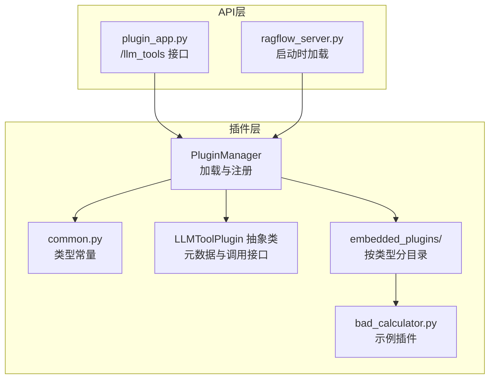
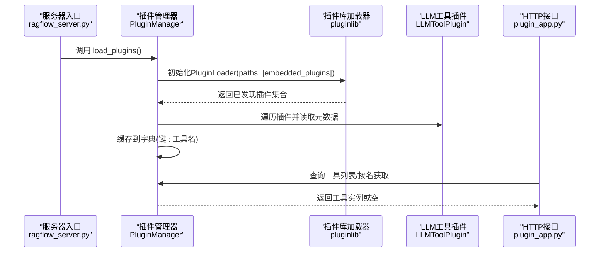
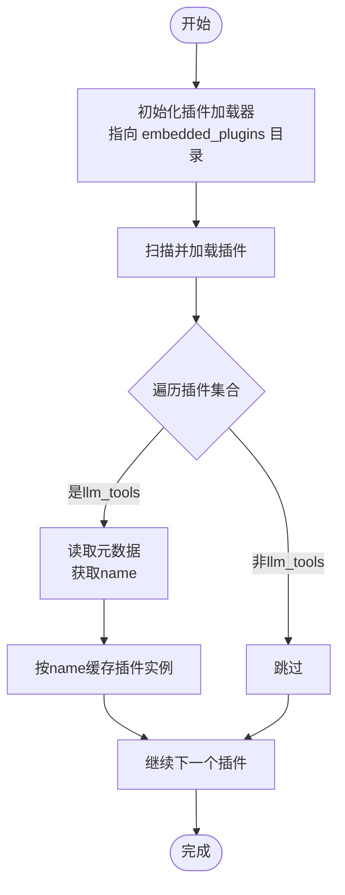
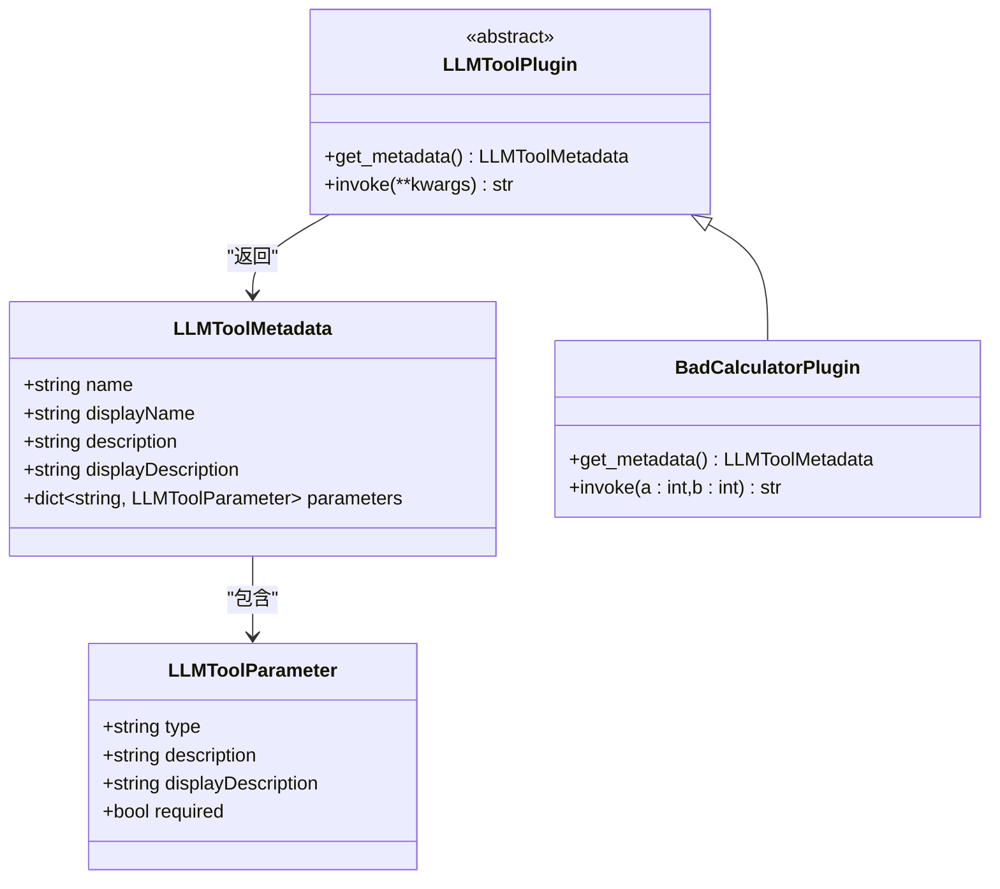
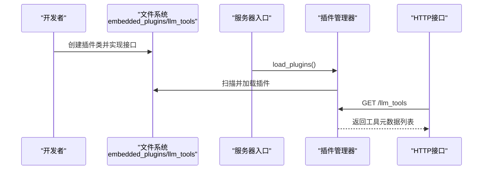
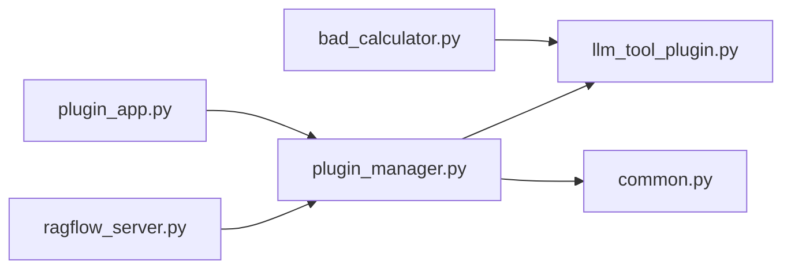

# 插件架构设计

<cite>
**本文引用的文件**
- [plugin/plugin_manager.py](file://plugin/plugin_manager.py)
- [plugin/__init__.py](file://plugin/__init__.py)
- [plugin/common.py](file://plugin/common.py)
- [plugin/llm_tool_plugin.py](file://plugin/llm_tool_plugin.py)
- [plugin/embedded_plugins/llm_tools/bad_calculator.py](file://plugin/embedded_plugins/llm_tools/bad_calculator.py)
- [plugin/README.md](file://plugin/README.md)
- [api/apps/plugin_app.py](file://api/apps/plugin_app.py)
- [api/ragflow_server.py](file://api/ragflow_server.py)
</cite>

## 目录
1. [引言](#引言)
2. [项目结构](#项目结构)
3. [核心组件](#核心组件)
4. [架构总览](#架构总览)
5. [详细组件分析](#详细组件分析)
6. [依赖关系分析](#依赖关系分析)
7. [性能考量](#性能考量)
8. [故障排查指南](#故障排查指南)
9. [结论](#结论)
10. [附录](#附录)

## 引言
本文件系统性阐述RAGFlow插件架构的设计理念与实现细节，重点覆盖插件发现机制、加载策略、生命周期管理、类型分类与注册机制、依赖与版本控制策略，以及最佳实践与扩展方案。当前系统以“llm_tools”插件类型为核心，通过统一的插件管理器集中加载与分发，供上层API服务调用。

## 项目结构
插件体系位于独立的plugin包中，采用“按类型分目录”的组织方式，便于未来扩展其他插件类型。核心文件职责如下：
- plugin/plugin_manager.py：插件管理器，负责扫描、加载、缓存与查询插件实例
- plugin/common.py：插件类型常量定义（当前仅支持llm_tools）
- plugin/llm_tool_plugin.py：LLM工具插件抽象基类与元数据模型
- plugin/embedded_plugins/llm_tools/bad_calculator.py：内置示例插件，演示插件实现规范
- plugin/README.md：插件开发与使用指南
- api/apps/plugin_app.py：对外提供LLM工具列表的HTTP接口
- api/ragflow_server.py：服务启动时初始化并加载插件

图表来源
- [plugin/plugin_manager.py:11-45](file://plugin/plugin_manager.py#L11-L45)
- [plugin/common.py:1](file://plugin/common.py#L1)
- [plugin/llm_tool_plugin.py:22-31](file://plugin/llm_tool_plugin.py#L22-L31)
- [plugin/embedded_plugins/llm_tools/bad_calculator.py:5-37](file://plugin/embedded_plugins/llm_tools/bad_calculator.py#L5-L37)
- [api/apps/plugin_app.py:24-30](file://api/apps/plugin_app.py#L24-L30)
- [api/ragflow_server.py:132](file://api/ragflow_server.py#L132)

章节来源
- [plugin/plugin_manager.py:11-45](file://plugin/plugin_manager.py#L11-L45)
- [plugin/common.py:1](file://plugin/common.py#L1)
- [plugin/llm_tool_plugin.py:22-31](file://plugin/llm_tool_plugin.py#L22-L31)
- [plugin/embedded_plugins/llm_tools/bad_calculator.py:5-37](file://plugin/embedded_plugins/llm_tools/bad_calculator.py#L5-L37)
- [plugin/README.md:1-98](file://plugin/README.md#L1-L98)
- [api/apps/plugin_app.py:24-30](file://api/apps/plugin_app.py#L24-L30)
- [api/ragflow_server.py:132](file://api/ragflow_server.py#L132)

## 核心组件
- 插件类型常量：定义插件类型标识，当前为“llm_tools”
- LLMToolPlugin抽象类：定义插件元数据接口与调用接口，约束插件实现
- PluginManager：负责扫描embedded_plugins目录、加载插件、缓存并提供查询接口
- 全局插件管理器：在模块导入时即创建全局实例，供API层直接使用
- 示例插件：bad_calculator作为最小可用实现，展示元数据与调用方法

章节来源
- [plugin/common.py:1](file://plugin/common.py#L1)
- [plugin/llm_tool_plugin.py:22-31](file://plugin/llm_tool_plugin.py#L22-L31)
- [plugin/plugin_manager.py:11-45](file://plugin/plugin_manager.py#L11-L45)
- [plugin/embedded_plugins/llm_tools/bad_calculator.py:5-37](file://plugin/embedded_plugins/llm_tools/bad_calculator.py#L5-L37)
- [plugin/__init__.py:1-3](file://plugin/__init__.py#L1-L3)

## 架构总览
插件系统采用“集中加载、按需查询”的架构模式。服务启动阶段由服务器入口调用插件管理器完成一次性加载；随后API路由通过全局管理器返回工具清单或按名称检索具体工具。

图表来源
- [api/ragflow_server.py:132](file://api/ragflow_server.py#L132)
- [plugin/plugin_manager.py:17-28](file://plugin/plugin_manager.py#L17-L28)
- [plugin/llm_tool_plugin.py:22-31](file://plugin/llm_tool_plugin.py#L22-L31)
- [api/apps/plugin_app.py:26-30](file://api/apps/plugin_app.py#L26-L30)

## 详细组件分析

### 插件管理器（PluginManager）实现原理
- 插件发现与加载
  - 使用插件库加载器对embedded_plugins目录进行递归扫描
  - 遍历加载结果，记录每个插件的类型与版本信息
- 元数据提取与注册
  - 对于类型为“llm_tools”的插件，调用其元数据接口获取描述信息
  - 将插件按元数据中的“name”字段缓存至字典，便于后续快速查找
- 插件实例化与查询
  - 提供获取全部工具、按名称获取单个工具、按名称列表批量获取的接口
- 生命周期
  - 在服务器启动阶段一次性加载，运行期内保持只读状态

图表来源
- [plugin/plugin_manager.py:17-28](file://plugin/plugin_manager.py#L17-L28)

章节来源
- [plugin/plugin_manager.py:11-45](file://plugin/plugin_manager.py#L11-L45)

### LLMToolPlugin抽象类与元数据模型
- 抽象接口
  - 类方法：get_metadata，返回工具元数据
  - 实例方法：invoke，接收LLM生成的参数并返回字符串结果
- 元数据模型
  - 工具基础信息：name、displayName、description、displayDescription
  - 参数定义：参数名到参数对象的映射，参数对象包含类型、描述、显示描述、是否必填
- OpenAI工具格式转换
  - 提供从插件元数据到OpenAI函数调用规范的转换函数，便于与外部模型对接

图表来源
- [plugin/llm_tool_plugin.py:22-31](file://plugin/llm_tool_plugin.py#L22-L31)
- [plugin/embedded_plugins/llm_tools/bad_calculator.py:5-37](file://plugin/embedded_plugins/llm_tools/bad_calculator.py#L5-L37)

章节来源
- [plugin/llm_tool_plugin.py:7-51](file://plugin/llm_tool_plugin.py#L7-L51)
- [plugin/embedded_plugins/llm_tools/bad_calculator.py:5-37](file://plugin/embedded_plugins/llm_tools/bad_calculator.py#L5-L37)

### 插件类型分类与注册机制
- 当前类型
  - llm_tools：面向大语言模型的工具插件，用于执行外部能力
- 注册机制
  - 插件通过父类型注解声明所属类型
  - 管理器仅对匹配类型的插件进行元数据读取与注册
  - 注册键为工具元数据中的name字段，确保唯一性

章节来源
- [plugin/common.py:1](file://plugin/common.py#L1)
- [plugin/llm_tool_plugin.py:22](file://plugin/llm_tool_plugin.py#L22)
- [plugin/plugin_manager.py:26-28](file://plugin/plugin_manager.py#L26-L28)

### 插件依赖管理与版本控制
- 版本控制
  - 插件需提供版本字段，加载日志会输出版本信息，便于追踪
- 依赖管理
  - 插件间无显式依赖声明；当前实现不提供自动解析与冲突检测
  - 建议通过插件命名与版本号避免冲突，并在开发测试阶段验证工具组合行为

章节来源
- [plugin/plugin_manager.py:24](file://plugin/plugin_manager.py#L24)
- [plugin/embedded_plugins/llm_tools/bad_calculator.py:10](file://plugin/embedded_plugins/llm_tools/bad_calculator.py#L10)

### 插件开发与集成流程
- 开发步骤
  - 在embedded_plugins/llm_tools下创建插件文件
  - 定义类继承LLMToolPlugin，实现get_metadata与invoke
  - 在类上设置版本字段
- 集成与使用
  - 服务器启动时自动加载插件
  - 通过HTTP接口获取工具清单，或按名称检索工具

图表来源
- [plugin/README.md:13-28](file://plugin/README.md#L13-L28)
- [api/ragflow_server.py:132](file://api/ragflow_server.py#L132)
- [api/apps/plugin_app.py:26-30](file://api/apps/plugin_app.py#L26-L30)

章节来源
- [plugin/README.md:13-98](file://plugin/README.md#L13-L98)
- [api/ragflow_server.py:132](file://api/ragflow_server.py#L132)
- [api/apps/plugin_app.py:24-30](file://api/apps/plugin_app.py#L24-L30)

## 依赖关系分析
- 模块耦合
  - 插件管理器依赖插件库加载器与插件抽象类
  - API层仅依赖全局插件管理器，低耦合
- 外部依赖
  - 插件库加载器负责实际的插件发现与实例化
- 可能的循环依赖
  - 未见循环导入迹象；插件管理器与API层通过全局实例交互

图表来源
- [api/ragflow_server.py:132](file://api/ragflow_server.py#L132)
- [plugin/plugin_manager.py:17-28](file://plugin/plugin_manager.py#L17-L28)
- [plugin/llm_tool_plugin.py:22-31](file://plugin/llm_tool_plugin.py#L22-L31)
- [plugin/common.py:1](file://plugin/common.py#L1)
- [api/apps/plugin_app.py:26-30](file://api/apps/plugin_app.py#L26-L30)
- [plugin/embedded_plugins/llm_tools/bad_calculator.py:5-37](file://plugin/embedded_plugins/llm_tools/bad_calculator.py#L5-L37)

章节来源
- [plugin/plugin_manager.py:11-45](file://plugin/plugin_manager.py#L11-L45)
- [api/apps/plugin_app.py:24-30](file://api/apps/plugin_app.py#L24-L30)
- [api/ragflow_server.py:132](file://api/ragflow_server.py#L132)

## 性能考量
- 加载时机
  - 插件在服务器启动时一次性加载，运行期无动态重载逻辑，避免了并发下的状态竞争
- 查询复杂度
  - 按名称查询为哈希表操作，时间复杂度O(1)，批量查询线性遍历，适合工具数量适中的场景
- I/O与日志
  - 加载过程包含日志输出，建议在生产环境合理配置日志级别，避免过多I/O开销

## 故障排查指南
- 插件未被加载
  - 检查插件文件是否位于embedded_plugins/llm_tools目录
  - 确认插件类正确继承LLMToolPlugin并实现必要接口
  - 查看启动日志中是否存在加载失败信息
- 工具不可用
  - 通过HTTP接口确认工具是否出现在列表中
  - 检查工具元数据中的name是否与调用方一致
- 版本问题
  - 若存在同名不同版本的工具，后加载的版本会覆盖前者；建议通过版本号与命名区分

章节来源
- [plugin/plugin_manager.py:24](file://plugin/plugin_manager.py#L24)
- [api/apps/plugin_app.py:26-30](file://api/apps/plugin_app.py#L26-L30)
- [plugin/README.md:23-31](file://plugin/README.md#L23-L31)

## 结论
该插件架构以“llm_tools”为核心，通过集中加载与缓存实现了简单高效的插件管理。当前设计强调易用性与可扩展性，未来可在以下方面演进：引入插件依赖声明与冲突检测、支持动态热加载、完善插件生命周期钩子、增强版本与兼容性管理。现有实现已满足基础工具扩展需求，并为后续增强提供了清晰的扩展点。

## 附录
- 最佳实践
  - 命名规范：工具名应全局唯一且语义明确；版本号遵循语义化版本
  - 接口设计：严格实现get_metadata与invoke；参数类型与描述保持一致
  - 错误处理：在invoke中捕获并记录异常，返回可读的错误信息
  - 文档与国际化：使用display*字段配合前端i18n机制
- 扩展方案
  - 新增插件类型：在common中新增类型常量，在管理器中添加对应分支
  - 生命周期钩子：在抽象类中增加初始化/销毁回调接口
  - 动态加载：在管理器中加入卸载与重载逻辑，结合文件监控