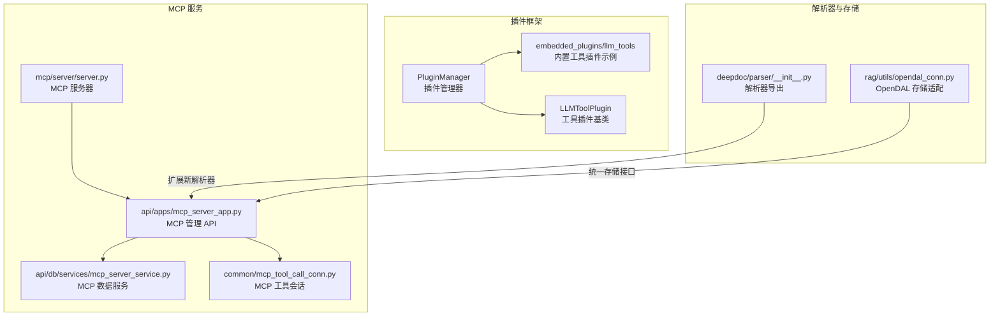
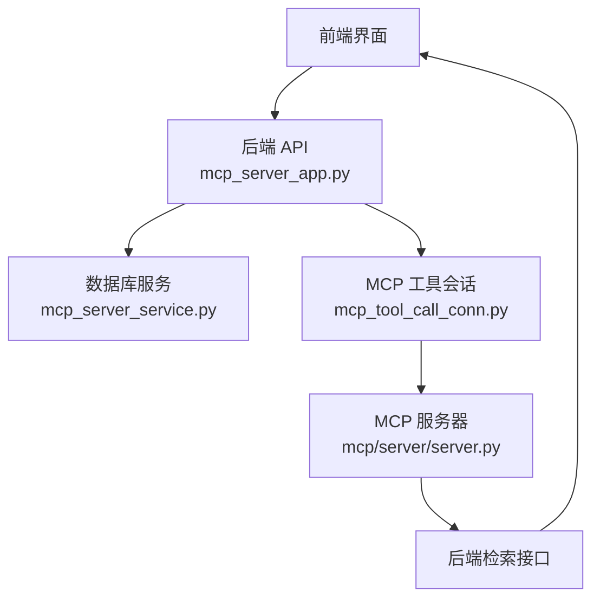
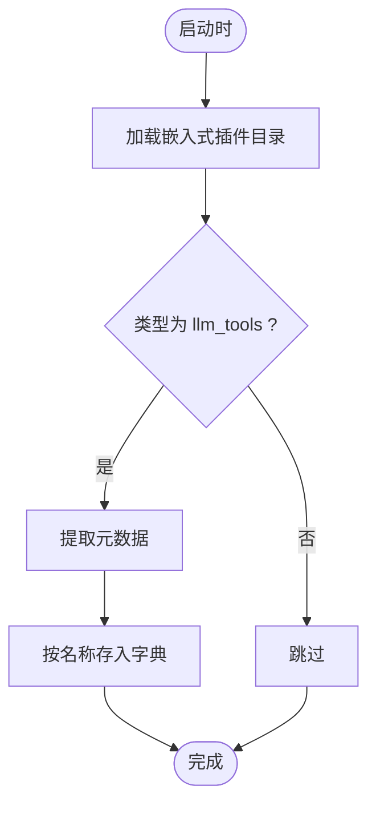
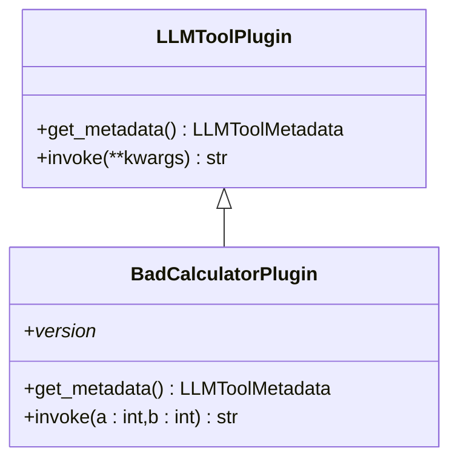
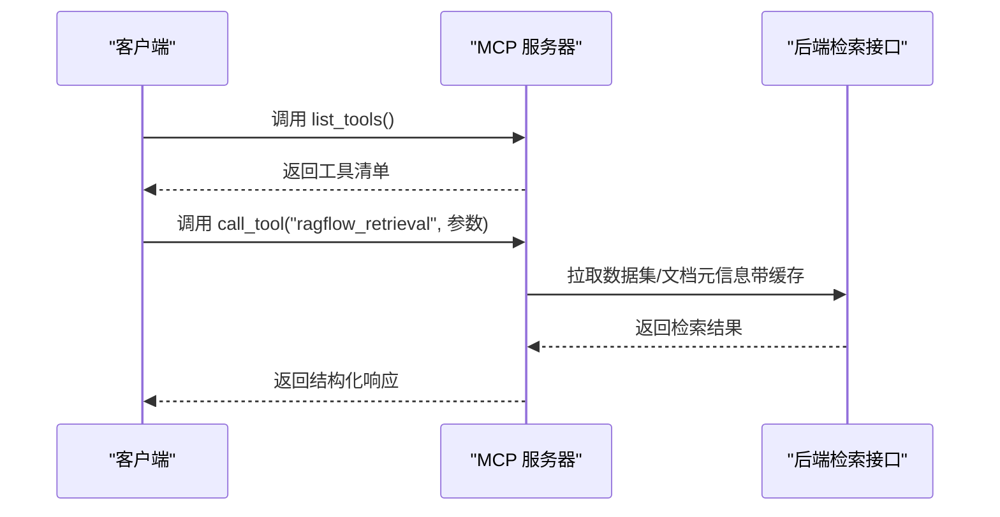
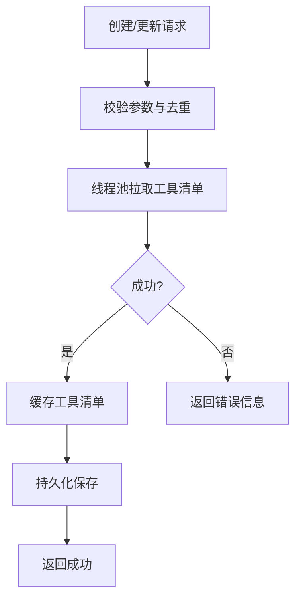
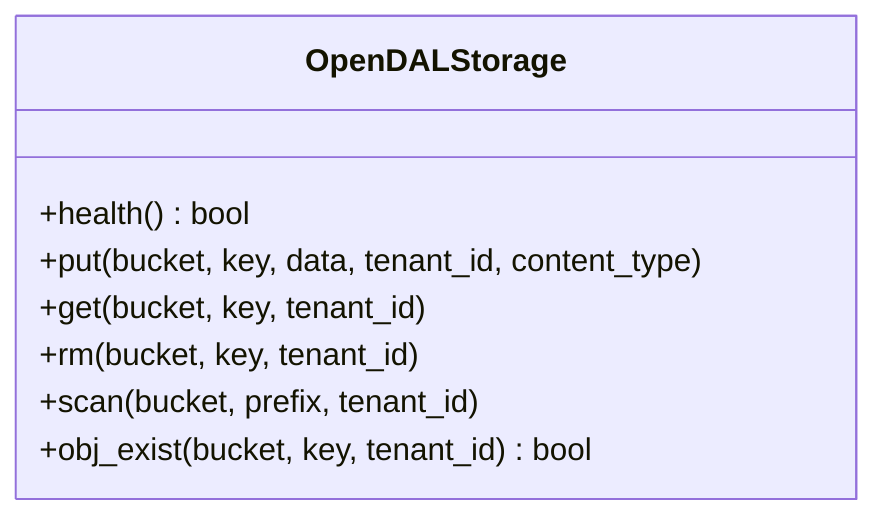
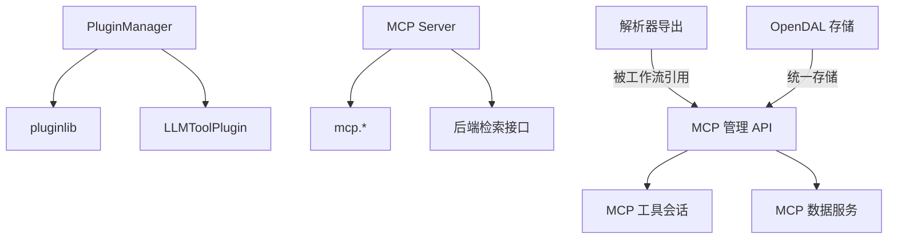

# 插件系统

<cite>
**本文引用的文件**
- [plugin/__init__.py](file://plugin/__init__.py)
- [plugin/plugin_manager.py](file://plugin/plugin_manager.py)
- [plugin/llm_tool_plugin.py](file://plugin/llm_tool_plugin.py)
- [plugin/common.py](file://plugin/common.py)
- [plugin/README.md](file://plugin/README.md)
- [plugin/embedded_plugins/llm_tools/bad_calculator.py](file://plugin/embedded_plugins/llm_tools/bad_calculator.py)
- [mcp/server/server.py](file://mcp/server/server.py)
- [mcp/client/client.py](file://mcp/client/client.py)
- [api/apps/mcp_server_app.py](file://api/apps/mcp_server_app.py)
- [api/db/services/mcp_server_service.py](file://api/db/services/mcp_server_service.py)
- [common/mcp_tool_call_conn.py](file://common/mcp_tool_call_conn.py)
- [deepdoc/parser/__init__.py](file://deepdoc/parser/__init__.py)
- [rag/utils/opendal_conn.py](file://rag/utils/opendal_conn.py)
- [docs/develop/mcp/_category_.json](file://docs/develop/mcp/_category_.json)
- [docs/develop/mcp/launch_mcp_server.md](file://docs/develop/mcp/launch_mcp_server.md)
- [docs/develop/mcp/mcp_client_example.md](file://docs/develop/mcp/mcp_client_example.md)
- [docs/develop/mcp/mcp_tools.md](file://docs/develop/mcp/mcp_tools.md)
</cite>

## 目录
1. [简介](#简介)
2. [项目结构](#项目结构)
3. [核心组件](#核心组件)
4. [架构总览](#架构总览)
5. [详细组件分析](#详细组件分析)
6. [依赖分析](#依赖分析)
7. [性能考量](#性能考量)
8. [故障排查指南](#故障排查指南)
9. [结论](#结论)
10. [附录](#附录)

## 简介
本文件面向开发者与使用者，系统化梳理 RAGFlow 的插件体系：包括插件发现与加载、生命周期管理、工具插件（LLM Tools）开发流程、解析器插件扩展、存储插件适配、以及 MCP（Model Context Protocol）协议支持与最佳实践。文档以代码为依据，辅以图示与来源标注，帮助快速理解与高效开发。

## 项目结构
围绕插件系统的关键目录与文件如下：
- 插件框架与工具插件
  - plugin 目录：插件管理器、工具插件基类、通用常量、示例插件
- MCP 协议服务端与客户端
  - mcp/server：RAGFlow MCP 服务器实现，含认证、工具清单与调用
  - mcp/client：MCP 客户端示例，演示连接与调用
  - api/apps/mcp_server_app.py：后端 API，管理 MCP 服务器配置、工具缓存与测试
  - api/db/services/mcp_server_service.py：MCP 服务器数据访问层
  - common/mcp_tool_call_conn.py：MCP 工具会话连接封装
- 解析器插件
  - deepdoc/parser：PDF/Word/Excel/PPT/HTML/JSON/Markdown/TXT 等解析器导出入口
- 存储插件
  - rag/utils/opendal_conn.py：OpenDAL 统一存储适配器示例

**图表来源**
- [plugin/plugin_manager.py:11-46](file://plugin/plugin_manager.py#L11-L46)
- [plugin/llm_tool_plugin.py:22-52](file://plugin/llm_tool_plugin.py#L22-L52)
- [plugin/embedded_plugins/llm_tools/bad_calculator.py:5-38](file://plugin/embedded_plugins/llm_tools/bad_calculator.py#L5-L38)
- [mcp/server/server.py:337-715](file://mcp/server/server.py#L337-L715)
- [api/apps/mcp_server_app.py:1-440](file://api/apps/mcp_server_app.py#L1-L440)
- [api/db/services/mcp_server_service.py:22-93](file://api/db/services/mcp_server_service.py#L22-L93)
- [common/mcp_tool_call_conn.py](file://common/mcp_tool_call_conn.py)
- [deepdoc/parser/__init__.py:17-41](file://deepdoc/parser/__init__.py#L17-L41)
- [rag/utils/opendal_conn.py:66-101](file://rag/utils/opendal_conn.py#L66-L101)

**章节来源**
- [plugin/__init__.py:1-4](file://plugin/__init__.py#L1-L4)
- [plugin/plugin_manager.py:11-46](file://plugin/plugin_manager.py#L11-L46)
- [plugin/llm_tool_plugin.py:22-52](file://plugin/llm_tool_plugin.py#L22-L52)
- [plugin/common.py:1-1](file://plugin/common.py#L1-L1)
- [plugin/README.md:1-98](file://plugin/README.md#L1-L98)
- [plugin/embedded_plugins/llm_tools/bad_calculator.py:5-38](file://plugin/embedded_plugins/llm_tools/bad_calculator.py#L5-L38)
- [mcp/server/server.py:337-715](file://mcp/server/server.py#L337-L715)
- [mcp/client/client.py:22-48](file://mcp/client/client.py#L22-L48)
- [api/apps/mcp_server_app.py:1-440](file://api/apps/mcp_server_app.py#L1-L440)
- [api/db/services/mcp_server_service.py:22-93](file://api/db/services/mcp_server_service.py#L22-L93)
- [common/mcp_tool_call_conn.py](file://common/mcp_tool_call_conn.py)
- [deepdoc/parser/__init__.py:17-41](file://deepdoc/parser/__init__.py#L17-L41)
- [rag/utils/opendal_conn.py:66-101](file://rag/utils/opendal_conn.py#L66-L101)

## 核心组件
- 插件管理器（PluginManager）
  - 负责从嵌入式目录递归加载插件，过滤类型为“llm_tools”的插件，提取元数据并建立名称到插件实例的映射，提供按名检索与批量检索能力
- 工具插件基类（LLMToolPlugin）
  - 定义工具元数据结构（名称、显示名、描述、参数），抽象方法 get_metadata 与可选的 invoke（默认抛出未实现异常）
  - 提供将工具元数据转换为 OpenAI 风格函数定义的辅助方法
- 内置工具插件示例（BadCalculatorPlugin）
  - 展示如何继承基类、声明版本、实现元数据与调用逻辑
- MCP 服务器（RAGFlow MCP Server）
  - 实现 list_tools/call_tool，封装对后端检索接口的调用，支持自托管与多租户两种启动模式，提供 SSE 与 Streamable HTTP 两种传输
- MCP 管理 API（后端）
  - 提供 MCP 服务器的增删改查、导入导出、工具列表拉取、工具测试、缓存工具等能力
- 解析器插件（DeepDOC）
  - 汇聚 PDF/Word/Excel/PPT/HTML/JSON/Markdown/TXT 等解析器，便于在工作流中选择与配置
- 存储插件（OpenDAL）
  - 统一对象存储接口，支持多种后端（如 MinIO/S3/OSS 等），提供健康检查、读写删扫描等操作

**章节来源**
- [plugin/plugin_manager.py:11-46](file://plugin/plugin_manager.py#L11-L46)
- [plugin/llm_tool_plugin.py:22-52](file://plugin/llm_tool_plugin.py#L22-L52)
- [plugin/embedded_plugins/llm_tools/bad_calculator.py:5-38](file://plugin/embedded_plugins/llm_tools/bad_calculator.py#L5-L38)
- [mcp/server/server.py:376-493](file://mcp/server/server.py#L376-L493)
- [api/apps/mcp_server_app.py:29-440](file://api/apps/mcp_server_app.py#L29-L440)
- [deepdoc/parser/__init__.py:17-41](file://deepdoc/parser/__init__.py#L17-L41)
- [rag/utils/opendal_conn.py:66-101](file://rag/utils/opendal_conn.py#L66-L101)

## 架构总览
下图展示插件系统与 MCP 的整体交互关系：前端通过后端 API 管理 MCP 服务器，后端通过 MCP 工具会话连接到 MCP 服务器；MCP 服务器根据工具定义调用后端检索接口，返回结构化结果。

**图表来源**
- [api/apps/mcp_server_app.py:1-440](file://api/apps/mcp_server_app.py#L1-L440)
- [api/db/services/mcp_server_service.py:22-93](file://api/db/services/mcp_server_service.py#L22-L93)
- [common/mcp_tool_call_conn.py](file://common/mcp_tool_call_conn.py)
- [mcp/server/server.py:337-715](file://mcp/server/server.py#L337-L715)

## 详细组件分析

### 插件发现与加载（PluginManager）
- 发现路径
  - 从嵌入式目录递归加载插件，当前仅识别类型为“llm_tools”的插件
- 元数据提取
  - 对于匹配的插件，调用其元数据方法，构建名称到插件实例的字典
- 查询接口
  - 支持按名查询、批量查询、返回全部工具列表

**图表来源**
- [plugin/plugin_manager.py:17-29](file://plugin/plugin_manager.py#L17-L29)

**章节来源**
- [plugin/plugin_manager.py:11-46](file://plugin/plugin_manager.py#L11-L46)
- [plugin/common.py:1-1](file://plugin/common.py#L1-L1)

### 工具插件开发（LLMToolPlugin）
- 接口定义
  - 必须实现类方法 get_metadata，返回工具元数据（名称、描述、参数等）
  - 可选实现 invoke，接收 LLM 生成的参数，返回字符串结果
- 参数与显示
  - 元数据中的参数字段支持类型、描述、是否必填；部分字段支持国际化占位符
- 示例
  - 内置坏计算器插件展示了版本声明、元数据与调用逻辑

**图表来源**
- [plugin/llm_tool_plugin.py:22-52](file://plugin/llm_tool_plugin.py#L22-L52)
- [plugin/embedded_plugins/llm_tools/bad_calculator.py:5-38](file://plugin/embedded_plugins/llm_tools/bad_calculator.py#L5-L38)

**章节来源**
- [plugin/llm_tool_plugin.py:7-52](file://plugin/llm_tool_plugin.py#L7-L52)
- [plugin/embedded_plugins/llm_tools/bad_calculator.py:5-38](file://plugin/embedded_plugins/llm_tools/bad_calculator.py#L5-L38)
- [plugin/README.md:13-98](file://plugin/README.md#L13-L98)

### MCP 服务器与工具调用
- 工具清单与调用
  - list_tools 返回工具定义（含输入 Schema），call_tool 根据工具名执行具体逻辑
  - 当前内置工具为“ragflow_retrieval”，支持检索问答、分页、相似度阈值、向量权重、关键词搜索、重排模型等参数
- 认证与启动模式
  - 支持自托管（需要 API Key）与多租户（需 Authorization 头或 api_key）两种模式
  - 同时支持 SSE 与 Streamable HTTP 两种传输，可独立启用/禁用
- 缓存与错误处理
  - 对数据集与文档元信息进行缓存，提升检索性能；异常时返回标准文本内容

**图表来源**
- [mcp/server/server.py:376-493](file://mcp/server/server.py#L376-L493)
- [mcp/server/server.py:583-715](file://mcp/server/server.py#L583-L715)

**章节来源**
- [mcp/server/server.py:376-493](file://mcp/server/server.py#L376-L493)
- [mcp/server/server.py:583-715](file://mcp/server/server.py#L583-L715)

### MCP 管理 API（后端）
- 功能概览
  - 列表、详情、创建、更新、删除 MCP 服务器
  - 导入/导出多个 MCP 服务器配置
  - 拉取工具列表、测试工具、缓存工具
  - 测试单个 MCP 连通性
- 关键流程
  - 创建/更新时异步拉取远端工具清单，校验去重并缓存
  - 测试工具通过线程池执行工具调用，返回结果

**图表来源**
- [api/apps/mcp_server_app.py:70-123](file://api/apps/mcp_server_app.py#L70-L123)
- [api/apps/mcp_server_app.py:125-179](file://api/apps/mcp_server_app.py#L125-L179)

**章节来源**
- [api/apps/mcp_server_app.py:29-440](file://api/apps/mcp_server_app.py#L29-L440)
- [api/db/services/mcp_server_service.py:22-93](file://api/db/services/mcp_server_service.py#L22-L93)

### 解析器插件扩展
- 现状
  - deepdoc/parser/__init__.py 汇聚了 PDF/Word/Excel/PPT/HTML/JSON/Markdown/TXT 等解析器
- 扩展方式
  - 在解析器模块中新增解析器类，遵循现有命名与导出约定，即可被工作流模板与前端配置所识别
  - 可结合文件后缀、输出格式、语言设置等参数进行配置

**图表来源**
- [deepdoc/parser/__init__.py:17-41](file://deepdoc/parser/__init__.py#L17-L41)

**章节来源**
- [deepdoc/parser/__init__.py:17-41](file://deepdoc/parser/__init__.py#L17-L41)

### 存储插件集成
- 统一接口
  - OpenDALStorage 提供 put/get/rm/scan/exists 等统一方法，内部根据 scheme 初始化对应后端
- 典型场景
  - 健康检查、对象读写、扫描与存在性判断
- 适用后端
  - 支持 MySQL（作为元数据存储）、以及多种对象存储后端（如 MinIO/S3/OSS 等）

**图表来源**
- [rag/utils/opendal_conn.py:66-101](file://rag/utils/opendal_conn.py#L66-L101)

**章节来源**
- [rag/utils/opendal_conn.py:66-101](file://rag/utils/opendal_conn.py#L66-L101)

## 依赖分析
- 插件系统
  - PluginManager 依赖 pluginlib 进行插件发现，依赖 LLMToolPlugin 抽象与元数据结构
- MCP 服务
  - 服务器依赖 mcp 类库（Server、ClientSession、SSE/Streamable HTTP 传输），依赖后端检索接口
  - 后端 API 依赖 MCP 工具会话连接、数据库服务
- 解析器与存储
  - 解析器导出统一入口，存储通过 OpenDAL 统一适配

**图表来源**
- [plugin/plugin_manager.py:4-8](file://plugin/plugin_manager.py#L4-L8)
- [mcp/server/server.py:34-36](file://mcp/server/server.py#L34-L36)
- [api/apps/mcp_server_app.py:24-28](file://api/apps/mcp_server_app.py#L24-L28)
- [api/db/services/mcp_server_service.py:16-20](file://api/db/services/mcp_server_service.py#L16-L20)
- [deepdoc/parser/__init__.py:17-41](file://deepdoc/parser/__init__.py#L17-L41)
- [rag/utils/opendal_conn.py:66-101](file://rag/utils/opendal_conn.py#L66-L101)

**章节来源**
- [plugin/plugin_manager.py:4-8](file://plugin/plugin_manager.py#L4-L8)
- [mcp/server/server.py:34-36](file://mcp/server/server.py#L34-L36)
- [api/apps/mcp_server_app.py:24-28](file://api/apps/mcp_server_app.py#L24-L28)
- [api/db/services/mcp_server_service.py:16-20](file://api/db/services/mcp_server_service.py#L16-L20)
- [deepdoc/parser/__init__.py:17-41](file://deepdoc/parser/__init__.py#L17-L41)
- [rag/utils/opendal_conn.py:66-101](file://rag/utils/opendal_conn.py#L66-L101)

## 性能考量
- 插件加载
  - 使用递归加载与类型过滤，避免无关插件干扰；建议将插件拆分为独立包，减少导入开销
- MCP 传输
  - SSE 与 Streamable HTTP 可独立启用，按场景选择；Streamable HTTP 可开启 JSON 响应或 SSE 风格事件
- 缓存策略
  - MCP 服务器对数据集与文档元信息进行缓存，降低重复拉取成本；合理设置 TTL 与容量上限
- 存储访问
  - OpenDAL 统一接口，注意后端网络延迟与并发限制；批量操作时合并请求以减少往返

[本节为通用指导，无需特定文件来源]

## 故障排查指南
- 插件未加载
  - 确认插件位于嵌入式目录且类型为“llm_tools”
  - 检查元数据返回字段完整性与版本声明
- MCP 连接失败
  - 自托管模式需提供 API Key；多租户模式需提供 Authorization 头或 api_key
  - 检查传输模式（SSE/Streamable HTTP）是否启用
- 工具调用异常
  - 确认工具名与参数 Schema 匹配；查看后端日志定位错误
- 存储不可用
  - 使用健康检查方法验证连接；确认后端凭据与网络可达

**章节来源**
- [plugin/plugin_manager.py:17-29](file://plugin/plugin_manager.py#L17-L29)
- [mcp/server/server.py:340-374](file://mcp/server/server.py#L340-L374)
- [mcp/server/server.py:583-715](file://mcp/server/server.py#L583-L715)
- [rag/utils/opendal_conn.py:77-80](file://rag/utils/opendal_conn.py#L77-L80)

## 结论
RAGFlow 的插件系统以清晰的抽象与可扩展设计为核心：工具插件通过统一基类与元数据定义实现即插即用；MCP 协议提供标准化的工具调用接口与多传输支持；解析器与存储通过导出与适配器实现生态扩展。配合完善的后端管理 API 与缓存策略，可在保证性能的同时满足多样化业务需求。

[本节为总结性内容，无需特定文件来源]

## 附录
- 开发与使用文档
  - MCP 开发与使用指南：参见 docs/develop/mcp 下的专题文档
- 示例参考
  - MCP 客户端示例：参见 mcp/client/client.py
  - 插件开发示例：参见 plugin/embedded_plugins/llm_tools/bad_calculator.py

**章节来源**
- [docs/develop/mcp/_category_.json](file://docs/develop/mcp/_category_.json)
- [docs/develop/mcp/launch_mcp_server.md](file://docs/develop/mcp/launch_mcp_server.md)
- [docs/develop/mcp/mcp_client_example.md](file://docs/develop/mcp/mcp_client_example.md)
- [docs/develop/mcp/mcp_tools.md](file://docs/develop/mcp/mcp_tools.md)
- [mcp/client/client.py:22-48](file://mcp/client/client.py#L22-L48)
- [plugin/embedded_plugins/llm_tools/bad_calculator.py:5-38](file://plugin/embedded_plugins/llm_tools/bad_calculator.py#L5-L38)