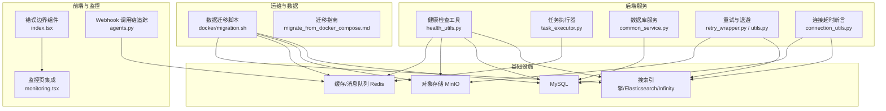
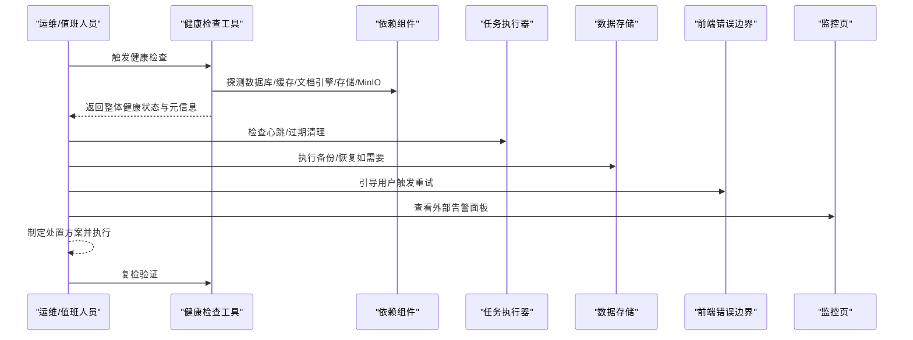
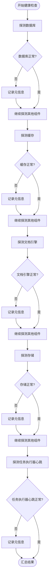
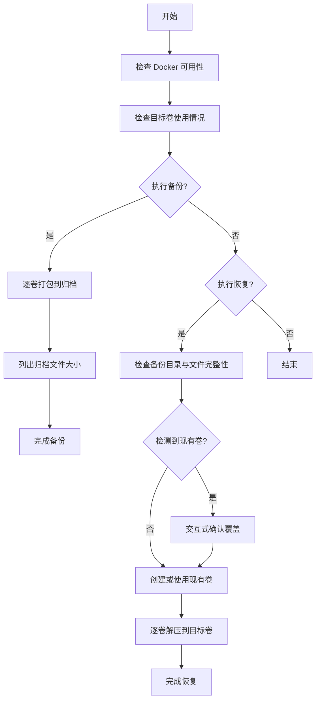
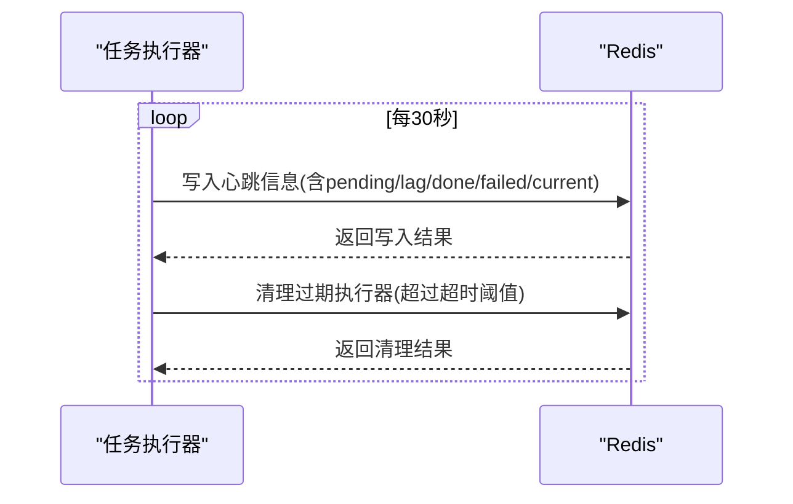
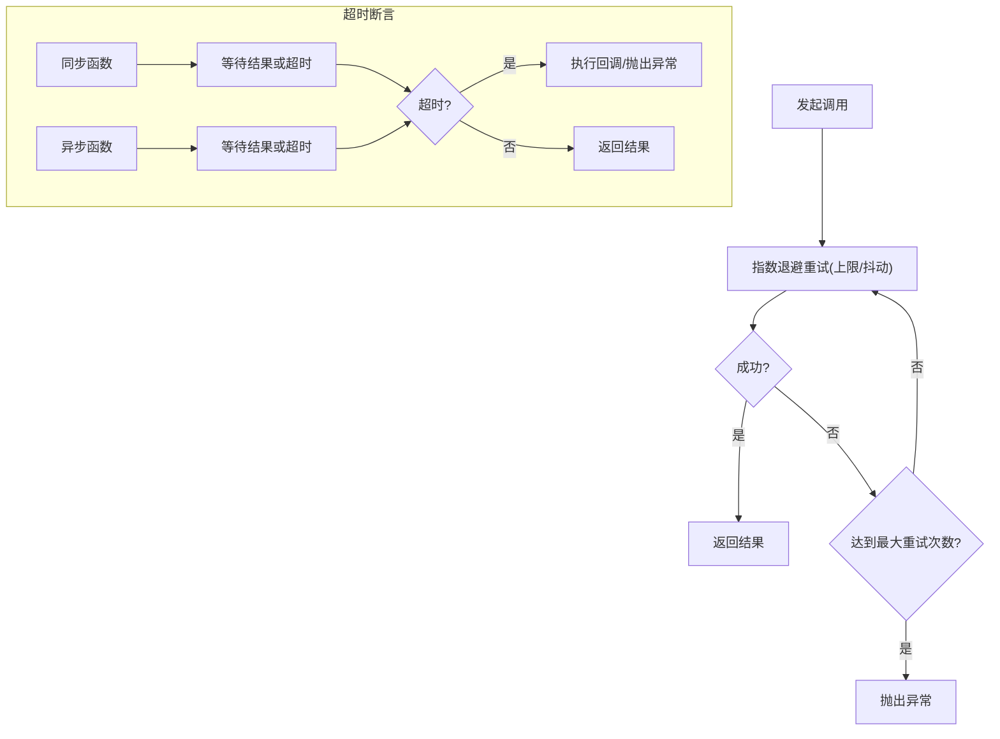
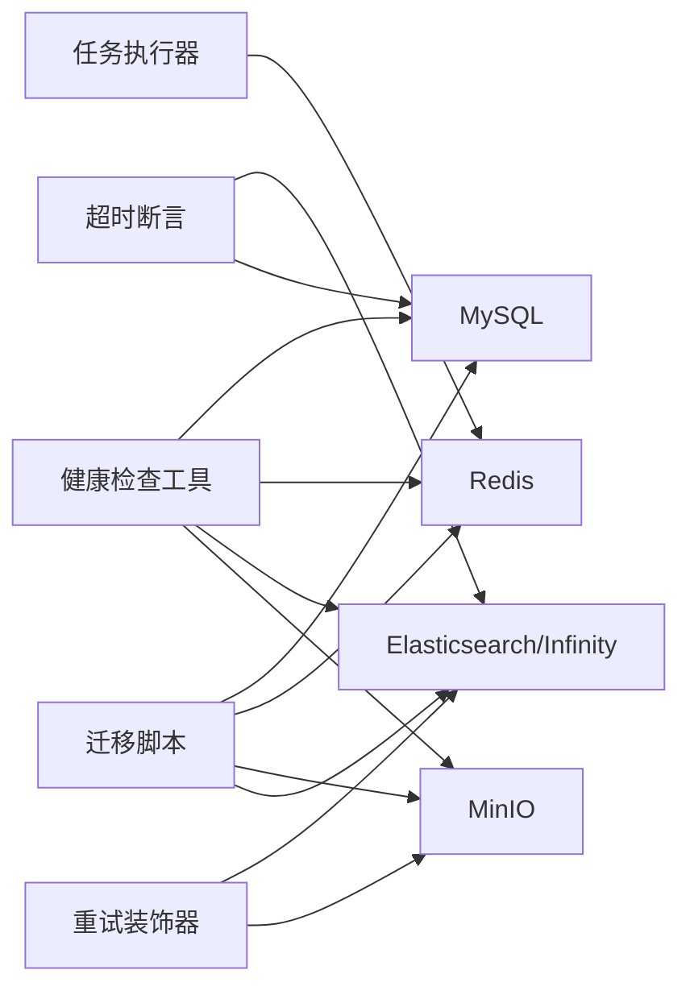

# 应急响应

<cite>
**本文引用的文件**   
- [README.md](file://README.md)
- [health_utils.py](file://api/utils/health_utils.py)
- [migration.sh](file://docker/migration.sh)
- [migrate_from_docker_compose.md](file://docs/guides/migration/migrate_from_docker_compose.md)
- [task_executor.py](file://rag/svr/task_executor.py)
- [common_service.py](file://api/db/services/common_service.py)
- [retry_wrapper.py](file://common/data_source/cross_connector_utils/retry_wrapper.py)
- [utils.py](file://common/data_source/utils.py)
- [connection_utils.py](file://common/connection_utils.py)
- [monitoring.tsx](file://web/src/pages/admin/monitoring.tsx)
- [index.tsx](file://web/src/components/fallback-component/index.tsx)
- [agents.py](file://api/apps/sdk/agents.py)
- [README.md](file://docker/README.md)
- [SECURITY.md](file://SECURITY.md)
</cite>

## 目录
1. [简介](#简介)
2. [项目结构](#项目结构)
3. [核心组件](#核心组件)
4. [架构总览](#架构总览)
5. [详细组件分析](#详细组件分析)
6. [依赖关系分析](#依赖关系分析)
7. [性能考量](#性能考量)
8. [故障排查指南](#故障排查指南)
9. [结论](#结论)
10. [附录](#附录)

## 简介
本文件面向紧急情况下的标准化应急响应流程设计与实施，结合代码库中现有的健康检查、任务执行器心跳、数据迁移脚本、重试与超时控制、前端容错组件等能力，构建覆盖“发现—分级—启动—处置—恢复—复盘”的闭环流程，并配套高可用切换、数据备份与恢复、团队协作与沟通、演练与培训等实践建议。

## 项目结构
围绕应急响应的关键能力，代码库中与之直接相关的主要模块如下：
- 健康检查与状态探测：后端健康检查工具与各依赖组件状态接口
- 数据备份与恢复：容器卷备份/恢复脚本与迁移指南
- 任务执行与心跳：任务执行器的心跳上报、过期清理与进度追踪
- 容错与重试：通用重试装饰器、指数退避与超时断言
- 前端容错：错误边界与重试按钮
- 监控与告警：管理端监控页面集成外部告警面板
- 安全事件响应：安全策略与漏洞报告流程

**图表来源**
- [health_utils.py:187-223](file://api/utils/health_utils.py#L187-L223)
- [task_executor.py:1429-1512](file://rag/svr/task_executor.py#L1429-L1512)
- [common_service.py:25-36](file://api/db/services/common_service.py#L25-L36)
- [retry_wrapper.py:16-44](file://common/data_source/cross_connector_utils/retry_wrapper.py#L16-L44)
- [utils.py:113-1260](file://common/data_source/utils.py#L113-L1260)
- [connection_utils.py:35-98](file://common/connection_utils.py#L35-L98)
- [migration.sh:127-298](file://docker/migration.sh#L127-L298)
- [migrate_from_docker_compose.md:52-90](file://docs/guides/migration/migrate_from_docker_compose.md#L52-L90)
- [index.tsx:45-65](file://web/src/components/fallback-component/index.tsx#L45-L65)
- [monitoring.tsx:1-19](file://web/src/pages/admin/monitoring.tsx#L1-L19)
- [agents.py:650-667](file://api/apps/sdk/agents.py#L650-L667)

**章节来源**
- [README.md:137-141](file://README.md#L137-L141)
- [docker/README.md:13-22](file://docker/README.md#L13-L22)

## 核心组件
- 健康检查与状态探测：统一运行健康检查，聚合数据库、缓存、文档引擎、存储与任务执行器心跳状态，输出整体健康状态与元信息，便于快速定位故障点。
- 数据备份与恢复：提供一键备份/恢复脚本，自动校验容器占用、确认目标卷存在性、生成压缩包并进行还原，支持交互式确认以避免误操作。
- 任务执行器心跳与过期清理：周期性上报心跳，清理过期执行器实例，保障任务队列在异常场景下的可恢复性。
- 重试与超时断言：对网络请求与内部调用提供指数退避重试与超时断言，降低抖动与雪崩风险。
- 前端容错：错误边界组件提供“重试”入口，改善用户侧体验。
- 监控与告警：管理端监控页集成外部告警面板，便于集中查看与处置。
- 安全事件响应：明确安全漏洞报告渠道与流程，支撑安全类紧急事件的快速闭环。

**章节来源**
- [health_utils.py:187-223](file://api/utils/health_utils.py#L187-L223)
- [migration.sh:127-298](file://docker/migration.sh#L127-L298)
- [task_executor.py:1429-1512](file://rag/svr/task_executor.py#L1429-L1512)
- [retry_wrapper.py:16-44](file://common/data_source/cross_connector_utils/retry_wrapper.py#L16-L44)
- [utils.py:113-1260](file://common/data_source/utils.py#L113-L1260)
- [connection_utils.py:35-98](file://common/connection_utils.py#L35-L98)
- [index.tsx:45-65](file://web/src/components/fallback-component/index.tsx#L45-L65)
- [monitoring.tsx:1-19](file://web/src/pages/admin/monitoring.tsx#L1-L19)
- [SECURITY.md:12-31](file://SECURITY.md#L12-L31)

## 架构总览
下图展示应急响应相关组件之间的交互关系与数据流，强调“探测—决策—处置—验证—反馈”的闭环。

**图表来源**
- [health_utils.py:187-223](file://api/utils/health_utils.py#L187-L223)
- [task_executor.py:1429-1512](file://rag/svr/task_executor.py#L1429-L1512)
- [migration.sh:127-298](file://docker/migration.sh#L127-L298)
- [index.tsx:45-65](file://web/src/components/fallback-component/index.tsx#L45-L65)
- [monitoring.tsx:1-19](file://web/src/pages/admin/monitoring.tsx#L1-L19)

## 详细组件分析

### 健康检查与状态探测
- 统一健康检查函数聚合数据库、缓存、文档引擎、存储与任务执行器心跳状态，返回“ok/nok”及元信息，便于快速定位问题。
- 针对不同组件提供专用探测方法，如 Elasticsearch/Infinity 状态、MySQL 进程列表、MinIO 健康、Redis 信息、RAGFlow 服务 ping、任务执行器心跳等。
- 建议在值班轮值中定时巡检与告警联动，异常时自动触发应急处置。

**图表来源**
- [health_utils.py:187-223](file://api/utils/health_utils.py#L187-L223)

**章节来源**
- [health_utils.py:33-68](file://api/utils/health_utils.py#L33-L68)
- [health_utils.py:71-100](file://api/utils/health_utils.py#L71-L100)
- [health_utils.py:103-117](file://api/utils/health_utils.py#L103-L117)
- [health_utils.py:120-133](file://api/utils/health_utils.py#L120-L133)
- [health_utils.py:135-146](file://api/utils/health_utils.py#L135-L146)
- [health_utils.py:148-164](file://api/utils/health_utils.py#L148-L164)
- [health_utils.py:166-185](file://api/utils/health_utils.py#L166-L185)

### 数据备份与恢复（灾难恢复）
- 提供备份/恢复脚本，自动校验 Docker 可用性、目标卷使用情况，按顺序打包/解压各依赖卷数据，支持交互式确认与覆盖提示。
- 迁移指南提供跨机器传输与恢复步骤，强调先备份再恢复的安全原则。

**图表来源**
- [migration.sh:45-125](file://docker/migration.sh#L45-L125)
- [migration.sh:127-173](file://docker/migration.sh#L127-L173)
- [migration.sh:175-263](file://docker/migration.sh#L175-L263)
- [migrate_from_docker_compose.md:52-90](file://docs/guides/migration/migrate_from_docker_compose.md#L52-L90)

**章节来源**
- [migration.sh:45-125](file://docker/migration.sh#L45-L125)
- [migration.sh:127-173](file://docker/migration.sh#L127-L173)
- [migration.sh:175-263](file://docker/migration.sh#L175-L263)
- [migrate_from_docker_compose.md:52-90](file://docs/guides/migration/migrate_from_docker_compose.md#L52-L90)

### 任务执行器心跳与过期清理
- 任务执行器定期上报心跳，记录当前处理任务、待处理与滞后任务数；周期性扫描并清理过期执行器实例，保证任务队列在节点异常时的可恢复性。
- 支持通过 Redis 集合维护执行器集合与有序集合记录心跳时间戳，实现过期检测与清理。

**图表来源**
- [task_executor.py:1429-1512](file://rag/svr/task_executor.py#L1429-L1512)

**章节来源**
- [task_executor.py:1429-1512](file://rag/svr/task_executor.py#L1429-L1512)

### 重试与超时断言
- 对外部调用提供通用重试装饰器，支持指数退避、抖动与最大延迟限制，降低抖动与级联失败风险。
- 对内部调用提供超时断言装饰器，支持同步与异步函数，超时后可执行回调或抛出异常，避免长时间阻塞。

**图表来源**
- [retry_wrapper.py:16-44](file://common/data_source/cross_connector_utils/retry_wrapper.py#L16-L44)
- [utils.py:113-1260](file://common/data_source/utils.py#L113-L1260)
- [connection_utils.py:35-98](file://common/connection_utils.py#L35-L98)

**章节来源**
- [retry_wrapper.py:16-44](file://common/data_source/cross_connector_utils/retry_wrapper.py#L16-L44)
- [utils.py:113-1260](file://common/data_source/utils.py#L113-L1260)
- [connection_utils.py:35-98](file://common/connection_utils.py#L35-L98)

### 前端容错与用户引导
- 错误边界组件提供“重试”按钮，引导用户在前端异常时主动重试，提升用户体验与恢复效率。

**章节来源**
- [index.tsx:45-65](file://web/src/components/fallback-component/index.tsx#L45-L65)

### 监控与告警
- 管理端监控页通过 iframe 集成外部告警面板，便于集中查看与处置。

**章节来源**
- [monitoring.tsx:1-19](file://web/src/pages/admin/monitoring.tsx#L1-L19)

### 安全事件响应
- 明确安全漏洞报告渠道与流程，支撑安全类紧急事件的快速闭环。

**章节来源**
- [SECURITY.md:12-31](file://SECURITY.md#L12-L31)

## 依赖关系分析
- 健康检查依赖数据库、缓存、文档引擎、存储与任务执行器心跳，形成“系统健康度”的统一视图。
- 数据迁移脚本依赖 Docker 与目标卷，确保备份/恢复过程可控与可审计。
- 任务执行器心跳依赖 Redis，用于分布式协调与过期清理。
- 重试与超时断言广泛应用于外部 API 调用与内部关键路径，降低故障传播。
- 前端错误边界与监控页共同构成用户侧与运维侧的双重反馈通道。

**图表来源**
- [health_utils.py:187-223](file://api/utils/health_utils.py#L187-L223)
- [task_executor.py:1429-1512](file://rag/svr/task_executor.py#L1429-L1512)
- [retry_wrapper.py:16-44](file://common/data_source/cross_connector_utils/retry_wrapper.py#L16-L44)
- [utils.py:113-1260](file://common/data_source/utils.py#L113-L1260)
- [connection_utils.py:35-98](file://common/connection_utils.py#L35-L98)
- [migration.sh:127-298](file://docker/migration.sh#L127-L298)

**章节来源**
- [docker/README.md:13-22](file://docker/README.md#L13-L22)

## 性能考量
- 指数退避与抖动：在高并发场景下显著降低热点资源压力，避免级联失败。
- 心跳与过期清理：通过周期性清理过期执行器，维持任务队列健康，减少无效堆积。
- 健康检查：统一探测与聚合，避免重复探测带来的额外开销。
- 前端容错：在用户侧提供即时重试入口，减少等待与二次提交成本。

[本节为通用指导，无需具体文件分析]

## 故障排查指南
- 快速定位
  - 使用健康检查工具查看数据库、缓存、文档引擎、存储与任务执行器心跳状态，优先处理“nok”项。
  - 若任务执行器心跳异常，检查 Redis 集群与网络连通性，必要时触发过期清理流程。
- 数据恢复
  - 在确认容器未占用目标卷后，执行备份脚本生成归档；跨机迁移时遵循迁移指南的传输与恢复步骤。
  - 恢复前务必确认备份文件完整，必要时先备份当前数据以防覆盖。
- 用户侧问题
  - 引导用户点击错误边界组件的“重试”按钮，观察是否可恢复。
- 监控与告警
  - 通过管理端监控页查看外部告警面板，结合健康检查结果进行联动处置。

**章节来源**
- [health_utils.py:187-223](file://api/utils/health_utils.py#L187-L223)
- [task_executor.py:1429-1512](file://rag/svr/task_executor.py#L1429-L1512)
- [migration.sh:127-298](file://docker/migration.sh#L127-L298)
- [migrate_from_docker_compose.md:52-90](file://docs/guides/migration/migrate_from_docker_compose.md#L52-L90)
- [index.tsx:45-65](file://web/src/components/fallback-component/index.tsx#L45-L65)
- [monitoring.tsx:1-19](file://web/src/pages/admin/monitoring.tsx#L1-L19)

## 结论
通过健康检查、任务执行器心跳、数据迁移脚本、重试与超时断言、前端容错与监控集成等能力，RAGFlow 已具备构建标准化应急响应流程的基础。建议在此基础上完善“发现—分级—启动—处置—恢复—复盘—演练—培训”的闭环机制，确保团队在紧急情况下能够快速、有序、可追溯地完成处置与恢复。

[本节为总结，无需具体文件分析]

## 附录

### 应急响应流程（建议模板）
- 发现阶段
  - 自动化巡检与告警联动；值班人员确认并登记故障现象与影响范围。
- 分级评估
  - 按照影响范围与业务中断程度划分等级，确定处置优先级与资源投入。
- 应急启动
  - 启动应急小组，明确职责分工与沟通渠道；发布故障公告与影响说明。
- 处置执行
  - 依据健康检查结果与监控面板定位根因；执行热修复、回滚、限流、隔离等措施。
  - 如需数据恢复，按迁移脚本与指南执行备份/恢复。
- 恢复验证
  - 复检健康检查与关键指标；进行业务回归测试与用户验证。
- 复盘总结
  - 根因分析、处置过程记录、经验教训与预防措施；更新应急预案与知识库。
- 演练与培训
  - 定期开展应急演练与培训，提升团队协同与实战能力。

[本节为概念性内容，无需具体文件分析]