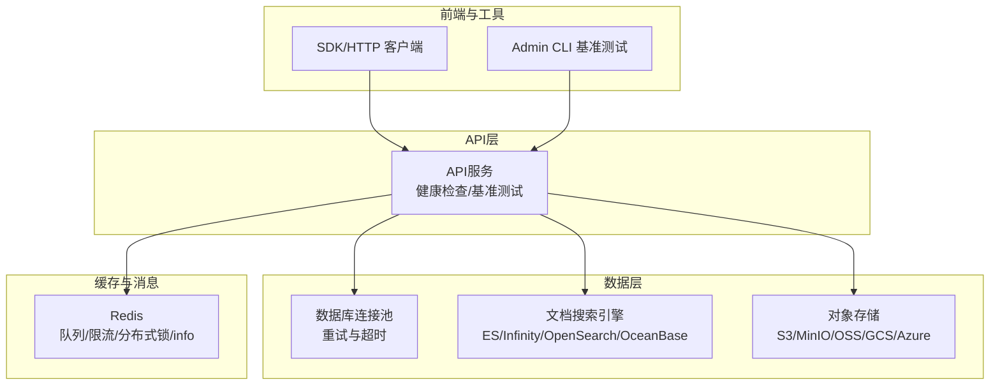
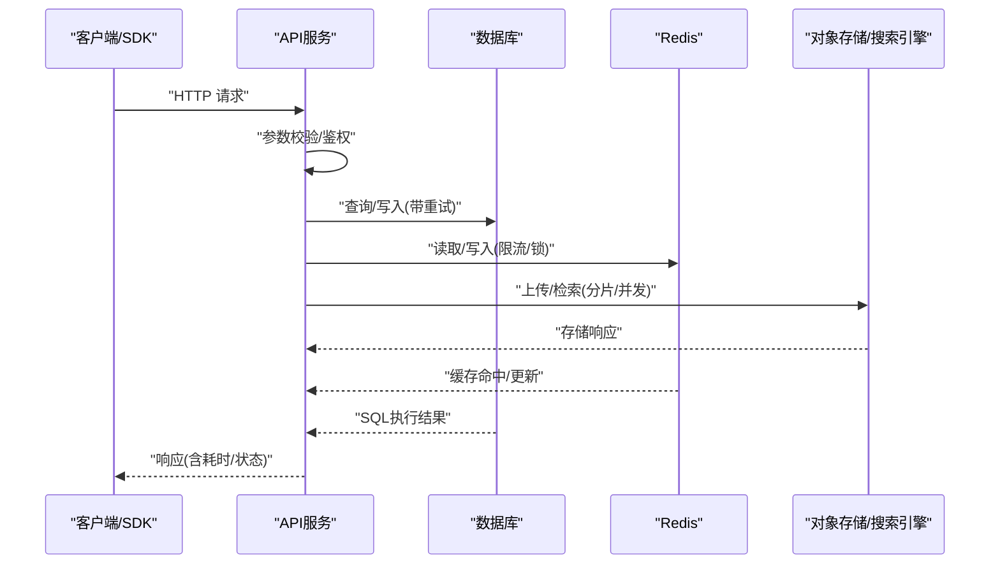
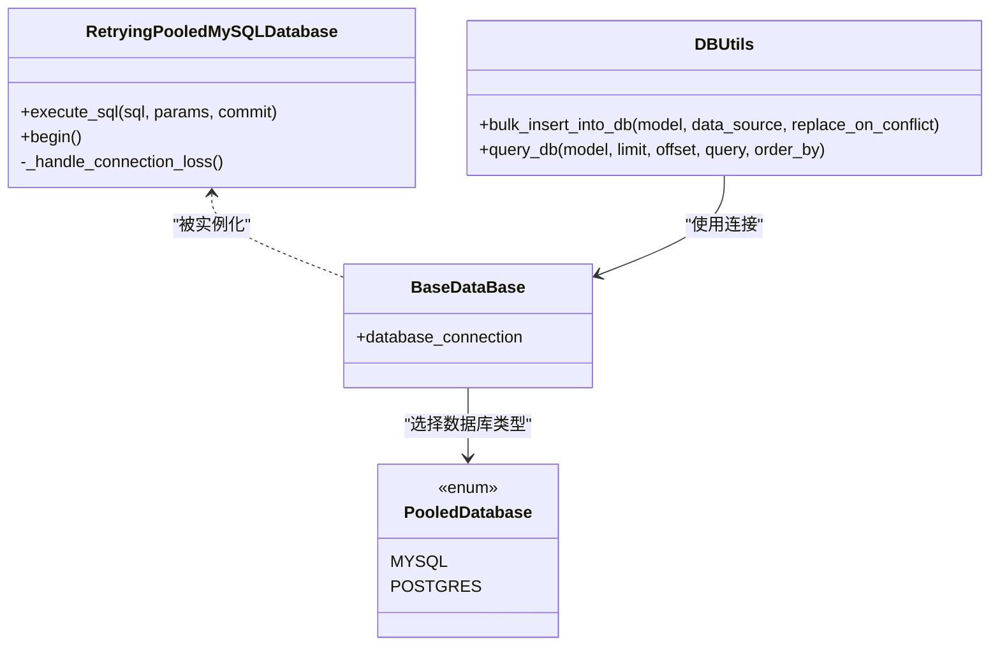
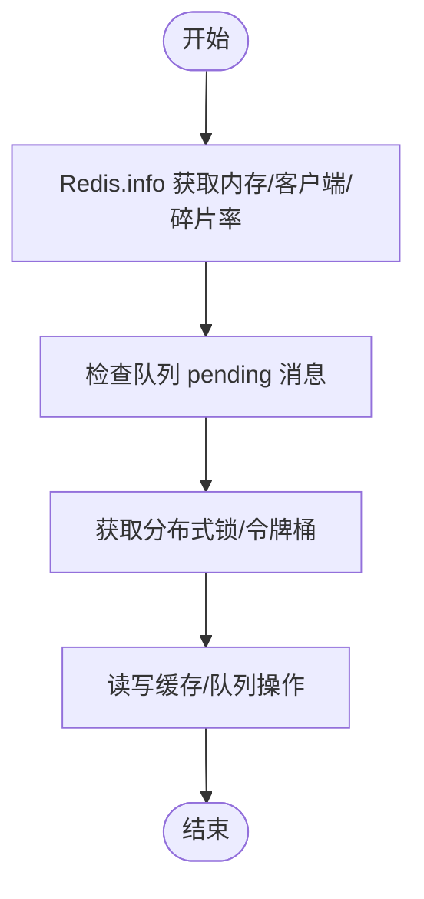
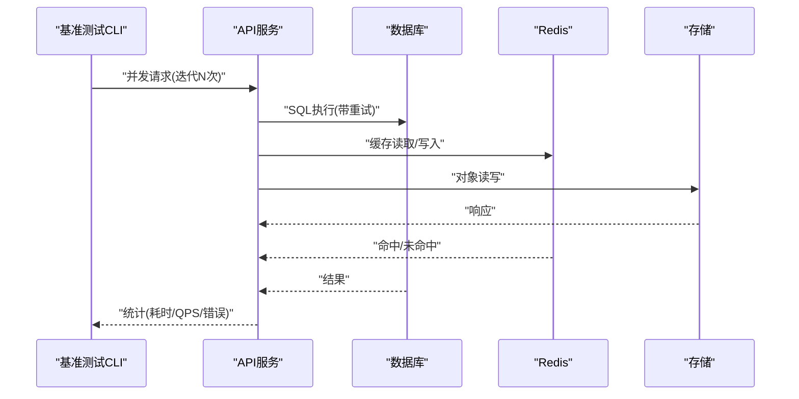
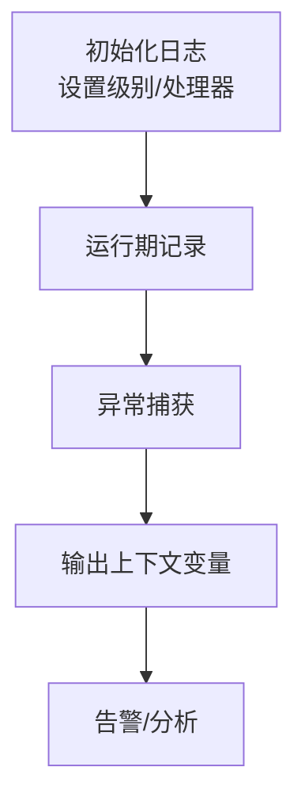
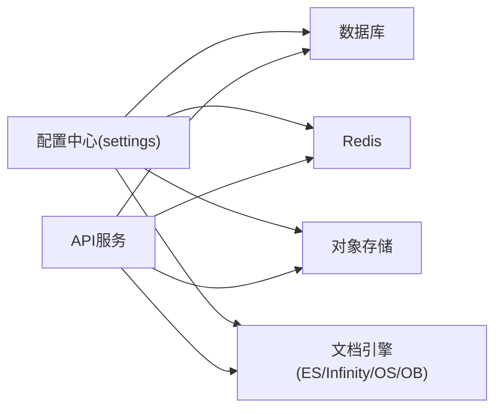

# 性能诊断

<cite>
**本文引用的文件**
- [common/log_utils.py](file://common/log_utils.py)
- [api/utils/health_utils.py](file://api/utils/health_utils.py)
- [api/db/db_models.py](file://api/db/db_models.py)
- [api/db/db_utils.py](file://api/db/db_utils.py)
- [rag/utils/redis_conn.py](file://rag/utils/redis_conn.py)
- [admin/client/ragflow_client.py](file://admin/client/ragflow_client.py)
- [test/benchmark/cli.py](file://test/benchmark/cli.py)
- [test/benchmark/report.py](file://test/benchmark/report.py)
- [common/settings.py](file://common/settings.py)
- [api/utils/memory_utils.py](file://api/utils/memory_utils.py)
- [common/data_source/connector_runner.py](file://common/data_source/connector_runner.py)
</cite>

## 目录
1. [简介](#简介)
2. [项目结构](#项目结构)
3. [核心组件](#核心组件)
4. [架构总览](#架构总览)
5. [详细组件分析](#详细组件分析)
6. [依赖分析](#依赖分析)
7. [性能考量](#性能考量)
8. [故障排查指南](#故障排查指南)
9. [结论](#结论)
10. [附录](#附录)

## 简介
本指南面向RAGFlow项目的性能诊断与优化，围绕系统关键指标（CPU、内存、磁盘I/O、网络）与日志分析方法，结合数据库、缓存、API响应链路与资源异常的识别与处置，提供可操作的诊断流程与优化建议。文档同时梳理项目中已有的健康检查、基准测试与日志基础设施，帮助快速定位瓶颈并制定改进策略。

## 项目结构
RAGFlow后端采用Python服务与多组件协作的架构：API层负责对外接口与业务编排；数据库层通过连接池与重试机制保障稳定性；缓存层基于Redis实现队列、限流与分布式锁；存储层支持多种对象存储；检索引擎支持Elasticsearch、Infinity等；前端通过SDK或HTTP客户端进行调用。性能诊断涉及上述各层的监控与分析。

图示来源
- [api/utils/health_utils.py:187-223](file://api/utils/health_utils.py#L187-L223)
- [common/settings.py:244-282](file://common/settings.py#L244-L282)
- [rag/utils/redis_conn.py:114-171](file://rag/utils/redis_conn.py#L114-L171)
- [admin/client/ragflow_client.py:1452-1504](file://admin/client/ragflow_client.py#L1452-L1504)

章节来源
- [api/utils/health_utils.py:187-223](file://api/utils/health_utils.py#L187-L223)
- [common/settings.py:244-282](file://common/settings.py#L244-L282)

## 核心组件
- 健康检查与状态采集：统一的健康检查入口，覆盖数据库、Redis、文档引擎、存储、任务执行器等模块，输出耗时与元信息，便于快速判断组件可用性与延迟。
- 数据库连接池与重试：封装了带指数退避重试的连接池类，自动处理连接丢失、超时等异常，降低瞬时故障对业务的影响。
- 缓存与队列：Redis封装提供info、队列读写、消费者组、pending消息、分布式锁等能力，支撑高并发下的限流与幂等。
- 基准测试与报告：内置CLI基准测试工具，支持并发与迭代控制，输出吞吐、延迟统计与错误汇总，便于对比优化效果。
- 日志与异常：统一的日志初始化与异常记录工具，支持按包级别调整日志等级，并在异常时输出上下文变量，辅助定位问题根因。

章节来源
- [api/utils/health_utils.py:33-223](file://api/utils/health_utils.py#L33-L223)
- [api/db/db_models.py:242-296](file://api/db/db_models.py#L242-L296)
- [rag/utils/redis_conn.py:114-171](file://rag/utils/redis_conn.py#L114-L171)
- [test/benchmark/cli.py:476-544](file://test/benchmark/cli.py#L476-L544)
- [common/log_utils.py:25-86](file://common/log_utils.py#L25-L86)

## 架构总览
下图展示RAGFlow在性能诊断场景下的关键交互路径：客户端发起请求，API层进行路由与参数校验，访问数据库、缓存与存储，最终返回结果。健康检查与基准测试贯穿于该链路，用于评估整体性能与稳定性。

图示来源
- [api/utils/health_utils.py:103-117](file://api/utils/health_utils.py#L103-L117)
- [api/db/db_models.py:242-296](file://api/db/db_models.py#L242-L296)
- [rag/utils/redis_conn.py:114-171](file://rag/utils/redis_conn.py#L114-L171)
- [common/settings.py:244-282](file://common/settings.py#L244-L282)

## 详细组件分析

### 数据库性能诊断与优化
- 连接池与重试
  - RetryingPooledMySQLDatabase实现了对连接丢失、读超时、接口错误等的自动重试，包含指数退避与最大重试次数控制，减少瞬时异常对请求的影响。
  - BaseDataBase通过PooledDatabase枚举选择具体数据库类型并注入重试配置，确保全局一致性。
- 查询与批量写入
  - bulk_insert_into_db提供批量插入与冲突保留策略，支持MySQL/PostgreSQL差异化的on_conflict处理，降低写入放大。
  - query_db提供动态表达式构建与分页查询，避免一次性加载过多数据导致内存压力。
- 超时与版本兼容
  - OceanBase连接在执行前尝试设置查询超时，确保长查询不会无限阻塞连接池。

图示来源
- [api/db/db_models.py:242-296](file://api/db/db_models.py#L242-L296)
- [api/db/db_models.py:404-420](file://api/db/db_models.py#L404-L420)
- [api/db/db_utils.py:26-52](file://api/db/db_utils.py#L26-L52)
- [api/db/db_utils.py:107-129](file://api/db/db_utils.py#L107-L129)
- [rag/utils/ob_conn.py:466-481](file://rag/utils/ob_conn.py#L466-L481)

章节来源
- [api/db/db_models.py:242-296](file://api/db/db_models.py#L242-L296)
- [api/db/db_models.py:404-420](file://api/db/db_models.py#L404-L420)
- [api/db/db_utils.py:26-52](file://api/db/db_utils.py#L26-L52)
- [api/db/db_utils.py:107-129](file://api/db/db_utils.py#L107-L129)
- [rag/utils/ob_conn.py:466-481](file://rag/utils/ob_conn.py#L466-L481)

### 缓存系统性能诊断与优化
- 健康与指标
  - RedisDB.info提供版本、内存、碎片率、客户端数、阻塞客户端、即时QPS等关键指标，便于评估缓存健康度与容量压力。
- 队列与消费者组
  - 支持Stream队列的生产与消费，自动创建消费者组，处理pending消息与重入队，保障消息可靠投递。
- 分布式锁与原子操作
  - 提供Lua脚本实现的令牌桶与“相等才删”原子操作，配合分布式锁，支撑高并发下的限流与幂等。
- 建议
  - 关注used_memory、mem_fragmentation_ratio与connected_clients趋势，结合业务峰值流量设定合理的过期策略与淘汰策略。
  - 对热点键进行拆分与多副本，避免单点压力过大。

图示来源
- [rag/utils/redis_conn.py:156-168](file://rag/utils/redis_conn.py#L156-L168)
- [rag/utils/redis_conn.py:363-408](file://rag/utils/redis_conn.py#L363-L408)
- [rag/utils/redis_conn.py:494-517](file://rag/utils/redis_conn.py#L494-L517)

章节来源
- [rag/utils/redis_conn.py:156-168](file://rag/utils/redis_conn.py#L156-L168)
- [rag/utils/redis_conn.py:363-408](file://rag/utils/redis_conn.py#L363-L408)
- [rag/utils/redis_conn.py:494-517](file://rag/utils/redis_conn.py#L494-L517)

### API响应时间诊断流程
- 基准测试
  - CLI支持并发与迭代控制，使用进程池并发执行请求，统计总耗时、QPS、成功/失败计数与延迟分布（均值、最小、分位数），并输出错误摘要。
  - Admin CLI提供Ping命令与聚合统计，便于快速验证服务可用性与吞吐。
- 诊断步骤
  - 明确目标：确定是冷启动、数据库慢查询、缓存未命中还是存储延迟导致的慢响应。
  - 分层定位：先看API层QPS与错误率，再深入到数据库、缓存与存储的耗时占比。
  - 并发优化：逐步提高并发，观察QPS与延迟拐点，识别瓶颈（连接池上限、锁竞争、存储带宽）。
  - 回归验证：在优化后重复基准测试，对比前后指标。

图示来源
- [test/benchmark/cli.py:476-544](file://test/benchmark/cli.py#L476-L544)
- [admin/client/ragflow_client.py:1452-1504](file://admin/client/ragflow_client.py#L1452-L1504)
- [test/benchmark/report.py:83-105](file://test/benchmark/report.py#L83-L105)

章节来源
- [test/benchmark/cli.py:476-544](file://test/benchmark/cli.py#L476-L544)
- [admin/client/ragflow_client.py:1452-1504](file://admin/client/ragflow_client.py#L1452-L1504)
- [test/benchmark/report.py:83-105](file://test/benchmark/report.py#L83-L105)

### 日志分析在性能诊断中的应用
- 日志初始化
  - 统一日志根记录器，支持滚动文件与标准输出，按包名设置不同日志级别，便于在生产环境精细化控制日志量。
- 异常与上下文
  - 在异常捕获时输出堆栈与局部变量上下文，有助于快速定位问题发生时的输入状态与关键变量。
- 建议
  - 将慢查询、缓存未命中、存储超时等高频事件打点到独立字段，结合时间序列监控进行趋势分析。
  - 使用结构化日志格式，便于后续日志分析平台解析与告警。

图示来源
- [common/log_utils.py:25-86](file://common/log_utils.py#L25-L86)
- [common/data_source/connector_runner.py:201-217](file://common/data_source/connector_runner.py#L201-L217)

章节来源
- [common/log_utils.py:25-86](file://common/log_utils.py#L25-L86)
- [common/data_source/connector_runner.py:201-217](file://common/data_source/connector_runner.py#L201-L217)

### 资源使用异常的识别与处理
- 内存
  - memory_utils提供内存类型与人类可读映射，便于在性能分析中区分不同类型内存的占用与变化。
- CPU/磁盘/网络
  - 健康检查中可结合外部监控系统采集CPU使用率、内存占用、磁盘I/O与网络带宽，结合API层QPS与延迟进行关联分析。
- 应急处理
  - 当出现内存泄漏迹象时，优先冻结新增功能、启用只读模式、清理缓存与临时文件；对CPU占用过高的模块进行限流与降级。
  - 当磁盘空间不足时，清理日志与临时文件、扩容存储或迁移冷数据。

章节来源
- [api/utils/memory_utils.py:19-55](file://api/utils/memory_utils.py#L19-L55)
- [api/utils/health_utils.py:135-145](file://api/utils/health_utils.py#L135-L145)

## 依赖分析
- 组件耦合
  - API层依赖数据库、缓存与存储抽象，通过settings集中配置，降低耦合度。
  - 健康检查模块对各子系统暴露统一接口，便于集中观测。
- 外部依赖
  - 文档引擎支持ES/Infinity/OpenSearch/OceanBase，需根据部署环境选择并针对性优化。
  - 存储实现支持S3/MinIO/OSS/GCS/Azure，需关注跨区域延迟与带宽限制。

图示来源
- [common/settings.py:244-282](file://common/settings.py#L244-L282)
- [api/utils/health_utils.py:187-223](file://api/utils/health_utils.py#L187-L223)

章节来源
- [common/settings.py:244-282](file://common/settings.py#L244-L282)
- [api/utils/health_utils.py:187-223](file://api/utils/health_utils.py#L187-L223)

## 性能考量
- 数据库
  - 合理设置连接池大小与超时，避免连接耗尽；对热点表建立合适索引，定期分析慢查询日志。
  - 批量写入时注意冲突处理与事务边界，减少回滚与重试开销。
- 缓存
  - 采用多级缓存（本地/远端），对热点数据设置合理TTL；利用原子操作与分布式锁保证一致性。
  - 监控命中率与内存使用，及时扩容或调整淘汰策略。
- API
  - 基于基准测试确定并发上限，结合熔断与限流保护下游；对长尾请求进行异步化或分页处理。
- 存储
  - 选择就近地域与高带宽通道；对大文件采用分片上传与断点续传；压缩与去重降低传输成本。

## 故障排查指南
- 快速自检
  - 使用run_health_checks检查数据库、Redis、文档引擎与存储的可用性与耗时，定位最先出现异常的组件。
- 慢查询定位
  - 结合数据库重试日志与SQL执行计划，识别未命中索引或全表扫描的查询；必要时引入查询改写或物化视图。
- 缓存问题
  - 通过Redis.info查看内存与客户端状态；检查队列pending消息是否堆积；确认分布式锁是否正确释放。
- API瓶颈
  - 使用基准测试CLI逐步提升并发，观察QPS与延迟曲线，识别连接池、锁竞争或存储瓶颈。
- 资源异常
  - 监控内存、CPU与磁盘趋势，结合日志中的异常堆栈与上下文变量，快速定位根因并采取应急措施。

章节来源
- [api/utils/health_utils.py:187-223](file://api/utils/health_utils.py#L187-L223)
- [api/db/db_models.py:242-296](file://api/db/db_models.py#L242-L296)
- [rag/utils/redis_conn.py:156-168](file://rag/utils/redis_conn.py#L156-L168)
- [test/benchmark/cli.py:476-544](file://test/benchmark/cli.py#L476-L544)
- [common/log_utils.py:25-86](file://common/log_utils.py#L25-L86)

## 结论
通过对健康检查、基准测试、日志与关键组件（数据库、缓存、存储）的系统化运用，可以高效地完成RAGFlow的性能诊断与优化。建议在生产环境中持续采集关键指标，建立告警与回归测试机制，确保性能问题可发现、可定位、可恢复。

## 附录
- 常用命令与指标
  - 健康检查：run_health_checks输出各组件状态与耗时。
  - 基准测试：CLI支持并发与迭代参数，输出QPS与延迟统计。
  - Redis指标：info返回内存、客户端、碎片率等。
  - 数据库重试：自动处理连接丢失与超时，降低瞬时故障影响。
- 参考文件
  - [api/utils/health_utils.py:187-223](file://api/utils/health_utils.py#L187-L223)
  - [test/benchmark/cli.py:476-544](file://test/benchmark/cli.py#L476-L544)
  - [test/benchmark/report.py:83-105](file://test/benchmark/report.py#L83-L105)
  - [rag/utils/redis_conn.py:156-168](file://rag/utils/redis_conn.py#L156-L168)
  - [api/db/db_models.py:242-296](file://api/db/db_models.py#L242-L296)
  - [common/log_utils.py:25-86](file://common/log_utils.py#L25-L86)