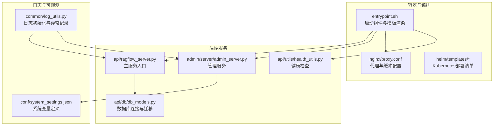
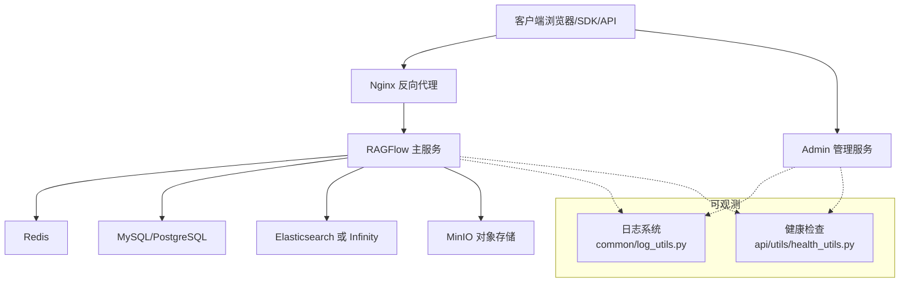
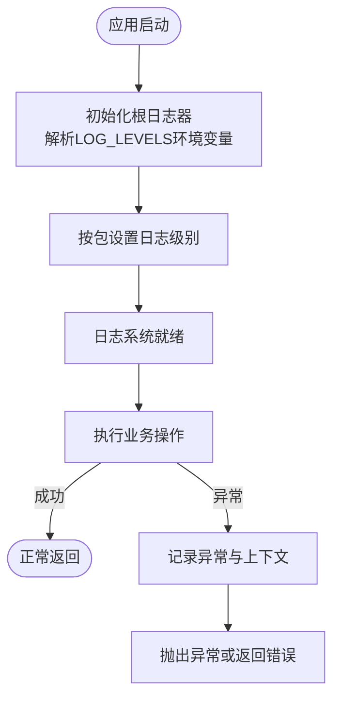
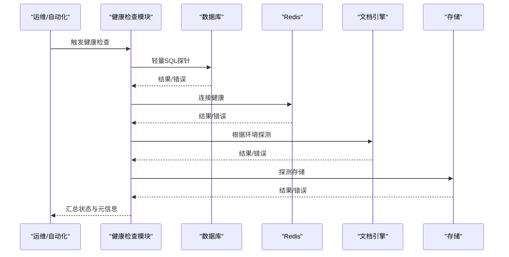
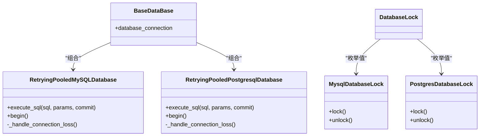
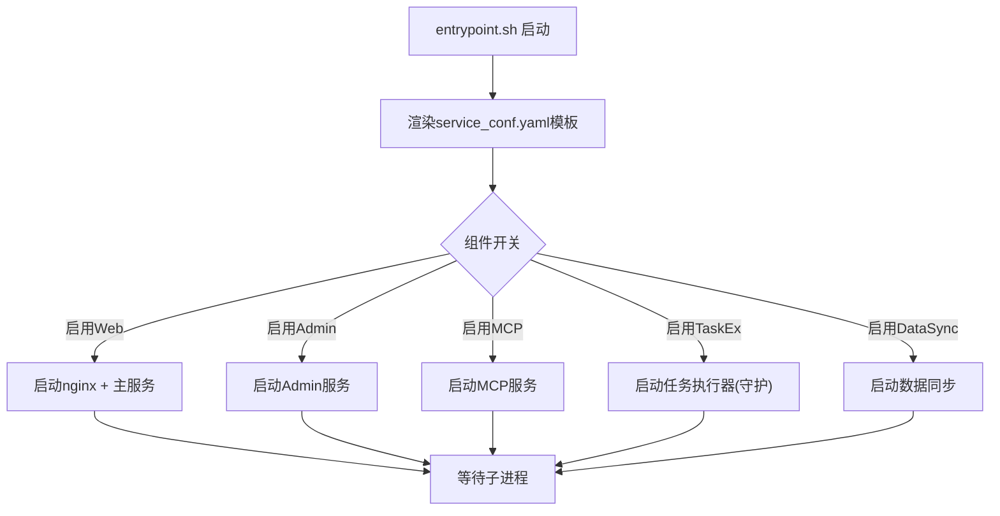
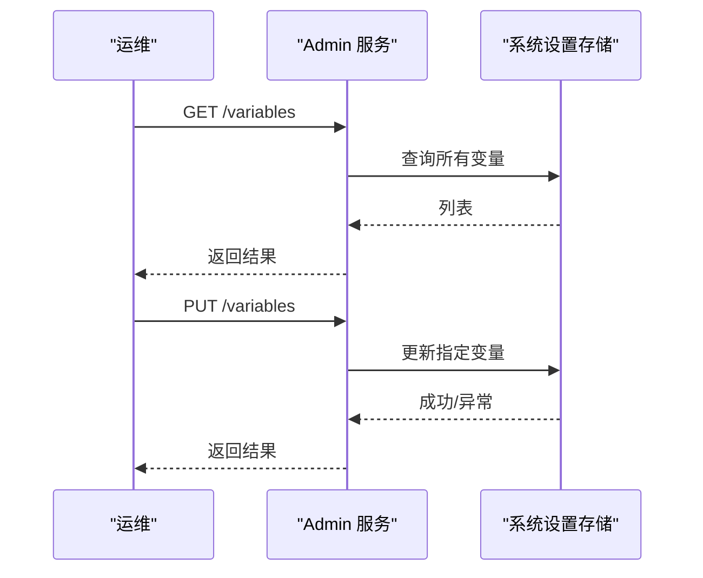
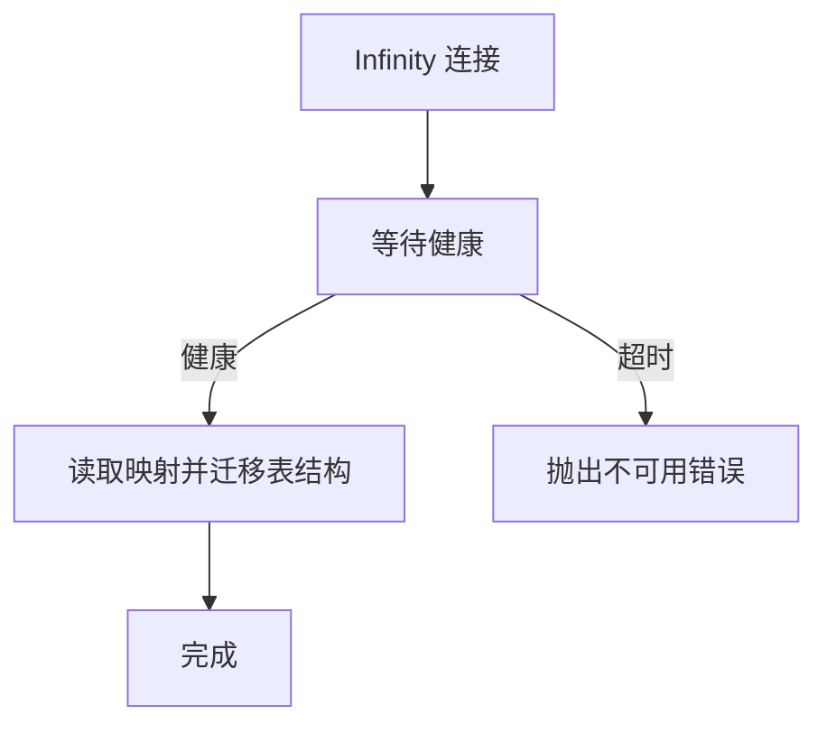
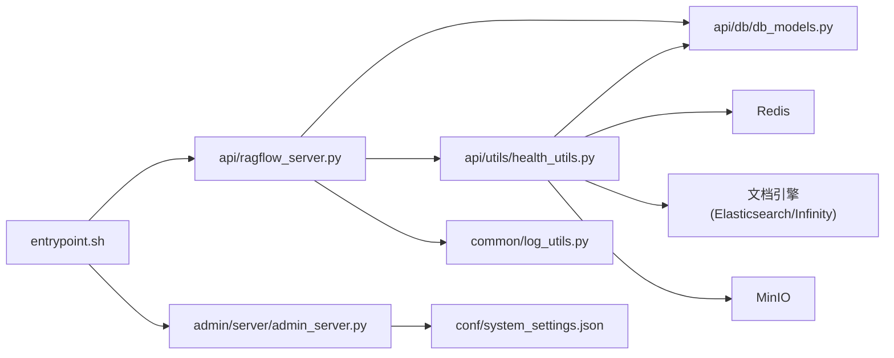
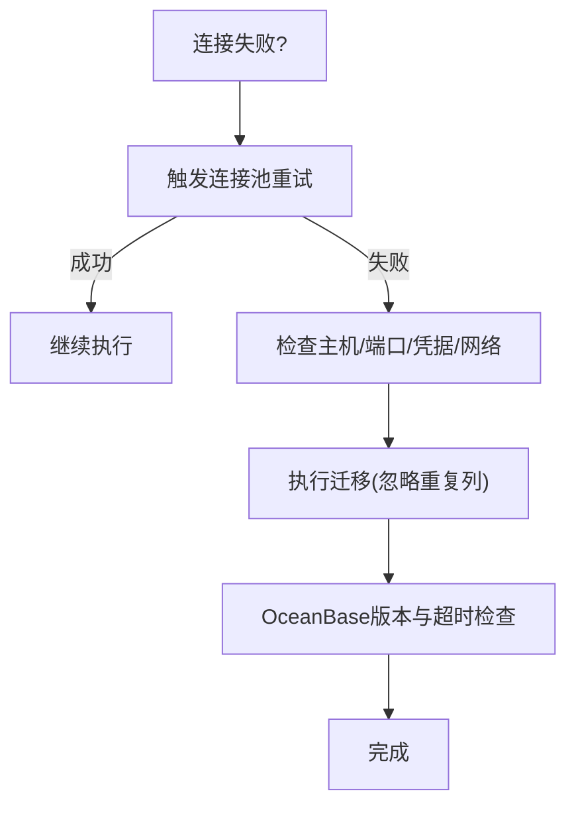

# 故障排除

<cite>
**本文引用的文件**
- [common/log_utils.py](file://common/log_utils.py)
- [api/utils/log_utils.py](file://api/utils/log_utils.py)
- [api/utils/health_utils.py](file://api/utils/health_utils.py)
- [api/db/db_models.py](file://api/db/db_models.py)
- [docker/entrypoint.sh](file://docker/entrypoint.sh)
- [docker/nginx/proxy.conf](file://docker/nginx/proxy.conf)
- [docker/oceanbase/init.d/vec_memory.sql](file://docker/oceanbase/init.d/vec_memory.sql)
- [helm/templates/mysql.yaml](file://helm/templates/mysql.yaml)
- [helm/templates/env.yaml](file://helm/templates/env.yaml)
- [admin/server/routes.py](file://admin/server/routes.py)
- [admin/server/services.py](file://admin/server/services.py)
- [conf/system_settings.json](file://conf/system_settings.json)
- [docs/faq.mdx](file://docs/faq.mdx)
- [test/benchmark/report.py](file://test/benchmark/report.py)
</cite>

## 目录
1. [简介](#简介)
2. [项目结构](#项目结构)
3. [核心组件](#核心组件)
4. [架构总览](#架构总览)
5. [详细组件分析](#详细组件分析)
6. [依赖分析](#依赖分析)
7. [性能考虑](#性能考虑)
8. [故障排除指南](#故障排除指南)
9. [结论](#结论)
10. [附录](#附录)

## 简介
本指南面向运维与开发人员，聚焦于RAGFlow在部署、运行、扩展过程中常见的故障场景，提供系统化的诊断思路与可操作的修复步骤。内容覆盖：
- 部署失败：容器启动、入口脚本参数、配置模板渲染、健康检查
- 服务异常：日志级别与异常记录、组件存活探测、任务执行器心跳
- 性能问题：吞吐与延迟指标、批处理参数、资源限制
- 数据库相关：连接重试、事务重连、迁移与兼容性、OceanBase超时与版本要求
- 网络连接：Nginx代理配置、端口与协议、上游转发头
- 配置错误：环境变量、配置文件、Admin接口变量管理
- 版本兼容与升级：FAQ中的升级路径与注意事项
- 应急响应：最小化停机与快速恢复流程

## 项目结构
RAGFlow采用多模块分层设计，后端以Python为主，前端基于Web框架，容器化通过Docker与Helm编排，文档与FAQ提供运维参考。

图示来源
- [docker/entrypoint.sh:150-174](file://docker/entrypoint.sh#L150-L174)
- [docker/nginx/proxy.conf:1-12](file://docker/nginx/proxy.conf#L1-L12)
- [api/utils/health_utils.py:187-223](file://api/utils/health_utils.py#L187-L223)
- [api/db/db_models.py:404-420](file://api/db/db_models.py#L404-L420)
- [common/log_utils.py:25-72](file://common/log_utils.py#L25-L72)
- [conf/system_settings.json:1-64](file://conf/system_settings.json#L1-L64)

章节来源
- [docker/entrypoint.sh:150-174](file://docker/entrypoint.sh#L150-L174)
- [api/utils/health_utils.py:187-223](file://api/utils/health_utils.py#L187-L223)
- [api/db/db_models.py:404-420](file://api/db/db_models.py#L404-L420)
- [common/log_utils.py:25-72](file://common/log_utils.py#L25-L72)
- [conf/system_settings.json:1-64](file://conf/system_settings.json#L1-L64)

## 核心组件
- 日志系统：统一初始化根日志器、按包设置日志级别、异常记录与上下文输出
- 健康检查：数据库、Redis、文档引擎（Elasticsearch/Infinity）、存储、MinIO、任务执行器心跳
- 数据库层：连接池封装、自动重试、事务重连、迁移工具
- 容器入口：组件启停、模板变量替换、工作进程管理
- 管理服务：Admin接口读取/更新系统变量与配置，暴露环境变量快照
- 文档引擎：Infinity连接与模式迁移校验
- Nginx代理：长连接、缓冲区与超时配置

章节来源
- [common/log_utils.py:25-86](file://common/log_utils.py#L25-L86)
- [api/utils/health_utils.py:33-223](file://api/utils/health_utils.py#L33-L223)
- [api/db/db_models.py:242-391](file://api/db/db_models.py#L242-L391)
- [docker/entrypoint.sh:182-270](file://docker/entrypoint.sh#L182-L270)
- [admin/server/routes.py:438-475](file://admin/server/routes.py#L438-L475)
- [admin/server/services.py:378-409](file://admin/server/services.py#L378-L409)
- [common/doc_store/infinity_conn_base.py:63-89](file://common/doc_store/infinity_conn_base.py#L63-L89)
- [docker/nginx/proxy.conf:1-12](file://docker/nginx/proxy.conf#L1-L12)

## 架构总览
下图展示从客户端到后端服务、数据库与外部组件的关键交互路径，以及健康检查与日志采集的观测链路。

图示来源
- [docker/nginx/proxy.conf:1-12](file://docker/nginx/proxy.conf#L1-L12)
- [api/utils/health_utils.py:187-223](file://api/utils/health_utils.py#L187-L223)
- [common/log_utils.py:25-72](file://common/log_utils.py#L25-L72)

## 详细组件分析

### 日志系统与异常追踪
- 初始化：支持通过环境变量批量设置包级日志级别；默认根级别INFO，第三方包降噪至WARNING
- 异常记录：捕获异常并输出堆栈，附加请求对象文本字段便于定位
- 输出：同时写入文件与标准输出，轮转保留

图示来源
- [common/log_utils.py:25-86](file://common/log_utils.py#L25-L86)

章节来源
- [common/log_utils.py:25-86](file://common/log_utils.py#L25-L86)

### 健康检查与组件状态
- 数据库：轻量探针执行SQL，判断可用性
- Redis：连接健康探测
- 文档引擎：根据环境变量选择Elasticsearch或Infinity，分别进行健康探测
- 存储：MinIO健康探测
- 任务执行器：基于Redis集合与有序集合的心跳检测

图示来源
- [api/utils/health_utils.py:33-223](file://api/utils/health_utils.py#L33-L223)

章节来源
- [api/utils/health_utils.py:33-223](file://api/utils/health_utils.py#L33-L223)

### 数据库连接与迁移
- 连接池与重试：MySQL/PG分别实现连接丢失重试、指数退避、事务重连
- 迁移：自动建表、列变更与类型修改，忽略重复列等非致命错误
- 锁：基于数据库的分布式锁封装，带重试装饰器

图示来源
- [api/db/db_models.py:242-391](file://api/db/db_models.py#L242-L391)
- [api/db/db_models.py:404-564](file://api/db/db_models.py#L404-L564)

章节来源
- [api/db/db_models.py:242-391](file://api/db/db_models.py#L242-L391)
- [api/db/db_models.py:579-604](file://api/db/db_models.py#L579-L604)

### 容器入口与组件启停
- 模板变量替换：将模板中的占位符替换为环境变量或默认值
- 组件控制：支持禁用Web服务器、任务执行器、数据同步、MCP/Admin服务
- 工作进程：任务执行器以守护方式重启，支持范围或固定数量

图示来源
- [docker/entrypoint.sh:150-174](file://docker/entrypoint.sh#L150-L174)
- [docker/entrypoint.sh:220-270](file://docker/entrypoint.sh#L220-L270)

章节来源
- [docker/entrypoint.sh:150-174](file://docker/entrypoint.sh#L150-L174)
- [docker/entrypoint.sh:220-270](file://docker/entrypoint.sh#L220-L270)

### 管理服务与系统变量
- Admin路由：获取/设置系统变量、列出配置、读取环境变量快照
- 配置来源：SERVICE_CONFIGS与环境变量映射，支持动态查看与调整

图示来源
- [admin/server/routes.py:438-475](file://admin/server/routes.py#L438-L475)
- [admin/server/services.py:378-409](file://admin/server/services.py#L378-L409)

章节来源
- [admin/server/routes.py:438-475](file://admin/server/routes.py#L438-L475)
- [admin/server/services.py:378-409](file://admin/server/services.py#L378-L409)

### 文档引擎与Infinity迁移
- 健康探测：等待目标服务可达，超时则报错
- 模式迁移：读取映射文件，按需添加缺失列，避免重复

图示来源
- [common/doc_store/infinity_conn_base.py:63-89](file://common/doc_store/infinity_conn_base.py#L63-L89)

章节来源
- [common/doc_store/infinity_conn_base.py:63-89](file://common/doc_store/infinity_conn_base.py#L63-L89)

## 依赖分析
- 入口脚本依赖：模板渲染、组件开关、工作进程管理
- 健康检查依赖：数据库、Redis、文档引擎、存储实现
- 数据库层依赖：Peewee连接池、迁移器、环境变量驱动
- 管理服务依赖：系统设置存储、环境变量快照
- 文档引擎依赖：映射文件与目标数据库能力

图示来源
- [docker/entrypoint.sh:220-270](file://docker/entrypoint.sh#L220-L270)
- [api/utils/health_utils.py:187-223](file://api/utils/health_utils.py#L187-L223)
- [api/db/db_models.py:404-420](file://api/db/db_models.py#L404-L420)
- [common/log_utils.py:25-72](file://common/log_utils.py#L25-L72)
- [conf/system_settings.json:1-64](file://conf/system_settings.json#L1-L64)

章节来源
- [docker/entrypoint.sh:220-270](file://docker/entrypoint.sh#L220-L270)
- [api/utils/health_utils.py:187-223](file://api/utils/health_utils.py#L187-L223)
- [api/db/db_models.py:404-420](file://api/db/db_models.py#L404-L420)
- [common/log_utils.py:25-72](file://common/log_utils.py#L25-L72)
- [conf/system_settings.json:1-64](file://conf/system_settings.json#L1-L64)

## 性能考虑
- 批处理参数：可通过环境变量调整文档解析与嵌入的批大小，提升吞吐但增加内存占用
- 资源限制：容器资源配额与最大连接数需与负载匹配
- 代理缓冲：Nginx缓冲与超时参数影响大文件上传与长连接稳定性
- 健康检查：轻量探针避免对生产造成额外压力

章节来源
- [docs/faq.mdx:480-483](file://docs/faq.mdx#L480-L483)
- [helm/templates/mysql.yaml:66-73](file://helm/templates/mysql.yaml#L66-L73)
- [docker/nginx/proxy.conf:6-12](file://docker/nginx/proxy.conf#L6-L12)
- [api/utils/health_utils.py:33-41](file://api/utils/health_utils.py#L33-L41)

## 故障排除指南

### 部署失败
- 现象：容器启动即退出或无法访问
  - 检查入口脚本参数与模板变量是否正确渲染
  - 查看容器日志，确认组件开关与端口映射
- 建议步骤
  - 使用入口脚本提供的开关参数逐项启用/禁用组件
  - 校验service_conf.yaml模板渲染结果
  - 确认各组件端口未被占用且防火墙放行

章节来源
- [docker/entrypoint.sh:8-30](file://docker/entrypoint.sh#L8-L30)
- [docker/entrypoint.sh:150-174](file://docker/entrypoint.sh#L150-L174)

### 服务异常
- 现象：服务偶发断连、事务失败
  - 数据库连接池具备自动重试与事务重连机制
  - 建议开启更细粒度日志，结合异常记录定位上下文
- 建议步骤
  - 检查数据库错误码与消息，确认是否触发重试
  - 在事务开始前与失败后打印连接状态
  - 使用健康检查模块验证数据库可用性

章节来源
- [api/db/db_models.py:242-320](file://api/db/db_models.py#L242-L320)
- [common/log_utils.py:75-86](file://common/log_utils.py#L75-L86)
- [api/utils/health_utils.py:33-41](file://api/utils/health_utils.py#L33-L41)

### 性能问题
- 现象：吞吐下降、延迟升高
  - 检查批处理参数、资源配额与代理缓冲
  - 使用基准报告统计延迟与QPS
- 建议步骤
  - 调整DOC_BULK_SIZE与EMBEDDING_BATCH_SIZE
  - 评估Nginx缓冲与超时参数
  - 使用基准测试脚本生成报告，定位瓶颈

章节来源
- [docs/faq.mdx:480-483](file://docs/faq.mdx#L480-L483)
- [docker/nginx/proxy.conf:6-12](file://docker/nginx/proxy.conf#L6-L12)
- [test/benchmark/report.py:83-105](file://test/benchmark/report.py#L83-L105)

### 数据库相关问题
- 连接问题
  - MySQL/PG连接池具备自动重试与重连逻辑
  - 若持续失败，检查主机名、端口、凭据与网络连通性
- 查询性能
  - 使用慢查询日志与EXPLAIN分析
  - 调整批大小与索引策略
- 数据一致性
  - 使用迁移工具进行列变更与类型修改，忽略重复列等非致命错误
  - OceanBase需满足最低版本与查询超时设置

图示来源
- [api/db/db_models.py:242-320](file://api/db/db_models.py#L242-L320)
- [api/db/db_models.py:1225-1254](file://api/db/db_models.py#L1225-L1254)
- [docker/oceanbase/init.d/vec_memory.sql:1-1](file://docker/oceanbase/init.d/vec_memory.sql#L1-L1)
- [api/db/db_models.py:463-510](file://api/db/db_models.py#L463-L510)

章节来源
- [api/db/db_models.py:242-320](file://api/db/db_models.py#L242-L320)
- [api/db/db_models.py:1225-1254](file://api/db/db_models.py#L1225-L1254)
- [docker/oceanbase/init.d/vec_memory.sql:1-1](file://docker/oceanbase/init.d/vec_memory.sql#L1-L1)
- [api/db/db_models.py:463-510](file://api/db/db_models.py#L463-L510)

### 网络连接问题
- 端口检查：确认Nginx、后端服务、数据库、存储与Redis端口开放
- 防火墙：允许容器间通信与外部访问
- 代理设置：确保X-Forwarded-*头正确传递，超时与缓冲参数合理

章节来源
- [docker/nginx/proxy.conf:1-12](file://docker/nginx/proxy.conf#L1-L12)

### 配置错误
- 环境变量：通过Admin接口读取/设置系统变量，核对变量名与类型
- 配置文件：入口脚本负责模板渲染，检查占位符是否被正确替换
- 服务依赖：Kubernetes中通过Secret注入敏感配置，确保主机名与端口解析

章节来源
- [admin/server/routes.py:438-475](file://admin/server/routes.py#L438-L475)
- [admin/server/services.py:378-409](file://admin/server/services.py#L378-L409)
- [docker/entrypoint.sh:150-174](file://docker/entrypoint.sh#L150-L174)
- [helm/templates/env.yaml:11-34](file://helm/templates/env.yaml#L11-L34)

### 版本兼容性与升级
- 升级路径：参考FAQ中的升级指南，注意数据卷清理与配置迁移
- 版本标识：UI与日志中可查看版本号，便于回溯与对比
- 文档引擎切换：从Elasticsearch切换到Infinity需重建镜像并清理数据卷

章节来源
- [docs/faq.mdx:446-472](file://docs/faq.mdx#L446-L472)
- [docs/faq.mdx:37-60](file://docs/faq.mdx#L37-L60)

### 应急响应流程
- 快速诊断：使用健康检查模块汇总数据库、缓存、文档引擎与存储状态
- 最小化停机：优先启用降级方案（如切换文档引擎、降低批大小）
- 回滚策略：保留上一版本镜像与配置，必要时回滚并恢复数据卷

章节来源
- [api/utils/health_utils.py:187-223](file://api/utils/health_utils.py#L187-L223)
- [docs/faq.mdx:446-472](file://docs/faq.mdx#L446-L472)

## 结论
通过规范的日志体系、完善的健康检查、健壮的数据库连接与迁移机制、清晰的容器入口与配置管理，RAGFlow在复杂生产环境中具备较强的可运维性。建议在日常巡检中定期运行健康检查，在变更前后进行基准回归，并完善Admin接口的变量审计与回滚预案。

## 附录
- 常用命令
  - 查看容器日志：docker logs -f <container>
  - 运行健康检查：调用健康检查接口或脚本
  - 基准测试：执行基准报告脚本生成统计报表
- 关键配置
  - LOG_LEVELS：按包设置日志级别
  - DOC_BULK_SIZE/EMBEDDING_BATCH_SIZE：批处理参数
  - DOC_ENGINE：文档引擎选择（Elasticsearch/Infinity）
  - REDIS/MYSQL/MINIO_HOST/PORT：外部依赖地址