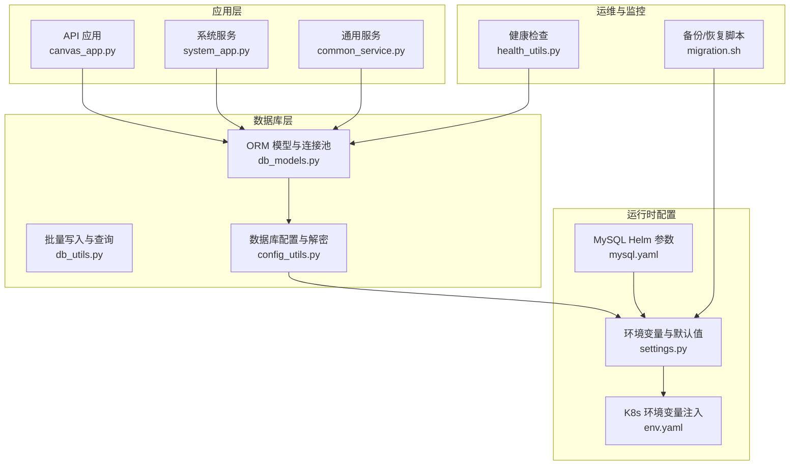
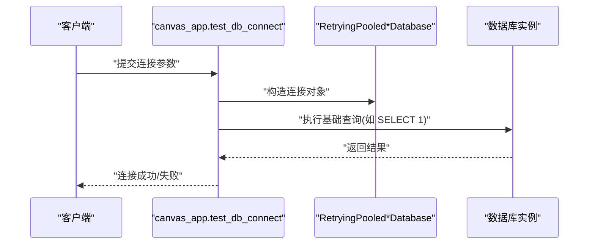
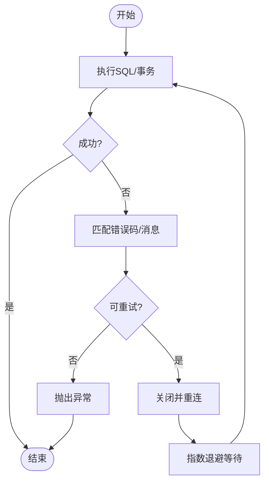
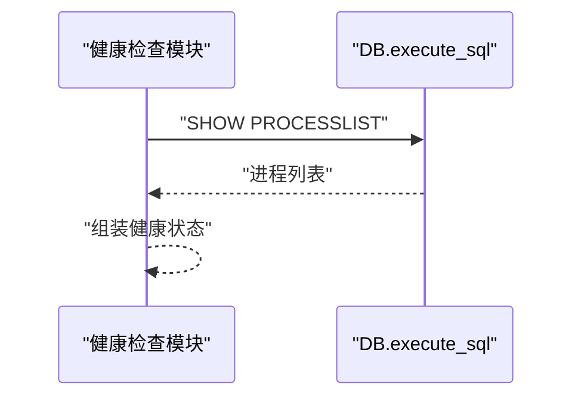
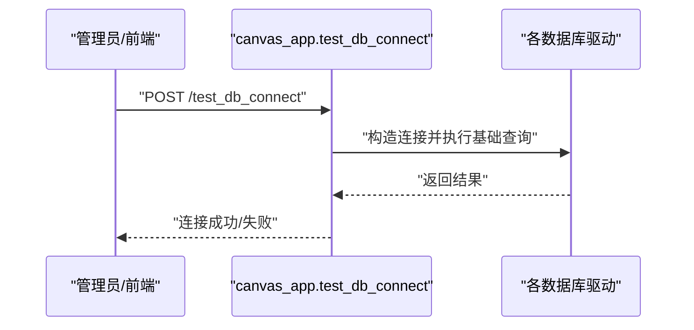
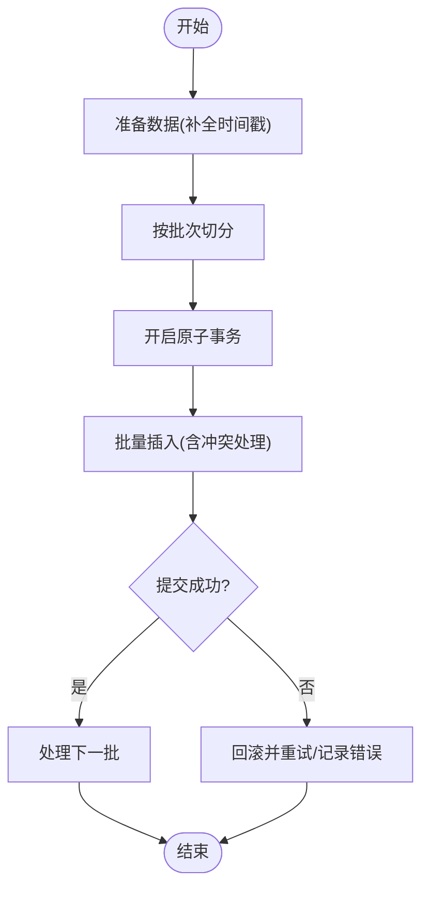
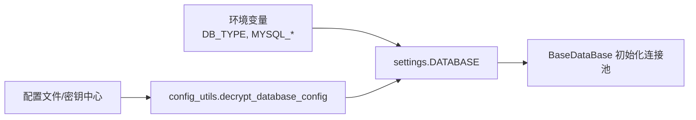
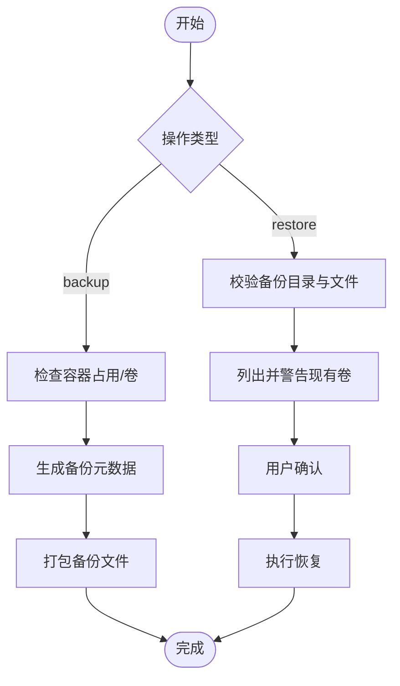
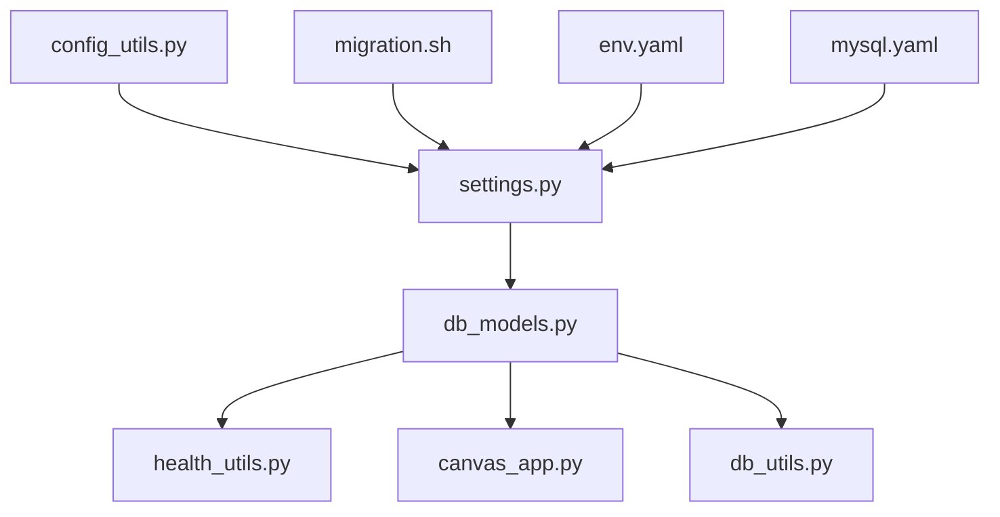

# 数据库问题

<cite>
**本文引用的文件**
- [api/db/db_models.py](file://api/db/db_models.py)
- [api/db/db_utils.py](file://api/db/db_utils.py)
- [api/apps/canvas_app.py](file://api/apps/canvas_app.py)
- [api/utils/health_utils.py](file://api/utils/health_utils.py)
- [common/settings.py](file://common/settings.py)
- [common/config_utils.py](file://common/config_utils.py)
- [docker/migration.sh](file://docker/migration.sh)
- [helm/templates/mysql.yaml](file://helm/templates/mysql.yaml)
- [helm/templates/env.yaml](file://helm/templates/env.yaml)
- [api/db/services/common_service.py](file://api/db/services/common_service.py)
- [web/src/constants/setting.ts](file://web/src/constants/setting.ts)
</cite>

## 目录
1. [简介](#简介)
2. [项目结构](#项目结构)
3. [核心组件](#核心组件)
4. [架构总览](#架构总览)
5. [详细组件分析](#详细组件分析)
6. [依赖分析](#依赖分析)
7. [性能考虑](#性能考虑)
8. [故障排除指南](#故障排除指南)
9. [结论](#结论)
10. [附录](#附录)

## 简介
本手册面向数据库运维与开发人员，聚焦于RAGFlow项目中的数据库问题排查与治理。内容覆盖以下方面：
- 连接问题：连接超时、认证失败、连接池耗尽等的诊断与修复
- 性能问题：慢查询识别、索引优化、查询计划分析与调优
- 数据一致性：事务回滚、数据同步、冲突解决与完整性保障
- 备份与恢复：备份失败、恢复中断、数据丢失的灾难恢复策略
- 配置问题：字符集与时区、存储引擎等关键参数的正确设置
- 维护与清理：表优化、碎片整理、统计信息更新等健康维护

## 项目结构
RAGFlow后端使用Python与Peewee ORM，数据库层通过统一的连接池封装实现对MySQL与PostgreSQL的兼容；同时提供数据库健康检查、连接测试、迁移工具与备份恢复脚本。

**图表来源**
- [api/apps/canvas_app.py](file://api/apps/canvas_app.py)
- [api/db/db_models.py](file://api/db/db_models.py)
- [api/db/db_utils.py](file://api/db/db_utils.py)
- [api/utils/health_utils.py](file://api/utils/health_utils.py)
- [common/settings.py](file://common/settings.py)
- [common/config_utils.py](file://common/config_utils.py)
- [helm/templates/env.yaml](file://helm/templates/env.yaml)
- [helm/templates/mysql.yaml](file://helm/templates/mysql.yaml)
- [docker/migration.sh](file://docker/migration.sh)

**章节来源**
- [api/db/db_models.py](file://api/db/db_models.py)
- [common/settings.py](file://common/settings.py)

## 核心组件
- 连接池与重试封装：针对MySQL与PostgreSQL提供带指数退避重试的连接池类，自动处理连接丢失与事务中断
- 健康检查：提供数据库进程列表查询、连接可用性检测等能力
- 连接测试接口：支持多数据库类型（MySQL/MariaDB、Postgres、MSSQL、DB2、Trino）的连通性验证
- 批量写入：提供批量插入与冲突处理（ON CONFLICT/ON DUPLICATE KEY）
- 配置解密：从配置中读取数据库凭据并进行解密
- 备份/恢复：提供一键备份与恢复脚本，包含容器占用检测、文件校验与交互提示

**章节来源**
- [api/db/db_models.py](file://api/db/db_models.py)
- [api/utils/health_utils.py](file://api/utils/health_utils.py)
- [api/apps/canvas_app.py](file://api/apps/canvas_app.py)
- [api/db/db_utils.py](file://api/db/db_utils.py)
- [common/config_utils.py](file://common/config_utils.py)
- [docker/migration.sh](file://docker/migration.sh)

## 架构总览
数据库层采用“配置驱动 + 连接池 + 重试 + 健康检查”的设计，确保在高并发与网络波动下仍具备稳定的服务能力。

**图表来源**
- [api/apps/canvas_app.py](file://api/apps/canvas_app.py)
- [api/db/db_models.py](file://api/db/db_models.py)

## 详细组件分析

### 连接池与重试机制
- 自动重连：在连接丢失或事务中断时，尝试关闭旧连接并重建新连接
- 指数退避：每次重试等待时间按2的幂次递增，避免雪崩效应
- 错误识别：基于错误码与错误消息关键字判断是否可重试
- 事务安全：在begin阶段同样具备重试与异常处理逻辑

**图表来源**
- [api/db/db_models.py](file://api/db/db_models.py)

**章节来源**
- [api/db/db_models.py](file://api/db/db_models.py)

### 健康检查与连接状态
- 数据库进程列表：通过SHOW PROCESSLIST获取当前活跃连接与命令
- 存储与文档引擎：提供存储与文档引擎的健康探测
- 统一健康报告：整合数据库、Redis、存储与任务执行器状态

**图表来源**
- [api/utils/health_utils.py](file://api/utils/health_utils.py)
- [api/db/db_models.py](file://api/db/db_models.py)

**章节来源**
- [api/utils/health_utils.py](file://api/utils/health_utils.py)

### 连接测试接口（多数据库类型）
- 支持MySQL/MariaDB、Postgres、MSSQL、IBM DB2、Trino等
- 对敏感字段进行脱敏日志输出
- 执行最小化查询以验证连通性

**图表来源**
- [api/apps/canvas_app.py](file://api/apps/canvas_app.py)

**章节来源**
- [api/apps/canvas_app.py](file://api/apps/canvas_app.py)

### 批量写入与冲突处理
- 批量分批写入，减少单次事务压力
- 冲突处理：MySQL使用ON CONFLICT PRESERVE，Postgres使用ON CONFLICT(CONFLICT_TARGET=ID) PRESERVE
- 时间戳与日期字段自动填充

**图表来源**
- [api/db/db_utils.py](file://api/db/db_utils.py)

**章节来源**
- [api/db/db_utils.py](file://api/db/db_utils.py)

### 配置与解密
- 从配置中心读取数据库配置，并解密密码
- 支持通过环境变量覆盖数据库类型与连接参数
- Helm模板中注入主机名、端口与敏感参数

**图表来源**
- [common/settings.py](file://common/settings.py)
- [common/config_utils.py](file://common/config_utils.py)
- [helm/templates/env.yaml](file://helm/templates/env.yaml)
- [helm/templates/mysql.yaml](file://helm/templates/mysql.yaml)

**章节来源**
- [common/settings.py](file://common/settings.py)
- [common/config_utils.py](file://common/config_utils.py)
- [helm/templates/env.yaml](file://helm/templates/env.yaml)
- [helm/templates/mysql.yaml](file://helm/templates/mysql.yaml)

### 备份与恢复脚本
- 备份：校验容器占用、生成压缩包、记录元数据
- 恢复：检查目标目录完整性、确认现有卷、执行恢复流程
- 安全提示：缺失文件、现有卷警告、交互式确认

**图表来源**
- [docker/migration.sh](file://docker/migration.sh)

**章节来源**
- [docker/migration.sh](file://docker/migration.sh)

## 依赖分析
- 组件耦合
  - db_models.py定义了连接池与重试逻辑，被业务服务广泛依赖
  - health_utils.py依赖DB执行健康探测
  - canvas_app.py依赖具体数据库驱动进行连通性测试
  - settings.py与config_utils.py共同决定数据库连接参数
  - migration.sh独立于应用，仅依赖系统工具与Docker环境
- 外部依赖
  - MySQL/PostgreSQL驱动、peewee、tenacity等
  - Helm模板用于Kubernetes部署时的环境注入与参数传递

**图表来源**
- [api/db/db_models.py](file://api/db/db_models.py)
- [api/utils/health_utils.py](file://api/utils/health_utils.py)
- [api/apps/canvas_app.py](file://api/apps/canvas_app.py)
- [api/db/db_utils.py](file://api/db/db_utils.py)
- [common/settings.py](file://common/settings.py)
- [common/config_utils.py](file://common/config_utils.py)
- [docker/migration.sh](file://docker/migration.sh)
- [helm/templates/env.yaml](file://helm/templates/env.yaml)
- [helm/templates/mysql.yaml](file://helm/templates/mysql.yaml)

**章节来源**
- [api/db/db_models.py](file://api/db/db_models.py)
- [common/settings.py](file://common/settings.py)

## 性能考虑
- 连接池与重试
  - 合理设置最大重试次数与初始退避间隔，避免瞬时抖动放大
  - 在高并发场景下，建议评估数据库最大连接数与资源上限
- 查询与索引
  - 使用SHOW PROCESSLIST定位慢查询与长事务
  - 对高频过滤字段建立合适索引，避免全表扫描
- 批量写入
  - 控制批次大小，平衡内存占用与吞吐
  - 利用冲突处理策略减少重复写入
- 统计信息
  - 定期更新统计信息，帮助查询优化器选择更优执行计划

[本节为通用指导，无需特定文件引用]

## 故障排除指南

### 连接问题
- 连接超时
  - 现象：执行SQL时报错包含“Lost connection”“connection refused”等
  - 排查：检查网络连通性、防火墙、数据库最大连接数与资源限制
  - 处理：启用重试与指数退避；必要时扩容数据库实例或调整连接池参数
- 认证失败
  - 现象：登录报错或权限不足
  - 排查：核对用户名、密码、主机白名单、认证插件
  - 处理：使用连接测试接口验证凭据；在配置中确认解密流程正常
- 连接池耗尽
  - 现象：大量请求排队或超时
  - 排查：查看连接池状态与活跃连接数
  - 处理：增加池容量、缩短连接生命周期、优化事务时长

**章节来源**
- [api/db/db_models.py](file://api/db/db_models.py)
- [api/apps/canvas_app.py](file://api/apps/canvas_app.py)
- [api/utils/health_utils.py](file://api/utils/health_utils.py)

### 性能问题
- 慢查询识别
  - 使用SHOW PROCESSLIST定位长时间运行的查询与锁等待
  - 结合业务热点表与索引策略进行优化
- 索引优化
  - 对WHERE、JOIN、ORDER BY涉及的列建立复合索引
  - 定期评估索引使用率，删除冗余索引
- 查询计划分析
  - 在MySQL中使用EXPLAIN，在Postgres中使用EXPLAIN ANALYZE
  - 关注全表扫描、临时表与排序

**章节来源**
- [api/utils/health_utils.py](file://api/utils/health_utils.py)

### 数据一致性问题
- 事务回滚
  - 使用原子事务包裹批量写入，失败自动回滚
  - 对关键路径添加重试装饰器，提升容错能力
- 数据同步与冲突解决
  - 写入时使用冲突处理策略（Preserve），避免主键冲突导致的数据丢失
- 完整性保障
  - 通过迁移工具与模型定义约束，保证表结构演进的一致性

**章节来源**
- [api/db/db_utils.py](file://api/db/db_utils.py)
- [api/db/services/common_service.py](file://api/db/services/common_service.py)
- [api/db/db_models.py](file://api/db/db_models.py)

### 备份与恢复问题
- 备份失败
  - 检查磁盘空间、权限与打包工具可用性
  - 使用脚本提供的完整性校验与元数据记录
- 恢复中断
  - 确认备份文件完整且未被篡改
  - 注意现有卷冲突，按提示清理或迁移
- 数据丢失
  - 优先使用最近一次成功备份
  - 恢复后验证关键表数据与索引完整性

**章节来源**
- [docker/migration.sh](file://docker/migration.sh)

### 配置问题
- 字符集与时区
  - MySQL：确保字符集为utf8mb4，排序规则合理
  - 时区：统一使用UTC或明确的时区偏移，避免跨时区显示异常
- 存储引擎
  - 选择合适的存储引擎（如InnoDB），并根据业务特性调整参数
- 环境变量与注入
  - Helm模板中正确注入主机名、端口与敏感参数
  - 确保DB_TYPE与DATABASE配置一致

**章节来源**
- [helm/templates/mysql.yaml](file://helm/templates/mysql.yaml)
- [helm/templates/env.yaml](file://helm/templates/env.yaml)
- [common/settings.py](file://common/settings.py)

### 维护与清理
- 表优化与碎片整理
  - 定期执行OPTIMIZE TABLE（MySQL）或VACUUM/ANALYZE（Postgres）
- 统计信息更新
  - 更新表与索引统计信息，提高查询优化器准确性
- 日志与告警
  - 结合SHOW PROCESSLIST与业务日志，及时发现异常增长

**章节来源**
- [api/utils/health_utils.py](file://api/utils/health_utils.py)

## 结论
通过统一的连接池与重试机制、完善的健康检查、多数据库类型的连接测试、批量写入与冲突处理、严格的配置解密与注入、以及完备的备份恢复脚本，RAGFlow在数据库稳定性与可维护性方面提供了系统化的保障。建议在生产环境中结合本文的排障步骤与最佳实践，持续监控与优化数据库性能与可靠性。

[本节为总结性内容，无需特定文件引用]

## 附录

### 常用命令与入口
- 连接测试接口：POST /test_db_connect
- 健康检查：GET /health（系统级）、数据库进程列表查询
- 批量写入：bulk_insert_into_db
- 备份/恢复：./docker/migration.sh backup|restore [目录]

**章节来源**
- [api/apps/canvas_app.py](file://api/apps/canvas_app.py)
- [api/utils/health_utils.py](file://api/utils/health_utils.py)
- [api/db/db_utils.py](file://api/db/db_utils.py)
- [docker/migration.sh](file://docker/migration.sh)