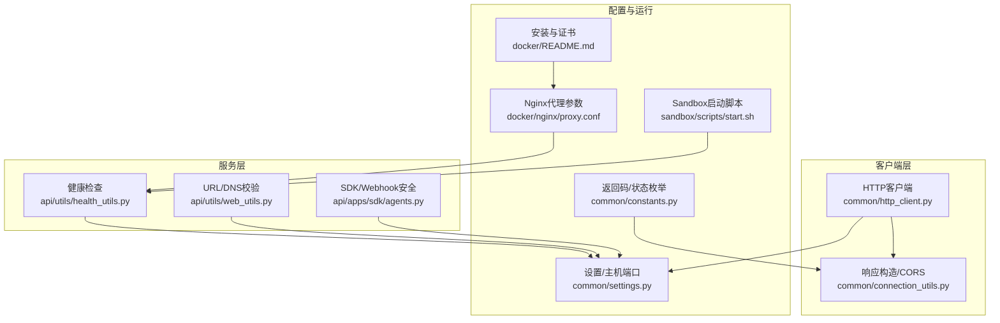
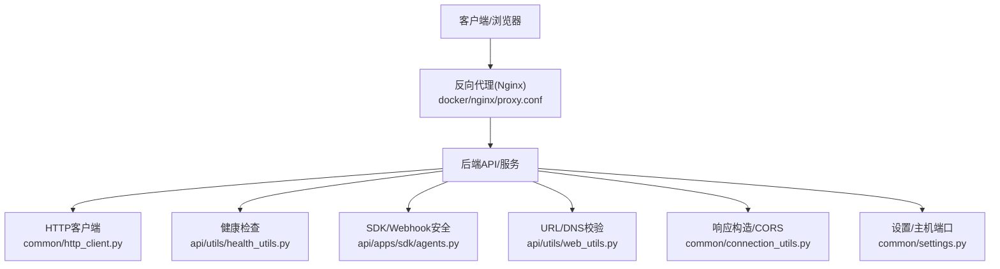
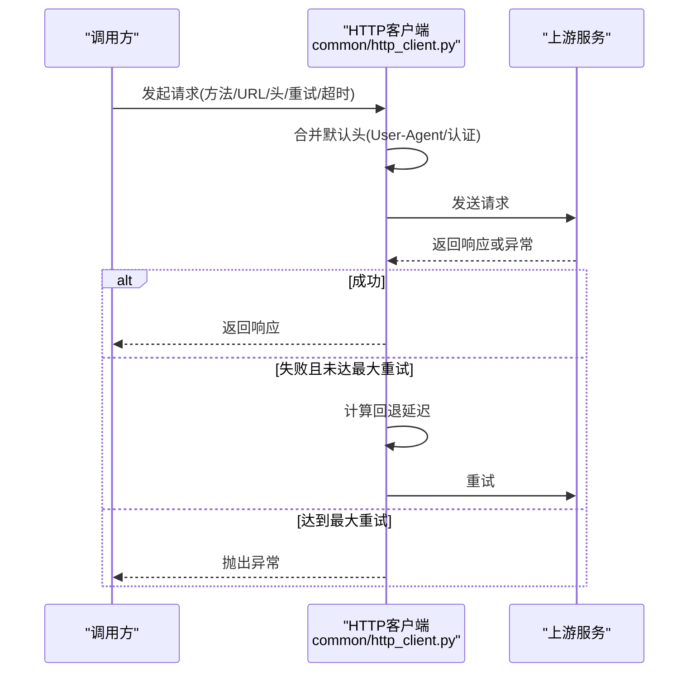
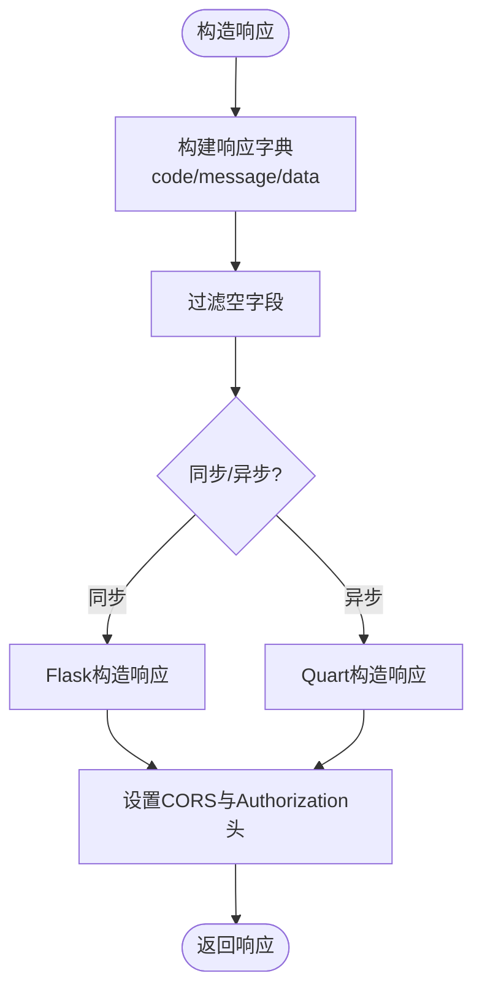
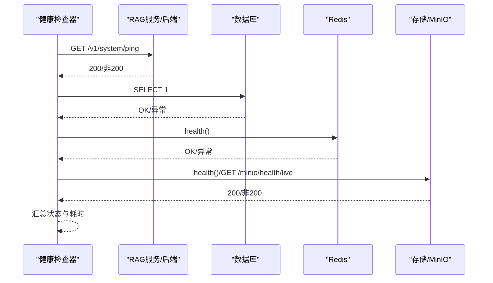
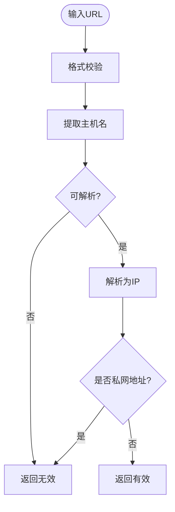
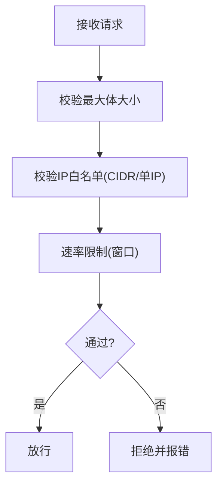
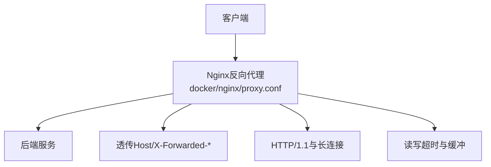
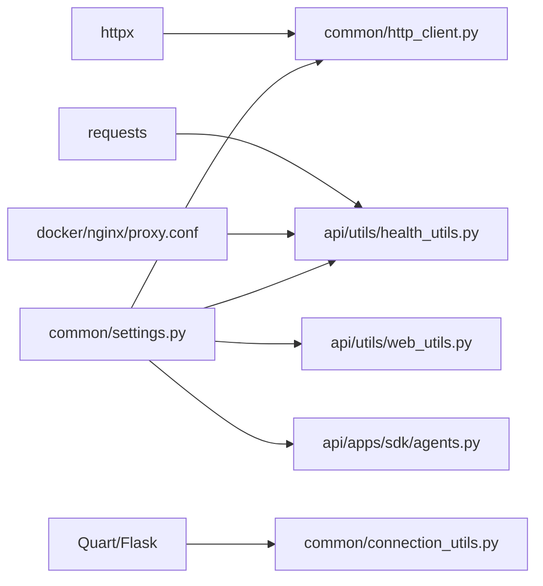

# 网络连接问题

<cite>
**本文引用的文件**
- [common/connection_utils.py](file://common/connection_utils.py)
- [common/http_client.py](file://common/http_client.py)
- [api/utils/web_utils.py](file://api/utils/web_utils.py)
- [api/utils/health_utils.py](file://api/utils/health_utils.py)
- [common/settings.py](file://common/settings.py)
- [api/apps/sdk/agents.py](file://api/apps/sdk/agents.py)
- [docker/nginx/proxy.conf](file://docker/nginx/proxy.conf)
- [docker/README.md](file://docker/README.md)
- [sandbox/scripts/start.sh](file://sandbox/scripts/start.sh)
- [common/constants.py](file://common/constants.py)
</cite>

## 目录
1. [简介](#简介)
2. [项目结构](#项目结构)
3. [核心组件](#核心组件)
4. [架构总览](#架构总览)
5. [详细组件分析](#详细组件分析)
6. [依赖分析](#依赖分析)
7. [性能考虑](#性能考虑)
8. [故障排查指南](#故障排查指南)
9. [结论](#结论)
10. [附录](#附录)

## 简介
本指南聚焦于网络连接问题的诊断与修复，结合代码库中现有的网络客户端、健康检查、代理与反向代理配置、以及SDK/Webhook安全校验等能力，系统化地给出从基础连通性到复杂网络架构（如代理、CDN、负载均衡、VPN）的排障路径。内容覆盖：
- 连通性测试与HTTP客户端问题（超时、重试、代理）
- DNS解析与私网地址校验
- 防火墙与安全组限制（基于IP白名单与速率限制）
- 代理服务器（正向代理、反向代理、超时与缓冲）
- 跨网络环境（CDN、负载均衡、健康检查）

## 项目结构
围绕网络连接问题的关键模块分布如下：
- HTTP客户端与超时控制：common/http_client.py
- 响应构造与CORS：common/connection_utils.py
- 健康检查与服务可达性：api/utils/health_utils.py
- URL与DNS辅助校验：api/utils/web_utils.py
- 设置与主机端口：common/settings.py
- SDK/Webhook安全校验（IP白名单、速率限制）：api/apps/sdk/agents.py
- 反向代理参数（超时、缓冲、头部透传）：docker/nginx/proxy.conf
- 安装与证书部署（HTTPS/SSL）：docker/README.md
- Sandbox启动脚本（端口开放与健康检查）：sandbox/scripts/start.sh
- 返回码与状态枚举：common/constants.py

**图表来源**
- [common/http_client.py:1-258](file://common/http_client.py#L1-L258)
- [common/connection_utils.py:104-141](file://common/connection_utils.py#L104-L141)
- [api/utils/health_utils.py:148-164](file://api/utils/health_utils.py#L148-L164)
- [api/utils/web_utils.py:159-173](file://api/utils/web_utils.py#L159-L173)
- [api/apps/sdk/agents.py:184-275](file://api/apps/sdk/agents.py#L184-L275)
- [common/settings.py:225-230](file://common/settings.py#L225-L230)
- [docker/nginx/proxy.conf:1-12](file://docker/nginx/proxy.conf#L1-L12)
- [docker/README.md:255-271](file://docker/README.md#L255-L271)
- [sandbox/scripts/start.sh:63-67](file://sandbox/scripts/start.sh#L63-L67)
- [common/constants.py:42-59](file://common/constants.py#L42-L59)

**章节来源**
- [common/http_client.py:1-258](file://common/http_client.py#L1-L258)
- [common/connection_utils.py:104-141](file://common/connection_utils.py#L104-L141)
- [api/utils/health_utils.py:148-164](file://api/utils/health_utils.py#L148-L164)
- [api/utils/web_utils.py:159-173](file://api/utils/web_utils.py#L159-L173)
- [api/apps/sdk/agents.py:184-275](file://api/apps/sdk/agents.py#L184-L275)
- [common/settings.py:225-230](file://common/settings.py#L225-L230)
- [docker/nginx/proxy.conf:1-12](file://docker/nginx/proxy.conf#L1-L12)
- [docker/README.md:255-271](file://docker/README.md#L255-L271)
- [sandbox/scripts/start.sh:63-67](file://sandbox/scripts/start.sh#L63-L67)
- [common/constants.py:42-59](file://common/constants.py#L42-L59)

## 核心组件
- HTTP客户端与重试退避
  - 默认超时、最大重试次数、回退因子、跟随重定向、最大重定向数、代理、User-Agent与认证头合并、敏感URL脱敏日志。
  - 提供同步与异步请求封装，统一异常处理与重试策略。
- 响应构造与CORS
  - 统一响应体结构与跨域头设置；支持同步/异步响应构造。
- 健康检查
  - 数据库、Redis、文档引擎、存储、MinIO、MySQL进程列表、RAG服务自身、任务执行器心跳等健康探测。
- URL与DNS校验
  - URL格式与主机名有效性校验，解析到IP后判断是否为私网地址，避免内网地址暴露。
- SDK/Webhook安全
  - 请求体大小限制、IP白名单（CIDR/单IP）、速率限制（窗口模型）。
- 反向代理参数
  - 透传Host/X-Forwarded-*、HTTP版本、长连接、读写超时、缓冲区大小与临时文件写入大小。
- 设置与主机端口
  - 主机IP与端口来自配置，用于健康检查与服务发现。

**章节来源**
- [common/http_client.py:27-36](file://common/http_client.py#L27-L36)
- [common/http_client.py:119-184](file://common/http_client.py#L119-L184)
- [common/http_client.py:187-244](file://common/http_client.py#L187-L244)
- [common/connection_utils.py:104-141](file://common/connection_utils.py#L104-L141)
- [api/utils/health_utils.py:148-164](file://api/utils/health_utils.py#L148-L164)
- [api/utils/web_utils.py:159-173](file://api/utils/web_utils.py#L159-L173)
- [api/apps/sdk/agents.py:234-275](file://api/apps/sdk/agents.py#L234-L275)
- [docker/nginx/proxy.conf:1-12](file://docker/nginx/proxy.conf#L1-L12)
- [common/settings.py:225-230](file://common/settings.py#L225-L230)

## 架构总览
下图展示从客户端到服务端的关键网络路径与校验点，包括HTTP客户端、健康检查、反向代理与安全校验。

**图表来源**
- [docker/nginx/proxy.conf:1-12](file://docker/nginx/proxy.conf#L1-L12)
- [common/http_client.py:119-184](file://common/http_client.py#L119-L184)
- [api/utils/health_utils.py:148-164](file://api/utils/health_utils.py#L148-L164)
- [api/apps/sdk/agents.py:184-275](file://api/apps/sdk/agents.py#L184-L275)
- [api/utils/web_utils.py:159-173](file://api/utils/web_utils.py#L159-L173)
- [common/connection_utils.py:104-141](file://common/connection_utils.py#L104-L141)
- [common/settings.py:225-230](file://common/settings.py#L225-L230)

## 详细组件分析

### HTTP客户端与超时控制
- 关键特性
  - 默认超时、最大重试次数、回退因子、跟随重定向、最大重定向数、代理、User-Agent与认证头合并。
  - 敏感URL参数脱敏日志，避免凭据泄露。
  - 异步/同步双实现，统一异常处理与重试策略。
- 适用场景
  - 请求超时、网络抖动、上游限流或熔断后的自动重试。
- 排障要点
  - 检查环境变量对默认值的影响（超时、重试、回退因子、代理、User-Agent）。
  - 观察日志中脱敏后的URL与耗时，定位慢请求与重试行为。

**图表来源**
- [common/http_client.py:119-184](file://common/http_client.py#L119-L184)
- [common/http_client.py:187-244](file://common/http_client.py#L187-L244)

**章节来源**
- [common/http_client.py:27-36](file://common/http_client.py#L27-L36)
- [common/http_client.py:119-184](file://common/http_client.py#L119-L184)
- [common/http_client.py:187-244](file://common/http_client.py#L187-L244)

### 响应构造与CORS
- 关键特性
  - 统一响应体结构（code/message/data），设置跨域头（允许任意源、方法、头）。
  - 支持同步/异步响应构造，并可附加Authorization头。
- 适用场景
  - 解决前端跨域问题、统一错误与成功响应格式。
- 排障要点
  - 若出现跨域失败，检查CORS头是否正确下发；若需要鉴权，确认Authorization头是否随响应返回。

**图表来源**
- [common/connection_utils.py:104-141](file://common/connection_utils.py#L104-L141)

**章节来源**
- [common/connection_utils.py:104-141](file://common/connection_utils.py#L104-L141)

### 健康检查与服务可达性
- 关键特性
  - 数据库、Redis、文档引擎、存储、MinIO、MySQL进程列表、RAG服务自身、任务执行器心跳等健康探测。
  - 使用requests进行外部健康端点探测，包含超时与错误信息记录。
- 适用场景
  - 容器编排环境下的存活/就绪探针，快速定位后端依赖不可用。
- 排障要点
  - 检查服务端口与监听地址（注意0.0.0.0替换为127.0.0.1进行探测）。
  - 关注各组件返回的耗时与错误详情，定位具体依赖问题。

**图表来源**
- [api/utils/health_utils.py:148-164](file://api/utils/health_utils.py#L148-L164)
- [api/utils/health_utils.py:33-68](file://api/utils/health_utils.py#L33-L68)
- [api/utils/health_utils.py:120-133](file://api/utils/health_utils.py#L120-L133)

**章节来源**
- [api/utils/health_utils.py:33-68](file://api/utils/health_utils.py#L33-L68)
- [api/utils/health_utils.py:120-133](file://api/utils/health_utils.py#L120-L133)
- [api/utils/health_utils.py:148-164](file://api/utils/health_utils.py#L148-L164)

### URL与DNS校验
- 关键特性
  - URL格式与主机名校验；解析到IP后判断是否为私网地址，避免内网地址暴露。
- 适用场景
  - 输入校验与安全策略，防止内网地址被作为目标。
- 排障要点
  - 若域名解析失败，检查DNS配置与网络连通性；若提示私网地址，需调整目标或网络策略。

**图表来源**
- [api/utils/web_utils.py:159-173](file://api/utils/web_utils.py#L159-L173)

**章节来源**
- [api/utils/web_utils.py:159-173](file://api/utils/web_utils.py#L159-L173)

### SDK/Webhook安全校验（IP白名单与速率限制）
- 关键特性
  - 最大请求体大小限制、IP白名单（CIDR/单IP）、简单内存型速率限制（按时间窗口计数）。
- 适用场景
  - 防止恶意请求与滥用，限制来源IP范围。
- 排障要点
  - 若请求被拒绝，检查客户端IP是否在白名单内；关注请求体大小是否超过阈值；评估速率限制窗口设置。

**图表来源**
- [api/apps/sdk/agents.py:234-275](file://api/apps/sdk/agents.py#L234-L275)
- [api/apps/sdk/agents.py:241-260](file://api/apps/sdk/agents.py#L241-L260)

**章节来源**
- [api/apps/sdk/agents.py:184-275](file://api/apps/sdk/agents.py#L184-L275)

### 反向代理参数（Nginx）
- 关键特性
  - 透传Host、X-Forwarded-For、X-Forwarded-Proto；HTTP/1.1、长连接；读写超时、缓冲区大小与临时文件写入大小。
- 适用场景
  - CDN/负载均衡前置时的头部透传与长连接优化；大文件上传/下载的缓冲与超时配置。
- 排障要点
  - 若出现请求超时或上传失败，检查proxy_read_timeout/proxy_send_timeout与缓冲区设置；确认X-Forwarded-*是否正确透传。

**图表来源**
- [docker/nginx/proxy.conf:1-12](file://docker/nginx/proxy.conf#L1-L12)

**章节来源**
- [docker/nginx/proxy.conf:1-12](file://docker/nginx/proxy.conf#L1-L12)

### HTTPS/SSL与证书部署
- 关键特性
  - 建议域名A记录指向服务器IP；生产环境使用Let’s Encrypt或现有证书；确保证书链完整。
- 适用场景
  - 浏览器安全警告与证书链不完整导致的连接失败。
- 排障要点
  - 确认域名解析、端口占用（80/443）、证书链完整性与容器挂载路径正确。

**章节来源**
- [docker/README.md:255-271](file://docker/README.md#L255-L271)

### Sandbox启动脚本（端口开放与健康检查）
- 关键特性
  - 启动后等待端口开放与健康接口(/healthz)可用，再运行安全测试。
- 适用场景
  - 容器编排环境下的端口可达性与服务健康验证。
- 排障要点
  - 若启动失败，检查端口占用、容器日志与健康接口返回。

**章节来源**
- [sandbox/scripts/start.sh:63-67](file://sandbox/scripts/start.sh#L63-L67)

## 依赖分析
- 组件耦合
  - HTTP客户端依赖设置模块以获取默认超时、重试、代理等配置。
  - 健康检查依赖设置模块提供的主机IP与端口，以及各后端组件连接。
  - SDK/Webhook安全校验依赖请求对象的远程地址与内容长度。
  - 反向代理配置影响上游服务的日志与头部信息。
- 外部依赖
  - httpx（异步/同步HTTP客户端）
  - requests（健康检查中的外部探测）
  - Quart/Flask（响应构造）
  - ipaddress（CIDR/单IP校验）

**图表来源**
- [common/settings.py:225-230](file://common/settings.py#L225-L230)
- [common/http_client.py:119-184](file://common/http_client.py#L119-L184)
- [api/utils/health_utils.py:148-164](file://api/utils/health_utils.py#L148-L164)
- [api/utils/web_utils.py:159-173](file://api/utils/web_utils.py#L159-L173)
- [api/apps/sdk/agents.py:184-275](file://api/apps/sdk/agents.py#L184-L275)
- [docker/nginx/proxy.conf:1-12](file://docker/nginx/proxy.conf#L1-L12)

**章节来源**
- [common/settings.py:225-230](file://common/settings.py#L225-L230)
- [common/http_client.py:119-184](file://common/http_client.py#L119-L184)
- [api/utils/health_utils.py:148-164](file://api/utils/health_utils.py#L148-L164)
- [api/utils/web_utils.py:159-173](file://api/utils/web_utils.py#L159-L173)
- [api/apps/sdk/agents.py:184-275](file://api/apps/sdk/agents.py#L184-L275)
- [docker/nginx/proxy.conf:1-12](file://docker/nginx/proxy.conf#L1-L12)

## 性能考虑
- 超时与重试
  - 合理设置HTTP_CLIENT_TIMEOUT、HTTP_CLIENT_MAX_RETRIES与HTTP_CLIENT_BACKOFF_FACTOR，避免过短超时导致频繁重试或过长超时影响用户体验。
- 缓冲与长连接
  - 在反向代理中适当增大proxy_buffer_size与proxy_buffers，减少上游压力；启用长连接降低握手开销。
- 健康检查频率
  - 健康检查应避免过于频繁，以免对后端造成额外压力；可结合业务峰值调整探测间隔。

## 故障排查指南

### 1. 连通性测试与基础网络
- 使用健康检查接口验证服务可达性
  - 目标：确认后端服务监听与端口开放
  - 方法：调用/v1/system/ping，或参考启动脚本中的wait-for-it逻辑
  - 注意：将0.0.0.0替换为127.0.0.1进行探测
- DNS解析问题
  - 使用URL/DNS校验函数确认域名可解析且非私网地址
  - 若解析失败，检查DNS服务器配置与网络连通性
- 私网地址限制
  - 若返回无效，确认目标地址不是私网地址（内网暴露风险）

**章节来源**
- [api/utils/health_utils.py:148-164](file://api/utils/health_utils.py#L148-L164)
- [sandbox/scripts/start.sh:63-67](file://sandbox/scripts/start.sh#L63-L67)
- [api/utils/web_utils.py:159-173](file://api/utils/web_utils.py#L159-L173)

### 2. HTTP客户端问题（超时、重试、代理）
- 请求超时
  - 检查HTTP_CLIENT_TIMEOUT与ENABLE_TIMEOUT_ASSERTION环境变量
  - 观察日志中的耗时与重试次数，定位慢上游或网络抖动
- 代理配置
  - 设置HTTP_CLIENT_PROXY以启用代理；确认代理地址与认证（如需）
- 重定向与回退
  - 调整HTTP_CLIENT_FOLLOW_REDIRECTS、HTTP_CLIENT_MAX_REDIRECTS与HTTP_CLIENT_BACKOFF_FACTOR
- SSL证书错误
  - 生产环境使用完整证书链；开发环境可使用自签名证书但需浏览器信任

**章节来源**
- [common/http_client.py:27-36](file://common/http_client.py#L27-L36)
- [common/http_client.py:119-184](file://common/http_client.py#L119-L184)
- [common/http_client.py:187-244](file://common/http_client.py#L187-L244)
- [docker/README.md:255-271](file://docker/README.md#L255-L271)

### 3. DNS解析问题
- 域名解析失败
  - 检查DNS服务器配置、防火墙策略与网络连通性
  - 使用URL/DNS校验函数进行快速验证
- DNS缓存问题
  - 清理本地DNS缓存或更换DNS服务器
- DNS服务器配置
  - 确保域名A记录指向正确IP，避免CNAME/别名冲突

**章节来源**
- [api/utils/web_utils.py:159-173](file://api/utils/web_utils.py#L159-L173)

### 4. 防火墙与网络安全
- 端口阻塞
  - 使用健康检查与wait-for-it脚本验证端口开放
- IP白名单与速率限制
  - SDK/Webhook安全校验支持IP白名单与速率限制，确保仅允许受信来源
- 安全组设置
  - 确认云/本地防火墙放行所需端口与协议

**章节来源**
- [api/apps/sdk/agents.py:234-275](file://api/apps/sdk/agents.py#L234-L275)
- [sandbox/scripts/start.sh:63-67](file://sandbox/scripts/start.sh#L63-L67)

### 5. 代理服务器问题
- 正向代理
  - 通过HTTP_CLIENT_PROXY启用；检查代理认证与网络连通
- 反向代理
  - 检查Nginx配置中的头部透传、超时与缓冲设置
- 代理链路与缓存
  - 确认代理链路中各节点正常；必要时清理代理缓存

**章节来源**
- [common/http_client.py:144](file://common/http_client.py#L144)
- [docker/nginx/proxy.conf:1-12](file://docker/nginx/proxy.conf#L1-L12)

### 6. 跨网络环境（VPN、负载均衡、CDN）
- VPN连接
  - 确认VPN路由与DNS解析；避免私网地址暴露
- 负载均衡
  - 检查健康检查端点与会话保持策略；观察后端实例状态
- CDN配置
  - 确认缓存策略与边缘节点可达性；检查证书与回源配置

**章节来源**
- [api/utils/health_utils.py:148-164](file://api/utils/health_utils.py#L148-L164)
- [docker/README.md:255-271](file://docker/README.md#L255-L271)

## 结论
通过HTTP客户端的超时与重试、健康检查的端到端验证、反向代理的头部透传与缓冲优化、以及SDK/Webhook的安全校验，可以系统化地诊断与修复大多数网络连接问题。建议在生产环境中：
- 明确超时与重试策略，避免过度重试或过长超时
- 配置完整的证书链与域名解析
- 使用反向代理优化长连接与缓冲
- 严格控制IP白名单与速率限制
- 对跨网络环境（VPN/负载均衡/CDN）进行专项测试与监控

## 附录
- 常用环境变量
  - HTTP_CLIENT_TIMEOUT、HTTP_CLIENT_MAX_RETRIES、HTTP_CLIENT_BACKOFF_FACTOR、HTTP_CLIENT_PROXY、HTTP_CLIENT_USER_AGENT
- 健康检查端点
  - /v1/system/ping（RAG服务）
  - /minio/health/live（MinIO）
- 返回码与状态枚举
  - 参考返回码定义，便于统一错误处理与告警

**章节来源**
- [common/constants.py:42-59](file://common/constants.py#L42-L59)
- [api/utils/health_utils.py:148-164](file://api/utils/health_utils.py#L148-L164)
- [api/utils/health_utils.py:120-133](file://api/utils/health_utils.py#L120-L133)