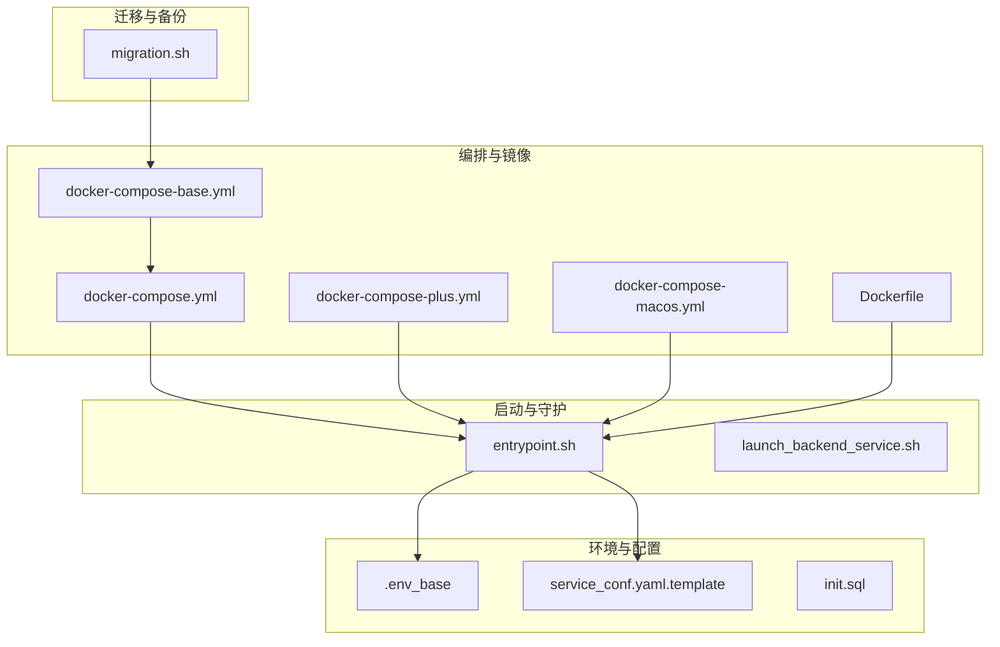
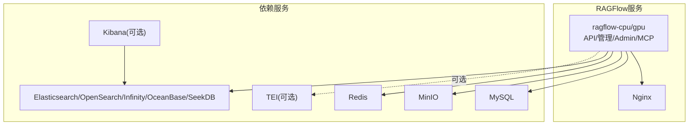
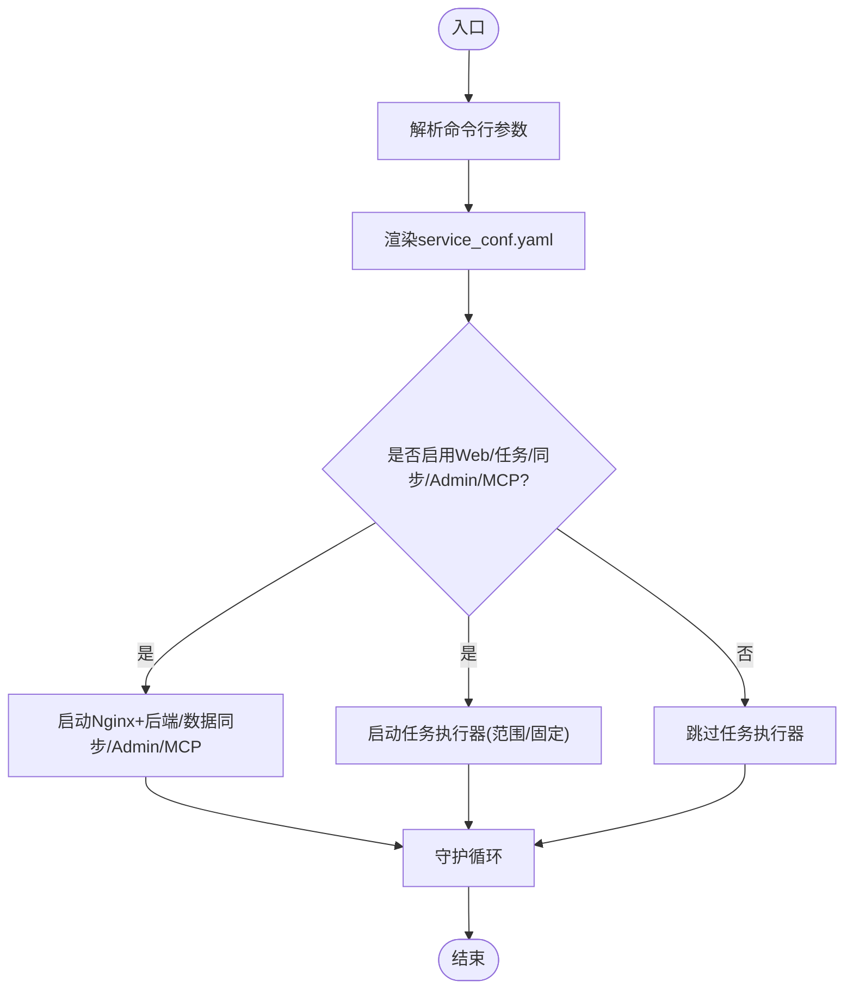
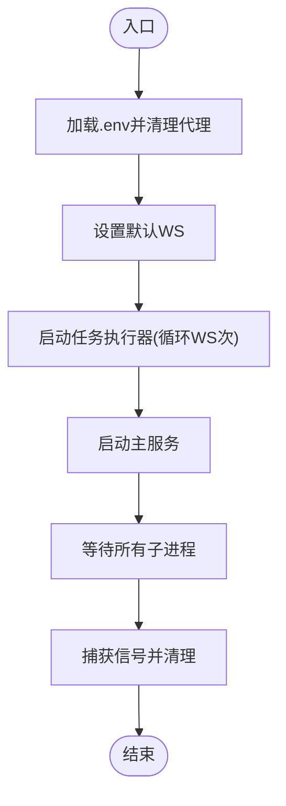
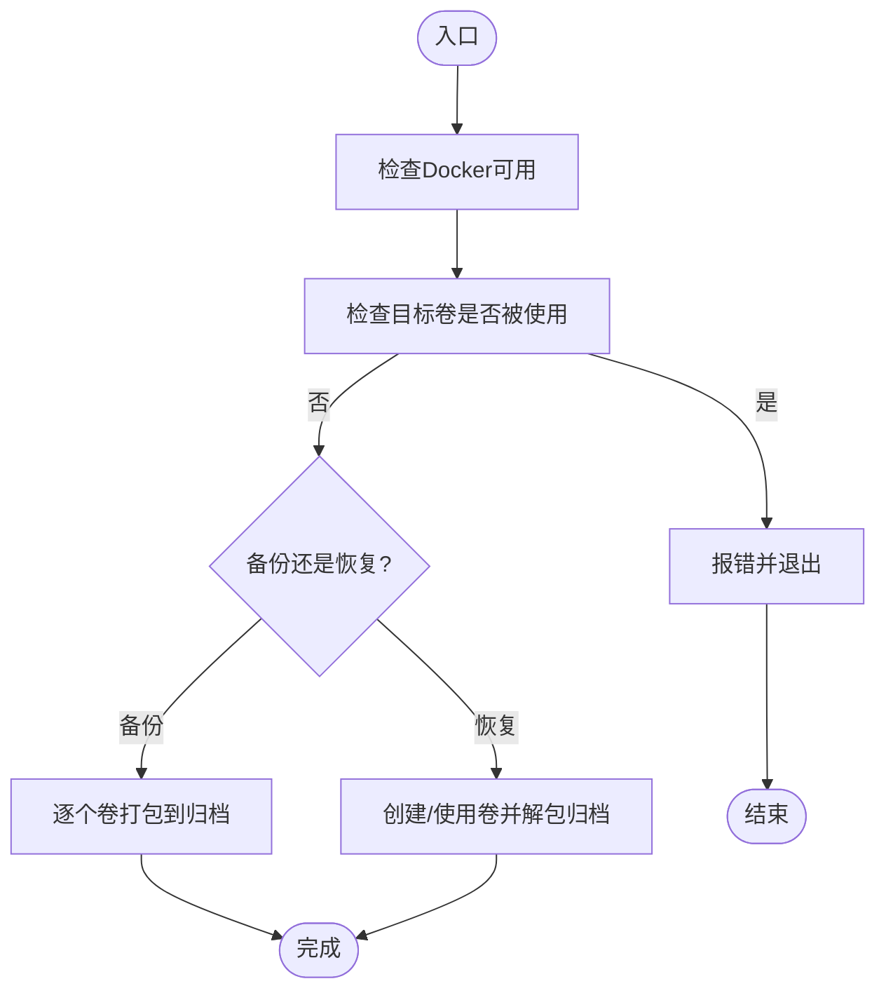
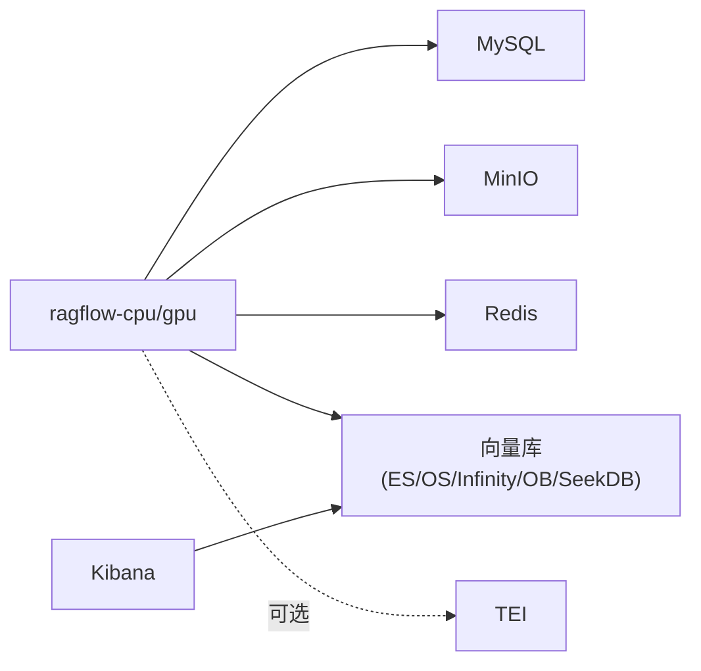
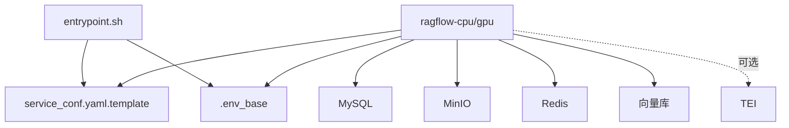

# 部署问题

<cite>
**本文引用的文件**
- [docker-compose.yml](file://docker/docker-compose.yml)
- [docker-compose-plus.yml](file://docker/docker-compose-plus.yml)
- [docker-compose-macos.yml](file://docker/docker-compose-macos.yml)
- [docker-compose-base.yml](file://docker/docker-compose-base.yml)
- [entrypoint.sh](file://docker/entrypoint.sh)
- [launch_backend_service.sh](file://docker/launch_backend_service.sh)
- [migration.sh](file://docker/migration.sh)
- [.env_base](file://docker/.env_base)
- [service_conf.yaml.template](file://docker/service_conf.yaml.template)
- [init.sql](file://docker/init.sql)
- [Dockerfile](file://Dockerfile)
- [README.md](file://docker/README.md)
</cite>

## 目录
1. [简介](#简介)
2. [项目结构](#项目结构)
3. [核心组件](#核心组件)
4. [架构总览](#架构总览)
5. [详细组件分析](#详细组件分析)
6. [依赖关系分析](#依赖关系分析)
7. [性能考量](#性能考量)
8. [故障排除指南](#故障排除指南)
9. [结论](#结论)
10. [附录](#附录)

## 简介
本指南聚焦于RAGFlow在Docker环境中的部署与排障，覆盖容器启动失败、端口冲突、网络连通性、环境变量配置错误、服务依赖状态检查、版本兼容性、迁移过程应急处理以及部署前后验证清单。内容基于仓库内docker编排、入口脚本、迁移脚本与模板配置文件进行归纳总结，帮助快速定位并解决问题。

## 项目结构
围绕Docker部署的核心文件组织如下：
- 编排与镜像：docker-compose*.yml、Dockerfile
- 启动与守护：entrypoint.sh、launch_backend_service.sh
- 迁移与备份：migration.sh
- 环境与配置：.env_base、service_conf.yaml.template、init.sql
- 文档与示例：README.md

**图表来源**
- [docker-compose.yml:1-133](file://docker/docker-compose.yml#L1-L133)
- [docker-compose-plus.yml:1-143](file://docker/docker-compose-plus.yml#L1-L143)
- [docker-compose-macos.yml:1-47](file://docker/docker-compose-macos.yml#L1-L47)
- [docker-compose-base.yml:1-326](file://docker/docker-compose-base.yml#L1-L326)
- [Dockerfile:1-224](file://Dockerfile#L1-L224)
- [entrypoint.sh:1-273](file://docker/entrypoint.sh#L1-L273)
- [launch_backend_service.sh:1-130](file://docker/launch_backend_service.sh#L1-L130)
- [migration.sh:1-298](file://docker/migration.sh#L1-L298)
- [.env_base:1-280](file://docker/.env_base#L1-L280)
- [service_conf.yaml.template:1-200](file://docker/service_conf.yaml.template#L1-L200)
- [init.sql:1-2](file://docker/init.sql#L1-L2)

**章节来源**
- [docker-compose.yml:1-133](file://docker/docker-compose.yml#L1-L133)
- [docker-compose-plus.yml:1-143](file://docker/docker-compose-plus.yml#L1-L143)
- [docker-compose-macos.yml:1-47](file://docker/docker-compose-macos.yml#L1-L47)
- [docker-compose-base.yml:1-326](file://docker/docker-compose-base.yml#L1-L326)
- [Dockerfile:1-224](file://Dockerfile#L1-L224)
- [entrypoint.sh:1-273](file://docker/entrypoint.sh#L1-L273)
- [launch_backend_service.sh:1-130](file://docker/launch_backend_service.sh#L1-L130)
- [migration.sh:1-298](file://docker/migration.sh#L1-L298)
- [.env_base:1-280](file://docker/.env_base#L1-L280)
- [service_conf.yaml.template:1-200](file://docker/service_conf.yaml.template#L1-L200)
- [init.sql:1-2](file://docker/init.sql#L1-L2)
- [README.md:1-271](file://docker/README.md#L1-L271)

## 核心组件
- 容器编排与服务发现：通过多份compose文件组合，定义RAGFlow主服务与依赖（Elasticsearch/OpenSearch/Infinity/OceanBase/SeekDB、MySQL、MinIO、Redis、可选TEI嵌入服务、可选Kibana）。
- 入口脚本：负责解析参数、渲染配置、按需启动Web服务器（Nginx+后端）、任务执行器、数据同步、Admin服务与MCP服务，并具备进程守护与重试逻辑。
- 迁移脚本：提供备份与恢复流程，校验卷使用状态，避免数据损坏。
- 环境变量与服务配置：集中于.env_base与service_conf.yaml.template，用于控制数据库、对象存储、向量库、缓存、端口映射、日志级别等。

**章节来源**
- [docker-compose.yml:1-133](file://docker/docker-compose.yml#L1-L133)
- [docker-compose-base.yml:1-326](file://docker/docker-compose-base.yml#L1-L326)
- [entrypoint.sh:1-273](file://docker/entrypoint.sh#L1-L273)
- [migration.sh:1-298](file://docker/migration.sh#L1-L298)
- [.env_base:1-280](file://docker/.env_base#L1-L280)
- [service_conf.yaml.template:1-200](file://docker/service_conf.yaml.template#L1-L200)

## 架构总览
下图展示容器间依赖与交互：RAGFlow主服务依赖MySQL、MinIO、Redis；根据DOC_ENGINE选择向量库（Elasticsearch/OpenSearch/Infinity/OceanBase/SeekDB）；可选TEI提供嵌入服务；Admin/MCP服务可按需启用；Nginx作为反向代理暴露HTTP/HTTPS/API端口。

**图表来源**
- [docker-compose.yml:4-47](file://docker/docker-compose.yml#L4-L47)
- [docker-compose-plus.yml:4-50](file://docker/docker-compose-plus.yml#L4-L50)
- [docker-compose-base.yml:176-241](file://docker/docker-compose-base.yml#L176-L241)
- [docker-compose-base.yml:2-34](file://docker/docker-compose-base.yml#L2-L34)
- [docker-compose-base.yml:36-70](file://docker/docker-compose-base.yml#L36-L70)
- [docker-compose-base.yml:72-97](file://docker/docker-compose-base.yml#L72-L97)
- [docker-compose-base.yml:99-146](file://docker/docker-compose-base.yml#L99-L146)
- [docker-compose-base.yml:279-298](file://docker/docker-compose-base.yml#L279-L298)
- [docker-compose-base.yml:244-276](file://docker/docker-compose-base.yml#L244-L276)

## 详细组件分析

### 组件A：容器启动与守护（entrypoint.sh）
- 功能要点
  - 命令行参数解析：支持禁用Web、禁用任务执行器、禁用数据同步、启用MCP/管理服务、范围化消费者、工作线程数、主机ID等。
  - 配置渲染：将service_conf.yaml.template中的环境变量占位符替换为实际值，生成最终配置文件。
  - 组件启动：按标志位启动Nginx+后端、数据同步、Admin服务、MCP服务；任务执行器支持范围或固定数量模式。
  - Docling/Mineru支持：按USE_DOCLING动态安装Docling；MinerU相关注释提示。
  - 进程守护：每个子进程以“退出即重启”策略守护，保证服务可用性。
- 关键流程（简化）
  - 解析参数 → 渲染配置 → 按标志位启动组件 → 子进程守护 → 等待

**图表来源**
- [entrypoint.sh:66-149](file://docker/entrypoint.sh#L66-L149)
- [entrypoint.sh:154-173](file://docker/entrypoint.sh#L154-L173)
- [entrypoint.sh:220-270](file://docker/entrypoint.sh#L220-L270)

**章节来源**
- [entrypoint.sh:1-273](file://docker/entrypoint.sh#L1-L273)

### 组件B：后端服务启动脚本（launch_backend_service.sh）
- 功能要点
  - 加载.env并清理代理变量，设置Python路径与jemalloc库路径。
  - 任务执行器与主服务均带重试机制，最多尝试若干次。
  - 使用信号捕获优雅关闭，终止所有子进程。
- 关键流程（简化）
  - 加载环境 → 设置默认工作线程 → 启动多个任务执行器 → 启动主服务 → 等待并清理

**图表来源**
- [launch_backend_service.sh:7-22](file://docker/launch_backend_service.sh#L7-L22)
- [launch_backend_service.sh:70-92](file://docker/launch_backend_service.sh#L70-L92)
- [launch_backend_service.sh:94-115](file://docker/launch_backend_service.sh#L94-L115)
- [launch_backend_service.sh:53-68](file://docker/launch_backend_service.sh#L53-L68)

**章节来源**
- [launch_backend_service.sh:1-130](file://docker/launch_backend_service.sh#L1-L130)

### 组件C：迁移与备份（migration.sh）
- 功能要点
  - 备份：打包MySQL、MinIO、Redis、Elasticsearch数据卷到归档文件。
  - 恢复：从归档还原数据卷，自动创建缺失卷；对现有卷给出覆盖警告并确认。
  - 安全检查：检测是否有容器正在使用目标卷，避免并发操作导致数据损坏。
  - 交互提示：提供帮助信息、停止/重启建议、备份文件大小列表。
- 关键流程（简化）
  - 校验Docker → 检查容器占用 → 备份/恢复卷 → 输出结果

**图表来源**
- [migration.sh:45-52](file://docker/migration.sh#L45-L52)
- [migration.sh:60-114](file://docker/migration.sh#L60-L114)
- [migration.sh:127-173](file://docker/migration.sh#L127-L173)
- [migration.sh:175-263](file://docker/migration.sh#L175-L263)

**章节来源**
- [migration.sh:1-298](file://docker/migration.sh#L1-L298)

### 组件D：编排与服务依赖（compose与基础服务）
- 关键点
  - 主服务（ragflow-cpu/gpu）依赖mysql健康状态；可挂载Nginx配置、日志目录、模板配置与入口脚本。
  - 基础服务包含ES/OpenSearch/Infinity/OceanBase/SeekDB、MySQL、MinIO、Redis、可选TEI/Kibana；各服务均配置健康检查与资源限制。
  - macOS专用编排通过平台限定与本地构建。
- 依赖关系
  - 主服务 → MySQL/MinIO/Redis/VDB
  - 可选 → TEI/Kibana

**图表来源**
- [docker-compose.yml:4-47](file://docker/docker-compose.yml#L4-L47)
- [docker-compose-plus.yml:4-50](file://docker/docker-compose-plus.yml#L4-L50)
- [docker-compose-macos.yml:4-25](file://docker/docker-compose-macos.yml#L4-L25)
- [docker-compose-base.yml:176-241](file://docker/docker-compose-base.yml#L176-L241)
- [docker-compose-base.yml:2-34](file://docker/docker-compose-base.yml#L2-L34)
- [docker-compose-base.yml:36-70](file://docker/docker-compose-base.yml#L36-L70)
- [docker-compose-base.yml:72-97](file://docker/docker-compose-base.yml#L72-L97)
- [docker-compose-base.yml:99-146](file://docker/docker-compose-base.yml#L99-L146)
- [docker-compose-base.yml:279-298](file://docker/docker-compose-base.yml#L279-L298)

**章节来源**
- [docker-compose.yml:1-133](file://docker/docker-compose.yml#L1-L133)
- [docker-compose-plus.yml:1-143](file://docker/docker-compose-plus.yml#L1-L143)
- [docker-compose-macos.yml:1-47](file://docker/docker-compose-macos.yml#L1-L47)
- [docker-compose-base.yml:1-326](file://docker/docker-compose-base.yml#L1-L326)

### 组件E：环境变量与服务配置（.env_base与service_conf.yaml.template）
- .env_base
  - 控制向量库类型（DOC_ENGINE）、设备（DEVICE）、端口映射、内存限制、时区、TEI镜像与模型、注册开关、Sandbox开关、Docling开关、加密开关、线程池大小等。
  - 包含MySQL、MinIO、Redis、ES/OpenSearch/Infinity/OceanBase/SeekDB等服务的主机名、端口、凭据与初始化参数。
- service_conf.yaml.template
  - 定义RAGFlow内部服务配置：API/Admin监听地址与端口、MySQL、MinIO、ES/OpenSearch/Infinity/OceanBase/SeekDB、Redis、默认嵌入服务基地址、OSS等。
  - 支持通过环境变量注入，entrypoint.sh会将其渲染为最终配置文件。

**章节来源**
- [.env_base:1-280](file://docker/.env_base#L1-L280)
- [service_conf.yaml.template:1-200](file://docker/service_conf.yaml.template#L1-L200)
- [entrypoint.sh:154-173](file://docker/entrypoint.sh#L154-L173)

## 依赖关系分析
- 耦合与内聚
  - 主服务对数据库、对象存储、缓存与向量库存在强耦合；通过.env与template实现配置内聚。
  - 入口脚本将配置渲染与组件启动解耦，便于独立维护。
- 外部依赖
  - Docker与Docker Compose版本、Nginx、Python运行时、uv包管理器、Node.js与Rust工具链。
- 潜在环路
  - 无直接循环依赖；服务间通过健康检查与depends_on建立启动顺序。
- 接口契约
  - Nginx反代API/Admin/MCP端口；主服务通过统一配置访问后端依赖。

**图表来源**
- [entrypoint.sh:154-173](file://docker/entrypoint.sh#L154-L173)
- [service_conf.yaml.template:1-200](file://docker/service_conf.yaml.template#L1-L200)
- [.env_base:1-280](file://docker/.env_base#L1-L280)
- [docker-compose.yml:4-47](file://docker/docker-compose.yml#L4-L47)
- [docker-compose-base.yml:176-241](file://docker/docker-compose-base.yml#L176-L241)

**章节来源**
- [entrypoint.sh:1-273](file://docker/entrypoint.sh#L1-L273)
- [service_conf.yaml.template:1-200](file://docker/service_conf.yaml.template#L1-L200)
- [.env_base:1-280](file://docker/.env_base#L1-L280)
- [docker-compose.yml:1-133](file://docker/docker-compose.yml#L1-L133)
- [docker-compose-base.yml:1-326](file://docker/docker-compose-base.yml#L1-L326)

## 性能考量
- 内存与资源
  - MEM_LIMIT控制单容器内存上限；向量库与TEI对内存敏感，建议结合业务规模调整。
- 并发与线程
  - THREAD_POOL_MAX_WORKERS影响线程池大小；DOC_BULK_SIZE与EMBEDDING_BATCH_SIZE影响批处理吞吐。
- 端口与网络
  - 端口冲突会导致容器启动失败；需确保宿主机端口未被占用。
- GPU加速
  - GPU模式下需正确挂载CUDA库路径并启用NVIDIA设备保留。

[本节为通用指导，无需特定文件来源]

## 故障排除指南

### 一、容器启动失败
- 症状
  - 容器立即退出或反复重启。
- 诊断步骤
  - 查看容器日志：docker logs <容器名>
  - 检查入口脚本参数：确认是否误禁用了必要组件（如Web/任务执行器/数据同步）。
  - 检查配置渲染：确认service_conf.yaml.template中环境变量已正确注入。
  - 检查依赖健康：主服务依赖mysql健康，若不健康将无法启动。
- 修复建议
  - 移除禁用标志或补充缺失参数。
  - 修正.env与template中的变量拼写与默认值。
  - 确保依赖服务先于主服务启动且健康检查通过。

**章节来源**
- [entrypoint.sh:66-149](file://docker/entrypoint.sh#L66-L149)
- [entrypoint.sh:154-173](file://docker/entrypoint.sh#L154-L173)
- [docker-compose.yml:6-8](file://docker/docker-compose.yml#L6-L8)
- [docker-compose-plus.yml:6-8](file://docker/docker-compose-plus.yml#L6-L8)

### 二、端口冲突
- 症状
  - 容器启动报错，提示端口已被占用。
- 诊断步骤
  - 使用宿主机端口映射检查：SVR_WEB_HTTP_PORT、SVR_WEB_HTTPS_PORT、SVR_HTTP_PORT、ADMIN_SVR_HTTP_PORT、SVR_MCP_PORT等。
  - 在compose文件中确认端口映射是否重复。
- 修复建议
  - 修改.env中对应端口变量或在compose中调整ports映射。
  - 确保宿主机上无其他服务占用相同端口。

**章节来源**
- [.env_base:148-154](file://docker/.env_base#L148-L154)
- [docker-compose.yml:31-36](file://docker/docker-compose.yml#L31-L36)
- [docker-compose-plus.yml:33-38](file://docker/docker-compose-plus.yml#L33-L38)

### 三、网络连接问题
- 症状
  - 主服务无法连接MySQL/MinIO/Redis/向量库。
- 诊断步骤
  - 检查服务健康：查看各服务healthcheck状态。
  - 检查网络：确认服务在同一自定义网络中，主机名与端口正确。
  - 检查模板配置：确认service_conf.yaml.template中的主机名与端口与.env一致。
- 修复建议
  - 修正主机名/端口/凭据；确保依赖服务已完全启动并通过健康检查。

**章节来源**
- [docker-compose-base.yml:176-241](file://docker/docker-compose-base.yml#L176-L241)
- [docker-compose-base.yml:2-34](file://docker/docker-compose-base.yml#L2-L34)
- [docker-compose-base.yml:36-70](file://docker/docker-compose-base.yml#L36-L70)
- [docker-compose-base.yml:72-97](file://docker/docker-compose-base.yml#L72-L97)
- [docker-compose-base.yml:99-146](file://docker/docker-compose-base.yml#L99-L146)
- [service_conf.yaml.template:7-87](file://docker/service_conf.yaml.template#L7-L87)

### 四、环境变量配置错误
- 症状
  - 数据库连接失败、对象存储不可用、向量库认证失败、API密钥无效。
- 诊断步骤
  - 核对.env_base中的关键变量：MYSQL_*、MINIO_*、REDIS_*、ES_*、OS_*、INFINITY_*、OCEANBASE_*、SEEKDB_*、ACCESS_KEY/SECRET_KEY/ENDPOINT/REGION/BUCKET等。
  - 核对service_conf.yaml.template中对应键值是否正确。
  - 使用入口脚本渲染功能验证最终配置文件是否生成。
- 修复建议
  - 更新.env_base中的变量值；如更换对象存储，请同步更新service_conf.yaml.template中对应段落。
  - 对于API密钥，确保在正确位置配置并保持长度与格式符合要求。

**章节来源**
- [.env_base:109-146](file://docker/.env_base#L109-L146)
- [.env_base:223-229](file://docker/.env_base#L223-L229)
- [service_conf.yaml.template:7-13](file://docker/service_conf.yaml.template#L7-L13)
- [service_conf.yaml.template:16-21](file://docker/service_conf.yaml.template#L16-L21)
- [service_conf.yaml.template:82-87](file://docker/service_conf.yaml.template#L82-L87)
- [entrypoint.sh:154-173](file://docker/entrypoint.sh#L154-L173)

### 五、服务依赖问题排查
- MySQL
  - 检查healthcheck与初始化SQL；确认凭据与端口映射。
- MinIO
  - 检查console与API端口映射及凭据；确认桶与前缀路径。
- Redis
  - 检查密码与最大内存策略；确认ping健康检查。
- 向量库（ES/OS/Infinity/OceanBase/SeekDB）
  - 检查主机名、端口、用户名/密码；确认健康检查返回成功。
- TEI（可选）
  - 检查模型ID与端口映射；确认镜像拉取与GPU资源（如启用）。
- Kibana（可选）
  - 确认与ES的依赖关系与健康检查。

**章节来源**
- [docker-compose-base.yml:176-202](file://docker/docker-compose-base.yml#L176-L202)
- [docker-compose-base.yml:204-223](file://docker/docker-compose-base.yml#L204-L223)
- [docker-compose-base.yml:225-241](file://docker/docker-compose-base.yml#L225-L241)
- [docker-compose-base.yml:2-34](file://docker/docker-compose-base.yml#L2-L34)
- [docker-compose-base.yml:36-70](file://docker/docker-compose-base.yml#L36-L70)
- [docker-compose-base.yml:72-97](file://docker/docker-compose-base.yml#L72-L97)
- [docker-compose-base.yml:99-146](file://docker/docker-compose-base.yml#L99-L146)
- [docker-compose-base.yml:244-276](file://docker/docker-compose-base.yml#L244-L276)
- [docker-compose-base.yml:279-298](file://docker/docker-compose-base.yml#L279-L298)

### 六、版本兼容性问题
- Docker与Compose
  - 确保Docker与Docker Compose版本满足各服务镜像要求；macOS专用编排明确平台限定。
- 镜像版本
  - RAGFlow镜像版本与TEI镜像版本需与部署场景匹配（CPU/GPU）。
- 向量库版本
  - ES/OpenSearch/Infinity/OceanBase/SeekDB镜像版本需与配置兼容。
- 修复建议
  - 在.env中指定兼容镜像版本；在compose中锁定服务镜像标签；必要时回退到已知稳定版本。

**章节来源**
- [docker-compose-macos.yml](file://docker/docker-compose-macos.yml#L6)
- [.env_base:156-170](file://docker/.env_base#L156-L170)
- [docker-compose-base.yml](file://docker/docker-compose-base.yml#L5)
- [docker-compose-base.yml](file://docker/docker-compose-base.yml#L39)
- [docker-compose-base.yml](file://docker/docker-compose-base.yml#L75)
- [docker-compose-base.yml](file://docker/docker-compose-base.yml#L102)
- [docker-compose-base.yml](file://docker/docker-compose-base.yml#L127)

### 七、迁移过程中的问题处理
- 备份失败
  - 症状：找不到目标卷或卷不存在。
  - 处理：先创建缺失卷或修正卷名；确保Docker可用。
- 恢复失败
  - 症状：已有卷覆盖风险或缺少归档文件。
  - 处理：先备份当前数据；确认所有归档文件存在后再执行恢复。
- 卷被占用
  - 症状：提示有容器正在使用目标卷。
  - 处理：停止相关容器后再执行备份/恢复；完成后重新启动。

**章节来源**
- [migration.sh:45-52](file://docker/migration.sh#L45-L52)
- [migration.sh:60-114](file://docker/migration.sh#L60-L114)
- [migration.sh:175-263](file://docker/migration.sh#L175-L263)

### 八、部署前健康检查清单
- 环境准备
  - Docker与Docker Compose安装并可用；防火墙开放所需端口。
  - .env与service_conf.yaml.template配置完整且变量有效。
- 依赖准备
  - 所有依赖服务镜像拉取完成；健康检查通过。
  - 端口映射无冲突；网络互通。
- 安全与合规
  - 生产环境修改默认密码；API密钥与存储凭据安全。
  - 如启用HTTPS，证书与Nginx配置正确。
- 性能与资源
  - MEM_LIMIT与线程池参数适配硬件；GPU模式下CUDA库路径正确。

**章节来源**
- [.env_base:1-6](file://docker/.env_base#L1-L6)
- [.env_base:148-154](file://docker/.env_base#L148-L154)
- [docker-compose-base.yml:176-241](file://docker/docker-compose-base.yml#L176-L241)
- [README.md:200-271](file://docker/README.md#L200-L271)

### 九、部署后验证步骤
- 基础连通性
  - 访问API/Admin/MCP端口；确认Nginx反代生效。
- 依赖连通性
  - 登录Admin后台检查数据库、对象存储、缓存与向量库连接状态。
- 功能验证
  - 创建测试知识库、上传文档、执行检索与问答；观察日志与指标。
- 日志与监控
  - 查看RAGFlow日志与容器日志；确认无异常告警。

**章节来源**
- [docker-compose.yml:31-36](file://docker/docker-compose.yml#L31-L36)
- [docker-compose-plus.yml:33-38](file://docker/docker-compose-plus.yml#L33-L38)
- [entrypoint.sh:220-248](file://docker/entrypoint.sh#L220-L248)

## 结论
通过规范的环境变量与配置模板、严谨的编排与健康检查、完善的迁移脚本与部署前后验证，RAGFlow在Docker环境中的部署与运维可获得较高稳定性。遇到问题时，建议按“端口/网络/依赖/配置/迁移”的顺序逐项排查，并结合日志与健康检查结果定位根因。

## 附录
- HTTPS配置参考：README中提供了Let’s Encrypt与自签名证书的配置步骤与注意事项。
- macOS注意事项：README与macOS专用编排文件提示平台限定与本地构建方式。

**章节来源**
- [README.md:200-271](file://docker/README.md#L200-L271)
- [docker-compose-macos.yml](file://docker/docker-compose-macos.yml#L6)