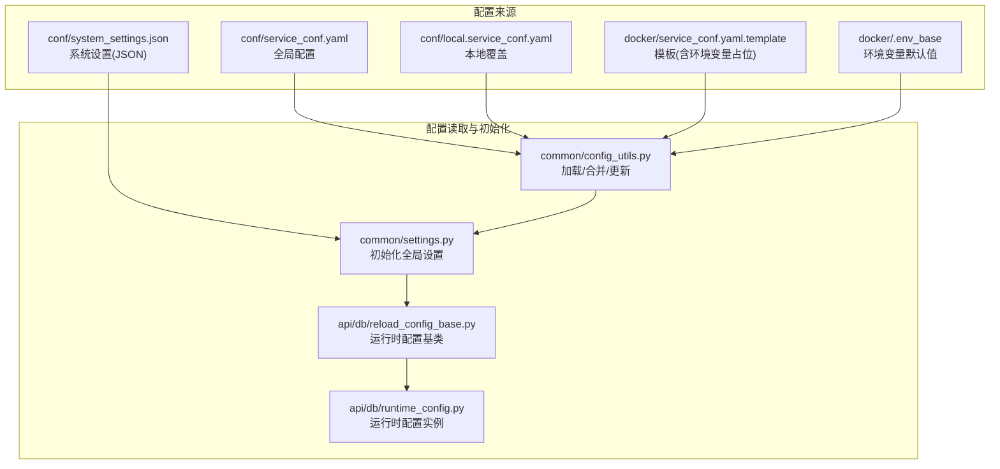
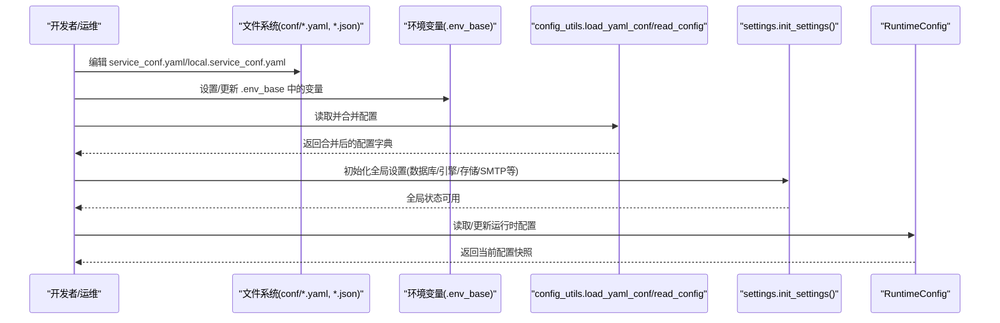
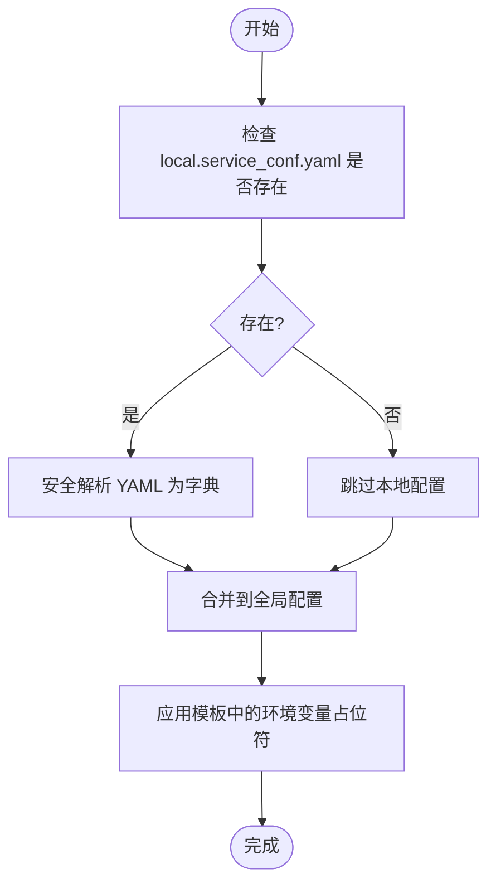
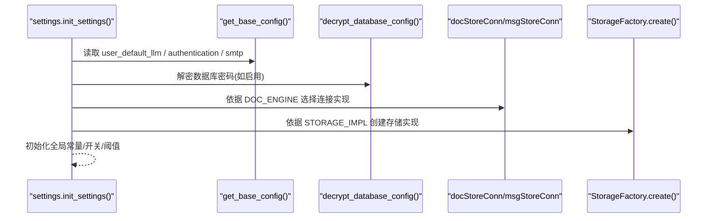
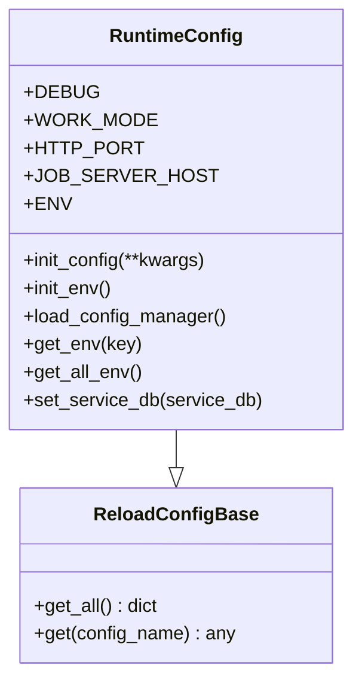
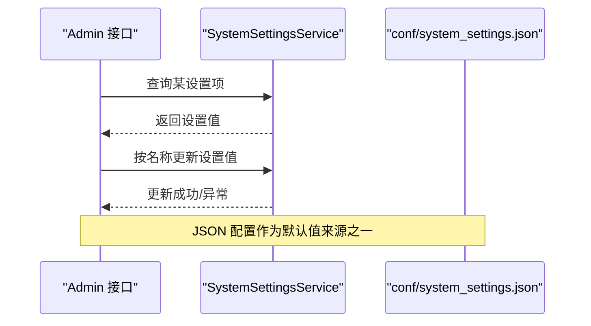
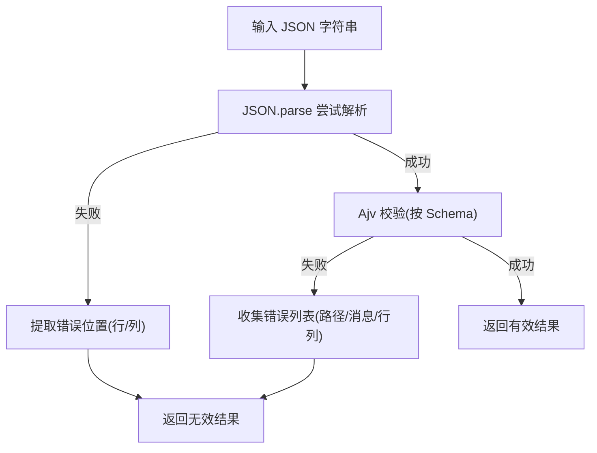
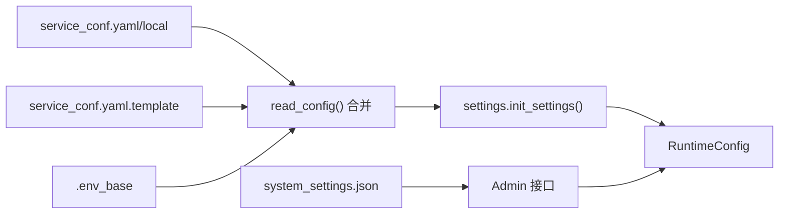

# 配置错误

<cite>
**本文引用的文件**
- [conf/service_conf.yaml](file://conf/service_conf.yaml)
- [docker/service_conf.yaml.template](file://docker/service_conf.yaml.template)
- [common/config_utils.py](file://common/config_utils.py)
- [common/settings.py](file://common/settings.py)
- [api/db/reload_config_base.py](file://api/db/reload_config_base.py)
- [api/db/runtime_config.py](file://api/db/runtime_config.py)
- [docker/.env_base](file://docker/.env_base)
- [conf/system_settings.json](file://conf/system_settings.json)
- [admin/server/services.py](file://admin/server/services.py)
- [web/src/components/jsonjoy-builder/utils/json-validator.ts](file://web/src/components/jsonjoy-builder/utils/json-validator.ts)
- [web/src/components/jsonjoy-builder/types/validation.ts](file://web/src/components/jsonjoy-builder/types/validation.ts)
</cite>

## 目录
1. [简介](#简介)
2. [项目结构](#项目结构)
3. [核心组件](#核心组件)
4. [架构总览](#架构总览)
5. [详细组件分析](#详细组件分析)
6. [依赖分析](#依赖分析)
7. [性能考虑](#性能考虑)
8. [故障排查指南](#故障排查指南)
9. [结论](#结论)
10. [附录](#附录)

## 简介
本指南聚焦于配置错误的识别与修复，覆盖以下方面：
- 配置文件格式错误：YAML 语法错误、JSON 格式问题、配置项缺失等
- 环境变量配置错误：变量名拼写、值格式、作用域等问题
- 服务配置冲突：端口、路径、权限等冲突的定位与解决
- 配置热更新：生效延迟、回滚、验证等动态配置管理
- 第三方服务配置：API 密钥、认证参数、服务地址等外部集成
- 配置备份与恢复：变更安全与可追溯性保障

## 项目结构
RAGFlow 的配置体系由“本地/全局 YAML 配置”、“环境变量”、“系统设置 JSON”以及“运行时配置管理器”构成，并通过统一入口读取与初始化。

**图示来源**
- [conf/service_conf.yaml](file://conf/service_conf.yaml)
- [docker/service_conf.yaml.template](file://docker/service_conf.yaml.template)
- [common/config_utils.py](file://common/config_utils.py)
- [common/settings.py](file://common/settings.py)
- [api/db/reload_config_base.py](file://api/db/reload_config_base.py)
- [api/db/runtime_config.py](file://api/db/runtime_config.py)
- [docker/.env_base](file://docker/.env_base)
- [conf/system_settings.json](file://conf/system_settings.json)

**章节来源**
- [conf/service_conf.yaml](file://conf/service_conf.yaml)
- [docker/service_conf.yaml.template](file://docker/service_conf.yaml.template)
- [common/config_utils.py](file://common/config_utils.py)
- [common/settings.py](file://common/settings.py)
- [api/db/reload_config_base.py](file://api/db/reload_config_base.py)
- [api/db/runtime_config.py](file://api/db/runtime_config.py)
- [docker/.env_base](file://docker/.env_base)
- [conf/system_settings.json](file://conf/system_settings.json)

## 核心组件
- 配置加载与合并
  - 从 conf 目录读取全局与本地 YAML 配置，进行字典合并；支持读取模板中的环境变量占位符
  - 提供安全的 YAML 写回能力，带文件锁避免并发写入冲突
- 运行时设置初始化
  - 依据基础配置与环境变量初始化数据库、文档引擎、存储实现、LLM 默认模型、SMTP 等
- 运行时配置管理
  - 提供运行时配置对象，支持读取与环境信息注入
- 系统设置（JSON）
  - 以 JSON 形式存储系统级设置项，便于前端或管理接口读取与更新
- 前端配置校验
  - 使用 JSON Schema 校验器对用户输入的 JSON 进行类型与结构校验，定位错误位置

**章节来源**
- [common/config_utils.py](file://common/config_utils.py)
- [common/settings.py](file://common/settings.py)
- [api/db/reload_config_base.py](file://api/db/reload_config_base.py)
- [api/db/runtime_config.py](file://api/db/runtime_config.py)
- [conf/system_settings.json](file://conf/system_settings.json)
- [web/src/components/jsonjoy-builder/utils/json-validator.ts](file://web/src/components/jsonjoy-builder/utils/json-validator.ts)
- [web/src/components/jsonjoy-builder/types/validation.ts](file://web/src/components/jsonjoy-builder/types/validation.ts)

## 架构总览
配置从“文件与环境变量”进入系统，经过“加载/合并/解密/初始化”，最终在运行时被各模块使用。管理员可通过系统设置 JSON 与运行时配置管理器进行动态调整。

**图示来源**
- [common/config_utils.py](file://common/config_utils.py)
- [common/settings.py](file://common/settings.py)
- [api/db/runtime_config.py](file://api/db/runtime_config.py)
- [docker/.env_base](file://docker/.env_base)
- [conf/service_conf.yaml](file://conf/service_conf.yaml)

## 详细组件分析

### 组件A：配置加载与合并（YAML/模板/环境变量）
- 加载顺序与优先级
  - 本地覆盖优先于全局配置
  - 模板中包含环境变量占位符，启动时由 .env_base 提供默认值
- 错误处理
  - 文件不存在或非字典类型会抛出异常
  - YAML 解析失败会给出明确错误提示
- 并发安全
  - 更新配置时使用文件锁，避免竞态

**图示来源**
- [common/config_utils.py](file://common/config_utils.py)
- [docker/service_conf.yaml.template](file://docker/service_conf.yaml.template)
- [docker/.env_base](file://docker/.env_base)

**章节来源**
- [common/config_utils.py](file://common/config_utils.py)
- [docker/service_conf.yaml.template](file://docker/service_conf.yaml.template)
- [docker/.env_base](file://docker/.env_base)

### 组件B：运行时设置初始化（数据库/引擎/存储/SMTP）
- 数据库与文档引擎
  - 支持 elasticsearch、infinity、opensearch、oceanbase、seekdb 等
  - 依据环境变量 DOC_ENGINE 选择具体实现
- 存储实现
  - 支持 MINIO、AWS_S3、OSS、GCS、Azure SPN/SAS、OpenDAL 等
  - 可按 STORAGE_IMPL 切换
- LLM 默认模型与工厂
  - 从基础配置读取默认模型、工厂、API Key、Base URL
- SMTP 与邮件发送
  - 从基础配置读取服务器、端口、SSL/TLS、凭据与默认发件人

**图示来源**
- [common/settings.py](file://common/settings.py)
- [common/config_utils.py](file://common/config_utils.py)

**章节来源**
- [common/settings.py](file://common/settings.py)
- [common/config_utils.py](file://common/config_utils.py)

### 组件C：运行时配置管理（读取/注入/持久化）
- 运行时配置对象
  - 提供统一的 get_all()/get() 访问方式
  - 支持注入版本号等环境信息
- 配置更新
  - 通过 update_config(key, value) 写回 YAML，带文件锁保证原子性

**图示来源**
- [api/db/reload_config_base.py](file://api/db/reload_config_base.py)
- [api/db/runtime_config.py](file://api/db/runtime_config.py)

**章节来源**
- [api/db/reload_config_base.py](file://api/db/reload_config_base.py)
- [api/db/runtime_config.py](file://api/db/runtime_config.py)
- [common/config_utils.py](file://common/config_utils.py)

### 组件D：系统设置（JSON）与管理员接口
- 系统设置 JSON
  - 包含布尔、字符串、整数等类型的键值对
- 管理员接口
  - 提供获取/更新系统设置的接口，支持按名称更新

**图示来源**
- [conf/system_settings.json](file://conf/system_settings.json)
- [admin/server/services.py](file://admin/server/services.py)

**章节来源**
- [conf/system_settings.json](file://conf/system_settings.json)
- [admin/server/services.py](file://admin/server/services.py)

### 组件E：前端配置校验（JSON Schema）
- 类型与结构校验
  - 对字符串、数字、布尔、数组、对象等进行严格校验
  - 将错误映射到路径与行列号，便于定位
- 适用场景
  - 管理界面编辑 JSON 配置时的实时校验

**图示来源**
- [web/src/components/jsonjoy-builder/utils/json-validator.ts](file://web/src/components/jsonjoy-builder/utils/json-validator.ts)
- [web/src/components/jsonjoy-builder/types/validation.ts](file://web/src/components/jsonjoy-builder/types/validation.ts)

**章节来源**
- [web/src/components/jsonjoy-builder/utils/json-validator.ts](file://web/src/components/jsonjoy-builder/utils/json-validator.ts)
- [web/src/components/jsonjoy-builder/types/validation.ts](file://web/src/components/jsonjoy-builder/types/validation.ts)

## 依赖分析
- 配置来源之间的耦合
  - YAML 配置与模板/环境变量强关联，需保持键名一致
  - 系统设置 JSON 与运行时配置相互补充
- 初始化链路
  - config_utils 为 settings 提供基础数据
  - settings 负责全局状态，runtime_config 提供运行时访问
- 外部依赖
  - 文档引擎、存储实现、第三方 LLM 等均依赖配置初始化

**图示来源**
- [common/config_utils.py](file://common/config_utils.py)
- [common/settings.py](file://common/settings.py)
- [api/db/runtime_config.py](file://api/db/runtime_config.py)
- [docker/service_conf.yaml.template](file://docker/service_conf.yaml.template)
- [docker/.env_base](file://docker/.env_base)
- [conf/system_settings.json](file://conf/system_settings.json)
- [admin/server/services.py](file://admin/server/services.py)

**章节来源**
- [common/config_utils.py](file://common/config_utils.py)
- [common/settings.py](file://common/settings.py)
- [api/db/runtime_config.py](file://api/db/runtime_config.py)
- [docker/service_conf.yaml.template](file://docker/service_conf.yaml.template)
- [docker/.env_base](file://docker/.env_base)
- [conf/system_settings.json](file://conf/system_settings.json)
- [admin/server/services.py](file://admin/server/services.py)

## 性能考虑
- 配置读取
  - YAML 安全解析与字典合并为轻量操作，通常开销可忽略
- 并发写入
  - 更新配置使用文件锁，避免竞争，但会带来短时阻塞
- 初始化成本
  - 文档引擎与存储实现的连接初始化可能较重，建议在启动阶段完成

[本节为通用指导，无需特定文件来源]

## 故障排查指南

### 一、配置文件格式错误（YAML/JSON）
- YAML 语法错误
  - 症状：启动时报错，提示无法解析 YAML 或键重复
  - 排查步骤
    - 使用在线 YAML 校验工具逐段检查
    - 关注缩进、冒号后空格、特殊字符转义
  - 修复要点
    - 保持键值对缩进一致
    - 禁止使用 tab，统一使用空格
    - 特殊值用引号包裹（如布尔、十六进制、大数）
- JSON 格式问题
  - 症状：前端或管理接口报 JSON 解析失败
  - 排查步骤
    - 使用前端校验器定位错误路径与行列
    - 检查逗号遗漏、多余的尾随逗号、非法转义
  - 修复要点
    - 严格遵循 JSON 规范，避免自定义扩展
- 配置项缺失
  - 症状：某些功能不可用或默认值生效
  - 排查步骤
    - 对照模板与默认值，确认必填项是否齐全
    - 检查环境变量占位符是否被正确替换
  - 修复要点
    - 在本地覆盖文件中补齐缺失项
    - 确保 .env_base 中对应变量已设置

**章节来源**
- [common/config_utils.py](file://common/config_utils.py)
- [web/src/components/jsonjoy-builder/utils/json-validator.ts](file://web/src/components/jsonjoy-builder/utils/json-validator.ts)
- [web/src/components/jsonjoy-builder/types/validation.ts](file://web/src/components/jsonjoy-builder/types/validation.ts)

### 二、环境变量配置错误
- 变量名拼写错误
  - 症状：配置未生效，仍使用默认值
  - 排查步骤
    - 对照模板与 .env_base，核对大小写与前缀
    - 检查是否存在多余空格
  - 修复要点
    - 保持与模板一致的命名规范
- 值格式不正确
  - 症状：端口无效、主机名解析失败、布尔值被当作字符串
  - 排查步骤
    - 端口范围检查（1–65535）
    - 主机名/URL 格式校验
    - 布尔值仅接受 true/false
  - 修复要点
    - 数值型变量使用纯数字
    - URL 使用完整协议与端口
- 作用域问题
  - 症状：容器内变量未生效或覆盖顺序错误
  - 排查步骤
    - 确认变量在启动命令或 compose 中正确注入
    - 检查本地覆盖文件是否被正确合并
  - 修复要点
    - 在容器启动时显式设置环境变量
    - 优先使用本地覆盖文件进行差异化配置

**章节来源**
- [docker/service_conf.yaml.template](file://docker/service_conf.yaml.template)
- [docker/.env_base](file://docker/.env_base)
- [common/config_utils.py](file://common/config_utils.py)

### 三、服务配置冲突
- 端口冲突
  - 症状：服务启动失败，提示端口占用
  - 排查步骤
    - 检查 conf/service_conf.yaml 与 .env_base 中的端口配置
    - 使用 netstat/lsof 查找占用进程
  - 修复要点
    - 修改 conf/service_conf.yaml 或 .env_base 中的端口
- 路径冲突
  - 症状：对象存储桶/前缀路径导致访问异常
  - 排查步骤
    - 对照存储实现配置，确认 bucket/prefix_path
  - 修复要点
    - 保持路径唯一且符合目标平台要求
- 权限冲突
  - 症状：数据库/存储连接失败
  - 排查步骤
    - 核对用户名/密码/主机/端口
    - 检查防火墙与网络策略
  - 修复要点
    - 使用最小权限原则配置凭据
    - 在容器网络中确保可达性

**章节来源**
- [conf/service_conf.yaml](file://conf/service_conf.yaml)
- [docker/.env_base](file://docker/.env_base)
- [common/settings.py](file://common/settings.py)

### 四、配置热更新问题
- 生效延迟
  - 症状：修改后立即重启才生效
  - 排查步骤
    - 确认是否通过运行时配置管理器更新
    - 检查模块是否监听配置变化
  - 修复要点
    - 通过 RuntimeConfig 或 Admin 接口更新
    - 对于需要重启的服务，按需执行滚动重启
- 配置回滚
  - 症状：更新后服务异常
  - 排查步骤
    - 比对最近一次成功的配置快照
  - 修复要点
    - 使用安全的写回机制（已有文件锁保护）
    - 保留历史版本以便快速回滚
- 配置验证
  - 症状：更新后出现不可预期行为
  - 排查步骤
    - 使用前端校验器或后端校验逻辑验证
  - 修复要点
    - 在更新前先进行结构与类型校验
    - 对关键字段增加默认值与边界检查

**章节来源**
- [api/db/runtime_config.py](file://api/db/runtime_config.py)
- [common/config_utils.py](file://common/config_utils.py)
- [web/src/components/jsonjoy-builder/utils/json-validator.ts](file://web/src/components/jsonjoy-builder/utils/json-validator.ts)

### 五、第三方服务配置问题
- API 密钥配置
  - 症状：调用第三方服务失败
  - 排查步骤
    - 检查密钥是否正确注入到 LLM 配置或环境变量
  - 修复要点
    - 使用受控的密钥管理方案
- 认证参数设置
  - 症状：鉴权失败或权限不足
  - 排查步骤
    - 对照第三方文档核对参数名称与格式
  - 修复要点
    - 严格遵循官方 SDK/文档示例
- 服务地址配置
  - 症状：连接超时或域名解析失败
  - 排查步骤
    - 检查 base_url 与端口是否匹配
  - 修复要点
    - 使用稳定可访问的公网/内网地址

**章节来源**
- [common/settings.py](file://common/settings.py)
- [conf/service_conf.yaml](file://conf/service_conf.yaml)

### 六、配置备份与恢复
- 备份策略
  - 定期导出 conf/service_conf.yaml 与 conf/local.service_conf.yaml
  - 记录 .env_base 的关键变量与值
  - 备份 conf/system_settings.json
- 恢复流程
  - 将备份文件还原至原路径
  - 重新初始化运行时设置
  - 通过 Admin 接口核对系统设置项
- 最佳实践
  - 使用版本控制管理配置文件
  - 对敏感信息（密码、密钥）单独加密存储

**章节来源**
- [common/config_utils.py](file://common/config_utils.py)
- [docker/.env_base](file://docker/.env_base)
- [conf/system_settings.json](file://conf/system_settings.json)

## 结论
- 配置错误多源于格式不合规、环境变量缺失或覆盖不当、冲突与热更新策略不当
- 建议建立“模板+环境变量+本地覆盖”的分层配置体系，并配合严格的校验与回滚机制
- 通过统一的运行时配置管理器与系统设置 JSON，实现可追踪、可恢复的动态配置管理

[本节为总结，无需特定文件来源]

## 附录
- 常用排查清单
  - YAML/JSON 校验通过
  - 环境变量与模板键名一致
  - 端口/路径/权限无冲突
  - 热更新具备回滚与验证
  - 敏感信息加密存储并定期轮换

[本节为通用指导，无需特定文件来源]