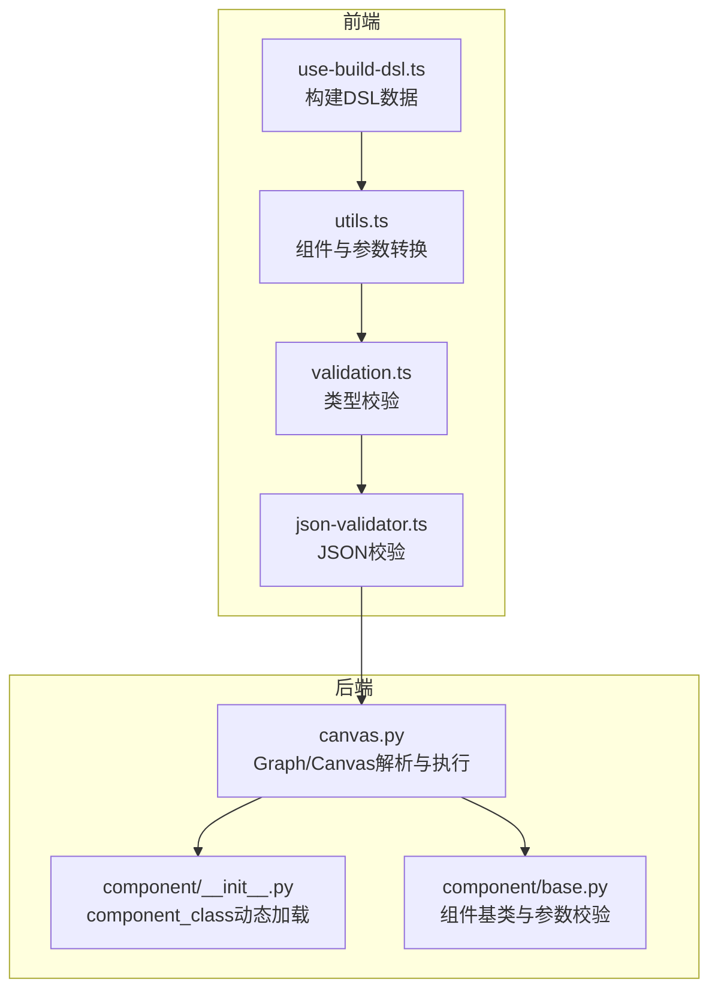
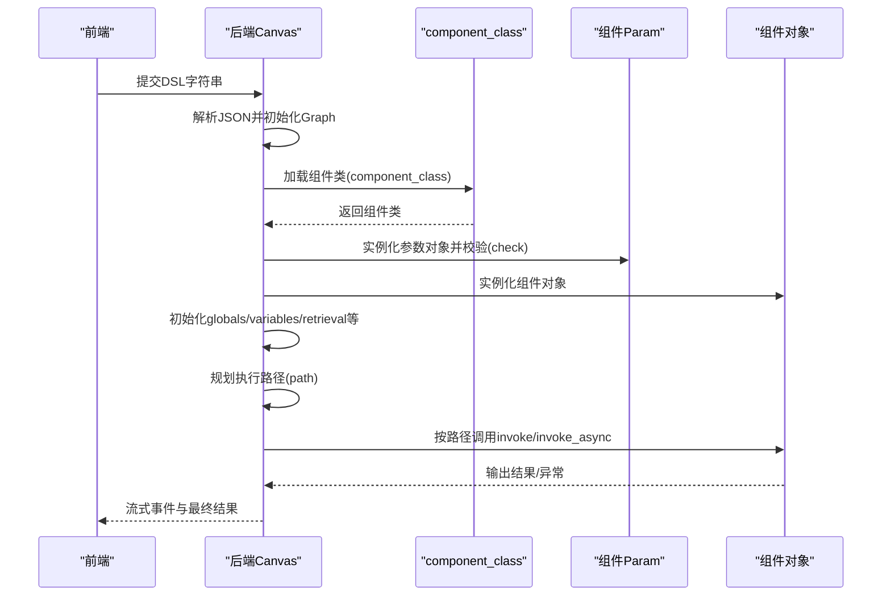
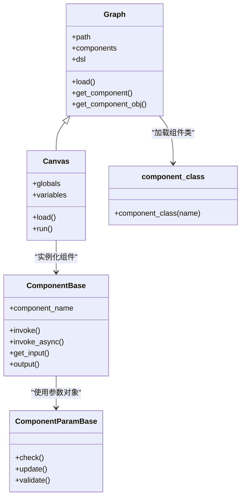
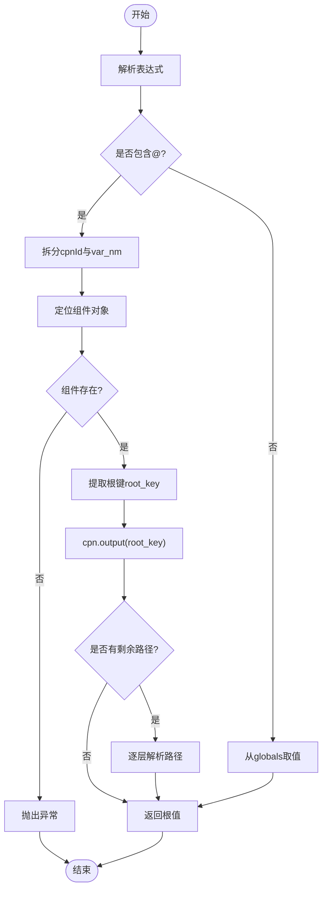
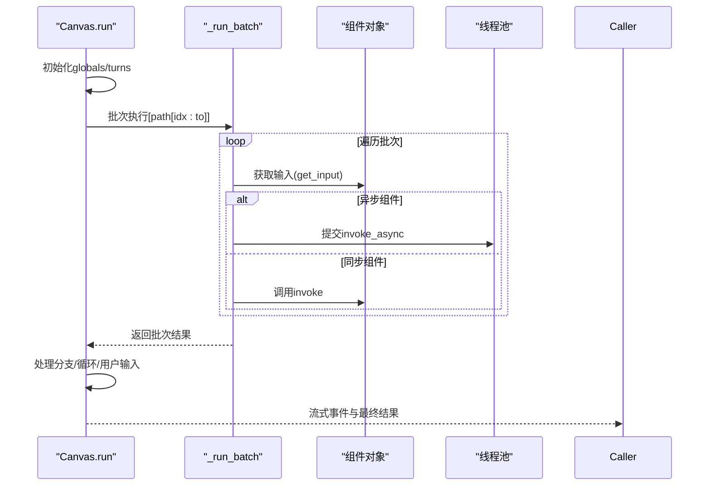
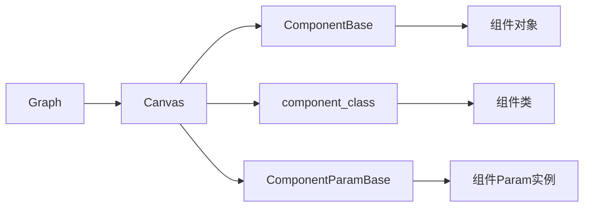

# DSL解析器

<cite>
**本文档引用的文件**
- [canvas.py](file://agent/canvas.py)
- [__init__.py](file://agent/component/__init__.py)
- [base.py](file://agent/component/base.py)
- [use-build-dsl.ts](file://web/src/pages/agent/hooks/use-build-dsl.ts)
- [utils.ts](file://web/src/pages/agent/utils.ts)
- [validation.ts](file://web/src/components/jsonjoy-builder/types/validation.ts)
- [json-validator.ts](file://web/src/components/jsonjoy-builder/utils/json-validator.ts)
- [validation_utils.py](file://api/utils/validation_utils.py)
</cite>

## 目录
1. [简介](#简介)
2. [项目结构](#项目结构)
3. [核心组件](#核心组件)
4. [架构总览](#架构总览)
5. [详细组件分析](#详细组件分析)
6. [依赖分析](#依赖分析)
7. [性能考虑](#性能考虑)
8. [故障排除指南](#故障排除指南)
9. [结论](#结论)
10. [附录](#附录)

## 简介
本文件面向DSL（领域特定语言）解析器的技术文档，聚焦于从DSL字符串到内部数据结构的转换过程，涵盖以下关键能力：
- JSON格式解析与结构校验
- 组件定义验证与参数检查
- 变量绑定系统：表达式解析、变量查找、作用域管理
- 路径规划与执行调度
- 错误处理与异常恢复策略

文档同时提供DSL语法规范说明、组件加载机制详解、变量绑定算法流程图以及完整的工作流示例与常见错误排查建议。

## 项目结构
DSL解析器涉及前后端协同：
- 前端负责将画布图形转换为DSL结构，并进行基础校验
- 后端负责将DSL字符串解析为可执行的Canvas对象，完成组件加载、参数校验、变量解析与执行调度

**图表来源**
- [use-build-dsl.ts:34-59](file://web/src/pages/agent/hooks/use-build-dsl.ts#L34-L59)
- [utils.ts:444-488](file://web/src/pages/agent/utils.ts#L444-L488)
- [validation.ts:190-199](file://web/src/components/jsonjoy-builder/types/validation.ts#L190-L199)
- [json-validator.ts:154-228](file://web/src/components/jsonjoy-builder/utils/json-validator.ts#L154-L228)
- [canvas.py:81-127](file://agent/canvas.py#L81-L127)
- [__init__.py:51-59](file://agent/component/__init__.py#L51-L59)
- [base.py:365-585](file://agent/component/base.py#L365-L585)

**章节来源**
- [use-build-dsl.ts:34-59](file://web/src/pages/agent/hooks/use-build-dsl.ts#L34-L59)
- [utils.ts:444-488](file://web/src/pages/agent/utils.ts#L444-L488)
- [validation.ts:190-199](file://web/src/components/jsonjoy-builder/types/validation.ts#L190-L199)
- [json-validator.ts:154-228](file://web/src/components/jsonjoy-builder/utils/json-validator.ts#L154-L228)
- [canvas.py:81-127](file://agent/canvas.py#L81-L127)
- [__init__.py:51-59](file://agent/component/__init__.py#L51-L59)
- [base.py:365-585](file://agent/component/base.py#L365-L585)

## 核心组件
- Graph/Canvas：负责将DSL字符串解析为内部对象，加载组件并维护执行路径
- component_class：动态导入组件类，支持多模块查找
- ComponentBase/ComponentParamBase：组件基类与参数校验基类，提供输入输出管理、异常处理与超时控制
- 前端DSL构建工具：将图形节点与边转换为components、path、globals等字段

**章节来源**
- [canvas.py:81-127](file://agent/canvas.py#L81-L127)
- [__init__.py:51-59](file://agent/component/__init__.py#L51-L59)
- [base.py:365-585](file://agent/component/base.py#L365-L585)
- [use-build-dsl.ts:34-59](file://web/src/pages/agent/hooks/use-build-dsl.ts#L34-L59)

## 架构总览
DSL解析器的执行链路如下：

**图表来源**
- [canvas.py:81-127](file://agent/canvas.py#L81-L127)
- [canvas.py:293-321](file://agent/canvas.py#L293-L321)
- [canvas.py:420-656](file://agent/canvas.py#L420-L656)
- [__init__.py:51-59](file://agent/component/__init__.py#L51-L59)
- [base.py:384-447](file://agent/component/base.py#L384-L447)

## 详细组件分析

### DSL语法规范
- components对象结构
  - 每个组件包含obj、downstream、upstream、parent_id等字段
  - obj包含component_name与params
- path执行路径
  - 以组件ID列表表示执行顺序，支持分支与循环
- globals全局变量
  - sys.*为系统保留变量，如sys.query、sys.user_id、sys.conversation_turns、sys.files、sys.history
  - env.*为环境变量桥接，值来源于variables定义
- variables变量定义
  - 定义env.*映射的变量类型与默认值，用于运行时替换

**章节来源**
- [canvas.py:42-79](file://agent/canvas.py#L42-L79)
- [canvas.py:282-311](file://agent/canvas.py#L282-L311)
- [canvas.py:474-488](file://agent/canvas.py#L474-L488)

### 组件加载机制
- 动态类加载
  - component_class在多个包中查找目标类名，找不到则断言失败
- 参数校验
  - 每个组件的Param类实例化后调用check()，不符合约束抛出异常
- 组件实例化
  - 使用Graph构造函数传入canvas、组件ID与参数对象

**图表来源**
- [canvas.py:81-127](file://agent/canvas.py#L81-L127)
- [canvas.py:293-321](file://agent/canvas.py#L293-L321)
- [__init__.py:51-59](file://agent/component/__init__.py#L51-L59)
- [base.py:365-585](file://agent/component/base.py#L365-L585)

**章节来源**
- [__init__.py:51-59](file://agent/component/__init__.py#L51-L59)
- [canvas.py:91-105](file://agent/canvas.py#L91-L105)
- [base.py:384-447](file://agent/component/base.py#L384-L447)

### 变量绑定系统
- 表达式解析
  - 支持形如{sys.key}、{env.key}、{cpnId@outputKey}、{cpnId@outputKey.prop.nested}的变量引用
- 查找算法
  - 无@：从globals直接取值
  - 有@：先定位组件，再从其output中取值；支持点号路径访问
- 作用域管理
  - sys.*为系统作用域，env.*为变量作用域，二者通过variables映射
- 设置与更新
  - set_variable_value支持对组件输出或globals进行深层赋值

**图表来源**
- [canvas.py:162-187](file://agent/canvas.py#L162-L187)
- [canvas.py:189-233](file://agent/canvas.py#L189-L233)
- [canvas.py:235-265](file://agent/canvas.py#L235-L265)

**章节来源**
- [canvas.py:162-187](file://agent/canvas.py#L162-L187)
- [canvas.py:189-233](file://agent/canvas.py#L189-L233)
- [canvas.py:235-265](file://agent/canvas.py#L235-L265)

### 路径规划与执行调度
- 路径生成
  - 从DSL的path字段读取初始执行序列
- 执行策略
  - 遇到begin/userfillup特殊处理，其他组件按输入元素依赖关系推进
  - 支持异步组件并发执行，同步组件串行执行
- 分支与循环
  - categorize/switch根据输出选择下游
  - iteration/loop支持迭代与退出逻辑
- 用户交互
  - userfillup节点触发用户输入收集，完成后继续执行

**图表来源**
- [canvas.py:367-656](file://agent/canvas.py#L367-L656)
- [canvas.py:420-464](file://agent/canvas.py#L420-L464)

**章节来源**
- [canvas.py:367-656](file://agent/canvas.py#L367-L656)
- [canvas.py:420-464](file://agent/canvas.py#L420-L464)

### 前端DSL构建与校验
- 组件构建
  - 将节点与边转换为components字典，填充上游/下游与父ID
- 全局变量合并
  - 合并sys.*与env.*变量，支持默认值覆盖
- JSON与类型校验
  - 使用Ajv进行JSON Schema校验，提供行列定位与错误树

**章节来源**
- [use-build-dsl.ts:34-59](file://web/src/pages/agent/hooks/use-build-dsl.ts#L34-L59)
- [utils.ts:444-488](file://web/src/pages/agent/utils.ts#L444-L488)
- [validation.ts:190-199](file://web/src/components/jsonjoy-builder/types/validation.ts#L190-L199)
- [json-validator.ts:154-228](file://web/src/components/jsonjoy-builder/utils/json-validator.ts#L154-L228)

## 依赖分析
- 组件类加载依赖component_class，后者在多个命名空间中查找
- 组件参数依赖ComponentParamBase.validate/check机制
- Canvas继承Graph，扩展了全局变量、历史记录与执行调度
- 前端通过use-build-dsl.ts与utils.ts生成DSL，配合后端校验

**图表来源**
- [__init__.py:51-59](file://agent/component/__init__.py#L51-L59)
- [base.py:365-585](file://agent/component/base.py#L365-L585)
- [canvas.py:81-127](file://agent/canvas.py#L81-L127)

**章节来源**
- [__init__.py:51-59](file://agent/component/__init__.py#L51-L59)
- [base.py:365-585](file://agent/component/base.py#L365-L585)
- [canvas.py:81-127](file://agent/canvas.py#L81-L127)

## 性能考虑
- 并发执行
  - 异步组件通过线程池并发执行，减少整体等待时间
- 超时控制
  - 组件调用统一添加超时装饰器，避免阻塞
- 缓存与取消
  - 任务取消通过Redis标记快速短路
- I/O优化
  - 文件解析与图片转base64异步执行，批量聚合

[本节为通用指导，无需具体文件来源]

## 故障排除指南
- 常见解析错误
  - 组件类不存在：检查component_name是否正确，确认模块导入路径
  - 参数校验失败：检查components中params字段是否符合对应Param的约束
  - 变量引用无效：确认{cpnId@outputKey}是否存在且路径正确
  - JSON格式错误：前端使用Ajv校验，查看行列定位信息
- 排查步骤
  - 后端：查看Graph.load阶段的异常堆栈，定位具体组件与参数
  - 前端：使用JSON校验工具定位错误位置，修正Schema
  - 运行时：关注Canvas.run中的异常事件与错误输出

**章节来源**
- [canvas.py:98-101](file://agent/canvas.py#L98-L101)
- [canvas.py:189-196](file://agent/canvas.py#L189-L196)
- [json-validator.ts:154-228](file://web/src/components/jsonjoy-builder/utils/json-validator.ts#L154-L228)
- [validation_utils.py:506-530](file://api/utils/validation_utils.py#L506-L530)

## 结论
DSL解析器通过前后端协作，实现了从DSL字符串到可执行工作流的完整转换。后端负责严格的组件加载与参数校验，前端负责DSL构建与Schema校验。变量绑定系统提供了灵活的作用域与路径访问能力，路径规划与执行调度确保了复杂工作流的可控性与可观测性。结合完善的错误处理与性能优化策略，该解析器能够稳定支撑多样化的业务场景。

[本节为总结，无需具体文件来源]

## 附录

### DSL示例（概念性说明）
- components
  - begin：启动节点，支持Webhook模式
  - retrieval/generate：检索与生成节点
  - message：消息输出节点，支持TTS音频
- path
  - ["begin", "retrieval_0", "generate_0", "message"]
- globals
  - sys.query、sys.user_id、sys.conversation_turns、sys.files、sys.history
- variables
  - env.*变量映射，如env.api_key、env.theme

[本节为概念说明，不对应具体源码]