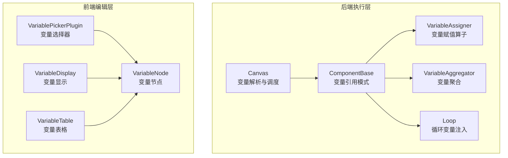
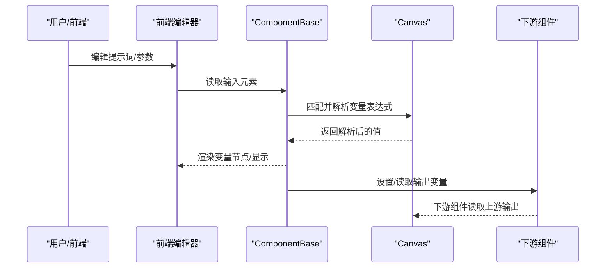
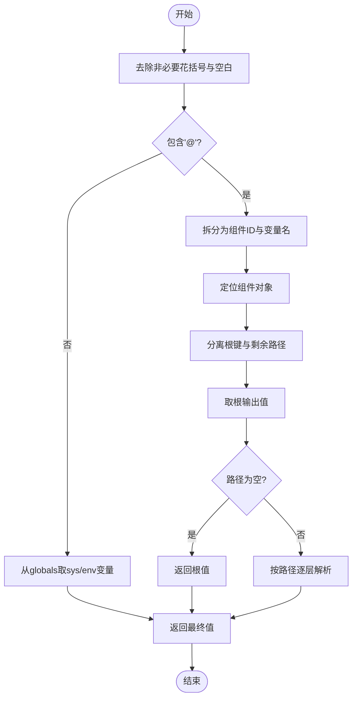
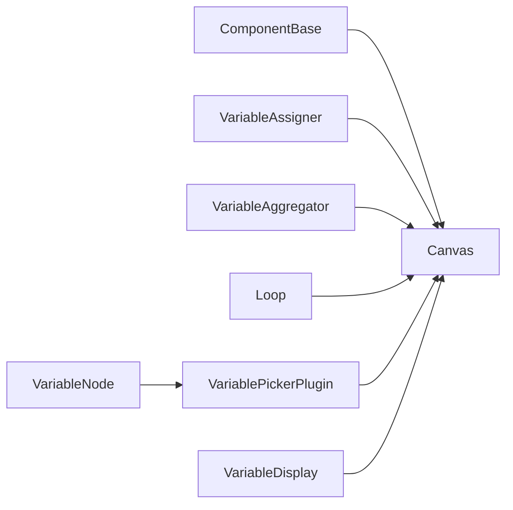

# 变量系统

<cite>
**本文档引用的文件**
- [canvas.py](file://agent/canvas.py)
- [base.py](file://agent/component/base.py)
- [variable_assigner.py](file://agent/component/variable_assigner.py)
- [varaiable_aggregator.py](file://agent/component/varaiable_aggregator.py)
- [loop.py](file://agent/component/loop.py)
- [variable-node.tsx](file://web/src/pages/agent/form/components/prompt-editor/variable-node.tsx)
- [variable-picker-plugin.tsx](file://web/src/pages/agent/form/components/prompt-editor/variable-picker-plugin.tsx)
- [variable-display.tsx](file://web/src/pages/agent/canvas/node/variable-display.tsx)
- [variable-table.tsx](file://web/src/pages/agent/form/invoke-form/variable-table.tsx)
- [constant.ts](file://web/src/pages/agent/gobal-variable-sheet/constant.ts)
- [use-object-fields.tsx](file://web/src/pages/agent/gobal-variable-sheet/hooks/use-object-fields.tsx)
- [advanced_ingestion_pipeline.json](file://agent/templates/advanced_ingestion_pipeline.json)
</cite>

## 目录
1. [简介](#简介)
2. [项目结构](#项目结构)
3. [核心组件](#核心组件)
4. [架构总览](#架构总览)
5. [详细组件分析](#详细组件分析)
6. [依赖分析](#依赖分析)
7. [性能考虑](#性能考虑)
8. [故障排查指南](#故障排查指南)
9. [结论](#结论)
10. [附录](#附录)

## 简介
本文件系统性梳理 RAGFlow 的变量系统，覆盖变量绑定与引用机制、表达式语法、作用域规则、类型推导、解析算法、全局变量管理、组件内变量处理、变量类型体系、使用示例与调试技巧。目标是帮助开发者与使用者快速理解并正确使用变量系统。

## 项目结构
变量系统由后端 Canvas 执行引擎与前端可视化编辑器协同构成：
- 后端执行层：Canvas 负责变量解析、赋值、取值与跨组件传递；各组件通过统一接口读写变量。
- 前端编辑层：提供变量节点渲染、变量选择器、变量显示与表格化展示，支持在提示词中插入与预览变量。

图表来源
- [canvas.py](file://agent/canvas.py)
- [base.py](file://agent/component/base.py)
- [variable_assigner.py](file://agent/component/variable_assigner.py)
- [varaiable_aggregator.py](file://agent/component/varaiable_aggregator.py)
- [loop.py](file://agent/component/loop.py)
- [variable-node.tsx](file://web/src/pages/agent/form/components/prompt-editor/variable-node.tsx)
- [variable-picker-plugin.tsx](file://web/src/pages/agent/form/components/prompt-editor/variable-picker-plugin.tsx)
- [variable-display.tsx](file://web/src/pages/agent/canvas/node/variable-display.tsx)
- [variable-table.tsx](file://web/src/pages/agent/form/invoke-form/variable-table.tsx)

章节来源
- [canvas.py](file://agent/canvas.py)
- [base.py](file://agent/component/base.py)
- [variable-node.tsx](file://web/src/pages/agent/form/components/prompt-editor/variable-node.tsx)
- [variable-picker-plugin.tsx](file://web/src/pages/agent/form/components/prompt-editor/variable-picker-plugin.tsx)
- [variable-display.tsx](file://web/src/pages/agent/canvas/node/variable-display.tsx)
- [variable-table.tsx](file://web/src/pages/agent/form/invoke-form/variable-table.tsx)

## 核心组件
- Canvas：变量解析与赋值的核心执行器，支持 sys 前缀系统变量、env 前缀环境变量、组件输出变量（component@output.key）的统一解析与路径访问。
- ComponentBase：组件基类，提供变量引用正则模式、输入元素解析、变量引用检测与替换。
- VariableAssigner：对指定变量执行算子操作（覆盖、清空、集合/数值运算等），并将结果回写到 Canvas。
- VariableAggregator：按组策略从多个候选变量中选择第一个可用值，用于聚合与分组。
- Loop：循环组件将外部输入或常量注入到循环变量，支持多种类型初始化。
- 前端变量节点与选择器：在提示词编辑器中插入变量节点、自动补全变量、渲染变量标签与类型。

章节来源
- [canvas.py](file://agent/canvas.py)
- [base.py](file://agent/component/base.py)
- [variable_assigner.py](file://agent/component/variable_assigner.py)
- [varaiable_aggregator.py](file://agent/component/varaiable_aggregator.py)
- [loop.py](file://agent/component/loop.py)
- [variable-node.tsx](file://web/src/pages/agent/form/components/prompt-editor/variable-node.tsx)
- [variable-picker-plugin.tsx](file://web/src/pages/agent/form/components/prompt-editor/variable-picker-plugin.tsx)

## 架构总览
变量系统采用“表达式解析 + 组件读写 + 全局/环境变量管理”的三层架构：
- 表达式解析层：统一的正则匹配与替换，支持 sys.*、env.*、component@output.key 以及嵌套路径访问。
- 组件交互层：组件参数中可直接使用变量表达式，运行时由 Canvas 解析并注入真实值；组件也可通过输出接口暴露变量供下游使用。
- 全局与会话变量层：Canvas 维护 globals 字典，sys.* 为系统保留字段，env.* 为会话变量映射，支持重置与回放。

图表来源
- [base.py](file://agent/component/base.py)
- [canvas.py](file://agent/canvas.py)

## 详细组件分析

### 表达式语法与解析算法
- 语法规范
  - 全局变量：sys.变量名（如 sys.query、sys.user_id）
  - 环境变量：env.变量名（由会话变量映射而来）
  - 组件变量：componentId@outputKey 或 componentId@outputKey.prop
  - 支持多级路径：prop1.prop2.index 或 prop1[index]
- 正则匹配
  - 后端使用统一正则匹配表达式，识别形如 {sys.xxx}、{env.xxx}、{cpn@out.key} 的占位符。
  - 前端同样使用正则进行提示词中的变量识别与渲染。
- 解析流程
  - 预处理：去除多余花括号与空白
  - 分类判断：是否包含 @ 符号决定走全局还是组件路径
  - 组件路径：先取根输出，再按点号路径逐层解析；字符串类型尝试 JSON 反序列化
  - 回填：将解析结果替换到原文本，非字符串类型序列化为 JSON

图表来源
- [canvas.py](file://agent/canvas.py)
- [base.py](file://agent/component/base.py)

章节来源
- [canvas.py](file://agent/canvas.py)
- [base.py](file://agent/component/base.py)
- [variable-picker-plugin.tsx](file://web/src/pages/agent/form/components/prompt-editor/variable-picker-plugin.tsx)
- [variable-display.tsx](file://web/src/pages/agent/canvas/node/variable-display.tsx)

### 作用域规则与类型推导
- 作用域
  - 全局作用域：sys.* 与 env.* 在 Canvas 全局可见
  - 组件作用域：仅能通过 componentId@outputKey 访问上游组件输出
  - 嵌套作用域：支持点号路径访问对象/数组元素
- 类型推导
  - 字符串：原样回填
  - 流式部分：拼接后再回填
  - 其他类型：序列化为 JSON 字符串
  - 路径解析：字符串尝试 JSON 反序列化，再按 dict/list/tuple/getattr 顺序解析

章节来源
- [canvas.py](file://agent/canvas.py)
- [base.py](file://agent/component/base.py)

### 全局变量管理
- sys.* 系统变量
  - 默认包含：query、user_id、conversation_turns、files、history 等
  - 运行时可更新，支持重置逻辑按类型清零或清空
- env.* 环境变量
  - 来源于会话变量表单配置，Canvas.reset 时根据变量类型重置默认值
- 用户自定义变量
  - 会话变量表单定义名称、类型与默认值，前端提供类型映射与校验

章节来源
- [canvas.py](file://agent/canvas.py)
- [constant.ts](file://web/src/pages/agent/gobal-variable-sheet/constant.ts)
- [use-object-fields.tsx](file://web/src/pages/agent/gobal-variable-sheet/hooks/use-object-fields.tsx)

### 组件内变量处理
- 输出值设置
  - 组件通过 set_output(key, value) 写入输出，下游可通过 componentId@outputKey 读取
- 输入值获取
  - 组件 get_input() 自动识别参数中的变量表达式，调用 Canvas 解析并注入
- 跨组件数据传递
  - 通过 componentId@outputKey.prop 的路径访问实现深层传递
  - 支持数组索引与字典键访问

章节来源
- [base.py](file://agent/component/base.py)
- [canvas.py](file://agent/canvas.py)

### 变量类型系统
- 基础类型：字符串、数字、布尔
- 复合类型：对象、数组（含数组<string>/array<number>/array<boolean>/array<object>）
- 前端类型映射与校验
  - 不同类型映射到不同的表单控件（文本框、数字、复选框、文本域）
  - 提供自定义校验与 Schema 校验，确保输入合法

章节来源
- [constant.ts](file://web/src/pages/agent/gobal-variable-sheet/constant.ts)
- [use-object-fields.tsx](file://web/src/pages/agent/gobal-variable-sheet/hooks/use-object-fields.tsx)

### 变量使用示例
- 在提示词中引用上游组件输出
  - 示例：Text Content: {Splitter:KindDingosJam@chunks}
- 在组件参数中使用 sys/env 变量
  - 示例：sys.query、env.user_role
- 使用变量赋值组件进行算子操作
  - 将变量值加减乘除、追加/扩展数组、清空等

章节来源
- [advanced_ingestion_pipeline.json](file://agent/templates/advanced_ingestion_pipeline.json)
- [variable_assigner.py](file://agent/component/variable_assigner.py)

### 前端变量可视化与调试
- 变量节点渲染：在提示词编辑器中以高亮节点形式展示变量
- 变量选择器：按组件/全局/会话变量分类提供下拉选择
- 变量显示：在节点详情中展示变量内容与类型
- 变量表格：在表单中以表格形式展示变量列表与操作

章节来源
- [variable-node.tsx](file://web/src/pages/agent/form/components/prompt-editor/variable-node.tsx)
- [variable-picker-plugin.tsx](file://web/src/pages/agent/form/components/prompt-editor/variable-picker-plugin.tsx)
- [variable-display.tsx](file://web/src/pages/agent/canvas/node/variable-display.tsx)
- [variable-table.tsx](file://web/src/pages/agent/form/invoke-form/variable-table.tsx)

## 依赖分析
- Canvas 依赖组件基类提供的变量引用正则与输入解析能力
- 组件通过 Canvas 的 get_variable_value/set_variable_value 实现跨组件读写
- 前端编辑器依赖 Canvas 的变量解析结果进行渲染与补全

图表来源
- [base.py](file://agent/component/base.py)
- [canvas.py](file://agent/canvas.py)
- [variable_assigner.py](file://agent/component/variable_assigner.py)
- [varaiable_aggregator.py](file://agent/component/varaiable_aggregator.py)
- [loop.py](file://agent/component/loop.py)
- [variable-node.tsx](file://web/src/pages/agent/form/components/prompt-editor/variable-node.tsx)
- [variable-picker-plugin.tsx](file://web/src/pages/agent/form/components/prompt-editor/variable-picker-plugin.tsx)
- [variable-display.tsx](file://web/src/pages/agent/canvas/node/variable-display.tsx)

## 性能考虑
- 正则匹配与字符串替换：在长文本中频繁解析可能带来开销，建议尽量减少不必要的变量嵌套层级
- 流式输出：对 partial 流式输出需累积后再回填，注意内存占用
- JSON 反序列化：字符串路径解析时的反序列化应避免在热路径重复执行

## 故障排查指南
- 变量未解析
  - 检查表达式是否被多余花括号包裹
  - 确认组件 ID 是否存在且已执行
- 路径访问失败
  - 确认根输出类型与后续路径一致（dict/list/tuple/getattr）
  - 注意数组索引必须为整数
- 类型不匹配
  - 数值运算要求变量与参数均为数值类型
  - 数组合并需保证元素类型一致
- 环境变量未生效
  - 确认会话变量表单中 env.* 对应项已配置并保存
  - Canvas.reset 会根据变量类型重置默认值

章节来源
- [canvas.py](file://agent/canvas.py)
- [variable_assigner.py](file://agent/component/variable_assigner.py)

## 结论
变量系统通过统一的表达式语法与解析机制，实现了前后端的一致性与灵活性。结合全局/会话变量管理与组件间变量传递，能够支撑复杂工作流的数据流转与动态配置。建议在设计工作流时明确变量命名规范与类型约束，充分利用前端可视化工具提升开发效率与可维护性。

## 附录
- 变量赋值算子一览
  - overwrite：覆盖为另一个变量或常量
  - clear：按类型清空（空串/空数组/空对象/0/false）
  - set：若当前值为空则设置为参数值
  - append/extend/remove_first/remove_last：针对数组的操作
  - +=/-=/*=//=: 针对数值的四则运算（含除零保护）

章节来源
- [variable_assigner.py](file://agent/component/variable_assigner.py)