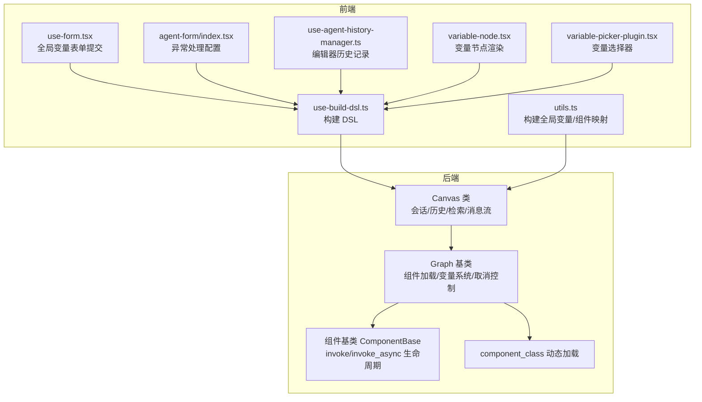
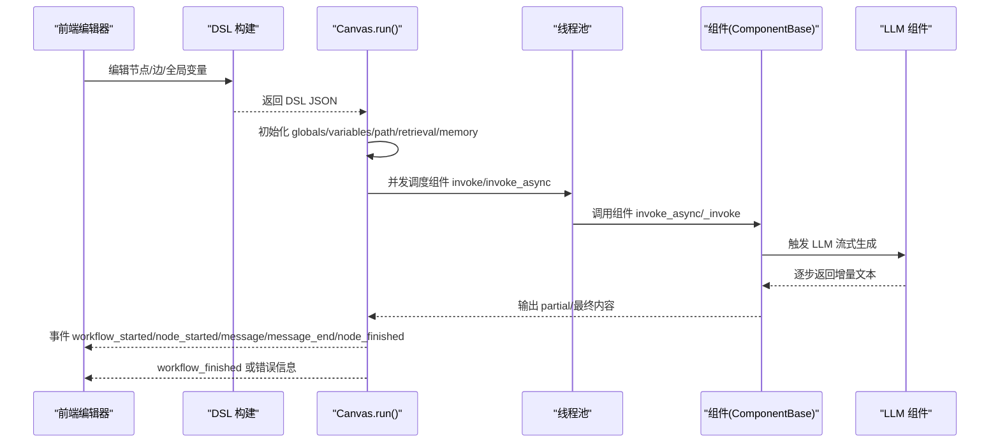
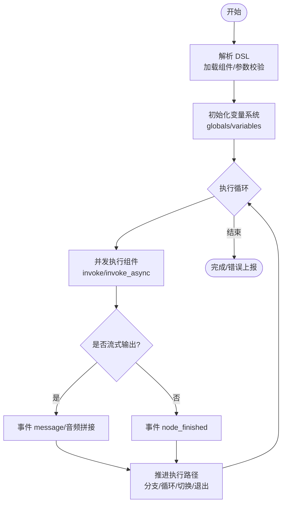
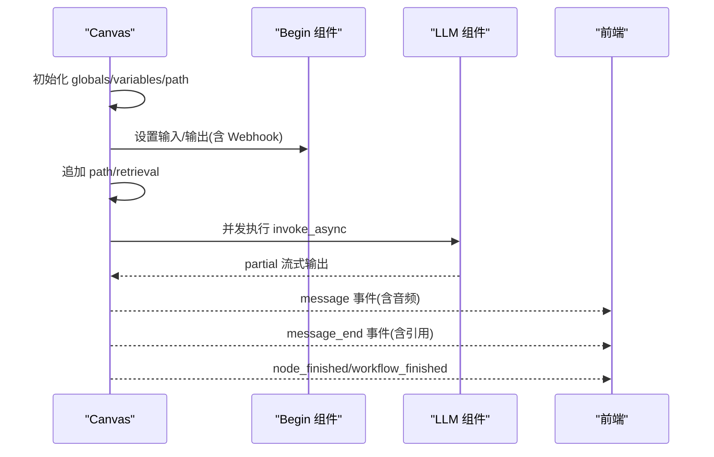
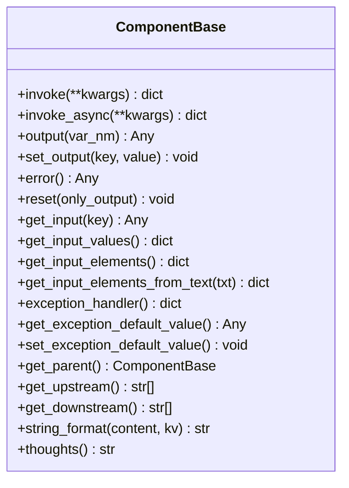
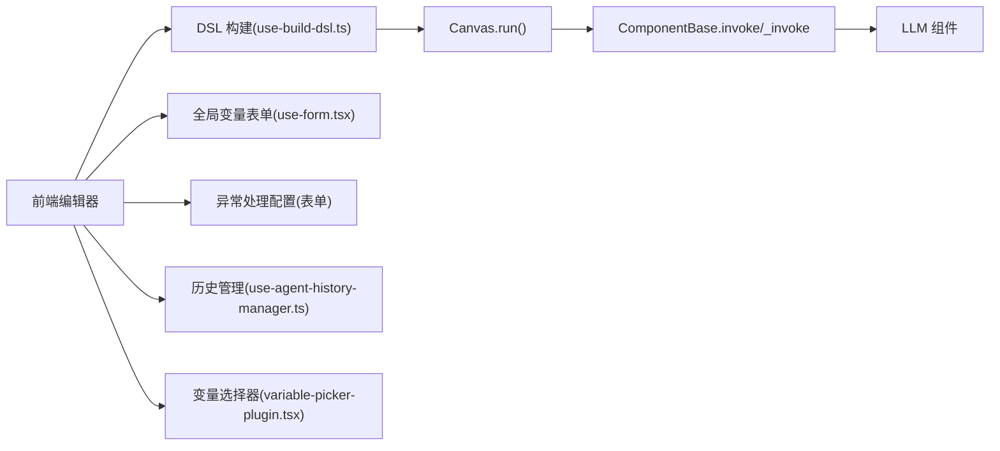

# 工作流画布

<cite>
**本文引用的文件**
- [agent/canvas.py](file://agent/canvas.py)
- [agent/component/base.py](file://agent/component/base.py)
- [agent/component/__init__.py](file://agent/component/__init__.py)
- [agent/component/begin.py](file://agent/component/begin.py)
- [agent/component/llm.py](file://agent/component/llm.py)
- [web/src/pages/agent/hooks/use-build-dsl.ts](file://web/src/pages/agent/hooks/use-build-dsl.ts)
- [web/src/pages/agent/utils.ts](file://web/src/pages/agent/utils.ts)
- [web/src/pages/agent/gobal-variable-sheet/hooks/use-form.tsx](file://web/src/pages/agent/gobal-variable-sheet/hooks/use-form.tsx)
- [web/src/pages/agent/form/agent-form/index.tsx](file://web/src/pages/agent/form/agent-form/index.tsx)
- [web/src/pages/agent/use-agent-history-manager.ts](file://web/src/pages/agent/use-agent-history-manager.ts)
- [web/src/pages/agent/form/components/prompt-editor/variable-node.tsx](file://web/src/pages/agent/form/components/prompt-editor/variable-node.tsx)
- [web/src/pages/agent/form/components/prompt-editor/variable-on-change-plugin.tsx](file://web/src/pages/agent/form/components/prompt-editor/variable-on-change-plugin.tsx)
- [web/src/components/prompt-editor/variable-picker-plugin.tsx](file://web/src/components/prompt-editor/variable-picker-plugin.tsx)
- [api/apps/sdk/agents.py](file://api/apps/sdk/agents.py)
</cite>

## 目录
1. [简介](#简介)
2. [项目结构](#项目结构)
3. [核心组件](#核心组件)
4. [架构总览](#架构总览)
5. [详细组件分析](#详细组件分析)
6. [依赖关系分析](#依赖关系分析)
7. [性能考量](#性能考量)
8. [故障排查指南](#故障排查指南)
9. [结论](#结论)
10. [附录：API 参考](#附录api-参考)

## 简介
本文件面向“工作流画布”系统，围绕 Canvas 类与 Graph 基类展开，系统性阐述以下主题：
- DSL 解析与组件加载机制
- 执行路径管理与异步执行模型
- 变量绑定与引用机制（全局、组件内、跨组件）
- 组件生命周期与错误处理
- 与前端可视化编辑器的集成与数据同步
- 完整 API 参考与使用示例路径

## 项目结构
后端核心位于 agent 包，前端可视化编辑器位于 web/src/pages/agent。二者通过 DSL（图结构+组件定义+变量）进行数据交换。

**图表来源**
- [agent/canvas.py:40-106](file://agent/canvas.py#L40-L106)
- [agent/component/base.py:365-448](file://agent/component/base.py#L365-L448)
- [agent/component/__init__.py:51-59](file://agent/component/__init__.py#L51-L59)
- [web/src/pages/agent/hooks/use-build-dsl.ts:34-59](file://web/src/pages/agent/hooks/use-build-dsl.ts#L34-L59)
- [web/src/pages/agent/utils.ts:474-488](file://web/src/pages/agent/utils.ts#L474-L488)
- [web/src/pages/agent/gobal-variable-sheet/hooks/use-form.tsx:18-44](file://web/src/pages/agent/gobal-variable-sheet/hooks/use-form.tsx#L18-L44)
- [web/src/pages/agent/form/agent-form/index.tsx:253-287](file://web/src/pages/agent/form/agent-form/index.tsx#L253-L287)
- [web/src/pages/agent/use-agent-history-manager.ts:29-44](file://web/src/pages/agent/use-agent-history-manager.ts#L29-L44)
- [web/src/pages/agent/form/components/prompt-editor/variable-node.tsx:71-89](file://web/src/pages/agent/form/components/prompt-editor/variable-node.tsx#L71-L89)
- [web/src/pages/agent/form/components/prompt-editor/variable-on-change-plugin.tsx:1-37](file://web/src/pages/agent/form/components/prompt-editor/variable-on-change-plugin.tsx#L1-L37)
- [web/src/components/prompt-editor/variable-picker-plugin.tsx:148-202](file://web/src/components/prompt-editor/variable-picker-plugin.tsx#L148-L202)

**章节来源**
- [agent/canvas.py:40-106](file://agent/canvas.py#L40-L106)
- [agent/component/base.py:365-448](file://agent/component/base.py#L365-L448)
- [agent/component/__init__.py:51-59](file://agent/component/__init__.py#L51-L59)
- [web/src/pages/agent/hooks/use-build-dsl.ts:34-59](file://web/src/pages/agent/hooks/use-build-dsl.ts#L34-L59)
- [web/src/pages/agent/utils.ts:474-488](file://web/src/pages/agent/utils.ts#L474-L488)

## 核心组件
- Graph 基类
  - 负责从 DSL 字符串解析组件、参数校验、实例化组件对象、维护执行路径 path、变量系统 globals/variables、取消任务与重置逻辑。
  - 提供 get_variable_value/set_variable_value/get_variable_param_value 等变量解析与写入能力。
- Canvas 类
  - 在 Graph 基础上扩展会话历史、检索结果、记忆体、TTS 音频生成、用户输入注入、Webhook 模式支持、事件驱动的异步执行流水线。
  - 提供 run() 异步迭代执行、事件装饰器、部分输出（流式）处理、分支/循环/切换/退出等路径推进逻辑。
- ComponentBase 组件基类
  - 统一组件生命周期：invoke/invoke_async、超时控制、错误记录、输出/输入管理、父子关系、上游下游拓扑、异常处理策略（跳转/默认值）。
- component_class 动态加载
  - 从 agent.component、agent.tools、rag.flow 中按名称动态导入组件类，支持扩展新组件。

**章节来源**
- [agent/canvas.py:81-106](file://agent/canvas.py#L81-L106)
- [agent/canvas.py:162-266](file://agent/canvas.py#L162-L266)
- [agent/canvas.py:279-367](file://agent/canvas.py#L279-L367)
- [agent/component/base.py:365-448](file://agent/component/base.py#L365-L448)
- [agent/component/base.py:407-447](file://agent/component/base.py#L407-L447)
- [agent/component/__init__.py:51-59](file://agent/component/__init__.py#L51-L59)

## 架构总览
Canvas 的执行流程采用事件驱动的异步模型，结合线程池并发执行组件调用，支持流式输出与 TTS 音频拼接，同时具备取消、分支、循环、异常处理与回溯能力。

**图表来源**
- [agent/canvas.py:367-656](file://agent/canvas.py#L367-L656)
- [agent/component/base.py:421-447](file://agent/component/base.py#L421-L447)
- [agent/component/llm.py:169-262](file://agent/component/llm.py#L169-L262)

## 详细组件分析

### Graph 基类设计与变量系统
- 组件加载
  - 从 DSL["components"] 读取每个组件的名称与参数，实例化对应 Param 对象并校验，随后通过 component_class 动态构造组件实例。
- 变量系统
  - 支持表达式解析：全局 sys.env、组件内 @id 引用、点号路径访问；支持设置/获取嵌套字段。
  - 表达式格式：形如 {sys.xxx}、{env.var}、{cpn_id@output.field}。
- 取消与重置
  - 通过 Redis 键标记任务取消；reset() 清理输出、日志与取消标记。
- 接口要点
  - get_component/get_component_obj/get_component_type/get_component_input_form
  - get_value_with_variable 用于在字符串中批量替换变量

**图表来源**
- [agent/canvas.py:91-106](file://agent/canvas.py#L91-L106)
- [agent/canvas.py:162-266](file://agent/canvas.py#L162-L266)
- [agent/canvas.py:420-464](file://agent/canvas.py#L420-L464)
- [agent/canvas.py:565-621](file://agent/canvas.py#L565-L621)

**章节来源**
- [agent/canvas.py:91-106](file://agent/canvas.py#L91-L106)
- [agent/canvas.py:162-266](file://agent/canvas.py#L162-L266)
- [agent/canvas.py:420-464](file://agent/canvas.py#L420-L464)
- [agent/canvas.py:565-621](file://agent/canvas.py#L565-L621)

### Canvas 类：会话、检索、消息流与 Webhook
- 会话与历史
  - globals["sys.history"] 记录对话历史；add_user_input/add_history/get_history 管理上下文。
- 检索与引用
  - retrieval 列表保存每轮检索块与聚合信息；add_reference/get_reference 用于引用生成。
- 内存
  - memory 列表保存用户/助手/总结三元组，便于后续记忆增强。
- Webhook 模式
  - 当开始节点为 Webhook 且传入 webhook_payload 时，将 payload 注入到 Begin 组件的输入/输出。
- 异步执行
  - run() 使用 asyncio 事件循环，_run_batch 并发调度组件；对流式输出进行分片与 TTS 音频拼接。
- 取消与错误
  - is_canceled/cancel_task；异常处理可跳转到指定分支或设置默认值。

**图表来源**
- [agent/canvas.py:367-656](file://agent/canvas.py#L367-L656)
- [agent/component/llm.py:169-262](file://agent/component/llm.py#L169-L262)

**章节来源**
- [agent/canvas.py:279-367](file://agent/canvas.py#L279-L367)
- [agent/canvas.py:367-656](file://agent/canvas.py#L367-L656)
- [agent/canvas.py:794-821](file://agent/canvas.py#L794-L821)

### 组件基类 ComponentBase：生命周期与错误处理
- 生命周期
  - 同步 invoke：记录开始时间、调用 _invoke、捕获异常、记录耗时。
  - 异步 invoke_async：优先尝试 _invoke_async，否则在线程池中执行 _invoke，统一记录耗时与错误。
- 输入/输出与调试
  - get_input/get_input_values/get_input_elements；set_input_value/get_input_value；output/set_output。
- 异常处理
  - exception_handler/get_exception_default_value/set_exception_default_value 支持“注释”默认值或跳转分支。
- 变量引用
  - get_input_elements_from_text 支持在文本中解析 {cpn_id@output.field} 等变量引用。

**图表来源**
- [agent/component/base.py:365-584](file://agent/component/base.py#L365-L584)

**章节来源**
- [agent/component/base.py:365-584](file://agent/component/base.py#L365-L584)

### 组件动态加载：component_class
- 从 agent.component、agent.tools、rag.flow 三个命名空间中按类名查找并返回组件类，支持扩展新组件类型。
- 与 Graph.load 协同完成组件实例化与参数校验。

**章节来源**
- [agent/component/__init__.py:51-59](file://agent/component/__init__.py#L51-L59)
- [agent/canvas.py:96-103](file://agent/canvas.py#L96-L103)

### 具体组件示例：Begin 与 LLM
- Begin
  - 参数继承自 UserFillUpParam，支持 mode（conversational/task/Webhook）、prologue 等。
  - _invoke 将 inputs 映射到输出，支持文件解析。
- LLM
  - 支持结构化输出、流式输出、图片多模态、引用提示词、异常处理与记忆增强工具调用摘要。

**章节来源**
- [agent/component/begin.py:20-60](file://agent/component/begin.py#L20-L60)
- [agent/component/llm.py:33-100](file://agent/component/llm.py#L33-L100)
- [agent/component/llm.py:264-342](file://agent/component/llm.py#L264-L342)

## 依赖关系分析
- 后端依赖
  - Graph/Canvas 依赖 component_class 动态加载组件；组件依赖 LLMBundle/TenantLLMService 实现推理与多模态。
  - Canvas 依赖 REDIS_CONN 进行任务取消标记与日志追踪。
- 前端依赖
  - use-build-dsl.ts 将编辑器节点/边转换为 DSL，并合并全局变量；utils.ts 构建全局变量集合；表单组件负责异常处理策略与变量表单提交。
  - 编辑器历史管理与变量选择器插件确保 UI 与 DSL 的一致性。

**图表来源**
- [web/src/pages/agent/hooks/use-build-dsl.ts:34-59](file://web/src/pages/agent/hooks/use-build-dsl.ts#L34-L59)
- [web/src/pages/agent/utils.ts:474-488](file://web/src/pages/agent/utils.ts#L474-L488)
- [web/src/pages/agent/gobal-variable-sheet/hooks/use-form.tsx:18-44](file://web/src/pages/agent/gobal-variable-sheet/hooks/use-form.tsx#L18-L44)
- [web/src/pages/agent/form/agent-form/index.tsx:253-287](file://web/src/pages/agent/form/agent-form/index.tsx#L253-L287)
- [web/src/pages/agent/use-agent-history-manager.ts:29-44](file://web/src/pages/agent/use-agent-history-manager.ts#L29-L44)
- [web/src/components/prompt-editor/variable-picker-plugin.tsx:148-202](file://web/src/components/prompt-editor/variable-picker-plugin.tsx#L148-L202)

**章节来源**
- [web/src/pages/agent/hooks/use-build-dsl.ts:34-59](file://web/src/pages/agent/hooks/use-build-dsl.ts#L34-L59)
- [web/src/pages/agent/utils.ts:474-488](file://web/src/pages/agent/utils.ts#L474-L488)
- [web/src/pages/agent/gobal-variable-sheet/hooks/use-form.tsx:18-44](file://web/src/pages/agent/gobal-variable-sheet/hooks/use-form.tsx#L18-L44)
- [web/src/pages/agent/form/agent-form/index.tsx:253-287](file://web/src/pages/agent/form/agent-form/index.tsx#L253-L287)
- [web/src/pages/agent/use-agent-history-manager.ts:29-44](file://web/src/pages/agent/use-agent-history-manager.ts#L29-L44)
- [web/src/components/prompt-editor/variable-picker-plugin.tsx:148-202](file://web/src/components/prompt-editor/variable-picker-plugin.tsx#L148-L202)

## 性能考量
- 并发执行
  - Canvas 使用线程池并发执行组件调用，避免阻塞事件循环；建议根据资源限制调整 max_workers。
- 流式输出
  - LLM 组件支持增量返回，Canvas 将缓冲区超过阈值时即刻推送事件，降低端到端延迟。
- 取消与超时
  - 组件层统一超时装饰器；Canvas 层在每次迭代前检查取消状态，快速失败。
- 变量解析
  - 复杂嵌套路径访问需注意字符串/数组/对象边界，建议在 UI 层提供变量选择器减少错误。

[本节为通用指导，无需列出具体文件来源]

## 故障排查指南
- 任务被取消
  - Canvas 在启动与批处理阶段均会检查取消状态，抛出 TaskCanceledException；前端应监听 workflow_finished 并显示“已取消”。
- 组件异常处理
  - 若组件配置了 exception_method/comment，则在异常时输出默认值；否则错误信息写入 _ERROR 并中断执行。
- 变量引用无效
  - 表达式 {cpn_id@output.field} 无法解析时会抛出异常；请确认组件 ID 存在且字段存在。
- Webhook 模式
  - Begin 模式为 Webhook 时，需正确传入 webhook_payload；Begin 会将 payload 注入到请求与输出。

**章节来源**
- [agent/canvas.py:412-416](file://agent/canvas.py#L412-L416)
- [agent/canvas.py:566-576](file://agent/canvas.py#L566-L576)
- [agent/canvas.py:194-196](file://agent/canvas.py#L194-L196)
- [agent/canvas.py:376-386](file://agent/canvas.py#L376-L386)

## 结论
该工作流画布系统以 Graph/Canvas 为核心，结合组件基类与动态加载机制，实现了可扩展、可并发、可观测的异步执行框架。变量系统覆盖全局、组件内与跨组件引用，配合前端可视化编辑器，形成从设计到运行的一体化闭环。通过事件驱动与流式输出，系统在复杂工作流场景下具备良好的实时性与可维护性。

[本节为总结，无需列出具体文件来源]

## 附录：API 参考

### Graph 基类
- 构造函数
  - 参数
    - dsl: str，DSL JSON 字符串
    - tenant_id: 可选租户标识
    - task_id: 可选任务标识，未提供时自动生成
- 方法
  - load(): 加载组件、参数校验、实例化组件
  - reset(): 重置执行状态与缓存键
  - get_component(cpn_id): 获取组件元信息
  - get_component_obj(cpn_id): 获取组件实例
  - get_component_type(cpn_id): 组件类型名
  - get_component_input_form(cpn_id): 组件输入表单定义
  - get_value_with_variable(value): 替换字符串中的变量表达式
  - get_variable_value(exp): 读取变量值（支持 sys/env/组件引用）
  - get_variable_param_value(obj, path): 按路径读取嵌套值
  - set_variable_value(exp, value): 写入变量值
  - set_variable_param_value(obj, path, value): 按路径写入嵌套值
  - is_canceled()/cancel_task(): 取消控制

**章节来源**
- [agent/canvas.py:81-106](file://agent/canvas.py#L81-L106)
- [agent/canvas.py:162-266](file://agent/canvas.py#L162-L266)

### Canvas 类
- 构造函数
  - 参数
    - dsl: str
    - tenant_id: 可选
    - task_id: 可选
    - canvas_id: 可选
- 方法
  - load(): 扩展加载 globals/variables/retrieval/memory
  - reset(mem=False): 重置会话/检索/记忆（可保留）
  - run(**kwargs): 异步执行主流程，产出事件流
  - add_user_input(question)/get_history(window_size): 会话历史管理
  - add_reference(chunks, doc_infos)/get_reference(): 检索引用
  - add_memory(user, assist, summ)/get_memory(): 记忆体
  - get_prologue()/get_mode()/get_sys_query()/set_global_param()
  - get_preset_param()/get_component_input_elements(cpn)
  - get_files_async(files)/get_files(files): 文件解析（异步/同步）
  - tool_use_callback(agent_id, func_name, params, result, elapsed_time): 工具调用追踪
  - tts(tts_mdl, text): 文本转语音二进制
  - is_reff(exp): 判断表达式是否为有效引用

**章节来源**
- [agent/canvas.py:279-367](file://agent/canvas.py#L279-L367)
- [agent/canvas.py:723-769](file://agent/canvas.py#L723-L769)
- [agent/canvas.py:770-793](file://agent/canvas.py#L770-L793)
- [agent/canvas.py:669-711](file://agent/canvas.py#L669-L711)
- [agent/canvas.py:794-821](file://agent/canvas.py#L794-L821)

### ComponentBase 组件基类
- 构造函数
  - 参数
    - canvas: Graph 实例
    - id: 组件 ID
    - param: ComponentParamBase 实例
- 方法
  - invoke(**kwargs)/invoke_async(**kwargs): 生命周期入口
  - output()/set_output(key, value): 输出读写
  - error(): 错误读取
  - reset(only_output): 重置输入/输出
  - get_input()/get_input_values()/get_input_elements()
  - get_input_elements_from_text(txt): 解析文本中的变量引用
  - exception_handler()/get_exception_default_value()/set_exception_default_value()
  - get_parent()/get_upstream()/get_downstream()
  - string_format(content, kv): 字符串模板替换
  - thoughts(): 组件思考描述（子类实现）

**章节来源**
- [agent/component/base.py:365-584](file://agent/component/base.py#L365-L584)

### 组件动态加载
- component_class(class_name): 在 agent.component、agent.tools、rag.flow 中按类名查找并返回组件类

**章节来源**
- [agent/component/__init__.py:51-59](file://agent/component/__init__.py#L51-L59)

### 前端集成与数据同步
- DSL 构建
  - use-build-dsl.ts：过滤节点/边，构建 components 与 graph；合并全局变量
  - utils.ts：buildDslGlobalVariables 合并系统变量与用户变量
- 全局变量
  - use-form.tsx：提交全局变量（含对象/数组对象解析）
  - agent-form/index.tsx：异常处理策略（comment/default_value/goto）
- 编辑器历史
  - use-agent-history-manager.ts：限制历史栈大小，去重保存
- 变量节点与选择器
  - variable-node.tsx：渲染变量节点文本
  - variable-on-change-plugin.tsx：监听手动编辑触发 onChange
  - variable-picker-plugin.tsx：插入变量节点并关闭菜单

**章节来源**
- [web/src/pages/agent/hooks/use-build-dsl.ts:34-59](file://web/src/pages/agent/hooks/use-build-dsl.ts#L34-L59)
- [web/src/pages/agent/utils.ts:474-488](file://web/src/pages/agent/utils.ts#L474-L488)
- [web/src/pages/agent/gobal-variable-sheet/hooks/use-form.tsx:18-44](file://web/src/pages/agent/gobal-variable-sheet/hooks/use-form.tsx#L18-L44)
- [web/src/pages/agent/form/agent-form/index.tsx:253-287](file://web/src/pages/agent/form/agent-form/index.tsx#L253-L287)
- [web/src/pages/agent/use-agent-history-manager.ts:29-44](file://web/src/pages/agent/use-agent-history-manager.ts#L29-L44)
- [web/src/pages/agent/form/components/prompt-editor/variable-node.tsx:71-89](file://web/src/pages/agent/form/components/prompt-editor/variable-node.tsx#L71-L89)
- [web/src/pages/agent/form/components/prompt-editor/variable-on-change-plugin.tsx:1-37](file://web/src/pages/agent/form/components/prompt-editor/variable-on-change-plugin.tsx#L1-L37)
- [web/src/components/prompt-editor/variable-picker-plugin.tsx:148-202](file://web/src/components/prompt-editor/variable-picker-plugin.tsx#L148-L202)

### 示例：创建与运行复杂工作流（步骤说明）
- 步骤 1：在前端编辑器中拖拽节点，配置 Begin/LLM/Message 等组件参数与连接关系
- 步骤 2：使用 use-build-dsl.ts 生成 DSL，合并全局变量（use-form.tsx）
- 步骤 3：后端 Canvas.load() 解析 DSL，component_class 动态加载组件
- 步骤 4：Canvas.run() 并发执行组件，事件流推送至前端
- 步骤 5：前端根据事件渲染消息、音频与引用

**章节来源**
- [web/src/pages/agent/hooks/use-build-dsl.ts:34-59](file://web/src/pages/agent/hooks/use-build-dsl.ts#L34-L59)
- [web/src/pages/agent/gobal-variable-sheet/hooks/use-form.tsx:18-44](file://web/src/pages/agent/gobal-variable-sheet/hooks/use-form.tsx#L18-L44)
- [agent/canvas.py:293-312](file://agent/canvas.py#L293-L312)
- [agent/canvas.py:367-656](file://agent/canvas.py#L367-L656)

### Webhook 与 SDK 集成
- SDK agents.py 提供 webhook 查询与事件拉取接口，可用于外部系统与 Canvas 的事件对接

**章节来源**
- [api/apps/sdk/agents.py:860-910](file://api/apps/sdk/agents.py#L860-L910)