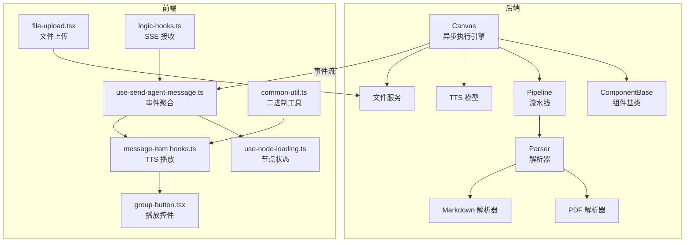
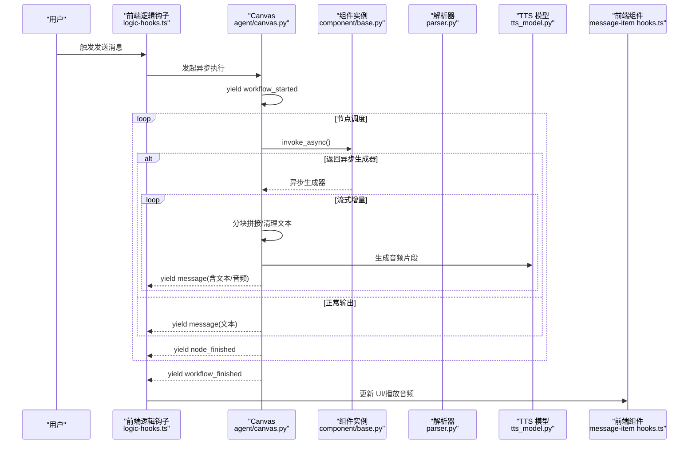
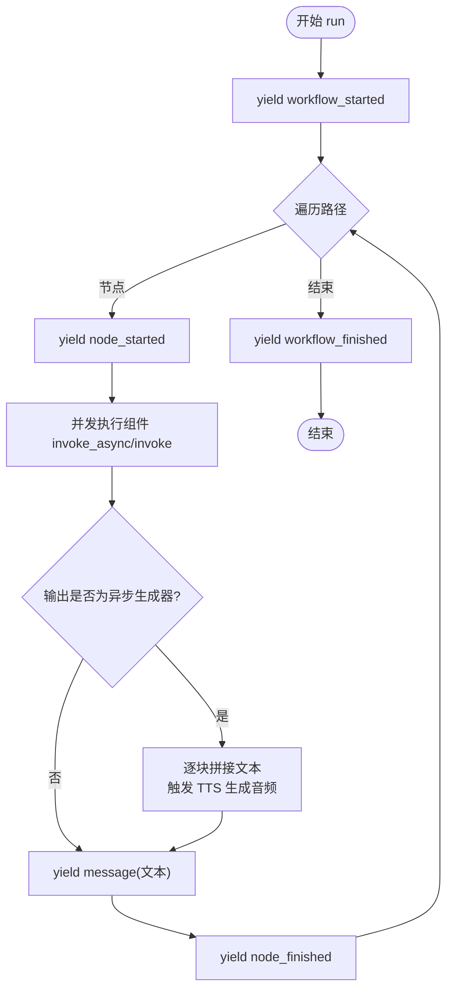
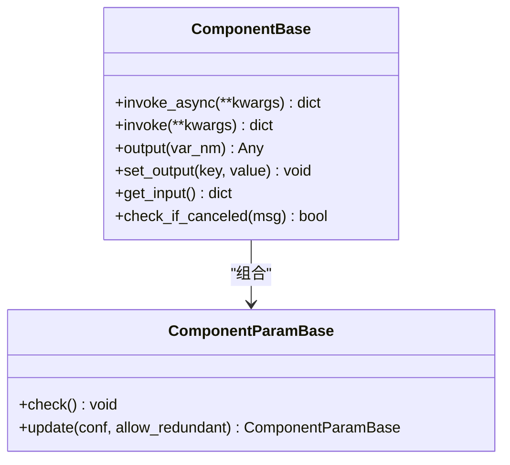
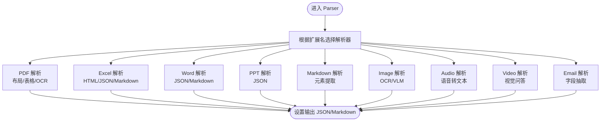
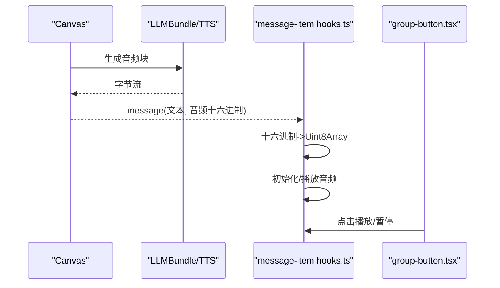
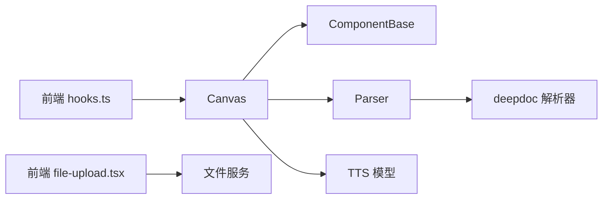

# 异步流式处理

<cite>
**本文引用的文件**
- [canvas.py](file://agent/canvas.py)
- [base.py](file://agent/component/base.py)
- [pipeline.py](file://rag/flow/pipeline.py)
- [file.py](file://rag/flow/file.py)
- [parser.py](file://rag/flow/parser/parser.py)
- [pdf_parser.py](file://deepdoc/parser/pdf_parser.py)
- [markdown_parser.py](file://deepdoc/parser/markdown_parser.py)
- [base64_image.py](file://rag/utils/base64_image.py)
- [tts_model.py](file://rag/llm/tts_model.py)
- [file_service.py](file://api/db/services/file_service.py)
- [use-send-agent-message.ts](file://web/src/pages/agent/chat/use-send-agent-message.ts)
- [use-node-loading.ts](file://web/src/pages/agent/hooks/use-node-loading.ts)
- [hooks.ts](file://web/src/components/message-item/hooks.ts)
- [group-button.tsx](file://web/src/components/message-item/group-button.tsx)
- [file-upload.tsx](file://web/src/components/file-upload.tsx)
- [common-util.ts](file://web/src/utils/common-util.ts)
- [logic-hooks.ts](file://web/src/hooks/logic-hooks.ts)
</cite>

## 目录
1. [简介](#简介)
2. [项目结构](#项目结构)
3. [核心组件](#核心组件)
4. [架构总览](#架构总览)
5. [详细组件分析](#详细组件分析)
6. [依赖分析](#依赖分析)
7. [性能考虑](#性能考虑)
8. [故障排查指南](#故障排查指南)
9. [结论](#结论)
10. [附录](#附录)

## 简介
本技术文档围绕异步流式处理系统进行深入剖析，覆盖以下主题：
- 流式执行模型：异步生成器、并发批处理、增量输出与事件驱动
- 消息事件系统：node_started、node_finished、message、workflow_finished 等事件类型与数据结构
- 流式文本处理：TTS 语音合成、Markdown 渲染、实时显示与分块播放
- 流式文件处理：图片编码、文件解析、多媒体内容的异步操作
- 流式错误处理：异常传播、默认值回退、取消与中断处理
- 组件开发指南：如何实现异步组件、处理流式数据、优化性能
- 流式调试方法：如何监控执行状态、定位性能瓶颈、调试流式问题

## 项目结构
该系统由后端 Python 执行引擎与前端 Web 实时渲染两部分组成：
- 后端
  - agent/canvas.py：图执行引擎，负责节点调度、并发批处理、事件流与 TTS 集成
  - agent/component/base.py：组件基类，统一异步调用、超时控制、异常处理与输出管理
  - rag/flow/*：流水线与解析器组件，支持多格式文件解析与流式回调
  - deepdoc/parser/*：PDF/Markdown 等解析器，提供布局识别、表格结构识别、OCR 等能力
  - rag/llm/tts_model.py：多厂商 TTS 实现，支持流式音频输出
  - api/db/services/file_service.py：文件服务，支持图片转 base64 与解析
- 前端
  - web/src/pages/agent/chat/use-send-agent-message.ts：事件聚合与最终输出提取
  - web/src/pages/agent/hooks/use-node-loading.ts：节点状态与完成度统计
  - web/src/components/message-item/hooks.ts：TTS 语音播放与分块播放
  - web/src/components/message-item/group-button.tsx：播放按钮与反馈交互
  - web/src/components/file-upload.tsx：文件上传与进度跟踪
  - web/src/utils/common-util.ts：二进制与十六进制转换工具
  - web/src/hooks/logic-hooks.ts：SSE 接收与中止逻辑

**图表来源**
- [canvas.py:367-656](file://agent/canvas.py#L367-L656)
- [base.py:421-447](file://agent/component/base.py#L421-L447)
- [pipeline.py:117-176](file://rag/flow/pipeline.py#L117-L176)
- [parser.py:222-800](file://rag/flow/parser/parser.py#L222-L800)
- [pdf_parser.py:56-110](file://deepdoc/parser/pdf_parser.py#L56-L110)
- [markdown_parser.py:23-122](file://deepdoc/parser/markdown_parser.py#L23-L122)
- [tts_model.py:65-413](file://rag/llm/tts_model.py#L65-L413)
- [file_service.py:664-680](file://api/db/services/file_service.py#L664-L680)
- [use-send-agent-message.ts:84-110](file://web/src/pages/agent/chat/use-send-agent-message.ts#L84-L110)
- [use-node-loading.ts:36-88](file://web/src/pages/agent/hooks/use-node-loading.ts#L36-L88)
- [hooks.ts:54-116](file://web/src/components/message-item/hooks.ts#L54-L116)
- [group-button.tsx:45-88](file://web/src/components/message-item/group-button.tsx#L45-L88)
- [file-upload.tsx:45-424](file://web/src/components/file-upload.tsx#L45-L424)
- [common-util.ts:91-146](file://web/src/utils/common-util.ts#L91-L146)
- [logic-hooks.ts:301-356](file://web/src/hooks/logic-hooks.ts#L301-L356)

**章节来源**
- [canvas.py:367-656](file://agent/canvas.py#L367-L656)
- [base.py:421-447](file://agent/component/base.py#L421-L447)
- [pipeline.py:117-176](file://rag/flow/pipeline.py#L117-L176)
- [parser.py:222-800](file://rag/flow/parser/parser.py#L222-L800)
- [pdf_parser.py:56-110](file://deepdoc/parser/pdf_parser.py#L56-L110)
- [markdown_parser.py:23-122](file://deepdoc/parser/markdown_parser.py#L23-L122)
- [tts_model.py:65-413](file://rag/llm/tts_model.py#L65-L413)
- [file_service.py:664-680](file://api/db/services/file_service.py#L664-L680)
- [use-send-agent-message.ts:84-110](file://web/src/pages/agent/chat/use-send-agent-message.ts#L84-L110)
- [use-node-loading.ts:36-88](file://web/src/pages/agent/hooks/use-node-loading.ts#L36-L88)
- [hooks.ts:54-116](file://web/src/components/message-item/hooks.ts#L54-L116)
- [group-button.tsx:45-88](file://web/src/components/message-item/group-button.tsx#L45-L88)
- [file-upload.tsx:45-424](file://web/src/components/file-upload.tsx#L45-L424)
- [common-util.ts:91-146](file://web/src/utils/common-util.ts#L91-L146)
- [logic-hooks.ts:301-356](file://web/src/hooks/logic-hooks.ts#L301-L356)

## 核心组件
- Canvas（异步执行引擎）
  - 提供工作流启动、节点调度、并发批处理、事件流与 TTS 集成
  - 关键流程：yield workflow_started → 多轮 _run_batch → yield node_started/node_finished/message → yield workflow_finished
- ComponentBase（组件基类）
  - 统一异步调用 invoke_async，支持协程与线程池执行，内置超时与异常处理
  - 输出管理与异常默认值策略
- Pipeline（流水线）
  - 文件组件获取后，按下游顺序异步执行，支持进度回调与取消检测
- Parser（解析器）
  - 多格式解析：PDF/Excel/Word/PPT/Markdown/Image/Audio/Video/Email
  - 流式回调与进度上报
- TTS 模型
  - 多厂商实现（Fish Audio、Qwen、OpenAI、讯飞、Xinference、Ollama、GPUStack、SiliconFlow 等）
  - 支持流式音频输出，前端按块播放
- 文件服务
  - 图片转 base64 与文件解析并行化

**章节来源**
- [canvas.py:367-656](file://agent/canvas.py#L367-L656)
- [base.py:421-447](file://agent/component/base.py#L421-L447)
- [pipeline.py:117-176](file://rag/flow/pipeline.py#L117-L176)
- [parser.py:222-800](file://rag/flow/parser/parser.py#L222-L800)
- [tts_model.py:65-413](file://rag/llm/tts_model.py#L65-L413)
- [file_service.py:664-680](file://api/db/services/file_service.py#L664-L680)

## 架构总览
下图展示从用户输入到事件流产出再到前端渲染的完整链路。

**图表来源**
- [canvas.py:367-656](file://agent/canvas.py#L367-L656)
- [base.py:421-447](file://agent/component/base.py#L421-L447)
- [parser.py:222-800](file://rag/flow/parser/parser.py#L222-L800)
- [tts_model.py:65-413](file://rag/llm/tts_model.py#L65-L413)
- [logic-hooks.ts:301-356](file://web/src/hooks/logic-hooks.ts#L301-L356)

## 详细组件分析

### Canvas：异步执行与事件流
- 工作流生命周期
  - 初始化与全局变量准备
  - 用户输入注入与会话历史维护
  - 并发批处理 _run_batch：使用线程池执行组件 invoke_async 或 invoke
  - 事件流：node_started → message（可带音频）→ node_finished → workflow_finished
- 流式文本与 TTS
  - 对输出为异步生成器的节点，按块拼接文本，超过阈值时触发 TTS 生成音频并返回十六进制字符串
  - 文本清洗与长度截断，避免长文本导致 TTS 负载过大
- 取消与异常
  - 每轮执行前检查任务取消标志，抛出 TaskCanceledException
  - 组件异常通过异常处理器决定 goto 分支或默认值回退

**图表来源**
- [canvas.py:367-656](file://agent/canvas.py#L367-L656)

**章节来源**
- [canvas.py:367-656](file://agent/canvas.py#L367-L656)

### ComponentBase：异步组件基类
- 统一异步入口
  - invoke_async：优先调用 _invoke_async（协程），否则在线程池执行 _invoke
  - 记录耗时与异常，支持异常默认值策略
- 输入解析与变量引用
  - 支持 sys.env. 变量与跨组件引用表达式解析
- 超时与取消
  - 使用装饰器设置组件执行超时
  - 每次调用前检查任务取消

**图表来源**
- [base.py:421-447](file://agent/component/base.py#L421-L447)

**章节来源**
- [base.py:421-447](file://agent/component/base.py#L421-L447)

### Pipeline：流水线执行
- 文件组件优先执行，随后按下游顺序异步执行
- 进度回调：记录每个组件 trace，支持取消检测与进度更新
- 结束回调：汇总最终输出或错误信息

**章节来源**
- [pipeline.py:117-176](file://rag/flow/pipeline.py#L117-L176)
- [file.py:34-51](file://rag/flow/file.py#L34-L51)

### Parser：多格式文件解析
- PDF 解析
  - 支持 deepdoc、plain_text、MinerU、PaddleOCR、VLM 等多种模式
  - 提取文本框、表格、图像，并生成位置信息
- 表格结构识别
  - 自动旋转校正与 OCR 重识别，坐标映射与合并
- Markdown 解析
  - 提取标题、代码块、列表、区块引用、段落等元素
- 其他格式
  - Excel、Word、PPT、Image、Audio、Video、Email 等

**图表来源**
- [parser.py:222-800](file://rag/flow/parser/parser.py#L222-L800)
- [pdf_parser.py:56-110](file://deepdoc/parser/pdf_parser.py#L56-L110)
- [markdown_parser.py:23-122](file://deepdoc/parser/markdown_parser.py#L23-L122)

**章节来源**
- [parser.py:222-800](file://rag/flow/parser/parser.py#L222-L800)
- [pdf_parser.py:56-110](file://deepdoc/parser/pdf_parser.py#L56-L110)
- [markdown_parser.py:23-122](file://deepdoc/parser/markdown_parser.py#L23-L122)

### TTS 语音合成与前端播放
- 后端
  - LLMBundle 调用具体 TTS 实现，按块生成音频字节
  - Canvas 将音频以十六进制字符串形式嵌入 message 事件
- 前端
  - hooks.ts 中初始化 SpeechPlayer，按块喂入音频数据
  - group-button.tsx 提供播放/暂停按钮，支持不同 MIME 类型适配
  - common-util.ts 提供十六进制到 Uint8Array 的转换

**图表来源**
- [canvas.py:669-710](file://agent/canvas.py#L669-L710)
- [tts_model.py:65-413](file://rag/llm/tts_model.py#L65-L413)
- [hooks.ts:54-116](file://web/src/components/message-item/hooks.ts#L54-L116)
- [group-button.tsx:45-88](file://web/src/components/message-item/group-button.tsx#L45-L88)
- [common-util.ts:91-146](file://web/src/utils/common-util.ts#L91-L146)

**章节来源**
- [canvas.py:669-710](file://agent/canvas.py#L669-L710)
- [tts_model.py:65-413](file://rag/llm/tts_model.py#L65-L413)
- [hooks.ts:54-116](file://web/src/components/message-item/hooks.ts#L54-L116)
- [group-button.tsx:45-88](file://web/src/components/message-item/group-button.tsx#L45-L88)
- [common-util.ts:91-146](file://web/src/utils/common-util.ts#L91-L146)

### 文件处理与图片编码
- 后端
  - Canvas.get_files_async 并行处理图片转 base64 与非图片文件解析
  - base64_image.py 将图片编码为 JPEG 并上传对象存储，生成引用 ID
- 前端
  - file-upload.tsx 支持多文件上传、进度条、拖拽与错误提示
  - 上传完成后通过 SSE 获取结果并更新 UI

**章节来源**
- [canvas.py:745-768](file://agent/canvas.py#L745-L768)
- [base64_image.py:32-80](file://rag/utils/base64_image.py#L32-L80)
- [file_service.py:664-680](file://api/db/services/file_service.py#L664-L680)
- [file-upload.tsx:45-424](file://web/src/components/file-upload.tsx#L45-L424)

## 依赖分析
- 组件耦合
  - Canvas 依赖 ComponentBase 的统一异步调用接口
  - Parser 依赖 deepdoc 解析器与 LLMBundle
  - 前端通过 SSE 与 Canvas 事件流解耦
- 外部依赖
  - TTS 多厂商 SDK、PDF/OCR/表格识别模型、对象存储
- 循环依赖
  - 通过局部导入避免循环依赖（如 component/base.py 中对 canvas 的导入）

**图表来源**
- [canvas.py:367-656](file://agent/canvas.py#L367-L656)
- [base.py:384-391](file://agent/component/base.py#L384-L391)
- [parser.py:222-800](file://rag/flow/parser/parser.py#L222-L800)
- [tts_model.py:65-413](file://rag/llm/tts_model.py#L65-L413)
- [file-upload.tsx:45-424](file://web/src/components/file-upload.tsx#L45-L424)
- [file_service.py:664-680](file://api/db/services/file_service.py#L664-L680)

**章节来源**
- [canvas.py:367-656](file://agent/canvas.py#L367-L656)
- [base.py:384-391](file://agent/component/base.py#L384-L391)
- [parser.py:222-800](file://rag/flow/parser/parser.py#L222-L800)
- [tts_model.py:65-413](file://rag/llm/tts_model.py#L65-L413)
- [file-upload.tsx:45-424](file://web/src/components/file-upload.tsx#L45-L424)
- [file_service.py:664-680](file://api/db/services/file_service.py#L664-L680)

## 性能考虑
- 并发与限流
  - Canvas 使用线程池执行组件调用，避免阻塞事件流
  - 组件级信号量限制并发聊天数，防止资源争用
- 流式处理
  - 文本分块与 TTS 分块播放，降低首帧延迟
  - Parser 对大文件采用分页/分表处理与进度回调
- 缓存与预热
  - 模型与 OCR 模型加载后复用，减少冷启动开销
- 存储与编码
  - 图片编码与对象存储上传异步化，避免主线程阻塞

**章节来源**
- [canvas.py:88-88](file://agent/canvas.py#L88-L88)
- [base.py:367-367](file://agent/component/base.py#L367-L367)
- [parser.py:222-800](file://rag/flow/parser/parser.py#L222-L800)
- [base64_image.py:32-80](file://rag/utils/base64_image.py#L32-L80)

## 故障排查指南
- 任务取消
  - Canvas 在每轮执行前检查取消标志，抛出 TaskCanceledException
  - 前端 logic-hooks.ts 支持中止 SSE 请求
- 异常传播与默认值
  - 组件异常可通过 exception_handler 决定 goto 或默认值
  - Canvas 在异常分支中记录错误并继续流程
- 前端播放问题
  - 检查 MIME 类型与十六进制到 Uint8Array 的转换
  - 确认 SpeechPlayer 初始化与 feedWithResponse 调用时机
- 文件上传失败
  - 检查文件大小、类型与后端线程池配置
  - 查看前端 file-upload.tsx 的错误状态与提示

**章节来源**
- [canvas.py:420-463](file://agent/canvas.py#L420-L463)
- [canvas.py:565-585](file://agent/canvas.py#L565-L585)
- [base.py:567-581](file://agent/component/base.py#L567-L581)
- [logic-hooks.ts:328-330](file://web/src/hooks/logic-hooks.ts#L328-L330)
- [hooks.ts:54-116](file://web/src/components/message-item/hooks.ts#L54-L116)
- [file-upload.tsx:45-424](file://web/src/components/file-upload.tsx#L45-L424)

## 结论
该异步流式处理系统通过 Canvas 的事件驱动执行模型、ComponentBase 的统一异步接口、Parser 的多格式解析能力以及 TTS 的流式音频输出，实现了从文件解析到文本生成与语音播报的全链路实时体验。前端通过 SSE 与事件聚合，结合分块播放与进度反馈，提供了流畅的交互体验。系统在并发、限流、缓存与存储方面均做了针对性优化，并提供了完善的异常与取消处理机制，便于在复杂场景中稳定运行。

## 附录
- 开发建议
  - 组件实现应尽量返回异步生成器，以便前端实时渲染
  - 合理设置组件超时与并发上限，避免资源耗尽
  - 对大文件与长文本采用分块处理与进度回调
  - 前端播放需兼容不同 MIME 类型，确保跨浏览器一致性
- 调试技巧
  - 使用 use-node-loading.ts 统计节点完成度与耗时
  - 通过 use-send-agent-message.ts 提取最新错误与最终输出
  - 利用 logic-hooks.ts 的 SSE 中止能力快速终止长时间任务