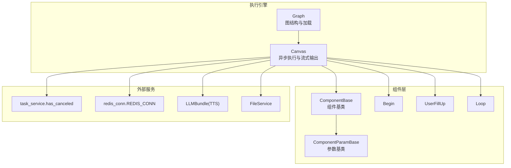
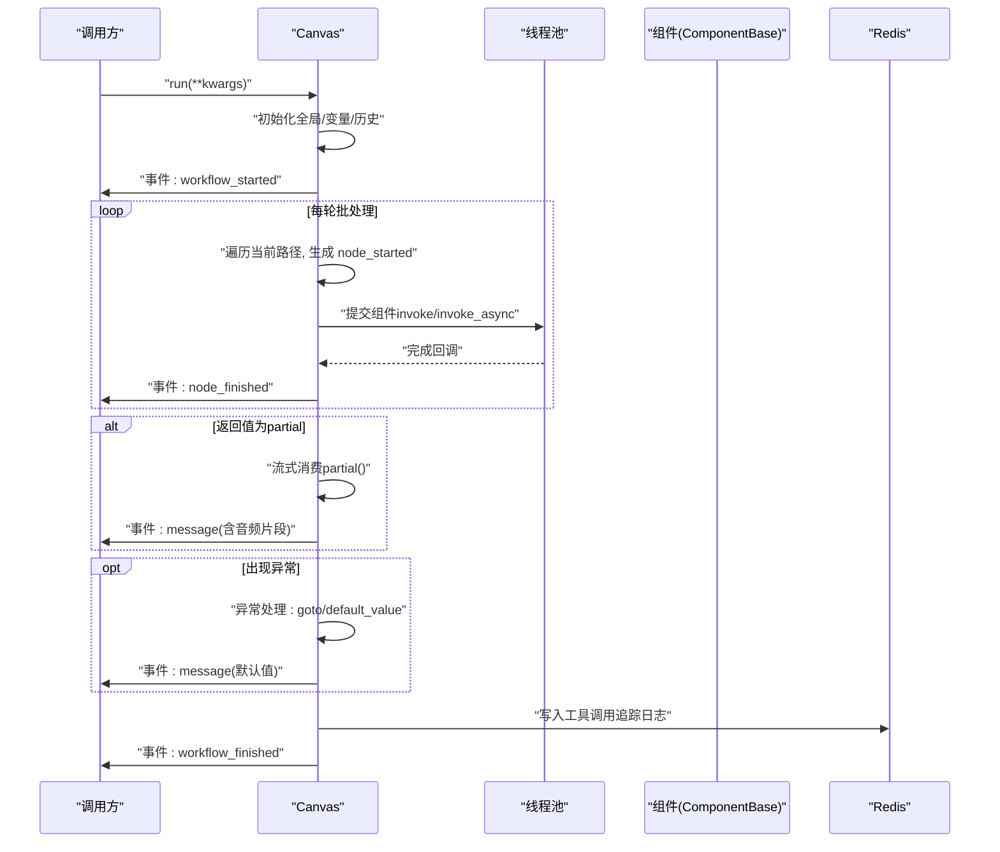
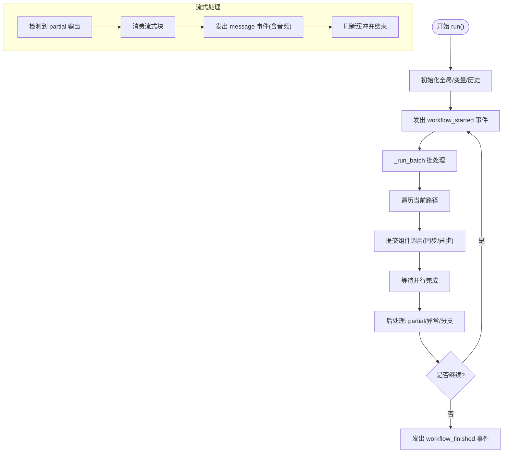
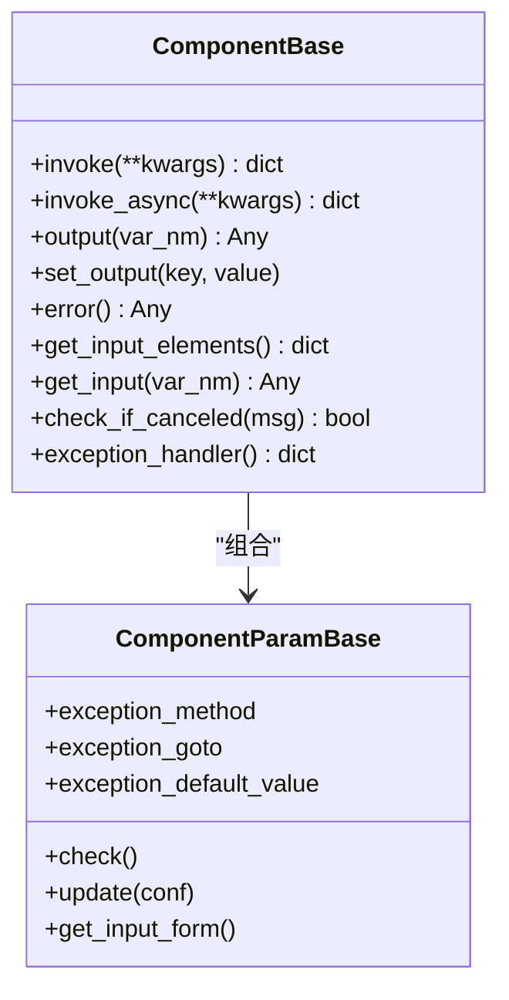
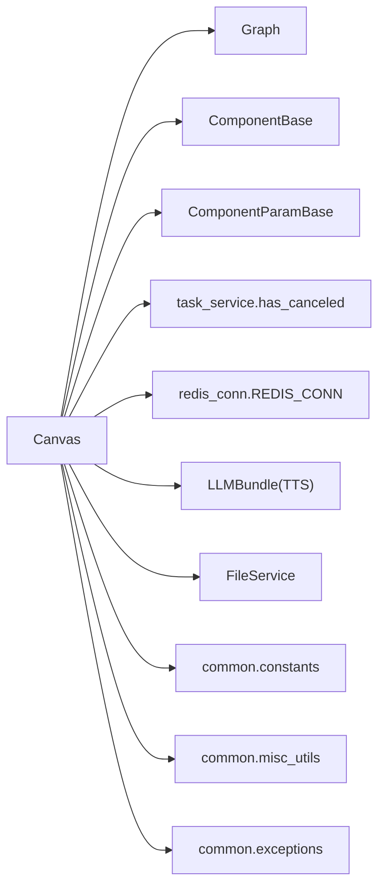

# 执行引擎

<cite>
**本文引用的文件**
- [agent/canvas.py](file://agent/canvas.py)
- [agent/component/base.py](file://agent/component/base.py)
- [agent/component/loop.py](file://agent/component/loop.py)
- [agent/component/fillup.py](file://agent/component/fillup.py)
- [agent/component/begin.py](file://agent/component/begin.py)
- [common/constants.py](file://common/constants.py)
- [common/misc_utils.py](file://common/misc_utils.py)
- [common/exceptions.py](file://common/exceptions.py)
- [api/db/services/task_service.py](file://api/db/services/task_service.py)
- [rag/prompts/generator.py](file://rag/prompts/generator.py)
- [rag/utils/redis_conn.py](file://rag/utils/redis_conn.py)
</cite>

## 目录
1. [简介](#简介)
2. [项目结构](#项目结构)
3. [核心组件](#核心组件)
4. [架构总览](#架构总览)
5. [详细组件分析](#详细组件分析)
6. [依赖分析](#依赖分析)
7. [性能考虑](#性能考虑)
8. [故障排查指南](#故障排查指南)
9. [结论](#结论)
10. [附录](#附录)

## 简介
本文件面向“执行引擎”的技术文档，聚焦于 Canvas 类的异步执行模型与流式输出能力。内容涵盖：
- 事件驱动的执行流程与并发控制
- 线程池管理与协程调度
- 执行路径规划（拓扑排序、循环检测、分支合并）
- 异步任务调度（协程管理、并发限制、资源分配）
- 流式执行机制（partial 对象处理、增量输出、实时反馈）
- 错误处理与恢复策略（异常捕获、分支跳转、默认值设置）
- 性能优化建议（批量执行、缓存策略、内存管理）
- 执行监控方法（进度跟踪、性能数据采集、问题调试）

## 项目结构
执行引擎位于 agent 子系统中，核心入口为 Canvas 类，其上层抽象为 Graph；组件基类 ComponentBase 提供统一的参数校验、输入输出、异常处理与并发限制；具体组件如 Begin、UserFillUp、Loop 等通过 Canvas 的执行循环被调度。

图表来源
- [agent/canvas.py:81-161](file://agent/canvas.py#L81-L161)
- [agent/canvas.py:279-367](file://agent/canvas.py#L279-L367)
- [agent/component/base.py:365-585](file://agent/component/base.py#L365-L585)
- [agent/component/loop.py:43-77](file://agent/component/loop.py#L43-L77)
- [agent/component/fillup.py:35-78](file://agent/component/fillup.py#L35-L78)
- [agent/component/begin.py:37-60](file://agent/component/begin.py#L37-L60)
- [api/db/services/task_service.py](file://api/db/services/task_service.py)
- [rag/utils/redis_conn.py](file://rag/utils/redis_conn.py)
- [rag/prompts/generator.py](file://rag/prompts/generator.py)

章节来源
- [agent/canvas.py:81-161](file://agent/canvas.py#L81-L161)
- [agent/canvas.py:279-367](file://agent/canvas.py#L279-L367)
- [agent/component/base.py:365-585](file://agent/component/base.py#L365-L585)
- [agent/component/loop.py:43-77](file://agent/component/loop.py#L43-L77)
- [agent/component/fillup.py:35-78](file://agent/component/fillup.py#L35-L78)
- [agent/component/begin.py:37-60](file://agent/component/begin.py#L37-L60)

## 核心组件
- Graph：负责从 DSL 加载组件、构建组件实例、维护执行路径与全局变量，并提供变量解析与取消检查等通用能力。
- Canvas：继承 Graph，实现异步执行主循环、批处理调度、流式输出、分支合并与错误恢复、TTS 音频拼接、引用与记忆管理等。
- ComponentBase：组件基类，提供统一的输入输出、参数校验、超时控制、并发信号量、异常处理与调试接口。
- 具体组件：Begin、UserFillUp、Loop 等，按 DSL 中的上游/下游关系参与执行路径推进。

章节来源
- [agent/canvas.py:81-161](file://agent/canvas.py#L81-L161)
- [agent/canvas.py:279-367](file://agent/canvas.py#L279-L367)
- [agent/component/base.py:365-585](file://agent/component/base.py#L365-L585)

## 架构总览
Canvas 的执行采用事件驱动与批处理相结合的方式：
- 事件驱动：通过生成器事件（workflow_started、node_started、message、message_end、node_finished、workflow_finished）向调用方推送执行状态与中间结果。
- 批处理：同一轮次内并行调度可执行的组件，使用线程池执行阻塞型调用或包装为协程执行异步函数。
- 路径推进：根据组件类型与下游连接，动态扩展执行路径，支持分支合并与循环控制。
- 流式输出：对返回值为 partial 的组件进行增量输出与音频拼接，实现实时反馈。

图表来源
- [agent/canvas.py:367-656](file://agent/canvas.py#L367-L656)
- [agent/component/base.py:407-447](file://agent/component/base.py#L407-L447)
- [rag/utils/redis_conn.py](file://rag/utils/redis_conn.py)

## 详细组件分析

### Canvas 类：异步执行与流式输出
- 异步执行模型
  - 使用 asyncio 事件循环与生成器事件，逐节点推进执行。
  - 批处理调度：在同一轮次内并行执行所有可执行组件，使用线程池执行阻塞调用或包装协程。
  - 取消机制：通过 Redis 标记与服务端查询，周期性检查任务是否被取消。
- 并发控制
  - 组件级并发信号量：每个组件实例共享一个信号量，限制同时运行的聊天类组件数量。
  - 线程池：固定大小的线程池用于执行阻塞调用，避免阻塞事件循环。
- 路径规划
  - 基于上游/下游关系与组件类型，动态扩展路径；支持分支合并、循环起始点定位、退出循环等。
  - 循环检测：通过父组件与子组件关系识别循环结构，确保循环项正确推进。
- 流式执行
  - 对返回值为 partial 的组件，按块消费并实时输出；支持 TTS 音频二进制拼接。
- 错误处理与恢复
  - 组件异常可配置 goto 分支或 default_value；否则记录错误并终止。
- 变量解析与引用
  - 支持 sys.*、env.*、组件输出变量的表达式解析与嵌套访问。
- 工具调用追踪
  - 将工具调用路径、参数、结果与耗时写入 Redis，便于调试与审计。

图表来源
- [agent/canvas.py:367-656](file://agent/canvas.py#L367-L656)
- [agent/canvas.py:420-464](file://agent/canvas.py#L420-L464)
- [agent/canvas.py:500-542](file://agent/canvas.py#L500-L542)

章节来源
- [agent/canvas.py:279-367](file://agent/canvas.py#L279-L367)
- [agent/canvas.py:367-656](file://agent/canvas.py#L367-L656)
- [agent/canvas.py:669-711](file://agent/canvas.py#L669-L711)
- [agent/canvas.py:745-769](file://agent/canvas.py#L745-L769)
- [agent/canvas.py:770-793](file://agent/canvas.py#L770-L793)
- [agent/canvas.py:794-821](file://agent/canvas.py#L794-L821)

### Graph 类：图结构与加载
- 从 DSL 解析组件、参数校验、实例化组件对象。
- 维护执行路径、全局变量、检索结果与记忆。
- 提供变量解析、取消检查、重置与序列化能力。

章节来源
- [agent/canvas.py:81-161](file://agent/canvas.py#L81-L161)

### ComponentBase：组件基类
- 输入输出管理：统一的输入/输出字典结构，支持调试输入快照。
- 参数校验：基于参数对象的校验与表单描述。
- 超时与取消：统一的超时装饰器与取消检查。
- 并发限制：组件级信号量，限制同时运行的聊天类组件数量。
- 异常处理：支持异常 goto 与默认值回退。
- 异步封装：优先调用 _invoke_async 或 _invoke_async 包装为协程。

图表来源
- [agent/component/base.py:40-52](file://agent/component/base.py#L40-L52)
- [agent/component/base.py:365-585](file://agent/component/base.py#L365-L585)

章节来源
- [agent/component/base.py:365-585](file://agent/component/base.py#L365-L585)

### Begin 组件：入口与触发模式
- 支持会话、任务、Webhook 三种触发模式。
- 处理用户输入与文件解析，填充组件输出。
- 在 Webhook 模式下可注入请求输入与输出。

章节来源
- [agent/component/begin.py:20-60](file://agent/component/begin.py#L20-L60)

### UserFillUp 组件：用户输入收集
- 动态提示内容渲染，支持变量替换。
- 收集用户输入并写入组件输出，支持文件上传。

章节来源
- [agent/component/fillup.py:24-78](file://agent/component/fillup.py#L24-L78)

### Loop 组件：循环控制
- 定义循环变量、终止条件与最大次数。
- 推导循环起始点，将循环变量写入输出，供循环项组件使用。

章节来源
- [agent/component/loop.py:20-77](file://agent/component/loop.py#L20-L77)

## 依赖分析
- Canvas 依赖
  - Graph：图结构与加载
  - ComponentBase/ParamBase：组件基类与参数基类
  - task_service.has_canceled：任务取消检查
  - redis_conn.REDIS_CONN：日志与追踪存储
  - LLMBundle：TTS 音频合成
  - FileService：文件解析与图片转 base64
  - common.*：常量、工具与异常定义
- 组件间耦合
  - 组件通过 Canvas 的变量解析系统进行解耦，仅依赖 ID 与键名约定。
  - 循环与分支通过上游/下游关系与父组件标识进行控制，降低硬编码耦合。

图表来源
- [agent/canvas.py:16-39](file://agent/canvas.py#L16-L39)
- [agent/canvas.py:81-161](file://agent/canvas.py#L81-L161)
- [agent/canvas.py:279-367](file://agent/canvas.py#L279-L367)
- [agent/component/base.py:365-585](file://agent/component/base.py#L365-L585)
- [api/db/services/task_service.py](file://api/db/services/task_service.py)
- [rag/utils/redis_conn.py](file://rag/utils/redis_conn.py)
- [rag/prompts/generator.py](file://rag/prompts/generator.py)
- [common/constants.py](file://common/constants.py)
- [common/misc_utils.py](file://common/misc_utils.py)
- [common/exceptions.py](file://common/exceptions.py)

章节来源
- [agent/canvas.py:16-39](file://agent/canvas.py#L16-L39)
- [agent/canvas.py:81-161](file://agent/canvas.py#L81-L161)
- [agent/canvas.py:279-367](file://agent/canvas.py#L279-L367)
- [agent/component/base.py:365-585](file://agent/component/base.py#L365-L585)

## 性能考虑
- 批量执行
  - 同一轮次内尽可能并行执行可执行组件，减少事件循环切换开销。
- 线程池与并发限制
  - 固定大小线程池避免过多线程上下文切换；组件级信号量限制高并发聊天类组件数量。
- 缓存策略
  - 使用 Redis 缓存工具调用追踪日志与取消标记，避免重复查询。
- 内存管理
  - 流式输出按块消费，及时清空缓冲区；对大文本进行裁剪与清洗，降低内存峰值。
- I/O 优化
  - 文件解析与图片转 base64 放在线程池中执行，避免阻塞事件循环。

章节来源
- [agent/canvas.py:420-464](file://agent/canvas.py#L420-L464)
- [agent/canvas.py:669-711](file://agent/canvas.py#L669-L711)
- [agent/canvas.py:745-769](file://agent/canvas.py#L745-L769)
- [agent/component/base.py:367](file://agent/component/base.py#L367)

## 故障排查指南
- 任务取消
  - Canvas 在关键节点检查取消标记，抛出取消异常并提前结束。
- 组件异常
  - 组件异常可通过异常处理配置 goto 分支或默认值；否则记录错误并终止。
- 日志与追踪
  - 工具调用追踪写入 Redis，便于定位具体组件与耗时。
- 变量解析失败
  - 表达式解析失败会抛出异常，需检查变量名与组件 ID 是否正确。

章节来源
- [agent/canvas.py:412-425](file://agent/canvas.py#L412-L425)
- [agent/canvas.py:566-576](file://agent/canvas.py#L566-L576)
- [agent/canvas.py:770-793](file://agent/canvas.py#L770-L793)
- [agent/canvas.py:189-266](file://agent/canvas.py#L189-L266)

## 结论
Canvas 通过事件驱动与批处理结合的方式，实现了高效、可观测、可恢复的异步执行引擎。借助线程池与组件级并发限制，保证了在高负载场景下的稳定性；通过流式输出与 TTS 集成，提供了良好的用户体验。路径规划与错误恢复策略使复杂工作流具备更强的鲁棒性。配合 Redis 追踪与取消机制，便于运维与调试。

## 附录
- 关键环境变量
  - MAX_CONCURRENT_CHATS：组件级并发上限
  - COMPONENT_EXEC_TIMEOUT：组件执行超时时间
- 常见事件
  - workflow_started、node_started、message、message_end、node_finished、workflow_finished

章节来源
- [agent/component/base.py:367](file://agent/component/base.py#L367)
- [agent/component/base.py:449](file://agent/component/base.py#L449)