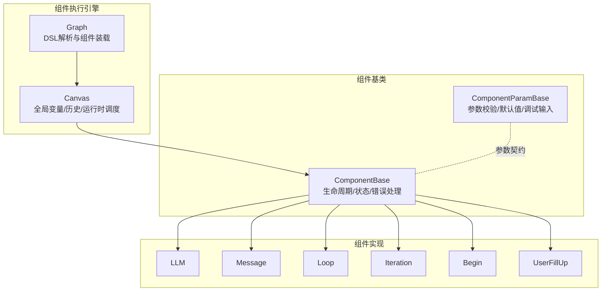
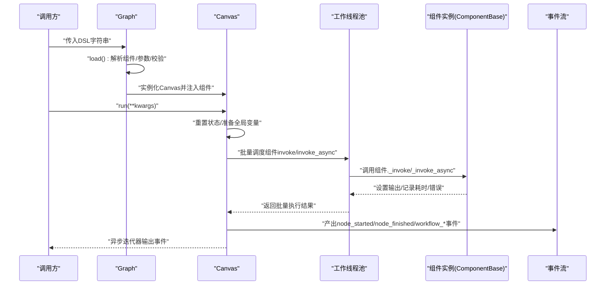
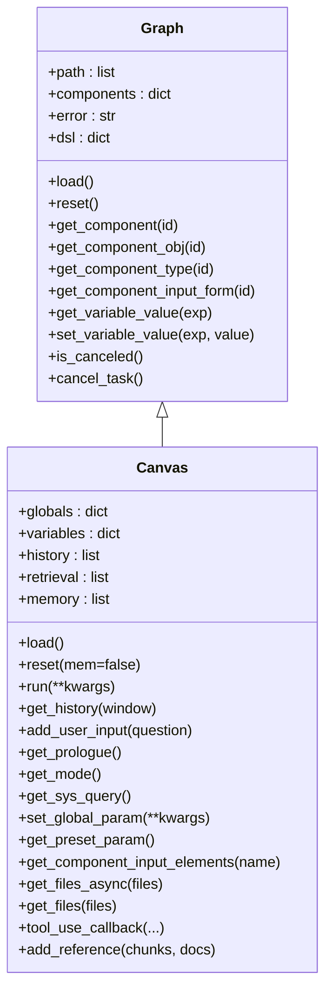
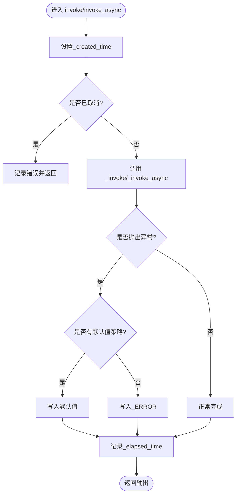
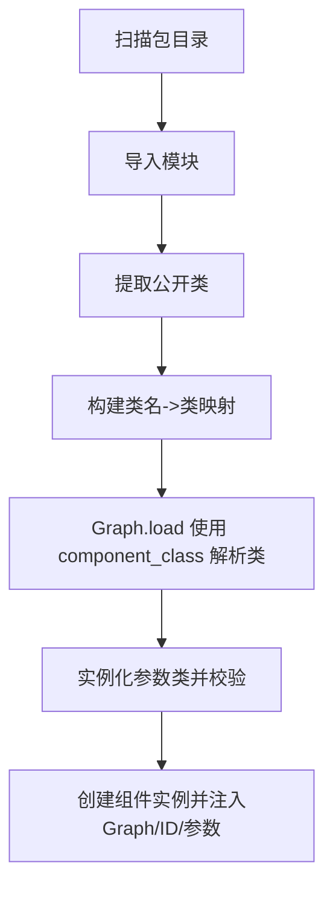
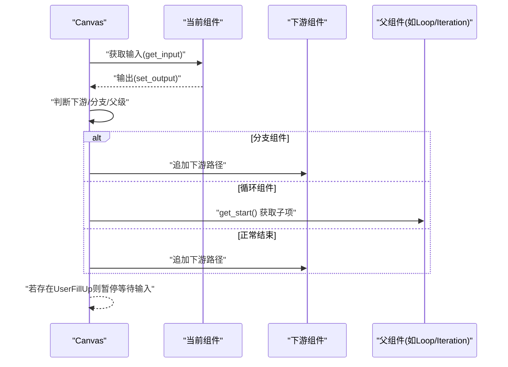
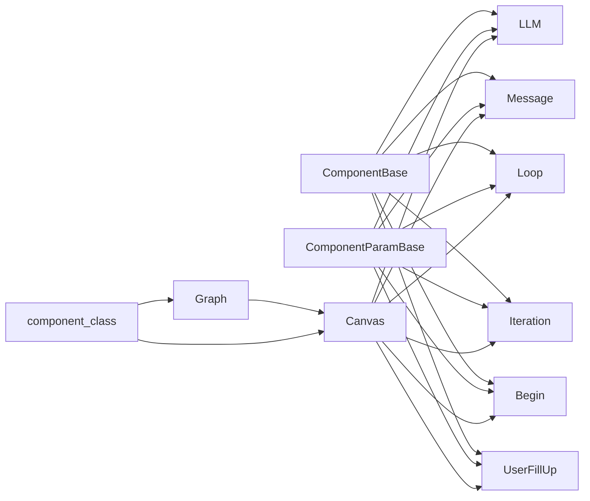

# 组件管理系统

<cite>
**本文引用的文件**
- [agent/canvas.py](file://agent/canvas.py)
- [agent/component/base.py](file://agent/component/base.py)
- [agent/component/__init__.py](file://agent/component/__init__.py)
- [agent/component/llm.py](file://agent/component/llm.py)
- [agent/component/message.py](file://agent/component/message.py)
- [agent/component/loop.py](file://agent/component/loop.py)
- [agent/component/iteration.py](file://agent/component/iteration.py)
- [agent/component/fillup.py](file://agent/component/fillup.py)
- [agent/component/begin.py](file://agent/component/begin.py)
- [agent/settings.py](file://agent/settings.py)
</cite>

## 目录
1. [简介](#简介)
2. [项目结构](#项目结构)
3. [核心组件](#核心组件)
4. [架构总览](#架构总览)
5. [详细组件分析](#详细组件分析)
6. [依赖关系分析](#依赖关系分析)
7. [性能考量](#性能考量)
8. [故障排查指南](#故障排查指南)
9. [结论](#结论)
10. [附录：组件开发与调试指南](#附录组件开发与调试指南)

## 简介
本文件系统性梳理组件管理系统的架构与实现，重点围绕以下主题展开：
- Graph 基类与 Canvas 的设计模式与职责边界
- ComponentBase 抽象基类的生命周期管理、状态存储与错误处理机制
- 组件注册与动态类加载（component_class 映射表）
- 组件间依赖关系管理（上游/下游追踪、执行顺序控制、数据传递）
- 组件状态管理（输入输出缓冲、错误状态记录、异常处理）
- 自定义组件开发规范与最佳实践
- 组件调试方法与性能监控要点

## 项目结构
组件管理位于 agent 子模块中，核心由“图执行引擎 + 组件基类 + 具体组件实现”三层构成：
- 图执行层：Graph/Canvas 负责解析 DSL、构建组件实例、调度执行、维护全局变量与历史、事件流式输出
- 组件基类层：ComponentBase 定义统一的生命周期、输入输出、错误处理、并发与超时控制
- 组件实现层：具体组件（如 LLM、Message、Loop、Iteration、Begin 等）继承基类并实现业务逻辑

图表来源
- [agent/canvas.py:81-146](file://agent/canvas.py#L81-L146)
- [agent/component/base.py:365-585](file://agent/component/base.py#L365-L585)
- [agent/component/llm.py:82-352](file://agent/component/llm.py#L82-L352)
- [agent/component/message.py:61-441](file://agent/component/message.py#L61-L441)
- [agent/component/loop.py:43-80](file://agent/component/loop.py#L43-L80)
- [agent/component/iteration.py:49-72](file://agent/component/iteration.py#L49-L72)
- [agent/component/begin.py:37-60](file://agent/component/begin.py#L37-L60)
- [agent/component/fillup.py:35-78](file://agent/component/fillup.py#L35-L78)

章节来源
- [agent/canvas.py:81-146](file://agent/canvas.py#L81-L146)
- [agent/component/base.py:365-585](file://agent/component/base.py#L365-L585)

## 核心组件
- Graph：负责从 DSL 加载组件、参数校验、实例化、路径规划、重置与序列化；提供变量解析与全局/环境变量存取能力
- Canvas：在 Graph 基础上扩展全局变量、历史、检索结果、记忆体等运行期状态，并提供异步执行主循环
- ComponentBase：统一组件生命周期（初始化、调用、重置、销毁）、输入输出缓冲、错误记录、异常分支跳转、并发与超时控制
- ComponentParamBase：参数对象的通用基类，支持嵌套更新、参数校验、调试输入、JSON 序列化等

章节来源
- [agent/canvas.py:81-146](file://agent/canvas.py#L81-L146)
- [agent/canvas.py:279-656](file://agent/canvas.py#L279-L656)
- [agent/component/base.py:365-585](file://agent/component/base.py#L365-L585)
- [agent/component/base.py:40-200](file://agent/component/base.py#L40-L200)

## 架构总览
下图展示从 DSL 到组件执行、再到事件输出的完整流程。

图表来源
- [agent/canvas.py:367-656](file://agent/canvas.py#L367-L656)
- [agent/component/base.py:407-447](file://agent/component/base.py#L407-L447)

章节来源
- [agent/canvas.py:367-656](file://agent/canvas.py#L367-L656)
- [agent/component/base.py:407-447](file://agent/component/base.py#L407-L447)

## 详细组件分析

### Graph 基类与 Canvas 设计模式
- 职责分离：Graph 负责“静态装配”，Canvas 负责“动态运行时”
- 组件装载：通过 component_class 动态解析组件类名并实例化，随后对参数进行校验
- 变量系统：支持 sys.env 变量与跨组件变量引用（表达式解析），并提供路径推进与分支控制
- 重置与持久化：重置时清理输出、日志键与取消标记；序列化时仅保留必要字段

图表来源
- [agent/canvas.py:40-146](file://agent/canvas.py#L40-L146)
- [agent/canvas.py:279-321](file://agent/canvas.py#L279-L321)

章节来源
- [agent/canvas.py:40-146](file://agent/canvas.py#L40-L146)
- [agent/canvas.py:279-321](file://agent/canvas.py#L279-L321)

### ComponentBase 抽象基类与生命周期
- 初始化：构造函数接收 Graph、组件ID、参数对象，立即触发参数校验
- 调用链：
  - 同步 invoke：记录开始时间、调用 _invoke、捕获异常、写入错误或结果、记录耗时
  - 异步 invoke_async：优先尝试 _invoke_async 或 _invoke 的协程版本，统一错误与耗时处理
- 重置：清空输出（可选保留输入）并清理调试输入
- 销毁：Canvas.reset 会逐个调用组件 reset；组件内部不持有长连接资源时无需额外清理
- 并发与超时：使用信号量限制并发，使用装饰器设置组件执行超时
- 错误处理：支持异常分支 goto 与默认值回退（exception_handler）

图表来源
- [agent/component/base.py:407-447](file://agent/component/base.py#L407-L447)
- [agent/component/base.py:466-477](file://agent/component/base.py#L466-L477)
- [agent/component/base.py:567-582](file://agent/component/base.py#L567-L582)

章节来源
- [agent/component/base.py:384-447](file://agent/component/base.py#L384-L447)
- [agent/component/base.py:466-477](file://agent/component/base.py#L466-L477)
- [agent/component/base.py:567-582](file://agent/component/base.py#L567-L582)

### 组件注册机制与动态类加载
- component_class 映射表：在 agent/component/__init__.py 中扫描 agent.component、agent.tools、rag.flow 三个包，收集所有公开类并建立名称到类的映射
- Graph.load 使用 component_class 按组件名动态解析类与参数类，实例化组件并执行参数校验
- 优点：零耦合扩展新组件，遵循约定优于配置

图表来源
- [agent/component/__init__.py:25-59](file://agent/component/__init__.py#L25-L59)
- [agent/canvas.py:91-104](file://agent/canvas.py#L91-L104)

章节来源
- [agent/component/__init__.py:25-59](file://agent/component/__init__.py#L25-L59)
- [agent/canvas.py:91-104](file://agent/canvas.py#L91-L104)

### 组件间依赖关系管理
- 上游/下游追踪：每个组件在 DSL 中记录 upstream/downstream，Canvas 在执行时据此推进路径
- 执行顺序控制：按 path 列表顺序推进，遇到分支组件（如 Categorize/Switch/Loop/Iteration）根据输出选择下一跳
- 数据传递机制：通过变量表达式（sys.env.变量或 A@outputKey）在组件间传递输出；Canvas 提供 get/set 变量值与路径解析
- 特殊节点：
  - Loop/Iteration：通过 get_start 查找子项（LoopItem/IterationItem）作为循环起点
  - ExitLoop：当条件满足时跳过子项直接进入下游
  - UserFillUp：插入用户交互，等待外部输入后继续

图表来源
- [agent/canvas.py:481-636](file://agent/canvas.py#L481-L636)
- [agent/component/loop.py:46-51](file://agent/component/loop.py#L46-L51)
- [agent/component/iteration.py:52-57](file://agent/component/iteration.py#L52-L57)

章节来源
- [agent/canvas.py:481-636](file://agent/canvas.py#L481-L636)
- [agent/component/loop.py:46-51](file://agent/component/loop.py#L46-L51)
- [agent/component/iteration.py:52-57](file://agent/component/iteration.py#L52-L57)

### 组件状态管理
- 输入输出缓冲：ComponentParamBase 的 inputs/outputs 字典保存每次执行的输入/输出与类型信息
- 错误状态记录：统一以 _ERROR 键存放异常文本；支持异常分支 goto 与默认值回填
- 取消与中断：Canvas.is_canceled 通过 Redis 键检查任务取消；组件在关键点调用 check_if_canceled 记录并短路
- 运行时元数据：_created_time、_elapsed_time 用于事件统计与调试

章节来源
- [agent/component/base.py:453-465](file://agent/component/base.py#L453-L465)
- [agent/component/base.py:466-477](file://agent/component/base.py#L466-L477)
- [agent/component/base.py:393-405](file://agent/component/base.py#L393-L405)
- [agent/canvas.py:267-276](file://agent/canvas.py#L267-L276)

### 典型组件实现剖析

#### LLM 组件
- 参数校验：温度、惩罚项、最大tokens、提示词非空等
- 提示词准备：从 sys_prompt 与 prompts 中抽取变量，拼接历史消息，支持引用检索结果
- 流式输出：当下游为 Message 且未设置分支 goto 时，返回 partial 流式生成器
- 结构化输出：支持 JSON Schema 输出，失败自动重试并清洗修复
- 超时与并发：组件执行超时装饰器，LLM 服务层并发控制

章节来源
- [agent/component/llm.py:33-80](file://agent/component/llm.py#L33-L80)
- [agent/component/llm.py:117-157](file://agent/component/llm.py#L117-L157)
- [agent/component/llm.py:264-342](file://agent/component/llm.py#L264-L342)

#### Message 组件
- 内容渲染：支持 Jinja2 模板与变量替换；若启用流式且无模板，则返回 partial 流式生成
- 内容转换：支持 markdown/html/pdf/docx/xlsx 转换并上传存储
- 记忆体保存：可选将对话内容入库存储

章节来源
- [agent/component/message.py:39-59](file://agent/component/message.py#L39-L59)
- [agent/component/message.py:179-205](file://agent/component/message.py#L179-L205)
- [agent/component/message.py:251-428](file://agent/component/message.py#L251-L428)

#### Loop/Iteration 组件
- Loop：根据 loop_variables 将上游变量或常量写入当前输出，作为循环输入
- Iteration：从 items_ref 引用数组，驱动子项（IterationItem）逐项处理

章节来源
- [agent/component/loop.py:20-41](file://agent/component/loop.py#L20-L41)
- [agent/component/loop.py:53-77](file://agent/component/loop.py#L53-L77)
- [agent/component/iteration.py:27-47](file://agent/component/iteration.py#L27-L47)
- [agent/component/iteration.py:59-68](file://agent/component/iteration.py#L59-L68)

#### Begin/UserFillUp 组件
- Begin：根据 mode（会话/任务/Webhook）预置提示词与输入；支持文件输入解析
- UserFillUp：根据输入表单生成提示语并等待用户输入，再回填到输出

章节来源
- [agent/component/begin.py:20-35](file://agent/component/begin.py#L20-L35)
- [agent/component/begin.py:40-60](file://agent/component/begin.py#L40-L60)
- [agent/component/fillup.py:24-33](file://agent/component/fillup.py#L24-L33)
- [agent/component/fillup.py:38-75](file://agent/component/fillup.py#L38-L75)

## 依赖关系分析
- 组件与参数：每个组件均依赖 ComponentBase 与对应 ComponentParamBase 子类
- Canvas 与 Graph：Canvas 继承 Graph，扩展运行时状态与异步执行
- 动态加载：Graph.load 依赖 component_class；component_class 依赖 agent/component 包扫描
- 外部集成：LLM 组件依赖 LLMBundle/TenantLLMService；Message 组件依赖 pypandoc、存储实现；Canvas 依赖 Redis 与文件服务

图表来源
- [agent/component/base.py:365-585](file://agent/component/base.py#L365-L585)
- [agent/canvas.py:40-146](file://agent/canvas.py#L40-L146)
- [agent/component/__init__.py:51-59](file://agent/component/__init__.py#L51-L59)

章节来源
- [agent/component/base.py:365-585](file://agent/component/base.py#L365-L585)
- [agent/canvas.py:40-146](file://agent/canvas.py#L40-L146)
- [agent/component/__init__.py:51-59](file://agent/component/__init__.py#L51-L59)

## 性能考量
- 并发控制：组件级信号量限制并发数，默认来自环境变量；线程池用于同步阻塞调用
- 超时控制：组件执行超时装饰器，避免长时间阻塞；Canvas.run 中对批量执行也做取消检查
- 流式输出：Message/LLM 支持 partial 流式生成，降低首帧延迟
- 缓冲与序列化：参数对象支持 DataFrame 转字典，避免复杂对象频繁序列化开销
- 日志与取消：Redis 键用于快速检测取消；日志键在重置时清理，避免累积

章节来源
- [agent/component/base.py:367-368](file://agent/component/base.py#L367-L368)
- [agent/component/base.py:449-451](file://agent/component/base.py#L449-L451)
- [agent/canvas.py:88](file://agent/canvas.py#L88)
- [agent/canvas.py:420-464](file://agent/canvas.py#L420-L464)

## 故障排查指南
- 任务被取消：Canvas.is_canceled 检测到取消后抛出异常；组件在关键点调用 check_if_canceled 记录错误并返回
- 参数校验失败：ComponentParamBase.check 与 validate 规则不匹配导致异常；检查参数 JSON 与校验规则文件
- 变量引用错误：表达式格式不正确或目标组件不存在；使用 get_variable_value 前先确认上游已执行
- LLM 输出异常：结构化输出解析失败会重试并清洗；若仍失败，查看 _ERROR 输出
- 流式输出卡住：检查下游组件是否消费 partial；确认线程池与事件循环状态
- 工具调用追踪：Canvas.tool_use_callback 将工具调用链路写入 Redis，便于定位问题

章节来源
- [agent/canvas.py:267-276](file://agent/canvas.py#L267-L276)
- [agent/component/base.py:567-582](file://agent/component/base.py#L567-L582)
- [agent/component/llm.py:280-306](file://agent/component/llm.py#L280-L306)
- [agent/canvas.py:770-793](file://agent/canvas.py#L770-L793)

## 结论
该组件管理系统通过 Graph/Canvas 的清晰分层、ComponentBase 的统一契约以及动态注册机制，实现了高内聚、低耦合的可扩展执行框架。其在并发控制、超时保护、流式输出与变量引用等方面提供了稳健的工程化能力，适合构建复杂的多组件协作工作流。

## 附录：组件开发与调试指南

### 自定义组件编写规范
- 继承关系
  - 组件类：继承 ComponentBase
  - 参数类：继承 ComponentParamBase，并实现 check 与（可选）get_input_form
- 生命周期
  - 在 __init__ 中完成必要的初始化（如服务客户端）
  - 实现 _invoke 或 _invoke_async；不要直接覆盖 invoke/invoke_async
  - 使用 set_output 设置输出；错误通过 _ERROR 键记录
- 参数校验
  - 在 check 中使用内置断言方法（如 check_empty/check_positive_number 等）
  - 如需复杂校验，可在 validate 中读取 JSON 规则文件
- 输入输出
  - 通过 get_input_elements_from_text 声明变量依赖
  - 使用 get_input/get_input_value 获取上游值；必要时调用 Canvas.get_variable_value
- 异常处理
  - 若需要异常分支 goto 或默认值，设置 exception_method/exception_goto/exception_default_value
- 并发与超时
  - 遵循默认并发限制；必要时在组件内自行限流
  - 超时由装饰器统一控制，避免阻塞

章节来源
- [agent/component/base.py:40-200](file://agent/component/base.py#L40-L200)
- [agent/component/base.py:384-447](file://agent/component/base.py#L384-L447)
- [agent/component/base.py:567-582](file://agent/component/base.py#L567-L582)

### 组件注册与动态加载
- 新增组件后无需修改 Graph.load；component_class 会自动扫描 agent.component、agent.tools、rag.flow
- 确保组件类名与参数类名符合约定（组件类名为 Xxx，参数类为 XxxParam），并在 __all__ 中导出

章节来源
- [agent/component/__init__.py:25-59](file://agent/component/__init__.py#L25-L59)
- [agent/canvas.py:91-104](file://agent/canvas.py#L91-L104)

### 组件调试方法
- 开启调试输入：在参数对象中设置 debug_inputs，使 get_input_values 返回调试输入
- 观察事件流：通过 Canvas.run 的事件迭代器查看 node_started/node_finished/workflow_* 事件
- 取消与重置：使用 cancel_task 触发取消；reset 清理输出与日志键
- 工具调用追踪：利用 tool_use_callback 的 Redis 日志键查看工具调用链路
- 性能指标：关注 _elapsed_time 与 _created_time，结合日志定位瓶颈

章节来源
- [agent/component/base.py:494-498](file://agent/component/base.py#L494-L498)
- [agent/canvas.py:367-656](file://agent/canvas.py#L367-L656)
- [agent/canvas.py:267-276](file://agent/canvas.py#L267-L276)
- [agent/canvas.py:770-793](file://agent/canvas.py#L770-L793)