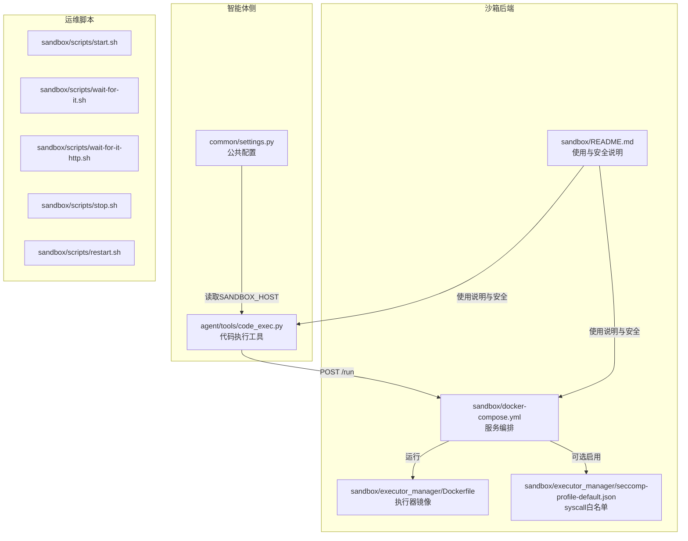
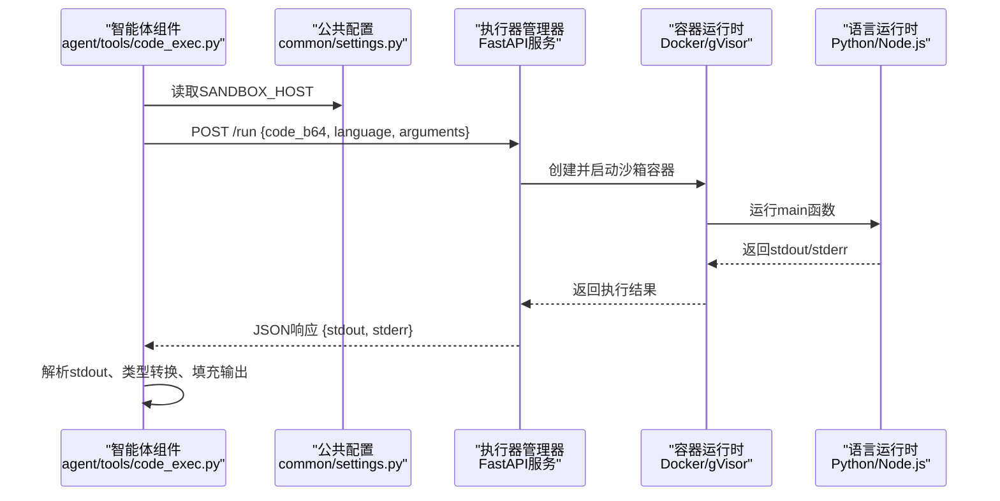
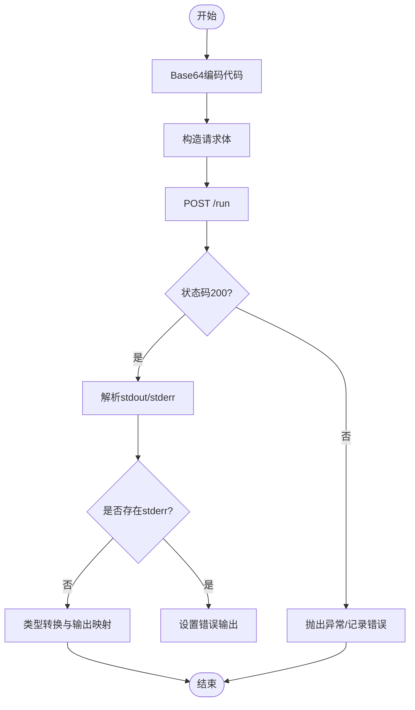
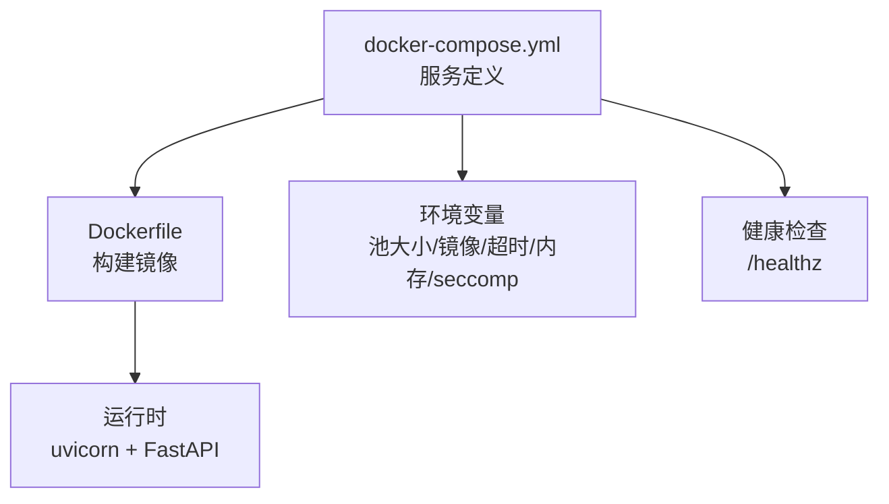
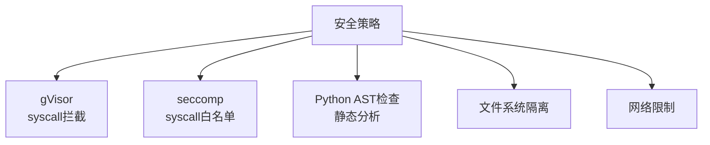
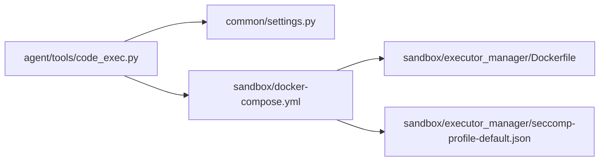

# 代码执行工具

<cite>
**本文引用的文件**
- [agent/tools/code_exec.py](file://agent/tools/code_exec.py)
- [common/settings.py](file://common/settings.py)
- [sandbox/README.md](file://sandbox/README.md)
- [sandbox/docker-compose.yml](file://sandbox/docker-compose.yml)
- [sandbox/executor_manager/Dockerfile](file://sandbox/executor_manager/Dockerfile)
- [sandbox/executor_manager/seccomp-profile-default.json](file://sandbox/executor_manager/seccomp-profile-default.json)
- [sandbox/scripts/start.sh](file://sandbox/scripts/start.sh)
- [sandbox/scripts/wait-for-it.sh](file://sandbox/scripts/wait-for-it.sh)
- [sandbox/scripts/wait-for-it-http.sh](file://sandbox/scripts/wait-for-it-http.sh)
- [sandbox/scripts/stop.sh](file://sandbox/scripts/stop.sh)
- [sandbox/scripts/restart.sh](file://sandbox/scripts/restart.sh)
</cite>

## 目录
1. [简介](#简介)
2. [项目结构](#项目结构)
3. [核心组件](#核心组件)
4. [架构总览](#架构总览)
5. [组件详解](#组件详解)
6. [依赖关系分析](#依赖关系分析)
7. [性能与资源限制](#性能与资源限制)
8. [安全与合规](#安全与合规)
9. [使用示例与最佳实践](#使用示例与最佳实践)
10. [故障排查指南](#故障排查指南)
11. [结论](#结论)

## 简介
本文件面向RAGFlow的“代码执行工具”，系统性阐述其沙箱执行系统的架构设计、安全隔离机制、语言支持、执行环境与资源限制策略，并提供在智能体中编写与调用代码片段的方法、超时与内存限制、输出解析与类型转换、以及安全使用建议与常见问题排查路径。目标是帮助开发者与运维人员正确、安全地使用代码执行能力。

## 项目结构
围绕代码执行工具，涉及以下关键位置：
- 智能体侧工具：负责参数校验、请求构造、调用沙箱服务、解析输出与错误。
- 公共配置：负责读取沙箱主机地址等运行时配置。
- 沙箱后端：包含执行器管理器（FastAPI服务）、容器编排（docker-compose）、安全配置（gVisor、seccomp）与基础镜像构建脚本。
- 启动与运维脚本：提供启动、等待、停止、重启与日志查看等便捷命令。

**图表来源**
- [agent/tools/code_exec.py:126-191](file://agent/tools/code_exec.py#L126-L191)
- [common/settings.py:325-328](file://common/settings.py#L325-L328)
- [sandbox/docker-compose.yml:1-33](file://sandbox/docker-compose.yml#L1-L33)
- [sandbox/executor_manager/Dockerfile:1-38](file://sandbox/executor_manager/Dockerfile#L1-L38)
- [sandbox/executor_manager/seccomp-profile-default.json:1-56](file://sandbox/executor_manager/seccomp-profile-default.json#L1-L56)
- [sandbox/README.md:139-179](file://sandbox/README.md#L139-L179)

**章节来源**
- [agent/tools/code_exec.py:126-191](file://agent/tools/code_exec.py#L126-L191)
- [common/settings.py:325-328](file://common/settings.py#L325-L328)
- [sandbox/docker-compose.yml:1-33](file://sandbox/docker-compose.yml#L1-L33)
- [sandbox/executor_manager/Dockerfile:1-38](file://sandbox/executor_manager/Dockerfile#L1-L38)
- [sandbox/executor_manager/seccomp-profile-default.json:1-56](file://sandbox/executor_manager/seccomp-profile-default.json#L1-L56)
- [sandbox/README.md:139-179](file://sandbox/README.md#L139-L179)

## 核心组件
- 代码执行工具（Agent Tool）
  - 负责参数校验、Base64编码、构造请求体、调用沙箱执行器、解析标准输出与错误、类型转换与输出映射。
  - 支持语言：Python、Node.js；要求代码入口函数名为 main。
  - 超时由环境变量控制，默认值来自组件执行超时配置。
- 执行器管理器（Executor Manager）
  - 基于FastAPI的HTTP服务，监听本地端口，接收执行请求，通过容器运行时执行代码。
  - 可配置容器池大小、基础镜像、最大内存、执行超时、是否启用seccomp等。
- 安全与隔离
  - 默认采用gVisor进行syscall级隔离；可选启用seccomp白名单限制系统调用；Python代码执行前进行AST静态检查。
- 运维与脚本
  - 提供一键构建、启动、测试、日志查看、清理等Makefile与脚本工具。

**章节来源**
- [agent/tools/code_exec.py:32-61](file://agent/tools/code_exec.py#L32-L61)
- [agent/tools/code_exec.py:126-191](file://agent/tools/code_exec.py#L126-L191)
- [sandbox/docker-compose.yml:16-29](file://sandbox/docker-compose.yml#L16-L29)
- [sandbox/README.md:139-179](file://sandbox/README.md#L139-L179)

## 架构总览
下图展示了从智能体到沙箱执行器的整体调用链路与隔离边界。

**图表来源**
- [agent/tools/code_exec.py:145-191](file://agent/tools/code_exec.py#L145-L191)
- [common/settings.py:325-328](file://common/settings.py#L325-L328)
- [sandbox/docker-compose.yml:9-10](file://sandbox/docker-compose.yml#L9-L10)

## 组件详解

### 智能体侧：代码执行工具
- 参数与请求模型
  - 语言枚举：python、nodejs；自动归一化输入。
  - 请求体字段：Base64编码的代码字符串、语言、参数字典。
- 调用流程
  - 编码代码为Base64，构造请求体，向执行器管理器发起HTTP请求。
  - 解析响应：若存在stderr则作为错误输出；否则尝试解析stdout为JSON或字面量，再按输出模式填充。
- 输出处理
  - 支持字典、列表、标量三种输出形态；支持路径提取与类型强制转换（字符串、数字、布尔、数组、对象）。
- 超时控制
  - 使用装饰器对调用过程设置超时，超时时间来自环境变量。

**图表来源**
- [agent/tools/code_exec.py:145-191](file://agent/tools/code_exec.py#L145-L191)
- [agent/tools/code_exec.py:199-321](file://agent/tools/code_exec.py#L199-L321)

**章节来源**
- [agent/tools/code_exec.py:32-61](file://agent/tools/code_exec.py#L32-L61)
- [agent/tools/code_exec.py:126-191](file://agent/tools/code_exec.py#L126-L191)
- [agent/tools/code_exec.py:199-321](file://agent/tools/code_exec.py#L199-L321)

### 执行器管理器与容器编排
- 服务定义
  - 端口映射：默认暴露9385端口。
  - 权限与安全：privileged为true，禁用新权限提升；挂载Docker Socket以便动态创建沙箱容器。
  - 环境变量：容器池大小、基础镜像名、是否启用seccomp、最大内存、执行超时。
  - 健康检查：对本地9385端口进行轮询健康检查。
- 镜像构建
  - 固定Python基础镜像，安装curl/gcc，下载指定版本Docker CLI以适配宿主Docker API。
  - 使用uv进行依赖安装，启动uvicorn服务监听9385端口。

**图表来源**
- [sandbox/docker-compose.yml:1-33](file://sandbox/docker-compose.yml#L1-L33)
- [sandbox/executor_manager/Dockerfile:1-38](file://sandbox/executor_manager/Dockerfile#L1-L38)

**章节来源**
- [sandbox/docker-compose.yml:16-29](file://sandbox/docker-compose.yml#L16-L29)
- [sandbox/executor_manager/Dockerfile:29-37](file://sandbox/executor_manager/Dockerfile#L29-L37)

### 安全与隔离策略
- gVisor隔离
  - 通过用户态内核拦截并限制系统调用，降低逃逸与提权风险。
- seccomp白名单
  - 可选启用，默认关闭；仅允许预定义的系统调用集合，进一步收紧容器行为。
- Python AST静态检查
  - 在执行前对Python代码进行静态分析，拒绝潜在高危操作（如文件读写、子进程等）。
- 网络与文件系统
  - 默认不开放外部网络访问；容器内文件系统隔离；可通过seccomp进一步限制文件操作。

**图表来源**
- [sandbox/README.md:139-179](file://sandbox/README.md#L139-L179)
- [sandbox/executor_manager/seccomp-profile-default.json:1-56](file://sandbox/executor_manager/seccomp-profile-default.json#L1-L56)

**章节来源**
- [sandbox/README.md:139-179](file://sandbox/README.md#L139-L179)
- [sandbox/executor_manager/seccomp-profile-default.json:1-56](file://sandbox/executor_manager/seccomp-profile-default.json#L1-L56)

### 运维与脚本工具
- 启动/停止/重启：提供start.sh、stop.sh、restart.sh，便于快速启停服务。
- 等待脚本：wait-for-it.sh与wait-for-it-http.sh用于等待依赖服务就绪。
- 日志查看：通过logs命令流式查看容器日志，便于排障。

**章节来源**
- [sandbox/scripts/start.sh](file://sandbox/scripts/start.sh)
- [sandbox/scripts/stop.sh](file://sandbox/scripts/stop.sh)
- [sandbox/scripts/restart.sh](file://sandbox/scripts/restart.sh)
- [sandbox/scripts/wait-for-it.sh](file://sandbox/scripts/wait-for-it.sh)
- [sandbox/scripts/wait-for-it-http.sh](file://sandbox/scripts/wait-for-it-http.sh)

## 依赖关系分析
- 智能体工具依赖公共配置模块读取沙箱主机地址。
- 执行器管理器依赖Docker运行时与gVisor；可选依赖seccomp配置。
- Python运行时依赖Python基础镜像；Node.js依赖Node.js基础镜像。

**图表来源**
- [agent/tools/code_exec.py:126-191](file://agent/tools/code_exec.py#L126-L191)
- [common/settings.py:325-328](file://common/settings.py#L325-L328)
- [sandbox/docker-compose.yml:1-33](file://sandbox/docker-compose.yml#L1-L33)
- [sandbox/executor_manager/Dockerfile:1-38](file://sandbox/executor_manager/Dockerfile#L1-L38)
- [sandbox/executor_manager/seccomp-profile-default.json:1-56](file://sandbox/executor_manager/seccomp-profile-default.json#L1-L56)

**章节来源**
- [agent/tools/code_exec.py:126-191](file://agent/tools/code_exec.py#L126-L191)
- [common/settings.py:325-328](file://common/settings.py#L325-L328)
- [sandbox/docker-compose.yml:1-33](file://sandbox/docker-compose.yml#L1-L33)
- [sandbox/executor_manager/Dockerfile:1-38](file://sandbox/executor_manager/Dockerfile#L1-L38)
- [sandbox/executor_manager/seccomp-profile-default.json:1-56](file://sandbox/executor_manager/seccomp-profile-default.json#L1-L56)

## 性能与资源限制
- 超时设置
  - 执行器管理器：通过环境变量配置执行超时（如10秒），避免长时间占用容器资源。
  - 智能体侧：组件执行超时同样受环境变量控制，确保整体流程不会无限等待。
- 内存限制
  - 通过环境变量设置容器最大内存（如256m），防止内存泄漏导致主机压力。
- 并发与容器池
  - 通过容器池大小参数控制并发度，避免过多容器同时运行造成资源争用。
- I/O与网络
  - 默认不开放外网；如需网络访问，应评估风险并结合seccomp策略严格限制。

**章节来源**
- [sandbox/docker-compose.yml:19-24](file://sandbox/docker-compose.yml#L19-L24)
- [agent/tools/code_exec.py:129](file://agent/tools/code_exec.py#L129)

## 安全与合规
- 默认隔离
  - gVisor提供syscall级隔离，显著降低逃逸与提权风险。
- 可选强化
  - 启用seccomp白名单，仅允许必要系统调用，进一步收紧容器行为。
- 语言侧安全
  - Python代码执行前进行AST静态检查，拒绝高危语法与操作。
- 最佳实践
  - 不在生产环境启用seccomp除非明确需要；保持基础镜像更新；最小权限原则；定期审计日志。

**章节来源**
- [sandbox/README.md:139-179](file://sandbox/README.md#L139-L179)

## 使用示例与最佳实践
- 支持的语言与格式
  - Python：必须包含main函数，返回字典或可序列化对象。
  - Node.js：导出main函数，支持同步与异步。
- 在智能体中使用
  - 设置语言与脚本内容；传入参数字典；根据输出模式映射结果。
- 超时与内存
  - 合理设置超时与内存上限，避免长时间占用资源。
- 输出解析
  - 支持JSON与字面量两种stdout解析方式；可按路径提取嵌套字段；支持类型强制转换。
- 安全建议
  - 仅执行可信代码；避免文件系统与网络访问；必要时启用seccomp白名单。

**章节来源**
- [agent/tools/code_exec.py:63-114](file://agent/tools/code_exec.py#L63-L114)
- [agent/tools/code_exec.py:199-321](file://agent/tools/code_exec.py#L199-L321)
- [sandbox/README.md:221-253](file://sandbox/README.md#L221-L253)

## 故障排查指南
- gVisor未正确安装或不可用
  - 现象：连接超时或未知运行时。
  - 处理：确认gVisor安装与Docker重启；使用runsc测试hello-world。
- hosts映射缺失
  - 现象：无法解析沙箱主机名。
  - 处理：在/etc/hosts中添加映射条目。
- Docker客户端版本过旧
  - 现象：提示客户端版本过低。
  - 处理：拉取最新执行器镜像或重新构建。
- 基础镜像未拉取
  - 现象：容器启动超时或runner未就绪。
  - 处理：拉取Python与Node.js基础镜像。
- 服务未重启生效
  - 现象：修改配置后仍使用旧值。
  - 处理：完整重启服务使配置生效。
- 容器池繁忙
  - 现象：任务排队或失败。
  - 处理：增大容器池大小或减少并发。

**章节来源**
- [sandbox/README.md:256-344](file://sandbox/README.md#L256-L344)

## 结论
RAGFlow的代码执行工具通过“智能体侧工具 + 执行器管理器 + 容器隔离”的组合，提供了安全、可控且易扩展的代码执行能力。默认采用gVisor隔离与Python AST静态检查，在满足可用性的前提下兼顾安全性；可选启用seccomp白名单进一步收紧系统调用。通过合理的超时与内存限制、输出解析与类型转换机制，以及完善的运维脚本与故障排查指引，能够帮助用户在保证安全的前提下高效使用代码执行功能。