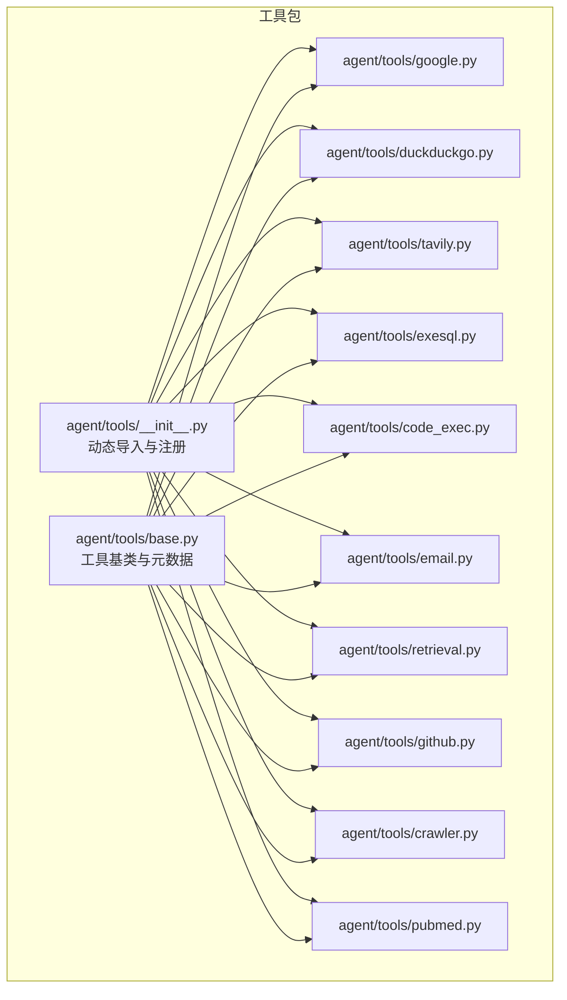
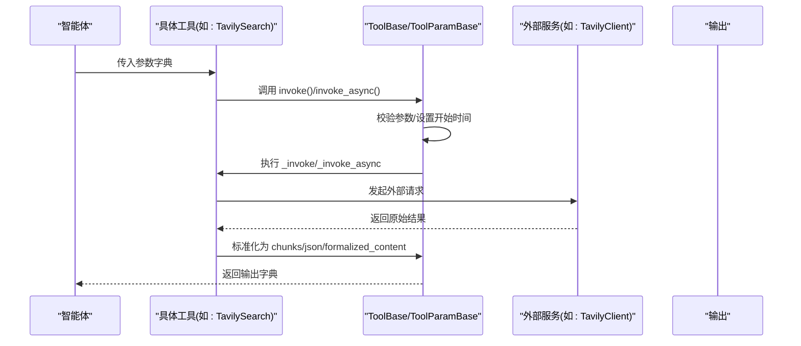
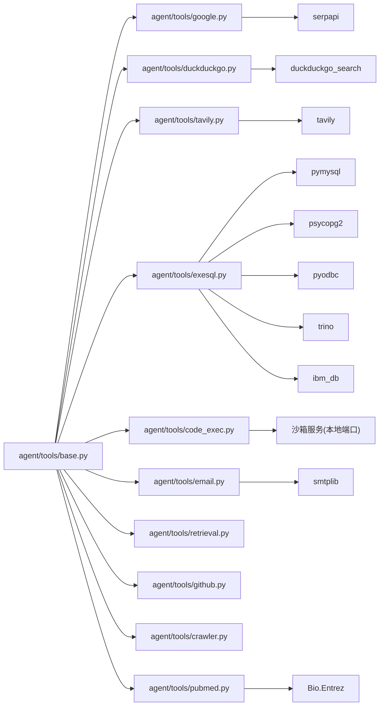

# 内置工具

<cite>
**本文引用的文件**
- [agent/tools/__init__.py](file://agent/tools/__init__.py)
- [agent/tools/base.py](file://agent/tools/base.py)
- [agent/tools/google.py](file://agent/tools/google.py)
- [agent/tools/duckduckgo.py](file://agent/tools/duckduckgo.py)
- [agent/tools/tavily.py](file://agent/tools/tavily.py)
- [agent/tools/exesql.py](file://agent/tools/exesql.py)
- [agent/tools/code_exec.py](file://agent/tools/code_exec.py)
- [agent/tools/email.py](file://agent/tools/email.py)
- [agent/tools/retrieval.py](file://agent/tools/retrieval.py)
- [agent/tools/github.py](file://agent/tools/github.py)
- [agent/tools/crawler.py](file://agent/tools/crawler.py)
- [agent/tools/pubmed.py](file://agent/tools/pubmed.py)
</cite>

## 目录
1. [简介](#简介)
2. [项目结构](#项目结构)
3. [核心组件](#核心组件)
4. [架构总览](#架构总览)
5. [详细组件分析](#详细组件分析)
6. [依赖关系分析](#依赖关系分析)
7. [性能与适用性](#性能与适用性)
8. [故障排查指南](#故障排查指南)
9. [结论](#结论)
10. [附录](#附录)

## 简介
本文件系统化梳理 RAGFlow 的内置工具体系，覆盖搜索引擎（Google、DuckDuckGo、Tavily）、数据库查询、代码执行、邮件发送、知识库检索、网页抓取、学术文献检索等工具。内容包括：
- 工具功能与使用场景
- 参数定义与输入表单
- 返回值格式与输出键
- 错误处理与重试策略
- 调用流程与性能特征
- 版本兼容与依赖要求

## 项目结构
内置工具集中于 agent/tools 目录，采用“按功能模块拆分”的组织方式，每个工具以独立文件实现，统一继承自通用基类，遵循一致的元数据与参数规范。

图表来源
- [agent/tools/__init__.py:1-48](file://agent/tools/__init__.py#L1-L48)
- [agent/tools/base.py:126-216](file://agent/tools/base.py#L126-L216)

章节来源
- [agent/tools/__init__.py:1-48](file://agent/tools/__init__.py#L1-L48)
- [agent/tools/base.py:126-216](file://agent/tools/base.py#L126-L216)

## 核心组件
- 工具元数据与参数
  - ToolMeta：定义工具名称、显示名、描述、参数字典
  - ToolParameter：参数类型、描述、是否必填、枚举值等
  - ToolParamBase：从 meta 构造 inputs、默认值与校验；生成 OpenAI 函数调用函数模式
- 工具基类
  - ToolBase：统一的 invoke/invoke_async 生命周期、取消检测、异常捕获、输出写入、耗时统计
  - LLMToolPluginCallSession：适配异步工具调用与 MCP 工具会话
- 通用检索封装
  - _retrieve_chunks：将外部结果标准化为内部块结构并注入引用与格式化内容

章节来源
- [agent/tools/base.py:34-48](file://agent/tools/base.py#L34-L48)
- [agent/tools/base.py:77-124](file://agent/tools/base.py#L77-L124)
- [agent/tools/base.py:126-181](file://agent/tools/base.py#L126-L181)
- [agent/tools/base.py:182-213](file://agent/tools/base.py#L182-L213)

## 架构总览
工具调用链路概览如下：

图表来源
- [agent/tools/base.py:139-181](file://agent/tools/base.py#L139-L181)
- [agent/tools/tavily.py:104-147](file://agent/tools/tavily.py#L104-L147)

## 详细组件分析

### 搜索引擎工具

#### Google 搜索
- 功能特性
  - 基于 SerpApi 的 Google 引擎搜索
  - 支持国家/语言区域化、分页与结果数量控制
- 关键参数
  - q: 查询关键词（必填）
  - start: 结果偏移（可选，默认 0）
  - num: 每页结果数（可选，默认 6）
  - api_key: SerpApi 密钥（必填）
  - country/language: 区域与语言（必填）
- 输出
  - json: 原始结果列表
  - formalized_content: 格式化后的检索片段
- 错误处理
  - 校验 api_key 与区域/语言枚举
  - 失败时记录异常并按退避策略重试
- 使用示例
  - 在智能体中传入 q 与 api_key，自动获取 topN 检索结果并注入引用

章节来源
- [agent/tools/google.py:25-61](file://agent/tools/google.py#L25-L61)
- [agent/tools/google.py:116-167](file://agent/tools/google.py#L116-L167)

#### DuckDuckGo 搜索
- 功能特性
  - 文本与新闻两类频道；支持隐私优先的搜索体验
- 关键参数
  - query: 查询关键词（必填）
  - channel: text 或 news（可选，默认 general）
  - top_n: 结果上限（可选，默认 10）
- 输出
  - json: 原始结果列表
  - formalized_content: 格式化后的检索片段
- 使用示例
  - 通过 channel 控制新闻或综合搜索；top_n 控制召回规模

章节来源
- [agent/tools/duckduckgo.py:25-57](file://agent/tools/duckduckgo.py#L25-L57)
- [agent/tools/duckduckgo.py:73-137](file://agent/tools/duckduckgo.py#L73-L137)

#### Tavily 搜索与提取
- 搜索工具
  - 支持主题（general/news）、域名白/黑名单、答案与原始内容开关
  - 关键参数：query（必填）、topic、include_domains、exclude_domains、max_results、days、include_answer、include_raw_content、include_images、include_image_descriptions
  - 输出：json（results）、formalized_content（带权重排序）
- 提取工具
  - 从指定 URL 列表抽取页面内容，支持 basic/advanced 抽取深度与 markdown/text 输出格式
  - 关键参数：urls（必填）、extract_depth、format
  - 输出：json（results）

章节来源
- [agent/tools/tavily.py:25-92](file://agent/tools/tavily.py#L25-L92)
- [agent/tools/tavily.py:101-147](file://agent/tools/tavily.py#L101-L147)
- [agent/tools/tavily.py:156-202](file://agent/tools/tavily.py#L156-L202)
- [agent/tools/tavily.py:211-248](file://agent/tools/tavily.py#L211-L248)

### 数据库查询工具
- 工具名称：execute_sql
- 支持数据库类型：mysql、postgres、mariadb、mssql、IBM DB2、trino
- 关键参数
  - sql: 待执行 SQL（必填）
  - db_type、host、port、username、password、database、max_records
- 行为与输出
  - 将 SQL 拆分为多条语句依次执行，限制最大行数
  - 输出 json：每条语句的结果数组
  - 输出 formalized_content：Markdown 表格形式的汇总
- 安全与限制
  - 对特定数据库名与密码组合进行安全拦截
  - trino 需要额外依赖与 TLS/认证配置
- 使用示例
  - 在智能体中拼接变量后传入 sql，自动连接数据库并返回表格化结果

章节来源
- [agent/tools/exesql.py:28-77](file://agent/tools/exesql.py#L28-L77)
- [agent/tools/exesql.py:79-278](file://agent/tools/exesql.py#L79-L278)

### 代码执行工具
- 工具名称：execute_code
- 支持语言：python、nodejs
- 关键参数
  - lang: 语言（必填）
  - script: 必须包含 main 函数的源码（必填）
  - arguments: 传入参数映射（可选）
  - outputs: 预期输出键与类型（用于解析 stdout 并填充输出）
- 运行机制
  - 将脚本进行 base64 编码并通过本地沙箱服务接口提交执行
  - 解析 stdout，尝试 JSON/字面量解析，并按 outputs 类型强制转换
- 输出
  - 根据 outputs schema 填充多个输出键；若无 schema 则回退到原始 stdout
- 使用示例
  - 在智能体中传入 lang、script 与 arguments，等待沙箱返回结构化结果

章节来源
- [agent/tools/code_exec.py:63-124](file://agent/tools/code_exec.py#L63-L124)
- [agent/tools/code_exec.py:126-192](file://agent/tools/code_exec.py#L126-L192)
- [agent/tools/code_exec.py:199-344](file://agent/tools/code_exec.py#L199-L344)

### 邮件工具
- 工具名称：email
- 关键参数
  - to_email（必填）、cc_email（可选）、content（可选）、subject（可选）
  - smtp_server、smtp_port、email、password、sender_name（需配置）
- 行为与输出
  - 构造 HTML 邮件并发送；支持 CC；失败时记录错误并按退避策略重试
  - 输出 success（布尔）与 _ERROR（字符串）
- 使用示例
  - 在智能体中传入收件人、主题与正文，自动完成发送

章节来源
- [agent/tools/email.py:31-81](file://agent/tools/email.py#L31-L81)
- [agent/tools/email.py:99-223](file://agent/tools/email.py#L99-L223)

### 知识库检索工具
- 工具名称：search_my_dataset（别名 retrieval）
- 关键参数
  - query（必填）、similarity_threshold、keywords_similarity_weight、top_n、top_k、kb_ids、memory_ids、meta_data_filter、rerank_id、cross_languages、toc_enhance、use_kg、empty_response
- 行为与输出
  - 支持从知识库或记忆体检索；可结合元数据过滤、重排模型、目录增强与知识图谱增强
  - 输出 formalized_content（格式化文本）与 json（原始块）
- 使用示例
  - 在智能体中传入 query 与知识库 ID，获得高质量检索结果

章节来源
- [agent/tools/retrieval.py:36-83](file://agent/tools/retrieval.py#L36-L83)
- [agent/tools/retrieval.py:84-296](file://agent/tools/retrieval.py#L84-L296)

### 其他工具

#### GitHub 搜索
- 关键参数：query（必填）、top_n
- 输出：json（仓库列表）、formalized_content（格式化摘要）

章节来源
- [agent/tools/github.py:25-56](file://agent/tools/github.py#L25-L56)
- [agent/tools/github.py:57-101](file://agent/tools/github.py#L57-L101)

#### 网页抓取
- 关键参数：proxy（可选）、extract_type（html/markdown/content）
- 输出：根据 extract_type 返回对应格式的内容

章节来源
- [agent/tools/crawler.py:23-35](file://agent/tools/crawler.py#L23-L35)
- [agent/tools/crawler.py:37-75](file://agent/tools/crawler.py#L37-L75)

#### PubMed 检索
- 关键参数：query（必填）、top_n、email
- 输出：formalized_content（结构化参考信息）

章节来源
- [agent/tools/pubmed.py:27-68](file://agent/tools/pubmed.py#L27-L68)
- [agent/tools/pubmed.py:69-165](file://agent/tools/pubmed.py#L69-L165)

## 依赖关系分析

图表来源
- [agent/tools/google.py:20](file://agent/tools/google.py#L20)
- [agent/tools/duckduckgo.py:20](file://agent/tools/duckduckgo.py#L20)
- [agent/tools/tavily.py:20](file://agent/tools/tavily.py#L20)
- [agent/tools/exesql.py:20-24](file://agent/tools/exesql.py#L20-L24)
- [agent/tools/code_exec.py:27](file://agent/tools/code_exec.py#L27)
- [agent/tools/email.py:20-28](file://agent/tools/email.py#L20-L28)
- [agent/tools/pubmed.py:20](file://agent/tools/pubmed.py#L20)

章节来源
- [agent/tools/google.py:20-23](file://agent/tools/google.py#L20-L23)
- [agent/tools/duckduckgo.py:20-22](file://agent/tools/duckduckgo.py#L20-L22)
- [agent/tools/tavily.py:20-22](file://agent/tools/tavily.py#L20-L22)
- [agent/tools/exesql.py:20-24](file://agent/tools/exesql.py#L20-L24)
- [agent/tools/code_exec.py:27-29](file://agent/tools/code_exec.py#L27-L29)
- [agent/tools/email.py:20-28](file://agent/tools/email.py#L20-L28)
- [agent/tools/pubmed.py:20](file://agent/tools/pubmed.py#L20)

## 性能与适用性
- 搜索类工具
  - Google/DuckDuckGo/Tavily：受外部 API 延迟与配额影响；建议合理设置 num/top_n 与超时
  - Tavily 支持高级抽取与答案字段，适合需要强结构化结果的场景
- 数据库查询
  - MySQL/Postgres/SQLServer：注意 max_records 与 fetchmany 分页，避免大结果集阻塞
  - Trino/DB2 需要额外依赖与网络配置
- 代码执行
  - 沙箱执行有较长超时；确保 script 合理且输出可解析
- 邮件
  - SSL/TLS 与认证失败是常见错误；建议使用应用专用授权码
- 检索
  - 可结合 rerank、目录增强与知识图谱提升质量；注意向量化模型一致性

[本节为通用指导，无需列出章节来源]

## 故障排查指南
- 参数校验失败
  - 检查必填项与枚举值；参考各工具的 check() 实现
- 外部服务错误
  - Google：确认 api_key 与区域/语言参数
  - DuckDuckGo：确认频道与 top_n
  - Tavily：确认 API Key 与 topic/max_results/days
  - GitHub：确认网络可达与返回格式
  - PubMed：确认邮箱与网络
- 数据库连接失败
  - 检查主机、端口、用户名、密码与数据库名；Trino 需安装 trino 依赖并正确配置 TLS/认证
- 邮件发送失败
  - 检查 SMTP 地址、端口、授权码与发件人信息；关注认证与连接异常
- 代码执行失败
  - 确认沙箱服务可用、脚本包含 main、输出可被解析；查看 stderr

章节来源
- [agent/tools/google.py:62-97](file://agent/tools/google.py#L62-L97)
- [agent/tools/duckduckgo.py:54-57](file://agent/tools/duckduckgo.py#L54-L57)
- [agent/tools/tavily.py:87-92](file://agent/tools/tavily.py#L87-L92)
- [agent/tools/github.py:46-48](file://agent/tools/github.py#L46-L48)
- [agent/tools/pubmed.py:58-60](file://agent/tools/pubmed.py#L58-L60)
- [agent/tools/exesql.py:55-69](file://agent/tools/exesql.py#L55-L69)
- [agent/tools/email.py:74-80](file://agent/tools/email.py#L74-L80)
- [agent/tools/code_exec.py:115-118](file://agent/tools/code_exec.py#L115-L118)

## 结论
RAGFlow 的内置工具体系以统一的元数据与参数框架为基础，覆盖搜索、检索、数据库、代码执行、邮件与学术资源等多个领域。通过一致的生命周期管理与错误处理机制，工具可在智能体中稳定地串联使用，满足多样化业务需求。建议在生产环境中结合超时、重试与日志策略，确保工具链的可靠性与可观测性。

[本节为总结性内容，无需列出章节来源]

## 附录

### 工具清单与典型参数
- 搜索引擎
  - Google：q、start、num、api_key、country、language
  - DuckDuckGo：query、channel、top_n
  - Tavily：query、topic、include_domains、exclude_domains、max_results、days、include_answer、include_raw_content、include_images、include_image_descriptions
- 数据库
  - execute_sql：sql、db_type、host、port、username、password、database、max_records
- 代码执行
  - execute_code：lang、script、arguments、outputs
- 邮件
  - email：to_email、cc_email、content、subject、smtp_server、smtp_port、email、password、sender_name
- 检索
  - search_my_dataset：query、similarity_threshold、keywords_similarity_weight、top_n、top_k、kb_ids、memory_ids、meta_data_filter、rerank_id、cross_languages、toc_enhance、use_kg、empty_response
- 其他
  - GitHub：query、top_n
  - 网页抓取：proxy、extract_type
  - PubMed：query、top_n、email

章节来源
- [agent/tools/google.py:30-61](file://agent/tools/google.py#L30-L61)
- [agent/tools/duckduckgo.py:30-57](file://agent/tools/duckduckgo.py#L30-L57)
- [agent/tools/tavily.py:30-86](file://agent/tools/tavily.py#L30-L86)
- [agent/tools/exesql.py:33-63](file://agent/tools/exesql.py#L33-L63)
- [agent/tools/code_exec.py:68-114](file://agent/tools/code_exec.py#L68-L114)
- [agent/tools/email.py:35-73](file://agent/tools/email.py#L35-L73)
- [agent/tools/retrieval.py:41-70](file://agent/tools/retrieval.py#L41-L70)
- [agent/tools/github.py:30-45](file://agent/tools/github.py#L30-L45)
- [agent/tools/crawler.py:28-35](file://agent/tools/crawler.py#L28-L35)
- [agent/tools/pubmed.py:32-57](file://agent/tools/pubmed.py#L32-L57)