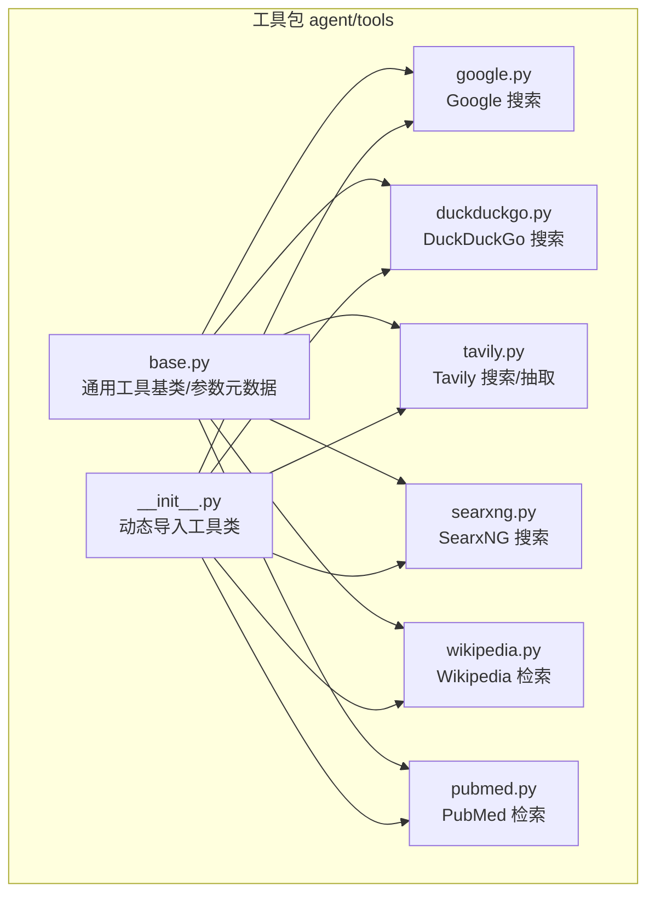
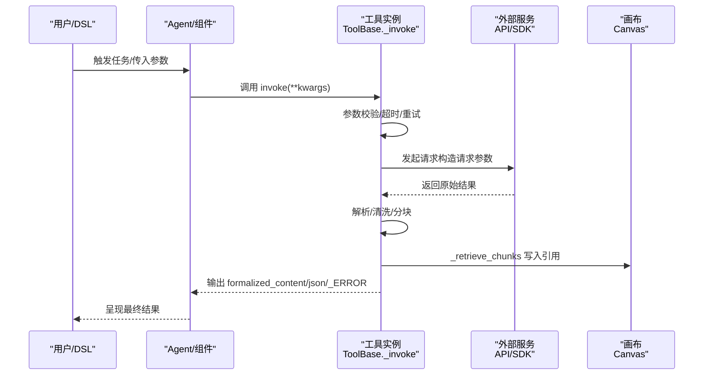
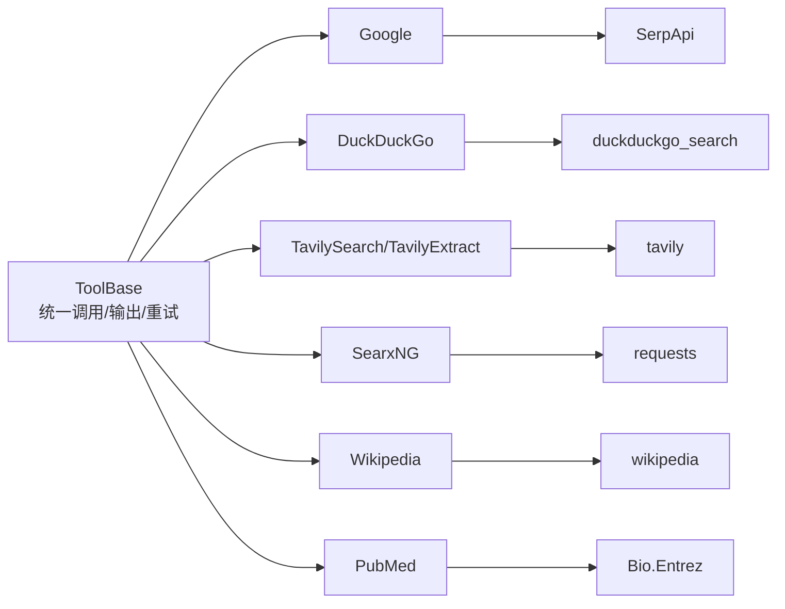

# 搜索引擎工具

<cite>
**本文档引用的文件**
- [agent/tools/google.py](file://agent/tools/google.py)
- [agent/tools/duckduckgo.py](file://agent/tools/duckduckgo.py)
- [agent/tools/tavily.py](file://agent/tools/tavily.py)
- [agent/tools/searxng.py](file://agent/tools/searxng.py)
- [agent/tools/wikipedia.py](file://agent/tools/wikipedia.py)
- [agent/tools/pubmed.py](file://agent/tools/pubmed.py)
- [agent/tools/base.py](file://agent/tools/base.py)
- [agent/tools/__init__.py](file://agent/tools/__init__.py)
- [agent/templates/web_search_assistant.json](file://agent/templates/web_search_assistant.json)
- [agent/templates/deep_research.json](file://agent/templates/deep_research.json)
- [agent/test/dsl_examples/tavily_and_generate.json](file://agent/test/dsl_examples/tavily_and_generate.json)
- [agent/test/dsl_examples/categorize_and_agent_with_tavily.json](file://agent/test/dsl_examples/categorize_and_agent_with_tavily.json)
</cite>

## 目录
1. [简介](#简介)
2. [项目结构](#项目结构)
3. [核心组件](#核心组件)
4. [架构总览](#架构总览)
5. [详细组件分析](#详细组件分析)
6. [依赖关系分析](#依赖关系分析)
7. [性能考量](#性能考量)
8. [故障排查指南](#故障排查指南)
9. [结论](#结论)
10. [附录](#附录)

## 简介
本文件系统性梳理 RAGFlow 提供的搜索引擎工具，覆盖以下能力：
- 常规网络搜索：Google、DuckDuckGo、SearxNG
- 专业检索增强：Tavily（搜索与抽取）
- 维基百科：Wikipedia
- 医学文献：PubMed

文档将从“参数定义、调用方法、返回值格式、错误处理、性能特征、适用场景”等维度展开，并通过模板与示例展示如何在智能体中配置与组合使用这些工具。

## 项目结构
搜索引擎工具位于 agent/tools 目录下，每个搜索引擎对应一个独立模块，统一继承自通用工具基类，遵循一致的参数元数据与调用协议。

图示来源
- [agent/tools/base.py](file://agent/tools/base.py)
- [agent/tools/google.py](file://agent/tools/google.py)
- [agent/tools/duckduckgo.py](file://agent/tools/duckduckgo.py)
- [agent/tools/tavily.py](file://agent/tools/tavily.py)
- [agent/tools/searxng.py](file://agent/tools/searxng.py)
- [agent/tools/wikipedia.py](file://agent/tools/wikipedia.py)
- [agent/tools/pubmed.py](file://agent/tools/pubmed.py)
- [agent/tools/__init__.py](file://agent/tools/__init__.py)

章节来源
- [agent/tools/__init__.py:25-47](file://agent/tools/__init__.py#L25-L47)
- [agent/tools/base.py:126-216](file://agent/tools/base.py#L126-L216)

## 核心组件
- 工具基类与参数元数据
  - ToolParamBase：负责从 meta 描述生成函数签名、必填项、枚举值校验与默认值注入；支持 UI 输入表单生成。
  - ToolBase：封装统一的 invoke 调用流程、超时控制、重试机制、输出标准化（formalized_content、json、错误标记）以及“块化引用”写入画布。
  - _retrieve_chunks：将外部搜索结果映射为内部“块”结构，写入画布引用，便于后续 RAG 与溯源。

- 工具注册机制
  - 通过 __init__.py 动态扫描 agent/tools 下的模块，自动导入并暴露工具类，便于在 DSL 中直接引用。

章节来源
- [agent/tools/base.py:77-124](file://agent/tools/base.py#L77-L124)
- [agent/tools/base.py:126-181](file://agent/tools/base.py#L126-L181)
- [agent/tools/base.py:182-213](file://agent/tools/base.py#L182-L213)
- [agent/tools/__init__.py:25-47](file://agent/tools/__init__.py#L25-L47)

## 架构总览
工具调用链路统一：Agent/DSL → 工具实例 → 外部服务 → 结果归一化 → 写入画布引用 → 后续 LLM/RAG 使用。

图示来源
- [agent/tools/base.py:139-153](file://agent/tools/base.py#L139-L153)
- [agent/tools/base.py:182-213](file://agent/tools/base.py#L182-L213)

## 详细组件分析

### Google 搜索
- 特点
  - 基于 SerpApi 的 Google 引擎，支持网页、图片、视频等多类型结果聚合。
  - 支持国家/语言参数、分页偏移、结果数量控制。
- 关键参数
  - q：查询词（必填）
  - start：起始偏移（分页）
  - num：每页结果数
  - gl/country、hl/language：国家与语言
- 返回值
  - formalized_content：经统一格式化的文本摘要
  - json：原始结果数组（用于溯源与二次处理）
- 错误处理
  - 统一异常捕获、延迟重试、输出 _ERROR 标记
- 性能与适用场景
  - 结果覆盖面广，适合通用事实性问题；对时效性要求高时可配合时间过滤策略。

章节来源
- [agent/tools/google.py:25-58](file://agent/tools/google.py#L25-L58)
- [agent/tools/google.py:116-173](file://agent/tools/google.py#L116-L173)

### DuckDuckGo 搜索
- 特点
  - 注重隐私，默认不追踪；支持新闻频道与普通网页两种搜索通道。
- 关键参数
  - query：查询词（必填）
  - channel：text 或 news
  - top_n：返回条数上限
- 返回值
  - formalized_content：统一格式化文本
  - json：原始结果列表
- 适用场景
  - 对隐私敏感、需要快速获取新闻或通用网页结果。

章节来源
- [agent/tools/duckduckgo.py:25-70](file://agent/tools/duckduckgo.py#L25-L70)
- [agent/tools/duckduckgo.py:73-144](file://agent/tools/duckduckgo.py#L73-L144)

### Tavily 搜索与抽取
- 搜索（TavilySearch）
  - 关键参数
    - query：查询词（必填）
    - topic：general 或 news
    - include_domains/exclude_domains：域名白名单/黑名单
    - search_depth：basic/advanced
    - max_results：最大结果数
    - days：时间窗口（天）
    - include_answer/include_raw_content/include_images/include_image_descriptions：结果增强开关
  - 返回值
    - formalized_content：包含标题、URL、内容与分数的统一文本
    - json：results 数组
- 抽取（TavilyExtract）
  - 关键参数
    - urls：待抽取的 URL 列表（字符串或数组）
    - extract_depth：basic/advanced
    - format：markdown 或 text
  - 返回值
    - json：results 数组（抽取结果）
- 适用场景
  - 需要高质量、带上下文的搜索结果与网页内容抽取；适合 LLM 直接消费。

章节来源
- [agent/tools/tavily.py:25-100](file://agent/tools/tavily.py#L25-L100)
- [agent/tools/tavily.py:101-154](file://agent/tools/tavily.py#L101-L154)
- [agent/tools/tavily.py:156-209](file://agent/tools/tavily.py#L156-L209)
- [agent/tools/tavily.py:211-252](file://agent/tools/tavily.py#L211-L252)

### SearxNG 搜索
- 特点
  - 自建/私有化元搜索引擎，支持多后端聚合；强调隐私与可控部署。
- 关键参数
  - query：查询词（必填）
  - searxng_url：SearXNG 实例地址（必填）
  - top_n：返回条数上限
- 返回值
  - formalized_content：统一格式化文本
  - json：results 数组
- 适用场景
  - 企业内网或对隐私/合规有强约束的环境。

章节来源
- [agent/tools/searxng.py:25-74](file://agent/tools/searxng.py#L25-L74)
- [agent/tools/searxng.py:77-170](file://agent/tools/searxng.py#L77-L170)

### 维基百科检索
- 特点
  - 基于 wikipedia 库的搜索与页面摘要抽取。
- 关键参数
  - query：精确主题词（建议具体）
  - language：语言代码
  - top_n：返回条数
- 返回值
  - formalized_content：统一格式化文本
- 适用场景
  - 获取权威百科类背景知识与事实性信息。

章节来源
- [agent/tools/wikipedia.py:25-62](file://agent/tools/wikipedia.py#L25-L62)
- [agent/tools/wikipedia.py:64-117](file://agent/tools/wikipedia.py#L64-L117)

### PubMed 医学文献检索
- 特点
  - 基于 Entrez E-Utilities 的文献检索与 XML 解析，抽取结构化摘要。
- 关键参数
  - query：查询词（建议具体）
  - top_n：返回条数
  - email：NCBI 请求必需的邮箱标识
- 返回值
  - formalized_content：统一格式化文本（含标题、作者、期刊、卷期、页码、DOI、摘要）
- 适用场景
  - 生物医学领域研究、综述与循证支持。

章节来源
- [agent/tools/pubmed.py:27-67](file://agent/tools/pubmed.py#L27-L67)
- [agent/tools/pubmed.py](file://agent/tools/pubmed.py)

## 依赖关系分析
- 组件耦合
  - 所有搜索引擎工具均继承自 ToolBase/ToolParamBase，共享参数元数据、校验与调用协议，降低集成成本。
  - 通过统一的 _retrieve_chunks 将结果写入画布，保证后续 RAG 与溯源一致性。
- 外部依赖
  - SerpApi（Google）
  - duckduckgo_search（DuckDuckGo）
  - tavily（Tavily）
  - requests（SearxNG）
  - wikipedia（维基百科）
  - Biopython Entrez（PubMed）

图示来源
- [agent/tools/google.py:20](file://agent/tools/google.py#L20)
- [agent/tools/duckduckgo.py:20](file://agent/tools/duckduckgo.py#L20)
- [agent/tools/tavily.py:20](file://agent/tools/tavily.py#L20)
- [agent/tools/searxng.py:20](file://agent/tools/searxng.py#L20)
- [agent/tools/wikipedia.py:20](file://agent/tools/wikipedia.py#L20)
- [agent/tools/pubmed.py:20](file://agent/tools/pubmed.py#L20)

## 性能考量
- 超时与重试
  - 工具统一使用装饰器设置执行超时；失败时按 delay_after_error 退避重试，避免瞬时抖动放大。
- 结果规模与质量
  - Google/SearxNG 可通过 num/top_n 控制结果规模；Tavily 支持 search_depth 与 include_* 开关以平衡质量与延迟。
- 文本截断与去噪
  - 统一清洗图片占位符、截断过长内容，确保下游 LLM 消费稳定。
- 适用场景建议
  - 通用事实：Google
  - 新闻与时效：DuckDuckGo（news）、Tavily（news）
  - 百科背景：Wikipedia
  - 医学研究：PubMed
  - 私有化与隐私：SearxNG

## 故障排查指南
- 常见错误类型
  - 网络异常/超时：检查外网连通性与代理设置
  - API 密钥缺失/无效：核对 api_key 是否正确配置
  - 参数非法：检查枚举值、数值范围与必填字段
  - 外部服务限流/配额：调整重试间隔与并发
- 定位手段
  - 查看输出中的 _ERROR 字段
  - 关注 elapsed_time 与 created_time，评估耗时瓶颈
  - 检查 formalized_content 与 json 的差异，确认解析是否成功
- 建议操作
  - 逐步缩小参数范围（减少 top_n、限定域名、收紧时间窗）
  - 切换搜索引擎以对比结果与稳定性
  - 在 DSL 中增加重试与降级分支

章节来源
- [agent/tools/base.py:139-153](file://agent/tools/base.py#L139-L153)
- [agent/tools/google.py:154-166](file://agent/tools/google.py#L154-L166)
- [agent/tools/duckduckgo.py:125-135](file://agent/tools/duckduckgo.py#L125-L135)
- [agent/tools/tavily.py:136-145](file://agent/tools/tavily.py#L136-L145)
- [agent/tools/searxng.py:144-161](file://agent/tools/searxng.py#L144-L161)
- [agent/tools/wikipedia.py:98-108](file://agent/tools/wikipedia.py#L98-L108)
- [agent/tools/pubmed.py:104-114](file://agent/tools/pubmed.py#L104-L114)

## 结论
RAGFlow 的搜索引擎工具通过统一的基类与参数元数据，实现了“即插即用”的检索能力。不同引擎在覆盖面、隐私性、专业度与部署灵活性上各有侧重，建议结合业务场景选择合适工具，并在 DSL 中合理编排以获得更优的检索与生成效果。

## 附录

### 使用示例与模板
- 网页搜索助手模板（WebSearch Assistant）
  - 场景：先精炼问题，再并行调用多个搜索引擎与知识库检索，最后由答案组织者整合输出。
  - 关键工具：TavilySearch、TavilyExtract、Google、DuckDuckGo、Wikipedia、Retrieval
  - 适用：问答机器人、信息整合

  章节来源
  - [agent/templates/web_search_assistant.json:14-281](file://agent/templates/web_search_assistant.json#L14-L281)

- 深度研究模板（Deep Research）
  - 场景：多智能体协作，先 URL 发现，再内容抽取，最后生成战略报告。
  - 关键工具：TavilySearch、TavilyExtract
  - 适用：商业/学术研究、竞品分析

  章节来源
  - [agent/templates/deep_research.json:1-504](file://agent/templates/deep_research.json#L1-L504)

- 简单调用示例（DSL）
  - Tavily + LLM 串联：先用 TavilySearch 搜索，再将 formalized_content 注入 LLM 提示词进行总结。
  
  章节来源
  - [agent/test/dsl_examples/tavily_and_generate.json:1-55](file://agent/test/dsl_examples/tavily_and_generate.json#L1-L55)

- 智能路由示例（DSL）
  - 分类器 + Agent + Tavily：根据问题类别路由到不同处理路径，必要时启用 TavilySearch 进行补充检索。
  
  章节来源
  - [agent/test/dsl_examples/categorize_and_agent_with_tavily.json:1-85](file://agent/test/dsl_examples/categorize_and_agent_with_tavily.json#L1-L85)