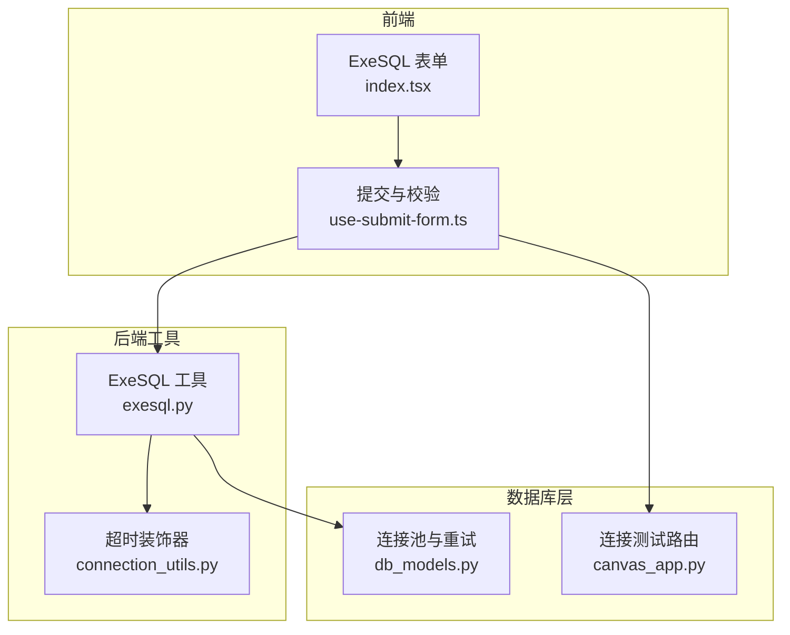
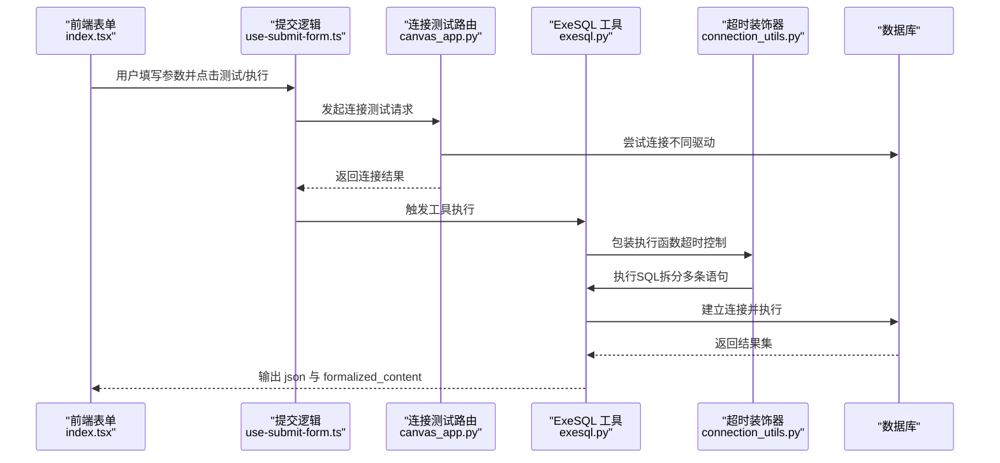
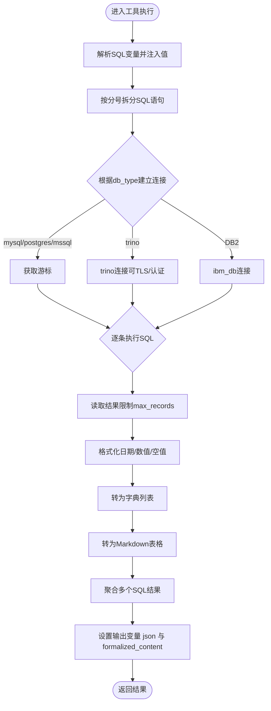
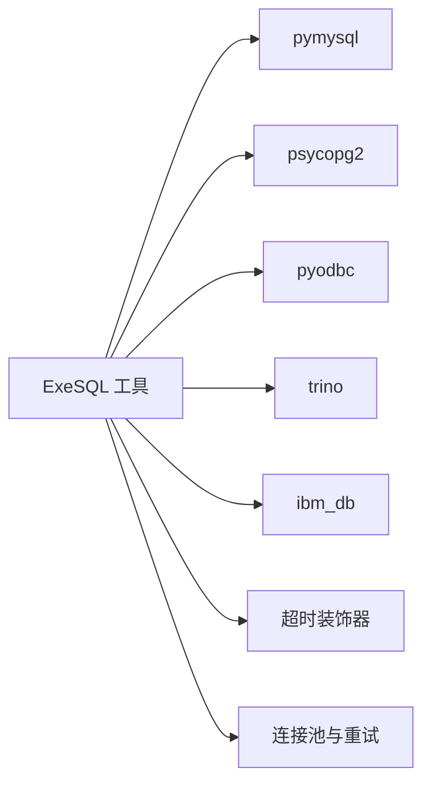

# 数据库查询工具

<cite>
**本文引用的文件**   
- [agent/tools/exesql.py](file://agent/tools/exesql.py)
- [common/connection_utils.py](file://common/connection_utils.py)
- [api/db/db_models.py](file://api/db/db_models.py)
- [web/src/pages/agent/form/exesql-form/index.tsx](file://web/src/pages/agent/form/exesql-form/index.tsx)
- [web/src/pages/agent/form/exesql-form/use-submit-form.ts](file://web/src/pages/agent/form/exesql-form/use-submit-form.ts)
- [api/apps/canvas_app.py](file://api/apps/canvas_app.py)
- [docs/guides/agent/agent_component_reference/execute_sql.md](file://docs/guides/agent/agent_component_reference/execute_sql.md)
- [agent/templates/sql_assistant.json](file://agent/templates/sql_assistant.json)
</cite>

## 目录
1. [简介](#简介)
2. [项目结构](#项目结构)
3. [核心组件](#核心组件)
4. [架构总览](#架构总览)
5. [详细组件分析](#详细组件分析)
6. [依赖分析](#依赖分析)
7. [性能考量](#性能考量)
8. [故障排查指南](#故障排查指南)
9. [结论](#结论)
10. [附录](#附录)

## 简介
本文件面向数据库查询工具“执行SQL”（ExeSQL）的使用者与维护者，系统性阐述其数据库连接配置、SQL执行机制、结果处理与安全防护。文档覆盖：
- 连接参数设置：主机地址、端口、数据库名、认证信息等
- 支持的数据库类型与版本约束
- SQL执行流程、结果格式化与输出变量
- 安全与防护策略（密码校验、敏感信息处理、超时控制）
- 性能与并发特性（最大记录数限制、超时与重试）
- 使用示例与最佳实践（在智能体中执行复杂查询、构建响应）

## 项目结构
围绕“执行SQL”工具的关键代码与界面位于以下模块：
- 工具实现：agent/tools/exesql.py
- 超时装饰器：common/connection_utils.py
- 数据库连接池与重试：api/db/db_models.py
- 前端表单与校验：web/src/pages/agent/form/exesql-form/*
- 后端连接测试：api/apps/canvas_app.py
- 文档与模板：docs/guides/agent/agent_component_reference/execute_sql.md、agent/templates/sql_assistant.json

图表来源
- [agent/tools/exesql.py:80-282](file://agent/tools/exesql.py#L80-L282)
- [common/connection_utils.py:30-101](file://common/connection_utils.py#L30-L101)
- [api/db/db_models.py:242-391](file://api/db/db_models.py#L242-L391)
- [web/src/pages/agent/form/exesql-form/index.tsx:33-177](file://web/src/pages/agent/form/exesql-form/index.tsx#L33-L177)
- [web/src/pages/agent/form/exesql-form/use-submit-form.ts:15-44](file://web/src/pages/agent/form/exesql-form/use-submit-form.ts#L15-L44)
- [api/apps/canvas_app.py:342-368](file://api/apps/canvas_app.py#L342-L368)

章节来源
- [agent/tools/exesql.py:1-282](file://agent/tools/exesql.py#L1-L282)
- [common/connection_utils.py:1-141](file://common/connection_utils.py#L1-L141)
- [api/db/db_models.py:1-800](file://api/db/db_models.py#L1-L800)
- [web/src/pages/agent/form/exesql-form/index.tsx:1-177](file://web/src/pages/agent/form/exesql-form/index.tsx#L1-L177)
- [web/src/pages/agent/form/exesql-form/use-submit-form.ts:1-45](file://web/src/pages/agent/form/exesql-form/use-submit-form.ts#L1-L45)
- [api/apps/canvas_app.py:342-368](file://api/apps/canvas_app.py#L342-L368)

## 核心组件
- ExeSQLParam：定义工具参数元数据与校验规则，包含数据库类型、主机、端口、用户名、密码、数据库名、最大记录数等。
- ExeSQL：工具主类，负责解析SQL变量、建立数据库连接、执行SQL、格式化结果并输出两个变量：json与formalized_content。
- 超时装饰器：对工具执行进行线程级超时控制，避免长时间阻塞。
- 连接池与重试：数据库层提供带重试的连接池封装，提升稳定性。

章节来源
- [agent/tools/exesql.py:28-77](file://agent/tools/exesql.py#L28-L77)
- [agent/tools/exesql.py:79-282](file://agent/tools/exesql.py#L79-L282)
- [common/connection_utils.py:30-101](file://common/connection_utils.py#L30-L101)
- [api/db/db_models.py:242-391](file://api/db/db_models.py#L242-L391)

## 架构总览
下图展示了从前端表单到工具执行再到数据库的完整链路，以及关键的安全与性能控制点。

图表来源
- [web/src/pages/agent/form/exesql-form/index.tsx:33-177](file://web/src/pages/agent/form/exesql-form/index.tsx#L33-L177)
- [web/src/pages/agent/form/exesql-form/use-submit-form.ts:33-44](file://web/src/pages/agent/form/exesql-form/use-submit-form.ts#L33-L44)
- [api/apps/canvas_app.py:342-368](file://api/apps/canvas_app.py#L342-L368)
- [agent/tools/exesql.py:80-282](file://agent/tools/exesql.py#L80-L282)
- [common/connection_utils.py:30-101](file://common/connection_utils.py#L30-L101)

## 详细组件分析

### 参数与连接配置
- 支持的数据库类型：mysql、postgres、mariadb、mssql、IBM DB2、trino。
- 关键参数：
  - db_type：数据库类型
  - database：数据库名（trino需为 catalog.schema 或 catalog）
  - username/password：认证凭据（除trino外均需）
  - host/port：服务器地址与端口
  - max_records：最大返回记录数，默认1024
- 参数校验：
  - 必填字段校验与正整数校验
  - 特定安全限制：禁止使用特定数据库名与密码组合（安全加固）
- 前端表单：
  - 提供数据库类型选择、主机、端口、用户名、密码、最大记录数输入
  - 校验规则：非trino场景要求密码非空

章节来源
- [agent/tools/exesql.py:47-69](file://agent/tools/exesql.py#L47-L69)
- [agent/tools/exesql.py:70-77](file://agent/tools/exesql.py#L70-L77)
- [web/src/pages/agent/form/exesql-form/index.tsx:40-133](file://web/src/pages/agent/form/exesql-form/index.tsx#L40-L133)
- [web/src/pages/agent/form/exesql-form/use-submit-form.ts:5-31](file://web/src/pages/agent/form/exesql-form/use-submit-form.ts#L5-L31)

### SQL执行机制
- 变量替换：从SQL文本中提取变量并注入实际值，支持非字符串转JSON或字符串
- 语句拆分：以分号拆分多条SQL，逐条执行
- 连接建立：
  - mysql/mariadb：使用pymysql
  - postgres：使用psycopg2
  - mssql：使用pyodbc（ODBC驱动）
  - trino：使用trino驱动，支持TLS与Basic认证
  - IBM DB2：使用ibm_db
- 结果读取与转换：
  - 使用pandas读取游标结果，限制最大记录数
  - 对日期列进行格式化，对浮点NaN/Inf进行安全处理
  - 将结果转为字典列表与Markdown表格

图表来源
- [agent/tools/exesql.py:103-278](file://agent/tools/exesql.py#L103-L278)

章节来源
- [agent/tools/exesql.py:103-278](file://agent/tools/exesql.py#L103-L278)

### 查询结果处理
- 输出变量：
  - json：对象数组，适合键值对展示
  - formalized_content：Markdown表格字符串，适合消息组件直接渲染
- 数值与时间处理：
  - 浮点NaN/Inf转换为None，Decimal转为float
  - 时间列统一格式化为“YYYY-MM-DD”
- 记录上限：
  - 每次fetchmany限制max_records，避免过大响应

章节来源
- [agent/tools/exesql.py:87-101](file://agent/tools/exesql.py#L87-L101)
- [agent/tools/exesql.py:264-269](file://agent/tools/exesql.py#L264-L269)
- [agent/tools/exesql.py:276-278](file://agent/tools/exesql.py#L276-L278)

### 安全防护措施
- 密码必填校验：除trino外，其余类型必须提供密码
- 敏感信息处理：
  - 连接测试日志中对密码进行脱敏显示
- 安全限制：
  - 禁止使用特定数据库名与默认密码组合（安全加固）
- 超时控制：
  - 统一通过超时装饰器限制执行时间，防止长时间占用
- 连接测试：
  - 提供后端接口用于验证连接可用性

章节来源
- [agent/tools/exesql.py:61-69](file://agent/tools/exesql.py#L61-L69)
- [web/src/pages/agent/form/exesql-form/use-submit-form.ts:20-31](file://web/src/pages/agent/form/exesql-form/use-submit-form.ts#L20-L31)
- [api/apps/canvas_app.py:355-362](file://api/apps/canvas_app.py#L355-L362)
- [common/connection_utils.py:30-101](file://common/connection_utils.py#L30-L101)

### 错误处理与重试
- 工具侧：
  - 连接失败抛出明确异常；SQL执行过程捕获异常并提示
  - 对Trino/DB2等特殊类型进行独立异常处理
- 数据库层：
  - 提供带指数回退的重试机制，自动处理连接丢失、超时等
  - 支持事务开始阶段的重连与重试

章节来源
- [agent/tools/exesql.py:141-147](file://agent/tools/exesql.py#L141-L147)
- [agent/tools/exesql.py:190-194](file://agent/tools/exesql.py#L190-L194)
- [api/db/db_models.py:242-278](file://api/db/db_models.py#L242-L278)
- [api/db/db_models.py:323-391](file://api/db/db_models.py#L323-L391)

### 使用示例与最佳实践
- 在智能体中执行复杂查询：
  - 使用SQL助理模板，将Agent生成的SQL作为输入传递给ExeSQL
  - 利用formalized_content直接渲染表格，或在后续组件中引用json变量进行进一步处理
- 最佳实践：
  - 明确最大记录数，避免一次性返回过多数据
  - 对动态SQL使用变量占位，结合Agent输出
  - 先通过连接测试确保连通性与凭据正确
  - 针对大数据量查询，优先使用LIMIT或分页策略

章节来源
- [docs/guides/agent/agent_component_reference/execute_sql.md:14-81](file://docs/guides/agent/agent_component_reference/execute_sql.md#L14-L81)
- [agent/templates/sql_assistant.json:1-18](file://agent/templates/sql_assistant.json#L1-L18)

## 依赖分析
- 工具对第三方库的依赖：
  - mysql：pymysql
  - postgres：psycopg2
  - mssql：pyodbc
  - trino：trino（含Basic认证）
  - IBM DB2：ibm_db
- 工具对框架组件的依赖：
  - 超时装饰器：统一的线程/协程超时控制
  - 数据库连接池与重试：提升稳定性与容错能力

图表来源
- [agent/tools/exesql.py:20-24](file://agent/tools/exesql.py#L20-L24)
- [agent/tools/exesql.py:126-194](file://agent/tools/exesql.py#L126-L194)
- [common/connection_utils.py:30-101](file://common/connection_utils.py#L30-L101)
- [api/db/db_models.py:242-391](file://api/db/db_models.py#L242-L391)

章节来源
- [agent/tools/exesql.py:20-24](file://agent/tools/exesql.py#L20-L24)
- [agent/tools/exesql.py:126-194](file://agent/tools/exesql.py#L126-L194)
- [common/connection_utils.py:30-101](file://common/connection_utils.py#L30-L101)
- [api/db/db_models.py:242-391](file://api/db/db_models.py#L242-L391)

## 性能考量
- 最大记录数限制：每批读取限制max_records，降低内存与网络开销
- 超时控制：通过超时装饰器限制单次执行时间，避免长事务阻塞
- 连接池与重试：数据库层提供重试与自动重连，减少瞬时故障影响
- 并发能力：工具执行受超时与max_records限制；数据库连接池支持多连接复用，但具体并发取决于部署配置

章节来源
- [agent/tools/exesql.py:53](file://agent/tools/exesql.py#L53)
- [agent/tools/exesql.py:257-262](file://agent/tools/exesql.py#L257-L262)
- [common/connection_utils.py:30-101](file://common/connection_utils.py#L30-L101)
- [api/db/db_models.py:242-391](file://api/db/db_models.py#L242-L391)

## 故障排查指南
- 连接失败
  - 检查主机、端口、数据库名与认证信息是否正确
  - 使用连接测试接口先行验证
- Trino连接问题
  - 确认环境变量TRINO_USE_TLS与认证信息
  - 确认database字段为catalog.schema或catalog
- IBM DB2连接问题
  - 确认驱动安装与连接串参数
- 结果为空
  - 检查SQL是否正确、是否存在过滤条件导致无记录
  - 调整max_records或添加LIMIT
- 性能问题
  - 减少max_records、增加WHERE条件、使用索引友好的查询
  - 启用数据库层重试与连接池配置

章节来源
- [api/apps/canvas_app.py:342-368](file://api/apps/canvas_app.py#L342-L368)
- [agent/tools/exesql.py:141-147](file://agent/tools/exesql.py#L141-L147)
- [agent/tools/exesql.py:190-194](file://agent/tools/exesql.py#L190-L194)
- [api/db/db_models.py:242-391](file://api/db/db_models.py#L242-L391)

## 结论
“执行SQL”工具提供了统一的数据库访问入口，具备完善的参数校验、安全限制、超时控制与结果格式化能力。配合前端表单与连接测试，用户可以安全、高效地在智能体中执行复杂查询并获得结构化结果。建议在生产环境中合理设置max_records与超时阈值，并优先采用连接池与重试策略以提升稳定性。

## 附录
- 支持的数据库类型与版本
  - MySQL、MariaDB、PostgreSQL、Microsoft SQL Server、IBM DB2、Trino
- 输出变量说明
  - json：对象数组，适合键值对展示
  - formalized_content：Markdown表格字符串，适合消息组件渲染

章节来源
- [docs/guides/agent/agent_component_reference/execute_sql.md:16-81](file://docs/guides/agent/agent_component_reference/execute_sql.md#L16-L81)