# 文件处理工具

<cite>
**本文引用的文件**
- [agent/tools/email.py](file://agent/tools/email.py)
- [agent/tools/github.py](file://agent/tools/github.py)
- [common/data_source/github/connector.py](file://common/data_source/github/connector.py)
- [common/data_source/github/rate_limit_utils.py](file://common/data_source/github/rate_limit_utils.py)
- [common/data_source/gitlab_connector.py](file://common/data_source/gitlab_connector.py)
- [common/data_source/bitbucket/connector.py](file://common/data_source/bitbucket/connector.py)
- [common/data_source/google_drive/connector.py](file://common/data_source/google_drive/connector.py)
- [common/data_source/webdav_connector.py](file://common/data_source/webdav_connector.py)
- [common/data_source/interfaces.py](file://common/data_source/interfaces.py)
- [common/data_source/config.py](file://common/data_source/config.py)
- [api/apps/file_app.py](file://api/apps/file_app.py)
- [conf/system_settings.json](file://conf/system_settings.json)
- [agent/component/agent_with_tools.py](file://agent/component/agent_with_tools.py)
- [agent/templates/customer_review_analysis.json](file://agent/templates/customer_review_analysis.json)
- [docs/guides/agent/agent_introduction.md](file://docs/guides/agent/agent_introduction.md)
</cite>

## 目录
1. [简介](#简介)
2. [项目结构](#项目结构)
3. [核心组件](#核心组件)
4. [架构总览](#架构总览)
5. [详细组件分析](#详细组件分析)
6. [依赖分析](#依赖分析)
7. [性能考虑](#性能考虑)
8. [故障排查指南](#故障排查指南)
9. [结论](#结论)
10. [附录](#附录)

## 简介
本文件面向RAGFlow的“文件处理工具”，系统性梳理邮件发送工具、版本控制系统工具（GitHub/GitLab/Bitbucket）与云存储连接器（Google Drive/WebDAV）的能力边界、参数配置、认证方式、API限制与错误处理策略，并结合智能体工作流给出可落地的使用范式与最佳实践。读者无需深入源码即可理解如何在RAGFlow中自动完成文件上传、目录浏览、权限管理与同步任务。

## 项目结构
围绕文件处理能力，RAGFlow在以下层次组织代码：
- 工具层：面向智能体的可调用工具（如邮件发送、GitHub搜索）
- 连接器层：面向数据源的连接器实现（GitHub/GitLab/Bitbucket/Google Drive/WebDAV），负责增量/全量拉取、权限同步、断点续传
- 接口与常量：统一的接口契约、枚举与配置常量
- API层：对外提供文件上传、目录浏览等HTTP接口
- 配置与系统设置：系统级邮件服务器、超时、阈值等参数

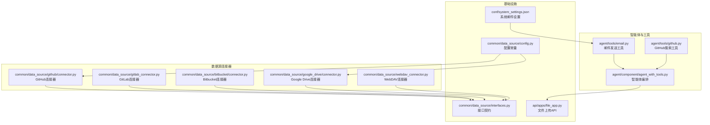

图表来源
- [agent/tools/email.py:1-231](file://agent/tools/email.py#L1-L231)
- [agent/tools/github.py:1-105](file://agent/tools/github.py#L1-L105)
- [agent/component/agent_with_tools.py:1-587](file://agent/component/agent_with_tools.py#L1-L587)
- [common/data_source/github/connector.py:1-973](file://common/data_source/github/connector.py#L1-L973)
- [common/data_source/gitlab_connector.py:1-340](file://common/data_source/gitlab_connector.py#L1-L340)
- [common/data_source/bitbucket/connector.py:1-388](file://common/data_source/bitbucket/connector.py#L1-L388)
- [common/data_source/google_drive/connector.py:1-1258](file://common/data_source/google_drive/connector.py#L1-L1258)
- [common/data_source/webdav_connector.py:1-401](file://common/data_source/webdav_connector.py#L1-L401)
- [common/data_source/interfaces.py:1-420](file://common/data_source/interfaces.py#L1-L420)
- [common/data_source/config.py:1-303](file://common/data_source/config.py#L1-L303)
- [api/apps/file_app.py:31-231](file://api/apps/file_app.py#L31-L231)
- [conf/system_settings.json:1-64](file://conf/system_settings.json#L1-L64)

章节来源
- [agent/tools/email.py:1-231](file://agent/tools/email.py#L1-L231)
- [agent/tools/github.py:1-105](file://agent/tools/github.py#L1-L105)
- [agent/component/agent_with_tools.py:1-587](file://agent/component/agent_with_tools.py#L1-L587)
- [common/data_source/github/connector.py:1-973](file://common/data_source/github/connector.py#L1-L973)
- [common/data_source/gitlab_connector.py:1-340](file://common/data_source/gitlab_connector.py#L1-L340)
- [common/data_source/bitbucket/connector.py:1-388](file://common/data_source/bitbucket/connector.py#L1-L388)
- [common/data_source/google_drive/connector.py:1-1258](file://common/data_source/google_drive/connector.py#L1-L1258)
- [common/data_source/webdav_connector.py:1-401](file://common/data_source/webdav_connector.py#L1-L401)
- [common/data_source/interfaces.py:1-420](file://common/data_source/interfaces.py#L1-L420)
- [common/data_source/config.py:1-303](file://common/data_source/config.py#L1-L303)
- [api/apps/file_app.py:31-231](file://api/apps/file_app.py#L31-L231)
- [conf/system_settings.json:1-64](file://conf/system_settings.json#L1-L64)

## 核心组件
- 邮件发送工具（Email）
  - 功能：通过SMTP发送邮件，支持收件人、抄送、主题、正文；内置重试与错误处理；输出成功状态
  - 关键参数：SMTP服务器、端口、发件邮箱、授权码、发件人姓名、收件人、抄送、主题、内容
  - 认证与安全：基于SMTP SSL/TLS；失败时记录详细错误
  - 可在智能体中作为节点使用，配合系统邮件设置或直接在工具表单中填写

- GitHub搜索工具（GitHub）
  - 功能：按关键词搜索仓库，返回高星排序结果摘要
  - 关键参数：查询关键词、返回数量top_n
  - 外部API：GitHub Search API；包含速率限制与重试逻辑

- 版本控制连接器
  - GitHub连接器：支持PR/Issue增量/全量抓取、游标分页回退、速率限制休眠、权限同步
  - GitLab连接器：支持MR/Issue/代码文件抓取，BFS遍历目录树，时间窗口过滤
  - Bitbucket连接器：基于HTTP客户端，支持PR列表分页、时间窗口过滤、权限ID生成

- 云存储连接器
  - Google Drive连接器：OAuth/服务账号、多用户模拟、共享盘/我的驱动动态发现、断点续传、权限同步
  - WebDAV连接器：用户名/密码认证、递归目录扫描、时间范围过滤、大小阈值控制

- 文件上传API
  - 提供文件上传、目录创建、根目录与父目录查询等接口，支持批量上传与大小/数量限制

章节来源
- [agent/tools/email.py:31-231](file://agent/tools/email.py#L31-L231)
- [agent/tools/github.py:25-105](file://agent/tools/github.py#L25-L105)
- [common/data_source/github/connector.py:413-973](file://common/data_source/github/connector.py#L413-L973)
- [common/data_source/gitlab_connector.py:161-340](file://common/data_source/gitlab_connector.py#L161-L340)
- [common/data_source/bitbucket/connector.py:58-388](file://common/data_source/bitbucket/connector.py#L58-L388)
- [common/data_source/google_drive/connector.py:112-1258](file://common/data_source/google_drive/connector.py#L112-L1258)
- [common/data_source/webdav_connector.py:23-401](file://common/data_source/webdav_connector.py#L23-L401)
- [api/apps/file_app.py:31-231](file://api/apps/file_app.py#L31-L231)

## 架构总览
RAGFlow的文件处理工具采用“工具+连接器”的双层架构：
- 工具层（agent/tools）：面向智能体的即插即用组件，负责参数校验、输入表单、错误输出与执行超时控制
- 连接器层（common/data_source）：面向外部系统的稳定抓取与同步，提供断点续传、权限同步、速率限制与异常恢复

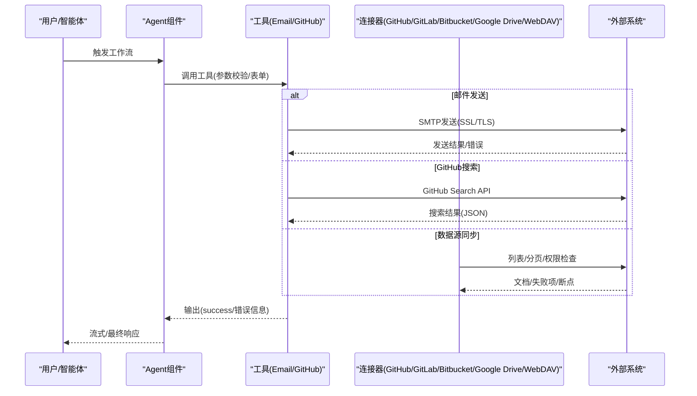

图表来源
- [agent/component/agent_with_tools.py:172-587](file://agent/component/agent_with_tools.py#L172-L587)
- [agent/tools/email.py:99-231](file://agent/tools/email.py#L99-L231)
- [agent/tools/github.py:57-105](file://agent/tools/github.py#L57-L105)
- [common/data_source/github/connector.py:529-740](file://common/data_source/github/connector.py#L529-L740)
- [common/data_source/gitlab_connector.py:218-314](file://common/data_source/gitlab_connector.py#L218-L314)
- [common/data_source/bitbucket/connector.py:182-256](file://common/data_source/bitbucket/connector.py#L182-L256)
- [common/data_source/google_drive/connector.py:740-767](file://common/data_source/google_drive/connector.py#L740-L767)
- [common/data_source/webdav_connector.py:273-304](file://common/data_source/webdav_connector.py#L273-L304)

## 详细组件分析

### 邮件发送工具（Email）
- 参数与表单
  - 必填：SMTP服务器、发件邮箱、授权码、发件人姓名
  - 可选：收件人、抄送、主题、内容
- 执行流程
  - 解析JSON输入，构建MIME消息，启用SSL/TLS登录，发送后关闭连接
  - 支持备用sendmail路径，具备重试与延迟策略
- 错误处理
  - 认证失败、连接失败、SMTP异常均捕获并输出错误码与success标志
- 在智能体中的使用
  - 可在工作流中配置多个Email节点，串联于分析/检索之后自动发送报告或通知

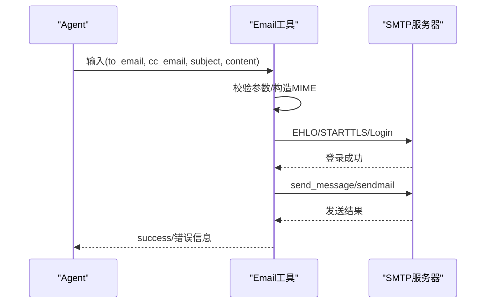

图表来源
- [agent/tools/email.py:99-231](file://agent/tools/email.py#L99-L231)
- [conf/system_settings.json:16-62](file://conf/system_settings.json#L16-L62)

章节来源
- [agent/tools/email.py:31-231](file://agent/tools/email.py#L31-L231)
- [conf/system_settings.json:16-62](file://conf/system_settings.json#L16-L62)

### GitHub搜索工具（GitHub）
- 参数与行为
  - 查询关键词、返回条数top_n
  - 使用GitHub Search API，按stars降序排序
- 错误与重试
  - 异常捕获与延迟重试，最终输出标准化内容或错误信息

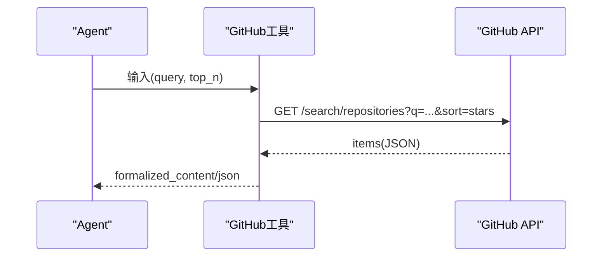

图表来源
- [agent/tools/github.py:57-105](file://agent/tools/github.py#L57-L105)

章节来源
- [agent/tools/github.py:25-105](file://agent/tools/github.py#L25-L105)

### GitHub连接器（断点续传/权限同步）
- 能力
  - 支持PR/Issue增量抓取，游标分页回退，速率限制自动休眠
  - 支持权限同步（外部访问、用户信息）
- 关键特性
  - 断点检查点：阶段、页码、游标URL、已取数量
  - 时间窗口过滤：支持start/end时间范围
  - 多仓库/组织支持：单仓库、多仓库、全组织/用户仓库
- 速率限制
  - 基于GitHub速率限制重置时间计算休眠时长

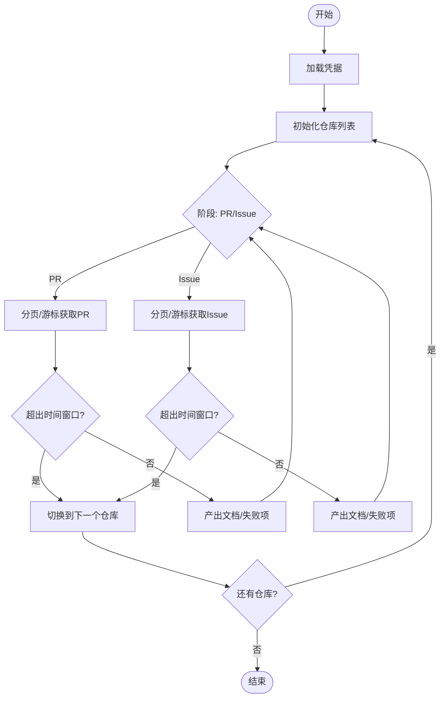

图表来源
- [common/data_source/github/connector.py:529-740](file://common/data_source/github/connector.py#L529-L740)
- [common/data_source/github/rate_limit_utils.py:10-24](file://common/data_source/github/rate_limit_utils.py#L10-L24)

章节来源
- [common/data_source/github/connector.py:413-973](file://common/data_source/github/connector.py#L413-L973)
- [common/data_source/github/rate_limit_utils.py:10-24](file://common/data_source/github/rate_limit_utils.py#L10-L24)

### GitLab连接器（MR/Issue/代码文件）
- 能力
  - MR/Issue按更新时间倒序列出，支持状态过滤
  - 代码文件通过BFS遍历目录树，支持时间窗口过滤与大小阈值
- 权限与验证
  - 凭据加载、鉴权、项目存在性校验、权限不足/凭证过期异常

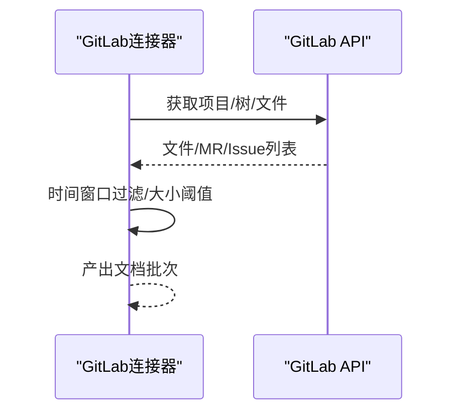

图表来源
- [common/data_source/gitlab_connector.py:218-314](file://common/data_source/gitlab_connector.py#L218-L314)

章节来源
- [common/data_source/gitlab_connector.py:161-340](file://common/data_source/gitlab_connector.py#L161-L340)

### Bitbucket连接器（PR索引/权限ID）
- 能力
  - 支持仓库/项目/工作区三种目标模式，PR列表分页与时间窗口过滤
  - 仅产出文档ID用于权限同步（Slim模式）
- 验证
  - 通过轻量请求验证工作区访问权限

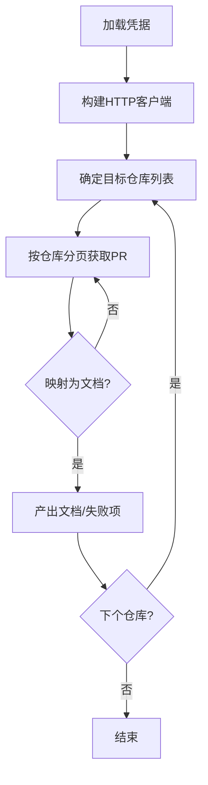

图表来源
- [common/data_source/bitbucket/connector.py:182-256](file://common/data_source/bitbucket/connector.py#L182-L256)

章节来源
- [common/data_source/bitbucket/connector.py:58-388](file://common/data_source/bitbucket/connector.py#L58-L388)

### Google Drive连接器（OAuth/服务账号/断点续传）
- 能力
  - OAuth与服务账号两种认证；多用户模拟；共享盘/我的驱动动态发现
  - 断点续传：阶段化（My Drive/Shared Drive/Folder）、分页令牌、已完成ID集合
  - 权限同步：基于外部访问信息
- 性能与并发
  - 多线程并行用户检索，最大工作线程数可配置

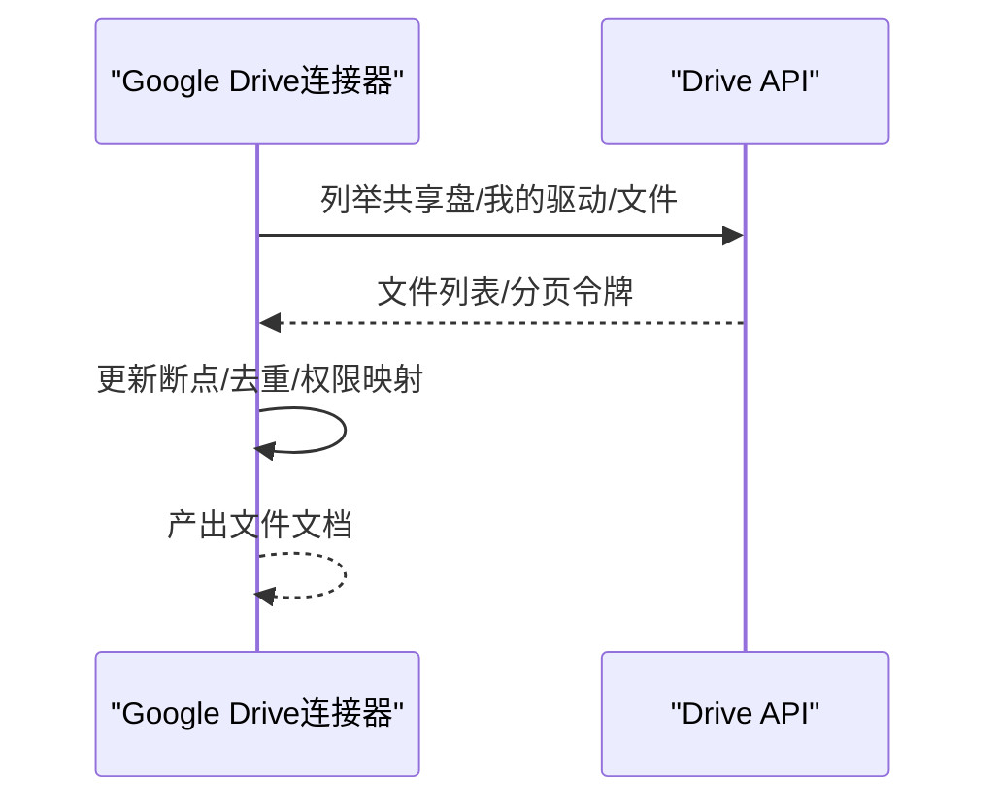

图表来源
- [common/data_source/google_drive/connector.py:740-767](file://common/data_source/google_drive/connector.py#L740-L767)

章节来源
- [common/data_source/google_drive/connector.py:112-1258](file://common/data_source/google_drive/connector.py#L112-L1258)

### WebDAV连接器（递归扫描/时间过滤）
- 能力
  - 用户名/密码认证；递归目录扫描；时间范围过滤；大小阈值控制
  - 支持增量轮询与全量加载
- 验证
  - 通过目录列表验证路径有效性、权限与凭证

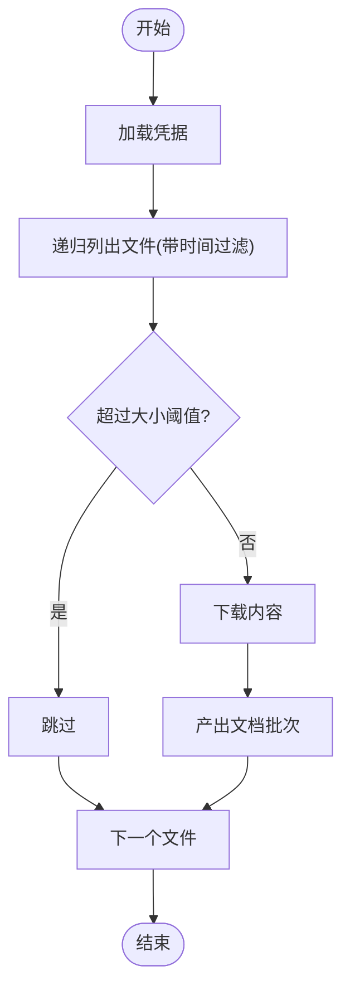

图表来源
- [common/data_source/webdav_connector.py:93-304](file://common/data_source/webdav_connector.py#L93-L304)

章节来源
- [common/data_source/webdav_connector.py:23-401](file://common/data_source/webdav_connector.py#L23-L401)

### 文件上传API（HTTP）
- 能力
  - 单/多文件上传、目录创建、根目录与父目录查询
  - 支持用户文件数量上限、大小/类型限制
- 典型场景
  - 在智能体工作流中，先上传文件，再触发解析/索引流程

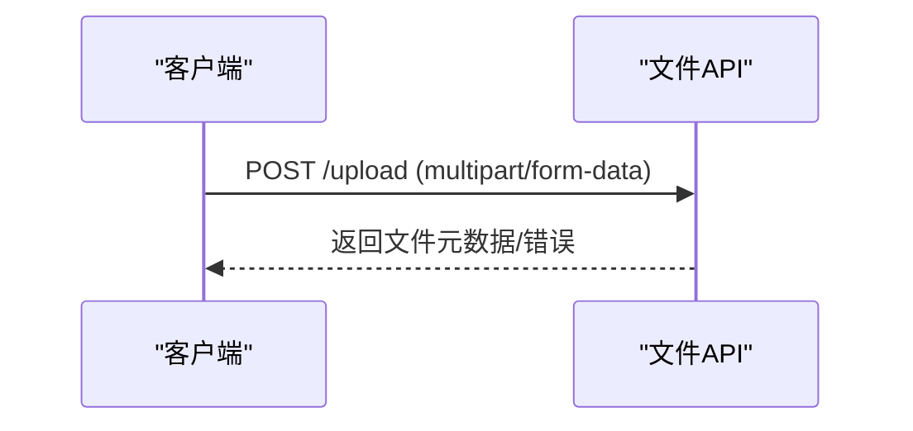

图表来源
- [api/apps/file_app.py:31-127](file://api/apps/file_app.py#L31-L127)

章节来源
- [api/apps/file_app.py:31-231](file://api/apps/file_app.py#L31-L231)

## 依赖分析
- 统一接口契约
  - Load/Poll/Slim/Checkpointed等接口定义，确保不同连接器的一致行为
- 配置与常量
  - 请求超时、批量大小、大小阈值、文档来源枚举等集中管理
- 智能体编排
  - Agent组件动态加载工具元数据，绑定工具调用会话，支持流式输出与工具使用追踪

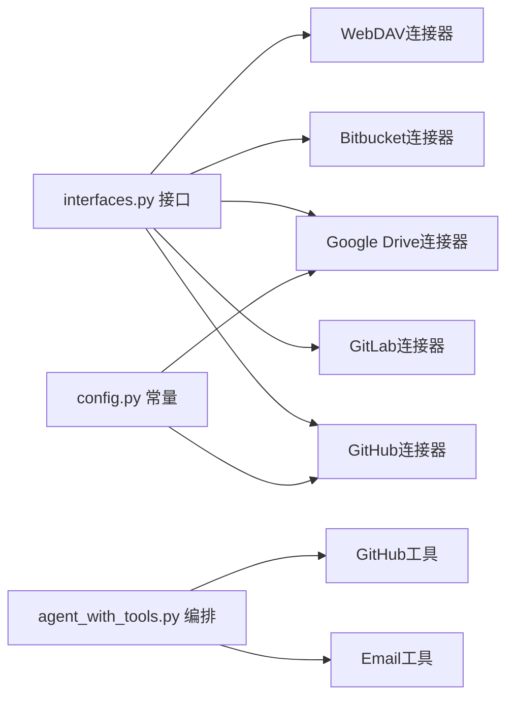

图表来源
- [common/data_source/interfaces.py:21-103](file://common/data_source/interfaces.py#L21-L103)
- [common/data_source/config.py:16-303](file://common/data_source/config.py#L16-L303)
- [agent/component/agent_with_tools.py:81-114](file://agent/component/agent_with_tools.py#L81-L114)

章节来源
- [common/data_source/interfaces.py:1-420](file://common/data_source/interfaces.py#L1-L420)
- [common/data_source/config.py:1-303](file://common/data_source/config.py#L1-L303)
- [agent/component/agent_with_tools.py:1-587](file://agent/component/agent_with_tools.py#L1-L587)

## 性能考虑
- GitHub
  - 速率限制自动休眠，避免触发403；游标分页回退提升大集数据稳定性
- Google Drive
  - 多线程并行用户检索，合理设置最大工作线程；断点续传减少重复抓取
- WebDAV
  - 递归扫描成本较高，建议限定目录深度或使用时间窗口缩小范围
- 通用
  - 批量大小与大小阈值影响吞吐与内存占用；建议根据网络与存储条件调整

## 故障排查指南
- 邮件发送
  - 常见错误：认证失败、连接超时、SMTP异常；检查SMTP服务器、端口、授权码与TLS设置
  - 建议：开启日志查看详细错误栈，确认发件人姓名与编码
- GitHub
  - 速率限制：自动休眠至重置时间；若频繁触发，降低并发或提高间隔
  - API异常：检查查询关键词与返回条数
- GitLab
  - 凭证过期/权限不足：重新授权或提升权限
  - 项目不存在：核对项目路径格式
- Bitbucket
  - 401/403：检查邮箱与API Token；验证工作区访问
- Google Drive
  - 权限不足/作用域缺失：检查OAuth/服务账号权限与回调地址
  - 无法刷新令牌：检查管理员账户与域策略
- WebDAV
  - 401/403/404：检查用户名/密码、远程路径与服务器权限
- 文件上传
  - 无文件/文件名为空：检查前端表单与multipart字段
  - 数量/大小限制：调整环境变量或拆分上传

章节来源
- [agent/tools/email.py:192-222](file://agent/tools/email.py#L192-L222)
- [common/data_source/github/rate_limit_utils.py:10-24](file://common/data_source/github/rate_limit_utils.py#L10-L24)
- [common/data_source/gitlab_connector.py:187-216](file://common/data_source/gitlab_connector.py#L187-L216)
- [common/data_source/bitbucket/connector.py:312-346](file://common/data_source/bitbucket/connector.py#L312-L346)
- [common/data_source/google_drive/connector.py:758-761](file://common/data_source/google_drive/connector.py#L758-L761)
- [common/data_source/webdav_connector.py:312-360](file://common/data_source/webdav_connector.py#L312-L360)
- [api/apps/file_app.py:48-127](file://api/apps/file_app.py#L48-L127)

## 结论
RAGFlow的文件处理工具以“工具+连接器”为核心，既满足智能体自动化编排需求，又提供稳健的数据源同步能力。通过统一接口、断点续传、权限同步与速率限制处理，可在复杂企业环境中可靠地完成文件上传、目录浏览、版本控制与云存储同步任务。建议在生产部署中结合环境变量与系统设置，合理配置超时、批量与阈值，并针对不同数据源选择合适的认证与同步策略。

## 附录

### 使用示例：在智能体中自动处理文件与版本控制
- 场景：客户评审分析后自动发送邮件
  - 步骤：分析节点 → 生成报告 → Email节点（配置SMTP/发件人/收件人/主题/内容）
  - 参考模板节点：[customer_review_analysis.json:580-642](file://agent/templates/customer_review_analysis.json#L580-L642)
- 场景：自动检索GitHub仓库并生成摘要
  - 步骤：Begin → GitHub工具 → 文本处理/输出
  - 参考工具：[agent/tools/github.py:25-105](file://agent/tools/github.py#L25-L105)
- 场景：同步GitLab项目MR/Issue/代码
  - 步骤：配置GitLab连接器 → 设置项目/状态/是否包含代码 → 启动同步
  - 参考连接器：[common/data_source/gitlab_connector.py:161-340](file://common/data_source/gitlab_connector.py#L161-L340)
- 场景：同步Bitbucket PR并进行权限ID生成
  - 步骤：配置Bitbucket连接器 → 设置工作区/仓库/项目 → 启动权限ID生成
  - 参考连接器：[common/data_source/bitbucket/connector.py:270-303](file://common/data_source/bitbucket/connector.py#L270-L303)
- 场景：同步Google Drive并进行权限同步
  - 步骤：配置Google Drive连接器 → OAuth/服务账号 → 启动断点续传与权限同步
  - 参考连接器：[common/data_source/google_drive/connector.py:112-1258](file://common/data_source/google_drive/connector.py#L112-L1258)
- 场景：WebDAV增量同步
  - 步骤：配置WebDAV连接器 → 设置基础URL/路径 → 启动轮询
  - 参考连接器：[common/data_source/webdav_connector.py:23-401](file://common/data_source/webdav_connector.py#L23-L401)

章节来源
- [agent/templates/customer_review_analysis.json:580-642](file://agent/templates/customer_review_analysis.json#L580-L642)
- [agent/tools/github.py:25-105](file://agent/tools/github.py#L25-L105)
- [common/data_source/gitlab_connector.py:161-340](file://common/data_source/gitlab_connector.py#L161-L340)
- [common/data_source/bitbucket/connector.py:270-303](file://common/data_source/bitbucket/connector.py#L270-L303)
- [common/data_source/google_drive/connector.py:112-1258](file://common/data_source/google_drive/connector.py#L112-L1258)
- [common/data_source/webdav_connector.py:23-401](file://common/data_source/webdav_connector.py#L23-L401)