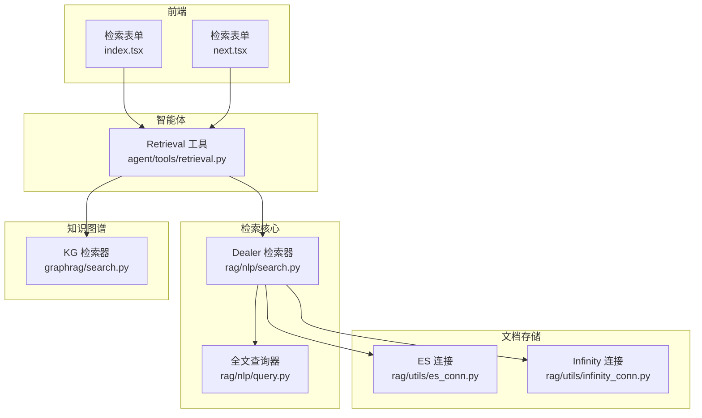
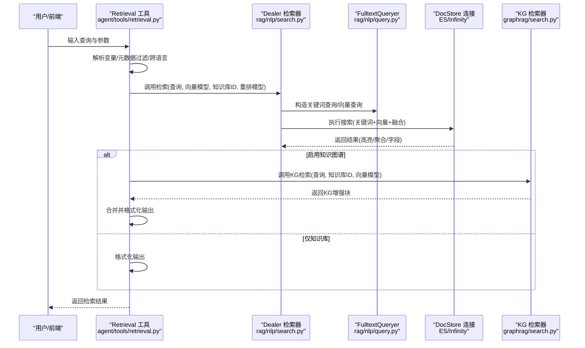
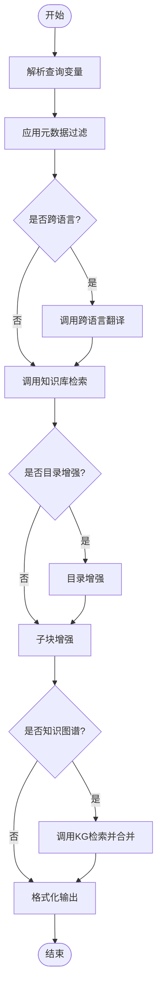
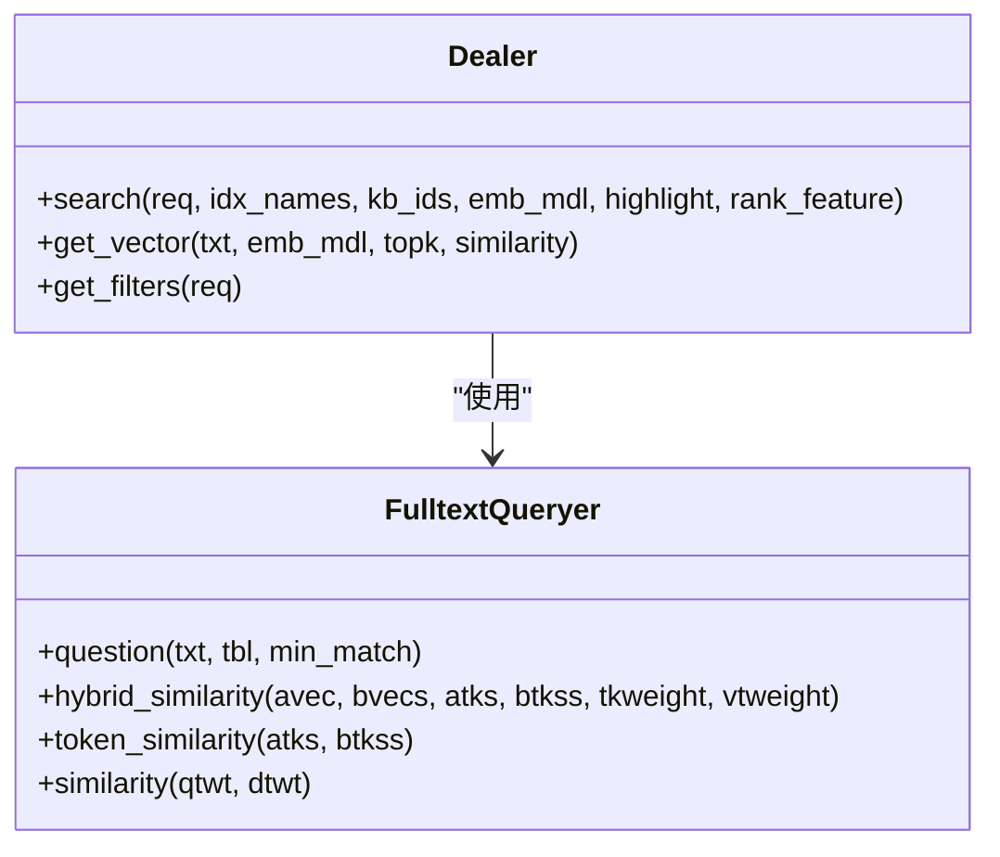
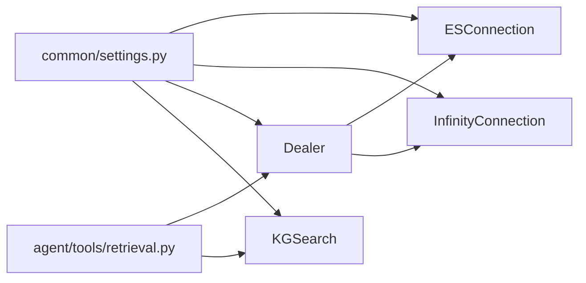

# 检索工具

<cite>
**本文引用的文件列表**
- [agent/tools/retrieval.py](file://agent/tools/retrieval.py)
- [rag/nlp/search.py](file://rag/nlp/search.py)
- [rag/nlp/query.py](file://rag/nlp/query.py)
- [rag/utils/es_conn.py](file://rag/utils/es_conn.py)
- [rag/utils/infinity_conn.py](file://rag/utils/infinity_conn.py)
- [common/settings.py](file://common/settings.py)
- [api/apps/chunk_app.py](file://api/apps/chunk_app.py)
- [docs/guides/dataset/run_retrieval_test.md](file://docs/guides/dataset/run_retrieval_test.md)
- [web/src/pages/agent/form/tool-form/retrieval-form/index.tsx](file://web/src/pages/agent/form/tool-form/retrieval-form/index.tsx)
- [web/src/pages/agent/form/retrieval-form/next.tsx](file://web/src/pages/agent/form/retrieval-form/next.tsx)
- [admin/server/config.py](file://admin/server/config.py)
- [graphrag/search.py](file://graphrag/search.py)
</cite>

## 目录
1. [简介](#简介)
2. [项目结构](#项目结构)
3. [核心组件](#核心组件)
4. [架构总览](#架构总览)
5. [详细组件分析](#详细组件分析)
6. [依赖关系分析](#依赖关系分析)
7. [性能考量](#性能考量)
8. [故障排查指南](#故障排查指南)
9. [结论](#结论)
10. [附录](#附录)

## 简介
本文件面向RAGFlow的知识库检索工具，系统性阐述其向量检索、全文检索、混合检索与语义搜索能力，覆盖配置参数、索引管理、性能优化策略、查询构建方法、与RAG引擎的集成方式、缓存与性能调优实践，并通过具体使用示例帮助用户在智能体中实现精准的知识检索与信息提取。

## 项目结构
检索工具由“前端表单配置”“智能体工具层”“检索器核心”“文档存储连接层”“知识图谱检索器”等模块协同组成：
- 前端表单：提供相似度权重、返回条数、跨语言、知识图谱开关、元数据过滤等参数输入界面。
- 智能体工具层：封装检索工具的参数校验、变量解析、多来源检索（知识库/记忆）、结果格式化输出。
- 检索器核心：负责查询构造、向量编码、融合检索、重排、聚合统计与高亮。
- 文档存储连接层：支持Elasticsearch与Infinity两种后端，统一抽象查询DSL与结果转换。
- 知识图谱检索器：基于实体/关系/社区报告的向量检索与排序。

图表来源
- [agent/tools/retrieval.py:1-306](file://agent/tools/retrieval.py#L1-L306)
- [rag/nlp/search.py:1-200](file://rag/nlp/search.py#L1-L200)
- [rag/nlp/query.py:1-237](file://rag/nlp/query.py#L1-L237)
- [rag/utils/es_conn.py:1-413](file://rag/utils/es_conn.py#L1-L413)
- [rag/utils/infinity_conn.py:1-630](file://rag/utils/infinity_conn.py#L1-L630)
- [graphrag/search.py:85-300](file://graphrag/search.py#L85-L300)

章节来源
- [agent/tools/retrieval.py:1-306](file://agent/tools/retrieval.py#L1-L306)
- [rag/nlp/search.py:1-200](file://rag/nlp/search.py#L1-L200)
- [rag/utils/es_conn.py:1-413](file://rag/utils/es_conn.py#L1-L413)
- [rag/utils/infinity_conn.py:1-630](file://rag/utils/infinity_conn.py#L1-L630)
- [graphrag/search.py:85-300](file://graphrag/search.py#L85-L300)

## 核心组件
- 检索参数与工具
  - 智能体检索工具定义了相似度阈值、关键词权重、返回条数、检索范围、跨语言、知识图谱增强、目录增强、元数据过滤等参数，并在执行时解析变量、应用元数据过滤、调用检索器与知识图谱检索器，最终格式化输出。
- 检索器核心
  - Dealer负责查询构造、向量编码、融合检索（关键词+向量+融合表达式）、重排、高亮与聚合统计。
- 全文查询器
  - FulltextQueryer负责问题分词、同义词扩展、细粒度切词、短语匹配、关键词权重计算与混合相似度计算。
- 文档存储连接
  - ESConnection与InfinityConnection分别实现对Elasticsearch与Infinity的统一查询DSL构建、KNN向量检索、融合权重解析、排序、聚合与高亮。
- 知识图谱检索器
  - 基于实体/关系/社区报告的向量检索与排序，支持PageRank加权与相似度融合。

章节来源
- [agent/tools/retrieval.py:36-70](file://agent/tools/retrieval.py#L36-L70)
- [agent/tools/retrieval.py:84-247](file://agent/tools/retrieval.py#L84-L247)
- [rag/nlp/search.py:37-174](file://rag/nlp/search.py#L37-L174)
- [rag/nlp/query.py:27-174](file://rag/nlp/query.py#L27-L174)
- [rag/utils/es_conn.py:39-195](file://rag/utils/es_conn.py#L39-L195)
- [rag/utils/infinity_conn.py:92-271](file://rag/utils/infinity_conn.py#L92-L271)
- [graphrag/search.py:108-140](file://graphrag/search.py#L108-L140)

## 架构总览
检索工具从智能体工具层开始，经由检索器核心与文档存储连接层，最终返回结构化检索结果。当启用知识图谱时，额外调用KG检索器进行实体/关系/社区报告的向量检索与排序。

图表来源
- [agent/tools/retrieval.py:175-225](file://agent/tools/retrieval.py#L175-L225)
- [rag/nlp/search.py:75-174](file://rag/nlp/search.py#L75-L174)
- [rag/nlp/query.py:41-174](file://rag/nlp/query.py#L41-L174)
- [rag/utils/es_conn.py:39-195](file://rag/utils/es_conn.py#L39-L195)
- [rag/utils/infinity_conn.py:92-271](file://rag/utils/infinity_conn.py#L92-L271)
- [graphrag/search.py:142-291](file://graphrag/search.py#L142-L291)

## 详细组件分析

### 组件一：智能体检索工具（Retrieval）
- 功能职责
  - 参数校验与默认值设定（相似度阈值、关键词权重、top_n、top_k、跨语言、知识图谱开关、目录增强、元数据过滤等）。
  - 解析查询中的变量占位符，按需调用跨语言翻译。
  - 应用元数据过滤生成文档ID集合，限定检索范围。
  - 调用检索器执行知识库检索，可选目录增强与子块增强。
  - 可选调用知识图谱检索器，将KG块插入结果首位。
  - 输出标准化内容与JSON结构化结果，并建立引用关系。
- 关键流程
  - 知识库检索：调用settings.retriever.retrieval，传入相似度阈值、关键词权重、top_n、doc_ids、重排模型、rank_feature等。
  - 目录增强：若开启toc_enhance，先以现有块为基础，调用LLM根据目录评分挑选更相关的块。
  - 子块增强：对现有块进行子块扩展，提升覆盖度。
  - 知识图谱增强：若开启use_kg，调用kg_retriever.retrieval，将KG块插入结果首位。
  - 结果格式化：移除冗余字段，拼装提示词，输出formalized_content与json。
- 配置要点
  - 相似度阈值：过滤低分块。
  - 关键词权重：控制关键词与向量的融合比例。
  - top_n/top_k：返回条数与候选上限。
  - 跨语言：支持多语言语义对齐。
  - 知识图谱：启用后显著增加耗时，但提升实体/关系相关性。
  - 目录增强：基于目录层级与标题评分，提升主题相关性。
  - 元数据过滤：可自动或半自动抽取过滤条件，缩小检索范围。

图表来源
- [agent/tools/retrieval.py:175-247](file://agent/tools/retrieval.py#L175-L247)

章节来源
- [agent/tools/retrieval.py:36-70](file://agent/tools/retrieval.py#L36-L70)
- [agent/tools/retrieval.py:84-247](file://agent/tools/retrieval.py#L84-L247)

### 组件二：检索器核心（Dealer）
- 查询构造
  - 若存在问题文本，构造关键词查询表达式与向量查询表达式，并通过融合表达式组合。
  - 支持最小匹配率、高亮字段、排序、聚合与rank_feature。
- 向量检索
  - 使用嵌入模型对查询进行编码，构造MatchDenseExpr，设置相似度阈值与候选数。
  - 在非Infinity引擎下，自动追加向量字段到返回字段。
- 融合检索
  - 默认融合权重为“关键词:0.05, 向量:0.95”，可通过FusionExpr的权重参数调整。
  - 若首次检索为空，尝试降低最小匹配率或降低相似度阈值，提升召回。
- 结果处理
  - 提取高亮、聚合、字段、总命中数，封装为SearchResult对象。
- 关键点
  - 支持按doc_id、kb_id等过滤条件。
  - 支持rank_feature（如PageRank、标签特征）参与排序。

图表来源
- [rag/nlp/search.py:37-174](file://rag/nlp/search.py#L37-L174)
- [rag/nlp/query.py:27-174](file://rag/nlp/query.py#L27-L174)

章节来源
- [rag/nlp/search.py:37-174](file://rag/nlp/search.py#L37-L174)
- [rag/nlp/search.py:53-61](file://rag/nlp/search.py#L53-L61)
- [rag/nlp/search.py:127-150](file://rag/nlp/search.py#L127-L150)

### 组件三：全文查询器（FulltextQueryer）
- 关键词与同义词扩展
  - 对英文进行空格插入、大小写归一化、去特殊字符；对中文进行细粒度切词与权重计算。
  - 生成query_string表达式，包含最佳字段匹配、短语匹配与同义词OR组合。
- 相似度计算
  - 提供token_similarity与similarity，用于关键词与向量混合相似度的加权融合。
- 短语与关键词权重
  - 支持短语近似匹配与细粒度token权重，提升关键词查询的准确性。

章节来源
- [rag/nlp/query.py:27-174](file://rag/nlp/query.py#L27-L174)
- [rag/nlp/query.py:176-213](file://rag/nlp/query.py#L176-L213)

### 组件四：文档存储连接（ES/Infinity）
- Elasticsearch
  - 构建bool查询与query_string，支持最小匹配率、高亮字段、排序、聚合与rank_feature。
  - KNN向量检索：限制候选数（num_candidates），提升查询效率。
  - 失败重试与超时处理，确保稳定性。
- Infinity
  - 将字段别名映射为内部全文索引字段，支持rank_features注入。
  - 融合表达式默认normalize为atan，避免最后一条记录得分为零。
  - 支持分表聚合与总命中计数。

章节来源
- [rag/utils/es_conn.py:39-195](file://rag/utils/es_conn.py#L39-L195)
- [rag/utils/infinity_conn.py:92-271](file://rag/utils/infinity_conn.py#L92-L271)

### 组件五：知识图谱检索器（KGSearch）
- 实体/关系/社区报告检索
  - 基于查询向量检索实体与关系，结合PageRank与相似度进行排序。
  - 支持按实体类型过滤与按实体集合检索社区报告。
- 返回结构
  - 返回包含实体描述、关系描述与社区报告的合成块，便于后续LLM生成。

章节来源
- [graphrag/search.py:108-140](file://graphrag/search.py#L108-L140)
- [graphrag/search.py:142-291](file://graphrag/search.py#L142-L291)

## 依赖关系分析
- 设置初始化
  - common/settings.py根据环境变量选择文档引擎（Elasticsearch/Infinity/OpenSearch/OceanBase/SeekDB），并初始化docStoreConn与kg_retriever。
- 检索器与连接层
  - Dealer依赖DocStoreConnection接口，ESConnection与InfinityConnection分别实现该接口。
- 智能体工具与检索器
  - agent/tools/retrieval.py通过settings.retriever与settings.kg_retriever调用Dealer与KGSearch。

图表来源
- [common/settings.py:244-282](file://common/settings.py#L244-L282)
- [common/settings.py:319-323](file://common/settings.py#L319-L323)
- [agent/tools/retrieval.py:175-225](file://agent/tools/retrieval.py#L175-L225)

章节来源
- [common/settings.py:244-282](file://common/settings.py#L244-L282)
- [common/settings.py:319-323](file://common/settings.py#L319-L323)
- [agent/tools/retrieval.py:175-225](file://agent/tools/retrieval.py#L175-L225)

## 性能考量
- 向量检索优化
  - 限制KNN候选数（num_candidates），在ES中默认不超过1024，减少候选集提升速度。
  - 融合权重建议：关键词0.05，向量0.95，平衡召回与精度。
- 全文检索优化
  - 最小匹配率（minimum_should_match）随关键词数量动态调整，避免过度严格导致召回不足。
  - 粗粒度与细粒度字段权重分离，提升标题与重要关键词的权重。
- 结果排序与聚合
  - 支持rank_feature（如PageRank、标签特征）参与排序，提升相关性。
  - 聚合统计用于文档级汇总，辅助上层决策。
- 知识图谱检索
  - KG检索会显著增加耗时，建议在需要实体/关系增强时启用，并合理设置topn。
- 缓存与并发
  - 向量编码与重排模型调用通过线程池执行，减少阻塞。
  - 建议在高并发场景下适当增大DOC_BULK_SIZE与EMBEDDING_BATCH_SIZE，平衡吞吐与延迟。

章节来源
- [rag/utils/es_conn.py:112-120](file://rag/utils/es_conn.py#L112-L120)
- [rag/nlp/search.py:130-131](file://rag/nlp/search.py#L130-L131)
- [rag/nlp/search.py:144-149](file://rag/nlp/search.py#L144-L149)
- [rag/utils/infinity_conn.py:207-211](file://rag/utils/infinity_conn.py#L207-L211)
- [common/settings.py:344-347](file://common/settings.py#L344-L347)

## 故障排查指南
- 常见问题
  - 检索结果为空：检查相似度阈值是否过高；尝试降低最小匹配率或相似度阈值；确认kb_ids/doc_ids过滤条件是否过严。
  - 跨语言检索无效：确认目标语言存在于数据集中；检查跨语言翻译链路。
  - 知识图谱耗时过长：关闭use_kg或减少topn；确认KG已成功构建。
  - 高亮字段缺失：确认高亮字段列表与查询表达式一致；ES中注意字段映射。
- 日志与调试
  - 检索器记录总命中数、向量编码耗时、融合权重解析等信息，便于定位问题。
  - ES/Infinity连接层记录查询与响应，便于复现与分析。

章节来源
- [rag/nlp/search.py:138-150](file://rag/nlp/search.py#L138-L150)
- [rag/utils/es_conn.py:174-195](file://rag/utils/es_conn.py#L174-L195)
- [rag/utils/infinity_conn.py:265-271](file://rag/utils/infinity_conn.py#L265-L271)

## 结论
RAGFlow的检索工具通过“关键词+向量”的混合检索与可插拔的文档存储后端，提供了灵活且高性能的知识检索能力。配合智能体工具层的参数化配置、目录增强与知识图谱增强，能够在不同业务场景下实现精准的语义检索与信息提取。通过合理的参数调优与性能优化策略，可进一步提升检索质量与响应速度。

## 附录

### 配置参数与含义
- 相似度阈值：过滤低分块，建议0.2起调。
- 关键词相似度权重：控制关键词与向量的融合比例，默认0.7。
- 返回条数（top_n）：最终返回的块数。
- 候选上限（top_k）：向量检索候选数，建议1024起调。
- 跨语言：选择目标语言，实现跨语言语义对齐。
- 知识图谱：启用后结合实体/关系/社区报告提升相关性。
- 目录增强：基于目录层级与标题评分，提升主题相关性。
- 元数据过滤：可自动/半自动抽取过滤条件，缩小检索范围。

章节来源
- [agent/tools/retrieval.py:57-70](file://agent/tools/retrieval.py#L57-L70)
- [docs/guides/dataset/run_retrieval_test.md:30-72](file://docs/guides/dataset/run_retrieval_test.md#L30-L72)
- [web/src/pages/agent/form/tool-form/retrieval-form/index.tsx:48-71](file://web/src/pages/agent/form/tool-form/retrieval-form/index.tsx#L48-L71)
- [web/src/pages/agent/form/retrieval-form/next.tsx:165-187](file://web/src/pages/agent/form/retrieval-form/next.tsx#L165-L187)

### 索引管理与字段映射
- 字段映射
  - docnm_kwd/title_tks/title_sm_tks → docnm
  - important_kwd/important_tks → important_keywords
  - question_kwd/question_tks → questions
  - content_with_weight/content_ltks/content_sm_ltks → content
  - authors_tks/authors_sm_tks → authors
- 条件过滤
  - 支持kb_id、available_int、knowledge_graph_kwd、entity_kwd等过滤字段。
- 聚合与排序
  - 支持按docnm_kwd聚合与多字段排序。

章节来源
- [rag/utils/infinity_conn.py:44-59](file://rag/utils/infinity_conn.py#L44-L59)
- [rag/utils/infinity_conn.py:168-180](file://rag/utils/infinity_conn.py#L168-L180)
- [rag/nlp/search.py:63-73](file://rag/nlp/search.py#L63-L73)

### 使用示例（智能体中实现精准检索）
- 步骤
  - 在智能体工具表单中设置相似度阈值、关键词权重、返回条数、跨语言、知识图谱开关、目录增强与元数据过滤。
  - 在工具执行时，系统解析变量、应用过滤、调用检索器与KG检索器，最终输出结构化结果。
- 示例路径
  - 表单配置：[web/src/pages/agent/form/tool-form/retrieval-form/index.tsx:48-71](file://web/src/pages/agent/form/tool-form/retrieval-form/index.tsx#L48-L71)
  - 工具执行：[agent/tools/retrieval.py:175-247](file://agent/tools/retrieval.py#L175-L247)

章节来源
- [web/src/pages/agent/form/tool-form/retrieval-form/index.tsx:48-71](file://web/src/pages/agent/form/tool-form/retrieval-form/index.tsx#L48-L71)
- [agent/tools/retrieval.py:175-247](file://agent/tools/retrieval.py#L175-L247)

### 与RAG引擎的集成与缓存
- 集成方式
  - 检索结果作为上下文传递给下游LLM，用于生成回答。
  - 支持重排模型对向量检索结果进行再排序，提升相关性。
- 缓存与性能调优
  - 向量编码与重排模型调用通过线程池执行，减少阻塞。
  - 建议在高并发场景下适当增大批量大小与批处理尺寸，平衡吞吐与延迟。
  - 文档引擎切换（Elasticsearch/Infinity）通过common/settings.py统一初始化，确保检索器与连接层的一致性。

章节来源
- [agent/tools/retrieval.py:188-190](file://agent/tools/retrieval.py#L188-L190)
- [common/settings.py:244-282](file://common/settings.py#L244-L282)
- [common/settings.py:344-347](file://common/settings.py#L344-L347)