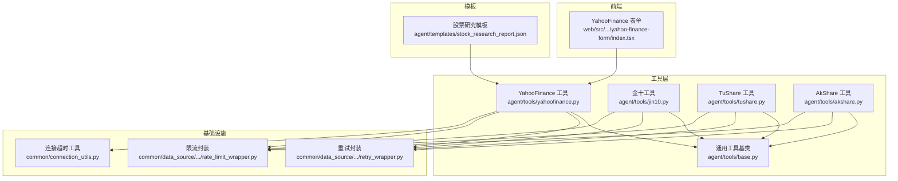
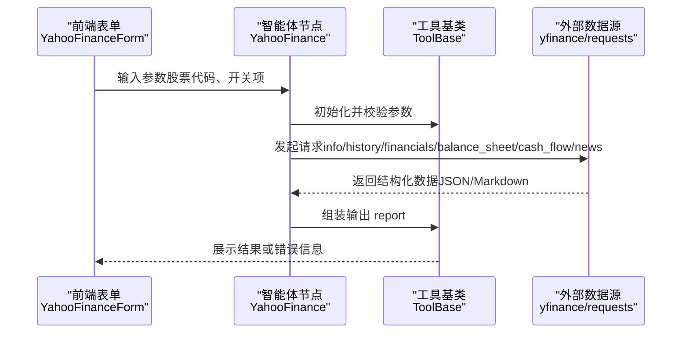
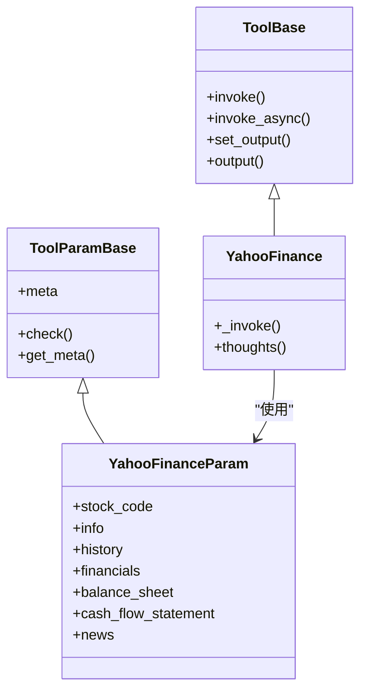
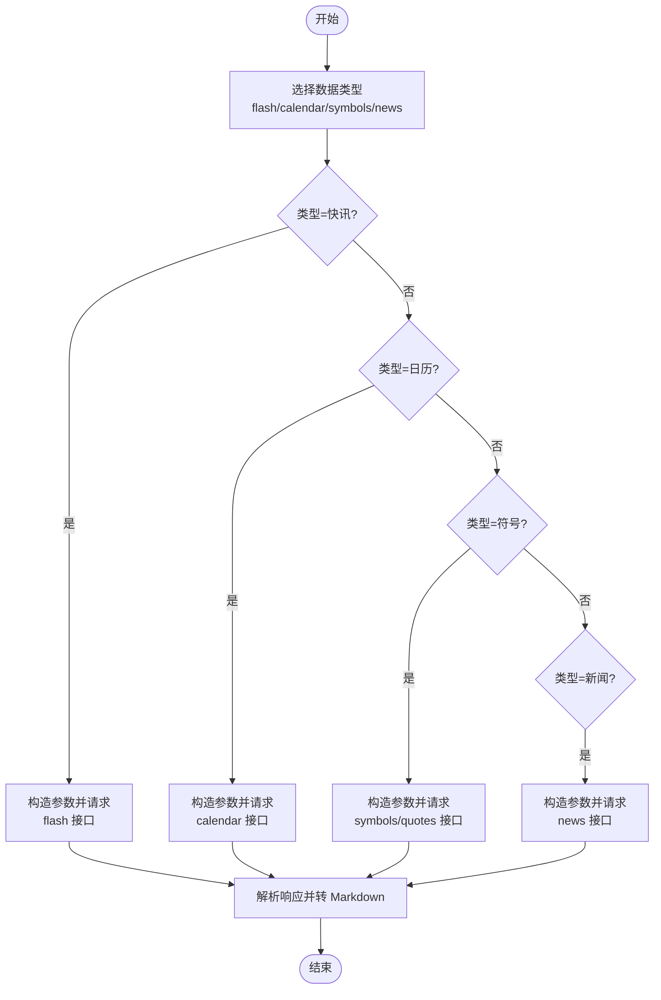
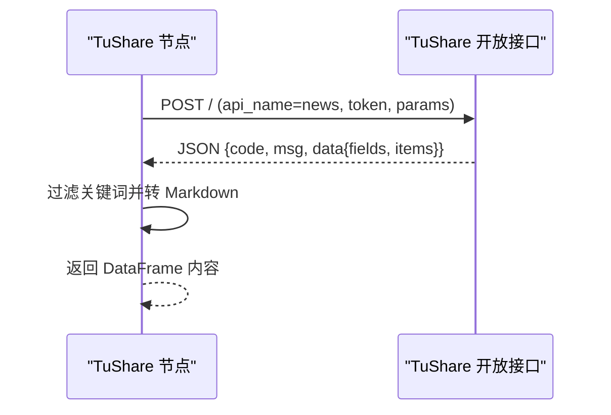
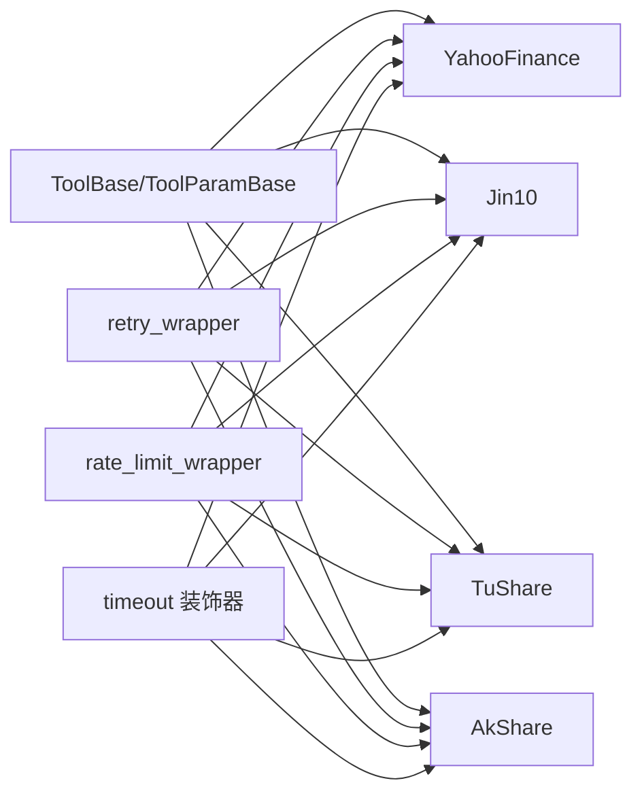

# 金融数据工具

<cite>
**本文引用的文件**
- [agent/tools/yahoofinance.py](file://agent/tools/yahoofinance.py)
- [agent/tools/jin10.py](file://agent/tools/jin10.py)
- [agent/tools/tushare.py](file://agent/tools/tushare.py)
- [agent/tools/akshare.py](file://agent/tools/akshare.py)
- [agent/tools/base.py](file://agent/tools/base.py)
- [agent/templates/stock_research_report.json](file://agent/templates/stock_research_report.json)
- [web/src/pages/agent/form/yahoo-finance-form/index.tsx](file://web/src/pages/agent/form/yahoo-finance-form/index.tsx)
- [common/data_source/cross_connector_utils/retry_wrapper.py](file://common/data_source/cross_connector_utils/retry_wrapper.py)
- [common/data_source/cross_connector_utils/rate_limit_wrapper.py](file://common/data_source/cross_connector_utils/rate_limit_wrapper.py)
- [common/connection_utils.py](file://common/connection_utils.py)
</cite>

## 目录
1. [简介](#简介)
2. [项目结构](#项目结构)
3. [核心组件](#核心组件)
4. [架构总览](#架构总览)
5. [详细组件分析](#详细组件分析)
6. [依赖分析](#依赖分析)
7. [性能考虑](#性能考虑)
8. [故障排查指南](#故障排查指南)
9. [结论](#结论)
10. [附录](#附录)

## 简介
本技术文档面向金融数据工具模块，系统性介绍 RAGFlow 提供的金融数据获取能力，覆盖以下数据源与工具：
- Yahoo Finance 股票数据：实时与历史行情、公司信息、财务日历、资产负债表、现金流量表、新闻资讯等
- 金十数据财经新闻：快讯、日历事件、商品与外汇/期货/加密货币行情符号等
- TuShare 股票数据：国内新闻与资讯
- AkShare 金融数据：东方财富新闻抓取与摘要

文档将从架构、数据流、参数配置、数据格式、使用示例、异常处理与缓存策略等方面进行深入说明，帮助用户在智能体中稳定获取企业级金融数据。

## 项目结构
金融数据工具位于 agent/tools 下，采用“按工具拆分”的模块化组织方式；前端通过可视化表单驱动工具参数输入；模板中定义了典型工作流节点（如 YahooFinance）及其默认参数。

**图表来源**
- [agent/tools/yahoofinance.py:1-127](file://agent/tools/yahoofinance.py#L1-L127)
- [agent/tools/jin10.py:1-151](file://agent/tools/jin10.py#L1-L151)
- [agent/tools/tushare.py:1-85](file://agent/tools/tushare.py#L1-L85)
- [agent/tools/akshare.py:1-57](file://agent/tools/akshare.py#L1-L57)
- [agent/tools/base.py:1-216](file://agent/tools/base.py#L1-L216)
- [web/src/pages/agent/form/yahoo-finance-form/index.tsx:1-126](file://web/src/pages/agent/form/yahoo-finance-form/index.tsx#L1-L126)
- [agent/templates/stock_research_report.json:1-200](file://agent/templates/stock_research_report.json#L1-L200)
- [common/data_source/cross_connector_utils/retry_wrapper.py:1-49](file://common/data_source/cross_connector_utils/retry_wrapper.py#L1-L49)
- [common/data_source/cross_connector_utils/rate_limit_wrapper.py:48-126](file://common/data_source/cross_connector_utils/rate_limit_wrapper.py#L48-L126)
- [common/connection_utils.py:1-200](file://common/connection_utils.py#L1-L200)

**章节来源**
- [agent/tools/yahoofinance.py:1-127](file://agent/tools/yahoofinance.py#L1-L127)
- [agent/tools/jin10.py:1-151](file://agent/tools/jin10.py#L1-L151)
- [agent/tools/tushare.py:1-85](file://agent/tools/tushare.py#L1-L85)
- [agent/tools/akshare.py:1-57](file://agent/tools/akshare.py#L1-L57)
- [agent/tools/base.py:1-216](file://agent/tools/base.py#L1-L216)
- [web/src/pages/agent/form/yahoo-finance-form/index.tsx:1-126](file://web/src/pages/agent/form/yahoo-finance-form/index.tsx#L1-L126)
- [agent/templates/stock_research_report.json:1-200](file://agent/templates/stock_research_report.json#L1-L200)
- [common/data_source/cross_connector_utils/retry_wrapper.py:1-49](file://common/data_source/cross_connector_utils/retry_wrapper.py#L1-L49)
- [common/data_source/cross_connector_utils/rate_limit_wrapper.py:48-126](file://common/data_source/cross_connector_utils/rate_limit_wrapper.py#L48-L126)
- [common/connection_utils.py:1-200](file://common/connection_utils.py#L1-L200)

## 核心组件
- 通用工具基类与元数据
  - 工具元数据定义、参数校验、异步调用封装、输出管理与耗时统计
  - 支持统一的工具注册、参数描述生成与回调记录
- 具体金融工具
  - YahooFinance：基于 yfinance 获取股票信息、历史行情、财务日历、资产负债表、现金流量表、新闻
  - 金十：基于开放 API 获取快讯、日历、商品/外汇/期货/加密行情符号及新闻
  - TuShare：基于 tushare 接口获取国内新闻与资讯
  - AkShare：基于 akshare 获取东方财富新闻并截取前 N 条

**章节来源**
- [agent/tools/base.py:77-216](file://agent/tools/base.py#L77-L216)
- [agent/tools/yahoofinance.py:26-127](file://agent/tools/yahoofinance.py#L26-L127)
- [agent/tools/jin10.py:23-151](file://agent/tools/jin10.py#L23-L151)
- [agent/tools/tushare.py:24-85](file://agent/tools/tushare.py#L24-L85)
- [agent/tools/akshare.py:21-57](file://agent/tools/akshare.py#L21-L57)

## 架构总览
金融数据工具遵循“前端表单 → 智能体节点 → 工具执行 → 外部数据源”的链路。工具基类负责参数解析、错误处理、异步调度与输出标准化；外部数据源通过 HTTP 或第三方库访问。

**图表来源**
- [web/src/pages/agent/form/yahoo-finance-form/index.tsx:93-123](file://web/src/pages/agent/form/yahoo-finance-form/index.tsx#L93-L123)
- [agent/tools/yahoofinance.py:72-127](file://agent/tools/yahoofinance.py#L72-L127)
- [agent/tools/base.py:126-181](file://agent/tools/base.py#L126-L181)

## 详细组件分析

### Yahoo Finance 工具
- 功能要点
  - 获取公司信息、历史行情、财务日历、资产负债表（合并/季度）、现金流量表（合并/季度）、新闻
  - 参数：股票代码（必填），以及多个布尔开关控制返回内容
  - 输出：Markdown 格式的报告字符串
- 数据类型与字段
  - 公司信息：包含基本信息键值对
  - 历史行情：时间序列数据（开盘价、最高价、最低价、收盘价、成交量等）
  - 财务日历：财报披露日期、股东大会日等
  - 资产负债表/现金流量表：多列财务指标
  - 新闻：标题、链接、发布时间、来源等
- 更新频率与访问限制
  - 实时性取决于 yfinance 库与上游数据源；未见显式限流装饰器，建议结合通用重试/限流封装使用
- 使用示例（在智能体中）
  - 在股票研究模板中，YahooFinance 节点可作为数据采集步骤，配合其他节点完成研报整合
  - 参考模板节点定义与参数映射
- 异常处理与重试
  - 工具内部支持最大重试次数与错误延迟；失败时输出错误字段
- 缓存策略
  - 未内置缓存逻辑；建议在上层或网关层实现基于查询参数的缓存

**图表来源**
- [agent/tools/base.py:77-181](file://agent/tools/base.py#L77-L181)
- [agent/tools/yahoofinance.py:26-127](file://agent/tools/yahoofinance.py#L26-L127)

**章节来源**
- [agent/tools/yahoofinance.py:26-127](file://agent/tools/yahoofinance.py#L26-L127)
- [agent/templates/stock_research_report.json:752-782](file://agent/templates/stock_research_report.json#L752-L782)
- [web/src/pages/agent/form/yahoo-finance-form/index.tsx:25-89](file://web/src/pages/agent/form/yahoo-finance-form/index.tsx#L25-L89)

### 金十工具
- 功能要点
  - 快讯、日历、商品/外汇/期货/加密行情符号、新闻
  - 需要 secret-key 认证头
- 参数与数据类型
  - 类型选择：flash/calendar/symbols/news
  - 快讯：按类别过滤
  - 日历：按地区（中国/期货/香港/美国）与数据类型（data/event/holiday）筛选
  - 符号：按类型（商品/外汇/期货/加密）与数据类型（symbols/quotes）切换
  - 新闻：支持关键词过滤
- 输出
  - 结构化 JSON 字段映射为 Markdown 表格或文本内容
- 使用示例
  - 在前端表单中选择类型与过滤条件，传入 secret-key 后发起请求

**图表来源**
- [agent/tools/jin10.py:49-151](file://agent/tools/jin10.py#L49-L151)

**章节来源**
- [agent/tools/jin10.py:23-151](file://agent/tools/jin10.py#L23-L151)

### TuShare 工具
- 功能要点
  - 获取国内新闻与资讯，支持来源站点与时间范围过滤
- 参数与数据类型
  - token：认证令牌
  - 源站：新浪/华尔街见闻/同花顺/东方财富/云财经/凤凰/金融界
  - 时间范围：起止日期
  - 关键词：对内容进行二次过滤
- 输出
  - 将匹配结果转为 Markdown 表格

**图表来源**
- [agent/tools/tushare.py:42-85](file://agent/tools/tushare.py#L42-L85)

**章节来源**
- [agent/tools/tushare.py:24-85](file://agent/tools/tushare.py#L24-L85)

### AkShare 工具
- 功能要点
  - 通过 akshare 抓取东方财富新闻，按条数上限截取
- 参数与数据类型
  - top_n：返回新闻条数上限
- 输出
  - 将每条新闻包装为带链接的 Markdown 文本

**章节来源**
- [agent/tools/akshare.py:21-57](file://agent/tools/akshare.py#L21-L57)

## 依赖分析
- 工具基类与通用封装
  - ToolBase/ToolParamBase 提供统一的参数元数据、异步调用、输出管理与耗时统计
  - 通用重试与限流封装可用于所有外部调用
- 外部依赖
  - YahooFinance：yfinance
  - 金十：requests + secret-key 认证
  - TuShare：requests + token
  - AkShare：akshare 库

**图表来源**
- [agent/tools/base.py:77-181](file://agent/tools/base.py#L77-L181)
- [common/data_source/cross_connector_utils/retry_wrapper.py:16-43](file://common/data_source/cross_connector_utils/retry_wrapper.py#L16-L43)
- [common/data_source/cross_connector_utils/rate_limit_wrapper.py:93-126](file://common/data_source/cross_connector_utils/rate_limit_wrapper.py#L93-L126)
- [common/connection_utils.py:1-200](file://common/connection_utils.py#L1-L200)

**章节来源**
- [agent/tools/base.py:77-181](file://agent/tools/base.py#L77-L181)
- [common/data_source/cross_connector_utils/retry_wrapper.py:16-43](file://common/data_source/cross_connector_utils/retry_wrapper.py#L16-L43)
- [common/data_source/cross_connector_utils/rate_limit_wrapper.py:93-126](file://common/data_source/cross_connector_utils/rate_limit_wrapper.py#L93-L126)
- [common/connection_utils.py:1-200](file://common/connection_utils.py#L1-L200)

## 性能考虑
- 超时控制
  - 工具执行普遍带有超时装饰器，可通过环境变量调整执行时限
- 重试与退避
  - 通用重试封装支持指数退避与抖动，降低瞬时波动影响
- 限流
  - 通用限流封装支持固定窗口与外部 429 响应处理，避免触发上游限流
- 建议
  - 对高频查询场景，建议在网关层增加缓存与去重
  - 对批量任务，优先使用异步调用与线程池执行

[本节为通用指导，无需特定文件引用]

## 故障排查指南
- 常见问题
  - 参数缺失：检查必填字段（如 YahooFinance 的股票代码）
  - 认证失败：确认 secret-key/token 是否正确
  - 超时/网络异常：检查网络连通性与超时设置
  - 上游限流：观察返回状态码或响应头中的等待提示
- 定位方法
  - 查看工具输出的错误字段与异常日志
  - 在前端表单中逐步关闭非必要开关，缩小问题范围
- 处理建议
  - 启用重试与限流封装
  - 对关键路径增加缓存与降级策略

**章节来源**
- [agent/tools/base.py:139-181](file://agent/tools/base.py#L139-L181)
- [agent/tools/yahoofinance.py:75-127](file://agent/tools/yahoofinance.py#L75-L127)
- [agent/tools/jin10.py:142-151](file://agent/tools/jin10.py#L142-L151)
- [agent/tools/tushare.py:76-85](file://agent/tools/tushare.py#L76-L85)
- [agent/tools/akshare.py:50-57](file://agent/tools/akshare.py#L50-L57)

## 结论
RAGFlow 的金融数据工具以统一的工具基类为核心，围绕 Yahoo Finance、金十、TuShare、AkShare 提供了覆盖实时行情、历史数据、财务报表与新闻资讯的能力。通过前端表单与模板节点，用户可在智能体中灵活组合这些工具，构建企业级金融数据服务流程。建议在生产环境中结合重试、限流与缓存策略，确保稳定性与性能。

[本节为总结，无需特定文件引用]

## 附录

### 参数配置与使用示例

- Yahoo Finance
  - 参数：股票代码（必填），info/history/financials/balance_sheet/cash_flow_statement/news（可选开关）
  - 示例：在股票研究模板中添加 YahooFinance 节点，勾选需要的数据项，运行后在输出中查看 Markdown 报告
  - 参考路径：[web 表单:25-89](file://web/src/pages/agent/form/yahoo-finance-form/index.tsx#L25-L89)，[模板节点:752-782](file://agent/templates/stock_research_report.json#L752-L782)

- 金十
  - 参数：type（flash/calendar/symbols/news），各类别下的子参数（如 flash_type、calendar_type、symbols_type、symbols_datatype 等）
  - 示例：在前端选择类型与过滤条件，填写 secret-key，运行后查看 Markdown 表格
  - 参考路径：[工具实现:23-151](file://agent/tools/jin10.py#L23-L151)

- TuShare
  - 参数：token、src（来源站点）、start_date、end_date、keyword
  - 示例：指定时间范围与关键词，获取相关新闻列表
  - 参考路径：[工具实现:24-85](file://agent/tools/tushare.py#L24-L85)

- AkShare
  - 参数：top_n（返回条数上限）
  - 示例：获取东方财富新闻并以 Markdown 链接形式展示
  - 参考路径：[工具实现:21-57](file://agent/tools/akshare.py#L21-L57)

**章节来源**
- [web/src/pages/agent/form/yahoo-finance-form/index.tsx:25-89](file://web/src/pages/agent/form/yahoo-finance-form/index.tsx#L25-L89)
- [agent/templates/stock_research_report.json:752-782](file://agent/templates/stock_research_report.json#L752-L782)
- [agent/tools/jin10.py:23-151](file://agent/tools/jin10.py#L23-L151)
- [agent/tools/tushare.py:24-85](file://agent/tools/tushare.py#L24-L85)
- [agent/tools/akshare.py:21-57](file://agent/tools/akshare.py#L21-L57)