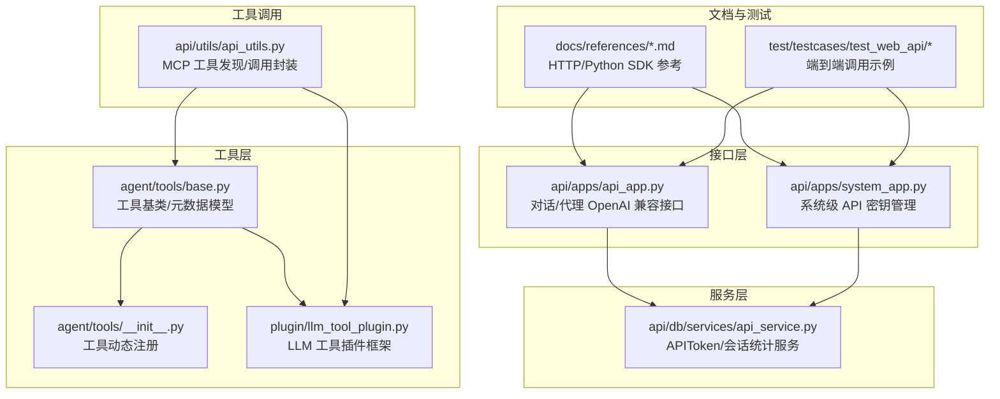
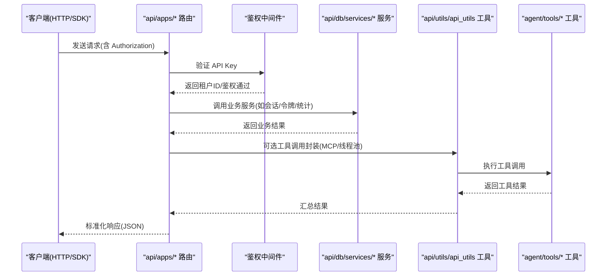
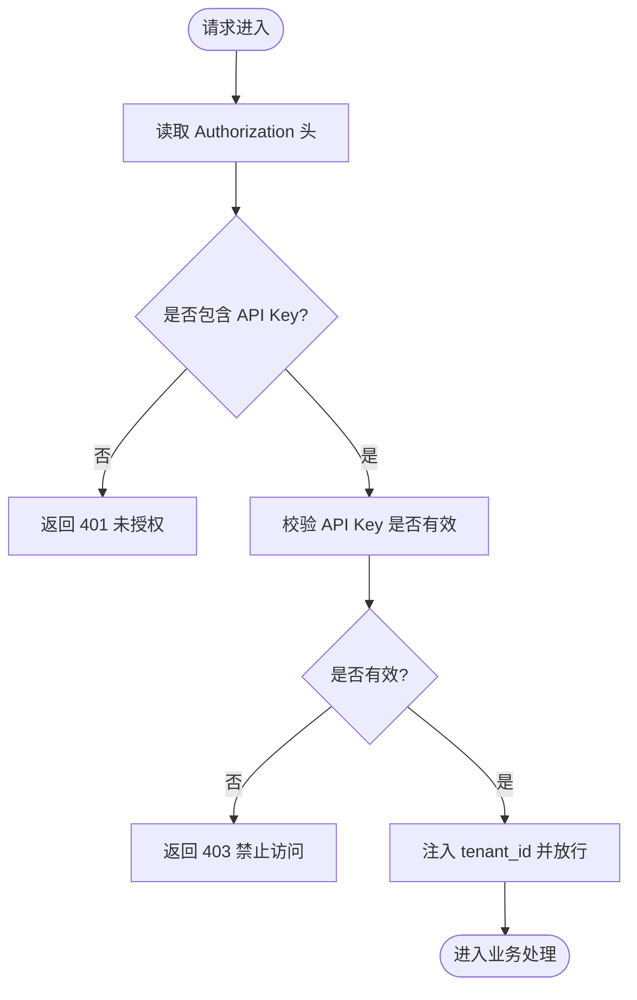
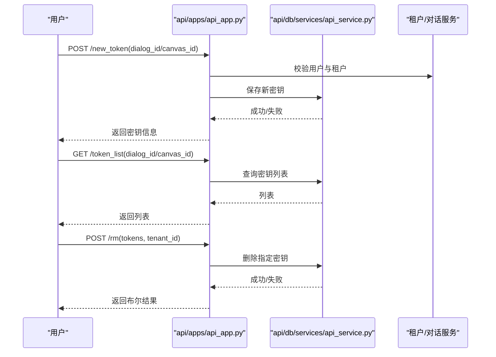
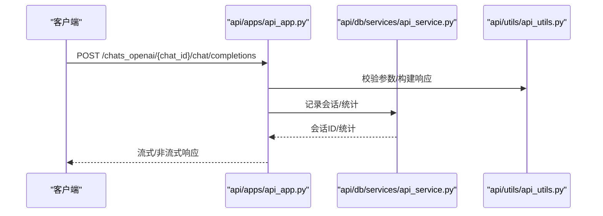
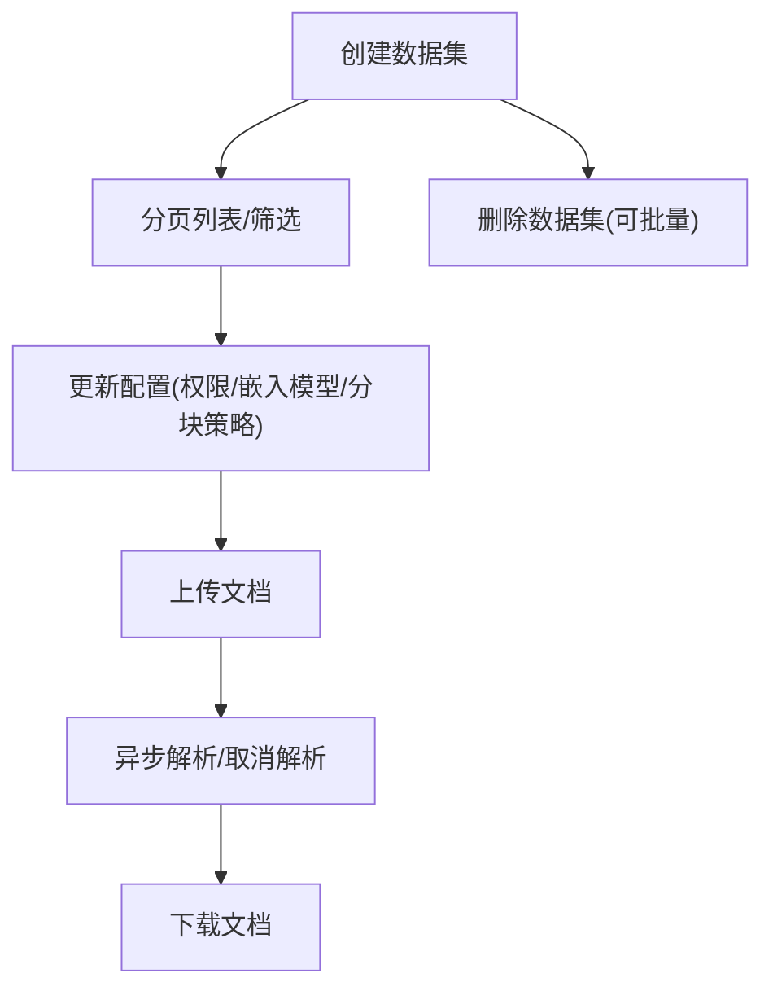
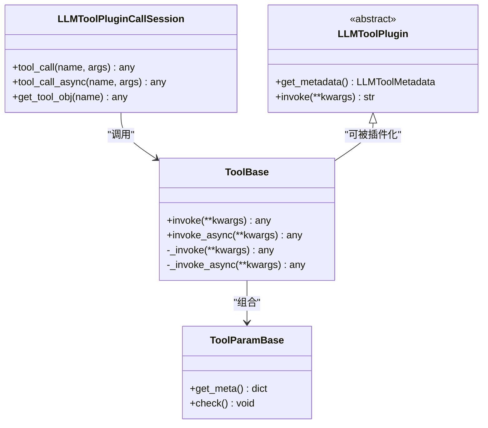
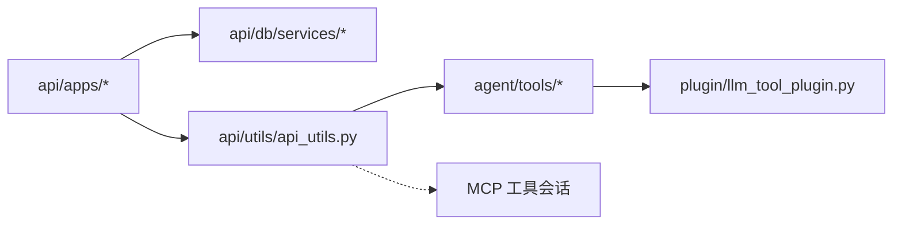

# 工具API参考

<cite>
**本文档引用的文件**
- [api/apps/api_app.py](file://api/apps/api_app.py)
- [api/apps/system_app.py](file://api/apps/system_app.py)
- [api/utils/api_utils.py](file://api/utils/api_utils.py)
- [api/db/services/api_service.py](file://api/db/services/api_service.py)
- [agent/tools/base.py](file://agent/tools/base.py)
- [agent/tools/__init__.py](file://agent/tools/__init__.py)
- [plugin/llm_tool_plugin.py](file://plugin/llm_tool_plugin.py)
- [docs/references/http_api_reference.md](file://docs/references/http_api_reference.md)
- [docs/references/python_api_reference.md](file://docs/references/python_api_reference.md)
- [test/testcases/test_web_api/common.py](file://test/testcases/test_web_api/common.py)
- [test/testcases/test_web_api/test_api_app/test_api_tokens.py](file://test/testcases/test_web_api/test_api_app/test_api_tokens.py)
- [api/common/exceptions.py](file://api/common/exceptions.py)
</cite>

## 目录
1. [简介](#简介)
2. [项目结构](#项目结构)
3. [核心组件](#核心组件)
4. [架构总览](#架构总览)
5. [详细组件分析](#详细组件分析)
6. [依赖分析](#依赖分析)
7. [性能考虑](#性能考虑)
8. [故障排除指南](#故障排除指南)
9. [结论](#结论)
10. [附录](#附录)

## 简介
本参考文档面向开发者与集成工程师，系统化梳理 RAGFlow 的工具 API（含对话与代理的 OpenAI 兼容接口、数据集与文档管理、以及 API 密钥生命周期管理）的接口规范、认证授权机制、错误码、调用示例与最佳实践。文档同时覆盖 HTTP API、Python SDK 使用方式，并提供性能与监控建议，帮助在不同场景下正确、稳定地使用工具 API。

## 项目结构
围绕工具 API 的关键模块分布如下：
- HTTP 接口层：api/apps 下的路由与控制器，负责接收请求、鉴权、调用服务层并返回标准响应。
- 服务层：api/db/services 提供令牌、会话统计等服务逻辑。
- 工具抽象层：agent/tools 定义工具基类与元数据模型，支持插件式扩展。
- 工具插件框架：plugin/llm_tool_plugin 提供 LLM 工具插件的元数据与函数签名转换。
- 工具注册与发现：agent/tools/__init__.py 动态导入工具模块并注册可用工具。
- 工具调用工具：api/utils/api_utils 提供通用工具调用封装（如 MCP 工具发现）。
- 文档与示例：docs/references 提供 HTTP 与 Python SDK 参考；test/testcases 提供端到端调用样例。

**图表来源**
- [api/apps/api_app.py:1-118](file://api/apps/api_app.py#L1-L118)
- [api/apps/system_app.py:210-291](file://api/apps/system_app.py#L210-L291)
- [api/db/services/api_service.py:1-113](file://api/db/services/api_service.py#L1-L113)
- [agent/tools/base.py:1-216](file://agent/tools/base.py#L1-L216)
- [agent/tools/__init__.py:1-48](file://agent/tools/__init__.py#L1-L48)
- [plugin/llm_tool_plugin.py:1-52](file://plugin/llm_tool_plugin.py#L1-L52)
- [api/utils/api_utils.py:659-689](file://api/utils/api_utils.py#L659-L689)
- [docs/references/http_api_reference.md:1-800](file://docs/references/http_api_reference.md#L1-L800)
- [docs/references/python_api_reference.md:1-800](file://docs/references/python_api_reference.md#L1-L800)
- [test/testcases/test_web_api/common.py:69-105](file://test/testcases/test_web_api/common.py#L69-L105)

**章节来源**
- [api/apps/api_app.py:1-118](file://api/apps/api_app.py#L1-L118)
- [api/apps/system_app.py:210-291](file://api/apps/system_app.py#L210-L291)
- [api/db/services/api_service.py:1-113](file://api/db/services/api_service.py#L1-L113)
- [agent/tools/base.py:1-216](file://agent/tools/base.py#L1-L216)
- [agent/tools/__init__.py:1-48](file://agent/tools/__init__.py#L1-L48)
- [plugin/llm_tool_plugin.py:1-52](file://plugin/llm_tool_plugin.py#L1-L52)
- [api/utils/api_utils.py:659-689](file://api/utils/api_utils.py#L659-L689)
- [docs/references/http_api_reference.md:1-800](file://docs/references/http_api_reference.md#L1-L800)
- [docs/references/python_api_reference.md:1-800](file://docs/references/python_api_reference.md#L1-L800)
- [test/testcases/test_web_api/common.py:69-105](file://test/testcases/test_web_api/common.py#L69-L105)

## 核心组件
- 对话/代理 OpenAI 兼容接口：提供聊天补全与流式输出能力，支持引用块与元数据过滤。
- 数据集与文档管理：支持创建、删除、更新、列表、上传、解析、下载等操作。
- API 密钥生命周期管理：支持生成、查询、删除与统计使用情况。
- 工具抽象与插件框架：统一工具元数据模型，支持异步调用与线程池执行，兼容 MCP 工具源。
- 统一响应与错误处理：标准化返回结构与错误码，便于客户端统一处理。

**章节来源**
- [docs/references/http_api_reference.md:1-800](file://docs/references/http_api_reference.md#L1-L800)
- [docs/references/python_api_reference.md:1-800](file://docs/references/python_api_reference.md#L1-L800)
- [api/utils/api_utils.py:233-351](file://api/utils/api_utils.py#L233-L351)
- [api/apps/api_app.py:26-118](file://api/apps/api_app.py#L26-L118)

## 架构总览
工具 API 的整体调用链路如下：

**图表来源**
- [api/utils/api_utils.py:238-301](file://api/utils/api_utils.py#L238-L301)
- [api/db/services/api_service.py:25-113](file://api/db/services/api_service.py#L25-L113)
- [agent/tools/base.py:126-180](file://agent/tools/base.py#L126-L180)
- [api/apps/api_app.py:26-118](file://api/apps/api_app.py#L26-L118)

## 详细组件分析

### 1) 认证与授权机制
- 请求头格式：Authorization: Bearer <API_KEY>
- 鉴权装饰器：token_required 与 apikey_required 从请求头提取并校验 API Key，注入 tenant_id。
- 租户隔离：服务层以 tenant_id 进行数据隔离与权限控制。
- 错误码：401 未授权、403 禁止访问、400 参数错误、500 内部错误等。

**图表来源**
- [api/utils/api_utils.py:238-301](file://api/utils/api_utils.py#L238-L301)
- [api/utils/api_utils.py:120-148](file://api/utils/api_utils.py#L120-L148)

**章节来源**
- [api/utils/api_utils.py:238-301](file://api/utils/api_utils.py#L238-L301)
- [api/utils/api_utils.py:120-148](file://api/utils/api_utils.py#L120-L148)
- [docs/references/http_api_reference.md:14-28](file://docs/references/http_api_reference.md#L14-L28)

### 2) API 密钥生命周期管理
- 新建密钥：登录态下为指定对话或画布生成新 API Key。
- 查询密钥：按租户与对话/画布维度列出密钥。
- 删除密钥：批量删除指定租户下的 API Key。
- 使用统计：按日期聚合 PV、UV、速度、Token 数、轮次、点赞数。

**图表来源**
- [api/apps/api_app.py:26-118](file://api/apps/api_app.py#L26-L118)
- [api/db/services/api_service.py:25-42](file://api/db/services/api_service.py#L25-L42)
- [api/db/services/api_service.py:84-113](file://api/db/services/api_service.py#L84-L113)

**章节来源**
- [api/apps/api_app.py:26-118](file://api/apps/api_app.py#L26-L118)
- [api/db/services/api_service.py:25-113](file://api/db/services/api_service.py#L25-L113)
- [test/testcases/test_web_api/test_api_app/test_api_tokens.py:57-87](file://test/testcases/test_web_api/test_api_app/test_api_tokens.py#L57-L87)
- [test/testcases/test_web_api/common.py:72-91](file://test/testcases/test_web_api/common.py#L72-L91)

### 3) 对话/代理 OpenAI 兼容接口
- 路径：/api/v1/chats_openai/{chat_id}/chat/completions 或 /api/v1/agents_openai/{agent_id}/chat/completions
- 支持流式与非流式响应，返回 OpenAI 兼容的消息结构与用量统计。
- 支持 extra_body 中的 reference 与 metadata_condition 等增强参数。
- 错误码：如“上一条消息不是用户”等业务错误。

**图表来源**
- [docs/references/http_api_reference.md:30-175](file://docs/references/http_api_reference.md#L30-L175)
- [api/utils/api_utils.py:437-478](file://api/utils/api_utils.py#L437-L478)
- [api/db/services/api_service.py:44-113](file://api/db/services/api_service.py#L44-L113)

**章节来源**
- [docs/references/http_api_reference.md:30-175](file://docs/references/http_api_reference.md#L30-L175)
- [api/utils/api_utils.py:437-478](file://api/utils/api_utils.py#L437-L478)
- [api/db/services/api_service.py:44-113](file://api/db/services/api_service.py#L44-L113)

### 4) 数据集与文档管理
- 数据集：创建、删除、更新、分页列表、权限设置、嵌入模型配置等。
- 文档：上传、下载、解析、状态查询、批量解析与取消。
- 解析配置：根据 chunk_method 自动合并默认配置，支持 RAPTOR、GraphRAG 等高级策略。

**图表来源**
- [docs/references/python_api_reference.md:101-794](file://docs/references/python_api_reference.md#L101-L794)
- [docs/references/http_api_reference.md:419-683](file://docs/references/http_api_reference.md#L419-L683)

**章节来源**
- [docs/references/python_api_reference.md:101-794](file://docs/references/python_api_reference.md#L101-L794)
- [docs/references/http_api_reference.md:419-683](file://docs/references/http_api_reference.md#L419-L683)

### 5) 工具抽象与插件框架
- 工具基类：ToolBase/ToolParamBase 提供统一的元数据描述、输入检查、异步/同步调用封装与错误处理。
- 工具元数据：ToolMeta/LLMToolMetadata 描述名称、显示名、参数类型、枚举值与必填项。
- 工具调用会话：LLMToolPluginCallSession 支持线程池执行与超时控制，回调记录耗时。
- MCP 工具：通过 MCPToolCallSession 获取远端工具清单并缓存启用状态。
- 动态注册：agent/tools/__init__.py 自动扫描并注册工具模块中的公开类。

**图表来源**
- [agent/tools/base.py:77-180](file://agent/tools/base.py#L77-L180)
- [agent/tools/base.py:50-75](file://agent/tools/base.py#L50-L75)
- [plugin/llm_tool_plugin.py:22-52](file://plugin/llm_tool_plugin.py#L22-L52)
- [agent/tools/__init__.py:25-47](file://agent/tools/__init__.py#L25-L47)

**章节来源**
- [agent/tools/base.py:77-180](file://agent/tools/base.py#L77-L180)
- [plugin/llm_tool_plugin.py:1-52](file://plugin/llm_tool_plugin.py#L1-L52)
- [agent/tools/__init__.py:1-48](file://agent/tools/__init__.py#L1-L48)
- [api/utils/api_utils.py:659-689](file://api/utils/api_utils.py#L659-L689)

## 依赖分析
- 组件耦合：接口层仅依赖服务层与工具调用工具；服务层依赖数据库模型与通用服务；工具层通过插件框架解耦具体实现。
- 外部依赖：MCP 工具调用、线程池执行、Peewee ORM、Quart/Werkzeug。
- 循环依赖：通过延迟导入避免 agent.canvas 与工具基类之间的循环。

**图表来源**
- [api/apps/api_app.py:16-23](file://api/apps/api_app.py#L16-L23)
- [api/db/services/api_service.py:16-22](file://api/db/services/api_service.py#L16-L22)
- [api/utils/api_utils.py:47-52](file://api/utils/api_utils.py#L47-L52)
- [agent/tools/base.py:23-27](file://agent/tools/base.py#L23-L27)
- [plugin/llm_tool_plugin.py:1-5](file://plugin/llm_tool_plugin.py#L1-L5)

**章节来源**
- [api/apps/api_app.py:16-23](file://api/apps/api_app.py#L16-L23)
- [api/db/services/api_service.py:16-22](file://api/db/services/api_service.py#L16-L22)
- [api/utils/api_utils.py:47-52](file://api/utils/api_utils.py#L47-L52)
- [agent/tools/base.py:23-27](file://agent/tools/base.py#L23-L27)
- [plugin/llm_tool_plugin.py:1-5](file://plugin/llm_tool_plugin.py#L1-L5)

## 性能考虑
- 异步与线程池：工具调用优先走异步路径，若为同步方法则通过线程池执行，避免阻塞事件循环。
- 压测与强弱校验：提供压力测试工具对聊天与嵌入模型进行强度验证，确保在高负载下的稳定性。
- 资源消耗：注意大文本切片与引用块生成的内存占用；合理设置分块大小与并发度。
- 并发控制：建议客户端侧限流与重试退避；服务端已内置超时与异常日志。

**章节来源**
- [agent/tools/base.py:155-180](file://agent/tools/base.py#L155-L180)
- [api/utils/api_utils.py:691-729](file://api/utils/api_utils.py#L691-L729)

## 故障排除指南
- 常见错误码
  - 400：参数缺失或非法
  - 401：未提供或无效 API Key
  - 403：禁止访问/权限不足
  - 404：资源不存在
  - 500：服务器内部错误
  - 业务错误：如“最后一条消息不是用户”等
- 定位步骤
  - 检查 Authorization 头格式与 API Key 有效性
  - 查看服务端日志与异常栈
  - 使用 /stats 接口核对使用量与时间范围
  - 单元测试与端到端测试可作为回归参考

**章节来源**
- [docs/references/http_api_reference.md:14-28](file://docs/references/http_api_reference.md#L14-L28)
- [api/utils/api_utils.py:132-148](file://api/utils/api_utils.py#L132-L148)
- [api/apps/api_app.py:85-118](file://api/apps/api_app.py#L85-L118)
- [test/testcases/test_web_api/test_api_app/test_api_tokens.py:76-87](file://test/testcases/test_web_api/test_api_app/test_api_tokens.py#L76-L87)

## 结论
本文档系统化梳理了 RAGFlow 工具 API 的接口规范、认证授权、工具抽象与插件框架、性能与监控要点。建议在生产环境中结合 SDK 与 HTTP 接口，配合严格的密钥管理与限流策略，确保稳定与可观测性。

## 附录

### A. HTTP API 与 SDK 调用示例索引
- OpenAI 兼容聊天补全（HTTP/SDK）
  - HTTP 示例路径：docs/references/http_api_reference.md
  - SDK 示例路径：docs/references/python_api_reference.md
- 数据集与文档管理（SDK）
  - 创建/删除/更新/列表/上传/解析/下载
  - 示例路径：docs/references/python_api_reference.md
- API 密钥生命周期（HTTP）
  - 新建/查询/删除/统计
  - 示例路径：test/testcases/test_web_api/common.py

**章节来源**
- [docs/references/http_api_reference.md:30-175](file://docs/references/http_api_reference.md#L30-L175)
- [docs/references/python_api_reference.md:43-100](file://docs/references/python_api_reference.md#L43-L100)
- [docs/references/python_api_reference.md:105-794](file://docs/references/python_api_reference.md#L105-L794)
- [test/testcases/test_web_api/common.py:72-91](file://test/testcases/test_web_api/common.py#L72-L91)

### B. 版本与兼容性
- 本仓库未提供独立的工具 API 版本号文件；建议通过 Git 标签与发布说明跟踪版本演进。
- OpenAI 兼容接口保持向后兼容，新增字段以可选形式提供。

[本节为通用指导，无需特定文件引用]

### C. 监控与诊断
- 使用 /stats 接口获取每日 PV、UV、速度、Token 数、轮次与点赞数。
- 关注服务端异常日志与线程池执行耗时。
- 建议在客户端实现指数退避重试与超时控制。

**章节来源**
- [api/apps/api_app.py:85-118](file://api/apps/api_app.py#L85-L118)
- [api/db/services/api_service.py:84-107](file://api/db/services/api_service.py#L84-L107)