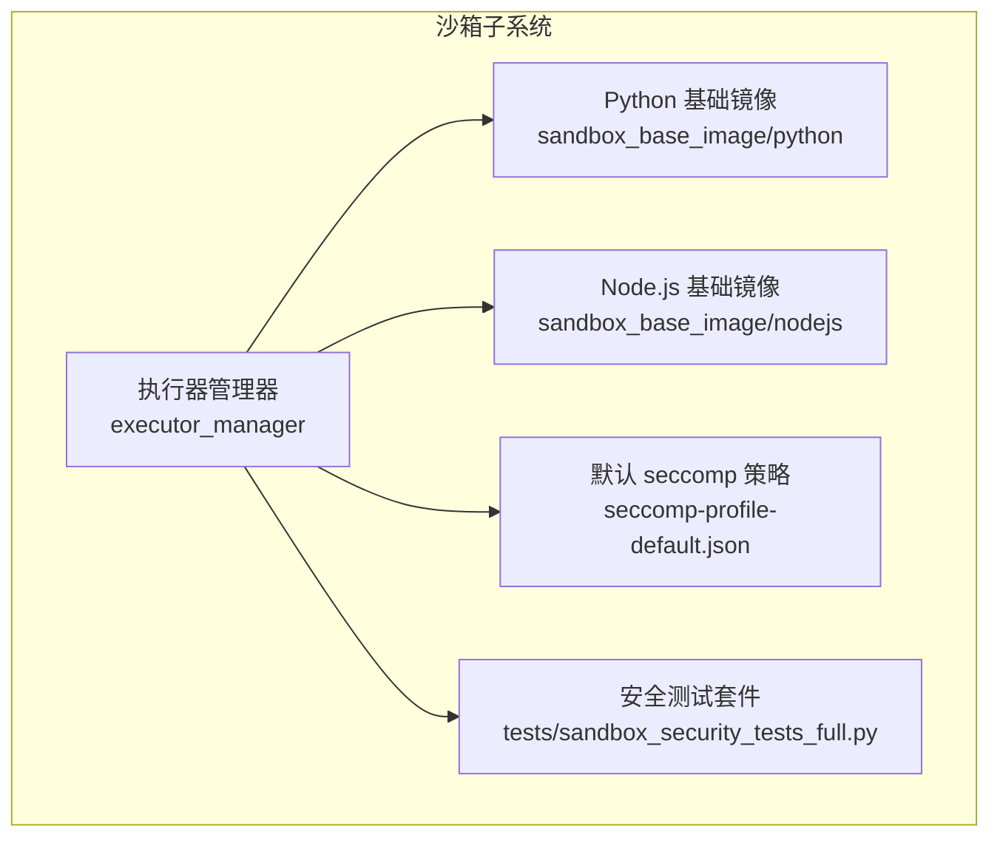
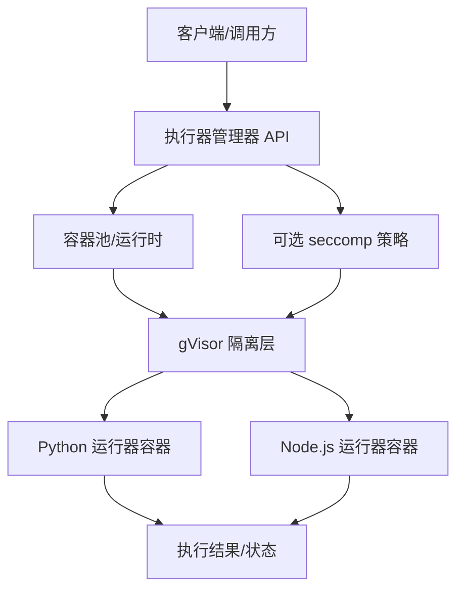
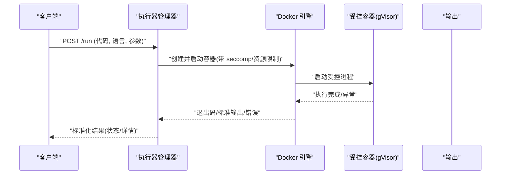
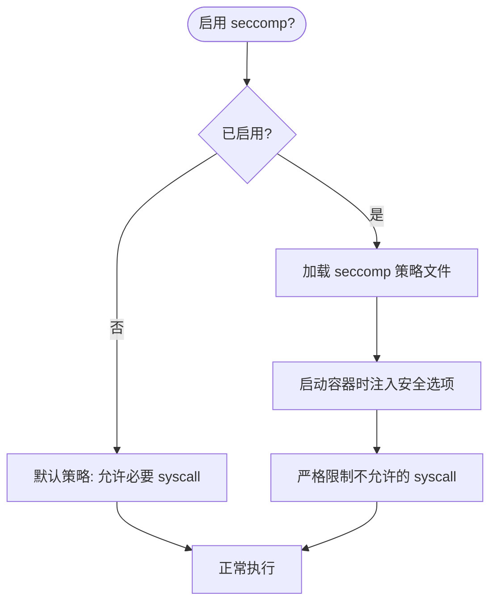
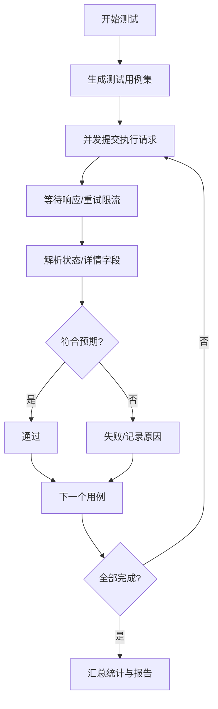
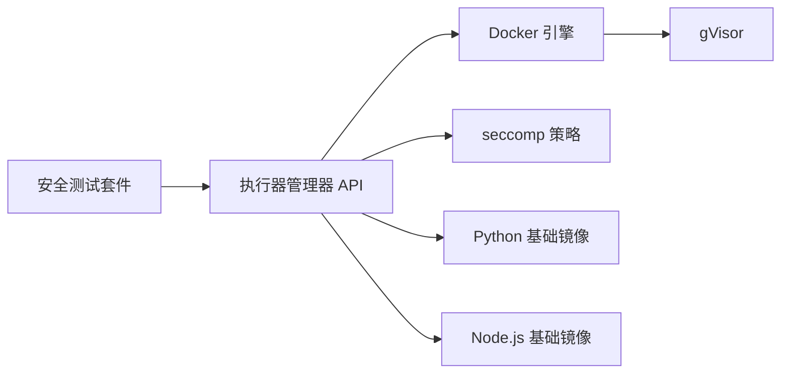

# 工具沙箱与安全

<cite>
**本文引用的文件**
- [sandbox/README.md](file://sandbox/README.md)
- [sandbox/executor_manager/main.py](file://sandbox/executor_manager/main.py)
- [sandbox/executor_manager/Dockerfile](file://sandbox/executor_manager/Dockerfile)
- [sandbox/executor_manager/seccomp-profile-default.json](file://sandbox/executor_manager/seccomp-profile-default.json)
- [sandbox/tests/sandbox_security_tests_full.py](file://sandbox/tests/sandbox_security_tests_full.py)
</cite>

## 目录
1. [简介](#简介)
2. [项目结构](#项目结构)
3. [核心组件](#核心组件)
4. [架构总览](#架构总览)
5. [详细组件分析](#详细组件分析)
6. [依赖分析](#依赖分析)
7. [性能考虑](#性能考虑)
8. [故障排查指南](#故障排查指南)
9. [结论](#结论)
10. [附录](#附录)

## 简介
本文件面向工具沙箱与安全机制，围绕代码执行的安全隔离、权限验证、资源限制、网络访问控制、监控与日志、超时与错误恢复、资源管理策略以及安全最佳实践进行系统化技术说明。RAGFlow 的沙箱以 gVisor 用户态内核实现 syscall 级隔离，并结合可选的 seccomp 策略、AST 静态检查与容器运行时限制，形成多层防护体系。

## 项目结构
沙箱子项目位于 sandbox 目录，主要由以下部分组成：
- 执行器管理器（executor_manager）：基于 FastAPI 的服务端，负责接收执行请求、调度容器、返回结果与状态。
- 基础镜像（sandbox_base_image）：为不同语言构建隔离的基础容器镜像。
- 安全配置与测试：包含 seccomp 默认策略、Dockerfile 构建细节与全面的安全测试套件。
- 文档与快速上手：README 提供架构图、安装与运行指引、故障排查清单。

图表来源
- [sandbox/executor_manager/main.py:16-25](file://sandbox/executor_manager/main.py#L16-L25)
- [sandbox/executor_manager/Dockerfile:1-38](file://sandbox/executor_manager/Dockerfile#L1-L38)
- [sandbox/executor_manager/seccomp-profile-default.json:1-56](file://sandbox/executor_manager/seccomp-profile-default.json#L1-L56)
- [sandbox/tests/sandbox_security_tests_full.py:1-437](file://sandbox/tests/sandbox_security_tests_full.py#L1-L437)

章节来源
- [sandbox/README.md:1-120](file://sandbox/README.md#L1-L120)

## 核心组件
- 执行器管理器（FastAPI 应用）
  - 负责初始化生命周期、注册路由、接入限流器与异常处理。
  - 通过 Docker API 启动受控容器执行任务。
- 基础运行时镜像
  - 分别构建 Python 与 Node.js 的基础镜像，预装所需依赖，确保执行环境一致且可控。
- seccomp 策略
  - 可选的 syscall 白名单策略，默认禁用，启用后仅允许指定系统调用。
- 安全测试套件
  - 覆盖无限循环、危险导入/调用、内存耗尽等典型攻击场景，验证隔离与限制有效性。

章节来源
- [sandbox/executor_manager/main.py:16-25](file://sandbox/executor_manager/main.py#L16-L25)
- [sandbox/executor_manager/Dockerfile:1-38](file://sandbox/executor_manager/Dockerfile#L1-L38)
- [sandbox/executor_manager/seccomp-profile-default.json:1-56](file://sandbox/executor_manager/seccomp-profile-default.json#L1-L56)
- [sandbox/tests/sandbox_security_tests_full.py:150-437](file://sandbox/tests/sandbox_security_tests_full.py#L150-L437)

## 架构总览
下图展示沙箱的整体架构：客户端向执行器管理器提交任务；管理器根据语言选择对应基础镜像，启动受控容器并在 gVisor 下执行；执行结果与状态回传给客户端。

图表来源
- [sandbox/README.md:13-17](file://sandbox/README.md#L13-L17)
- [sandbox/executor_manager/main.py:16-25](file://sandbox/executor_manager/main.py#L16-L25)
- [sandbox/executor_manager/Dockerfile:1-38](file://sandbox/executor_manager/Dockerfile#L1-L38)
- [sandbox/executor_manager/seccomp-profile-default.json:1-56](file://sandbox/executor_manager/seccomp-profile-default.json#L1-L56)

## 详细组件分析

### 执行器管理器（FastAPI 应用）
- 职责
  - 初始化应用生命周期与配置。
  - 注册 API 路由，统一处理请求。
  - 接入速率限制器，对频繁请求进行保护。
  - 捕获限流异常并返回标准化响应。
- 关键点
  - 使用 Docker CLI 作为运行时工具链的一部分，确保与新版本 Docker 守护进程兼容。
  - 通过环境变量控制是否启用 seccomp 策略。
  - 通过基础镜像预置语言运行时与依赖，保证一致性与可重复性。

图表来源
- [sandbox/executor_manager/main.py:16-25](file://sandbox/executor_manager/main.py#L16-L25)
- [sandbox/executor_manager/Dockerfile:24-37](file://sandbox/executor_manager/Dockerfile#L24-L37)
- [sandbox/executor_manager/seccomp-profile-default.json:1-56](file://sandbox/executor_manager/seccomp-profile-default.json#L1-L56)

章节来源
- [sandbox/executor_manager/main.py:16-25](file://sandbox/executor_manager/main.py#L16-L25)
- [sandbox/executor_manager/Dockerfile:1-38](file://sandbox/executor_manager/Dockerfile#L1-L38)

### 基础运行时镜像（Python/Node.js）
- 设计目标
  - 将常用依赖固化到镜像中，减少运行时动态安装带来的不确定性与安全风险。
  - 统一架构支持（amd64/arm64 等），通过 Docker 静态二进制适配。
- 关键点
  - 使用国内镜像源加速依赖安装。
  - 在同一镜像中同时提供 uv 与 Docker CLI，便于本地开发与测试。
  - 通过 Makefile 或 docker-compose 快速构建与启动。

章节来源
- [sandbox/README.md:41-58](file://sandbox/README.md#L41-L58)
- [sandbox/executor_manager/Dockerfile:1-38](file://sandbox/executor_manager/Dockerfile#L1-L38)

### seccomp 策略（可选）
- 设计目标
  - 通过白名单限制容器可用的系统调用，降低逃逸与越权风险。
- 关键点
  - 默认禁用，保持兼容性与易用性。
  - 启用后通过 Docker 安全选项注入策略文件。
  - 策略文件定义了允许的架构与系统调用集合。

图表来源
- [sandbox/README.md:147-172](file://sandbox/README.md#L147-L172)
- [sandbox/executor_manager/seccomp-profile-default.json:1-56](file://sandbox/executor_manager/seccomp-profile-default.json#L1-L56)

章节来源
- [sandbox/README.md:147-172](file://sandbox/README.md#L147-L172)
- [sandbox/executor_manager/seccomp-profile-default.json:1-56](file://sandbox/executor_manager/seccomp-profile-default.json#L1-L56)

### 安全测试套件
- 测试范围
  - 无限循环与 CPU 占用：验证超时与强制终止能力。
  - 危险导入/调用：拒绝敏感模块与危险函数。
  - 内存耗尽：验证内存上限触发与失败返回。
  - 网络访问：在默认策略下限制外联能力（视具体策略而定）。
- 并发与稳定性
  - 多线程并发提交测试，评估容器池与限流表现。
  - 对请求限流返回进行重试处理，提升鲁棒性。

图表来源
- [sandbox/tests/sandbox_security_tests_full.py:83-128](file://sandbox/tests/sandbox_security_tests_full.py#L83-L128)
- [sandbox/tests/sandbox_security_tests_full.py:131-148](file://sandbox/tests/sandbox_security_tests_full.py#L131-L148)
- [sandbox/tests/sandbox_security_tests_full.py:403-437](file://sandbox/tests/sandbox_security_tests_full.py#L403-L437)

章节来源
- [sandbox/tests/sandbox_security_tests_full.py:1-437](file://sandbox/tests/sandbox_security_tests_full.py#L1-L437)

## 依赖分析
- 组件耦合
  - 执行器管理器依赖 Docker 引擎与 seccomp 策略文件；与基础镜像解耦，通过镜像名称与标签解耦。
  - 安全测试套件独立于运行时，通过 API 地址与超时参数可配置。
- 外部依赖
  - gVisor：提供 syscall 级隔离。
  - Docker：容器编排与运行时。
  - uv：包管理与项目工具链。
- 潜在环路
  - 当前结构为单向依赖（测试依赖 API，API 不依赖测试），无循环依赖迹象。

图表来源
- [sandbox/tests/sandbox_security_tests_full.py:27-28](file://sandbox/tests/sandbox_security_tests_full.py#L27-L28)
- [sandbox/executor_manager/main.py:16-25](file://sandbox/executor_manager/main.py#L16-L25)
- [sandbox/executor_manager/Dockerfile:1-38](file://sandbox/executor_manager/Dockerfile#L1-L38)
- [sandbox/executor_manager/seccomp-profile-default.json:1-56](file://sandbox/executor_manager/seccomp-profile-default.json#L1-L56)

章节来源
- [sandbox/executor_manager/main.py:16-25](file://sandbox/executor_manager/main.py#L16-L25)
- [sandbox/executor_manager/Dockerfile:1-38](file://sandbox/executor_manager/Dockerfile#L1-L38)
- [sandbox/executor_manager/seccomp-profile-default.json:1-56](file://sandbox/executor_manager/seccomp-profile-default.json#L1-L56)
- [sandbox/tests/sandbox_security_tests_full.py:27-28](file://sandbox/tests/sandbox_security_tests_full.py#L27-L28)

## 性能考虑
- 并发与吞吐
  - 通过线程池并发提交测试，评估容器池容量与限流策略的协同效果。
- 资源占用
  - 基础镜像预装常用依赖，减少运行时安装开销；合理设置内存与 CPU 时间上限，避免资源滥用。
- 稳定性
  - 对限流返回进行重试与退避，提升整体稳定性。

章节来源
- [sandbox/tests/sandbox_security_tests_full.py:29-29](file://sandbox/tests/sandbox_security_tests_full.py#L29-L29)
- [sandbox/tests/sandbox_security_tests_full.py:101-104](file://sandbox/tests/sandbox_security_tests_full.py#L101-L104)

## 故障排查指南
- gVisor 未正确安装或不可用
  - 现象：连接超时或 runsc 未知运行时。
  - 处理：重新安装 gVisor，重启 Docker，并使用官方命令验证 runsc 可用性。
- hosts 映射缺失
  - 现象：无法解析执行器管理器域名。
  - 处理：在 hosts 中添加映射条目，确保服务名可解析。
- Docker CLI 版本过旧
  - 现象：客户端与守护进程 API 版本不匹配。
  - 处理：拉取最新执行器镜像或在本地重建，确保 Docker CLI 版本满足要求。
- 基础镜像未拉取
  - 现象：执行器管理器超时，无可用运行器。
  - 处理：拉取对应语言的基础镜像后再试。
- 配置未生效
  - 处理：修改配置后需重启服务使变更生效。
- 容器池繁忙
  - 处理：适当增加池大小或稍后重试。

章节来源
- [sandbox/README.md:258-344](file://sandbox/README.md#L258-L344)

## 结论
RAGFlow 沙箱通过 gVisor 实现 syscall 级隔离，结合可选的 seccomp 策略、AST 静态检查与容器运行时限制，形成从系统层到应用层的多维安全防护。配合完善的测试套件与运维指南，能够在保障安全性的同时维持良好的开发体验与系统稳定性。

## 附录
- 快速上手
  - 构建基础镜像与执行器管理器镜像。
  - 配置环境变量与 hosts 映射。
  - 启动服务并通过测试套件验证功能。
- 安全最佳实践
  - 默认启用 gVisor 隔离；在需要时启用 seccomp 并审慎放行 syscall。
  - 限制容器资源（CPU/内存/时间/输出大小），防止资源滥用。
  - 对 Python 代码进行 AST 静态扫描，拒绝危险导入与调用。
  - 严格控制网络访问，必要时关闭外联。
  - 定期更新基础镜像与执行器管理器镜像，修补已知漏洞。
  - 记录执行日志与审计信息，便于问题定位与合规追溯。

章节来源
- [sandbox/README.md:19-118](file://sandbox/README.md#L19-L118)
- [sandbox/README.md:139-179](file://sandbox/README.md#L139-L179)