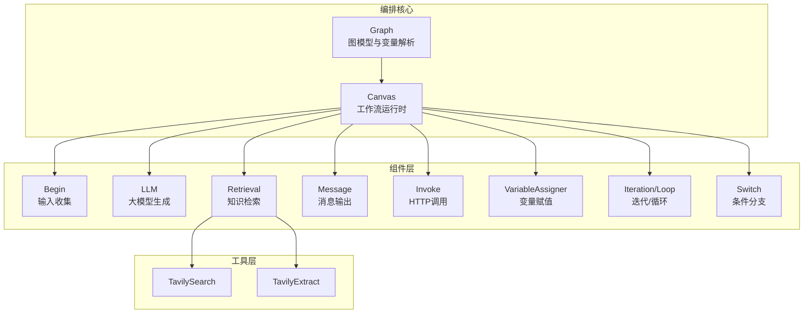
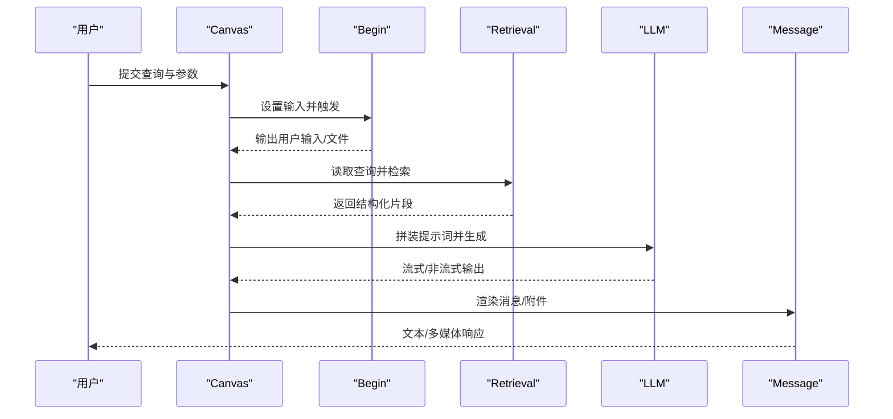
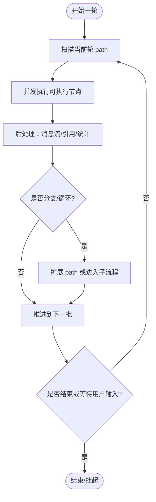
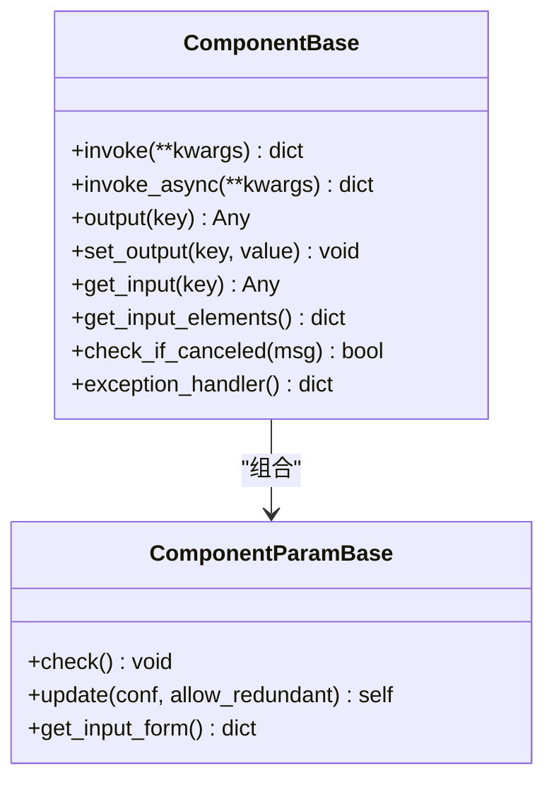
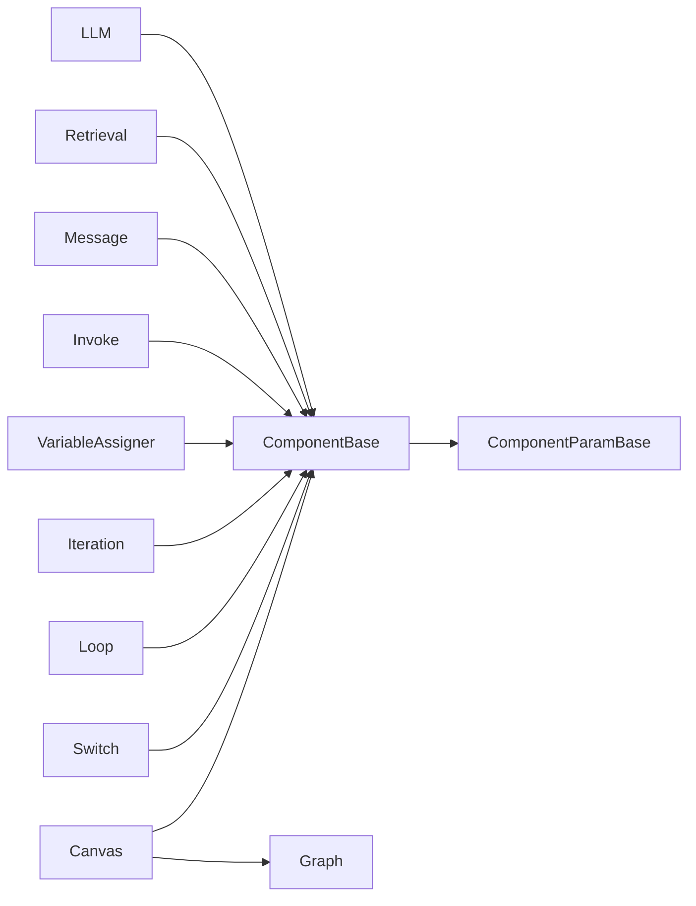
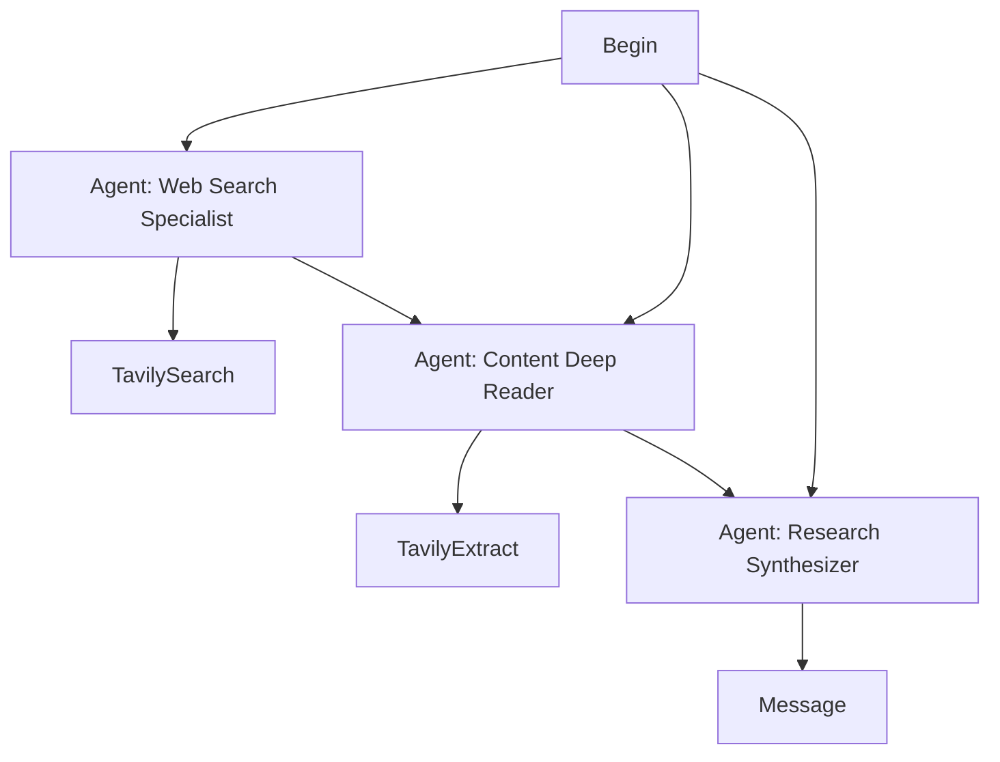
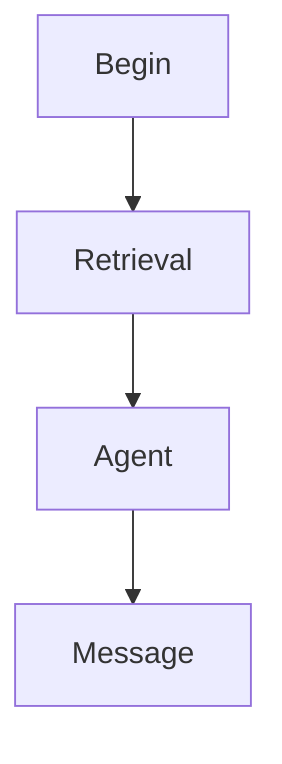
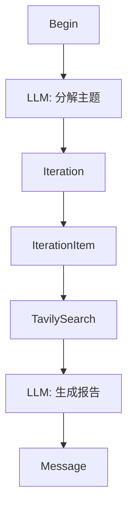
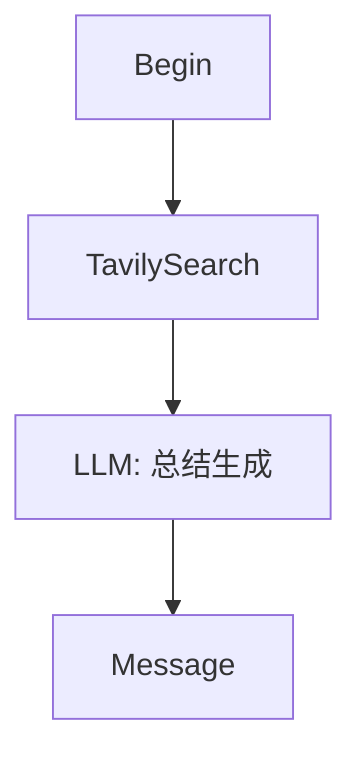

# 工具链组合

<cite>
**本文引用的文件**
- [canvas.py](file://agent/canvas.py)
- [base.py](file://agent/component/base.py)
- [invoke.py](file://agent/component/invoke.py)
- [variable_assigner.py](file://agent/component/variable_assigner.py)
- [iteration.py](file://agent/component/iteration.py)
- [loop.py](file://agent/component/loop.py)
- [switch.py](file://agent/component/switch.py)
- [llm.py](file://agent/component/llm.py)
- [retrieval.py](file://agent/tools/retrieval.py)
- [begin.py](file://agent/component/begin.py)
- [message.py](file://agent/component/message.py)
- [settings.py](file://agent/settings.py)
- [deep_research.json](file://agent/templates/deep_research.json)
- [choose_your_knowledge_base_workflow.json](file://agent/templates/choose_your_knowledge_base_workflow.json)
- [iteration.json](file://agent/test/dsl_examples/iteration.json)
- [tavily_and_generate.json](file://agent/test/dsl_examples/tavily_and_generate.json)
</cite>

## 目录
1. [简介](#简介)
2. [项目结构](#项目结构)
3. [核心组件](#核心组件)
4. [架构总览](#架构总览)
5. [详细组件分析](#详细组件分析)
6. [依赖分析](#依赖分析)
7. [性能考虑](#性能考虑)
8. [故障排查指南](#故障排查指南)
9. [结论](#结论)
10. [附录](#附录)

## 简介
本文件系统性阐述 RAGFlow 中“工具链组合与编排”的技术实现，围绕以下主题展开：
- 工具链的编排原理：串联执行、结果传递、条件分支、循环迭代、异常处理与恢复路径
- 变量传递机制：全局变量、局部变量、上下文变量的定义、解析与作用域
- 错误处理策略：异常捕获、重试机制、降级处理、取消与中断
- 状态管理：执行进度跟踪、中间结果缓存、断点续传思路
- 性能优化：并行执行、批量处理、结果复用
- 实战示例：基于模板与 DSL 的复杂业务场景编排
- 调试与监控：事件流、日志、追踪与可视化

## 项目结构
RAGFlow 的工具链以“画布（Canvas）”为核心，通过 JSON DSL 描述组件拓扑、参数与变量引用；运行时由 Canvas 驱动各组件按拓扑顺序执行，并在组件间传递变量。



图表来源
- [canvas.py](file://agent/canvas.py)
- [base.py](file://agent/component/base.py)
- [llm.py](file://agent/component/llm.py)
- [retrieval.py](file://agent/tools/retrieval.py)
- [message.py](file://agent/component/message.py)
- [invoke.py](file://agent/component/invoke.py)
- [variable_assigner.py](file://agent/component/variable_assigner.py)
- [iteration.py](file://agent/component/iteration.py)
- [loop.py](file://agent/component/loop.py)
- [switch.py](file://agent/component/switch.py)

章节来源
- [canvas.py](file://agent/canvas.py)
- [base.py](file://agent/component/base.py)

## 核心组件
- Graph/Canvas：负责加载 DSL、构建组件图、变量解析与执行调度
- 组件基类 ComponentBase：统一的生命周期、输入输出、超时与异常处理
- 具体组件：Begin、LLM、Retrieval、Message、Invoke、VariableAssigner、Iteration/Loop、Switch
- 工具：检索工具（Retrieval）及其子工具（如 TavilySearch）

章节来源
- [canvas.py](file://agent/canvas.py)
- [base.py](file://agent/component/base.py)
- [llm.py](file://agent/component/llm.py)
- [retrieval.py](file://agent/tools/retrieval.py)
- [message.py](file://agent/component/message.py)
- [invoke.py](file://agent/component/invoke.py)
- [variable_assigner.py](file://agent/component/variable_assigner.py)
- [iteration.py](file://agent/component/iteration.py)
- [loop.py](file://agent/component/loop.py)
- [switch.py](file://agent/component/switch.py)

## 架构总览
Canvas 在启动时解析 DSL，实例化每个组件并建立上下游关系；运行时按 path 顺序推进，支持并行批处理、条件分支、循环迭代与异常恢复。



图表来源
- [canvas.py](file://agent/canvas.py)
- [begin.py](file://agent/component/begin.py)
- [retrieval.py](file://agent/tools/retrieval.py)
- [llm.py](file://agent/component/llm.py)
- [message.py](file://agent/component/message.py)

## 详细组件分析

### 变量系统与作用域
- 变量类型
  - 全局变量（globals）：如 sys.query、sys.user_id、sys.history 等
  - 上下文变量（env.*）：由变量表定义并在运行时注入
  - 组件输出变量（component@outputKey）：用于跨组件传递
- 解析规则
  - 支持表达式替换：{component@key.path}、{sys.key}、{env.key}
  - 嵌套路径访问：支持字典/列表/对象的点号路径
  - 局部变量覆盖：组件内部可设置输入值，参与提示词渲染
- 作用域与可见性
  - 变量解析在 Canvas 层完成，组件只感知最终值
  - Begin 组件可将外部输入写入 globals/env，供下游组件引用

```mermaid
flowchart TD
Start(["开始解析"]) --> Detect["识别表达式{...}"]
Detect --> Type{"类型判定"}
Type --> |sys| SysVar["读取全局变量"]
Type --> |env| EnvVar["读取环境变量"]
Type --> |component@key| CompVar["读取组件输出"]
CompVar --> Path["路径解析(点/数组索引)"]
Path --> Replace["替换为具体值"]
SysVar --> Replace
EnvVar --> Replace
Replace --> End(["返回替换后的文本"])
```

图表来源
- [canvas.py](file://agent/canvas.py)

章节来源
- [canvas.py](file://agent/canvas.py)

### 执行调度与控制流
- 串行推进：按 path 列表顺序执行，遇到分支/循环/用户输入时动态扩展
- 并行批处理：同一轮次内并发执行可并行的组件
- 条件分支：Switch 根据条件选择下游节点
- 循环与迭代：Iteration/Loop 驱动子项组件重复执行
- 用户交互：UserFillUp 组件可暂停等待用户补充输入
- 异常与恢复：组件异常可 goto 指定分支或回退默认值



图表来源
- [canvas.py](file://agent/canvas.py)

章节来源
- [canvas.py](file://agent/canvas.py)

### 组件基类与生命周期
- 生命周期
  - 初始化：校验参数、绑定画布与组件 ID
  - 输入准备：解析变量表达式，填充 inputs
  - 执行：invoke/_invoke 或 invoke_async/_invoke_async
  - 输出：记录 outputs、耗时、错误
  - 重置：清理中间状态
- 超时与取消
  - 统一超时装饰器，避免阻塞
  - 任务取消检查，快速失败并记录错误
- 异常处理
  - 可配置异常策略：跳转到指定分支、设置默认值、抛出错误



图表来源
- [base.py](file://agent/component/base.py)

章节来源
- [base.py](file://agent/component/base.py)

### Begin：输入收集与初始化
- 从外部输入（如 Webhook、文件、表单）收集初始数据
- 将输入写入组件输出与全局变量，供后续组件引用
- 支持 prologue 与模式切换（对话/任务/Webhook）

章节来源
- [begin.py](file://agent/component/begin.py)
- [canvas.py](file://agent/canvas.py)

### LLM：提示词组装与生成
- 功能要点
  - 自动拼接历史、系统提示、用户提示
  - 结构化输出与 JSON 修复
  - 流式输出与“思考”标记过滤
  - 多模态图片输入（当存在 data:image/*）
- 异常与重试
  - 支持最大重试次数与延迟
  - 异常时可回退默认值或抛出错误

章节来源
- [llm.py](file://agent/component/llm.py)
- [base.py](file://agent/component/base.py)

### Retrieval：知识检索与增强
- 功能要点
  - 支持多知识库检索、重排、目录增强、跨语言
  - 元数据过滤、KG 增强、向量化与 rerank
  - 输出 formalized_content 与 JSON，供 LLM 使用
- 异常与边界
  - 无匹配时返回空响应或自定义占位

章节来源
- [retrieval.py](file://agent/tools/retrieval.py)
- [base.py](file://agent/component/base.py)

### Message：消息渲染与落盘
- 功能要点
  - 支持模板渲染与变量注入
  - 流式输出与“思考”标记处理
  - 内容转换：Markdown/HTML/PDF/DOCX/XLSX 等
  - 记忆落盘与引用生成
- 异步生成与并发
  - 对于异步生成器，采用 partial 包裹延迟消费

章节来源
- [message.py](file://agent/component/message.py)
- [canvas.py](file://agent/canvas.py)

### Invoke：HTTP 调用工具
- 功能要点
  - 参数变量映射、URL 占位符替换
  - GET/POST/PUT 方法、JSON/Form-data
  - 可选 HTML 清洗与重试
- 安全与代理
  - 支持代理与请求头注入

章节来源
- [invoke.py](file://agent/component/invoke.py)

### VariableAssigner：变量赋值与运算
- 功能要点
  - 支持覆盖、清空、追加、扩展、算术运算等
  - 类型安全与错误反馈
- 应用场景
  - 聚合中间结果、构造下游输入

章节来源
- [variable_assigner.py](file://agent/component/variable_assigner.py)

### Iteration/Loop：迭代与循环
- 功能要点
  - Iteration：对数组元素逐个派发给子项组件
  - Loop：初始化循环变量，支持终止条件与最大次数
- 与父组件协作
  - 通过 parent_id 关联子项（IterationItem/LoopItem）

章节来源
- [iteration.py](file://agent/component/iteration.py)
- [loop.py](file://agent/component/loop.py)

### Switch：条件分支
- 功能要点
  - 支持包含/不包含、前缀/后缀、空/非空、数值比较等
  - 逻辑运算（AND/OR）与 ELSE 分支
- 输出
  - 设置 next 与 _next，驱动后续路径

章节来源
- [switch.py](file://agent/component/switch.py)

## 依赖分析
- 组件解耦
  - 组件通过变量表达式通信，不直接耦合
  - Canvas 统一调度，避免循环依赖
- 外部依赖
  - LLM/Embedding/Rerank/存储等服务通过服务层封装
  - 工具（如 Tavily）通过参数注入与提示词拼接



图表来源
- [base.py](file://agent/component/base.py)
- [canvas.py](file://agent/canvas.py)

章节来源
- [base.py](file://agent/component/base.py)
- [canvas.py](file://agent/canvas.py)

## 性能考虑
- 并行执行
  - 同一轮次内并发执行独立组件，提升吞吐
- 批量处理
  - Iteration/Loop 对数组进行批处理，减少组件启动开销
- 结果复用
  - Retrieval 输出可被多个下游组件共享，避免重复检索
- 缓存与断点
  - Canvas 维护 path 与 retrieval 历史，支持断点续跑
- 超时与重试
  - 统一超时装饰器与指数退避，避免雪崩
- I/O 优化
  - 文件解析与图片编码在独立线程池执行

章节来源
- [canvas.py](file://agent/canvas.py)
- [settings.py](file://agent/settings.py)

## 故障排查指南
- 常见问题
  - 变量未解析：检查表达式格式与作用域
  - 组件超时：调整 COMPONENT_EXEC_TIMEOUT 或降低并发
  - 检索无结果：检查 kb_ids、相似度阈值与 rerank 配置
  - LLM 输出异常：启用结构化输出修复或回退默认值
- 调试手段
  - 查看事件流：node_started/node_finished/workflow_started/workflow_finished
  - 日志与追踪：Redis 中的任务日志与取消标志
  - 变量快照：查看组件输入/输出与 elapsed_time

章节来源
- [canvas.py](file://agent/canvas.py)
- [base.py](file://agent/component/base.py)

## 结论
RAGFlow 的工具链编排以“画布 + 组件 + 变量系统”为核心，实现了高内聚、低耦合的可组合能力。通过统一的生命周期、超时与异常处理、并行与批处理、以及完善的变量解析与作用域管理，能够支撑从简单问答到复杂多智能体研究的多样化场景。建议在生产环境中配合可观测性与缓存策略，持续优化执行效率与稳定性。

## 附录

### 示例一：深度研究工作流（多智能体）
该模板展示了多智能体协同的深度研究流程，包含 URL 发现、内容提取与报告合成。



图表来源
- [deep_research.json](file://agent/templates/deep_research.json)

章节来源
- [deep_research.json](file://agent/templates/deep_research.json)

### 示例二：选择知识库工作流
该模板演示了通过下拉菜单选择知识库，并仅使用选定知识库生成回答。



图表来源
- [choose_your_knowledge_base_workflow.json](file://agent/templates/choose_your_knowledge_base_workflow.json)

章节来源
- [choose_your_knowledge_base_workflow.json](file://agent/templates/choose_your_knowledge_base_workflow.json)

### 示例三：迭代组合（分解子主题并搜索）
该 DSL 展示了先分解主题，再对每个子主题进行网络搜索与总结的完整流程。



图表来源
- [iteration.json](file://agent/test/dsl_examples/iteration.json)

章节来源
- [iteration.json](file://agent/test/dsl_examples/iteration.json)

### 示例四：检索+生成
该 DSL 展示了检索工具与大模型的典型串联组合。



图表来源
- [tavily_and_generate.json](file://agent/test/dsl_examples/tavily_and_generate.json)

章节来源
- [tavily_and_generate.json](file://agent/test/dsl_examples/tavily_and_generate.json)