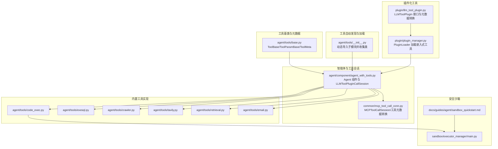
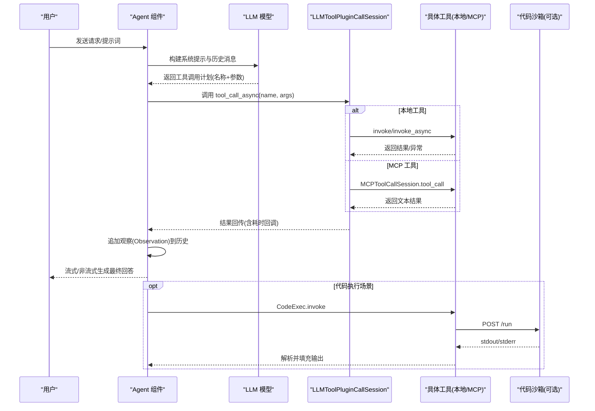
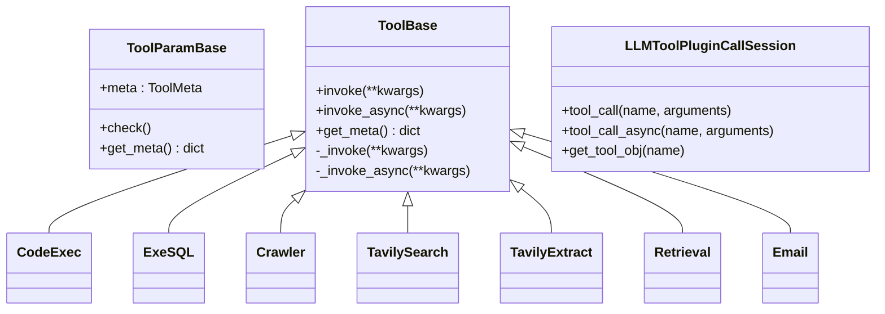
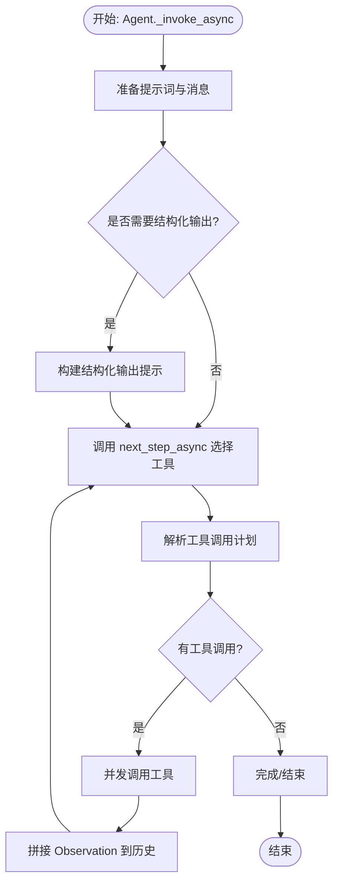
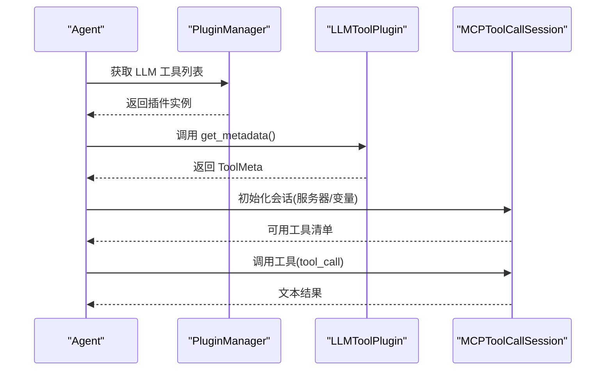
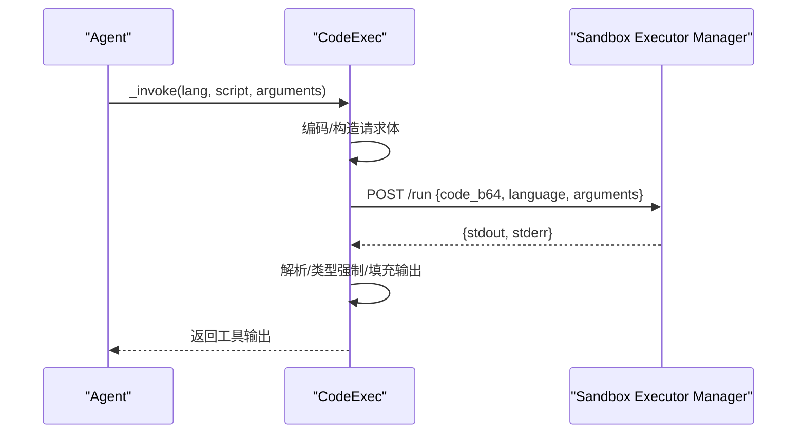
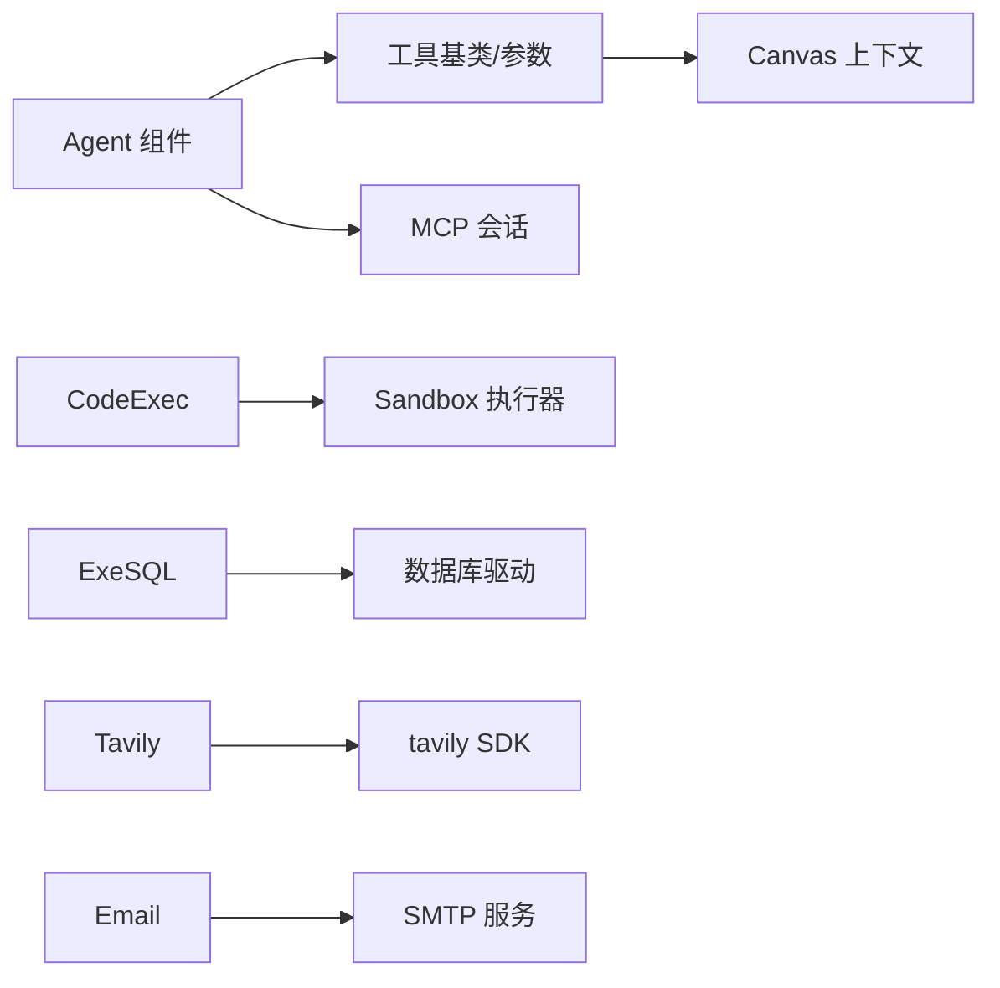

# 工具集成

<cite>
**本文引用的文件**
- [agent/tools/base.py](file://agent/tools/base.py)
- [agent/tools/__init__.py](file://agent/tools/__init__.py)
- [agent/component/agent_with_tools.py](file://agent/component/agent_with_tools.py)
- [plugin/llm_tool_plugin.py](file://plugin/llm_tool_plugin.py)
- [plugin/plugin_manager.py](file://plugin/plugin_manager.py)
- [agent/tools/code_exec.py](file://agent/tools/code_exec.py)
- [agent/tools/exesql.py](file://agent/tools/exesql.py)
- [agent/tools/crawler.py](file://agent/tools/crawler.py)
- [agent/tools/tavily.py](file://agent/tools/tavily.py)
- [agent/tools/retrieval.py](file://agent/tools/retrieval.py)
- [agent/tools/email.py](file://agent/tools/email.py)
- [common/mcp_tool_call_conn.py](file://common/mcp_tool_call_conn.py)
- [sandbox/executor_manager/main.py](file://sandbox/executor_manager/main.py)
- [docs/guides/agent/sandbox_quickstart.md](file://docs/guides/agent/sandbox_quickstart.md)
- [docs/references/http_api_reference.md](file://docs/references/http_api_reference.md)
</cite>

## 目录
1. [简介](#简介)
2. [项目结构](#项目结构)
3. [核心组件](#核心组件)
4. [架构总览](#架构总览)
5. [详细组件分析](#详细组件分析)
6. [依赖分析](#依赖分析)
7. [性能考量](#性能考量)
8. [故障排查指南](#故障排查指南)
9. [结论](#结论)
10. [附录](#附录)

## 简介
本文件面向工具集成系统的使用者与开发者，系统性阐述工具调用机制（注册、发现、调用、结果处理）、内置工具分类与使用方法、自定义工具开发流程、安全沙箱机制、工具链组合使用方式、API 参考以及性能优化与监控建议。目标是帮助你在智能体中高效、安全地使用与扩展工具能力。

## 项目结构
工具集成体系由“工具基类与元数据”“工具自动发现与加载”“智能体编排与工具调用会话”“插件化工具与 MCP 工具”“内置工具实现”“安全沙箱执行器”等模块构成。下图给出与工具相关的关键模块关系概览。

**图表来源**
- [agent/tools/base.py:126-181](file://agent/tools/base.py#L126-L181)
- [agent/tools/__init__.py:25-48](file://agent/tools/__init__.py#L25-L48)
- [agent/component/agent_with_tools.py:81-114](file://agent/component/agent_with_tools.py#L81-L114)
- [common/mcp_tool_call_conn.py:42-220](file://common/mcp_tool_call_conn.py#L42-L220)
- [plugin/llm_tool_plugin.py:22-52](file://plugin/llm_tool_plugin.py#L22-L52)
- [plugin/plugin_manager.py:17-46](file://plugin/plugin_manager.py#L17-L46)
- [agent/tools/code_exec.py:126-192](file://agent/tools/code_exec.py#L126-L192)
- [docs/guides/agent/sandbox_quickstart.md:20-58](file://docs/guides/agent/sandbox_quickstart.md#L20-L58)

**章节来源**
- [agent/tools/base.py:126-181](file://agent/tools/base.py#L126-L181)
- [agent/tools/__init__.py:25-48](file://agent/tools/__init__.py#L25-L48)
- [agent/component/agent_with_tools.py:81-114](file://agent/component/agent_with_tools.py#L81-L114)
- [common/mcp_tool_call_conn.py:42-220](file://common/mcp_tool_call_conn.py#L42-L220)
- [plugin/llm_tool_plugin.py:22-52](file://plugin/llm_tool_plugin.py#L22-L52)
- [plugin/plugin_manager.py:17-46](file://plugin/plugin_manager.py#L17-L46)
- [agent/tools/code_exec.py:126-192](file://agent/tools/code_exec.py#L126-L192)
- [docs/guides/agent/sandbox_quickstart.md:20-58](file://docs/guides/agent/sandbox_quickstart.md#L20-L58)

## 核心组件
- 工具基类与元数据
  - ToolBase/ToolParamBase 提供统一的工具生命周期、参数校验、输出管理与异步/同步调用封装。
  - ToolMeta/ToolParameter 定义工具元数据结构，用于向 LLM 暴露函数签名与参数约束。
- 工具会话与调用
  - LLMToolPluginCallSession 将工具名映射到具体工具对象，负责异步调用、超时与回调统计。
  - MCPToolCallSession 支持通过 MCP 协议连接外部工具服务器，实现跨进程/跨语言工具调用。
- 智能体编排
  - Agent 组件在运行时聚合本地工具与 MCP 工具，构建工具元数据列表，驱动 ReAct 式的工具选择与调用循环。
- 插件化工具
  - LLMToolPlugin 抽象出插件接口；PluginManager 使用 pluginlib 动态加载嵌入式工具插件。

**章节来源**
- [agent/tools/base.py:34-124](file://agent/tools/base.py#L34-L124)
- [agent/tools/base.py:126-181](file://agent/tools/base.py#L126-L181)
- [agent/component/agent_with_tools.py:38-114](file://agent/component/agent_with_tools.py#L38-L114)
- [common/mcp_tool_call_conn.py:42-220](file://common/mcp_tool_call_conn.py#L42-L220)
- [plugin/llm_tool_plugin.py:22-52](file://plugin/llm_tool_plugin.py#L22-L52)
- [plugin/plugin_manager.py:17-46](file://plugin/plugin_manager.py#L17-L46)

## 架构总览
工具调用从智能体开始，经由工具元数据暴露给 LLM，LLM 选择工具与参数后，由 Agent 的工具会话进行调用，最终将结果注入上下文或直接返回。

**图表来源**
- [agent/component/agent_with_tools.py:275-433](file://agent/component/agent_with_tools.py#L275-L433)
- [agent/tools/base.py:55-74](file://agent/tools/base.py#L55-L74)
- [common/mcp_tool_call_conn.py:205-220](file://common/mcp_tool_call_conn.py#L205-L220)
- [agent/tools/code_exec.py:164-191](file://agent/tools/code_exec.py#L164-L191)

## 详细组件分析

### 工具基类与元数据
- ToolParamBase
  - 从 ToolMeta 的 parameters 中初始化输入与默认值，生成 OpenAI 兼容的 function 调用元数据。
- ToolBase
  - 同步/异步 invoke 封装，统一异常捕获与输出设置；支持取消检查；提供标准化的“思考”提示。
- LLMToolPluginCallSession
  - 将工具名映射到工具对象；对 MCP 工具与本地工具分别处理；记录耗时并通过回调上报。

**图表来源**
- [agent/tools/base.py:77-181](file://agent/tools/base.py#L77-L181)
- [agent/tools/code_exec.py:126-192](file://agent/tools/code_exec.py#L126-L192)
- [agent/tools/exesql.py](file://agent/tools/exesql.py)
- [agent/tools/crawler.py:37-75](file://agent/tools/crawler.py#L37-L75)
- [agent/tools/tavily.py:101-148](file://agent/tools/tavily.py#L101-L148)
- [agent/tools/tavily.py:211-248](file://agent/tools/tavily.py#L211-L248)
- [agent/tools/retrieval.py:84-306](file://agent/tools/retrieval.py#L84-L306)
- [agent/tools/email.py:99-231](file://agent/tools/email.py#L99-L231)

**章节来源**
- [agent/tools/base.py:77-181](file://agent/tools/base.py#L77-L181)

### 工具自动发现与加载
- agent/tools/__init__.py
  - 遍历 tools 包内 Python 文件，排除以 “__” 开头、以 base 结尾的模块，动态导入并提取公开类，建立全局映射表。
  - 便于在配置中以组件名直接引用工具类，无需手动维护注册表。

**章节来源**
- [agent/tools/__init__.py:25-48](file://agent/tools/__init__.py#L25-L48)

### 智能体与工具会话
- Agent 组件
  - 从配置加载工具列表，为每个工具实例化并重命名（避免同名冲突），汇总工具元数据，绑定给 LLM。
  - 支持 MCP 工具：通过 MCPServerService 获取服务器信息，构造 MCPToolCallSession 并注入工具元数据。
  - ReAct 循环：解析 LLM 返回的工具调用计划，异步并发调用工具，拼接 Observation，必要时生成引用与引用标注。
- 回调与计时
  - LLMToolPluginCallSession 在每次工具调用后通过回调上报工具名、参数、结果与耗时，便于可观测性与审计。

**图表来源**
- [agent/component/agent_with_tools.py:176-274](file://agent/component/agent_with_tools.py#L176-L274)
- [agent/component/agent_with_tools.py:275-433](file://agent/component/agent_with_tools.py#L275-L433)

**章节来源**
- [agent/component/agent_with_tools.py:81-114](file://agent/component/agent_with_tools.py#L81-L114)
- [agent/component/agent_with_tools.py:176-274](file://agent/component/agent_with_tools.py#L176-L274)
- [agent/component/agent_with_tools.py:275-433](file://agent/component/agent_with_tools.py#L275-L433)

### 插件化工具与 MCP 工具
- LLMToolPlugin 接口
  - 规定工具元数据结构与调用入口，便于以插件形式扩展。
- PluginManager
  - 使用 pluginlib 扫描嵌入式插件目录，加载类型为 LLM_TOOLS 的插件，收集元数据并按名称检索。
- MCP 工具
  - MCPToolCallSession 建立与 MCP 服务器的长连接（SSE/Streamable HTTP），支持列出工具与调用工具，统一返回文本内容。
  - mcp_tool_metadata_to_openai_tool 将 MCP 工具元数据转换为 OpenAI 函数调用格式。

**图表来源**
- [plugin/llm_tool_plugin.py:22-52](file://plugin/llm_tool_plugin.py#L22-L52)
- [plugin/plugin_manager.py:17-46](file://plugin/plugin_manager.py#L17-L46)
- [common/mcp_tool_call_conn.py:42-220](file://common/mcp_tool_call_conn.py#L42-L220)

**章节来源**
- [plugin/llm_tool_plugin.py:22-52](file://plugin/llm_tool_plugin.py#L22-L52)
- [plugin/plugin_manager.py:17-46](file://plugin/plugin_manager.py#L17-L46)
- [common/mcp_tool_call_conn.py:42-220](file://common/mcp_tool_call_conn.py#L42-L220)

### 内置工具详解与使用要点

#### 搜索引擎工具
- TavilySearch/TavilyExtract
  - 支持搜索与网页提取，参数涵盖主题、域名白/黑名单、深度、格式等；内部将结果标准化为“正式化内容”与 JSON 输出，并写入引用。
  - 适合需要快速获取网络信息的场景。

**章节来源**
- [agent/tools/tavily.py:101-148](file://agent/tools/tavily.py#L101-L148)
- [agent/tools/tavily.py:211-248](file://agent/tools/tavily.py#L211-L248)

#### 数据库查询工具
- ExeSQL
  - 支持 MySQL、Postgres、MSSQL、Trino、DB2 等；自动参数注入、分页与类型转换；输出 JSON 与 Markdown 表格形式的“正式化内容”。

**章节来源**
- [agent/tools/exesql.py:79-282](file://agent/tools/exesql.py#L79-L282)

#### 代码执行工具
- CodeExec
  - 通过 HTTP 请求将编码后的代码提交至沙箱执行器（端口 9385）；解析 stdout，按输出模式（字典/数组/标量）填充工具输出；支持类型强制与路径取值。
  - 适用于需要在受控环境中运行脚本的任务。

**图表来源**
- [agent/tools/code_exec.py:145-191](file://agent/tools/code_exec.py#L145-L191)
- [sandbox/executor_manager/main.py:16-26](file://sandbox/executor_manager/main.py#L16-L26)

**章节来源**
- [agent/tools/code_exec.py:126-192](file://agent/tools/code_exec.py#L126-L192)
- [sandbox/executor_manager/main.py:16-26](file://sandbox/executor_manager/main.py#L16-L26)

#### 网络爬虫工具
- Crawler
  - 基于 AsyncWebCrawler 异步抓取指定 URL，支持返回 HTML、Markdown 或纯文本内容；具备代理与类型选择。

**章节来源**
- [agent/tools/crawler.py:37-75](file://agent/tools/crawler.py#L37-L75)

#### 知识库检索工具
- Retrieval
  - 支持知识库与记忆体检索；可结合交叉语言、目录增强、KG 增强、重排序模型；输出“正式化内容”与 JSON。

**章节来源**
- [agent/tools/retrieval.py:84-306](file://agent/tools/retrieval.py#L84-L306)

#### 邮件发送工具
- Email
  - 支持 SMTP SSL/TLS 发送邮件，自动处理收件人 CC/BCC、主题与 HTML 正文；具备重试与错误分类处理。

**章节来源**
- [agent/tools/email.py:99-231](file://agent/tools/email.py#L99-L231)

### 自定义工具开发流程
- 实现步骤
  - 新建类继承 ToolBase，并实现 _invoke 或 _invoke_async。
  - 定义 ToolParamBase 子类，设置 ToolMeta 的 name/description/parameters。
  - 在 tools 包中新增模块文件，确保不以 “__” 或 base 结尾，以便自动发现。
  - 在 Agent 的工具列表中引用该组件名即可生效。
- 参数与元数据
  - 使用 ToolParamBase 的 check 与 get_meta 自动生成 OpenAI 兼容的函数签名，便于 LLM 调用。
- 异常与输出
  - 统一通过 set_output 设置输出键值；异常会被捕获并写入 _ERROR；支持结构化输出与“正式化内容”。

**章节来源**
- [agent/tools/base.py:77-181](file://agent/tools/base.py#L77-L181)
- [agent/tools/base.py:126-181](file://agent/tools/base.py#L126-L181)

### 安全沙箱机制
- 沙箱架构
  - 使用 gVisor 对容器进行 syscall 级别的隔离；支持 seccomp 策略定制；通过 executor manager 管理语言基础镜像与执行器。
- 运行方式
  - 代码执行工具通过 HTTP 将编码后的代码提交到沙箱执行器；执行器返回标准输出与错误信息；工具侧负责解析与输出填充。
- 最佳实践
  - 仅在受信环境启用沙箱；合理设置超时与资源限制；对输入进行最小化信任与严格校验。

**章节来源**
- [docs/guides/agent/sandbox_quickstart.md:20-58](file://docs/guides/agent/sandbox_quickstart.md#L20-L58)
- [agent/tools/code_exec.py:145-191](file://agent/tools/code_exec.py#L145-L191)
- [sandbox/executor_manager/main.py:16-26](file://sandbox/executor_manager/main.py#L16-L26)

### 工具链组合使用
- 串联执行
  - Agent 的 ReAct 循环可并发调度多个工具；工具结果作为 Observation 注入历史，驱动后续决策。
- 结果传递
  - 工具输出可通过 set_output 以键值形式暴露；下游工具可读取上游变量；引用与正式化内容自动注入上下文。
- 错误恢复
  - 工具调用失败会写入 _ERROR；Agent 会将错误信息作为用户输入再次尝试；可配置最大轮次与重试间隔。

**章节来源**
- [agent/component/agent_with_tools.py:275-433](file://agent/component/agent_with_tools.py#L275-L433)

### API 参考
- HTTP API（OpenAI 兼容）
  - 聊天补全接口支持流式与非流式响应，额外参数可控制引用与元数据过滤。
  - 代理补全接口与聊天补全一致的请求/响应格式。
- 工具调用接口
  - 工具通过 Agent 的工具元数据暴露给 LLM；LLM 返回工具调用计划后由 Agent 会话执行。
  - MCP 工具通过 MCPToolCallSession 与外部服务器交互，统一返回文本内容。

**章节来源**
- [docs/references/http_api_reference.md:34-200](file://docs/references/http_api_reference.md#L34-L200)
- [agent/component/agent_with_tools.py:176-274](file://agent/component/agent_with_tools.py#L176-L274)

## 依赖分析
- 组件耦合
  - Agent 依赖工具基类与工具元数据；工具依赖 Canvas 与参数校验；MCP 工具依赖 MCP 会话与服务器配置。
- 外部依赖
  - 代码执行依赖沙箱执行器服务；数据库工具依赖对应驱动；搜索引擎工具依赖第三方 SDK；邮件工具依赖 SMTP。
- 循环依赖
  - 工具基类在 ToolBase 中局部导入 Canvas，避免循环导入。

**图表来源**
- [agent/component/agent_with_tools.py:81-114](file://agent/component/agent_with_tools.py#L81-L114)
- [agent/tools/code_exec.py:145-191](file://agent/tools/code_exec.py#L145-L191)
- [agent/tools/exesql.py:126-194](file://agent/tools/exesql.py#L126-L194)
- [agent/tools/tavily.py:113-145](file://agent/tools/tavily.py#L113-L145)
- [agent/tools/email.py:147-181](file://agent/tools/email.py#L147-L181)

**章节来源**
- [agent/component/agent_with_tools.py:81-114](file://agent/component/agent_with_tools.py#L81-L114)
- [agent/tools/code_exec.py:145-191](file://agent/tools/code_exec.py#L145-L191)
- [agent/tools/exesql.py:126-194](file://agent/tools/exesql.py#L126-L194)
- [agent/tools/tavily.py:113-145](file://agent/tools/tavily.py#L113-L145)
- [agent/tools/email.py:147-181](file://agent/tools/email.py#L147-L181)

## 性能考量
- 超时与重试
  - 工具调用普遍采用装饰器设置超时；部分工具支持重试与延迟间隔，降低瞬时失败影响。
- 并发与流式
  - Agent 的 ReAct 循环并发调度工具；支持流式输出与引用生成，减少等待时间。
- 资源限制
  - 代码执行通过沙箱与执行器管理资源；数据库工具限制最大记录数；搜索引擎工具限制结果数量。
- 监控与回调
  - 工具会话在每次调用后回调工具名、参数、结果与耗时，便于性能观测与告警。

**章节来源**
- [agent/tools/base.py:55-74](file://agent/tools/base.py#L55-L74)
- [agent/component/agent_with_tools.py:275-433](file://agent/component/agent_with_tools.py#L275-L433)
- [agent/tools/exesql.py:55-69](file://agent/tools/exesql.py#L55-L69)
- [agent/tools/tavily.py:118-145](file://agent/tools/tavily.py#L118-L145)

## 故障排查指南
- 工具未被识别
  - 检查工具模块文件命名是否符合自动发现规则；确认工具类未以下划线开头且位于 tools 包内。
- 工具调用超时
  - 调整 COMPONENT_EXEC_TIMEOUT 环境变量；检查外部服务（如数据库、搜索引擎、SMTP、沙箱）连通性与认证。
- MCP 工具不可用
  - 校验 MCP 服务器地址、传输类型（SSE/Streamable HTTP）与认证头；查看会话初始化与任务队列日志。
- 代码执行失败
  - 查看沙箱执行器日志；确认语言与运行时镜像已构建；检查 seccomp 策略是否过于严格。
- 数据库连接失败
  - 校验主机、端口、用户名、密码与数据库类型；注意安全限制（如禁止特定库名）。

**章节来源**
- [agent/tools/__init__.py:25-48](file://agent/tools/__init__.py#L25-L48)
- [common/mcp_tool_call_conn.py:59-114](file://common/mcp_tool_call_conn.py#L59-L114)
- [agent/tools/code_exec.py:164-191](file://agent/tools/code_exec.py#L164-L191)
- [agent/tools/exesql.py:64-69](file://agent/tools/exesql.py#L64-L69)

## 结论
本工具集成体系以统一的工具基类与元数据为核心，结合智能体的 ReAct 编排、插件化与 MCP 工具扩展，实现了从注册、发现、调用到结果处理的完整闭环。通过沙箱与 MCP 会话保障执行安全与跨语言兼容，配合完善的监控与错误恢复机制，能够稳定支撑复杂工具链的组合使用。

## 附录
- 快速开始（沙箱）
  - 参考沙箱快速入门文档，了解 gVisor、Docker、执行器镜像与 Makefile 的使用方式。
- HTTP API
  - 参考 HTTP API 参考，掌握聊天与代理补全接口的请求/响应格式与参数。

**章节来源**
- [docs/guides/agent/sandbox_quickstart.md:20-58](file://docs/guides/agent/sandbox_quickstart.md#L20-L58)
- [docs/references/http_api_reference.md:34-200](file://docs/references/http_api_reference.md#L34-L200)