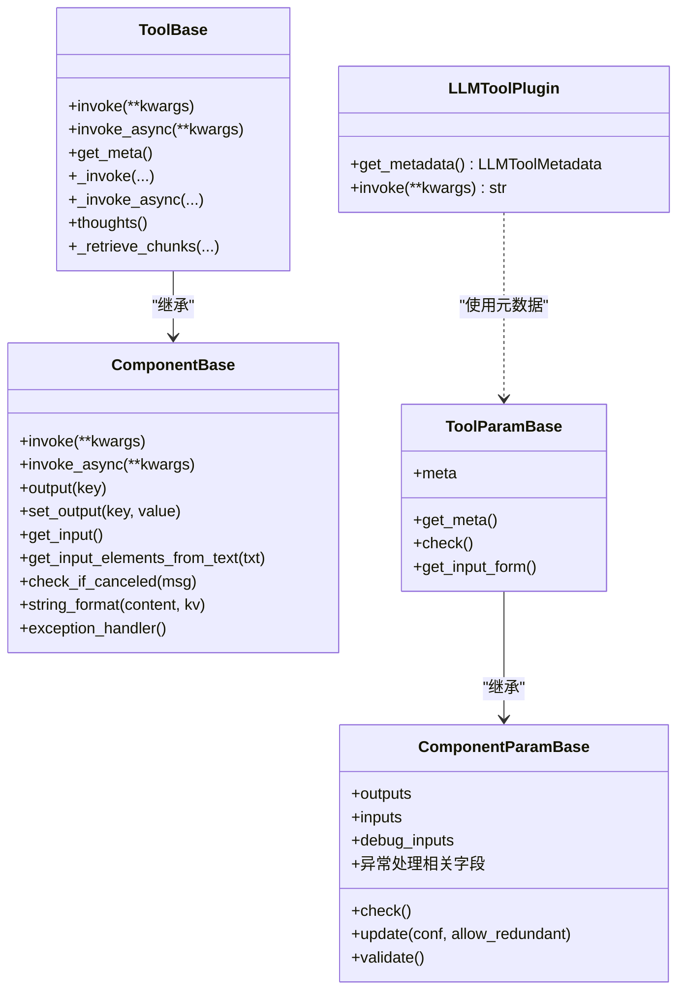
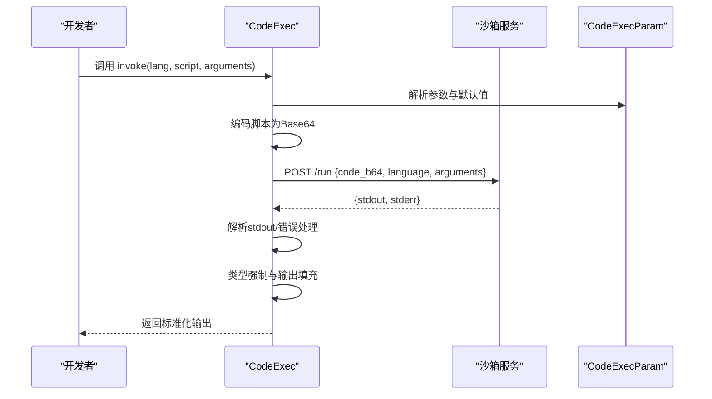
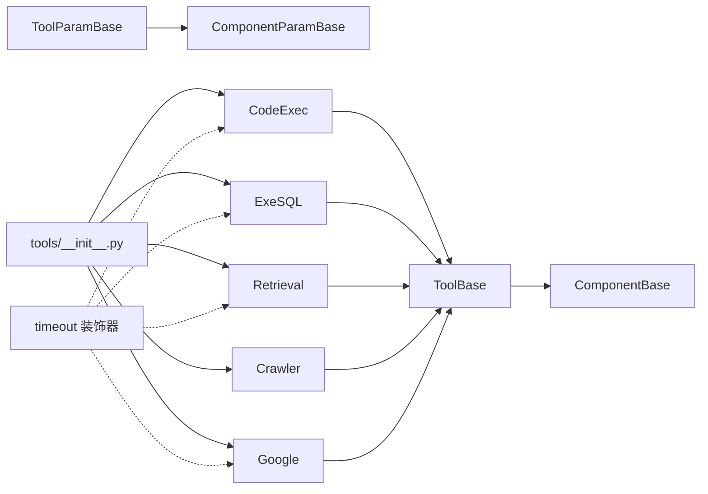

# 自定义工具开发

<cite>
**本文引用的文件**
- [agent/tools/base.py](file://agent/tools/base.py)
- [agent/component/base.py](file://agent/component/base.py)
- [agent/tools/__init__.py](file://agent/tools/__init__.py)
- [agent/tools/code_exec.py](file://agent/tools/code_exec.py)
- [agent/tools/exesql.py](file://agent/tools/exesql.py)
- [agent/tools/retrieval.py](file://agent/tools/retrieval.py)
- [agent/tools/crawler.py](file://agent/tools/crawler.py)
- [agent/tools/google.py](file://agent/tools/google.py)
- [plugin/llm_tool_plugin.py](file://plugin/llm_tool_plugin.py)
- [common/connection_utils.py](file://common/connection_utils.py)
</cite>

## 目录
1. [简介](#简介)
2. [项目结构](#项目结构)
3. [核心组件](#核心组件)
4. [架构总览](#架构总览)
5. [详细组件分析](#详细组件分析)
6. [依赖分析](#依赖分析)
7. [性能考量](#性能考量)
8. [故障排查指南](#故障排查指南)
9. [结论](#结论)
10. [附录](#附录)

## 简介
本指南面向希望在系统中扩展“自定义工具”的开发者，围绕工具基类设计、元数据定义、生命周期管理、参数校验与类型推断、异步执行与超时控制、输出标准化、以及安全与调试测试等方面进行系统化说明。文档以现有工具实现为蓝本，提供可直接参考的开发范式与最佳实践。

## 项目结构
与自定义工具开发直接相关的核心模块位于 agent/tools 与 agent/component 下，并通过插件机制与通用连接工具协同工作：
- 工具基类与元数据：agent/tools/base.py
- 组件基类（参数、生命周期、输入输出）：agent/component/base.py
- 工具自动发现与注册：agent/tools/__init__.py
- 典型工具实现示例：agent/tools/code_exec.py、agent/tools/exesql.py、agent/tools/retrieval.py、agent/tools/crawler.py、agent/tools/google.py
- 插件接口与元数据转换：plugin/llm_tool_plugin.py
- 超时装饰器与响应构造：common/connection_utils.py

```mermaid
graph TB
subgraph "工具层"
TBase["ToolBase<br/>工具基类"]
TParam["ToolParamBase<br/>参数基类"]
Meta["ToolMeta<br/>元数据结构"]
end
subgraph "组件层"
CBase["ComponentBase<br/>组件基类"]
CParam["ComponentParamBase<br/>组件参数基类"]
end
subgraph "工具实现示例"
Exec["CodeExec<br/>代码执行工具"]
SQL["ExeSQL<br/>数据库执行工具"]
R["Retrieval<br/>检索工具"]
Crawl["Crawler<br/>网页抓取工具"]
G["Google<br/>搜索引擎工具"]
end
subgraph "插件与工具发现"
LLMTool["LLMToolPlugin<br/>插件接口"]
ToolsInit["tools/__init__.py<br/>自动发现注册"]
end
subgraph "通用能力"
Timeout["timeout 装饰器"]
Resp["响应构造"]
end
TBase --> CBase
TParam --> CParam
Meta --> TParam
Exec --> TBase
SQL --> TBase
R --> TBase
Crawl --> TBase
G --> TBase
LLMTool --> TBase
ToolsInit --> Exec
ToolsInit --> SQL
ToolsInit --> R
ToolsInit --> Crawl
ToolsInit --> G
Timeout -.-> Exec
Timeout -.-> SQL
Timeout -.-> R
Timeout -.-> G
Resp -.-> Exec
Resp -.-> SQL
Resp -.-> R
Resp -.-> G
```

图表来源
- [agent/tools/base.py:126-216](file://agent/tools/base.py#L126-L216)
- [agent/component/base.py:365-585](file://agent/component/base.py#L365-L585)
- [agent/tools/__init__.py:25-47](file://agent/tools/__init__.py#L25-L47)
- [agent/tools/code_exec.py:126-344](file://agent/tools/code_exec.py#L126-L344)
- [agent/tools/exesql.py:79-282](file://agent/tools/exesql.py#L79-L282)
- [agent/tools/retrieval.py:84-306](file://agent/tools/retrieval.py#L84-L306)
- [agent/tools/crawler.py:37-75](file://agent/tools/crawler.py#L37-L75)
- [agent/tools/google.py:116-173](file://agent/tools/google.py#L116-L173)
- [plugin/llm_tool_plugin.py:22-52](file://plugin/llm_tool_plugin.py#L22-L52)
- [common/connection_utils.py:30-101](file://common/connection_utils.py#L30-L101)

章节来源
- [agent/tools/base.py:126-216](file://agent/tools/base.py#L126-L216)
- [agent/component/base.py:365-585](file://agent/component/base.py#L365-L585)
- [agent/tools/__init__.py:25-47](file://agent/tools/__init__.py#L25-L47)
- [common/connection_utils.py:30-101](file://common/connection_utils.py#L30-L101)

## 核心组件
本节聚焦工具开发的“最小可用”接口与规范，涵盖：
- 工具基类与参数基类的职责边界
- 元数据结构与函数式元数据生成
- 生命周期钩子（初始化、执行、清理）
- 输入输出模型与调试辅助
- 异步执行与超时控制
- 安全与错误处理策略

章节来源
- [agent/tools/base.py:126-216](file://agent/tools/base.py#L126-L216)
- [agent/component/base.py:365-585](file://agent/component/base.py#L365-L585)
- [common/connection_utils.py:30-101](file://common/connection_utils.py#L30-L101)

## 架构总览
下图展示了工具开发的整体架构：工具实现基于 ToolBase/ToolParamBase，参数校验与生命周期由 ComponentBase/ComponentParamBase 提供；典型工具通过超时装饰器保障稳定性；工具元数据用于向 LLM 暴露函数签名；工具自动发现模块负责注册与导出。

图表来源
- [agent/tools/base.py:77-216](file://agent/tools/base.py#L77-L216)
- [agent/component/base.py:40-585](file://agent/component/base.py#L40-L585)
- [plugin/llm_tool_plugin.py:22-52](file://plugin/llm_tool_plugin.py#L22-L52)

## 详细组件分析

### 工具基类与参数基类
- ToolBase
  - 提供统一的同步/异步调用入口，封装异常捕获、取消检查、耗时统计与输出写入。
  - 必须实现 _invoke 或 _invoke_async，支持协程与线程池回退。
  - 提供 _retrieve_chunks 辅助方法，将检索结果标准化并注入引用与格式化内容。
- ToolParamBase
  - 从 meta 中提取参数规格，动态生成函数式元数据（OpenAI 函数调用格式），包含参数类型、必填项、枚举约束等。
  - 支持默认值注入与输入表单生成（get_input_form）。
- ToolMeta 与 ToolParameter
  - 定义工具元数据结构，包含 name、displayName、description、displayDescription、parameters 等字段。

章节来源
- [agent/tools/base.py:77-216](file://agent/tools/base.py#L77-L216)

### 组件基类与参数基类
- ComponentBase
  - 统一的组件生命周期：初始化校验、执行（同步/异步）、错误处理、输出写入、耗时统计。
  - 取消机制：check_if_canceled 在任务被取消时记录日志并设置错误输出。
  - 输入解析：支持变量引用解析、字符串格式化、上游引用读取。
  - 输出模型：统一的输出字典结构，支持类型标注与默认值。
- ComponentParamBase
  - 参数校验工具集：字符串、非空、正整数/数、范围、布尔、枚举等。
  - 配置更新：递归更新嵌套参数，支持冗余参数检测与废弃参数提示。
  - 参数验证：支持从 JSON 文件加载校验规则并进行运行时校验。

章节来源
- [agent/component/base.py:40-585](file://agent/component/base.py#L40-L585)

### 工具自动发现与注册
- agent/tools/__init__.py
  - 动态扫描 agent/tools 目录下的工具模块，导入并提取公开类，建立工具名到类的映射，便于统一注册与使用。

章节来源
- [agent/tools/__init__.py:25-47](file://agent/tools/__init__.py#L25-L47)

### 典型工具实现示例

#### 代码执行工具（CodeExec）
- 功能要点
  - 接收 Base64 编码的代码与语言标识，通过沙箱服务执行并解析标准输出。
  - 支持 Python/JavaScript，要求主函数命名与导出规范。
  - 输出解析与类型强制：支持字符串、数字、布尔、数组、对象等类型推断与转换。
  - 输出模式：支持按路径提取、列表索引、标量回退三种方式。
- 关键点
  - 使用 timeout 装饰器控制执行时间。
  - 通过请求体传递编码后的代码与参数，解析沙箱返回的 JSON 并处理错误流。
  - 将解析结果写入 outputs，支持多字段输出与类型约束。

图表来源
- [agent/tools/code_exec.py:126-344](file://agent/tools/code_exec.py#L126-L344)

章节来源
- [agent/tools/code_exec.py:126-344](file://agent/tools/code_exec.py#L126-L344)

#### 数据库执行工具（ExeSQL）
- 功能要点
  - 支持多种数据库驱动（MySQL、Postgres、MSSQL、Trino、DB2 等）。
  - SQL 参数化与变量替换，避免注入风险。
  - 结果集转 DataFrame 并格式化为 Markdown，同时保留原始 JSON。
  - 安全限制：禁止对特定数据库名与密码组合的默认配置进行直接访问。
- 关键点
  - 使用 timeout 装饰器限制查询时间。
  - 对 Decimal/NaN/Inf 做兼容处理，确保 JSON 序列化安全。
  - 输出包含 JSON 与格式化文本两部分，便于后续组件消费。

章节来源
- [agent/tools/exesql.py:79-282](file://agent/tools/exesql.py#L79-L282)

#### 检索工具（Retrieval）
- 功能要点
  - 支持知识库与记忆体两种检索源，可按 KB ID 列表或记忆体 ID 列表检索。
  - 支持跨语言增强、目录树增强、元数据过滤、重排等高级特性。
  - 输出标准化：引用注入、格式化内容与 JSON 结果双通道。
- 关键点
  - 异步实现：_invoke_async 为主入口，内部根据配置选择检索路径。
  - 取消检查：在每个关键步骤后检查任务是否被取消。
  - 超时控制：通过 timeout 装饰器限制检索时间。

章节来源
- [agent/tools/retrieval.py:84-306](file://agent/tools/retrieval.py#L84-L306)

#### 网页抓取工具（Crawler）
- 功能要点
  - 基于 AsyncWebCrawler 的异步抓取，支持 HTML、Markdown、纯内容三种抽取模式。
  - URL 校验与代理配置。
- 关键点
  - 异步运行，支持取消。
  - 输出采用统一的 be_output 辅助（此处为简化示意）。

章节来源
- [agent/tools/crawler.py:37-75](file://agent/tools/crawler.py#L37-L75)

#### 搜索引擎工具（Google）
- 功能要点
  - 基于 SerpApi 的 Google 搜索，支持国家/语言参数与分页。
  - 多次重试与延迟退避，异常记录与错误输出。
  - 将搜索结果标准化为引用与格式化内容。
- 关键点
  - 使用 _retrieve_chunks 将结果注入引用与格式化内容。
  - 超时与重试策略结合，提升鲁棒性。

章节来源
- [agent/tools/google.py:116-173](file://agent/tools/google.py#L116-L173)

### 插件接口与元数据转换
- LLMToolPlugin
  - 作为插件父类，要求实现 get_metadata 以暴露工具元数据。
  - 提供 invoke 方法占位，便于外部调用。
- 元数据到 OpenAI 函数签名的转换
  - 将 LLMToolMetadata 转换为 OpenAI 函数调用所需的 function 对象，包含参数类型、描述与必填项。

章节来源
- [plugin/llm_tool_plugin.py:22-52](file://plugin/llm_tool_plugin.py#L22-L52)

## 依赖分析
- 工具与组件的继承关系清晰：ToolBase/ToolParamBase 继承自 ComponentBase/ComponentParamBase，复用参数校验、生命周期与输入输出模型。
- 工具自动发现模块通过动态导入实现工具注册，降低手工维护成本。
- 超时装饰器在多个工具中被广泛使用，统一了执行时间控制与异常处理策略。
- 插件接口与元数据转换为 LLM 工具生态提供了标准化的对接方式。

图表来源
- [agent/tools/base.py:126-216](file://agent/tools/base.py#L126-L216)
- [agent/component/base.py:365-585](file://agent/component/base.py#L365-L585)
- [agent/tools/__init__.py:25-47](file://agent/tools/__init__.py#L25-L47)
- [common/connection_utils.py:30-101](file://common/connection_utils.py#L30-L101)

章节来源
- [agent/tools/base.py:126-216](file://agent/tools/base.py#L126-L216)
- [agent/component/base.py:365-585](file://agent/component/base.py#L365-L585)
- [agent/tools/__init__.py:25-47](file://agent/tools/__init__.py#L25-L47)
- [common/connection_utils.py:30-101](file://common/connection_utils.py#L30-L101)

## 性能考量
- 执行时间控制
  - 使用 timeout 装饰器为工具执行设置上限，避免阻塞与资源耗尽。
  - 对长耗时操作（如数据库查询、网络请求）建议配合重试与退避策略。
- 异步优先
  - 优先实现 _invoke_async，减少阻塞；若必须同步，使用线程池执行以避免阻塞事件循环。
- 输出与序列化
  - 对大结果集进行分页/截断，避免一次性序列化造成内存压力。
  - 对特殊数值类型（如 Decimal、NaN、Inf）进行兼容处理，确保 JSON 安全。
- 取消与中断
  - 在关键路径调用 check_if_canceled，及时响应取消信号，释放资源。

[本节为通用指导，无需列出具体文件来源]

## 故障排查指南
- 常见问题与定位
  - 工具未生效：确认工具类已通过 agent/tools/__init__.py 自动发现并注册。
  - 参数校验失败：检查 ToolParamBase.check 中的校验逻辑与输入值范围。
  - 执行超时：调整环境变量中的超时阈值或优化工具内部逻辑。
  - 输出为空：检查 ToolBase.invoke/async 的输出写入与格式化逻辑。
  - 取消无效：确保在工具内部周期性调用 check_if_canceled。
- 日志与调试
  - 使用 set_output 写入 _ERROR 字段，便于统一收集错误信息。
  - 在关键步骤打印日志，定位异常发生位置。
- 安全加固
  - 严格校验输入参数，避免注入与越权访问。
  - 对外部服务调用增加超时与重试，防止雪崩效应。
  - 对敏感配置（如数据库凭据、API Key）进行最小化暴露与轮换。

章节来源
- [agent/tools/base.py:139-180](file://agent/tools/base.py#L139-L180)
- [agent/component/base.py:393-447](file://agent/component/base.py#L393-L447)
- [agent/tools/exesql.py:55-69](file://agent/tools/exesql.py#L55-L69)
- [agent/tools/code_exec.py:151-191](file://agent/tools/code_exec.py#L151-L191)
- [agent/tools/google.py:137-166](file://agent/tools/google.py#L137-L166)

## 结论
通过统一的工具基类与参数基类，结合严格的参数校验、生命周期管理、异步执行与超时控制，开发者可以快速构建稳定、可维护且可被 LLM 调用的自定义工具。借助工具自动发现与插件元数据转换，工具能够无缝融入系统生态，满足多样化的业务需求。

[本节为总结性内容，无需列出具体文件来源]

## 附录

### 开发流程与最佳实践
- 从零开始创建工具
  - 新建文件：在 agent/tools 下新增工具模块，定义 ToolParamBase 子类与 ToolBase 子类。
  - 元数据定义：在 ToolParamBase.meta 中声明工具名称、描述与参数规格。
  - 实现 _invoke 或 _invoke_async：完成业务逻辑，遵循取消检查与超时控制。
  - 输出标准化：通过 set_output 写入 JSON 与格式化内容，必要时使用 _retrieve_chunks。
  - 注册与导出：保持模块名不以 base 开头，确保被 agent/tools/__init__.py 自动发现。
- 测试与验证
  - 单元测试：针对参数校验、输入解析、输出格式进行覆盖。
  - 集成测试：模拟真实调用链路，验证工具在工作流中的行为。
  - 性能压测：评估工具在高并发与大数据量下的表现，调整超时与重试策略。
- 部署与集成
  - 将工具纳入 CI/CD 流水线，确保变更可追溯。
  - 通过插件接口与元数据转换，使工具可被 LLM 生态识别与调用。

[本节为流程性建议，无需列出具体文件来源]