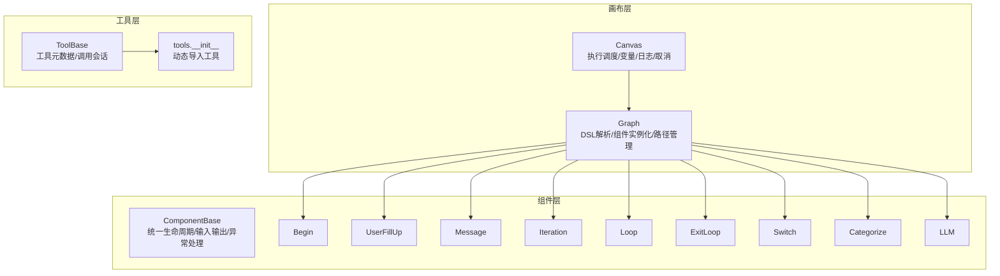
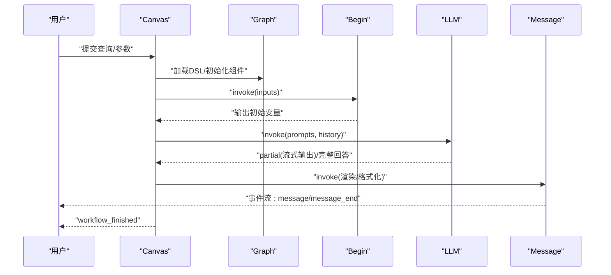
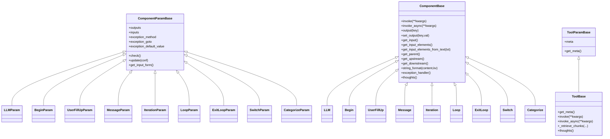
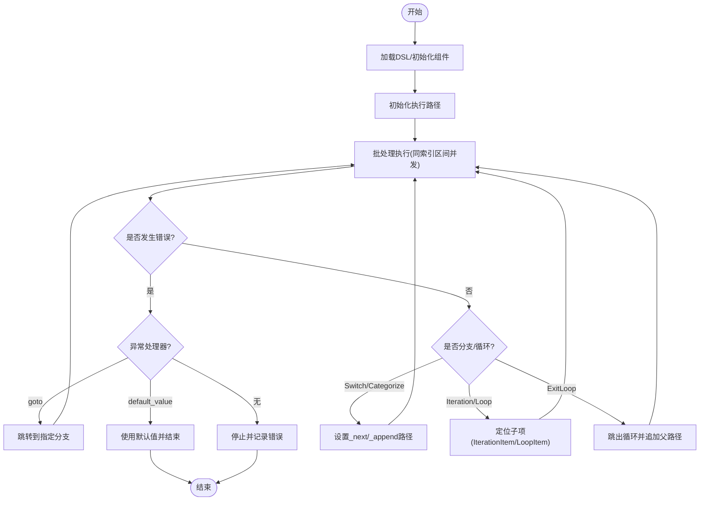
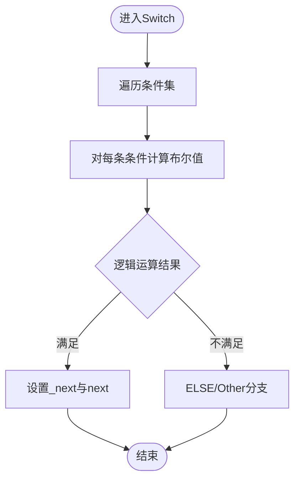
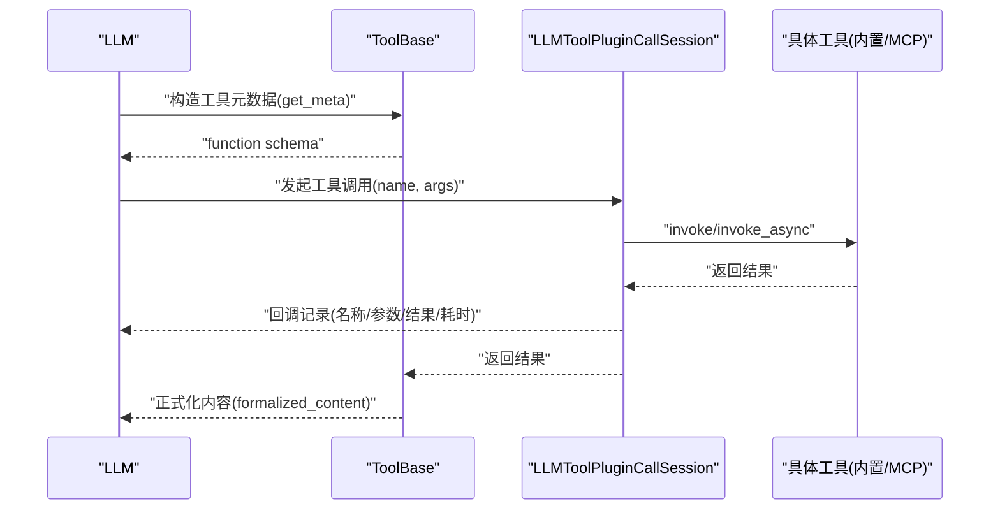
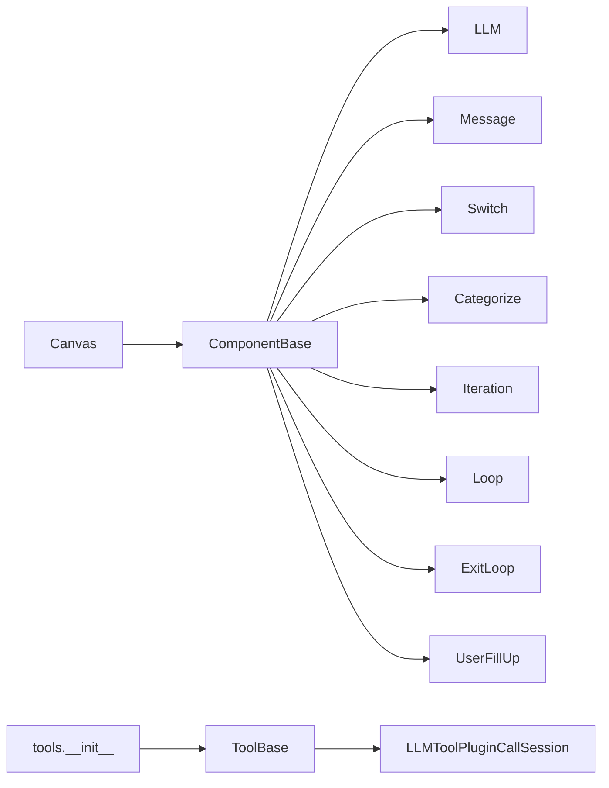

# 智能体系统

<cite>
**本文引用的文件**
- [agent/canvas.py](file://agent/canvas.py)
- [agent/component/base.py](file://agent/component/base.py)
- [agent/component/begin.py](file://agent/component/begin.py)
- [agent/component/message.py](file://agent/component/message.py)
- [agent/component/iteration.py](file://agent/component/iteration.py)
- [agent/component/loop.py](file://agent/component/loop.py)
- [agent/component/fillup.py](file://agent/component/fillup.py)
- [agent/component/exit_loop.py](file://agent/component/exit_loop.py)
- [agent/component/switch.py](file://agent/component/switch.py)
- [agent/component/categorize.py](file://agent/component/categorize.py)
- [agent/component/llm.py](file://agent/component/llm.py)
- [agent/tools/base.py](file://agent/tools/base.py)
- [agent/tools/__init__.py](file://agent/tools/__init__.py)
- [agent/settings.py](file://agent/settings.py)
</cite>

## 目录
1. [简介](#简介)
2. [项目结构](#项目结构)
3. [核心组件](#核心组件)
4. [架构总览](#架构总览)
5. [详细组件分析](#详细组件分析)
6. [依赖分析](#依赖分析)
7. [性能考虑](#性能考虑)
8. [故障排查指南](#故障排查指南)
9. [结论](#结论)
10. [附录：模板与最佳实践](#附录模板与最佳实践)

## 简介
本文件面向“智能体系统”的使用者与开发者，系统性阐述智能体工作流的编排原理、组件体系、工具调用机制、决策循环与状态管理，并提供模板示例、工具开发指南与调试监控最佳实践。目标是帮助读者快速理解并构建稳定可靠的智能体应用。

## 项目结构
智能体系统以“画布（Canvas）+ 组件（Component）+ 工具（Tool）”为核心组织方式：
- 画布负责加载 DSL、维护全局变量与执行路径、驱动组件按拓扑顺序执行、处理异常与分支。
- 组件是可插拔的执行单元，统一继承自基础类，支持同步/异步调用、输入输出参数校验、错误恢复策略。
- 工具通过统一接口注册与调用，既可对接内置工具，也可通过 MCP 扩展外部能力。

图表来源
- [agent/canvas.py](file://agent/canvas.py)
- [agent/component/base.py](file://agent/component/base.py)
- [agent/component/begin.py](file://agent/component/begin.py)
- [agent/component/message.py](file://agent/component/message.py)
- [agent/component/iteration.py](file://agent/component/iteration.py)
- [agent/component/loop.py](file://agent/component/loop.py)
- [agent/component/fillup.py](file://agent/component/fillup.py)
- [agent/component/exit_loop.py](file://agent/component/exit_loop.py)
- [agent/component/switch.py](file://agent/component/switch.py)
- [agent/component/categorize.py](file://agent/component/categorize.py)
- [agent/component/llm.py](file://agent/component/llm.py)
- [agent/tools/base.py](file://agent/tools/base.py)
- [agent/tools/__init__.py](file://agent/tools/__init__.py)

章节来源
- [agent/canvas.py](file://agent/canvas.py)
- [agent/component/base.py](file://agent/component/base.py)
- [agent/tools/base.py](file://agent/tools/base.py)
- [agent/tools/__init__.py](file://agent/tools/__init__.py)

## 核心组件
- 基础组件基类
  - 统一生命周期：初始化、输入解析、执行（同步/异步）、输出、重置、异常处理。
  - 参数校验：支持嵌套深度限制、参数合法性检查、废弃参数警告。
  - 变量引用：支持在字符串中使用占位符引用全局/上游组件输出。
- 入口组件
  - Begin：根据模式（会话/任务/Webhook）准备初始输入，支持文件上传预处理。
  - UserFillUp：交互式收集用户表单输入，支持提示文案渲染。
- 流程控制
  - Iteration/IterationItem：对数组进行迭代，逐项进入下游子图。
  - Loop/LoopItem/ExitLoop：基于变量与终止条件的循环，支持退出。
  - Switch/Categorize：条件判断与分类分流，支持多条件组合与逻辑运算。
- 输出与消息
  - Message：内容模板渲染、流式输出、格式转换（Markdown/HTML/PDF/DOCX/XLSX）、记忆存储。
- 大模型组件
  - LLM：系统提示词与消息组装、流式/非流式生成、结构化输出、引用注入、思考片段处理。
- 工具基座
  - ToolBase：工具元数据描述、调用会话封装、检索结果归一化、回调记录工具调用轨迹。

章节来源
- [agent/component/base.py](file://agent/component/base.py)
- [agent/component/begin.py](file://agent/component/begin.py)
- [agent/component/fillup.py](file://agent/component/fillup.py)
- [agent/component/iteration.py](file://agent/component/iteration.py)
- [agent/component/loop.py](file://agent/component/loop.py)
- [agent/component/exit_loop.py](file://agent/component/exit_loop.py)
- [agent/component/switch.py](file://agent/component/switch.py)
- [agent/component/categorize.py](file://agent/component/categorize.py)
- [agent/component/message.py](file://agent/component/message.py)
- [agent/component/llm.py](file://agent/component/llm.py)
- [agent/tools/base.py](file://agent/tools/base.py)

## 架构总览
智能体运行时由 Canvas 驱动，按组件拓扑路径顺序执行，支持：
- 并发执行：线程池并发触发多个组件 invoke。
- 流式输出：Message/LLM 支持增量输出，配合前端事件流。
- 分支与循环：Switch/Categorize/Iteration/Loop/ExitLoop 控制执行路径。
- 错误恢复：异常处理器可设置默认值或跳转到指定分支。
- 取消与日志：任务级取消标记、Redis 日志追踪、TTS 音频合成。

图表来源
- [agent/canvas.py](file://agent/canvas.py)
- [agent/component/begin.py](file://agent/component/begin.py)
- [agent/component/llm.py](file://agent/component/llm.py)
- [agent/component/message.py](file://agent/component/message.py)

章节来源
- [agent/canvas.py](file://agent/canvas.py)

## 详细组件分析

### 组件类层次与关系

图表来源
- [agent/component/base.py](file://agent/component/base.py)
- [agent/component/llm.py](file://agent/component/llm.py)
- [agent/component/begin.py](file://agent/component/begin.py)
- [agent/component/fillup.py](file://agent/component/fillup.py)
- [agent/component/message.py](file://agent/component/message.py)
- [agent/component/iteration.py](file://agent/component/iteration.py)
- [agent/component/loop.py](file://agent/component/loop.py)
- [agent/component/exit_loop.py](file://agent/component/exit_loop.py)
- [agent/component/switch.py](file://agent/component/switch.py)
- [agent/component/categorize.py](file://agent/component/categorize.py)
- [agent/tools/base.py](file://agent/tools/base.py)

章节来源
- [agent/component/base.py](file://agent/component/base.py)
- [agent/component/llm.py](file://agent/component/llm.py)
- [agent/component/begin.py](file://agent/component/begin.py)
- [agent/component/fillup.py](file://agent/component/fillup.py)
- [agent/component/message.py](file://agent/component/message.py)
- [agent/component/iteration.py](file://agent/component/iteration.py)
- [agent/component/loop.py](file://agent/component/loop.py)
- [agent/component/exit_loop.py](file://agent/component/exit_loop.py)
- [agent/component/switch.py](file://agent/component/switch.py)
- [agent/component/categorize.py](file://agent/component/categorize.py)
- [agent/tools/base.py](file://agent/tools/base.py)

### 执行顺序与拓扑控制
- 路径推进规则
  - 常规：按下游列表顺序追加。
  - 分支：Switch/Categorize 设置 _next，指向下一组组件。
  - 循环：Iteration/Loop 定位子项（IterationItem/LoopItem），ExitLoop 触发跳出。
  - 异常：异常处理器可 goto 指定分支或回退默认值。
- 并发批处理：Canvas 在同一索引区间内并发触发组件 invoke，提升吞吐。
- 用户输入：当存在 UserFillUp 时，暂停等待用户补充输入后继续。

图表来源
- [agent/canvas.py](file://agent/canvas.py)

章节来源
- [agent/canvas.py](file://agent/canvas.py)

### 决策循环与状态管理
- 条件判断（Switch）
  - 支持多条件组合与逻辑运算（and/or），比较操作符覆盖字符串/数值/空值等。
  - 输出 next 与 _next，决定下一批次执行的组件集合。
- 分类（Categorize）
  - 基于 LLM 的分类器，结合类别描述与示例，返回最匹配类别并设置分流路径。
- 循环（Loop/ExitLoop）
  - 初始化循环变量，按最大次数与终止条件推进；ExitLoop 触发后沿父组件下游继续。
- 迭代（Iteration）
  - 将数组元素逐个注入子项（IterationItem），实现批量处理。

图表来源
- [agent/component/switch.py](file://agent/component/switch.py)

章节来源
- [agent/component/switch.py](file://agent/component/switch.py)
- [agent/component/categorize.py](file://agent/component/categorize.py)
- [agent/component/iteration.py](file://agent/component/iteration.py)
- [agent/component/loop.py](file://agent/component/loop.py)
- [agent/component/exit_loop.py](file://agent/component/exit_loop.py)

### 工具调用机制
- 工具元数据
  - ToolParamBase 从 meta 中提取参数定义，生成 OpenAI Function Call 格式的函数描述。
- 调用会话
  - LLMToolPluginCallSession 封装工具调用，支持同步/异步、MCP 工具、线程池执行与耗时回调。
- 检索增强
  - ToolBase 提供 _retrieve_chunks，将检索结果归一化并写入画布引用，便于后续引用注入与溯源。
- 动态注册
  - tools/__init__.py 自动扫描并导入工具模块，构建工具映射表。

图表来源
- [agent/tools/base.py](file://agent/tools/base.py)
- [agent/tools/__init__.py](file://agent/tools/__init__.py)
- [agent/component/llm.py](file://agent/component/llm.py)

章节来源
- [agent/tools/base.py](file://agent/tools/base.py)
- [agent/tools/__init__.py](file://agent/tools/__init__.py)

### 变量系统与引用注入
- 变量表达式
  - 支持 sys.env. 前缀与 cpn_id@output_key 形式，Canvas 提供解析与取值。
- 引用注入
  - LLM 在启用 cite 时，自动拼接引用提示；Message/Tool 可将检索块写入画布引用，用于溯源与附件生成。

章节来源
- [agent/canvas.py](file://agent/canvas.py)
- [agent/component/llm.py](file://agent/component/llm.py)
- [agent/component/message.py](file://agent/component/message.py)
- [agent/tools/base.py](file://agent/tools/base.py)

## 依赖分析
- 组件耦合
  - 组件间通过上游/下游与变量引用解耦；Canvas 统一调度，避免直接互相依赖。
- 外部依赖
  - LLM 服务、文件服务、Redis 日志、TTS 模型、pypandoc 文档转换。
- 循环依赖规避
  - 组件基类与画布采用局部导入，避免循环引用。

图表来源
- [agent/canvas.py](file://agent/canvas.py)
- [agent/component/base.py](file://agent/component/base.py)
- [agent/component/llm.py](file://agent/component/llm.py)
- [agent/component/message.py](file://agent/component/message.py)
- [agent/component/switch.py](file://agent/component/switch.py)
- [agent/component/categorize.py](file://agent/component/categorize.py)
- [agent/component/iteration.py](file://agent/component/iteration.py)
- [agent/component/loop.py](file://agent/component/loop.py)
- [agent/component/exit_loop.py](file://agent/component/exit_loop.py)
- [agent/component/fillup.py](file://agent/component/fillup.py)
- [agent/tools/base.py](file://agent/tools/base.py)
- [agent/tools/__init__.py](file://agent/tools/__init__.py)

章节来源
- [agent/canvas.py](file://agent/canvas.py)
- [agent/component/base.py](file://agent/component/base.py)
- [agent/tools/base.py](file://agent/tools/base.py)
- [agent/tools/__init__.py](file://agent/tools/__init__.py)

## 性能考虑
- 并发执行
  - 同一索引区间的组件并发执行，显著降低端到端延迟。
- 流式输出
  - LLM/Message 支持增量输出，减少首字节时间，改善用户体验。
- 超时与重试
  - 组件执行超时装饰器与 LLM 重试配置，平衡稳定性与响应速度。
- 缓存与日志
  - Redis 记录工具调用轨迹与取消标记，便于可观测与快速失败。

章节来源
- [agent/canvas.py](file://agent/canvas.py)
- [agent/component/base.py](file://agent/component/base.py)
- [agent/component/llm.py](file://agent/component/llm.py)

## 故障排查指南
- 常见问题
  - 任务被取消：Canvas 会在关键点检查取消标记，抛出异常并终止流程。
  - 参数校验失败：参数对象的 check 方法会验证类型与范围，不符合将抛出异常。
  - 异常恢复：可通过异常处理器设置默认值或跳转分支。
- 调试建议
  - 使用 debug_inputs 注入测试输入，绕过真实变量解析。
  - 开启流式输出观察中间片段，定位大模型输出异常。
  - 查看 Redis 日志键，核对工具调用链路与耗时。

章节来源
- [agent/canvas.py](file://agent/canvas.py)
- [agent/component/base.py](file://agent/component/base.py)
- [agent/tools/base.py](file://agent/tools/base.py)

## 结论
该智能体系统通过“画布 + 组件 + 工具”的分层设计，实现了高扩展、强可观测、可并发的工作流编排。借助统一的参数校验、变量引用、异常处理与流式输出机制，开发者可以快速搭建从简单问答到复杂决策循环的多样化智能体应用。

## 附录：模板与最佳实践

### 模板示例（思路说明）
- 会话式助手
  - Begin → LLM（流式输出）→ Message（渲染/格式化/记忆）→ workflow_finished
- 任务式助手（含用户确认）
  - Begin → UserFillUp（收集必填字段）→ LLM → Message → workflow_finished
- 检索增强问答
  - Begin → LLM（引用注入）→ Message（带附件/引用）→ workflow_finished
- 分类分流
  - Begin → Categorize → Switch（多条件）→ 不同处理分支 → Merge → Message
- 批量迭代
  - Begin → Iteration → IterationItem × N → Message → workflow_finished
- 循环处理
  - Begin → Loop（初始化变量）→ LoopItem → ExitLoop（满足条件）→ Message

### 工具开发指南
- 定义工具
  - 创建 ToolParamBase 子类，声明 meta（name/description/parameters）。
  - 实现 _invoke 或 _invoke_async，返回可序列化结果。
- 注册与调用
  - 将工具文件置于 agent/tools 下，自动被 tools/__init__.py 导入。
  - 在 DSL 中引用工具名，LLM 将通过 ToolBase 的元数据描述进行函数调用。
- 最佳实践
  - 明确参数枚举与必填项，保证函数调用安全。
  - 对外部 API 调用添加超时与重试，必要时使用线程池执行。
  - 使用 formalized_content 与引用注入，确保溯源与可审计。

章节来源
- [agent/tools/base.py](file://agent/tools/base.py)
- [agent/tools/__init__.py](file://agent/tools/__init__.py)
- [agent/component/llm.py](file://agent/component/llm.py)
- [agent/component/message.py](file://agent/component/message.py)