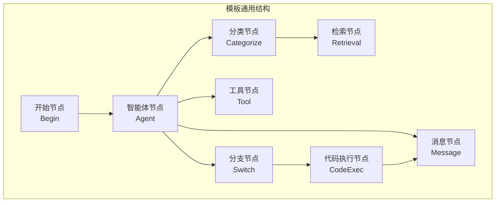
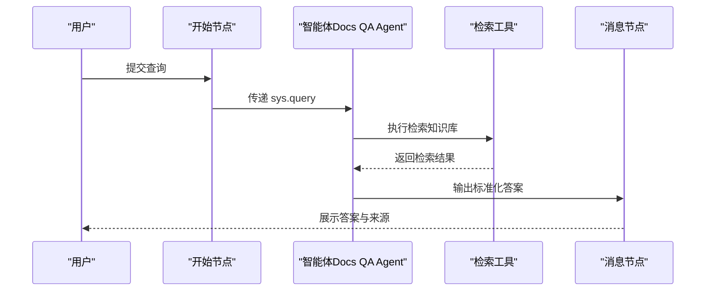
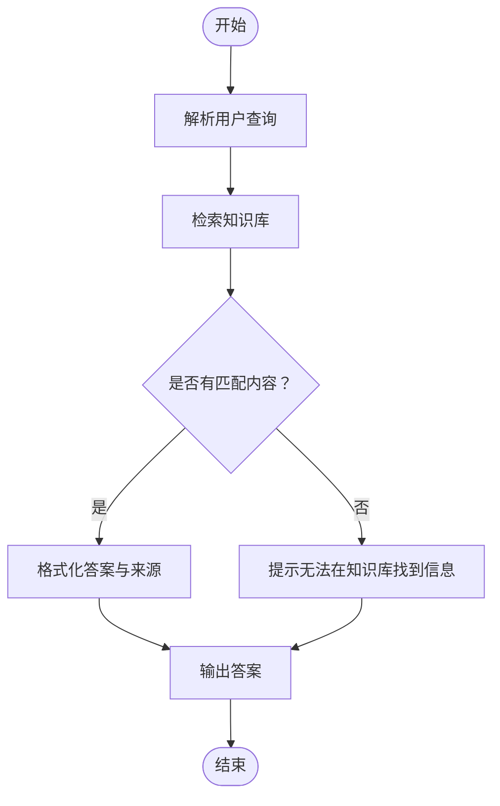
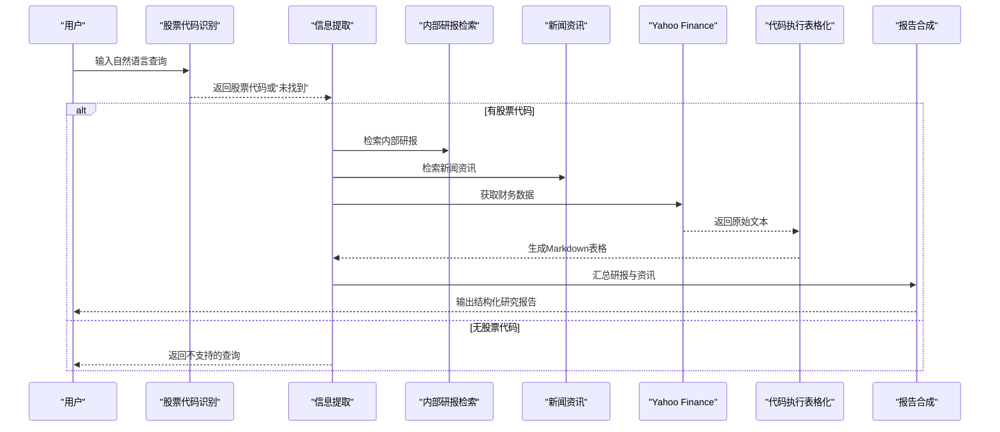
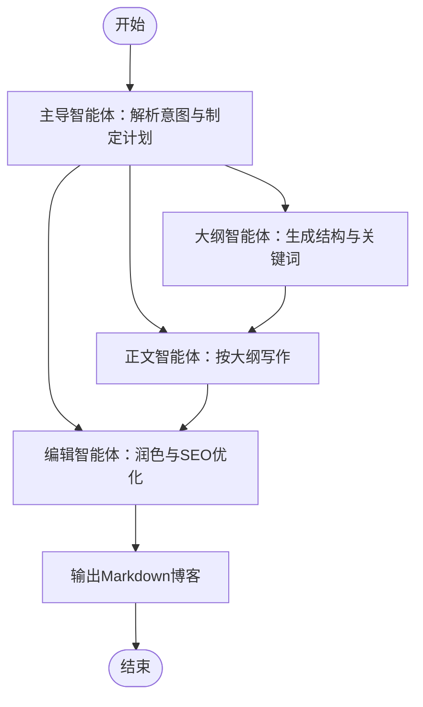
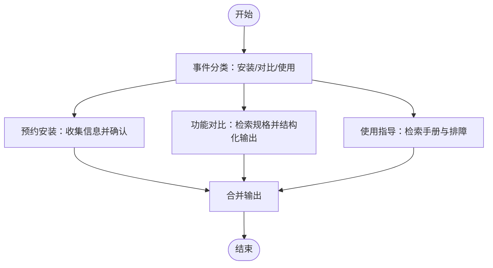
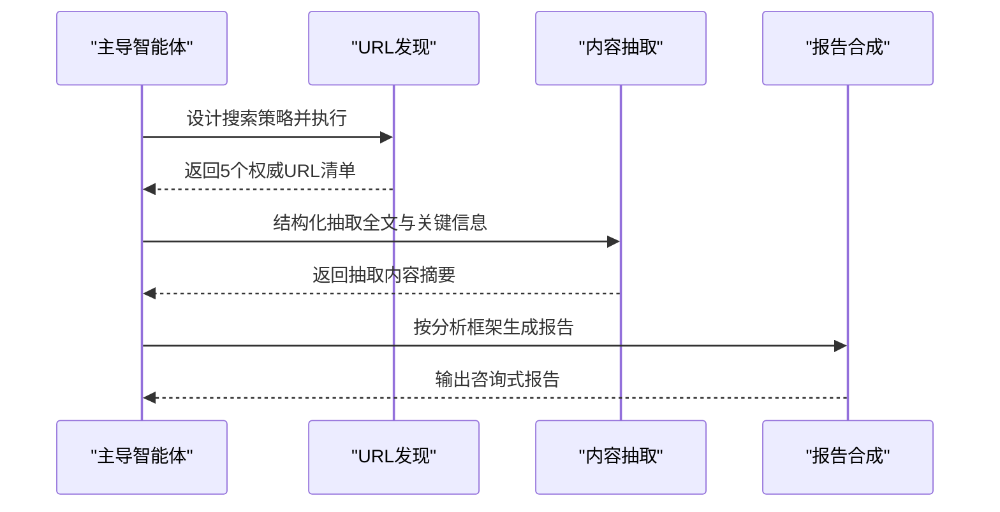
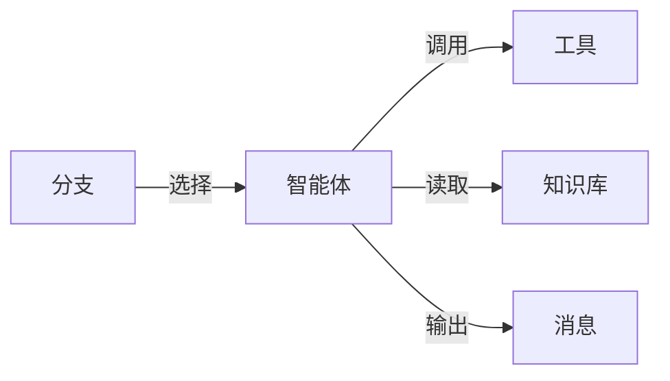

# 专业领域模板示例

<cite>
**本文档引用的文件**
- [technical_docs_qa.json](file://agent/templates/technical_docs_qa.json)
- [stock_research_report.json](file://agent/templates/stock_research_report.json)
- [generate_SEO_blog.json](file://agent/templates/generate_SEO_blog.json)
- [ecommerce_customer_service_workflow.json](file://agent/templates/ecommerce_customer_service_workflow.json)
- [deep_research.json](file://agent/templates/deep_research.json)
</cite>

## 目录
1. [简介](#简介)
2. [项目结构](#项目结构)
3. [核心组件](#核心组件)
4. [架构总览](#架构总览)
5. [详细组件分析](#详细组件分析)
6. [依赖关系分析](#依赖关系分析)
7. [性能考量](#性能考量)
8. [故障排查指南](#故障排查指南)
9. [结论](#结论)
10. [附录](#附录)

## 简介
本指南聚焦于四个专业领域模板：技术文档问答、股票研究报告、市场SEO博客生成与电商客服工作流。通过对模板DSL（领域特定语言）的结构化解读，帮助用户理解各模板在以下方面的专业能力：
- 技术文档问答：技术术语理解、文档结构分析、答案生成与溯源
- 股票研究报告：多源信息整合（市场数据、财务报表、新闻资讯）、差异化观点保留与综合分析
- 市场SEO博客生成：内容创作与搜索引擎优化技巧的多智能体协作
- 电商客服工作流：订单处理、产品推荐、售后服务的完整业务闭环

同时提供各模板的专业配置方法与行业最佳实践，帮助在特定业务场景下获得最优的智能体应用效果。

## 项目结构
模板位于 agent/templates 目录，采用统一的JSON DSL描述，包含组件定义、图结构、全局变量与可视化说明节点。模板通过组件间的上下游连接形成端到端工作流，典型元素包括：
- 组件类型：Begin、Agent、Message、Categorize、Retrieval、Switch、CodeExec、YahooFinance 等
- 图结构：edges 定义连接关系，nodes 定义节点属性与表单参数
- 全局变量：sys.query、sys.user_id 等用于跨组件传递上下文

图表来源
- [technical_docs_qa.json:119-334](file://agent/templates/technical_docs_qa.json#L119-L334)
- [stock_research_report.json:405-587](file://agent/templates/stock_research_report.json#L405-L587)
- [generate_SEO_blog.json:295-791](file://agent/templates/generate_SEO_blog.json#L295-L791)
- [ecommerce_customer_service_workflow.json:318-452](file://agent/templates/ecommerce_customer_service_workflow.json#L318-L452)

章节来源
- [technical_docs_qa.json:1-336](file://agent/templates/technical_docs_qa.json#L1-L336)
- [stock_research_report.json:1-800](file://agent/templates/stock_research_report.json#L1-L800)
- [generate_SEO_blog.json:1-800](file://agent/templates/generate_SEO_blog.json#L1-L800)
- [ecommerce_customer_service_workflow.json:1-800](file://agent/templates/ecommerce_customer_service_workflow.json#L1-L800)

## 核心组件
- 智能体（Agent）：承担角色与任务执行，内置系统提示词（sys_prompt）、用户提示词（prompts）、工具调用与参数配置
- 分类器（Categorize）：对用户意图进行分类，将请求路由至不同知识库或处理路径
- 检索（Retrieval）：从知识库中检索相关内容，支持相似度阈值、top_k/top_n等参数
- 分支（Switch）：根据条件判断选择不同的下游路径
- 代码执行（CodeExec）：对文本进行格式化处理，如提取财务表格
- 工具（Tool）：外部搜索、抽取、金融数据等工具集成
- 开始/消息（Begin/Message）：流程入口与最终输出节点

章节来源
- [technical_docs_qa.json:14-148](file://agent/templates/technical_docs_qa.json#L14-L148)
- [stock_research_report.json:15-398](file://agent/templates/stock_research_report.json#L15-L398)
- [generate_SEO_blog.json:12-288](file://agent/templates/generate_SEO_blog.json#L12-L288)
- [ecommerce_customer_service_workflow.json:15-311](file://agent/templates/ecommerce_customer_service_workflow.json#L15-L311)

## 架构总览
以“技术文档问答”为例，整体流程为：开始节点接收查询，智能体解析问题并调用检索工具，将检索结果格式化后通过消息节点输出。该模式强调“基于知识库”的严格溯源与透明性。

图表来源
- [technical_docs_qa.json:119-148](file://agent/templates/technical_docs_qa.json#L119-L148)

章节来源
- [technical_docs_qa.json:119-334](file://agent/templates/technical_docs_qa.json#L119-L334)

## 详细组件分析

### 技术文档问答模板（技术术语理解、文档结构分析、答案生成）
- 角色定位：严格的“知识库问答助手”，仅依据检索到的文档内容作答，不进行推断或创造
- 关键机制：
  - 系统提示词明确“知识库优先、无内容不生成、透明标注来源”
  - 检索工具参数：关键词相似度权重、top_k/top_n、相似度阈值、是否使用知识图谱
  - 输出规范：Markdown格式、明确标注可用/不可用信息、引用来源
- 适用场景：产品文档查询、技术支持问答、企业知识库检索

图表来源
- [technical_docs_qa.json:45-82](file://agent/templates/technical_docs_qa.json#L45-L82)
- [technical_docs_qa.json:206-227](file://agent/templates/technical_docs_qa.json#L206-L227)

章节来源
- [technical_docs_qa.json:14-118](file://agent/templates/technical_docs_qa.json#L14-L118)

### 股票研究报告模板（金融数据分析、多源信息整合、差异化观点保留）
- 角色分工：
  - 股票代码识别：从自然语言中提取唯一股票代码，必要时借助Tavily搜索
  - 信息提取：并行拉取“机构研报”与“新闻资讯”，保持原始文本与结构
  - 报告合成：以投行风格撰写报告，保留并对比不同来源的差异观点
- 数据链路：
  - 股票代码识别 → 新闻/研报检索 → 财务数据抽取（Yahoo Finance）→ 表格格式化（CodeExec）→ 报告生成
- 输出要求：结构化章节、引用来源、差异点标注、可操作建议

图表来源
- [stock_research_report.json:16-94](file://agent/templates/stock_research_report.json#L16-L94)
- [stock_research_report.json:95-219](file://agent/templates/stock_research_report.json#L95-L219)
- [stock_research_report.json:220-269](file://agent/templates/stock_research_report.json#L220-L269)
- [stock_research_report.json:270-308](file://agent/templates/stock_research_report.json#L270-L308)

章节来源
- [stock_research_report.json:1-800](file://agent/templates/stock_research_report.json#L1-L800)

### 市场SEO博客生成模板（内容创作与SEO优化）
- 多智能体协作：
  - 主导智能体：解析主题、受众与目标，制定写作计划并分配任务
  - 大纲智能体：生成含H2/H3标题与长尾关键词的大纲
  - 正文智能体：按大纲写段落，必要时使用Tavily搜索补充事实
  - 编辑智能体：润色全文、优化关键词密度、生成Meta标题与描述
- 输出形态：Markdown格式，结构清晰、关键词自然融入、具备SEO审计要点

图表来源
- [generate_SEO_blog.json:14-258](file://agent/templates/generate_SEO_blog.json#L14-L258)
- [generate_SEO_blog.json:259-288](file://agent/templates/generate_SEO_blog.json#L259-L288)

章节来源
- [generate_SEO_blog.json:1-800](file://agent/templates/generate_SEO_blog.json#L1-L800)

### 电商客服工作流模板（订单处理、产品推荐、售后服务）
- 事件分类：根据用户查询将其归类为“预约安装”、“产品功能对比”、“使用指导”
- 路由策略：
  - 预约安装：收集联系方式、时间与地址，确认后告知后续联系
  - 功能对比：从知识库检索规格表，结构化呈现差异
  - 使用指导：从知识库检索使用手册与故障排除指南
- 输出整合：将三类结果合并输出，确保信息一致与可读性强

图表来源
- [ecommerce_customer_service_workflow.json:166-217](file://agent/templates/ecommerce_customer_service_workflow.json#L166-L217)
- [ecommerce_customer_service_workflow.json:218-311](file://agent/templates/ecommerce_customer_service_workflow.json#L218-L311)

章节来源
- [ecommerce_customer_service_workflow.json:1-800](file://agent/templates/ecommerce_customer_service_workflow.json#L1-L800)

### 深度研究模板（多源信息结构化、多步骤调查、咨询式报告）
- 流程阶段：
  - URL发现：使用搜索工具发现权威来源
  - 内容抽取：结构化提取网页全文与关键统计、专家观点
  - 报告合成：按指定框架生成咨询式报告（如麦肯锡风格）
- 质量门禁：每阶段检查URL数量/质量、抽取成功率、报告字数与可操作性
- 适配策略：根据查询类型（深度/广度/直问）动态分配资源与回退方案

图表来源
- [deep_research.json:1-504](file://agent/templates/deep_research.json#L1-L504)

章节来源
- [deep_research.json:1-504](file://agent/templates/deep_research.json#L1-L504)

## 依赖关系分析
- 组件耦合：
  - 智能体与工具强耦合：通过工具参数调用外部能力（如Tavily、Yahoo Finance）
  - 检索与知识库耦合：Retrieval组件依赖kb_ids与相似度参数
  - 分支与条件耦合：Switch根据条件选择不同下游路径
- 可能的循环依赖：
  - 模板采用单向数据流（Begin→Agent→Message），未见显式循环边
- 外部依赖：
  - 搜索/抽取工具（TavilySearch/TavilyExtract）
  - 金融数据（Yahoo Finance）
  - 知识库（Retrieval）

图表来源
- [stock_research_report.json:15-398](file://agent/templates/stock_research_report.json#L15-L398)
- [generate_SEO_blog.json:12-288](file://agent/templates/generate_SEO_blog.json#L12-L288)
- [ecommerce_customer_service_workflow.json:15-311](file://agent/templates/ecommerce_customer_service_workflow.json#L15-L311)

章节来源
- [stock_research_report.json:15-398](file://agent/templates/stock_research_report.json#L15-L398)
- [generate_SEO_blog.json:12-288](file://agent/templates/generate_SEO_blog.json#L12-L288)
- [ecommerce_customer_service_workflow.json:15-311](file://agent/templates/ecommerce_customer_service_workflow.json#L15-L311)

## 性能考量
- 检索效率：合理设置top_k/top_n与相似度阈值，避免过多无关内容影响响应速度
- 工具调用成本：控制搜索/抽取次数与并发，必要时启用缓存与重试
- 文本处理：大体量内容先结构化再分析，减少LLM上下文压力
- 并行化：多智能体协作（如SEO博客）可显著缩短总耗时，但需注意资源上限与质量门禁

## 故障排查指南
- 知识库检索为空：
  - 检查kb_ids与关键词相似度权重；尝试放宽相似度阈值或增加top_n
- 工具调用失败：
  - 核对工具参数（如TavilySearch的api_key、max_results）；检查网络连通性
- 报告长度不足或质量不达标：
  - 深度研究模板可通过提高抽取成功率与扩展分析维度改善
- 电商客服信息缺失：
  - 确认分类是否正确；检查知识库内容完整性与更新频率

章节来源
- [deep_research.json:1-504](file://agent/templates/deep_research.json#L1-L504)
- [stock_research_report.json:1-800](file://agent/templates/stock_research_report.json#L1-L800)
- [ecommerce_customer_service_workflow.json:1-800](file://agent/templates/ecommerce_customer_service_workflow.json#L1-L800)

## 结论
上述模板通过统一的DSL与组件化架构，实现了从“问题理解—信息检索—结构化处理—专业化输出”的闭环。针对不同专业领域，模板在以下方面提供了可复用的能力基座：
- 技术文档问答：严格的知识库溯源与透明输出
- 股票研究报告：多源整合与差异化观点保留
- SEO博客生成：多智能体协同与SEO优化
- 电商客服：事件分类与知识库驱动的服务编排

建议在实际部署中结合业务场景调整参数、完善知识库与工具配置，并建立质量门禁与监控体系，以持续提升智能体的稳定性与效果。

## 附录
- 专业配置建议
  - 技术文档问答：优先提升检索召回率与相关性，确保sys_prompt与工具参数与组织知识库风格一致
  - 股票研究报告：完善研报知识库覆盖与新闻源多样性，强化CodeExec表格化逻辑与报告合成的引用标注
  - SEO博客生成：根据目标受众与平台特性调整大纲与正文风格，加强编辑阶段的SEO审计
  - 电商客服：持续更新产品知识库与FAQ，优化分类器示例与路由规则