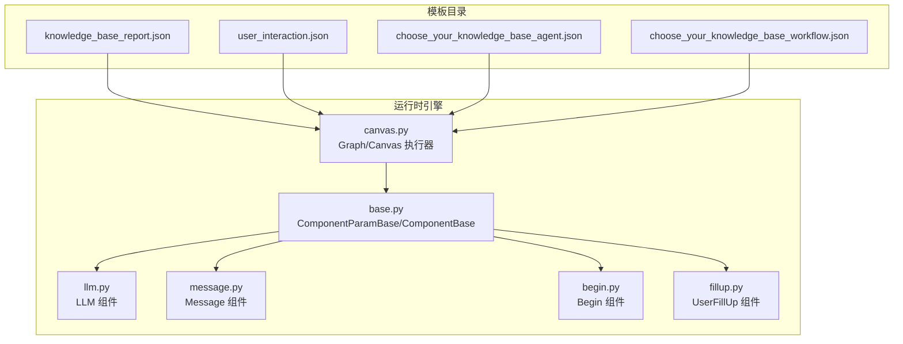
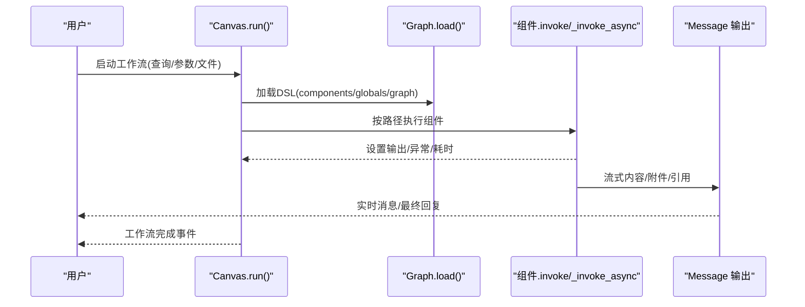
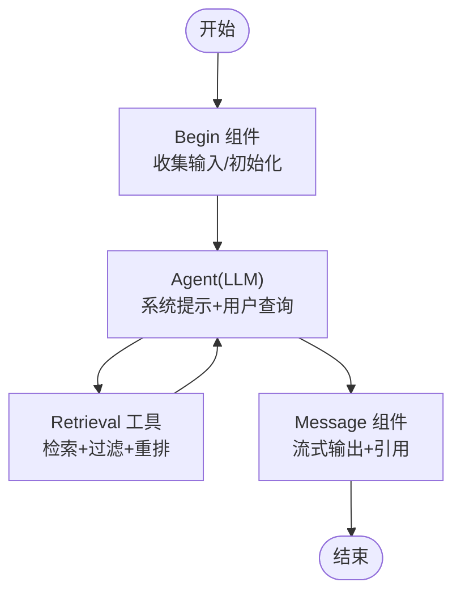
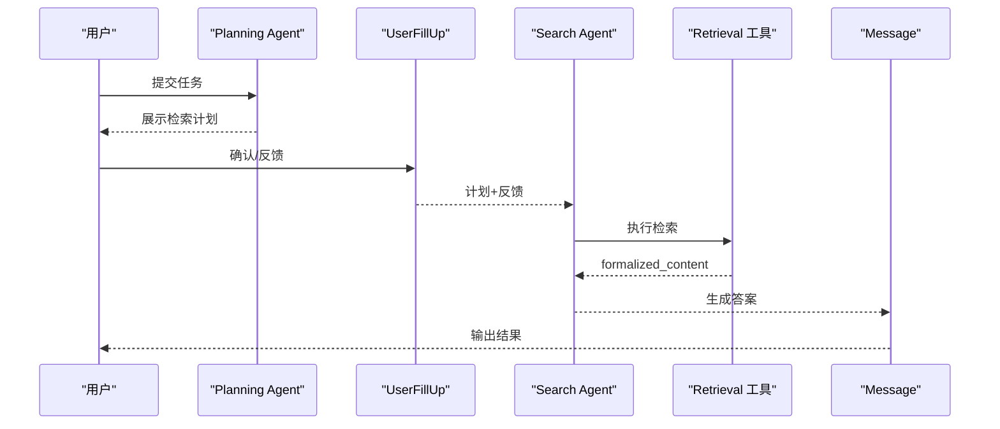
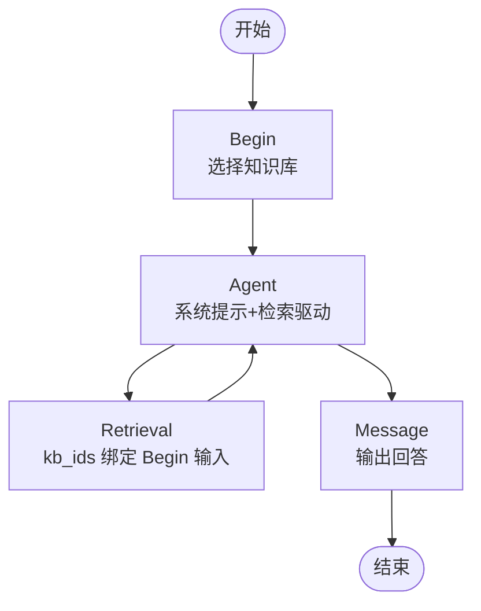
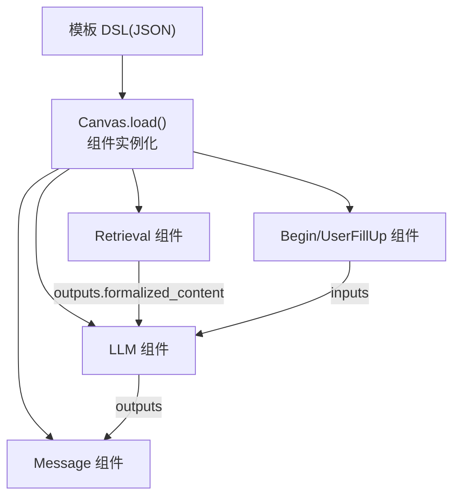

# 基础模板示例

<cite>
**本文引用的文件**
- [knowledge_base_report.json](file://agent/templates/knowledge_base_report.json)
- [user_interaction.json](file://agent/templates/user_interaction.json)
- [choose_your_knowledge_base_agent.json](file://agent/templates/choose_your_knowledge_base_agent.json)
- [choose_your_knowledge_base_workflow.json](file://agent/templates/choose_your_knowledge_base_workflow.json)
- [canvas.py](file://agent/canvas.py)
- [base.py](file://agent/component/base.py)
- [llm.py](file://agent/component/llm.py)
- [message.py](file://agent/component/message.py)
- [begin.py](file://agent/component/begin.py)
- [fillup.py](file://agent/component/fillup.py)
</cite>

## 目录
1. [简介](#简介)
2. [项目结构](#项目结构)
3. [核心组件](#核心组件)
4. [架构总览](#架构总览)
5. [详细组件分析](#详细组件分析)
6. [依赖关系分析](#依赖关系分析)
7. [性能考虑](#性能考虑)
8. [故障排查指南](#故障排查指南)
9. [结论](#结论)
10. [附录](#附录)

## 简介
本指南围绕“基础模板示例”展开，聚焦于知识库问答智能体模板的设计原理与实现细节，涵盖组件配置、工作流设计、参数调优、用户交互模板功能与场景、模板导入与配置（JSON DSL 解析、组件连接、变量绑定）、运行效果与最佳实践（性能优化、错误处理、用户体验提升），以及模板定制化方法。读者可据此快速上手并按业务需求灵活调整。

## 项目结构
模板位于 agent/templates 目录，采用统一的 JSON DSL 描述工作流与组件参数；运行时由 agent/canvas.py 负责加载、解析与执行；组件基类与具体组件（如 LLM、Message、Begin、UserFillUp）分别定义在 agent/component 下。

图示来源
- [canvas.py:81-127](file://agent/canvas.py#L81-L127)
- [base.py:40-585](file://agent/component/base.py#L40-L585)
- [llm.py:82-352](file://agent/component/llm.py#L82-L352)
- [message.py:61-441](file://agent/component/message.py#L61-L441)
- [begin.py:37-60](file://agent/component/begin.py#L37-L60)
- [fillup.py:35-78](file://agent/component/fillup.py#L35-L78)

章节来源
- [canvas.py:81-127](file://agent/canvas.py#L81-L127)
- [base.py:40-585](file://agent/component/base.py#L40-L585)

## 核心组件
- 组件基类与参数校验：ComponentParamBase/ComponentBase 提供参数更新、校验、输入输出管理、异常处理与超时控制等通用能力。
- LLM 组件：封装大模型调用、流式输出、提示词拼装、引用标注、结构化输出等。
- Message 组件：负责消息渲染、流式输出、格式转换（Markdown/HTML/PDF/DOCX/XLSX）、内存落盘。
- Begin 组件：作为工作流入口，支持会话模式、任务模式与 Webhook 模式，收集初始输入。
- UserFillUp 组件：在需要用户补充信息时触发，支持提示语、输入表单与文件上传。

章节来源
- [base.py:40-585](file://agent/component/base.py#L40-L585)
- [llm.py:33-352](file://agent/component/llm.py#L33-L352)
- [message.py:39-441](file://agent/component/message.py#L39-L441)
- [begin.py:20-60](file://agent/component/begin.py#L20-L60)
- [fillup.py:24-78](file://agent/component/fillup.py#L24-L78)

## 架构总览
模板以 JSON DSL 描述组件、边与全局变量；Canvas 在运行时解析 DSL，实例化组件对象，按拓扑顺序并发/串行调度，支持流式输出、引用追踪、取消与异常分支。

图示来源
- [canvas.py:367-656](file://agent/canvas.py#L367-L656)
- [base.py:407-447](file://agent/component/base.py#L407-L447)

章节来源
- [canvas.py:367-656](file://agent/canvas.py#L367-L656)

## 详细组件分析

### 知识库问答智能体模板（检索-生成型）
该模板面向“基于知识库的问答/报告生成”，强调检索质量门禁、多来源验证与结构化输出。

- 组件构成
  - Begin：会话模式，支持 prologue 与输入项（如知识库选项）。
  - Agent（LLM）：内置系统提示与检索驱动的执行框架，包含温度、最大令牌、工具（Retrieval）等参数。
  - Message：承接 Agent 输出，支持流式渲染与引用展示。
- 关键设计点
  - 检索工具参数：top_k/top_n、相似度阈值、关键词权重、重排器等。
  - 严格依赖知识库：系统提示强调“严格依据知识库内容”“不捏造事实”。
  - 多轮对话窗口：message_history_window_size 控制上下文长度。
- 参数调优建议
  - 温度与采样：0.1 左右适合事实性问答；若需创造性可适度提高。
  - 最大令牌：结合上下文长度与模型上下文窗口设置。
  - 检索 top_k/top_n：平衡召回与多样性，避免噪声。
  - 引用与标注：开启 cite 便于溯源，提升可信度。

图示来源
- [knowledge_base_report.json:12-123](file://agent/templates/knowledge_base_report.json#L12-L123)
- [llm.py:264-342](file://agent/component/llm.py#L264-L342)
- [message.py:179-205](file://agent/component/message.py#L179-L205)

章节来源
- [knowledge_base_report.json:12-123](file://agent/templates/knowledge_base_report.json#L12-L123)
- [llm.py:264-342](file://agent/component/llm.py#L264-L342)
- [message.py:179-205](file://agent/component/message.py#L179-L205)

### 可交互的 Agent 模板（计划-检索-生成）
该模板通过“计划-检索-生成”的两阶段协作，允许用户在检索前对计划进行确认与反馈，从而提升结果可控性。

- 组件构成
  - Planning Agent：生成检索计划（含证据条目、查询策略、停止条件）。
  - UserFillUp：向用户展示计划并收集反馈。
  - Search Agent：执行检索与整合，产出有依据的答案。
  - Retrieval 工具：执行检索并返回 formalized_content。
  - Message：输出最终答案。
- 用户交互特性
  - “等待响应”提示语可动态注入计划内容，增强透明度。
  - 支持用户对计划进行确认/修改，再进入检索阶段。
- 适用场景
  - 需要明确检索策略与证据来源的复杂问题。
  - 对检索过程可解释性要求较高。

图示来源
- [user_interaction.json:14-207](file://agent/templates/user_interaction.json#L14-L207)
- [fillup.py:35-78](file://agent/component/fillup.py#L35-L78)
- [llm.py:264-342](file://agent/component/llm.py#L264-L342)
- [message.py:179-205](file://agent/component/message.py#L179-L205)

章节来源
- [user_interaction.json:14-207](file://agent/templates/user_interaction.json#L14-L207)
- [fillup.py:35-78](file://agent/component/fillup.py#L35-L78)
- [llm.py:264-342](file://agent/component/llm.py#L264-L342)
- [message.py:179-205](file://agent/component/message.py#L179-L205)

### 选择知识库 Agent 模板（Agent 方式）
该模板通过下拉框让用户选择目标知识库，Agent 仅从选定知识库检索并生成回答。

- 组件构成
  - Begin：提供“knowledge base”下拉输入。
  - Agent：系统提示强调“仅基于知识库内容回答”。
  - Retrieval：kb_ids 绑定 Begin 的输入项，确保检索范围限定。
  - Message：输出回答。
- 注意事项
  - Retrieval 的 kb_ids 必须正确绑定 Begin 的输入项名称。
  - 若未选择知识库，检索可能为空或报错，需在前端或系统层做好兜底。

图示来源
- [choose_your_knowledge_base_agent.json:12-134](file://agent/templates/choose_your_knowledge_base_agent.json#L12-L134)
- [llm.py:264-342](file://agent/component/llm.py#L264-L342)
- [message.py:179-205](file://agent/component/message.py#L179-L205)

章节来源
- [choose_your_knowledge_base_agent.json:12-134](file://agent/templates/choose_your_knowledge_base_agent.json#L12-L134)
- [llm.py:264-342](file://agent/component/llm.py#L264-L342)
- [message.py:179-205](file://agent/component/message.py#L179-L205)

### 选择知识库工作流模板（Workflow 方式）
该模板将检索与生成解耦为独立节点，便于可视化与扩展。

- 组件构成
  - Begin → Retrieval → Agent → Message。
  - Agent 的用户提示中直接引用 Retrieval 的 formalized_content，形成端到端闭环。
- 优势
  - 结构清晰、易于调试与替换组件。
  - 适合对检索与生成分别进行参数调优与监控。

图示来源
- [choose_your_knowledge_base_workflow.json:12-140](file://agent/templates/choose_your_knowledge_base_workflow.json#L12-L140)
- [llm.py:264-342](file://agent/component/llm.py#L264-L342)
- [message.py:179-205](file://agent/component/message.py#L179-L205)

章节来源
- [choose_your_knowledge_base_workflow.json:12-140](file://agent/templates/choose_your_knowledge_base_workflow.json#L12-L140)
- [llm.py:264-342](file://agent/component/llm.py#L264-L342)
- [message.py:179-205](file://agent/component/message.py#L179-L205)

## 依赖关系分析
- 模板到运行时
  - 模板 JSON DSL 由 Canvas.load 解析为组件对象，建立上下游边关系与全局变量。
- 组件间耦合
  - LLM 与 Retrieval 通过参数与输出字段（如 formalized_content）耦合。
  - Message 依赖上游输出与引用信息，负责最终呈现。
- 变量绑定与解析
  - Canvas 提供 get_variable_value/set_variable_value，支持 sys.env 变量与跨组件引用（如 {Agent:...@content}）。

图示来源
- [canvas.py:91-104](file://agent/canvas.py#L91-L104)
- [base.py:407-447](file://agent/component/base.py#L407-L447)

章节来源
- [canvas.py:91-104](file://agent/canvas.py#L91-L104)
- [base.py:407-447](file://agent/component/base.py#L407-L447)

## 性能考虑
- 并发与批处理
  - Canvas 使用线程池执行组件 invoke，支持异步协程与批量调度，减少阻塞。
- 流式输出
  - LLM 与 Message 支持增量输出，降低首字延迟，改善用户体验。
- 上下文裁剪
  - LLM 内部对消息进行适配与裁剪，避免超出模型上下文上限。
- 检索效率
  - top_k/top_n、相似度阈值与重排器参数直接影响检索速度与质量，应结合数据规模与查询复杂度调优。
- 取消与超时
  - 组件级超时与任务取消机制，防止长时间阻塞。

章节来源
- [canvas.py:420-464](file://agent/canvas.py#L420-L464)
- [llm.py:263-342](file://agent/component/llm.py#L263-L342)
- [base.py:449-451](file://agent/component/base.py#L449-L451)

## 故障排查指南
- 常见问题
  - 检索为空：检查 kb_ids 是否正确绑定 Begin 输入项；确认知识库是否已构建索引。
  - 输出为空或报错：查看 Agent 的异常默认值配置；检查 Retrieval 返回的 formalized_content。
  - 任务被取消：Canvas 会在 Redis 中标记取消状态，检查任务 ID 与日志。
- 定位手段
  - 查看工作流事件：node_started/node_finished/workflow_finished。
  - 检查组件输出与错误字段：_ERROR。
  - 开启引用追踪与日志：工具调用轨迹与引用列表。
- 建议
  - 为关键组件配置异常分支（exception_goto/default_value）。
  - 对长链路组件启用流式输出，便于实时观测。

章节来源
- [canvas.py:465-656](file://agent/canvas.py#L465-L656)
- [base.py:567-582](file://agent/component/base.py#L567-L582)

## 结论
基础模板示例展示了从“检索-生成”到“计划-反馈-生成”的多种工作流形态，覆盖了知识库问答的典型场景。通过统一的 JSON DSL 与组件化架构，用户可在不改动核心代码的前提下，灵活配置参数、连接组件、绑定变量，实现高质量、可解释、可交互的智能问答体验。

## 附录

### 模板导入与配置教程（JSON DSL）
- 导入步骤
  - 将模板 JSON 文件放置于模板目录，确保包含 components、globals、graph 字段。
  - Canvas.load 会解析组件参数并实例化组件对象，随后按 path 顺序执行。
- 组件连接关系
  - edges.source/target 对应组件 ID，决定执行顺序；downstream/upstream 描述拓扑。
- 变量绑定
  - 支持 sys.env 变量与跨组件引用表达式（如 {Agent:...@content}）。
  - Canvas 提供 get_variable_value/set_variable_value 完成动态赋值与取值。

章节来源
- [canvas.py:91-127](file://agent/canvas.py#L91-L127)
- [canvas.py:162-265](file://agent/canvas.py#L162-L265)

### 参数调优清单（通用）
- LLM
  - temperature/top_p/presence_penalty/frequency_penalty/max_tokens
  - message_history_window_size、cite、visual_files_var
- Retrieval
  - top_k/top_n、similarity_threshold、keywords_similarity_weight、rerank_id、use_kg
- Message
  - content 列表、stream、output_format、auto_play、memory_ids

章节来源
- [llm.py:33-80](file://agent/component/llm.py#L33-L80)
- [message.py:39-58](file://agent/component/message.py#L39-L58)
- [choose_your_knowledge_base_agent.json:52-82](file://agent/templates/choose_your_knowledge_base_agent.json#L52-L82)
- [choose_your_knowledge_base_workflow.json:77-102](file://agent/templates/choose_your_knowledge_base_workflow.json#L77-L102)