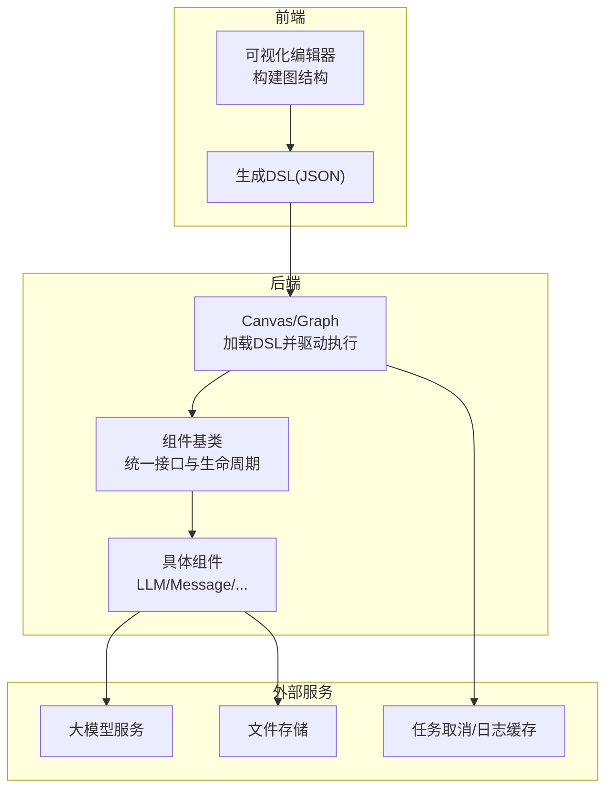
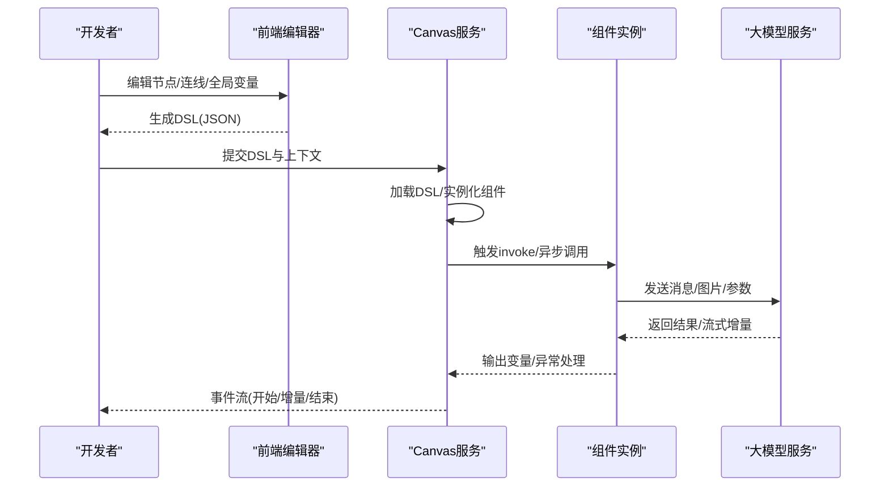
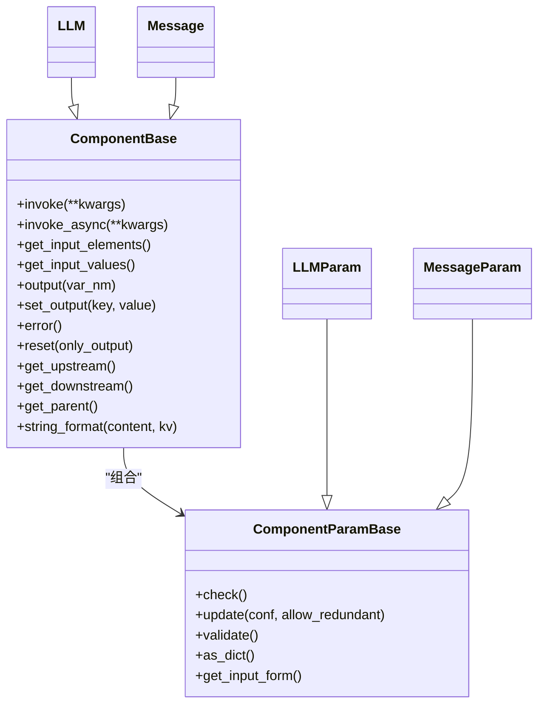
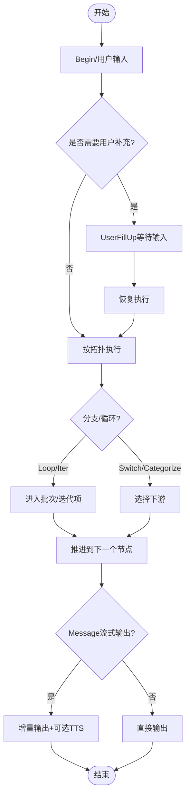
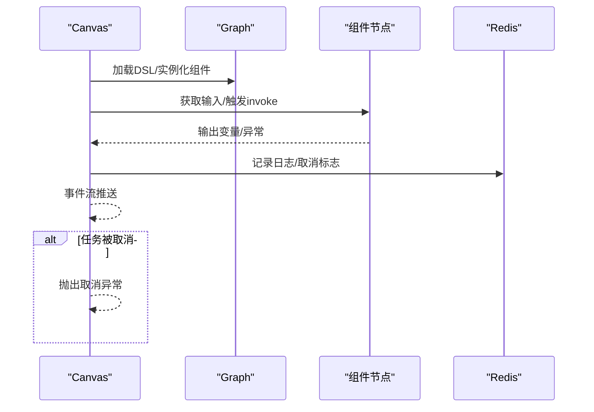
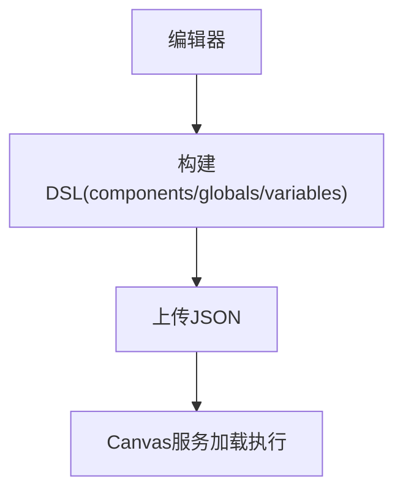

# 模板开发指南

<cite>
**本文引用的文件**
- [agent/canvas.py](file://agent/canvas.py)
- [agent/component/base.py](file://agent/component/base.py)
- [agent/component/__init__.py](file://agent/component/__init__.py)
- [agent/component/llm.py](file://agent/component/llm.py)
- [agent/component/message.py](file://agent/component/message.py)
- [agent/test/client.py](file://agent/test/client.py)
- [agent/test/dsl_examples/retrieval_and_generate.json](file://agent/test/dsl_examples/retrieval_and_generate.json)
- [agent/settings.py](file://agent/settings.py)
- [web/src/pages/agents/upload-agent-dialog/upload-agent-form.tsx](file://web/src/pages/agents/upload-agent-dialog/upload-agent-form.tsx)
- [web/src/pages/agent/utils.ts](file://web/src/pages/agent/utils.ts)
- [web/src/pages/agent/hooks/use-build-dsl.ts](file://web/src/pages/agent/hooks/use-build-dsl.ts)
</cite>

## 目录
1. [简介](#简介)
2. [项目结构](#项目结构)
3. [核心组件](#核心组件)
4. [架构总览](#架构总览)
5. [详细组件分析](#详细组件分析)
6. [依赖分析](#依赖分析)
7. [性能考量](#性能考量)
8. [故障排查指南](#故障排查指南)
9. [结论](#结论)
10. [附录](#附录)

## 简介
本指南面向智能体模板开发者，系统讲解基于 Canvas 的可视化编排与参数配置体系，涵盖 DSL 语法规范、组件接口定义、工作流设计模式、调试与测试工具链、版本管理与兼容性策略、发布与分发最佳实践，并提供从入门到进阶的开发示例路径。

## 项目结构
围绕“模板即代码”的理念，模板以 JSON DSL 描述，Canvas 负责加载、调度与执行；组件通过统一基类抽象出输入/输出、参数校验、异常处理与并发控制；前端提供可视化编辑器，将图结构转换为 DSL 并持久化。

图表来源
- [agent/canvas.py:279-821](file://agent/canvas.py#L279-L821)
- [agent/component/base.py:365-585](file://agent/component/base.py#L365-L585)
- [agent/component/llm.py:82-200](file://agent/component/llm.py#L82-L200)
- [agent/component/message.py:61-200](file://agent/component/message.py#L61-L200)

章节来源
- [agent/canvas.py:40-127](file://agent/canvas.py#L40-L127)
- [agent/component/base.py:40-200](file://agent/component/base.py#L40-L200)
- [agent/component/__init__.py:51-59](file://agent/component/__init__.py#L51-L59)

## 核心组件
- Canvas/Graph：负责加载 DSL、实例化组件、维护执行路径、变量解析与替换、事件流式输出、取消与日志追踪。
- 组件基类（ComponentBase）：统一输入/输出、参数对象（ComponentParamBase）、超时与并发控制、错误处理与异常分支、输入元素解析与占位符替换。
- 具体组件：如 LLM、Message 等，按需扩展输入表单、提示词拼装、流式输出与内存落盘。

章节来源
- [agent/canvas.py:279-821](file://agent/canvas.py#L279-L821)
- [agent/component/base.py:365-585](file://agent/component/base.py#L365-L585)
- [agent/component/llm.py:82-200](file://agent/component/llm.py#L82-L200)
- [agent/component/message.py:61-200](file://agent/component/message.py#L61-L200)

## 架构总览
Canvas 将 JSON DSL 解析为可执行的工作流，按拓扑顺序并行或串行调用组件，支持条件分支、循环/迭代、用户填充、TTS 音频合成、引用溯源与历史对话注入。

图表来源
- [agent/canvas.py:367-656](file://agent/canvas.py#L367-L656)
- [agent/component/llm.py:169-200](file://agent/component/llm.py#L169-L200)
- [agent/component/message.py:179-200](file://agent/component/message.py#L179-L200)

## 详细组件分析

### DSL 语法规范
- 结构组成
  - components：节点集合，每个节点包含 obj（组件名与参数）、downstream/upstream（有向边）、parent_id（可选父级）。
  - history/path/retrieval/globals/variables/memory：运行期状态与全局变量。
- 变量引用语法
  - 支持 sys.*、env.*、组件输出引用（形如 {id@key.path}），Canvas 在运行时解析并替换。
- 示例参考
  - [agent/test/dsl_examples/retrieval_and_generate.json:1-61](file://agent/test/dsl_examples/retrieval_and_generate.json#L1-L61)

章节来源
- [agent/canvas.py:40-127](file://agent/canvas.py#L40-L127)
- [agent/canvas.py:162-266](file://agent/canvas.py#L162-L266)
- [agent/test/dsl_examples/retrieval_and_generate.json:1-61](file://agent/test/dsl_examples/retrieval_and_generate.json#L1-L61)

### 组件接口定义
- 组件基类职责
  - 输入/输出管理：get_input/set_output、get_input_elements_from_text、字符串格式化。
  - 生命周期：invoke/invoke_async、重置、异常处理与 goto/default_value。
  - 上下游与父子关系：get_upstream/get_downstream/get_parent。
  - 参数对象：ComponentParamBase 提供参数更新、校验、验证规则与调试输入。
- 参数对象校验
  - 内置校验器覆盖字符串、非空、正整数/数值、布尔、区间、枚举等。
  - 支持 JSON 验证规则与递归深度限制。

图表来源
- [agent/component/base.py:40-200](file://agent/component/base.py#L40-L200)
- [agent/component/base.py:365-585](file://agent/component/base.py#L365-L585)
- [agent/component/llm.py:33-80](file://agent/component/llm.py#L33-L80)
- [agent/component/message.py:39-60](file://agent/component/message.py#L39-L60)

章节来源
- [agent/component/base.py:40-200](file://agent/component/base.py#L40-L200)
- [agent/component/base.py:365-585](file://agent/component/base.py#L365-L585)
- [agent/component/llm.py:33-80](file://agent/component/llm.py#L33-L80)
- [agent/component/message.py:39-60](file://agent/component/message.py#L39-L60)

### 工作流设计模式
- 条件分支与切换
  - Categorize/Switch 根据输出选择下游路径。
- 循环与迭代
  - Loop/Iteration 与 LoopItem/IterationItem 支持批量与嵌套。
- 用户交互
  - UserFillUp 支持动态收集用户输入并回填。
- 流式输出与 TTS
  - Message 组件支持增量流式输出与可选音频合成。
- 引用与历史
  - 自动注入 sys.history、引用标记与检索结果聚合。

图表来源
- [agent/canvas.py:481-656](file://agent/canvas.py#L481-L656)
- [agent/component/message.py:179-200](file://agent/component/message.py#L179-L200)

章节来源
- [agent/canvas.py:481-656](file://agent/canvas.py#L481-L656)
- [agent/component/message.py:179-200](file://agent/component/message.py#L179-L200)

### Canvas 执行机制
- 加载与实例化
  - 读取 DSL，逐节点构造参数对象并校验，再实例化组件对象。
- 变量解析与替换
  - 支持 sys.env. 前缀与跨组件引用，支持点号路径访问与数组索引。
- 并发与批处理
  - 使用线程池执行阻塞调用，异步协程通过线程包装执行；按拓扑批处理并行。
- 事件流与可观测性
  - 事件类型：workflow_started/node_started/node_finished/message/message_end/workflow_finished/user_inputs。
  - 支持工具调用追踪与日志缓存。
- 取消与容错
  - 通过 Redis 键检测任务取消；异常可 goto 分支或设置默认值。

图表来源
- [agent/canvas.py:91-127](file://agent/canvas.py#L91-L127)
- [agent/canvas.py:367-656](file://agent/canvas.py#L367-L656)
- [agent/canvas.py:770-793](file://agent/canvas.py#L770-L793)

章节来源
- [agent/canvas.py:91-127](file://agent/canvas.py#L91-L127)
- [agent/canvas.py:367-656](file://agent/canvas.py#L367-L656)
- [agent/canvas.py:770-793](file://agent/canvas.py#L770-L793)

### 前端可视化编排
- DSL 构建
  - 基于节点/边与已有 DSL，生成 components、globals、variables、graph.nodes/edges。
- 全局变量映射
  - env.* 与 sys.* 合并，支持变量类型与默认值。
- 文件上传与模板导入
  - 前端表单支持 JSON 上传，提交至后端 Canvas 服务。

图表来源
- [web/src/pages/agent/utils.ts:444-530](file://web/src/pages/agent/utils.ts#L444-L530)
- [web/src/pages/agent/hooks/use-build-dsl.ts:34-59](file://web/src/pages/agent/hooks/use-build-dsl.ts#L34-L59)
- [web/src/pages/agents/upload-agent-dialog/upload-agent-form.tsx:46-70](file://web/src/pages/agents/upload-agent-dialog/upload-agent-form.tsx#L46-L70)

章节来源
- [web/src/pages/agent/utils.ts:444-530](file://web/src/pages/agent/utils.ts#L444-L530)
- [web/src/pages/agent/hooks/use-build-dsl.ts:34-59](file://web/src/pages/agent/hooks/use-build-dsl.ts#L34-L59)
- [web/src/pages/agents/upload-agent-dialog/upload-agent-form.tsx:46-70](file://web/src/pages/agents/upload-agent-dialog/upload-agent-form.tsx#L46-L70)

## 依赖分析
- 组件发现与动态导入
  - 通过包扫描注册所有组件类，统一由 component_class 查找并实例化。
- 外部依赖
  - LLM 服务、文件存储、Redis 任务取消与日志缓存。
- 运行时约束
  - 组件执行超时、最大并发、参数最大嵌套深度、浮点比较精度。

图表来源
- [agent/component/__init__.py:25-59](file://agent/component/__init__.py#L25-L59)
- [agent/component/base.py:384-420](file://agent/component/base.py#L384-L420)
- [agent/settings.py:17-19](file://agent/settings.py#L17-L19)

章节来源
- [agent/component/__init__.py:25-59](file://agent/component/__init__.py#L25-L59)
- [agent/settings.py:17-19](file://agent/settings.py#L17-L19)

## 性能考量
- 并发与批处理
  - 使用线程池执行阻塞调用，异步组件通过线程包装；合理设置最大并发与批大小。
- 超时控制
  - 组件执行统一超时装饰器，避免长时间阻塞。
- 变量解析与渲染
  - 大文本渲染建议使用流式输出与增量缓存，减少一次性拼接开销。
- 日志与追踪
  - 利用 Redis 缓存中间日志，避免频繁 IO；注意键过期时间与清理策略。

## 故障排查指南
- 常见问题定位
  - 参数校验失败：检查 DSL 中参数类型与范围，关注内置校验器报错信息。
  - 变量引用无效：确认 sys.env. 前缀与组件输出键存在，路径点号正确。
  - 任务被取消：检查取消键是否存在，关注 workflow_finished 中的取消提示。
  - 组件异常分支：查看异常方法配置（goto/default_value），必要时设置兜底输出。
- 调试工具
  - 命令行客户端：提供 DSL 路径、租户 ID、流式输出开关，便于快速验证。
  - 事件流观察：通过事件类型与负载字段判断执行阶段与耗时。
- 建议
  - 逐步缩小工作流，先验证最小闭环（Begin → LLM → Message），再添加复杂节点。
  - 使用 UserFillUp 明确用户输入边界，避免隐式等待导致的死锁。

章节来源
- [agent/component/base.py:567-582](file://agent/component/base.py#L567-L582)
- [agent/canvas.py:412-425](file://agent/canvas.py#L412-L425)
- [agent/test/client.py:21-47](file://agent/test/client.py#L21-L47)

## 结论
通过统一的 DSL 与 Canvas 执行引擎，模板开发实现了“所见即所得”的可视化编排与“所编即所跑”的参数配置。遵循本文的设计原则与最佳实践，可在保证稳定性的同时快速迭代复杂工作流。

## 附录

### 开发工具链与测试
- 命令行测试客户端
  - 用途：加载 DSL、设置租户 ID、交互式运行与事件流输出。
  - 示例路径：[agent/test/client.py:21-47](file://agent/test/client.py#L21-L47)
- DSL 示例
  - 最小检索-生成-消息模板：[agent/test/dsl_examples/retrieval_and_generate.json:1-61](file://agent/test/dsl_examples/retrieval_and_generate.json#L1-L61)

章节来源
- [agent/test/client.py:21-47](file://agent/test/client.py#L21-L47)
- [agent/test/dsl_examples/retrieval_and_generate.json:1-61](file://agent/test/dsl_examples/retrieval_and_generate.json#L1-L61)

### 版本管理与兼容性
- 参数兼容策略
  - 通过参数对象的“废弃参数集”与“用户传入参数集”记录与迁移提示，避免破坏性变更。
  - 递归参数更新支持深度限制与冗余参数检测。
- 版本演进建议
  - 新增参数优先向后兼容；对废弃参数保留过渡期并打印警告。
  - 对组件行为变更，通过异常方法 goto 或默认值保障降级。

章节来源
- [agent/component/base.py:60-95](file://agent/component/base.py#L60-L95)
- [agent/component/base.py:127-187](file://agent/component/base.py#L127-L187)
- [agent/settings.py:17-19](file://agent/settings.py#L17-L19)

### 发布与分发最佳实践
- 模板打包
  - 将 DSL JSON 与必要的元数据（名称、描述、标签）一并打包，便于前端导入。
- 元数据管理
  - 前端上传表单支持 JSON 上传，后端加载并校验 DSL 结构与参数。
- 社区贡献
  - 提供最小可运行示例与说明文档，遵循统一的命名与目录规范。

章节来源
- [web/src/pages/agents/upload-agent-dialog/upload-agent-form.tsx:46-70](file://web/src/pages/agents/upload-agent-dialog/upload-agent-form.tsx#L46-L70)
- [web/src/pages/agent/utils.ts:474-498](file://web/src/pages/agent/utils.ts#L474-L498)