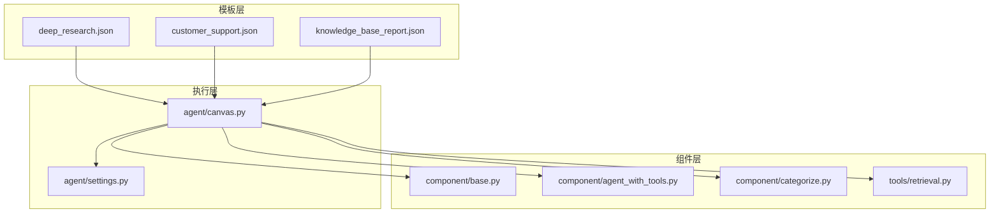
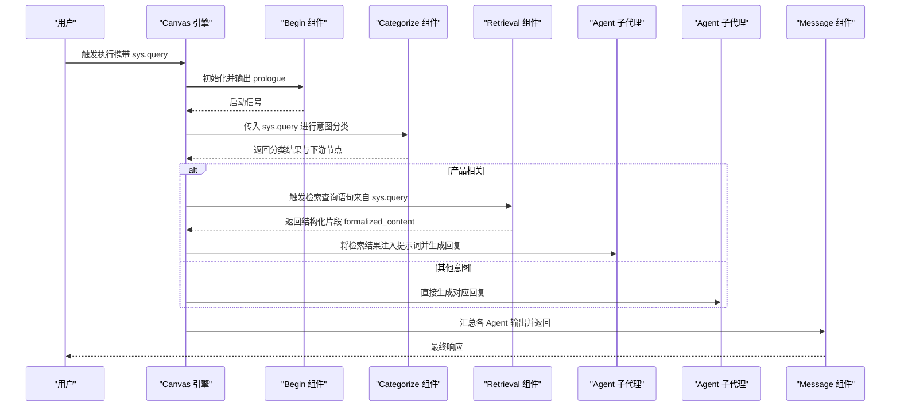
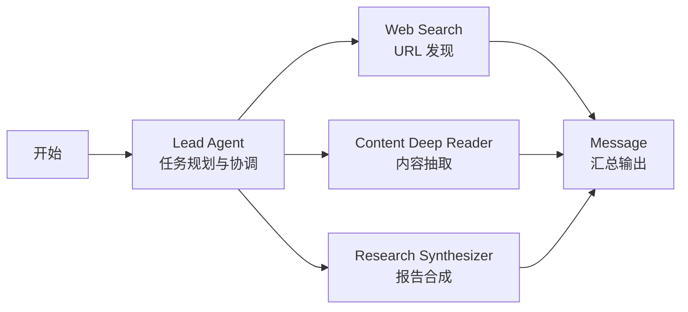
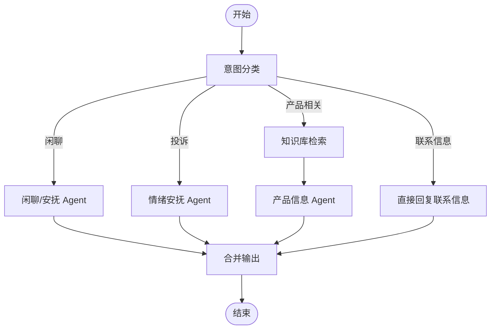
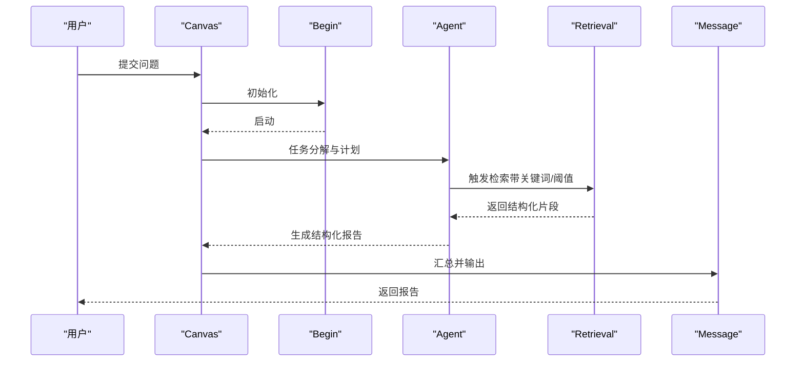
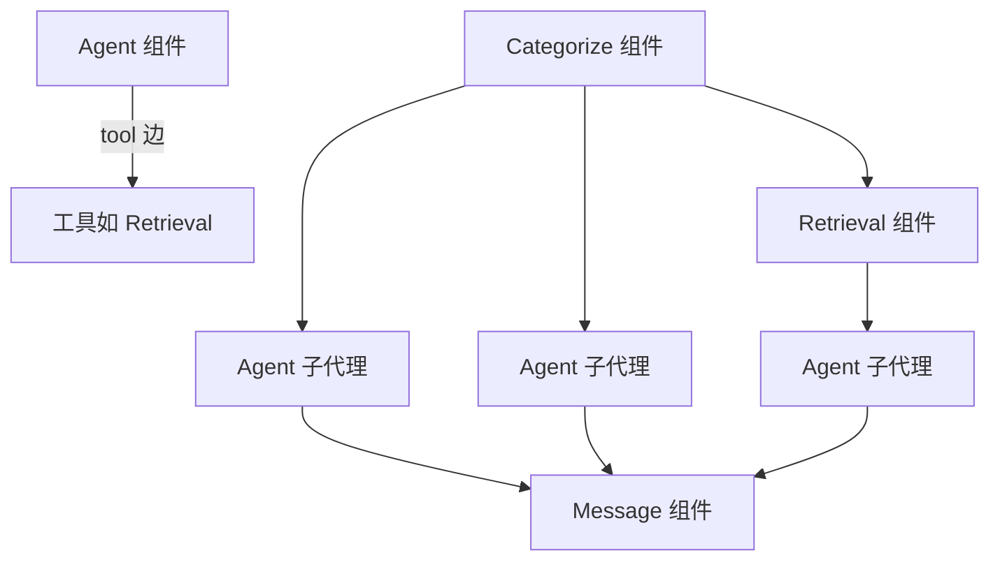

# 模板示例

<cite>
**本文引用的文件**
- [deep_research.json](file://agent/templates/deep_research.json)
- [customer_support.json](file://agent/templates/customer_support.json)
- [knowledge_base_report.json](file://agent/templates/knowledge_base_report.json)
- [agent_with_tools.py](file://agent/component/agent_with_tools.py)
- [base.py](file://agent/component/base.py)
- [categorize.py](file://agent/component/categorize.py)
- [retrieval.py](file://agent/tools/retrieval.py)
- [canvas.py](file://agent/canvas.py)
- [settings.py](file://agent/settings.py)
</cite>

## 目录
1. [简介](#简介)
2. [项目结构](#项目结构)
3. [核心组件](#核心组件)
4. [架构总览](#架构总览)
5. [详细组件分析](#详细组件分析)
6. [依赖分析](#依赖分析)
7. [性能考虑](#性能考虑)
8. [故障排查指南](#故障排查指南)
9. [结论](#结论)
10. [附录](#附录)

## 简介
本指南面向希望快速上手并深度定制智能体模板的使用者与开发者。文档围绕仓库中已实现的“模板示例”展开，系统讲解以下典型工作流模板的设计思路与落地方式：
- 深度研究（多智能体协同：URL 发现 → 内容抽取 → 报告合成）
- 客户支持（意图分类 → 多路分流 → 产品检索 → 统一回复）
- 知识库检索（任务分解 → 检索执行 → 质量门禁 → 结构化报告）

同时，文档从 DSL 结构、组件选择、连接关系、参数配置、导入与运行、定制化与最佳实践、版本与兼容性等方面，给出可操作的使用指南与开发参考。

## 项目结构
模板以 JSON DSL 的形式组织，位于 agent/templates 目录下；运行时由 Canvas 渲染引擎与组件运行时共同驱动。核心文件与职责如下：
- agent/templates/*.json：模板 DSL，描述组件、图结构、全局变量与工具参数
- agent/component/*：组件基类与具体组件实现（Agent、Categorize、Retrieval 等）
- agent/tools/retrieval.py：检索工具封装
- agent/canvas.py：画布渲染与执行引擎
- agent/settings.py：组件与工具的默认配置与行为开关

**图表来源**
- [deep_research.json](file://agent/templates/deep_research.json)
- [customer_support.json](file://agent/templates/customer_support.json)
- [knowledge_base_report.json](file://agent/templates/knowledge_base_report.json)
- [canvas.py](file://agent/canvas.py)
- [settings.py](file://agent/settings.py)

**章节来源**
- [deep_research.json](file://agent/templates/deep_research.json)
- [customer_support.json](file://agent/templates/customer_support.json)
- [knowledge_base_report.json](file://agent/templates/knowledge_base_report.json)
- [canvas.py](file://agent/canvas.py)
- [settings.py](file://agent/settings.py)

## 核心组件
- 组件基类与 Agent 执行器
  - 组件统一接口与生命周期管理在基础类中定义，Agent 执行器负责参数注入、提示词拼接、工具调用与结果聚合。
- 分类器（Categorize）
  - 基于 LLM 的意图分类，将用户请求路由到不同子代理或工具。
- 检索器（Retrieval）
  - 封装知识库检索逻辑，支持相似度阈值、重排、跨语言等策略。

**章节来源**
- [base.py](file://agent/component/base.py)
- [agent_with_tools.py](file://agent/component/agent_with_tools.py)
- [categorize.py](file://agent/component/categorize.py)
- [retrieval.py](file://agent/tools/retrieval.py)

## 架构总览
模板 DSL 通过“组件 + 图结构 + 全局变量”的方式描述端到端工作流。Canvas 在运行时解析 DSL，按拓扑顺序调度组件，完成数据传递与工具调用。

**图表来源**
- [customer_support.json](file://agent/templates/customer_support.json)
- [canvas.py](file://agent/canvas.py)

## 详细组件分析

### 深度研究模板（多智能体协同）
该模板采用“Lead Agent + 子代理流水线”的模式，强调结构化研究流程与质量门禁。

- 设计要点
  - Lead Agent 负责任务拆解、查询类型判定、资源分配与最终报告合成。
  - 子代理分工明确：Web Search 仅发现 URL，Content Deep Reader 仅抽取内容，Research Synthesizer 仅生成报告。
  - 工具链：TavilySearch（发现）、TavilyExtract（抽取）。
  - 质量门禁：URL 数量与多样性、抽取成功率、报告长度与洞察密度。
- DSL 关键点
  - 组件：Agent（Lead）、Agent（Web Search）、Agent（Content Deep Reader）、Agent（Research Synthesizer）、Message。
  - 图结构：Begin → Lead Agent → 子代理并行 → Message 汇总。
  - 全局变量：sys.query、sys.user_id 等。
  - 工具参数：搜索深度、结果数量、时间窗口等。
- 使用建议
  - 针对复杂问题启用更多子代理，必要时降低质量阈值以保证产出。
  - 对多语言场景，确保各阶段提示词与工具参数适配目标语言。

**图表来源**
- [deep_research.json](file://agent/templates/deep_research.json)

**章节来源**
- [deep_research.json](file://agent/templates/deep_research.json)

### 客户支持模板（意图分类与多路分流）
该模板以“意图分类”为核心，将用户请求路由至“闲聊安抚”“联系转接”“产品信息”等不同处理路径。

- 设计要点
  - Categorize 组件定义四类意图：联系信息、闲聊、投诉、产品相关。
  - 产品相关请求先检索知识库，再由专业 Agent 生成结构化回复。
  - 非产品相关请求由“闲聊/安抚”Agent 提供友好回复。
- DSL 关键点
  - 组件：Begin、Categorize、Retrieval、多个 Agent、Message。
  - 图结构：Begin → Categorize → 多路下游 → Message 汇总。
  - 全局变量：sys.query、sys.user_id。
  - 检索参数：top_k、top_n、相似度阈值、关键词权重等。
- 使用建议
  - 为不同意图准备多样化的示例，提升分类准确率。
  - 对“联系转接”类消息，可在下游接入外部工单系统或通知渠道。

**图表来源**
- [customer_support.json](file://agent/templates/customer_support.json)

**章节来源**
- [customer_support.json](file://agent/templates/customer_support.json)

### 知识库检索模板（结构化报告生成）
该模板聚焦“基于知识库的问答与报告生成”，强调严格依赖知识库、事实-证据-推理链与格式规范。

- 设计要点
  - Lead Agent 负责任务分解、检索执行、质量门禁与报告合成。
  - 检索阶段支持跨语言、重排、阈值与 Top-N 控制。
  - 报告遵循层级结构、MECE 分组、LaTeX 公式要求。
- DSL 关键点
  - 组件：Begin、Agent（Lead）、Message、Retrieval 工具。
  - 图结构：Begin → Agent → Retrieval → Message。
  - 全局变量：sys.query。
  - 工具参数：kb_ids、keywords_similarity_weight、similarity_threshold、top_k/top_n。
- 使用建议
  - 明确知识库覆盖范围，对缺失关键事实的场景提供引导语。
  - 对时间敏感问题，强制在检索请求中加入时间过滤。

**图表来源**
- [knowledge_base_report.json](file://agent/templates/knowledge_base_report.json)

**章节来源**
- [knowledge_base_report.json](file://agent/templates/knowledge_base_report.json)

## 依赖分析
- 组件耦合
  - Agent 与工具之间通过“tool”边连接，支持多工具串联与复用。
  - Categorize 作为分发枢纽，向上游提供下游节点映射。
- 外部依赖
  - 检索工具依赖知识库 ID 列表与相似度策略。
  - 报告生成依赖长上下文模型与格式约束。
- 可能的循环依赖
  - 模板中未见显式循环边；若自定义扩展，请避免下游回指上游 Begin 节点。

**图表来源**
- [customer_support.json](file://agent/templates/customer_support.json)
- [knowledge_base_report.json](file://agent/templates/knowledge_base_report.json)

**章节来源**
- [customer_support.json](file://agent/templates/customer_support.json)
- [knowledge_base_report.json](file://agent/templates/knowledge_base_report.json)

## 性能考虑
- 检索效率
  - 合理设置 top_k/top_n 与相似度阈值，避免过多无关片段影响吞吐。
  - 对大规模知识库，优先使用重排与关键词权重，减少无效匹配。
- 上下文控制
  - 对长上下文模型，注意 max_tokens 与 message_history_window_size 的平衡，避免 OOM。
- 并行与串行
  - 将可并行的子代理置于同一阶段，减少整体等待时间；严格依赖的步骤保持串行。
- 质量门禁
  - 在检索后增加覆盖率与权威性校验，失败时自动重试或降级（如切换工具/扩大范围）。

## 故障排查指南
- 常见问题
  - 意图分类不准确：检查 Categorize 的类别描述与示例是否覆盖真实场景。
  - 检索命中率低：调整关键词权重、阈值与检索范围；确认知识库是否包含目标文档。
  - 报告格式异常：核对 LaTeX 公式语法与标题层级；确保输出格式符合模板要求。
- 排查步骤
  - 逐段执行：先验证 Begin → Categorize → Retrieval → Agent → Message 的链路。
  - 参数核对：对照模板中的工具参数与全局变量，确认运行时传参一致。
  - 日志定位：关注工具调用次数、失败重试与质量门禁触发点。

**章节来源**
- [categorize.py](file://agent/component/categorize.py)
- [retrieval.py](file://agent/tools/retrieval.py)

## 结论
模板示例展示了三种典型工作流的完整落地方案：多智能体深度研究、意图分类分流与知识库结构化报告生成。通过理解 DSL 结构、组件职责与工具参数，用户可以快速导入模板、修改配置并稳定运行；在此基础上，进一步扩展组件、优化检索策略与质量门禁，即可构建满足自身业务需求的智能体模板库。

## 附录

### 模板使用教程（导入、修改、测试）
- 导入模板
  - 将模板 JSON 文件放置于模板目录，确保 Canvas 能够加载。
- 修改配置
  - 更新组件参数（如 llm_id、temperature、max_tokens）与工具参数（如 kb_ids、top_k、similarity_threshold）。
  - 调整图结构与连接关系，确保数据流正确传递。
- 测试运行
  - 使用 Canvas 执行入口启动工作流，观察各组件输出与最终 Message。
  - 对异常分支（如检索无命中、分类误判）进行回归测试与参数微调。

**章节来源**
- [canvas.py](file://agent/canvas.py)
- [settings.py](file://agent/settings.py)

### 定制化方法与最佳实践
- 组件定制
  - 新增 Agent：继承组件基类，实现提示词注入与工具调用逻辑。
  - 新增工具：封装外部服务或内部函数，暴露统一参数接口。
- 功能扩展
  - 引入外部系统：在 Message 或下游节点接入通知、工单或数据库写入。
  - 多轮对话：利用全局变量 sys.conversation_turns 与历史窗口控制上下文长度。
- 性能优化
  - 检索前置过滤：在分类或检索前做关键词提取与领域限定。
  - 缓存与批处理：对重复检索结果进行缓存，批量处理相似请求。
- 错误处理
  - 设置最大重试次数与退避策略；对关键步骤增加失败回退路径（如降级为通用回复）。

**章节来源**
- [base.py](file://agent/component/base.py)
- [agent_with_tools.py](file://agent/component/agent_with_tools.py)
- [retrieval.py](file://agent/tools/retrieval.py)

### 版本管理与兼容性
- 版本标识
  - 模板 JSON 中包含唯一 id 字段，可用于版本追踪与迁移。
- 兼容性策略
  - 新增字段时保留默认值，避免破坏旧版运行。
  - 对工具参数变更，提供向后兼容映射与迁移脚本。
- 升级建议
  - 在灰度环境中逐步替换 llm_id 或工具实现，监控质量指标与成本变化。

**章节来源**
- [deep_research.json](file://agent/templates/deep_research.json)
- [customer_support.json](file://agent/templates/customer_support.json)
- [knowledge_base_report.json](file://agent/templates/knowledge_base_report.json)