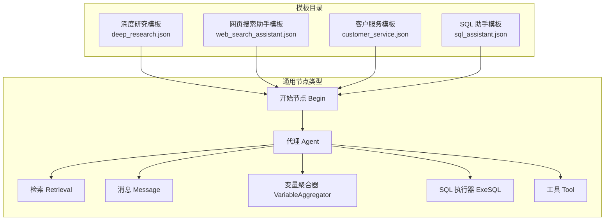
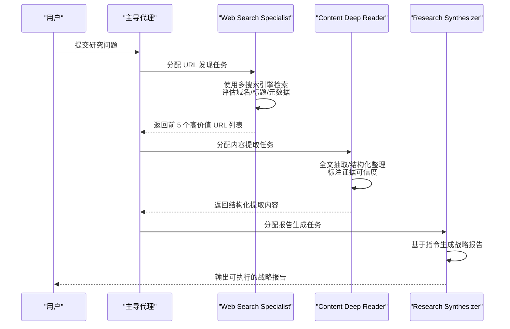
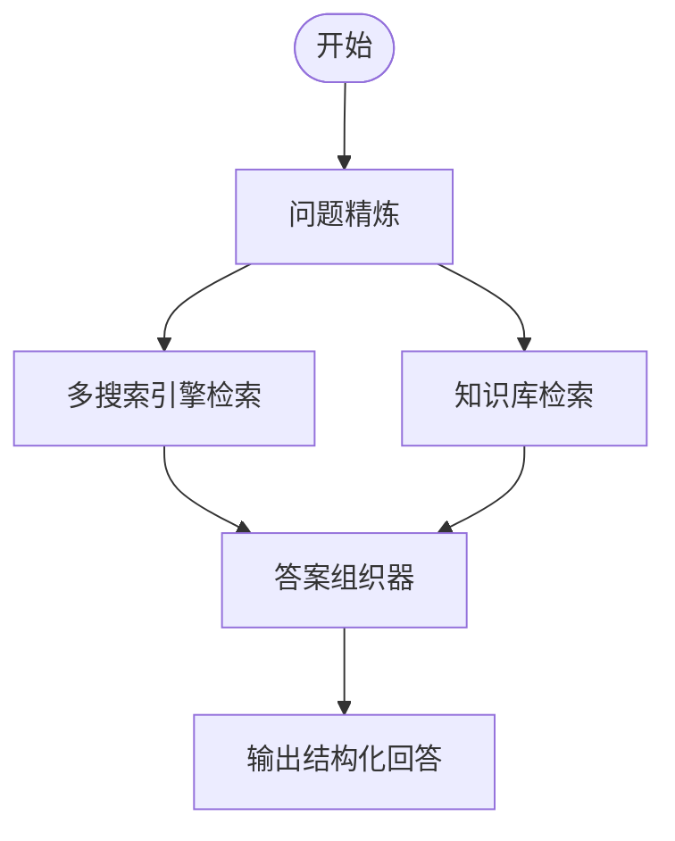
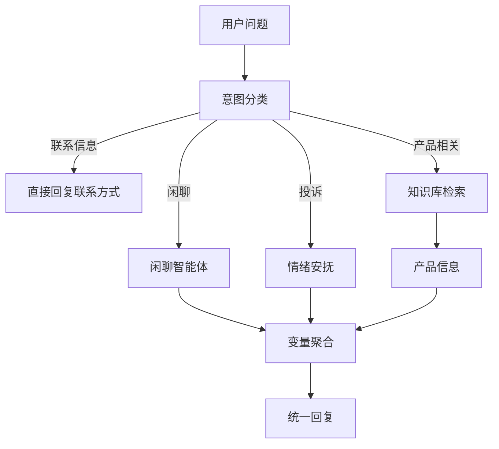
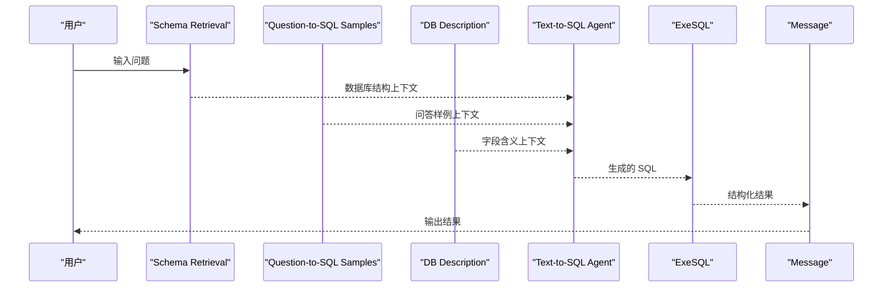
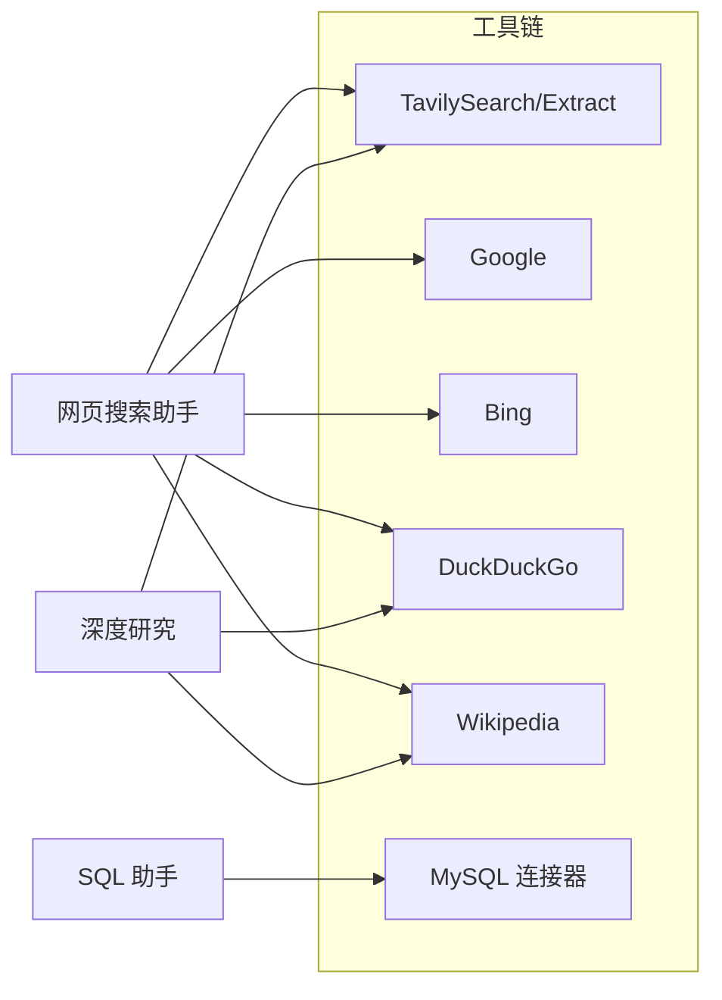

# 高级模板示例

<cite>
**本文档引用的文件**
- [deep_research.json](file://agent/templates/deep_research.json)
- [web_search_assistant.json](file://agent/templates/web_search_assistant.json)
- [customer_service.json](file://agent/templates/customer_service.json)
- [sql_assistant.json](file://agent/templates/sql_assistant.json)
</cite>

## 目录
1. [简介](#简介)
2. [项目结构](#项目结构)
3. [核心组件](#核心组件)
4. [架构总览](#架构总览)
5. [详细组件分析](#详细组件分析)
6. [依赖关系分析](#依赖关系分析)
7. [性能考虑](#性能考虑)
8. [故障排查指南](#故障排查指南)
9. [结论](#结论)
10. [附录](#附录)

## 简介
本指南面向高级用户与平台集成开发者，系统性解读四个高级模板的工作流与实现机制：  
- 深度研究模板：多轮搜索、信息整合、报告生成的完整闭环，强调多源交叉验证与咨询式报告产出。  
- 网页搜索助手模板：结合知识库检索与网络搜索的智能问答流水线，支持多搜索引擎协同与答案组织。  
- 客户服务模板：基于意图分类的多智能体客服系统，覆盖安抚、产品咨询与闲聊等场景。  
- SQL 助手模板：将自然语言转换为结构化 SQL 并执行，支持数据库直连与结果格式化输出。

本指南不仅解释技术架构与搜索策略，还提供高级配置与性能调优建议，帮助在生产环境中稳定高效地运行这些模板。

## 项目结构
高级模板位于 agent/templates 目录下，每个模板以 JSON DSL 描述组件、图结构、全局变量与工具连接关系。模板通过“开始节点”触发，经由“代理”“检索”“消息”“变量聚合器”等节点串联形成端到端工作流。

**图表来源**
- [deep_research.json](file://agent/templates/deep_research.json)
- [web_search_assistant.json](file://agent/templates/web_search_assistant.json)
- [customer_service.json](file://agent/templates/customer_service.json)
- [sql_assistant.json](file://agent/templates/sql_assistant.json)

**章节来源**
- [deep_research.json](file://agent/templates/deep_research.json)
- [web_search_assistant.json](file://agent/templates/web_search_assistant.json)
- [customer_service.json](file://agent/templates/customer_service.json)
- [sql_assistant.json](file://agent/templates/sql_assistant.json)

## 核心组件
- 开始节点 Begin：所有模板的入口，负责初始化会话与全局变量（如 sys.query）。  
- 代理 Agent：承担具体任务的智能体，包含提示词、参数、工具与下游连接。  
- 检索 Retrieval：从知识库检索相关片段，作为上下文注入到后续节点。  
- 变量聚合器 VariableAggregator：将多个代理的输出聚合为统一变量，供最终消息节点使用。  
- 消息 Message：将最终结果以消息形式输出。  
- SQL 执行器 ExeSQL：接收生成的 SQL，连接数据库执行并返回结构化结果。  
- 工具 Tool：封装外部搜索/抽取能力（如 Tavily、Google、Bing、DuckDuckGo、Wikipedia 等）。

**章节来源**
- [deep_research.json](file://agent/templates/deep_research.json)
- [web_search_assistant.json](file://agent/templates/web_search_assistant.json)
- [customer_service.json](file://agent/templates/customer_service.json)
- [sql_assistant.json](file://agent/templates/sql_assistant.json)

## 架构总览
四个模板均采用“开始节点 → 多智能体/检索 → 聚合/输出”的通用模式，差异在于任务域与节点组合：

```mermaid
graph TB
subgraph "深度研究"
DR_Begin["Begin"]
DR_Lead["Lead Agent<br/>多阶段编排"]
DR_Search["Web Search Specialist"]
DR_DeepRead["Content Deep Reader"]
DR_Synthesize["Research Synthesizer"]
DR_End["Message"]
DR_Begin --> DR_Lead --> DR_Search --> DR_DeepRead --> DR_Synthesize --> DR_End
end
subgraph "网页搜索助手"
WSA_Begin["Begin"]
WSA_Refine["Question Refinement"]
WSA_Search["Search-Driven Info Agent"]
WSA_KB["Retrieval from KB"]
WSA_Ask["Answer Organizer"]
WSA_End["Message"]
WSA_Begin --> WSA_Refine --> WSA_Search
WSA_Refine --> WSA_KB --> WSA_Ask --> WSA_End
end
subgraph "客户服务"
CS_Begin["Begin"]
CS_Cat["Categorize"]
CS_Cas["Casual Chat"]
CS_Soothe["Mood Soother"]
CS_Prod["Product Info"]
CS_Agg["VariableAggregator"]
CS_End["Message"]
CS_Begin --> CS_Cat --> CS_Cas
CS_Cat --> CS_Soothe
CS_Cat --> CS_Prod --> CS_Agg --> CS_End
end
subgraph "SQL 助手"
SA_Begin["Begin"]
SA_Schema["Schema Retrieval"]
SA_QA["Question-to-SQL Samples"]
SA_Desc["DB Description"]
SA_Gen["Text-to-SQL Agent"]
SA_Exec["ExeSQL"]
SA_End["Message"]
SA_Begin --> SA_Schema
SA_Begin --> SA_QA
SA_Begin --> SA_Desc
SA_Schema --> SA_Gen
SA_QA --> SA_Gen
SA_Desc --> SA_Gen --> SA_Exec --> SA_End
end
```

**图表来源**
- [deep_research.json](file://agent/templates/deep_research.json)
- [web_search_assistant.json](file://agent/templates/web_search_assistant.json)
- [customer_service.json](file://agent/templates/customer_service.json)
- [sql_assistant.json](file://agent/templates/sql_assistant.json)

## 详细组件分析

### 深度研究模板（多轮搜索、信息整合、报告生成）
该模板构建了“URL 发现 → 内容提取 → 战略合成”的三阶段流水线，强调质量门禁与可复现的执行框架。

- 主导代理 Lead Agent：定义三阶段执行框架、查询类型判定、自适应资源分配与失败恢复策略。  
- 子代理 Web Search Specialist：使用多种搜索工具（Tavily、Google、Bing、DuckDuckGo、Wikipedia）发现高质量 URL，限定输出格式与优先级。  
- 子代理 Content Deep Reader：对 URL 进行结构化抽取，建立证据标注体系（事实/预测/观点/未验证/倾向风险），设定 80% 成功率阈值。  
- 子代理 Research Synthesizer：严格遵循主导指令生成咨询式报告，强调洞察密度与可执行建议，避免“仅列引用”。  

**图表来源**
- [deep_research.json](file://agent/templates/deep_research.json)

**章节来源**
- [deep_research.json](file://agent/templates/deep_research.json)

### 网页搜索助手模板（多搜索引擎协同与答案组织）
该模板将“问题精炼 + 知识库检索 + 网络搜索 + 答案组织”串联，确保回答既有权威依据又有最新动态。

- Question Refinement：将模糊问题改写为更利于检索与回答的表达。  
- Search-Driven Info Agent：提取 3 个关键词，驱动多搜索引擎（Tavily、Google、Bing、DuckDuckGo、Wikipedia）检索，优先近期权威来源，强制引用标注。  
- Retrieval from knowledge bases：从内部知识库检索相关片段，作为权威补充。  
- Answer Organizer：综合用户问题、精炼问题、网络搜索结果与知识库检索结果，生成结构化 Markdown 回答。  

**图表来源**
- [web_search_assistant.json](file://agent/templates/web_search_assistant.json)

**章节来源**
- [web_search_assistant.json](file://agent/templates/web_search_assistant.json)

### 客户服务模板（意图分类与多智能体处理）
该模板通过意图分类将用户问题路由至不同专业智能体，实现“安抚情绪 → 产品咨询 → 闲聊互动”的闭环。

- Categorize：根据问题语义分为“联系信息”“闲聊”“投诉”“产品相关”四类，并将问题分发到对应智能体。  
- Casual Chat：提供轻松日常对话，保持积极友好语气。  
- Mood Soother：在用户不满时提供温暖安慰与鼓励。  
- Product Info：严格基于知识库文档回答产品相关问题，禁止臆测与虚构。  
- VariableAggregator：汇总各智能体输出，统一作为最终回复。  

**图表来源**
- [customer_service.json](file://agent/templates/customer_service.json)

**章节来源**
- [customer_service.json](file://agent/templates/customer_service.json)

### SQL 助手模板（自然语言转 SQL 并执行）
该模板将自然语言问题转换为可执行的 SQL，结合数据库直连返回结构化结果。

- Schema Retrieval：检索数据库结构（DDL/建表语句）作为上下文。  
- Question-to-SQL Samples：检索问答样例，辅助模型理解常见问法与映射关系。  
- DB Description：检索字段含义与业务描述，提升映射准确性。  
- Text-to-SQL Agent：综合以上上下文生成单条正确 MySQL 查询。  
- ExeSQL：连接目标数据库执行 SQL，限制最大记录数并返回结构化内容。  
- Message：将执行结果以消息形式输出。  

**图表来源**
- [sql_assistant.json](file://agent/templates/sql_assistant.json)

**章节来源**
- [sql_assistant.json](file://agent/templates/sql_assistant.json)

## 依赖关系分析
- 组件耦合：模板内部节点高度内聚，跨模板共享“开始节点”“消息节点”等通用组件；不同模板间工具链存在重叠（如 Tavily、Google、Bing、DuckDuckGo、Wikipedia）。  
- 工具依赖：网页搜索助手与深度研究模板依赖外部搜索/抽取工具；SQL 助手依赖数据库连接器与目标数据库。  
- 外部集成点：模板通过“工具”节点对接第三方服务，需关注 API 密钥、配额与速率限制。  
- 循环依赖：模板图结构为有向无环图（DAG），不存在循环依赖，保证执行顺序与稳定性。  

**图表来源**
- [web_search_assistant.json](file://agent/templates/web_search_assistant.json)
- [deep_research.json](file://agent/templates/deep_research.json)
- [sql_assistant.json](file://agent/templates/sql_assistant.json)

**章节来源**
- [web_search_assistant.json](file://agent/templates/web_search_assistant.json)
- [deep_research.json](file://agent/templates/deep_research.json)
- [sql_assistant.json](file://agent/templates/sql_assistant.json)

## 性能考虑
- 并发处理：  
  - 模板内部节点为串行编排，但可通过并行子任务（如多搜索引擎并行）提升吞吐。  
  - 对于知识库检索与网络搜索，建议在上游节点并行执行，下游统一聚合。  
- 缓存策略：  
  - 对高频检索结果与常用样例进行缓存，减少重复请求与延迟。  
  - 对外部工具响应进行短期缓存，结合 TTL 控制一致性与性能平衡。  
- 资源管理：  
  - 合理设置代理温度、最大令牌与轮次上限，避免长上下文导致的性能退化。  
  - 对数据库执行设置超时与最大记录数限制，防止大查询阻塞系统。  
- 搜索质量：  
  - 深度研究模板设定 80% 抽取成功率阈值与质量门禁，建议在生产中保留并监控。  
  - 网页搜索助手对权威来源优先级与近期性进行约束，有助于降低噪声与过时信息影响。  

[本节为通用指导，不直接分析特定文件]

## 故障排查指南
- 搜索工具异常：  
  - 检查工具 API 密钥与配额；确认网络可达性与代理超时设置。  
  - 在网页搜索助手与深度研究模板中，若工具调用失败，建议回退到备用工具或简化查询关键词。  
- 抽取失败：  
  - 深度研究模板要求 80% 成功率，若低于阈值，检查 URL 权威性与付费墙限制，必要时启用元数据/摘要抽取。  
- SQL 执行错误：  
  - 校验生成 SQL 的语法与权限；限制最大记录数并捕获异常，避免长时间锁表或超时。  
- 输出格式问题：  
  - 确保 Answer Organizer 与 Research Synthesizer 的输出格式符合预期，避免泄露中间数据或调试信息。  

**章节来源**
- [deep_research.json](file://agent/templates/deep_research.json)
- [web_search_assistant.json](file://agent/templates/web_search_assistant.json)
- [sql_assistant.json](file://agent/templates/sql_assistant.json)

## 结论
四个高级模板分别覆盖“研究型问答”“网页检索融合”“客户服务意图路由”与“自然语言到 SQL”的典型业务场景。它们通过明确的节点职责、严格的输出规范与质量门禁，实现了可复现、可扩展且易于维护的智能工作流。结合合理的并发、缓存与资源管理策略，可在生产环境稳定落地并持续优化。

[本节为总结性内容，不直接分析特定文件]

## 附录
- 高级配置建议：  
  - 温度与采样：对需要稳定输出的任务（如 SQL 生成、报告合成）降低温度；对创意类任务适度提高。  
  - 上下文窗口：确保长上下文模型具备足够窗口，避免截断关键信息。  
  - 工具参数：为外部工具设置合理的超时、重试次数与并发上限，避免成为瓶颈。  
  - 监控与日志：对关键节点（搜索、抽取、执行）埋点，记录耗时与成功率，便于定位性能与质量问题。  

[本节为通用指导，不直接分析特定文件]