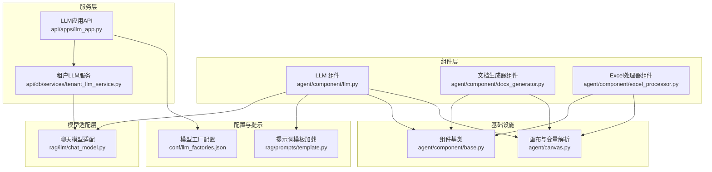
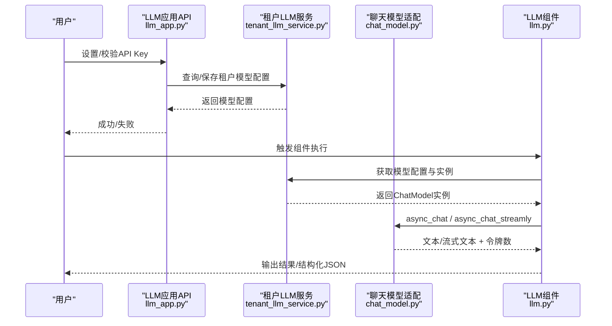
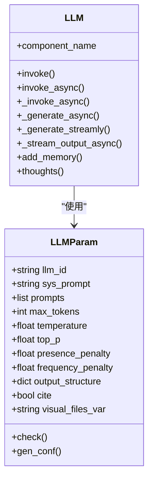
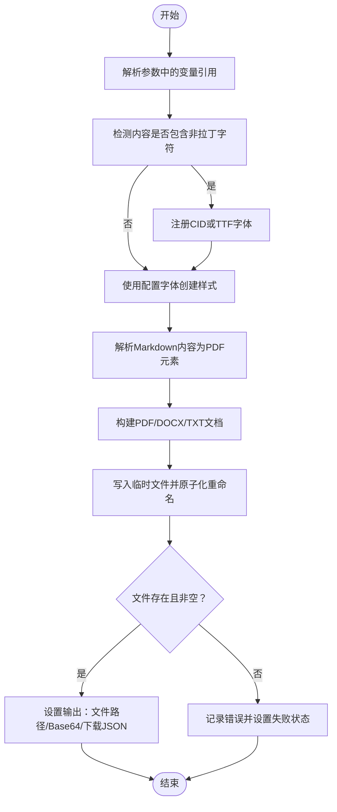
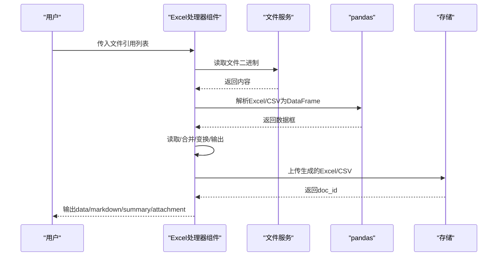
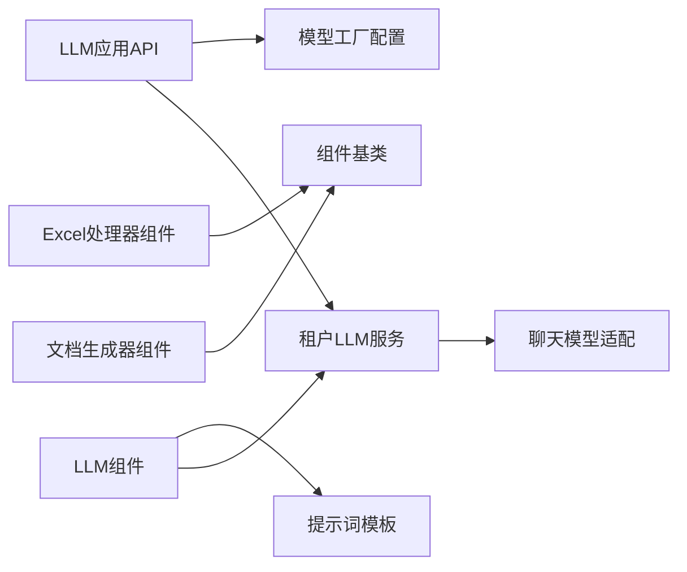

# LLM集成组件

<cite>
**本文引用的文件**
- [agent/component/llm.py](file://agent/component/llm.py)
- [agent/component/docs_generator.py](file://agent/component/docs_generator.py)
- [agent/component/excel_processor.py](file://agent/component/excel_processor.py)
- [api/apps/llm_app.py](file://api/apps/llm_app.py)
- [api/db/services/tenant_llm_service.py](file://api/db/services/tenant_llm_service.py)
- [rag/llm/chat_model.py](file://rag/llm/chat_model.py)
- [conf/llm_factories.json](file://conf/llm_factories.json)
- [agent/component/base.py](file://agent/component/base.py)
- [agent/canvas.py](file://agent/canvas.py)
- [rag/prompts/template.py](file://rag/prompts/template.py)
</cite>

## 目录
1. [简介](#简介)
2. [项目结构](#项目结构)
3. [核心组件](#核心组件)
4. [架构总览](#架构总览)
5. [详细组件分析](#详细组件分析)
6. [依赖关系分析](#依赖关系分析)
7. [性能考虑](#性能考虑)
8. [故障排除指南](#故障排除指南)
9. [结论](#结论)
10. [附录](#附录)

## 简介
本技术文档聚焦于LLM集成组件，涵盖以下方面：
- LLM组件：大语言模型集成机制（模型选择、参数配置、调用接口、响应处理、工具调用、流式输出）。
- 文档生成器组件（PDF/Word/文本）：模板系统、内容生成、样式与多语言支持、格式化输出。
- Excel处理器组件：表格解析、数据提取、合并与变换、格式转换与输出。
- 外部LLM服务集成：认证机制、API调用、错误分类与重试策略、令牌统计与追踪。

## 项目结构
围绕LLM集成的关键模块分布如下：
- 组件层：agent/component 下的 llm.py、docs_generator.py、excel_processor.py。
- 服务层：api/apps/llm_app.py 提供LLM工厂与密钥管理API；api/db/services/tenant_llm_service.py 负责租户模型配置与实例化。
- 模型适配层：rag/llm/chat_model.py 封装不同厂商模型客户端与统一接口。
- 配置与提示：conf/llm_factories.json 定义可用模型工厂与模型清单；rag/prompts/template.py 提供提示词加载。
- 基类与画布：agent/component/base.py 提供组件基类与输入/输出管理；agent/canvas.py 提供变量解析与执行图。

**图表来源**
- [agent/component/llm.py:82-352](file://agent/component/llm.py#L82-L352)
- [agent/component/docs_generator.py:96-405](file://agent/component/docs_generator.py#L96-L405)
- [agent/component/excel_processor.py:91-402](file://agent/component/excel_processor.py#L91-L402)
- [api/apps/llm_app.py:31-126](file://api/apps/llm_app.py#L31-L126)
- [api/db/services/tenant_llm_service.py:134-182](file://api/db/services/tenant_llm_service.py#L134-L182)
- [rag/llm/chat_model.py:65-147](file://rag/llm/chat_model.py#L65-L147)
- [conf/llm_factories.json:1-200](file://conf/llm_factories.json#L1-L200)
- [rag/prompts/template.py:8-20](file://rag/prompts/template.py#L8-L20)
- [agent/component/base.py:365-585](file://agent/component/base.py#L365-L585)
- [agent/canvas.py:189-227](file://agent/canvas.py#L189-L227)

**章节来源**
- [agent/component/llm.py:82-352](file://agent/component/llm.py#L82-L352)
- [agent/component/docs_generator.py:96-405](file://agent/component/docs_generator.py#L96-L405)
- [agent/component/excel_processor.py:91-402](file://agent/component/excel_processor.py#L91-L402)
- [api/apps/llm_app.py:31-126](file://api/apps/llm_app.py#L31-L126)
- [api/db/services/tenant_llm_service.py:134-182](file://api/db/services/tenant_llm_service.py#L134-L182)
- [rag/llm/chat_model.py:65-147](file://rag/llm/chat_model.py#L65-L147)
- [conf/llm_factories.json:1-200](file://conf/llm_factories.json#L1-L200)
- [rag/prompts/template.py:8-20](file://rag/prompts/template.py#L8-L20)
- [agent/component/base.py:365-585](file://agent/component/base.py#L365-L585)
- [agent/canvas.py:189-227](file://agent/canvas.py#L189-L227)

## 核心组件
- LLM组件：负责系统提示与用户消息构建、参数清洗、结构化输出、工具调用、流式输出、图片输入（图像到文本）、异常处理与取消控制。
- 文档生成器组件：支持PDF/DOCX/TXT三种输出，具备多语言字体注册、样式表、页眉页脚、目录、水印、分页号等高级特性。
- Excel处理器组件：支持读取Excel/CSV、多文件合并、按列连接、基于指令的数据变换、Markdown导出与最终Excel/CSV输出。

**章节来源**
- [agent/component/llm.py:33-157](file://agent/component/llm.py#L33-L157)
- [agent/component/docs_generator.py:25-83](file://agent/component/docs_generator.py#L25-L83)
- [agent/component/excel_processor.py:38-76](file://agent/component/excel_processor.py#L38-L76)

## 架构总览
LLM组件通过租户模型服务获取当前租户的模型配置，实例化具体厂商的聊天模型客户端，再调用统一的异步接口进行对话或工具调用。文档生成器与Excel处理器作为独立组件，分别对接PDF库与pandas生态，均通过组件基类提供统一的输入/输出与异常处理。

**图表来源**
- [api/apps/llm_app.py:58-126](file://api/apps/llm_app.py#L58-L126)
- [api/db/services/tenant_llm_service.py:134-182](file://api/db/services/tenant_llm_service.py#L134-L182)
- [rag/llm/chat_model.py:484-497](file://rag/llm/chat_model.py#L484-L497)
- [agent/component/llm.py:264-342](file://agent/component/llm.py#L264-L342)

## 详细组件分析

### LLM组件
- 模型选择与参数配置
  - 通过租户模型服务根据租户ID与模型名解析实际工厂与模型类型，并返回可调用的模型实例。
  - 参数对象支持温度、采样、最大生成长度、惩罚项等，且仅在允许范围内传递给不同厂商的API。
- 调用接口
  - 同步/异步对话接口，支持工具调用（函数调用）与流式输出。
  - 对于特定模型（如QwQ、Qwen3），内部做特殊参数处理以兼容不同厂商行为。
- 响应处理
  - 支持结构化输出（JSON Schema），自动清理与修复不合规JSON。
  - 流式输出时对<think>思维标记进行包裹/剥离，保证前端渲染一致性。
  - 上下文消息压缩与长度通知（中/英）。
- 图片输入
  - 当存在视觉文件变量且模型类型为图像到文本时，自动切换到图像到文本模型。
- 异常与取消
  - 组件级取消检测；错误分类与指数退避重试；统一错误前缀包装便于上层识别。

**图表来源**
- [agent/component/llm.py:33-157](file://agent/component/llm.py#L33-L157)
- [agent/component/llm.py:82-352](file://agent/component/llm.py#L82-L352)

**章节来源**
- [agent/component/llm.py:33-157](file://agent/component/llm.py#L33-L157)
- [agent/component/llm.py:169-342](file://agent/component/llm.py#L169-L342)
- [rag/llm/chat_model.py:65-147](file://rag/llm/chat_model.py#L65-L147)

### 文档生成器组件（PDF/DOCX/TXT）
- 模板系统与内容生成
  - 支持从参数中解析变量（含Message块的partial流式内容），并替换模板占位符。
  - Markdown风格内容解析为PDF元素（标题、段落、列表、表格、代码块、水平线等）。
- 样式与多语言支持
  - 自动检测CJK/阿拉伯/希伯来等复杂脚本，优先注册CID字体以确保跨平台稳定渲染。
  - 支持自定义字体族、字号、颜色、行距、页边距、页面尺寸与方向。
- 高级功能
  - 页眉页脚、时间戳、分页号、水印、目录（可选）。
  - 输出为文件路径、Base64与下载信息JSON三类输出，便于前端直接下载。
- 错误处理
  - 文件创建/写入原子化（临时文件+重命名），异常时清理临时文件；记录详细错误并设置输出状态。

**图表来源**
- [agent/component/docs_generator.py:266-405](file://agent/component/docs_generator.py#L266-L405)
- [agent/component/docs_generator.py:406-536](file://agent/component/docs_generator.py#L406-L536)
- [agent/component/docs_generator.py:537-702](file://agent/component/docs_generator.py#L537-L702)

**章节来源**
- [agent/component/docs_generator.py:25-83](file://agent/component/docs_generator.py#L25-L83)
- [agent/component/docs_generator.py:266-405](file://agent/component/docs_generator.py#L266-L405)
- [agent/component/docs_generator.py:406-536](file://agent/component/docs_generator.py#L406-L536)
- [agent/component/docs_generator.py:537-702](file://agent/component/docs_generator.py#L537-L702)

### Excel处理器组件
- 输入与解析
  - 支持多文件输入（Begin/UserFillUp组件传入的文件引用），自动解析Excel/CSV，支持指定工作表或全部工作表。
- 数据处理
  - 读取：将每个工作表转为字典列表与Markdown预览，汇总统计。
  - 合并：支持拼接与按列连接（join），可配置连接键。
  - 变换：接收上游数据（单表或多表），转为DataFrame并生成Markdown预览。
- 输出
  - 生成Excel（多工作表）或CSV（仅首表），上传至存储并输出附件元信息（doc_id、格式、文件名）。
- 错误处理
  - 解析失败/空数据/无效格式时设置摘要输出并记录日志。

**图表来源**
- [agent/component/excel_processor.py:114-131](file://agent/component/excel_processor.py#L114-L131)
- [agent/component/excel_processor.py:132-168](file://agent/component/excel_processor.py#L132-L168)
- [agent/component/excel_processor.py:169-199](file://agent/component/excel_processor.py#L169-L199)
- [agent/component/excel_processor.py:321-388](file://agent/component/excel_processor.py#L321-L388)

**章节来源**
- [agent/component/excel_processor.py:38-76](file://agent/component/excel_processor.py#L38-L76)
- [agent/component/excel_processor.py:114-131](file://agent/component/excel_processor.py#L114-L131)
- [agent/component/excel_processor.py:169-199](file://agent/component/excel_processor.py#L169-L199)
- [agent/component/excel_processor.py:321-388](file://agent/component/excel_processor.py#L321-L388)

## 依赖关系分析
- 组件与服务
  - LLM组件依赖租户模型服务获取配置与实例；文档生成器与Excel处理器依赖组件基类与画布变量解析。
- 模型适配
  - 不同厂商（OpenAI、本地/兼容接口、LiteLLM等）通过统一Base类封装，屏蔽差异。
- 配置与提示
  - 模型工厂清单来自配置文件；提示词通过模板加载器读取。

**图表来源**
- [agent/component/llm.py:82-91](file://agent/component/llm.py#L82-L91)
- [api/db/services/tenant_llm_service.py:134-182](file://api/db/services/tenant_llm_service.py#L134-L182)
- [api/apps/llm_app.py:31-56](file://api/apps/llm_app.py#L31-L56)
- [conf/llm_factories.json:1-200](file://conf/llm_factories.json#L1-L200)
- [rag/prompts/template.py:8-20](file://rag/prompts/template.py#L8-L20)
- [agent/component/base.py:365-585](file://agent/component/base.py#L365-L585)

**章节来源**
- [agent/component/llm.py:82-91](file://agent/component/llm.py#L82-L91)
- [api/db/services/tenant_llm_service.py:134-182](file://api/db/services/tenant_llm_service.py#L134-L182)
- [api/apps/llm_app.py:31-56](file://api/apps/llm_app.py#L31-L56)
- [conf/llm_factories.json:1-200](file://conf/llm_factories.json#L1-L200)
- [rag/prompts/template.py:8-20](file://rag/prompts/template.py#L8-L20)
- [agent/component/base.py:365-585](file://agent/component/base.py#L365-L585)

## 性能考虑
- 并发与超时
  - 组件默认执行超时由环境变量控制；并发聊天上限可通过环境变量限制。
- 令牌统计与成本控制
  - 模型适配层在每次调用后返回令牌数，便于统计与成本控制。
- 流式输出
  - 流式接口逐块产出，降低首屏延迟；同时记录累计令牌数。
- 文件处理
  - Excel解析采用pandas，注意大数据量时内存占用；建议分批处理或限制工作表数量。

**章节来源**
- [agent/component/base.py:367-447](file://agent/component/base.py#L367-L447)
- [rag/llm/chat_model.py:184-206](file://rag/llm/chat_model.py#L184-L206)
- [rag/llm/chat_model.py:484-497](file://rag/llm/chat_model.py#L484-L497)

## 故障排除指南
- LLM调用失败
  - 检查API Key有效性与模型可用性；查看错误分类（限流、鉴权、请求格式、服务器、超时、连接、内容过滤、配额、模型不存在、重试耗尽等）。
  - 开启更长读超时与适当增加重试次数。
- 文档生成失败
  - 确认输出目录存在且可写；检查生成的文件是否存在且非空；关注字体注册失败时的回退逻辑。
- Excel处理异常
  - 确认输入文件引用有效；检查工作表名称与连接键；关注空数据/无效格式的摘要输出。
- 取消与超时
  - 组件支持中途取消，取消时会记录任务ID与阶段信息；超时常可通过环境变量调整。

**章节来源**
- [rag/llm/chat_model.py:91-111](file://rag/llm/chat_model.py#L91-L111)
- [rag/llm/chat_model.py:219-254](file://rag/llm/chat_model.py#L219-L254)
- [agent/component/docs_generator.py:517-536](file://agent/component/docs_generator.py#L517-L536)
- [agent/component/excel_processor.py:386-388](file://agent/component/excel_processor.py#L386-L388)
- [agent/component/base.py:393-405](file://agent/component/base.py#L393-L405)

## 结论
本技术文档梳理了LLM集成组件的实现细节与运行机制，覆盖模型选择、参数配置、调用接口、响应处理、工具调用、流式输出、文档生成与Excel处理等关键能力。通过统一的服务层与适配层，系统实现了对多家厂商模型的兼容与扩展，同时提供了稳健的错误处理与性能优化策略。建议在生产环境中结合令牌统计与日志追踪，持续监控与优化模型调用质量与成本。

## 附录
- 使用示例与最佳实践
  - LLM组件：在系统提示中嵌入结构化输出Schema，启用工具调用并配合流式输出提升交互体验；对长上下文场景使用消息压缩与长度通知。
  - 文档生成器：优先使用CID字体以保障多语言排版；合理设置页边距与行距；利用下载信息JSON在前端直接触发下载。
  - Excel处理器：对大批量数据先做合并与变换，再输出Excel；CSV仅保留首表以简化下游处理。
- 配置参考
  - 模型工厂与模型清单：参见模型工厂配置文件。
  - 组件超时与并发：通过环境变量控制组件执行超时与并发聊天上限。
  - LLM调用超时与重试：通过环境变量控制读超时与重试次数。

**章节来源**
- [conf/llm_factories.json:1-200](file://conf/llm_factories.json#L1-L200)
- [agent/component/base.py:367-447](file://agent/component/base.py#L367-L447)
- [rag/llm/chat_model.py:68-84](file://rag/llm/chat_model.py#L68-L84)