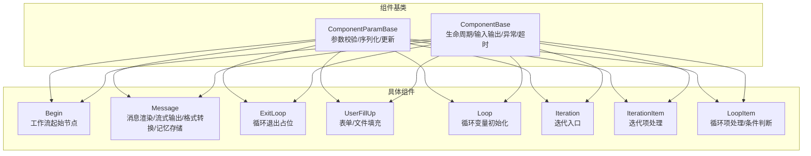
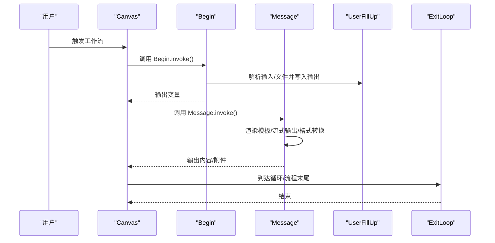
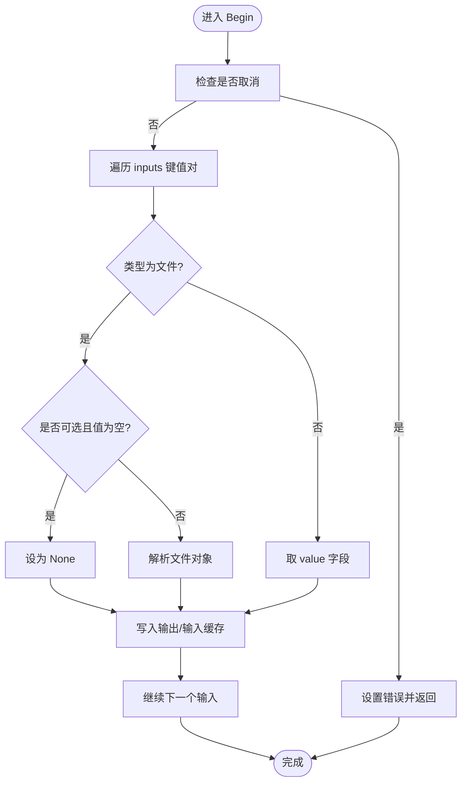
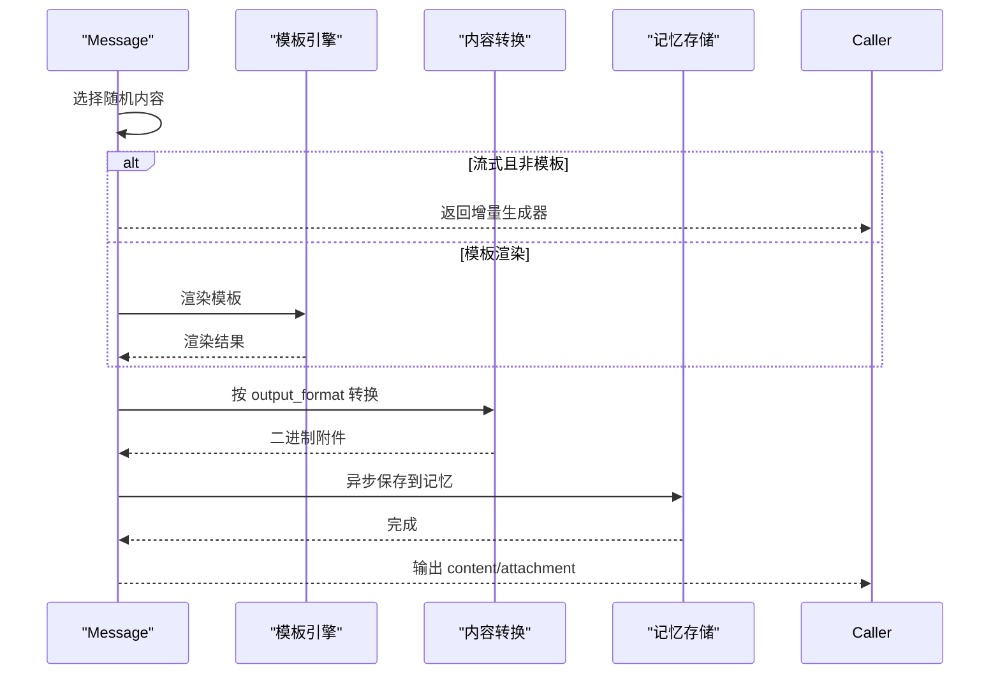
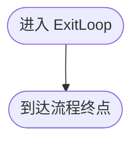
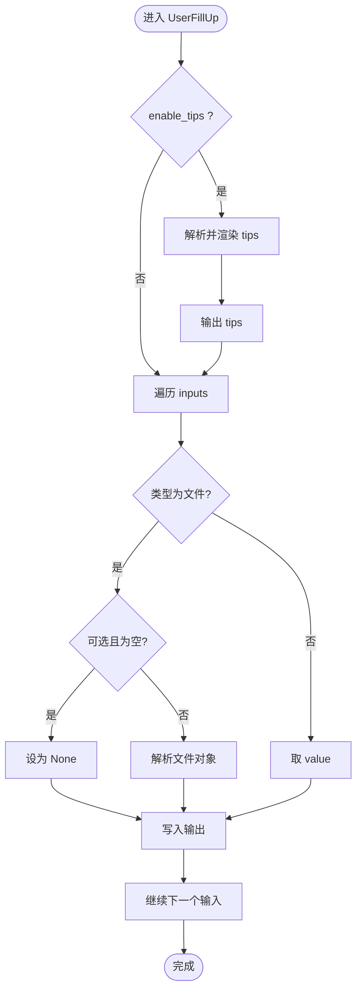
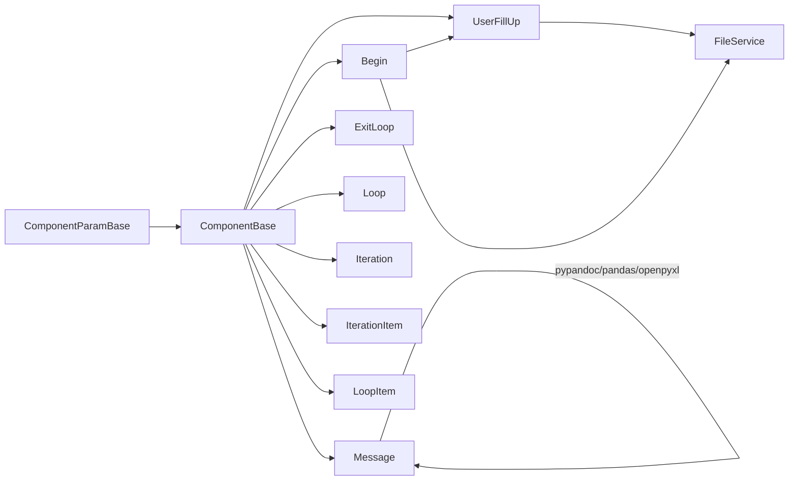

# 基础组件

<cite>
**本文引用的文件**
- [agent/component/base.py](file://agent/component/base.py)
- [agent/component/fillup.py](file://agent/component/fillup.py)
- [agent/component/begin.py](file://agent/component/begin.py)
- [agent/component/message.py](file://agent/component/message.py)
- [agent/component/exit_loop.py](file://agent/component/exit_loop.py)
- [agent/component/loop.py](file://agent/component/loop.py)
- [agent/component/iteration.py](file://agent/component/iteration.py)
- [agent/component/iterationitem.py](file://agent/component/iterationitem.py)
- [agent/component/loopitem.py](file://agent/component/loopitem.py)
- [agent/test/dsl_examples/iteration.json](file://agent/test/dsl_examples/iteration.json)
</cite>

## 目录
1. [简介](#简介)
2. [项目结构](#项目结构)
3. [核心组件](#核心组件)
4. [架构总览](#架构总览)
5. [详细组件分析](#详细组件分析)
6. [依赖分析](#依赖分析)
7. [性能考虑](#性能考虑)
8. [故障排查指南](#故障排查指南)
9. [结论](#结论)
10. [附录](#附录)

## 简介
本文件面向“基础组件”模块，聚焦以下组件的能力与用法：begin（工作流起始节点）、message（消息处理）、exit_loop（循环退出）、fillup（数据填充）。文档从系统架构、数据流、处理逻辑、错误处理与性能特征等方面进行深入解析，并提供配置参数说明、使用示例与常见问题解决方案，帮助开发者在实际工作流中正确协作与落地。

## 项目结构
基础组件位于 agent/component 目录下，采用“参数类 + 组件类”的分层设计，所有组件均继承自统一的基类体系，具备一致的生命周期、输入输出管理、异常处理与超时控制能力。典型组件包括：
- 参数基类：ComponentParamBase
- 组件基类：ComponentBase
- 具体组件：Begin、Message、ExitLoop、UserFillUp（被 Begin 复用）、Loop、Iteration、IterationItem、LoopItem

图表来源
- [agent/component/base.py:40-585](file://agent/component/base.py#L40-L585)
- [agent/component/begin.py:20-60](file://agent/component/begin.py#L20-L60)
- [agent/component/fillup.py:24-78](file://agent/component/fillup.py#L24-L78)
- [agent/component/message.py:39-441](file://agent/component/message.py#L39-L441)
- [agent/component/exit_loop.py:20-32](file://agent/component/exit_loop.py#L20-L32)
- [agent/component/loop.py:20-80](file://agent/component/loop.py#L20-L80)
- [agent/component/iteration.py:27-72](file://agent/component/iteration.py#L27-L72)
- [agent/component/iterationitem.py:28-92](file://agent/component/iterationitem.py#L28-L92)
- [agent/component/loopitem.py:27-167](file://agent/component/loopitem.py#L27-L167)

章节来源
- [agent/component/base.py:40-585](file://agent/component/base.py#L40-L585)

## 核心组件
本节概述四个目标组件的核心职责与关键行为：
- Begin：工作流起始节点，负责接收用户输入、解析文件类型、将输入映射到输出，支持会话模式与任务模式。
- Message：消息渲染与输出，支持模板渲染、流式输出、内容格式转换（Markdown/HTML/PDF/Docx/XLSX）以及记忆存储。
- ExitLoop：循环退出占位组件，不执行业务逻辑，仅作为流程终止标记。
- UserFillUp：通用表单/文件填充器，支持提示信息渲染、输入元素提取与输出设置；Begin 继承该能力。

章节来源
- [agent/component/begin.py:20-60](file://agent/component/begin.py#L20-L60)
- [agent/component/fillup.py:24-78](file://agent/component/fillup.py#L24-L78)
- [agent/component/message.py:39-441](file://agent/component/message.py#L39-L441)
- [agent/component/exit_loop.py:20-32](file://agent/component/exit_loop.py#L20-L32)

## 架构总览
基础组件通过统一的基类体系实现一致的生命周期与运行时行为。组件在 Canvas 上下文中运行，通过变量引用表达式连接上下游组件，支持同步与异步调用、取消检测、异常处理与超时控制。

图表来源
- [agent/component/base.py:407-448](file://agent/component/base.py#L407-L448)
- [agent/component/begin.py:40-60](file://agent/component/begin.py#L40-L60)
- [agent/component/fillup.py:38-78](file://agent/component/fillup.py#L38-L78)
- [agent/component/message.py:180-205](file://agent/component/message.py#L180-L205)
- [agent/component/exit_loop.py:28-32](file://agent/component/exit_loop.py#L28-L32)

## 详细组件分析

### Begin 组件（工作流起始节点）
- 初始化参数
  - mode：运行模式，取值范围为“conversational”、“task”、“Webhook”，默认“conversational”
  - prologue：会话开始语，默认“Hi! I'm your smart assistant. What can I do for you?”
  - 继承 UserFillUp 的 tips 与 enable_tips
- 启动条件
  - 从上游传入的 inputs 中读取键值对，逐项处理
  - 对类型为“file”的输入，若非可选且值为空则置空；否则通过文件服务解析为文件对象
  - 将处理后的值写入输出与输入缓存
- 状态管理
  - 每次调用重置输出，避免历史残留
  - 支持取消检测，若任务被取消则记录错误并返回
- 使用示例
  - 在 DSL 中作为首个节点，下游通常接 Agent 或 Message
  - 参考测试样例：[iteration.json:3-12](file://agent/test/dsl_examples/iteration.json#L3-L12)

图表来源
- [agent/component/begin.py:40-60](file://agent/component/begin.py#L40-L60)

章节来源
- [agent/component/begin.py:20-60](file://agent/component/begin.py#L20-L60)
- [agent/test/dsl_examples/iteration.json:3-12](file://agent/test/dsl_examples/iteration.json#L3-L12)

### Message 组件（消息处理）
- 初始化参数
  - content：消息内容数组（随机选择其一），支持模板语法
  - stream：是否启用流式输出
  - output_format：输出格式（可选），支持“markdown”、“html”、“pdf”、“docx”、“xlsx”
  - auto_play：自动播放（保留字段）
  - outputs：默认输出“content”，可附加“attachment”（当 output_format 生效时）
- 消息格式与路由
  - 若未启用模板且允许流式，则返回部分函数以支持增量输出
  - 否则通过 Jinja2 渲染模板，替换变量后输出
  - 变量引用支持组件间引用与系统变量（如 sys.query）
- 内容转换
  - 当 output_format 非空时，将内容转换为指定格式并上传至存储，输出 attachment
  - XLSX 转换会解析 Markdown 表格并写入多个工作表
- 记忆存储
  - 可将用户输入与响应写入记忆队列（需配置 memory_ids）

图表来源
- [agent/component/message.py:180-205](file://agent/component/message.py#L180-L205)
- [agent/component/message.py:251-428](file://agent/component/message.py#L251-L428)
- [agent/component/message.py:429-441](file://agent/component/message.py#L429-L441)

章节来源
- [agent/component/message.py:39-441](file://agent/component/message.py#L39-L441)

### ExitLoop 组件（循环退出）
- 功能定位
  - 作为循环或迭代流程的结束标记，不执行任何业务逻辑
  - 用于指示工作流在此处终止，便于画布渲染与流程控制
- 状态管理
  - 无内部状态，仅作为流程终点存在
- 使用建议
  - 在循环/迭代结束后连接 ExitLoop，确保流程清晰可读

图表来源
- [agent/component/exit_loop.py:28-32](file://agent/component/exit_loop.py#L28-L32)

章节来源
- [agent/component/exit_loop.py:20-32](file://agent/component/exit_loop.py#L20-L32)

### UserFillUp 组件（数据填充）
- 初始化参数
  - enable_tips：是否启用提示信息
  - tips：提示文本，支持变量替换
- 输入处理
  - 若启用 tips，先解析提示中的变量并渲染，再输出“tips”
  - 遍历 inputs，对文件类型按 Begin 的策略处理，否则取 value
  - 将处理结果写入同名输出键
- 思考输出
  - 返回等待用户输入的提示字符串

图表来源
- [agent/component/fillup.py:38-78](file://agent/component/fillup.py#L38-L78)

章节来源
- [agent/component/fillup.py:24-78](file://agent/component/fillup.py#L24-L78)

### 组件协作与最佳实践
- 工作流起始与消息输出
  - Begin 作为首节点收集输入，随后由 Message 进行渲染与输出；若需要格式转换，可在 Message 中配置 output_format
- 循环与迭代
  - Loop/LoopItem：用于固定次数或条件驱动的循环；LoopItem 提供条件评估与结束判断
  - Iteration/IterationItem：基于数组的迭代；IterationItem 负责轮次推进与结果聚合
- 退出控制
  - ExitLoop 作为流程终点，建议在循环/迭代结束后显式连接，保证流程边界清晰
- 最佳实践
  - 明确变量命名与作用域，优先使用组件间引用表达式
  - 在 Message 中合理设置 stream 与 output_format，平衡实时性与资源消耗
  - 在 Begin 中对文件输入进行可选性与类型校验，避免空值传播
  - 使用取消检测与超时控制，提升长流程稳定性

章节来源
- [agent/component/loop.py:43-80](file://agent/component/loop.py#L43-L80)
- [agent/component/iteration.py:49-72](file://agent/component/iteration.py#L49-L72)
- [agent/component/iterationitem.py:35-92](file://agent/component/iterationitem.py#L35-L92)
- [agent/component/loopitem.py:35-167](file://agent/component/loopitem.py#L35-L167)
- [agent/test/dsl_examples/iteration.json:1-92](file://agent/test/dsl_examples/iteration.json#L1-L92)

## 依赖分析
- 组件基类
  - ComponentParamBase：提供参数校验、更新、序列化与验证规则加载
  - ComponentBase：提供生命周期管理、输入输出管理、异常处理、超时控制、变量引用解析
- 具体组件依赖
  - Begin 依赖 UserFillUp 的输入处理能力与 FileService 的文件解析
  - Message 依赖 Jinja2 模板、pypandoc/pandas/openpyxl 等库进行内容转换
  - ExitLoop 为纯流程标记，无业务依赖
  - UserFillUp 依赖 FileService 进行文件解析
  - Loop/Iteration/LoopItem/IterationItem 提供循环/迭代控制与变量管理

图表来源
- [agent/component/base.py:40-585](file://agent/component/base.py#L40-L585)
- [agent/component/begin.py:16-17](file://agent/component/begin.py#L16-L17)
- [agent/component/fillup.py:20-21](file://agent/component/fillup.py#L20-L21)
- [agent/component/message.py:20-36](file://agent/component/message.py#L20-L36)

章节来源
- [agent/component/base.py:40-585](file://agent/component/base.py#L40-L585)
- [agent/component/begin.py:16-17](file://agent/component/begin.py#L16-L17)
- [agent/component/fillup.py:20-21](file://agent/component/fillup.py#L20-L21)
- [agent/component/message.py:20-36](file://agent/component/message.py#L20-L36)

## 性能考虑
- 流式输出
  - Message 在未启用模板时可返回异步生成器，降低首屏延迟，但需注意内存与并发
- 内容转换
  - XLSX/HTML/PDF/Docx 转换涉及临时文件与第三方库，建议限制并发与设置合理超时
- 取消与超时
  - 所有组件均内置取消检测与超时装饰器，建议结合环境变量调整最大并发与执行超时
- 文件处理
  - Begin 对文件输入进行批量解析，建议在上游进行类型与可选性校验，减少无效 IO

## 故障排查指南
- 常见问题
  - Begin 无法读取文件输入：检查输入类型是否包含“file”，可选字段是否为空
  - Message 渲染失败：确认 content 数组非空，模板变量是否完整
  - XLSX 转换无表格：检查 Markdown 表格格式是否规范，标题与分隔线是否正确
  - 流式输出中断：检查取消信号与网络波动
- 排查步骤
  - 查看组件输出中的 _ERROR 字段
  - 开启调试输入 debug_inputs，核对变量引用与上游输出
  - 检查 Canvas 取消状态与超时设置
- 相关实现参考
  - 组件基类的异常处理与超时控制：[invoke:407-448](file://agent/component/base.py#L407-L448)、[invoke_async:421-448](file://agent/component/base.py#L421-L448)
  - Begin 的文件解析与输出设置：[invoke:40-60](file://agent/component/begin.py#L40-L60)
  - Message 的模板渲染与转换：[invoke:180-205](file://agent/component/message.py#L180-L205)、[convert_content:251-428](file://agent/component/message.py#L251-L428)

章节来源
- [agent/component/base.py:407-448](file://agent/component/base.py#L407-L448)
- [agent/component/begin.py:40-60](file://agent/component/begin.py#L40-L60)
- [agent/component/message.py:251-428](file://agent/component/message.py#L251-L428)

## 结论
Begin、Message、ExitLoop、UserFillUp 四个基础组件分别承担“输入收集/文件解析”“消息渲染/格式转换/记忆存储”“流程终止标记”“通用表单/文件填充”的职责。它们依托统一的基类体系，具备一致的生命周期与运行时保障。在实际应用中，应明确变量引用、合理配置流式与格式转换、善用取消与超时控制，并结合循环/迭代组件构建复杂工作流。

## 附录
- 配置参数速查
  - Begin
    - mode：字符串，取值“conversational”“task”“Webhook”
    - prologue：字符串，会话开始语
    - inputs：字典，键为输出名，值为“type/value/optional”等
  - Message
    - content：字符串数组（模板）
    - stream：布尔，是否流式
    - output_format：字符串，可选“markdown/html/pdf/docx/xlsx”
    - auto_play：布尔（保留）
  - UserFillUp
    - enable_tips：布尔
    - tips：字符串（支持变量）
  - Loop/Iteration/LoopItem/IterationItem
    - 参考对应参数类定义与调用逻辑
- 使用示例
  - 参考 DSL 示例：[iteration.json:1-92](file://agent/test/dsl_examples/iteration.json#L1-L92)，展示 Begin → Agent → Iteration → IterationItem → Tool → Agent → Message 的典型链路