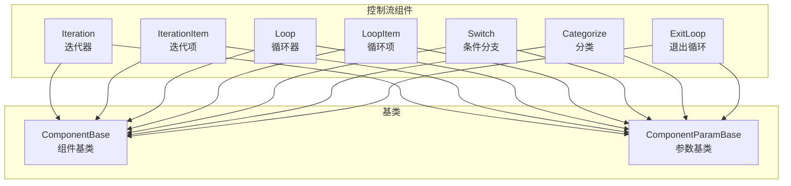
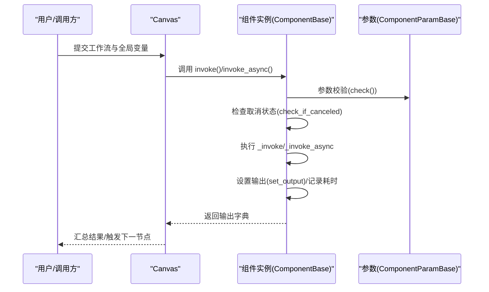
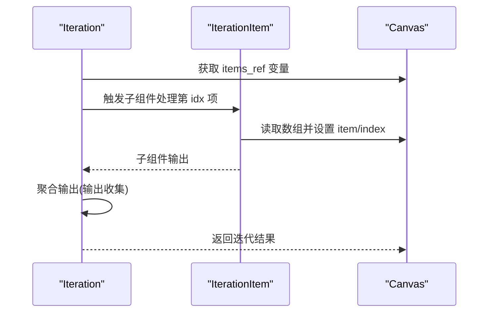
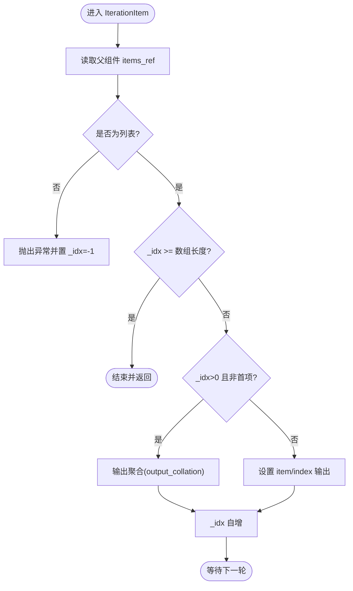
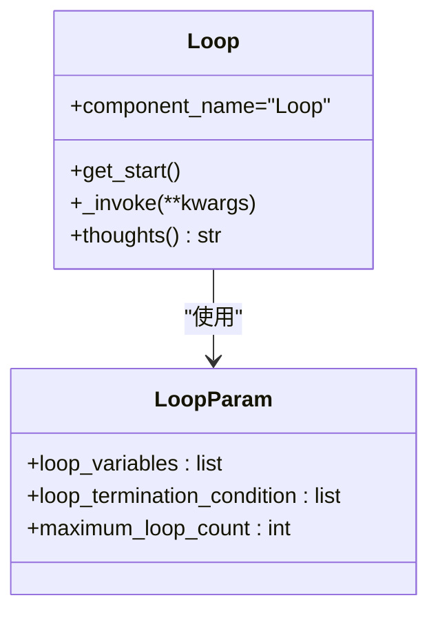
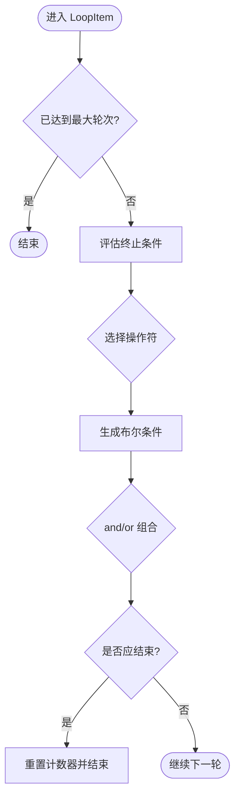
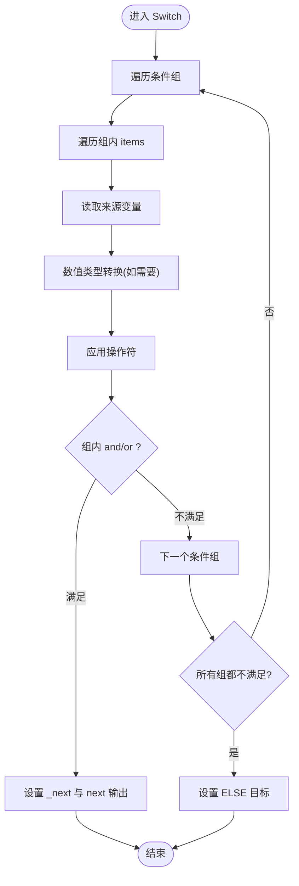
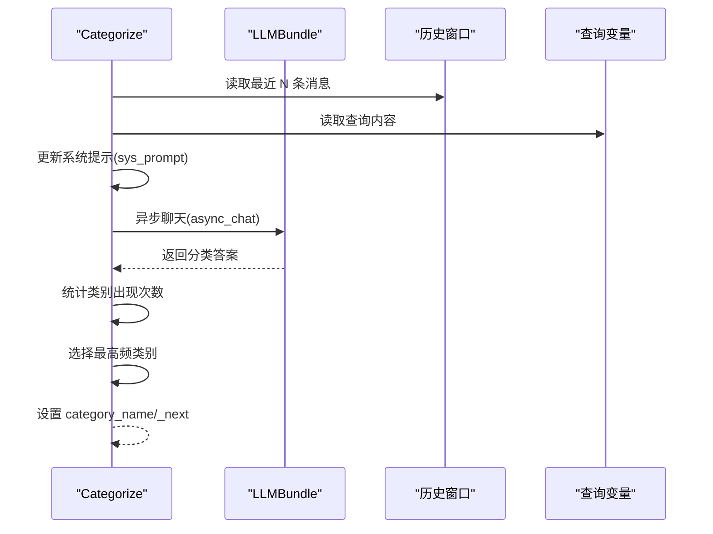
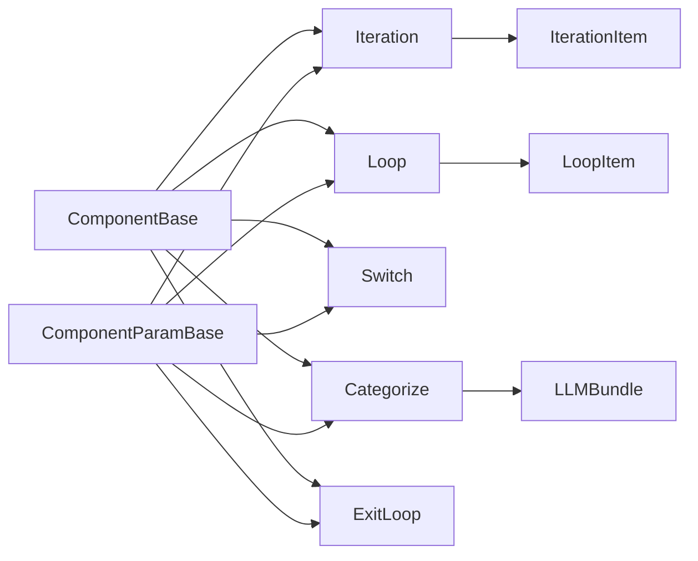

# 控制流组件

<cite>
**本文档引用的文件**
- [iteration.py](file://agent/component/iteration.py)
- [iterationitem.py](file://agent/component/iterationitem.py)
- [loop.py](file://agent/component/loop.py)
- [loopitem.py](file://agent/component/loopitem.py)
- [switch.py](file://agent/component/switch.py)
- [categorize.py](file://agent/component/categorize.py)
- [exit_loop.py](file://agent/component/exit_loop.py)
- [base.py](file://agent/component/base.py)
- [iteration.json](file://agent/test/dsl_examples/iteration.json)
</cite>

## 目录
1. [简介](#简介)
2. [项目结构](#项目结构)
3. [核心组件](#核心组件)
4. [架构总览](#架构总览)
5. [详细组件分析](#详细组件分析)
6. [依赖分析](#依赖分析)
7. [性能考虑](#性能考虑)
8. [故障排查指南](#故障排查指南)
9. [结论](#结论)
10. [附录](#附录)

## 简介
本文件聚焦于控制流组件：Iteration（迭代）、Loop（循环）、Switch（条件分支）、Categorize（分类）以及与之配套的 LoopItem、IterationItem 和 ExitLoop 子组件。我们将从实现机制、参数配置、数据流与状态管理、错误处理与超时控制、到复杂场景组合与调试技巧进行全面技术说明，帮助读者在实际工作流中正确使用与优化这些组件。

## 项目结构
控制流组件位于 agent/component 目录下，围绕基类 ComponentBase 与 ComponentParamBase 提供统一的生命周期、输入输出、异常与超时处理能力；具体组件通过各自的 Param 类型定义参数校验与输入表单，通过 _invoke/_invoke_async 实现执行逻辑。

图示来源
- [iteration.py:49-72](file://agent/component/iteration.py#L49-L72)
- [iterationitem.py:28-92](file://agent/component/iterationitem.py#L28-L92)
- [loop.py:43-80](file://agent/component/loop.py#L43-L80)
- [loopitem.py:27-167](file://agent/component/loopitem.py#L27-L167)
- [switch.py:61-141](file://agent/component/switch.py#L61-L141)
- [categorize.py:97-164](file://agent/component/categorize.py#L97-L164)
- [exit_loop.py:25-32](file://agent/component/exit_loop.py#L25-L32)
- [base.py:365-585](file://agent/component/base.py#L365-L585)

章节来源
- [base.py:365-585](file://agent/component/base.py#L365-L585)

## 核心组件
- Iteration/IterationItem：对上游提供的数组进行逐项处理，支持结果聚合与索引输出，配合下游组件完成批量任务。
- Loop/LoopItem：基于最大轮次与终止条件进行循环，支持“and/or”逻辑组合，可按需设置循环变量初值。
- Switch：根据一组条件表达式与操作符进行分支判断，支持字符串/数值/布尔/对象/数组等类型比较，最终输出下一跳组件列表。
- Categorize：基于 LLM 的分类系统，将输入消息历史与查询映射到预定义类别，返回类别名与对应下一跳。
- ExitLoop：占位组件，用于在循环结束时退出循环流程。

章节来源
- [iteration.py:49-72](file://agent/component/iteration.py#L49-L72)
- [iterationitem.py:28-92](file://agent/component/iterationitem.py#L28-L92)
- [loop.py:43-80](file://agent/component/loop.py#L43-L80)
- [loopitem.py:27-167](file://agent/component/loopitem.py#L27-L167)
- [switch.py:61-141](file://agent/component/switch.py#L61-L141)
- [categorize.py:97-164](file://agent/component/categorize.py#L97-L164)
- [exit_loop.py:25-32](file://agent/component/exit_loop.py#L25-L32)

## 架构总览
控制流组件通过 Canvas 图结构组织，组件间通过下游边连接形成执行序列；每个组件通过基类统一的 invoke/invoke_async 生命周期管理，支持超时装饰器、取消检测、异常捕获与输出记录。

图示来源
- [base.py:407-447](file://agent/component/base.py#L407-L447)
- [base.py:393-405](file://agent/component/base.py#L393-L405)

## 详细组件分析

### Iteration 组件
- 角色定位：作为迭代容器，负责从上游变量中读取数组，驱动 IterationItem 进行逐项处理。
- 关键行为
  - 查找子组件：通过 get_start 定位父 ID 下第一个名为 “IterationItem” 的子组件。
  - 输入校验：从画布获取 items_ref 指向的变量，要求为列表类型，否则写入错误输出。
  - 思考输出：返回待处理项数量的思考文本。
- 输出
  - 通过下游 IterationItem 的输出 collation 机制，将子组件输出聚合回父组件的输出。

图示来源
- [iteration.py:52-68](file://agent/component/iteration.py#L52-L68)
- [iterationitem.py:35-86](file://agent/component/iterationitem.py#L35-L86)

章节来源
- [iteration.py:49-72](file://agent/component/iteration.py#L49-L72)
- [iterationitem.py:28-92](file://agent/component/iterationitem.py#L28-L92)

### IterationItem 组件
- 角色定位：Iteration 的子组件，负责逐项读取数组元素并输出当前项与索引。
- 关键行为
  - 状态维护：内部维护 _idx 计数器，首次进入时初始化为 0。
  - 数据校验：若 items_ref 非数组则抛出异常并将计数器置为 -1 结束。
  - 输出：设置 item 与 index 输出。
  - 输出聚合：在每次推进前，调用 output_collation 将下游组件的输出按 ref 聚合到父组件。
  - 结束判定：当 _idx 达到数组长度后，重置为 -1 并结束。
- 使用场景：与 Iteration 配合，实现对数组的流水线式处理。

图示来源
- [iterationitem.py:35-86](file://agent/component/iterationitem.py#L35-L86)

章节来源
- [iterationitem.py:28-92](file://agent/component/iterationitem.py#L28-L92)

### Loop 组件
- 角色定位：循环控制器，负责初始化循环变量并在每轮开始时注入。
- 关键行为
  - 循环变量注入：遍历 loop_variables 列表，依据 input_mode（variable/constant/默认类型）将值注入到指定变量。
  - 类型默认值：未显式赋值时按类型推断默认值（数字、字符串、布尔、对象、数组）。
  - 思考输出：返回循环提示语。

图示来源
- [loop.py:43-80](file://agent/component/loop.py#L43-L80)

章节来源
- [loop.py:43-80](file://agent/component/loop.py#L43-L80)

### LoopItem 组件
- 角色定位：Loop 的子组件，负责推进循环并评估终止条件。
- 关键行为
  - 最大轮次控制：超过 maximum_loop_count 即结束。
  - 条件评估：支持多种类型与操作符（字符串包含/前后缀/空/非空；数值比较；布尔相等/非等；对象/数组存在性），支持 input_mode 为 variable 或 constant。
  - 逻辑运算：支持 and/or 组合多个条件，决定是否结束本轮。
  - 结束判定：满足逻辑运算结果即结束，重置计数器并返回 True。
- 使用场景：与 Loop 配合，实现带条件的有限循环。

图示来源
- [loopitem.py:35-155](file://agent/component/loopitem.py#L35-L155)

章节来源
- [loopitem.py:27-167](file://agent/component/loopitem.py#L27-L167)

### Switch 组件
- 角色定位：条件分支组件，根据一组条件表达式选择下一跳。
- 关键行为
  - 条件结构：conditions 为条件组列表，每组包含 items（来源组件、操作符、阈值）、logical_operator（and/or）与 to（目标组件 ID 列表）。
  - 操作符：包含 contains/not contains/start with/end with/empty/not empty/等于/不等于/大小比较等，自动适配数值类型转换。
  - 执行顺序：按条件组顺序遍历，先按组内逻辑运算（and/or）决定该组是否满足，满足即输出下一跳；若全部不满足，则走 ELSE/Other 目标（end_cpn_ids）。
  - 超时保护：装饰器限制执行时间。
- 使用场景：多路分支路由、优先级判断、动态分流。

图示来源
- [switch.py:64-98](file://agent/component/switch.py#L64-L98)
- [switch.py:99-137](file://agent/component/switch.py#L99-L137)

章节来源
- [switch.py:61-141](file://agent/component/switch.py#L61-L141)

### Categorize 组件
- 角色定位：基于 LLM 的分类器，将输入映射到预定义类别并输出下一跳。
- 关键行为
  - 参数校验：类别描述不能为空，类别名称不可为空，“to” 必须存在。
  - 提示词构建：动态拼接类别清单、描述与示例，形成系统提示。
  - 历史与查询：从画布历史窗口与查询变量构造用户提示。
  - 分类执行：异步调用 LLM 生成分类结果，统计各类别出现次数，选择出现最多者作为最终类别。
  - 输出：设置 category_name 与 _next（对应类别 to 列表）。
- 使用场景：意图识别、路由分流、个性化响应。

图示来源
- [categorize.py:107-160](file://agent/component/categorize.py#L107-L160)

章节来源
- [categorize.py:97-164](file://agent/component/categorize.py#L97-L164)

### ExitLoop 组件
- 角色定位：循环结束标记，通常作为循环末尾组件，用于触发退出循环流程。
- 关键行为：空实现，仅占位。

章节来源
- [exit_loop.py:25-32](file://agent/component/exit_loop.py#L25-L32)

## 依赖分析
- 组件共同依赖
  - ComponentBase：统一生命周期、输入输出、异常与超时处理、取消检测。
  - ComponentParamBase：参数校验工具集（字符串/整数/正数/布尔/范围等）。
- 组件间耦合
  - Iteration 与 IterationItem：父子关系，通过 items_ref 与输出聚合协作。
  - Loop 与 LoopItem：父子关系，通过 maximum_loop_count 与终止条件协作。
  - Switch/Categorize：独立决策组件，通过下游边连接影响后续执行路径。
  - ExitLoop：作为循环结束的出口，避免无限循环。
- 外部依赖
  - LLMBundle：Categorize 使用异步聊天接口。
  - 超时装饰器：各组件通过 timeout 装饰器限制执行时间。

图示来源
- [base.py:365-585](file://agent/component/base.py#L365-L585)
- [iteration.py:49-72](file://agent/component/iteration.py#L49-L72)
- [loop.py:43-80](file://agent/component/loop.py#L43-L80)
- [switch.py:61-141](file://agent/component/switch.py#L61-L141)
- [categorize.py:97-164](file://agent/component/categorize.py#L97-L164)
- [exit_loop.py:25-32](file://agent/component/exit_loop.py#L25-L32)

章节来源
- [base.py:365-585](file://agent/component/base.py#L365-L585)

## 性能考虑
- 超时控制
  - 各组件普遍使用超时装饰器，默认超时时间可通过环境变量调整，避免长时间阻塞。
- 并发与异步
  - Categorize 使用异步 LLM 调用，建议合理设置最大并发数与超时，避免资源争用。
- 输出聚合成本
  - IterationItem 的输出聚合涉及跨组件变量收集，应在下游组件数量较多时关注性能开销。
- 循环安全
  - LoopItem 的最大轮次与终止条件必须明确，防止无限循环；建议为关键循环设置上限与日志监控。

## 故障排查指南
- 常见错误与定位
  - Iteration 输入非数组：检查 items_ref 指向变量类型，确保上游输出为列表。
  - Loop 变量不完整：确认 loop_variables 中每项的字段齐全（variable/input_mode/value/type）。
  - Switch 条件缺失：确保 conditions 与 end_cpn_ids 均非空，组内 items 的 cpn_id 与 operator 正确。
  - Categorize 提示词构建失败：检查 category_description 的键与 to 字段完整性。
- 调试技巧
  - 使用基类的 debug 方法直接调用组件，快速验证输入与输出。
  - 在组件中设置临时输出，记录中间变量（如当前项、索引、条件评估结果）。
  - 对长链路使用分段执行，逐步缩小问题范围。
- 取消与异常
  - 组件内置取消检测，一旦任务被取消会记录错误并返回；检查画布取消状态与超时设置。

章节来源
- [iteration.py:60-66](file://agent/component/iteration.py#L60-L66)
- [loop.py:57-77](file://agent/component/loop.py#L57-L77)
- [switch.py:46-51](file://agent/component/switch.py#L46-L51)
- [categorize.py:41-49](file://agent/component/categorize.py#L41-L49)
- [base.py:393-405](file://agent/component/base.py#L393-L405)

## 结论
控制流组件通过统一的基类与参数体系，提供了稳定可靠的执行框架。Iteration/Loop 负责批量与循环控制，Switch/Categorize 提供灵活的分支与分类能力，配合 ExitLoop 实现闭环。在实际使用中，应重视参数校验、超时与并发控制、输出聚合的成本，并通过分段调试与日志监控提升稳定性与可观测性。

## 附录

### 配置选项与输入表单
- IterationParam
  - items_ref：指向上游数组变量的引用。
  - 输入表单：items（JSON）。
- LoopParam
  - loop_variables：循环变量列表（每项含 variable、input_mode、value、type）。
  - loop_termination_condition：终止条件列表（每项含 variable、operator、input_mode、value）。
  - maximum_loop_count：最大循环次数。
  - 输入表单：items（JSON）。
- SwitchParam
  - conditions：条件组列表（items、logical_operator、to）。
  - end_cpn_ids：ELSE/Other 目标组件 ID 列表。
  - operators：可用操作符集合。
  - 输入表单：urls（行输入）。
- CategorizeParam
  - category_description：类别描述（含 description 与 examples）。
  - query：查询变量键。
  - message_history_window_size：历史窗口大小。
  - 输入表单：query（行输入）。

章节来源
- [iteration.py:27-46](file://agent/component/iteration.py#L27-L46)
- [loop.py:20-41](file://agent/component/loop.py#L20-L41)
- [switch.py:25-60](file://agent/component/switch.py#L25-L60)
- [categorize.py:29-57](file://agent/component/categorize.py#L29-L57)

### 使用场景与组合示例
- 迭代场景
  - 典型流程：上游生成数组 → Iteration → IterationItem → 多个下游组件并行处理 → 聚合输出。
  - 示例参考：[iteration.json](file://agent/test/dsl_examples/iteration.json) 展示了从生成子主题到针对每个子主题进行检索与生成的完整链路。
- 循环场景
  - 场景：基于条件的重复执行（如重试、增量处理），通过 Loop/LoopItem 设置最大轮次与终止条件。
- 分支场景
  - 场景：根据查询内容或中间结果选择不同处理路径（Switch）或按意图分类（Categorize）。
- 组合示例
  - 先分类/分支，再迭代处理，最后退出循环或结束流程。

章节来源
- [iteration.json:1-92](file://agent/test/dsl_examples/iteration.json#L1-L92)