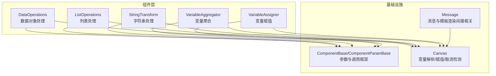
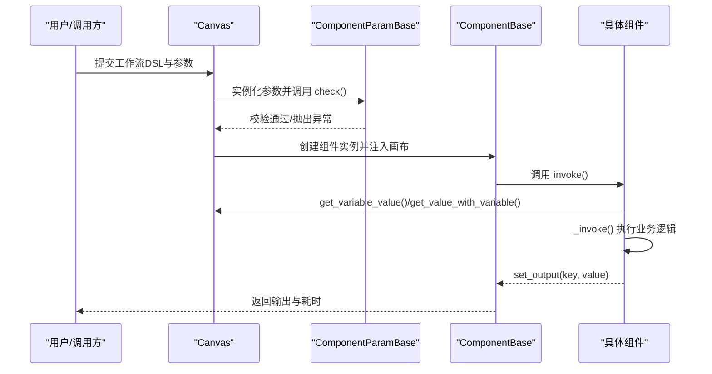
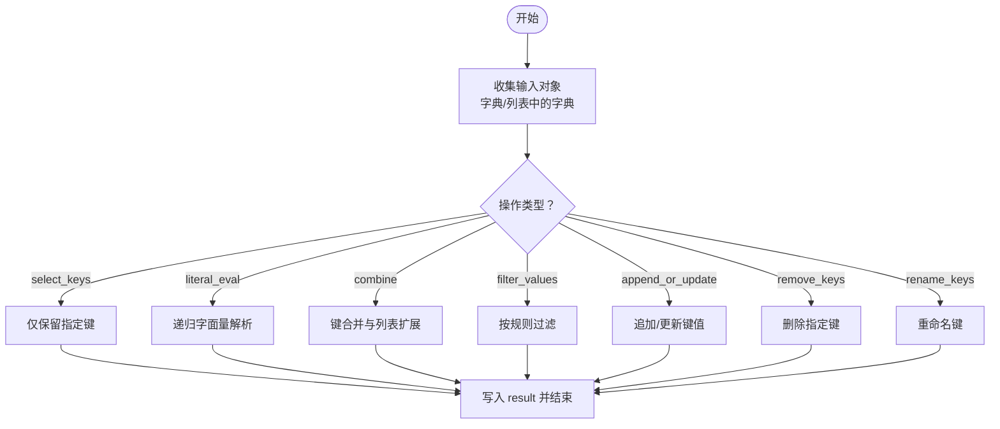
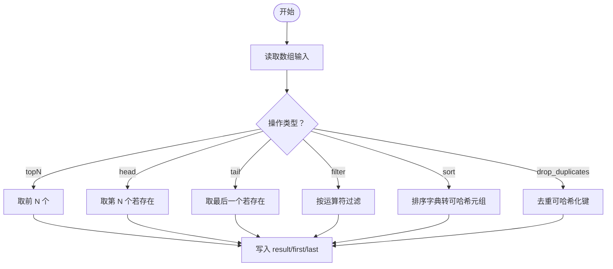
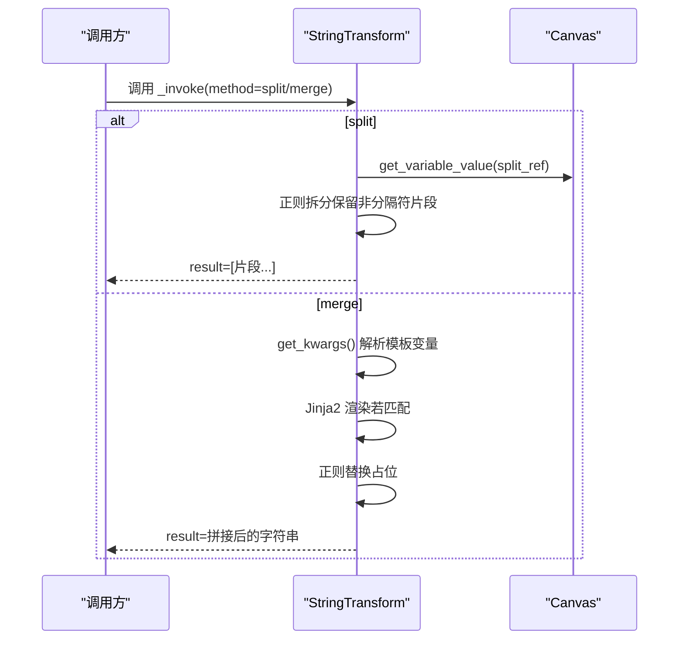
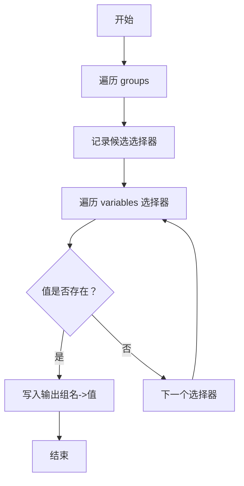
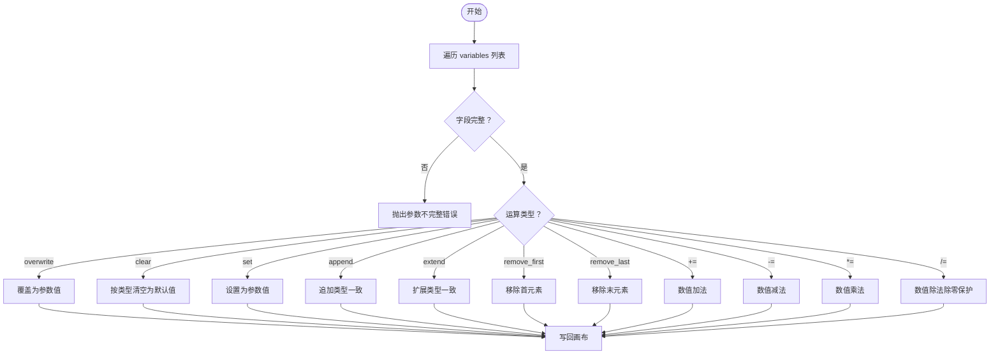
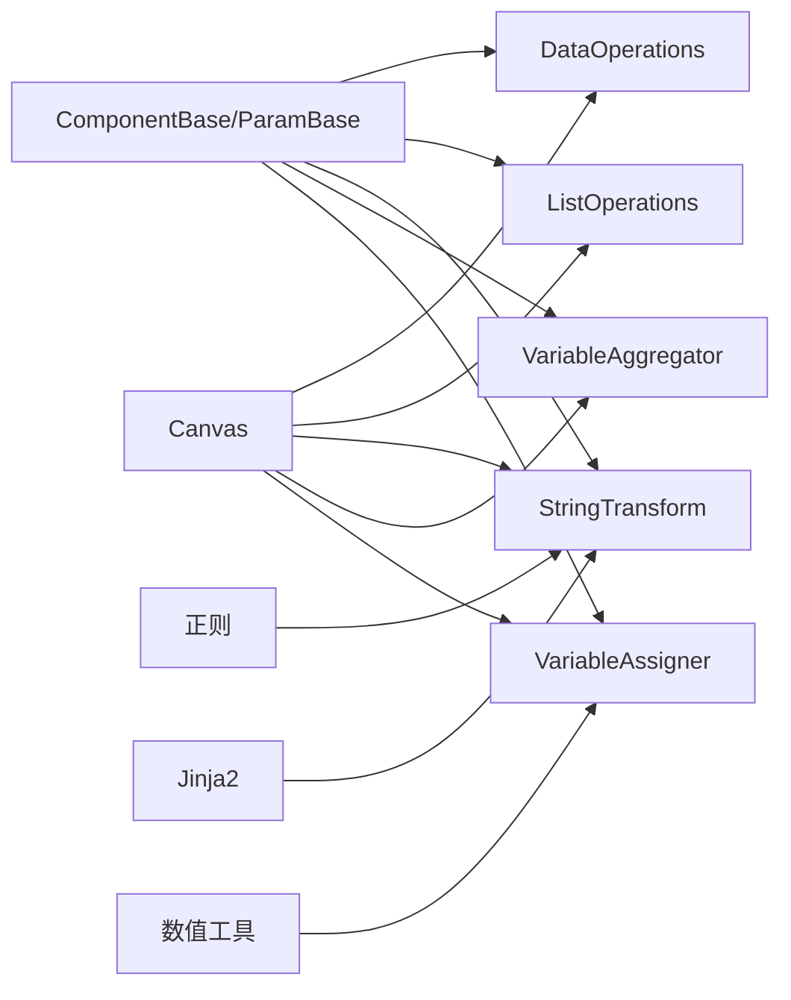

# 数据处理组件

<cite>
**本文引用的文件**
- [agent\component\base.py](file://agent\component\base.py)
- [agent\canvas.py](file://agent\canvas.py)
- [agent\component\data_operations.py](file://agent\component\data_operations.py)
- [agent\component\list_operations.py](file://agent\component\list_operations.py)
- [agent\component\string_transform.py](file://agent\component\string_transform.py)
- [agent\component\varaiable_aggregator.py](file://agent\component\varaiable_aggregator.py)
- [agent\component\variable_assigner.py](file://agent\component\variable_assigner.py)
- [agent\component\message.py](file://agent\component\message.py)
</cite>

## 目录
1. [简介](#简介)
2. [项目结构](#项目结构)
3. [核心组件](#核心组件)
4. [架构总览](#架构总览)
5. [详细组件分析](#详细组件分析)
6. [依赖分析](#依赖分析)
7. [性能考虑](#性能考虑)
8. [故障排查指南](#故障排查指南)
9. [结论](#结论)
10. [附录](#附录)

## 简介
本文件面向“数据处理组件”，系统性梳理以下五个组件的能力与实现要点：
- data_operations：数据对象的多维处理（键选择、字面量解析、合并、过滤、追加/更新、删除键、重命名键）
- list_operations：列表型数据的处理（前 N 条、头部/尾部、过滤、排序、去重）
- string_transform：字符串拆分与模板合并（支持 Jinja2 模板渲染）
- varaiable_aggregator：变量聚合与分组选择（按组优先取首个可用变量）
- variable_assigner：变量赋值与运算（覆盖、清空、设置、追加、扩展、移除首/末、四则运算）

同时给出各组件的参数定义、输入输出约定、执行流程、错误处理策略以及典型使用场景。

## 项目结构
这些组件均位于智能体工作流的组件层，通过统一的基类与画布（Canvas）进行参数校验、变量解析、超时控制与异常处理。组件在运行时从画布中读取变量、写入输出，并通过统一的超时装饰器保障执行安全。

图示来源
- [agent\component\base.py:365-585](file://agent\component\base.py#L365-L585)
- [agent\canvas.py:162-276](file://agent\canvas.py#L162-L276)
- [agent\component\data_operations.py:47-219](file://agent\component\data_operations.py#L47-L219)
- [agent\component\list_operations.py:43-169](file://agent\component\list_operations.py#L43-L169)
- [agent\component\string_transform.py:45-116](file://agent\component\string_transform.py#L45-L116)
- [agent\component\varaiable_aggregator.py:58-85](file://agent\component\varaiable_aggregator.py#L58-L85)
- [agent\component\variable_assigner.py:41-192](file://agent\component\variable_assigner.py#L41-L192)

章节来源
- [agent\component\base.py:365-585](file://agent\component\base.py#L365-L585)
- [agent\canvas.py:162-276](file://agent\canvas.py#L162-L276)

## 核心组件
本节概览各组件职责与关键行为。

- DataOperations（数据对象处理）
  - 支持操作：select_keys、literal_eval、combine、filter_values、append_or_update、remove_keys、rename_keys
  - 输入：一个或多个变量引用，组件会收集所有字典对象作为输入
  - 输出：result（数组或对象，取决于操作）

- ListOperations（列表处理）
  - 支持操作：topN、head、tail、filter、sort、drop_duplicates
  - 输入：必须为数组；输出包含 result、first、last 三个通道
  - 排序对字典采用可哈希化归一后稳定排序

- StringTransform（字符串处理）
  - 支持方法：split、merge
  - split：按分隔符拆分，保留分隔符位置信息
  - merge：支持 Jinja2 模板渲染与占位替换

- VariableAggregator（变量聚合）
  - 将一组变量选择器按组进行聚合，每组返回第一个可用值
  - 输出：以组名为键的变量值

- VariableAssigner（变量赋值）
  - 对指定变量执行多种运算（覆盖、清空、设置、追加、扩展、移除首/末、四则运算）
  - 自动进行类型与数值合法性检查

章节来源
- [agent\component\data_operations.py:22-219](file://agent\component\data_operations.py#L22-L219)
- [agent\component\list_operations.py:6-169](file://agent\component\list_operations.py#L6-L169)
- [agent\component\string_transform.py:27-116](file://agent\component\string_transform.py#L27-L116)
- [agent\component\varaiable_aggregator.py:23-85](file://agent\component\varaiable_aggregator.py#L23-L85)
- [agent\component\variable_assigner.py:22-192](file://agent\component\variable_assigner.py#L22-L192)

## 架构总览
组件通过统一的基类与画布协作，形成如下执行链路：
- 参数校验：ComponentParamBase.check 完成必填与取值范围校验
- 变量解析：Canvas.get_variable_value/get_value_with_variable 解析形如 {id@key.prop} 的变量引用
- 执行控制：ComponentBase.invoke/_invoke 包裹超时与异常处理
- 结果回写：set_output 写入组件输出，供下游读取

图示来源
- [agent\component\base.py:384-451](file://agent\component\base.py#L384-L451)
- [agent\canvas.py:162-204](file://agent\canvas.py#L162-L204)

章节来源
- [agent\component\base.py:365-585](file://agent\component\base.py#L365-L585)
- [agent\canvas.py:162-276](file://agent\canvas.py#L162-L276)

## 详细组件分析

### DataOperations 组件
- 功能要点
  - 键选择：仅保留指定键
  - 字面量解析：递归将字符串安全解析为字面量（字典/列表/数字/布尔/None）
  - 合并：将多个对象的键值合并，重复键按类型扩展为列表
  - 过滤：基于规则集合对对象进行条件过滤
  - 追加/更新：为对象批量添加或更新键值
  - 删除键：移除指定键
  - 重命名键：将旧键名映射到新键名

- 关键算法与复杂度
  - 键选择/删除键/重命名键：O(N*M)，N 为对象数，M 为平均键数
  - 合并：O(N*M)，键冲突时扩展为列表
  - 过滤：O(N*R)，R 为规则数
  - 字面量解析：递归遍历，最坏 O(Σ深度)

- 错误处理
  - 非字典/非列表输入会被忽略
  - 字面量解析失败时回退原值
  - 规则比较前进行规范化与变量替换

图示来源
- [agent\component\data_operations.py:57-219](file://agent\component\data_operations.py#L57-L219)

章节来源
- [agent\component\data_operations.py:22-219](file://agent\component\data_operations.py#L22-L219)

API 说明（DataOperationsParam）
- operations：支持值见“功能要点”中的操作类型
- select_keys：要保留的键列表
- filter_values：过滤规则数组（每条规则含 key/operator/value）
- updates：追加/更新项数组（每项含 key/value）
- remove_keys：要删除的键列表
- rename_keys：重命名项数组（每项含 old_key/new_key）

使用示例（路径参考）
- 键选择：[data_operations.py:74-92](file://agent\component\data_operations.py#L74-L92)
- 字面量解析：[data_operations.py:114-115](file://agent\component\data_operations.py#L114-L115)
- 合并：[data_operations.py:117-132](file://agent\component\data_operations.py#L117-L132)
- 过滤：[data_operations.py:159-168](file://agent\component\data_operations.py#L159-L168)
- 追加/更新：[data_operations.py:171-184](file://agent\component\data_operations.py#L171-L184)
- 删除键：[data_operations.py:186-197](file://agent\component\data_operations.py#L186-L197)
- 重命名键：[data_operations.py:199-215](file://agent\component\data_operations.py#L199-L215)

---

### ListOperations 组件
- 功能要点
  - topN：取前 N 个元素
  - head/tail：取第 N 个或最后一个元素（N 有效时）
  - filter：按运算符与目标值过滤
  - sort：升/降序排序；字典按可哈希化元组排序
  - drop_duplicates：基于可哈希化键去重

- 关键算法与复杂度
  - topN/head/tail：O(N) 或 O(1)
  - filter：O(N)
  - sort：字典元素 O(N*logN)；非字典元素 O(N*logN)
  - drop_duplicates：O(N)

- 错误处理
  - 输入非数组时抛出类型错误
  - N 非整数或小于等于 0 时按边界处理

图示来源
- [agent\component\list_operations.py:46-169](file://agent\component\list_operations.py#L46-L169)

章节来源
- [agent\component\list_operations.py:6-169](file://agent\component\list_operations.py#L6-L169)

API 说明（ListOperationsParam）
- operations：支持值为 topN、head、tail、filter、sort、drop_duplicates
- n：整数，用于 topN/head/tail
- sort_method：asc 或 desc
- filter：包含 operator/value 的对象

使用示例（路径参考）
- topN：[list_operations.py:79-86](file://agent\component\list_operations.py#L79-L86)
- head：[list_operations.py:88-94](file://agent\component\list_operations.py#L88-L94)
- tail：[list_operations.py:96-102](file://agent\component\list_operations.py#L96-L102)
- filter：[list_operations.py:104-105](file://agent\component\list_operations.py#L104-L105)
- sort：[list_operations.py:125-145](file://agent\component\list_operations.py#L125-L145)
- drop_duplicates：[list_operations.py:147-156](file://agent\component\list_operations.py#L147-L156)

---

### StringTransform 组件
- 功能要点
  - split：按多个分隔符拆分字符串，保留分隔符位置
  - merge：将变量注入脚本，支持 Jinja2 模板渲染与正则替换

- 关键算法与复杂度
  - split：O(L+D)（L 为长度，D 为分隔符数量）
  - merge：Jinja2 渲染与多次正则替换，近似 O(L)

- 错误处理
  - 输入非字符串时强制为空串
  - Jinja2 渲染失败时回退原始脚本

图示来源
- [agent\component\string_transform.py:64-116](file://agent\component\string_transform.py#L64-L116)
- [agent\canvas.py:162-204](file://agent\canvas.py#L162-L204)

章节来源
- [agent\component\string_transform.py:27-116](file://agent\component\string_transform.py#L27-L116)

API 说明（StringTransformParam）
- method：split 或 merge
- delimiters：分隔符列表（merge 时作为占位分隔）
- script：模板脚本（merge 时使用）

使用示例（路径参考）
- split：[string_transform.py:74-89](file://agent\component\string_transform.py#L74-L89)
- merge：[string_transform.py:91-110](file://agent\component\string_transform.py#L91-L110)

---

### VariableAggregator 组件
- 功能要点
  - 按组遍历变量选择器，返回第一个可用值
  - 输出键名为组名

- 关键算法与复杂度
  - 每组线性扫描，总体 O(G*S)，G 为组数，S 为每组平均选择器数

- 错误处理
  - groups 必填且每组需包含 group_name 与 variables 列表

图示来源
- [agent\component\varaiable_aggregator.py:62-85](file://agent\component\varaiable_aggregator.py#L62-L85)

章节来源
- [agent\component\varaiable_aggregator.py:23-85](file://agent\component\varaiable_aggregator.py#L23-L85)

API 说明（VariableAggregatorParam）
- groups：数组，每项含 group_name 与 variables（选择器列表）

使用示例（路径参考）
- 组内优先取值：[varaiable_aggregator.py:64-73](file://agent\component\varaiable_aggregator.py#L64-L73)

---

### VariableAssigner 组件
- 功能要点
  - 对变量执行多种运算：overwrite、clear、set、append、extend、remove_first、remove_last、+=、-=、*=、/=
  - 自动进行类型与数值合法性检查

- 关键算法与复杂度
  - append/extend/remove_*：O(1)/O(M)（M 为追加/扩展元素数）
  - 四则运算：O(1)，含除零保护

- 错误处理
  - 非法运算或类型不匹配返回错误提示字符串
  - 除数为零返回错误提示

图示来源
- [agent\component\variable_assigner.py:44-192](file://agent\component\variable_assigner.py#L44-L192)

章节来源
- [agent\component\variable_assigner.py:22-192](file://agent\component\variable_assigner.py#L22-L192)

API 说明（VariableAssignerParam）
- variables：数组，每项含 variable（变量选择器）、operator（运算符）、parameter（参数）

使用示例（路径参考）
- 运算入口：[variable_assigner.py:59-83](file://agent\component\variable_assigner.py#L59-L83)
- 追加/扩展/移除：[variable_assigner.py:118-157](file://agent\component\variable_assigner.py#L118-L157)
- 数值运算：[variable_assigner.py:164-189](file://agent\component\variable_assigner.py#L164-L189)

---

## 依赖分析
- 组件共同依赖
  - 基类：ComponentBase/ComponentParamBase 提供参数校验、输入输出、异常与超时处理
  - 画布：Canvas 提供变量解析、赋值、任务取消检测
  - 工具：正则、Jinja2 模板、类型判断与数值工具

- 组件间耦合
  - 低耦合：各组件独立实现各自逻辑，通过画布共享变量
  - 共享点：都使用 Canvas.get_variable_value 与 set_output

图示来源
- [agent\component\base.py:365-585](file://agent\component\base.py#L365-L585)
- [agent\canvas.py:162-276](file://agent\canvas.py#L162-L276)
- [agent\component\string_transform.py:16-24](file://agent\component\string_transform.py#L16-L24)
- [agent\component\variable_assigner.py:16-20](file://agent\component\variable_assigner.py#L16-L20)

章节来源
- [agent\component\base.py:365-585](file://agent\component\base.py#L365-L585)
- [agent\canvas.py:162-276](file://agent\canvas.py#L162-L276)

## 性能考虑
- 复杂度控制
  - 列表与对象处理普遍为 O(N) 或 O(N*logN)，注意大数据量时的内存占用
  - 字面量解析与模板渲染为线性或近似线性，避免在高频路径中重复解析
- 超时与取消
  - 组件统一使用超时装饰器，建议根据数据规模调整环境变量 COMPONENT_EXEC_TIMEOUT
  - Canvas 支持任务取消，组件应尽快响应 check_if_canceled
- I/O 与序列化
  - 合并与去重依赖可哈希化键，尽量保持键类型稳定以提升性能

## 故障排查指南
- 常见错误与定位
  - 输入类型不符：ListOperations 报错“输入应为数组”；VariableAssigner 报错“变量不是列表/数值”
  - 除零错误：VariableAssigner 在除法运算中返回错误提示
  - 变量未找到：Canvas.get_variable_value 抛出异常，检查变量引用格式 {id@key.prop}
  - 字面量解析失败：DataOperations 会回退原值，检查字符串是否符合 Python 字面量语法
- 日志与耗时
  - 组件输出包含 _elapsed_time 与 _created_time，便于定位慢操作
  - 取消任务会在日志中记录“Task has been canceled”

章节来源
- [agent\component\list_operations.py:51-52](file://agent\component\list_operations.py#L51-L52)
- [agent\component\variable_assigner.py:184-189](file://agent\component\variable_assigner.py#L184-L189)
- [agent\canvas.py:189-204](file://agent\canvas.py#L189-L204)
- [agent\component\base.py:407-447](file://agent\component\base.py#L407-L447)

## 结论
上述五个组件提供了从数据对象、列表、字符串到变量聚合与赋值的全链路处理能力。它们通过统一的参数校验、变量解析与异常处理机制，确保在复杂工作流中的稳定性与可维护性。建议在生产环境中结合超时控制、日志监控与输入校验，以获得更好的可靠性与性能表现。

## 附录
- 变量引用规范
  - 形如 {id@key.prop}，其中 id 为组件 ID，key 为输出键，prop 为属性路径
  - sys.* 与 env.* 为系统与环境变量前缀
- 模板与正则
  - StringTransform 支持 Jinja2 模板与正则替换，注意转义与占位符一致性