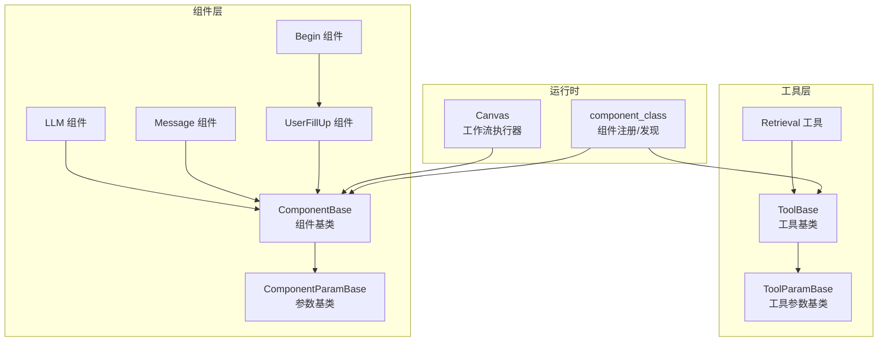
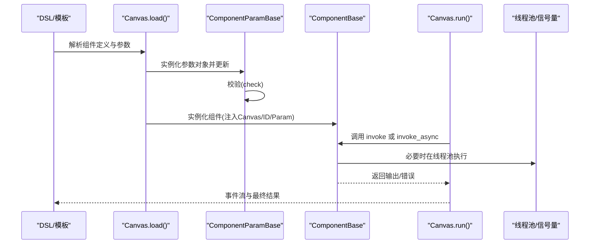
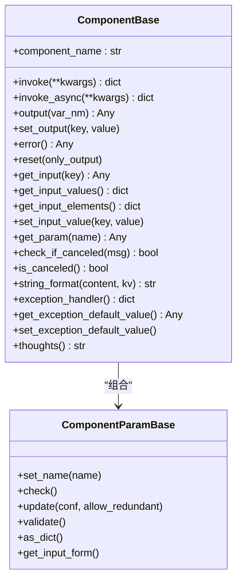
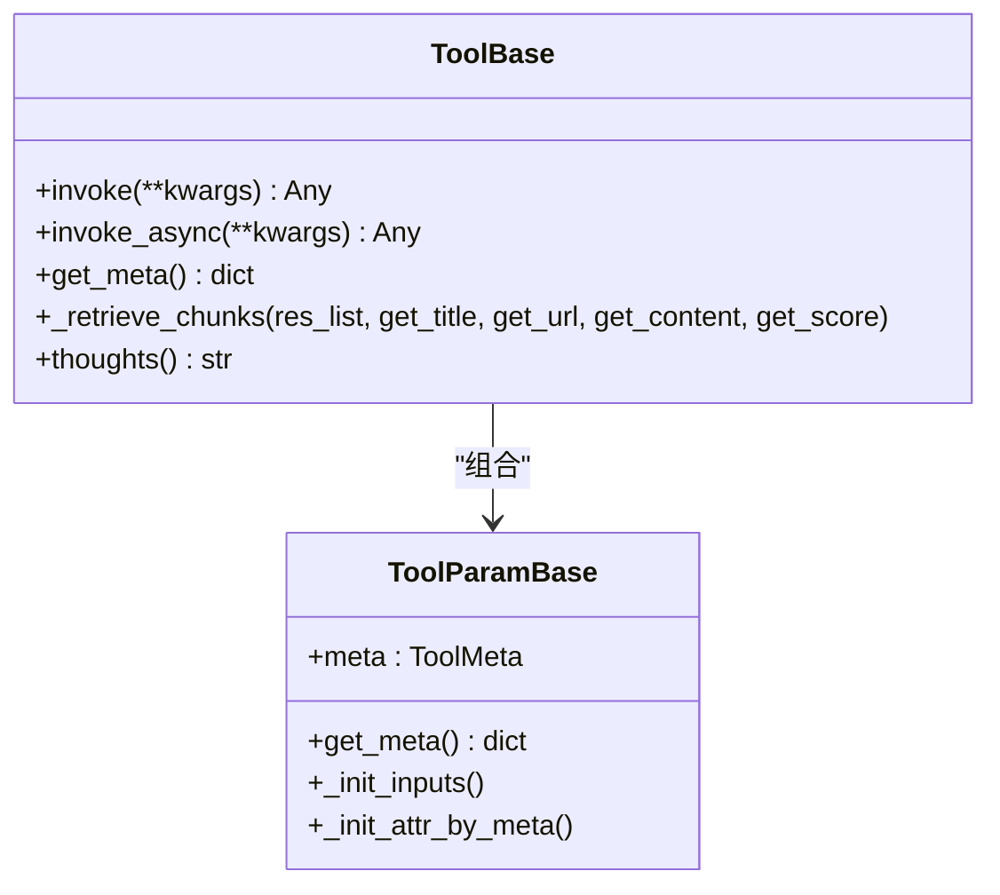
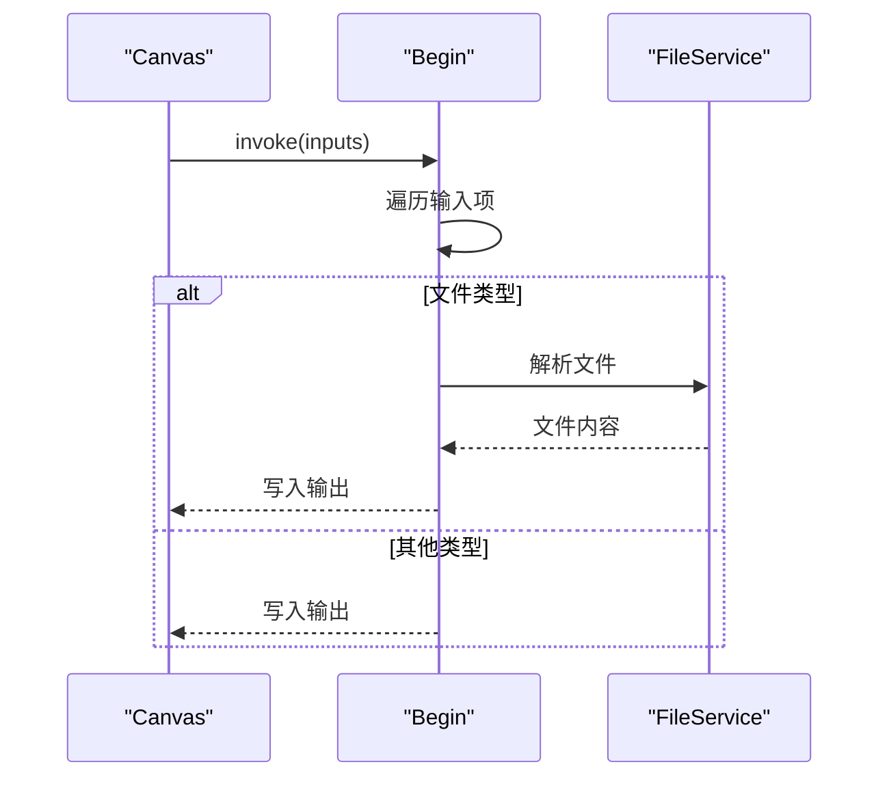
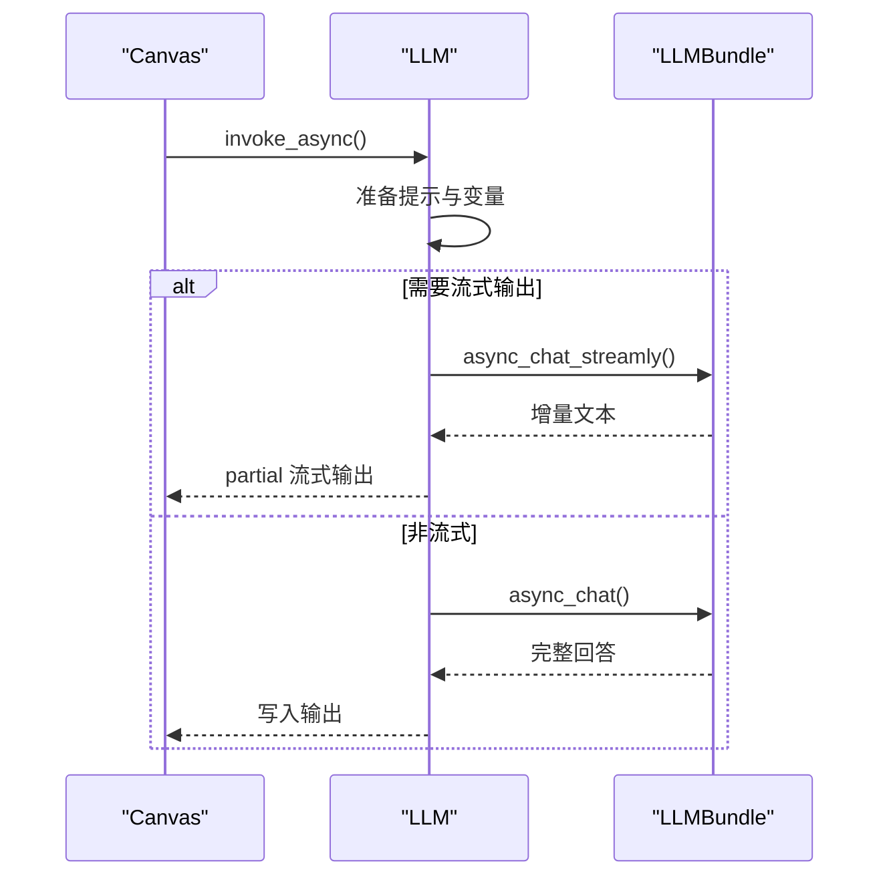
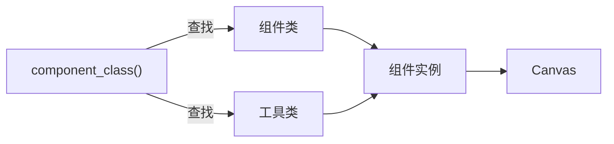

# 组件基类与接口规范

<cite>
**本文档引用的文件**
- [agent/component/base.py](file://agent/component/base.py)
- [agent/canvas.py](file://agent/canvas.py)
- [agent/component/__init__.py](file://agent/component/__init__.py)
- [agent/component/llm.py](file://agent/component/llm.py)
- [agent/component/message.py](file://agent/component/message.py)
- [agent/component/fillup.py](file://agent/component/fillup.py)
- [agent/component/begin.py](file://agent/component/begin.py)
- [agent/tools/base.py](file://agent/tools/base.py)
- [agent/tools/retrieval.py](file://agent/tools/retrieval.py)
- [agent/templates/choose_your_knowledge_base_workflow.json](file://agent/templates/choose_your_knowledge_base_workflow.json)
</cite>

## 目录
1. [引言](#引言)
2. [项目结构](#项目结构)
3. [核心组件](#核心组件)
4. [架构总览](#架构总览)
5. [详细组件分析](#详细组件分析)
6. [依赖关系分析](#依赖关系分析)
7. [性能考虑](#性能考虑)
8. [故障排查指南](#故障排查指南)
9. [结论](#结论)
10. [附录](#附录)

## 引言
本文件面向组件化工作流引擎的开发者与维护者，系统性阐述组件基类与接口规范，覆盖以下主题：
- ComponentBase 抽象基类的设计架构：生命周期管理、输入输出接口、参数校验机制
- 组件元数据系统：组件类型标识、版本控制、依赖声明
- 组件序列化与反序列化：在工作流中的持久化存储方式
- 错误处理与异常传播：统一的异常捕获、降级与跳转策略
- 组件基类继承指南与扩展规范：如何正确实现抽象方法、遵循命名约定
- 具体代码示例路径：展示基类使用方法与最佳实践

## 项目结构
组件体系位于 agent 模块，核心文件如下：
- 基类与通用能力：agent/component/base.py（组件基类、参数基类、变量引用解析）
- 工作流编排与执行：agent/canvas.py（Graph/Canvas、变量解析、执行调度）
- 组件注册与发现：agent/component/__init__.py（动态导入与类映射）
- 典型组件实现：agent/component/*.py（Begin、UserFillUp、LLM、Message 等）
- 工具组件基类与实现：agent/tools/base.py、agent/tools/retrieval.py
- DSL 模板与元数据：agent/templates/*.json（组件类型、参数、连接关系）

**图表来源**
- [agent/component/base.py:365-585](file://agent/component/base.py#L365-L585)
- [agent/canvas.py:40-127](file://agent/canvas.py#L40-L127)
- [agent/component/__init__.py:51-59](file://agent/component/__init__.py#L51-L59)
- [agent/component/llm.py:82-100](file://agent/component/llm.py#L82-L100)
- [agent/component/message.py:61-62](file://agent/component/message.py#L61-L62)
- [agent/component/fillup.py:35-36](file://agent/component/fillup.py#L35-L36)
- [agent/tools/base.py:126-138](file://agent/tools/base.py#L126-L138)
- [agent/tools/retrieval.py:84-85](file://agent/tools/retrieval.py#L84-L85)

**章节来源**
- [agent/component/base.py:365-585](file://agent/component/base.py#L365-L585)
- [agent/canvas.py:40-127](file://agent/canvas.py#L40-L127)
- [agent/component/__init__.py:51-59](file://agent/component/__init__.py#L51-L59)

## 核心组件
本节聚焦组件基类与参数基类的设计要点。

- ComponentParamBase
  - 职责：封装组件参数对象，提供参数更新、递归校验、序列化、调试输入记录等能力
  - 关键能力：
    - 参数更新与递归设置：支持嵌套对象的深度更新，限制最大嵌套深度
    - 参数校验：内置多种校验器（字符串、非空、正整数、正数、非负数、区间、布尔、枚举等）
    - 序列化：将对象转换为字典，自动过滤内部字段，DataFrame 自动转为字典
    - 兼容性：支持“废弃参数”集合与“用户传入参数”集合，用于兼容与告警
  - 参考路径：
    - [参数更新与递归设置:127-187](file://agent/component/base.py#L127-L187)
    - [参数校验与内置校验器:201-362](file://agent/component/base.py#L201-L362)
    - [序列化与调试输入:99-126](file://agent/component/base.py#L99-L126)

- ComponentBase
  - 职责：组件生命周期与执行框架，统一输入输出、错误处理、取消检测、并发控制
  - 关键能力：
    - 生命周期：构造时校验参数；invoke/invoke_async 执行前后记录时间、清理调试输入
    - 输入输出：统一的 inputs/outputs 访问与设置；支持变量引用解析与延迟求值
    - 错误处理：捕获异常并写入 _ERROR 输出或默认值；支持异常分支 goto 与默认值返回
    - 取消检测：通过 Canvas 的 is_canceled 判断任务是否被取消
    - 并发控制：通过线程池与信号量限制并发
  - 参考路径：
    - [生命周期与错误处理:407-447](file://agent/component/base.py#L407-L447)
    - [输入输出接口:453-476](file://agent/component/base.py#L453-L476)
    - [变量引用解析:500-511](file://agent/component/base.py#L500-L511)
    - [异常处理与默认值:567-582](file://agent/component/base.py#L567-L582)

- Canvas（工作流执行器）
  - 职责：加载 DSL、实例化组件、变量解析、执行调度、状态持久化
  - 关键能力：
    - 加载与实例化：读取 DSL 中的组件定义，动态调用 component_class 创建参数与组件实例
    - 变量解析：支持 sys.*、env.*、组件@变量 的表达式解析与延迟求值
    - 执行调度：按拓扑顺序批量执行，支持异步组件与线程池执行
    - 状态持久化：将组件状态序列化为 JSON 字符串，便于持久化与恢复
  - 参考路径：
    - [加载与实例化:91-106](file://agent/canvas.py#L91-L106)
    - [变量解析与设置:189-265](file://agent/canvas.py#L189-L265)
    - [执行调度与事件流:367-656](file://agent/canvas.py#L367-L656)
    - [状态序列化:107-126](file://agent/canvas.py#L107-L126)

**章节来源**
- [agent/component/base.py:40-362](file://agent/component/base.py#L40-L362)
- [agent/component/base.py:365-585](file://agent/component/base.py#L365-L585)
- [agent/canvas.py:91-126](file://agent/canvas.py#L91-L126)
- [agent/canvas.py:189-265](file://agent/canvas.py#L189-L265)
- [agent/canvas.py:367-656](file://agent/canvas.py#L367-L656)

## 架构总览
组件基类与工作流执行的整体交互如下：

**图表来源**
- [agent/canvas.py:91-106](file://agent/canvas.py#L91-L106)
- [agent/component/base.py:384-391](file://agent/component/base.py#L384-L391)
- [agent/canvas.py:367-464](file://agent/canvas.py#L367-L464)

**章节来源**
- [agent/canvas.py:91-106](file://agent/canvas.py#L91-L106)
- [agent/component/base.py:384-391](file://agent/component/base.py#L384-L391)
- [agent/canvas.py:367-464](file://agent/canvas.py#L367-L464)

## 详细组件分析

### 组件基类与参数基类
- 设计模式
  - 抽象基类 + 参数对象：ComponentBase 负责执行框架，ComponentParamBase 负责参数模型
  - 统一接口：所有组件共享相同的输入输出、错误处理、取消检测、并发控制
- 生命周期
  - 构造阶段：校验参数，建立与 Canvas 的关联
  - 执行阶段：invoke/invoke_async 包裹异常、记录耗时、清理调试输入
  - 结束阶段：输出结果，错误写入 _ERROR 或默认值
- 变量引用与延迟求值
  - 支持表达式：组件@变量、sys.*、env.*
  - Canvas 在运行时解析并注入实际值，组件仅负责消费
- 并发与超时
  - 通过线程池与信号量限制并发
  - 通过装饰器设置组件执行超时

**图表来源**
- [agent/component/base.py:40-126](file://agent/component/base.py#L40-L126)
- [agent/component/base.py:365-585](file://agent/component/base.py#L365-L585)

**章节来源**
- [agent/component/base.py:40-126](file://agent/component/base.py#L40-L126)
- [agent/component/base.py:365-585](file://agent/component/base.py#L365-L585)

### 工具组件基类与工具参数基类
- ToolParamBase
  - 从 ToolMeta 动态初始化 inputs 与属性默认值
  - 提供 get_meta 生成函数式工具描述（名称、描述、参数列表、必填项）
- ToolBase
  - 统一工具调用流程：invoke/invoke_async、异常捕获、耗时统计
  - 提供检索增强辅助方法（_retrieve_chunks）将检索结果格式化并写入 Canvas 引用

**图表来源**
- [agent/tools/base.py:77-138](file://agent/tools/base.py#L77-L138)
- [agent/tools/base.py:126-216](file://agent/tools/base.py#L126-L216)

**章节来源**
- [agent/tools/base.py:77-138](file://agent/tools/base.py#L77-L138)
- [agent/tools/base.py:126-216](file://agent/tools/base.py#L126-L216)

### 典型组件实现

#### Begin 组件
- 角色：工作流入口，收集用户输入并写入输出
- 关键点：
  - 参数校验：mode 限定为特定枚举值
  - 输入处理：对文件类型输入进行服务端解析
  - 输出：将输入映射到输出键

**图表来源**
- [agent/component/begin.py:40-57](file://agent/component/begin.py#L40-L57)
- [agent/component/begin.py:30-35](file://agent/component/begin.py#L30-L35)

**章节来源**
- [agent/component/begin.py:20-60](file://agent/component/begin.py#L20-L60)

#### UserFillUp 组件
- 角色：提示用户填写表单，支持变量替换与文件处理
- 关键点：
  - 变量替换：在提示文本中解析表达式并替换
  - 输出：tips 文本与输入项

**章节来源**
- [agent/component/fillup.py:24-78](file://agent/component/fillup.py#L24-L78)

#### LLM 组件
- 角色：大模型调用与流式输出
- 关键点：
  - 提示准备：拼接历史消息、系统提示、引用内容
  - 流式输出：partial 包装异步生成器，支持思考标记
  - 异常处理：重试、默认值、错误写入

**图表来源**
- [agent/component/llm.py:169-262](file://agent/component/llm.py#L169-L262)
- [agent/component/llm.py:264-342](file://agent/component/llm.py#L264-L342)

**章节来源**
- [agent/component/llm.py:82-352](file://agent/component/llm.py#L82-L352)

#### Message 组件
- 角色：消息渲染与输出格式转换
- 关键点：
  - 变量替换：支持同步/异步/可迭代值的替换
  - 流式渲染：partial 包装逐步产出
  - 输出格式：Markdown/HTML/PDF/DOCX/XLSX 转换与上传

**章节来源**
- [agent/component/message.py:61-207](file://agent/component/message.py#L61-L207)
- [agent/component/message.py:251-428](file://agent/component/message.py#L251-L428)

#### Retrieval 工具
- 角色：知识库检索与记忆检索
- 关键点：
  - 多源检索：支持知识库与记忆两种来源
  - 元数据过滤：支持手动/半自动/自动过滤
  - 结果格式化：写入 Canvas 引用与正式化内容

**章节来源**
- [agent/tools/retrieval.py:84-306](file://agent/tools/retrieval.py#L84-L306)

## 依赖关系分析
- 组件注册与发现
  - 通过 agent/component/__init__.py 动态扫描并注册组件类，支持 agent.component、agent.tools、rag.flow 三个包
  - component_class 提供跨包查找与断言
- Canvas 与组件
  - Canvas 在加载阶段根据 DSL 动态创建组件实例，并注入 Canvas、组件 ID、参数对象
- 组件与工具
  - 工具组件与普通组件共享统一的基类接口，但工具组件更强调函数式元数据与检索增强能力

**图表来源**
- [agent/component/__init__.py:51-59](file://agent/component/__init__.py#L51-L59)
- [agent/canvas.py:96-103](file://agent/canvas.py#L96-L103)

**章节来源**
- [agent/component/__init__.py:51-59](file://agent/component/__init__.py#L51-L59)
- [agent/canvas.py:96-103](file://agent/canvas.py#L96-L103)

## 性能考虑
- 并发控制
  - 通过信号量限制同时执行的聊天数量，避免资源争用
  - 通过线程池执行阻塞操作，避免阻塞事件循环
- 超时控制
  - 组件执行超时装饰器，防止长时间阻塞
- I/O 优化
  - Canvas 对图片与文件进行异步处理，减少主线程等待
- 缓存与复用
  - Canvas 将组件状态序列化，便于持久化与快速恢复

[本节为通用指导，不直接分析具体文件]

## 故障排查指南
- 常见问题
  - 参数校验失败：检查参数 JSON 是否符合校验规则，确认枚举值与范围
  - 取消任务：Canvas 会在任务取消时抛出异常并记录日志
  - 异常默认值：若配置了异常默认值，组件会返回默认值而非错误
- 排查步骤
  - 查看 Canvas 事件流中的 node_started/node_finished，定位失败节点
  - 检查组件输出中的 _ERROR 字段
  - 启用调试输入，观察变量解析结果
- 相关实现参考
  - [取消检测与异常处理:396-447](file://agent/component/base.py#L396-L447)
  - [异常处理与默认值:567-582](file://agent/component/base.py#L567-L582)
  - [Canvas 事件流与错误传播:465-586](file://agent/canvas.py#L465-L586)

**章节来源**
- [agent/component/base.py:396-447](file://agent/component/base.py#L396-L447)
- [agent/component/base.py:567-582](file://agent/component/base.py#L567-L582)
- [agent/canvas.py:465-586](file://agent/canvas.py#L465-L586)

## 结论
组件基类与接口规范提供了统一的生命周期、输入输出、参数校验、错误处理与并发控制能力，结合 Canvas 的变量解析与执行调度，形成了可扩展、可观测、可持久化的工作流引擎。通过工具基类与检索增强能力，系统进一步支持函数式工具与知识库检索场景。建议在扩展新组件时严格遵循基类接口与命名约定，确保一致的用户体验与可维护性。

[本节为总结性内容，不直接分析具体文件]

## 附录

### 组件元数据系统
- 组件类型标识
  - component_name：组件类型标识，用于 Canvas.load 与 component_class 查找
- 版本控制
  - 通过组件类名与参数类名的对应关系实现版本化管理
- 依赖声明
  - DSL 中的 upstream/downstream 描述组件间依赖关系
  - Canvas 在执行前解析依赖并按拓扑顺序调度

**章节来源**
- [agent/canvas.py:40-79](file://agent/canvas.py#L40-L79)
- [agent/templates/choose_your_knowledge_base_workflow.json:13-134](file://agent/templates/choose_your_knowledge_base_workflow.json#L13-L134)

### 组件序列化与反序列化
- 序列化
  - Canvas.__str__ 将组件状态序列化为 JSON 字符串，包含组件名与参数
- 反序列化
  - Canvas.load 从 DSL 中读取组件定义，动态创建参数与组件实例
- 持久化
  - Canvas 通过 Redis 存储日志与取消标志，支持任务恢复

**章节来源**
- [agent/canvas.py:107-126](file://agent/canvas.py#L107-L126)
- [agent/canvas.py:293-320](file://agent/canvas.py#L293-L320)
- [agent/canvas.py:132-136](file://agent/canvas.py#L132-L136)

### 组件基类继承指南与扩展规范
- 继承步骤
  - 定义参数类（继承 ComponentParamBase），实现 check 与 get_input_form
  - 定义组件类（继承 ComponentBase），实现 _invoke/_invoke_async 与 thoughts
  - 设置 component_name 类属性
- 命名约定
  - 参数类名：组件名 + "Param"
  - 组件类名：组件名
- 最佳实践
  - 使用 get_input/get_input_values 获取输入，避免直接访问原始参数
  - 在异常处理中优先使用异常默认值，保持工作流连续性
  - 对于长耗时操作，使用异步实现并配合超时装饰器

**章节来源**
- [agent/component/begin.py:20-35](file://agent/component/begin.py#L20-L35)
- [agent/component/llm.py:82-100](file://agent/component/llm.py#L82-L100)
- [agent/component/message.py:61-62](file://agent/component/message.py#L61-L62)