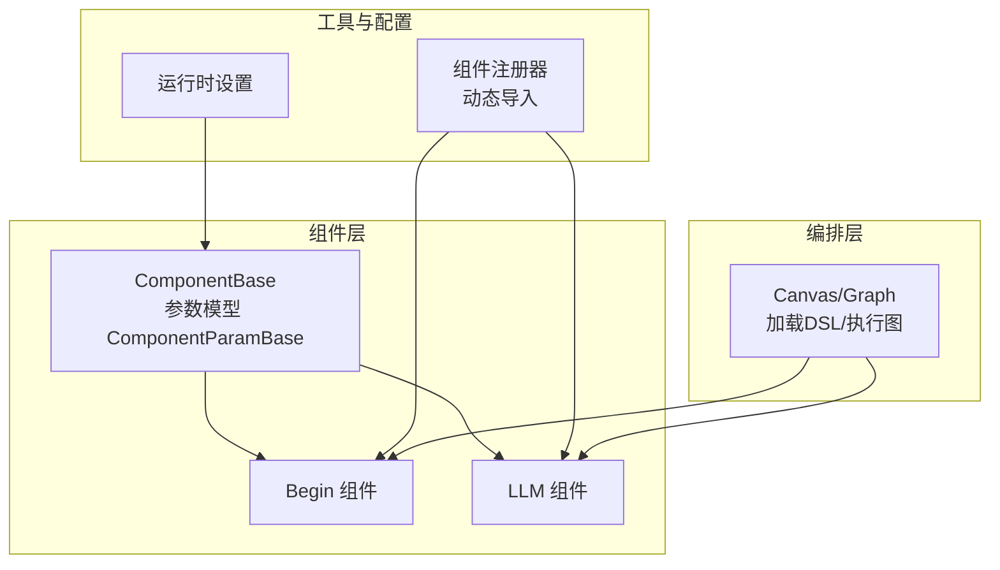
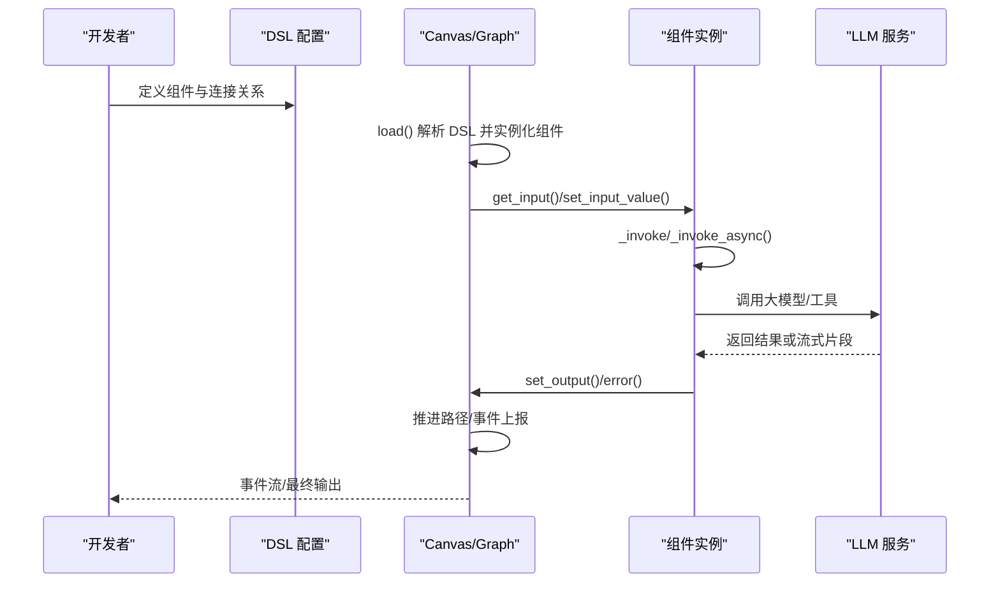
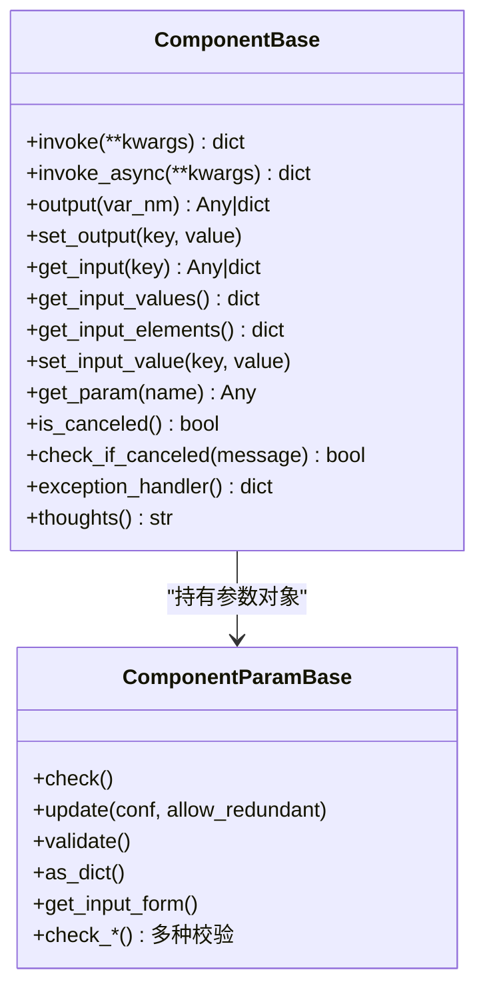
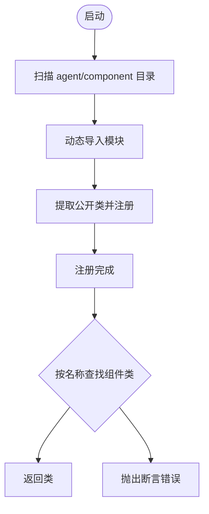
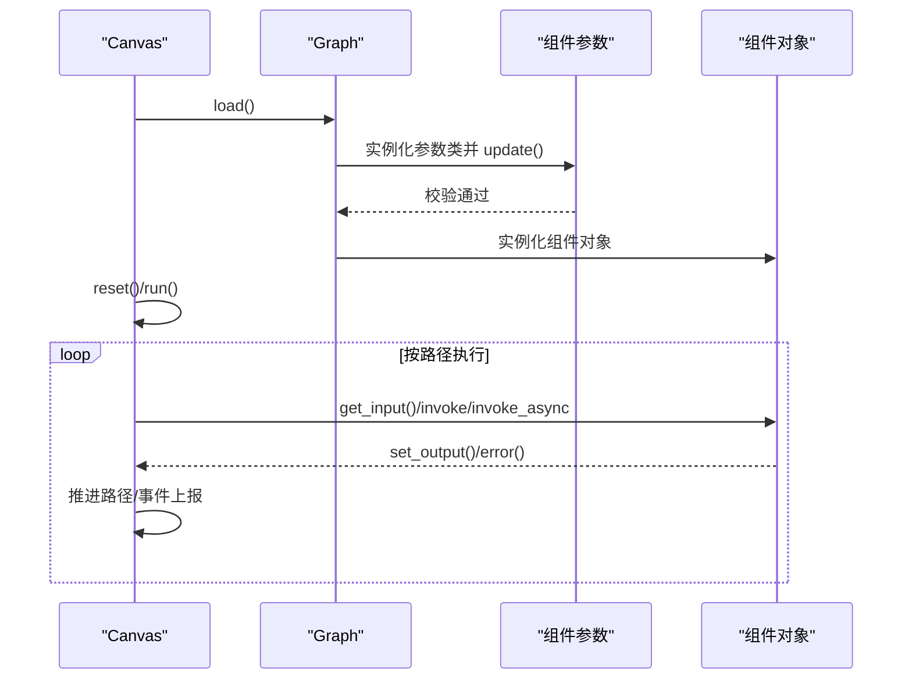
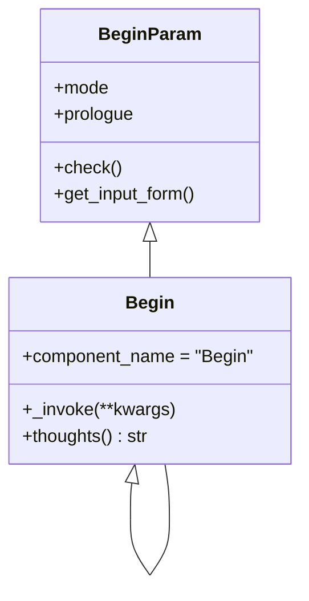
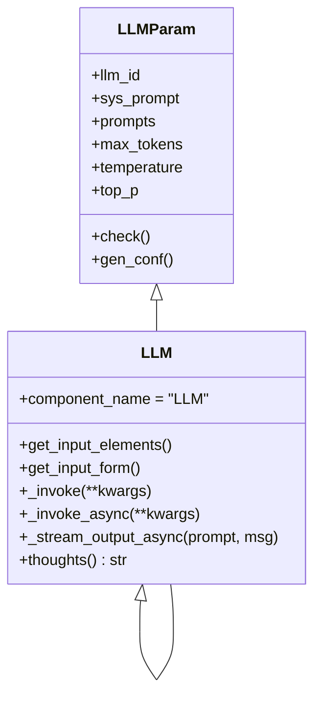
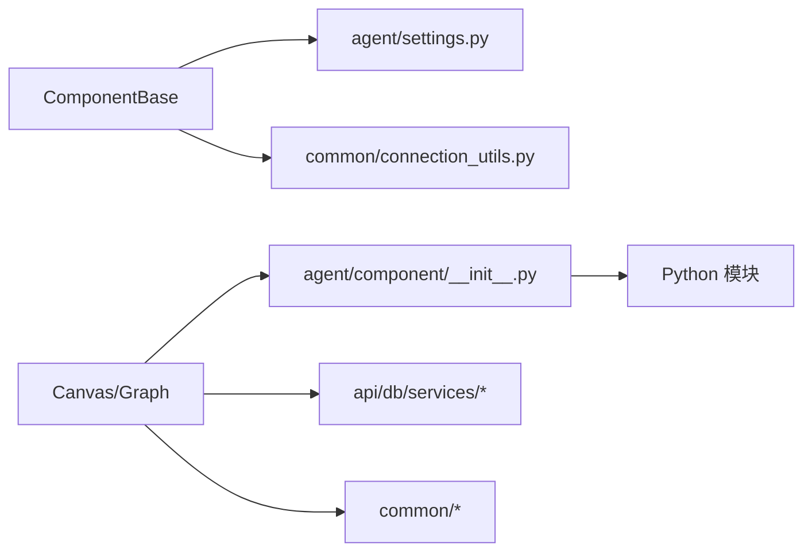

# 组件开发指南

<cite>
**本文引用的文件**
- [agent/component/base.py](file://agent/component/base.py)
- [agent/component/__init__.py](file://agent/component/__init__.py)
- [agent/canvas.py](file://agent/canvas.py)
- [agent/settings.py](file://agent/settings.py)
- [agent/component/begin.py](file://agent/component/begin.py)
- [agent/component/llm.py](file://agent/component/llm.py)
- [agent/test/client.py](file://agent/test/client.py)
- [agent/test/dsl_examples/retrieval_and_generate.json](file://agent/test/dsl_examples/retrieval_and_generate.json)
- [docs/guides/agent/agent_introduction.md](file://docs/guides/agent/agent_introduction.md)
- [docs/contribution/contributing.md](file://docs/contribution/contributing.md)
</cite>

## 目录
1. [引言](#引言)
2. [项目结构](#项目结构)
3. [核心组件](#核心组件)
4. [架构总览](#架构总览)
5. [详细组件分析](#详细组件分析)
6. [依赖分析](#依赖分析)
7. [性能考虑](#性能考虑)
8. [故障排查指南](#故障排查指南)
9. [结论](#结论)
10. [附录](#附录)

## 引言
本指南面向希望在 RAGFlow 中开发“组件（Component）”的工程师与技术作者。RAGFlow 的智能体（Agent）通过“组件化 + 图编排”的方式实现可组合、可扩展的工作流。组件是工作流中的最小执行单元，负责输入解析、参数校验、调用外部服务、输出结果与异常处理等职责。

本指南将从“如何开发一个组件”开始，逐步覆盖继承与实现、注册机制、测试与调试、性能优化、最佳实践以及发布与版本管理，并给出从“Hello World”到复杂业务组件的完整开发示例路径。

## 项目结构
围绕组件开发的核心目录与文件如下：
- 组件基类与参数模型：agent/component/base.py
- 组件自动发现与注册：agent/component/__init__.py
- 工作流图与执行引擎：agent/canvas.py
- 组件运行时设置：agent/settings.py
- 示例组件：agent/component/begin.py、agent/component/llm.py
- 运行与调试客户端：agent/test/client.py
- DSL 示例：agent/test/dsl_examples/retrieval_and_generate.json
- 文档与贡献指南：docs/guides/agent/agent_introduction.md、docs/contribution/contributing.md

图表来源
- [agent/component/base.py:365-585](file://agent/component/base.py#L365-L585)
- [agent/component/__init__.py:25-59](file://agent/component/__init__.py#L25-L59)
- [agent/canvas.py:81-106](file://agent/canvas.py#L81-L106)
- [agent/settings.py:17-19](file://agent/settings.py#L17-L19)

章节来源
- [agent/component/base.py:365-585](file://agent/component/base.py#L365-L585)
- [agent/component/__init__.py:25-59](file://agent/component/__init__.py#L25-L59)
- [agent/canvas.py:81-106](file://agent/canvas.py#L81-L106)
- [agent/settings.py:17-19](file://agent/settings.py#L17-L19)

## 核心组件
- ComponentParamBase：组件参数的抽象基类，负责参数更新、校验、序列化、弃用参数追踪与验证规则加载。
- ComponentBase：组件执行基类，提供输入/输出管理、超时控制、异步调用封装、取消检测、异常处理与调试接口。
- Canvas/Graph：工作流图的加载与执行引擎，负责根据 DSL 动态实例化组件、变量解析、路径推进与事件流输出。
- 组件注册器：自动扫描 agent/component 下的模块，提取公开类并注册，支持按名称查找组件类。

章节来源
- [agent/component/base.py:40-364](file://agent/component/base.py#L40-L364)
- [agent/component/base.py:365-585](file://agent/component/base.py#L365-L585)
- [agent/canvas.py:40-106](file://agent/canvas.py#L40-L106)
- [agent/component/__init__.py:25-59](file://agent/component/__init__.py#L25-L59)

## 架构总览
组件开发遵循“参数模型 + 组件实现 + 编排执行”的分层设计。参数模型负责声明与校验；组件实现负责业务逻辑；Canvas 负责把组件串联成图并驱动执行。

图表来源
- [agent/canvas.py:29-106](file://agent/canvas.py#L29-L106)
- [agent/canvas.py:367-656](file://agent/canvas.py#L367-L656)
- [agent/component/base.py:407-448](file://agent/component/base.py#L407-L448)
- [agent/component/llm.py:264-342](file://agent/component/llm.py#L264-L342)

## 详细组件分析

### 基类与参数模型
- 参数模型 ComponentParamBase
  - 支持嵌套参数更新、冗余参数检测、弃用参数追踪、用户喂入参数集合维护。
  - 提供多种参数校验辅助方法（字符串、正数、非负数、布尔、区间、枚举等）。
  - 支持从 JSON 加载参数校验规则并进行运行时校验。
- 组件基类 ComponentBase
  - 统一的 invoke/invoke_async 生命周期，内置超时装饰器、取消检测、异常捕获与默认值策略。
  - 输入/输出管理：get_input/set_input_value、output/set_output、error/reset。
  - 变量引用解析：支持 sys.env. 前缀与组件间引用表达式。
  - 思路输出：thougths 用于展示组件思考摘要。

图表来源
- [agent/component/base.py:40-364](file://agent/component/base.py#L40-L364)
- [agent/component/base.py:365-585](file://agent/component/base.py#L365-L585)

章节来源
- [agent/component/base.py:40-364](file://agent/component/base.py#L40-L364)
- [agent/component/base.py:365-585](file://agent/component/base.py#L365-L585)

### 组件注册与发现
- 自动扫描 agent/component 下的 Python 模块，提取公开类并注册到全局字典中。
- 提供 component_class(name) 方法，按名称在多个模块空间内查找组件类。

图表来源
- [agent/component/__init__.py:25-59](file://agent/component/__init__.py#L25-L59)

章节来源
- [agent/component/__init__.py:25-59](file://agent/component/__init__.py#L25-L59)

### Canvas/Graph 执行引擎
- load()：解析 DSL，为每个组件构造参数对象并校验，再实例化组件对象。
- run()：基于路径推进组件执行，支持同步/异步、批量执行、事件流输出、取消检测、异常分支 goto 与默认值回退。
- 变量系统：支持 sys.env. 全局变量与组件间引用表达式，提供 get/set 变量值能力。

图表来源
- [agent/canvas.py:91-106](file://agent/canvas.py#L91-L106)
- [agent/canvas.py:367-656](file://agent/canvas.py#L367-L656)

章节来源
- [agent/canvas.py:91-106](file://agent/canvas.py#L91-L106)
- [agent/canvas.py:367-656](file://agent/canvas.py#L367-L656)

### 示例组件：Begin
- 参数模型 BeginParam 继承自 UserFillUpParam，声明 mode 与 prologue 等参数，并进行有效性校验。
- 组件 Begin 继承自 UserFillUp，实现 _invoke 将输入映射到输出，支持文件类型输入处理。

图表来源
- [agent/component/begin.py:20-35](file://agent/component/begin.py#L20-L35)
- [agent/component/begin.py:37-60](file://agent/component/begin.py#L37-L60)

章节来源
- [agent/component/begin.py:20-60](file://agent/component/begin.py#L20-L60)

### 示例组件：LLM
- 参数模型 LLMParam 声明 llm_id、sys_prompt、prompts、采样参数等，并提供生成配置 gen_conf。
- 组件 LLM 继承 ComponentBase，实现 _invoke/_invoke_async，负责提示词拼装、消息历史截断、结构化输出、流式输出与 TTS 集成。
- 支持异常处理 goto 与默认值回退，支持取消检测与超时控制。

图表来源
- [agent/component/llm.py:33-80](file://agent/component/llm.py#L33-L80)
- [agent/component/llm.py:82-352](file://agent/component/llm.py#L82-L352)

章节来源
- [agent/component/llm.py:33-352](file://agent/component/llm.py#L33-L352)

### 开发流程：从零到一
以下为“Hello World”到复杂业务组件的开发步骤与参考路径：

- 步骤一：创建参数类
  - 在 agent/component 下新增模块，定义参数类继承 ComponentParamBase，实现 check() 与 get_input_form()。
  - 参考路径：[agent/component/base.py:40-126](file://agent/component/base.py#L40-L126)、[agent/component/begin.py:20-35](file://agent/component/begin.py#L20-L35)
- 步骤二：实现组件类
  - 新建组件类继承 ComponentBase，实现 _invoke 或 _invoke_async，使用 get_input()/set_output() 管理数据。
  - 参考路径：[agent/component/base.py:407-448](file://agent/component/base.py#L407-L448)、[agent/component/llm.py:264-342](file://agent/component/llm.py#L264-L342)
- 步骤三：注册组件
  - 无需额外注册：agent/component/__init__.py 会自动扫描并注册新组件类。
  - 参考路径：[agent/component/__init__.py:25-59](file://agent/component/__init__.py#L25-L59)
- 步骤四：编写 DSL 测试
  - 使用 agent/test/dsl_examples/retrieval_and_generate.json 作为模板，定义组件与连接关系。
  - 参考路径：[agent/test/dsl_examples/retrieval_and_generate.json:1-61](file://agent/test/dsl_examples/retrieval_and_generate.json#L1-L61)
- 步骤五：本地调试
  - 使用 agent/test/client.py 启动交互式运行，观察事件流与输出。
  - 参考路径：[agent/test/client.py:21-47](file://agent/test/client.py#L21-L47)

章节来源
- [agent/component/base.py:40-126](file://agent/component/base.py#L40-L126)
- [agent/component/base.py:407-448](file://agent/component/base.py#L407-L448)
- [agent/component/__init__.py:25-59](file://agent/component/__init__.py#L25-L59)
- [agent/test/dsl_examples/retrieval_and_generate.json:1-61](file://agent/test/dsl_examples/retrieval_and_generate.json#L1-L61)
- [agent/test/client.py:21-47](file://agent/test/client.py#L21-L47)

## 依赖分析
- 组件基类依赖 agent.settings 与 common.connection_utils.timeout 进行超时控制与浮点精度常量。
- Canvas/Graph 依赖 agent.component.component_class 动态解析组件类，依赖 api.db.services.* 与 common.* 工具模块。
- 组件注册器依赖 importlib 与 inspect 动态导入与提取类。

图表来源
- [agent/component/base.py:27-28](file://agent/component/base.py#L27-L28)
- [agent/canvas.py:29-38](file://agent/canvas.py#L29-L38)
- [agent/component/__init__.py:32-42](file://agent/component/__init__.py#L32-L42)

章节来源
- [agent/component/base.py:27-28](file://agent/component/base.py#L27-L28)
- [agent/canvas.py:29-38](file://agent/canvas.py#L29-L38)
- [agent/component/__init__.py:32-42](file://agent/component/__init__.py#L32-L42)

## 性能考虑
- 并发与线程池
  - Canvas 内部使用 ThreadPoolExecutor 执行阻塞任务，组件内部可结合 asyncio.gather 与线程池执行器并行调用。
  - 参考路径：[agent/canvas.py:88-89](file://agent/canvas.py#L88-L89)、[agent/canvas.py:456-463](file://agent/canvas.py#L456-L463)
- 超时与取消
  - 组件基类统一使用超时装饰器，组件可在关键阶段调用 check_if_canceled() 提前退出。
  - 参考路径：[agent/component/base.py:449-451](file://agent/component/base.py#L449-L451)、[agent/component/base.py:393-405](file://agent/component/base.py#L393-L405)
- 输出与日志
  - 组件输出包含 _created_time 与 _elapsed_time，便于性能统计；建议在关键路径打点记录。
  - 参考路径：[agent/component/base.py:407-419](file://agent/component/base.py#L407-L419)
- 流式输出
  - LLM 组件支持流式输出，结合 partial 与事件流，降低首屏延迟。
  - 参考路径：[agent/component/llm.py:310-314](file://agent/component/llm.py#L310-L314)、[agent/canvas.py:504-542](file://agent/canvas.py#L504-L542)

章节来源
- [agent/canvas.py:88-89](file://agent/canvas.py#L88-L89)
- [agent/canvas.py:456-463](file://agent/canvas.py#L456-L463)
- [agent/component/base.py:449-451](file://agent/component/base.py#L449-L451)
- [agent/component/base.py:393-405](file://agent/component/base.py#L393-L405)
- [agent/component/base.py:407-419](file://agent/component/base.py#L407-L419)
- [agent/component/llm.py:310-314](file://agent/component/llm.py#L310-L314)
- [agent/canvas.py:504-542](file://agent/canvas.py#L504-L542)

## 故障排查指南
- 日志与异常
  - 组件在异常时会写入 _ERROR 输出并记录异常日志；可结合异常处理策略（goto/default_value）进行容错。
  - 参考路径：[agent/component/base.py:411-416](file://agent/component/base.py#L411-L416)、[agent/component/base.py:567-582](file://agent/component/base.py#L567-L582)
- 取消与中断
  - Canvas 提供 is_canceled 与 cancel_task，组件应在关键阶段检查 check_if_canceled。
  - 参考路径：[agent/canvas.py:267-276](file://agent/canvas.py#L267-L276)、[agent/component/base.py:393-405](file://agent/component/base.py#L393-L405)
- 参数校验
  - 参数模型支持运行时校验与 JSON 规则加载，若校验失败需修正 DSL 或参数。
  - 参考路径：[agent/component/base.py:201-257](file://agent/component/base.py#L201-L257)
- 变量引用
  - 使用 sys.env. 与组件引用表达式时，确保变量存在且类型匹配，避免运行期解析失败。
  - 参考路径：[agent/canvas.py:189-265](file://agent/canvas.py#L189-L265)

章节来源
- [agent/component/base.py:411-416](file://agent/component/base.py#L411-L416)
- [agent/component/base.py:567-582](file://agent/component/base.py#L567-L582)
- [agent/canvas.py:267-276](file://agent/canvas.py#L267-L276)
- [agent/component/base.py:201-257](file://agent/component/base.py#L201-L257)
- [agent/canvas.py:189-265](file://agent/canvas.py#L189-L265)

## 结论
通过参数模型 + 组件实现 + Canvas 编排的三层设计，RAGFlow 为组件开发提供了清晰的范式与强大的执行引擎。遵循本文的开发流程、测试与调试方法、性能优化策略与最佳实践，即可快速构建从简单到复杂的业务组件，并稳定地融入工作流。

## 附录

### 测试方法
- 单元测试
  - 建议针对组件的 _invoke/_invoke_async 与参数校验编写单元测试，覆盖正常路径与异常路径。
  - 参考路径：[agent/component/llm.py:264-342](file://agent/component/llm.py#L264-L342)
- 集成测试
  - 使用 agent/test/dsl_examples/*.json 作为输入，结合 agent/test/client.py 启动端到端运行，观察事件流与最终输出。
  - 参考路径：[agent/test/dsl_examples/retrieval_and_generate.json:1-61](file://agent/test/dsl_examples/retrieval_and_generate.json#L1-L61)、[agent/test/client.py:21-47](file://agent/test/client.py#L21-L47)
- 模拟对象
  - 对外部服务（如 LLM、文件服务）使用 mock 或本地替身，隔离网络与 IO 依赖。
  - 参考路径：[agent/component/llm.py:85-91](file://agent/component/llm.py#L85-L91)

章节来源
- [agent/component/llm.py:264-342](file://agent/component/llm.py#L264-L342)
- [agent/test/dsl_examples/retrieval_and_generate.json:1-61](file://agent/test/dsl_examples/retrieval_and_generate.json#L1-L61)
- [agent/test/client.py:21-47](file://agent/test/client.py#L21-L47)

### 调试技巧
- 日志记录
  - 在组件关键节点打印日志，记录输入、输出与耗时，便于定位问题。
  - 参考路径：[agent/component/base.py:416-417](file://agent/component/base.py#L416-L417)
- 断点调试
  - 在本地运行 agent/test/client.py，逐组件断点观察变量与输出。
  - 参考路径：[agent/test/client.py:33-47](file://agent/test/client.py#L33-L47)
- 状态检查
  - 使用 output() 与 get_input_values() 快速查看当前组件状态，核对变量解析是否正确。
  - 参考路径：[agent/component/base.py:453-498](file://agent/component/base.py#L453-L498)

章节来源
- [agent/component/base.py:416-417](file://agent/component/base.py#L416-L417)
- [agent/test/client.py:33-47](file://agent/test/client.py#L33-L47)
- [agent/component/base.py:453-498](file://agent/component/base.py#L453-L498)

### 性能优化建议
- 减少不必要的 IO：合并请求、复用连接、缓存热点数据。
- 控制消息长度：使用 message_fit_in 截断提示词，避免超出上下文限制。
  - 参考路径：[agent/component/llm.py:215-216](file://agent/component/llm.py#L215-L216)
- 并发执行：在 Canvas 的批量执行阶段合理拆分任务，避免阻塞。
  - 参考路径：[agent/canvas.py:420-463](file://agent/canvas.py#L420-L463)
- 流式输出：优先采用流式输出，缩短首屏时间。
  - 参考路径：[agent/component/llm.py:310-314](file://agent/component/llm.py#L310-L314)

章节来源
- [agent/component/llm.py:215-216](file://agent/component/llm.py#L215-L216)
- [agent/canvas.py:420-463](file://agent/canvas.py#L420-L463)
- [agent/component/llm.py:310-314](file://agent/component/llm.py#L310-L314)

### 最佳实践
- 代码规范
  - 组件命名语义化，参数命名清晰，注释完整。
  - 参考路径：[docs/contribution/contributing.md:46-59](file://docs/contribution/contributing.md#L46-L59)
- 错误处理
  - 明确异常分支 goto 与默认值策略，保证工作流鲁棒性。
  - 参考路径：[agent/component/base.py:567-582](file://agent/component/base.py#L567-L582)
- 文档编写
  - 为组件编写输入/输出说明与参数校验规则，便于使用者理解。
  - 参考路径：[agent/component/begin.py:33-34](file://agent/component/begin.py#L33-L34)

章节来源
- [docs/contribution/contributing.md:46-59](file://docs/contribution/contributing.md#L46-L59)
- [agent/component/base.py:567-582](file://agent/component/base.py#L567-L582)
- [agent/component/begin.py:33-34](file://agent/component/begin.py#L33-L34)

### 发布与版本管理
- 版本号与变更记录
  - 参考贡献指南中的 PR 描述要求，确保版本变更清晰可追溯。
  - 参考路径：[docs/contribution/contributing.md:51-56](file://docs/contribution/contributing.md#L51-L56)
- 提交与评审
  - 遵循贡献指南的 PR 流程，保持变更单一、测试完备。
  - 参考路径：[docs/contribution/contributing.md:30-59](file://docs/contribution/contributing.md#L30-L59)

章节来源
- [docs/contribution/contributing.md:30-59](file://docs/contribution/contributing.md#L30-L59)