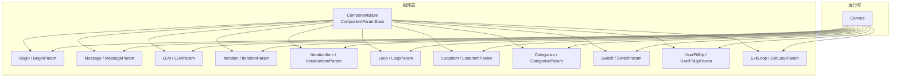
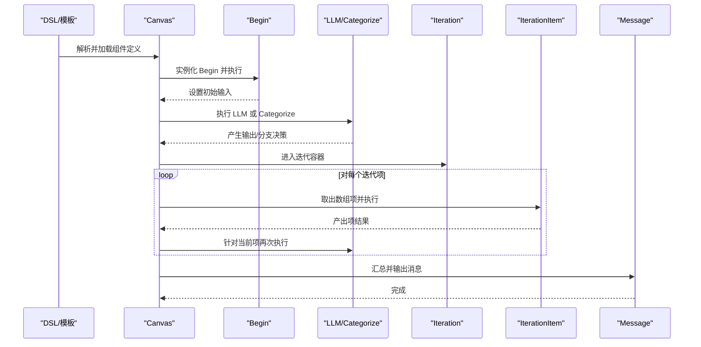
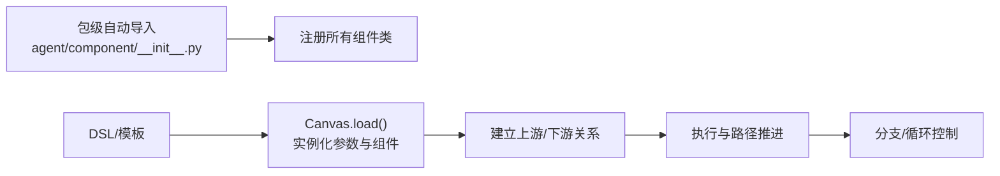

# 组件系统

<cite>
**本文引用的文件**
- [agent/component/base.py](file://agent/component/base.py)
- [agent/component/__init__.py](file://agent/component/__init__.py)
- [agent/component/begin.py](file://agent/component/begin.py)
- [agent/component/message.py](file://agent/component/message.py)
- [agent/component/iteration.py](file://agent/component/iteration.py)
- [agent/component/iterationitem.py](file://agent/component/iterationitem.py)
- [agent/component/loop.py](file://agent/component/loop.py)
- [agent/component/loopitem.py](file://agent/component/loopitem.py)
- [agent/component/categorize.py](file://agent/component/categorize.py)
- [agent/component/switch.py](file://agent/component/switch.py)
- [agent/component/fillup.py](file://agent/component/fillup.py)
- [agent/component/exit_loop.py](file://agent/component/exit_loop.py)
- [agent/component/llm.py](file://agent/component/llm.py)
- [agent/canvas.py](file://agent/canvas.py)
- [agent/templates/advanced_ingestion_pipeline.json](file://agent/templates/advanced_ingestion_pipeline.json)
- [agent/test/dsl_examples/iteration.json](file://agent/test/dsl_examples/iteration.json)
</cite>

## 目录
1. [简介](#简介)
2. [项目结构](#项目结构)
3. [核心组件](#核心组件)
4. [架构总览](#架构总览)
5. [详细组件分析](#详细组件分析)
6. [依赖关系分析](#依赖关系分析)
7. [性能与并发特性](#性能与并发特性)
8. [故障排查指南](#故障排查指南)
9. [结论](#结论)
10. [附录：开发与使用指南](#附录开发与使用指南)

## 简介
本文件系统性梳理并说明组件系统的设计与实现，覆盖抽象基类与参数体系、组件生命周期与调用机制、输入输出与变量引用、参数校验与表单定义、组件间连接与分支控制、异步与流式输出、错误处理与异常策略、以及序列化与持久化思路。文档同时给出常见组件（Begin、Message、LLM、Iteration/Loop、Categorize、Switch 等）的职责、接口与典型用法，并通过 DSL 模板与测试样例展示组合使用场景。

## 项目结构
组件系统位于 agent/component 目录，采用“按功能模块分文件”的组织方式；每个组件由“组件类”和“参数类”成对实现，参数类负责表单、校验与默认值，组件类负责执行逻辑与生命周期管理。组件注册通过包级自动导入机制完成，Canvas 负责加载 DSL、实例化组件、调度执行与路径推进。

图示来源
- [agent/component/base.py:365-585](file://agent/component/base.py#L365-L585)
- [agent/component/__init__.py:25-48](file://agent/component/__init__.py#L25-L48)
- [agent/canvas.py:91-109](file://agent/canvas.py#L91-L109)

章节来源
- [agent/component/__init__.py:25-48](file://agent/component/__init__.py#L25-L48)
- [agent/canvas.py:91-109](file://agent/canvas.py#L91-L109)

## 核心组件
本节聚焦抽象基类与参数基类的设计理念、接口规范与通用机制。

- 抽象基类 ComponentBase
  - 生命周期与调用
    - 提供同步与异步统一入口：invoke、invoke_async
    - 内置超时装饰器、取消检测、计时与错误记录
    - 输出管理：set_output、output、error、reset
  - 输入与变量引用
    - get_input/get_input_values 获取当前输入，支持变量表达式解析与上游引用
    - 支持正则表达式模式匹配变量引用，如 {cpn@var}、{sys.xxx}、{env.xxx}
  - 上下游与路径推进
    - get_upstream/get_downstream 获取邻接组件名
    - 通过 Canvas 的 path 控制执行顺序与分支
  - 异常处理
    - exception_handler/get_exception_default_value/set_exception_default_value 支持“注释式异常处理”与默认值回退
  - 思路输出
    - thoughts 返回组件“思考”文本，便于可视化或调试

- 参数基类 ComponentParamBase
  - 表单与校验
    - 定义 inputs/outputs/description 等通用字段
    - 提供 check() 接口，子类重写进行参数合法性检查
    - 内置多种校验辅助方法：字符串、非空、正整数/数值、范围、布尔、枚举等
  - 配置更新与序列化
    - update(conf, allow_redundant) 支持递归更新参数树，兼容“原始配置”标记
    - as_dict 序列化为字典，自动跳过内部标志位
  - 兼容与废弃参数
    - 记录用户传入参数集合、废弃参数集合，提供告警与迁移提示

章节来源
- [agent/component/base.py:365-585](file://agent/component/base.py#L365-L585)
- [agent/component/base.py:40-200](file://agent/component/base.py#L40-L200)

## 架构总览
Canvas 负责从 DSL 加载组件定义，实例化参数与组件对象，建立上下游关系，驱动执行与路径推进。组件之间通过变量引用与输出/输入键进行数据传递；分支与循环通过下游列表与特殊组件（Iteration、Loop、Switch、Categorize）实现。

图示来源
- [agent/canvas.py:456-669](file://agent/canvas.py#L456-L669)
- [agent/component/begin.py:40-60](file://agent/component/begin.py#L40-L60)
- [agent/component/llm.py:264-342](file://agent/component/llm.py#L264-L342)
- [agent/component/iteration.py:59-68](file://agent/component/iteration.py#L59-L68)
- [agent/component/iterationitem.py:35-86](file://agent/component/iterationitem.py#L35-L86)
- [agent/component/message.py:180-204](file://agent/component/message.py#L180-L204)

## 详细组件分析

### Begin 组件
- 角色与职责
  - 工作流入口，负责读取用户输入、文件上传、设置初始变量
- 关键点
  - 参数校验：mode 必须为指定枚举之一
  - 文件类型识别与服务端拉取
  - 将输入写入输出与输入缓存，供后续组件引用

章节来源
- [agent/component/begin.py:20-60](file://agent/component/begin.py#L20-L60)

### Message 组件
- 角色与职责
  - 渲染内容、可选流式输出、可选内存落盘、可选格式转换（Markdown/HTML/Excel/PDF/DOCX）
- 关键点
  - 变量提取：从模板中解析 {cpn@var} 等引用
  - 渲染策略：非 Jinja2 模板且开启流式时，返回 partial 以支持增量输出
  - 内容转换：根据 output_format 使用 pypandoc 或 Excel Writer
  - 内存保存：异步排队保存到记忆队列

章节来源
- [agent/component/message.py:39-207](file://agent/component/message.py#L39-L207)
- [agent/component/message.py:251-441](file://agent/component/message.py#L251-L441)

### LLM 组件
- 角色与职责
  - 作为 LLM 调用封装，支持结构化输出、流式增量、图片多模态、引用溯源、异常回退
- 关键点
  - 参数校验：温度、惩罚项、最大 token 等
  - Prompt 组装：系统提示、历史窗口、用户自定义提示
  - 结构化输出：注入 JSON Schema 提示，失败时重试
  - 流式输出：对下游为 Message 时直接返回增量流
  - 图片多模态：当存在 data:image 开头的图片变量时切换模型类型

章节来源
- [agent/component/llm.py:33-80](file://agent/component/llm.py#L33-L80)
- [agent/component/llm.py:82-352](file://agent/component/llm.py#L82-L352)

### Iteration 与 IterationItem 组件
- 角色与职责
  - Iteration：迭代容器，持有 items_ref 指向数组变量
  - IterationItem：迭代项处理器，按序取出数组元素，输出 item/index，并在每轮结束后进行“输出聚合”
- 关键点
  - 输出聚合：遍历同父容器下的子组件，收集 ref 指向的输出，合并为数组
  - 循环结束：索引到达末尾后复位，结束本轮

章节来源
- [agent/component/iteration.py:27-72](file://agent/component/iteration.py#L27-L72)
- [agent/component/iterationitem.py:20-92](file://agent/component/iterationitem.py#L20-L92)

### Loop 与 LoopItem 组件
- 角色与职责
  - Loop：初始化循环变量，支持常量/变量/类型默认值
  - LoopItem：推进循环，基于终止条件（and/or 逻辑运算符）判断是否退出
- 关键点
  - 条件评估：支持字符串/数值/布尔/列表/None 多类型比较
  - 逻辑运算：and/or 控制是否全部满足或任一满足即终止

章节来源
- [agent/component/loop.py:20-80](file://agent/component/loop.py#L20-L80)
- [agent/component/loopitem.py:20-167](file://agent/component/loopitem.py#L20-L167)

### Categorize 组件
- 角色与职责
  - 基于 LLM 的分类器，将用户查询映射到预设类别，并决定下一步路径
- 关键点
  - 动态系统提示：根据类别描述与示例动态拼装
  - 异步调用：使用 LLMBundle 异步对话，统计类别出现次数选择最可能类别
  - 输出：category_name 与 _next 下游列表

章节来源
- [agent/component/categorize.py:29-164](file://agent/component/categorize.py#L29-L164)

### Switch 组件
- 角色与职责
  - 条件分支组件，根据多个上游组件输出与操作符进行判定，决定下一跳
- 关键点
  - 支持多种操作符：包含/不包含、起止匹配、空/非空、数值比较等
  - 逻辑运算：and/or 控制条件组合

章节来源
- [agent/component/switch.py:25-141](file://agent/component/switch.py#L25-L141)

### UserFillUp 组件
- 角色与职责
  - 用户表单填写组件，支持提示渲染与文件输入
- 关键点
  - 变量替换：将提示中的变量渲染为实际值
  - 文件处理：通过服务拉取文件内容

章节来源
- [agent/component/fillup.py:24-78](file://agent/component/fillup.py#L24-L78)

### ExitLoop 组件
- 角色与职责
  - 循环出口占位组件，用于显式结束循环流程
- 关键点
  - 通常配合 Loop/LoopItem 使用，作为循环结束节点

章节来源
- [agent/component/exit_loop.py:20-32](file://agent/component/exit_loop.py#L20-L32)

## 依赖关系分析
- 组件注册
  - 通过包级自动扫描 agent/component 下的 Python 文件，反射提取公开类并注册到全局命名空间
- Canvas 加载
  - 依据 DSL 中的组件名构造对应 Param 类并 update，随后实例化组件对象
  - 校验阶段若参数不合法会抛出明确错误信息
- 组件间连接
  - upstream/downstream 字段定义拓扑关系
  - 变量引用语法 {cpn@var} 实现跨组件数据传递
- 分支与循环
  - Categorize/Switch 通过 _next 或 _next 列表改变执行路径
  - Iteration/Loop 通过容器与子项组件形成迭代闭环

图示来源
- [agent/component/__init__.py:25-48](file://agent/component/__init__.py#L25-L48)
- [agent/canvas.py:91-109](file://agent/canvas.py#L91-L109)

章节来源
- [agent/component/__init__.py:25-48](file://agent/component/__init__.py#L25-L48)
- [agent/canvas.py:91-109](file://agent/canvas.py#L91-L109)

## 性能与并发特性
- 并发限制
  - 组件实例共享线程信号量，限制同时处理的聊天数量，默认值来自环境变量
- 超时控制
  - 所有组件的 _invoke/_invoke_async 方法均受超时装饰器保护，避免阻塞
- 异步与流式
  - LLM 在下游为 Message 时返回增量流，提升交互体验
  - Message 在非 Jinja2 模板且开启流式时，逐片段输出
- 线程池
  - Canvas 使用线程池执行任务，异步协程在独立线程中运行，避免阻塞事件循环

章节来源
- [agent/component/base.py:367-451](file://agent/component/base.py#L367-L451)
- [agent/component/llm.py:264-342](file://agent/component/llm.py#L264-L342)
- [agent/component/message.py:109-172](file://agent/component/message.py#L109-L172)
- [agent/canvas.py:456-464](file://agent/canvas.py#L456-L464)

## 故障排查指南
- 常见问题定位
  - 参数校验失败：查看具体组件的 check() 抛出的异常信息，确认必填项与取值范围
  - 变量未解析：确认引用语法 {cpn@var} 是否正确，上游组件是否已设置该输出键
  - 取消任务：组件在执行前会检查取消状态，若被取消会记录错误并设置输出
  - 异常处理：若启用异常默认值或跳转，需检查 exception_method/exception_default_value/exception_goto 的配置
- 日志与诊断
  - 组件内部使用日志记录关键步骤与错误
  - Canvas 在节点完成后输出 inputs/outputs/error/耗时等信息，便于审计

章节来源
- [agent/component/base.py:393-420](file://agent/component/base.py#L393-L420)
- [agent/canvas.py:465-586](file://agent/canvas.py#L465-L586)

## 结论
组件系统以抽象基类为核心，通过参数基类统一了表单、校验与序列化机制；组件类聚焦执行逻辑与生命周期管理。Canvas 负责从 DSL 加载、实例化与调度，结合变量引用与分支/循环组件，构建灵活的工作流。系统在并发、超时、流式输出与异常处理方面具备良好工程化能力，适合复杂业务场景的编排与扩展。

## 附录：开发与使用指南

### 如何创建自定义组件
- 步骤
  - 新建文件：agent/component/mycomp.py
  - 定义参数类 MyCompParam，继承 ComponentParamBase，实现 check() 与 get_input_form()
  - 定义组件类 MyComp，继承 ComponentBase，实现 _invoke/_invoke_async 与 thoughts()
  - 在 __init__.py 中无需手动注册，包级自动导入会发现新组件
- 最佳实践
  - 明确定义 inputs/outputs 与默认值
  - 使用 get_input_elements_from_text 解析模板中的变量引用
  - 在异常情况下使用 exception_handler 回退或跳转
  - 若涉及外部服务，注意超时与重试策略

章节来源
- [agent/component/base.py:40-200](file://agent/component/base.py#L40-L200)
- [agent/component/base.py:407-585](file://agent/component/base.py#L407-L585)
- [agent/component/__init__.py:25-48](file://agent/component/__init__.py#L25-L48)

### 参数配置系统
- 表单定义
  - get_input_form 返回组件表单字段描述，供前端渲染
- 校验规则
  - 使用内置校验方法（字符串、非空、正整数/数值、范围、布尔、枚举等）
  - 支持 JSON Schema 风格的嵌套校验
- 默认值与冗余参数
  - update(conf) 支持递归更新，允许/禁止冗余属性
  - 内部标志位（如 _IS_RAW_CONF、_USER_FEEDED_PARAMS 等）用于序列化与兼容性

章节来源
- [agent/component/base.py:127-200](file://agent/component/base.py#L127-L200)

### 组件间连接与数据传递
- 上下游关系
  - 通过 DSL 的 upstream/downstream 字段声明
- 数据传递
  - 使用 {cpn@var} 语法引用上游输出
  - 组件内部通过 get_input/get_input_values 自动解析并填充
- 条件分支
  - Categorize/Switch 通过 _next 或 _next 列表动态决定下一站

章节来源
- [agent/canvas.py:657-669](file://agent/canvas.py#L657-L669)
- [agent/component/categorize.py:158-160](file://agent/component/categorize.py#L158-L160)
- [agent/component/switch.py:64-98](file://agent/component/switch.py#L64-L98)

### 序列化与持久化
- 组件序列化
  - as_dict 递归导出参数对象，跳过内部标志位
- Canvas 持久化
  - Canvas 提供 DSL 结构的序列化与恢复能力，包含 components、path、globals 等
- 存储与附件
  - Message 可将转换后的二进制内容上传至存储实现，并输出附件信息

章节来源
- [agent/component/base.py:99-126](file://agent/component/base.py#L99-L126)
- [agent/canvas.py:107-116](file://agent/canvas.py#L107-L116)
- [agent/component/message.py:418-428](file://agent/component/message.py#L418-L428)

### 示例与模板
- 高级数据摄取流水线模板
  - 展示 Parser、Splitter、Extractor、Tokenizer 等组件的组合与数据流
- 迭代样例
  - 通过 Begin -> Agent(结构化输出) -> Iteration -> IterationItem -> Tavily -> Agent -> Message 的链路，演示多轮检索与报告生成

章节来源
- [agent/templates/advanced_ingestion_pipeline.json:15-298](file://agent/templates/advanced_ingestion_pipeline.json#L15-L298)
- [agent/test/dsl_examples/iteration.json:1-92](file://agent/test/dsl_examples/iteration.json#L1-L92)