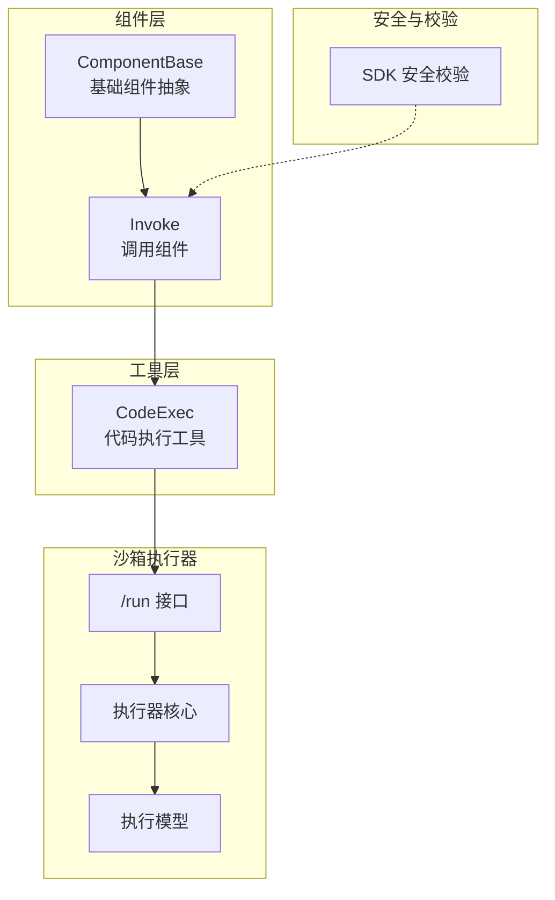
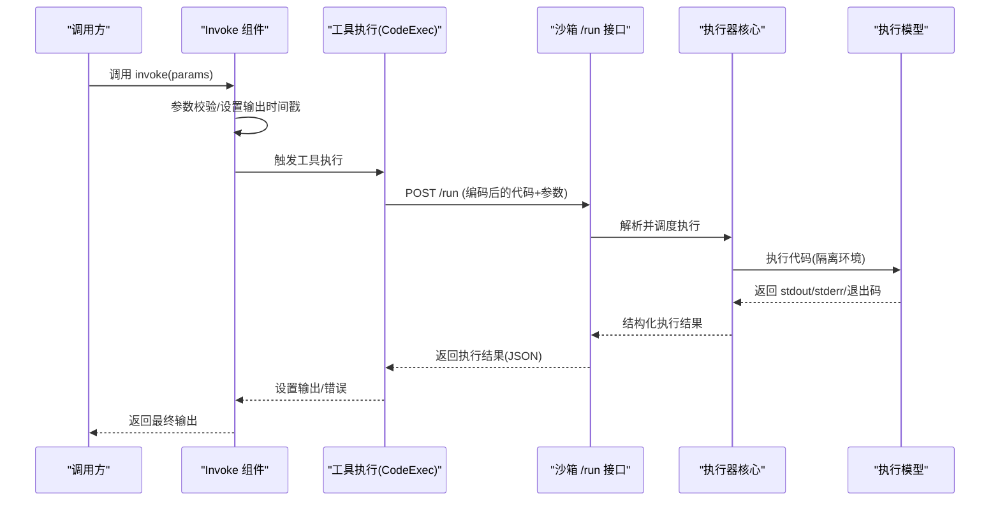
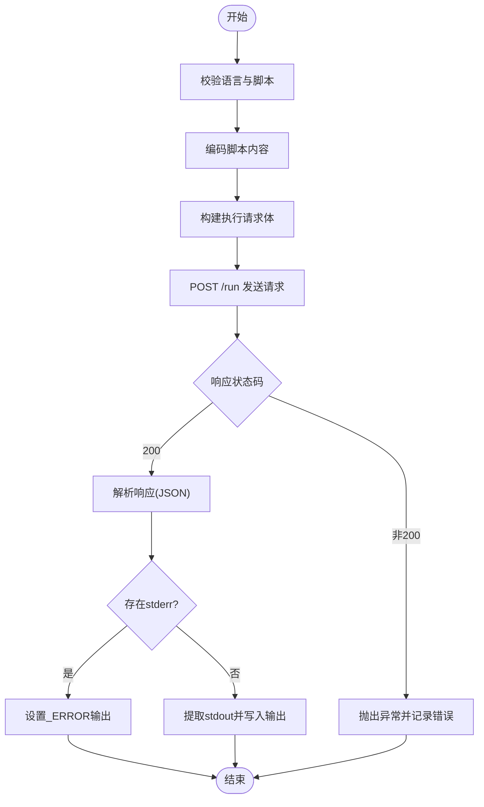
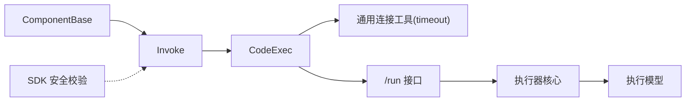

# 调用组件

<cite>
**本文引用的文件**
- [agent\component\invoke.py](file://agent\component\invoke.py)
- [agent\component\base.py](file://agent\component\base.py)
- [common\connection_utils.py](file://common\connection_utils.py)
- [agent\tools\code_exec.py](file://agent\tools\code_exec.py)
- [sandbox\executor_manager\api\run.py](file://sandbox\executor_manager\api\run.py)
- [sandbox\executor_manager\core\executor.py](file://sandbox\executor_manager\core\executor.py)
- [sandbox\executor_manager\models\execution.py](file://sandbox\executor_manager\models\execution.py)
- [api\apps\sdk\agents.py](file://api\apps\sdk\agents.py)
- [web\src\hooks\use-send-message.ts](file://web\src\hooks\use-send-message.ts)
</cite>

## 目录
1. [简介](#简介)
2. [项目结构](#项目结构)
3. [核心组件](#核心组件)
4. [架构总览](#架构总览)
5. [详细组件分析](#详细组件分析)
6. [依赖分析](#依赖分析)
7. [性能考虑](#性能考虑)
8. [故障排查指南](#故障排查指南)
9. [结论](#结论)
10. [附录](#附录)

## 简介
本技术文档围绕“调用组件”展开，重点覆盖以下方面：
- 外部调用机制：HTTP 请求、API 调用、工具执行（如代码执行沙箱）等。
- 响应等待逻辑：超时处理、重试机制、状态监控与中断取消。
- 安全机制：权限控制、参数校验、结果缓存与隔离。
- 错误处理策略：异常捕获、降级处理、日志记录与可观测性。
- 配置项说明、使用场景分析与性能优化建议。
- 各类调用场景的示例路径与调试技巧。

## 项目结构
调用组件位于智能体工作流的组件层，负责对外部系统发起请求或执行工具，并在统一的生命周期内完成输入解析、参数校验、执行、错误处理与输出封装。

图示来源
- [agent\component\invoke.py](file://agent\component\invoke.py)
- [agent\component\base.py](file://agent\component\base.py)
- [agent\tools\code_exec.py](file://agent\tools\code_exec.py)
- [sandbox\executor_manager\api\run.py](file://sandbox\executor_manager\api\run.py)
- [sandbox\executor_manager\core\executor.py](file://sandbox\executor_manager\core\executor.py)
- [sandbox\executor_manager\models\execution.py](file://sandbox\executor_manager\models\execution.py)
- [api\apps\sdk\agents.py](file://api\apps\sdk\agents.py)

章节来源
- [agent\component\invoke.py](file://agent\component\invoke.py)
- [agent\component\base.py](file://agent\component\base.py)
- [agent\tools\code_exec.py](file://agent\tools\code_exec.py)
- [sandbox\executor_manager\api\run.py](file://sandbox\executor_manager\api\run.py)
- [sandbox\executor_manager\core\executor.py](file://sandbox\executor_manager\core\executor.py)
- [sandbox\executor_manager\models\execution.py](file://sandbox\executor_manager\models\execution.py)
- [api\apps\sdk\agents.py](file://api\apps\sdk\agents.py)

## 核心组件
- 组件基类 ComponentBase：提供统一的生命周期管理、输入输出封装、异常处理、超时装饰器、并发限制与取消检查等能力。
- 调用组件 Invoke：面向外部调用的抽象组件，具体实现可对接 HTTP、API 或工具执行。
- 工具执行 CodeExec：以 HTTP 方式调用沙箱执行器，完成代码安全执行与结果回传。
- 沙箱执行器：接收编码后的代码与参数，执行并返回标准结构化结果。
- SDK 安全校验：对 SDK 调用进行速率限制、IP 白名单、Basic/JWT 认证等安全控制。

章节来源
- [agent\component\base.py](file://agent\component\base.py)
- [agent\component\invoke.py](file://agent\component\invoke.py)
- [agent\tools\code_exec.py](file://agent\tools\code_exec.py)
- [sandbox\executor_manager\api\run.py](file://sandbox\executor_manager\api\run.py)
- [api\apps\sdk\agents.py](file://api\apps\sdk\agents.py)

## 架构总览
调用组件的典型执行链路如下：

图示来源
- [agent\component\invoke.py](file://agent\component\invoke.py)
- [agent\tools\code_exec.py](file://agent\tools\code_exec.py)
- [sandbox\executor_manager\api\run.py](file://sandbox\executor_manager\api\run.py)
- [sandbox\executor_manager\core\executor.py](file://sandbox\executor_manager\core\executor.py)
- [sandbox\executor_manager\models\execution.py](file://sandbox\executor_manager\models\execution.py)

## 详细组件分析

### 组件基类 ComponentBase
- 生命周期与执行包装
  - 提供同步与异步两种入口：invoke 与 invoke_async，均负责记录开始时间、异常捕获、设置耗时等。
  - 异步优先检测是否存在 _invoke_async；否则回退到 _invoke 或线程池执行。
- 超时与并发
  - 使用通用超时装饰器，超时时间默认来自环境变量，确保长任务不会无限阻塞。
  - 通过信号量限制并发聊天数，避免资源争抢。
- 取消与中断
  - 在关键节点检查任务是否被取消，若已取消则记录错误并提前返回。
- 输出与错误
  - 统一的输出字典结构，支持设置/读取输出键值与错误字段。
- 参数校验
  - 支持基于 JSON 的参数约束校验，便于在运行期对入参进行范围/类型/集合等校验。

章节来源
- [agent\component\base.py](file://agent\component\base.py)

### 调用组件 Invoke
- 设计定位
  - 作为对外调用的抽象组件，可扩展为 HTTP 调用、API 调用、工具执行等多种形态。
- 关键行为
  - 在 invoke 流程中设置创建时间与输入映射，随后进入具体 _invoke 实现。
  - 统一的异常处理与耗时统计，保证上层调用的一致性体验。
- 适用场景
  - 对接第三方服务、内部微服务、文件下载、数据拉取等。

章节来源
- [agent\component\invoke.py](file://agent\component\invoke.py)

### 工具执行 CodeExec
- 功能概述
  - 将用户脚本进行编码并通过 HTTP 请求发送至沙箱执行器的 /run 接口。
  - 支持语言选择（Python/NodeJS 等）、参数注入与执行结果解析。
- 关键流程
  - 参数校验：语言与脚本必填校验。
  - 编码与构造请求体：将脚本内容进行编码并组装请求参数。
  - 发起 HTTP 请求：POST 到沙箱执行器，设置超时时间。
  - 结果处理：解析 stdout/stderr/退出码，错误写入输出字段。
- 安全要点
  - 通过沙箱隔离执行环境，避免直接在主进程中执行任意代码。
  - 支持取消检查，防止长时间占用资源。

图示来源
- [agent\tools\code_exec.py](file://agent\tools\code_exec.py)
- [sandbox\executor_manager\api\run.py](file://sandbox\executor_manager\api\run.py)

章节来源
- [agent\tools\code_exec.py](file://agent\tools\code_exec.py)

### 沙箱执行器
- 接口职责
  - /run 接口接收编码后的代码与参数，交由执行器核心进行调度与执行。
- 执行模型
  - 执行模型负责在隔离环境中运行代码，收集标准输出/错误与退出码。
- 返回结构
  - 标准化的 JSON 结果，包含 stdout、stderr、退出码等关键信息，便于上层组件解析与展示。

章节来源
- [sandbox\executor_manager\api\run.py](file://sandbox\executor_manager\api\run.py)
- [sandbox\executor_manager\core\executor.py](file://sandbox\executor_manager\core\executor.py)
- [sandbox\executor_manager\models\execution.py](file://sandbox\executor_manager\models\execution.py)

### SDK 安全校验
- 能力范围
  - IP 白名单：仅允许白名单内的客户端访问。
  - 速率限制：基于时间窗口的简单内存限流。
  - 基础认证：用户名/密码校验。
  - JWT 认证：密钥解码与可选 aud 校验。
- 应用位置
  - SDK 接口层对请求进行前置校验，保障后端服务安全。

章节来源
- [api\apps\sdk\agents.py](file://api\apps\sdk\agents.py)

## 依赖分析
- 组件耦合
  - Invoke 依赖 ComponentBase 的生命周期与超时/并发/取消机制。
  - CodeExec 依赖通用连接工具与超时装饰器，同时耦合沙箱执行器接口。
  - 沙箱执行器内部依赖执行模型与核心调度模块。
- 外部依赖
  - HTTP 客户端库用于向沙箱执行器发起请求。
  - 环境变量用于控制超时与并发上限。
- 循环依赖
  - 通过延迟导入避免循环依赖问题（例如在组件基类中对画布的局部导入）。

图示来源
- [agent\component\base.py](file://agent\component\base.py)
- [agent\component\invoke.py](file://agent\component\invoke.py)
- [agent\tools\code_exec.py](file://agent\tools\code_exec.py)
- [common\connection_utils.py](file://common\connection_utils.py)
- [sandbox\executor_manager\api\run.py](file://sandbox\executor_manager\api\run.py)
- [sandbox\executor_manager\core\executor.py](file://sandbox\executor_manager\core\executor.py)
- [sandbox\executor_manager\models\execution.py](file://sandbox\executor_manager\models\execution.py)
- [api\apps\sdk\agents.py](file://api\apps\sdk\agents.py)

章节来源
- [agent\component\base.py](file://agent\component\base.py)
- [agent\component\invoke.py](file://agent\component\invoke.py)
- [agent\tools\code_exec.py](file://agent\tools\code_exec.py)
- [common\connection_utils.py](file://common\connection_utils.py)
- [sandbox\executor_manager\api\run.py](file://sandbox\executor_manager\api\run.py)
- [sandbox\executor_manager\core\executor.py](file://sandbox\executor_manager\core\executor.py)
- [sandbox\executor_manager\models\execution.py](file://sandbox\executor_manager\models\execution.py)
- [api\apps\sdk\agents.py](file://api\apps\sdk\agents.py)

## 性能考虑
- 超时控制
  - 使用统一超时装饰器，结合环境变量可按需调整默认超时时间，避免长时间阻塞。
- 并发限制
  - 通过信号量限制并发聊天数，防止资源耗尽；在高负载场景下建议降低并发上限。
- I/O 与序列化
  - 工具执行前对脚本进行编码，减少传输体积；响应解析采用 JSON，注意大体量 stdout/stderr 的内存占用。
- 缓存与复用
  - 对于重复的外部调用，可在上层组件引入结果缓存策略，避免重复请求。
- 日志与可观测性
  - 统一记录错误堆栈与耗时，便于定位慢调用与异常点。

## 故障排查指南
- 常见问题与定位
  - 超时/取消：检查环境变量中的超时设置与任务取消标志位；确认中间环节是否及时检测取消。
  - HTTP 请求失败：查看响应状态码与错误信息，必要时开启更详细的日志。
  - 沙箱执行异常：关注 stderr 字段与退出码，定位脚本语法或运行时错误。
  - 参数校验失败：核对参数约束 JSON 与实际传入值，修正不合法字段。
- 调试技巧
  - 使用前端 Hook 中的 SSE 流式接收与停止逻辑，观察实时输出与中断行为。
  - 在组件基类中启用耗时统计，快速识别慢环节。
  - 对 SDK 接口增加 IP 白名单与速率限制，排除网络抖动与恶意请求干扰。

章节来源
- [agent\component\base.py](file://agent\component\base.py)
- [agent\tools\code_exec.py](file://agent\tools\code_exec.py)
- [web\src\hooks\use-send-message.ts](file://web\src\hooks\use-send-message.ts)

## 结论
调用组件通过统一的生命周期与超时/并发/取消机制，为外部调用提供了稳定、可控的执行框架。结合工具执行与沙箱隔离，既能满足灵活的外部集成需求，又能保障运行时安全。配合 SDK 安全校验与完善的错误处理策略，整体具备良好的可维护性与可观测性。建议在生产环境中合理配置超时与并发上限，并针对高频调用引入结果缓存与重试策略，进一步提升稳定性与性能。

## 附录

### 配置选项说明
- 组件执行超时（秒）
  - 默认值：来自环境变量，默认 10 分钟。
  - 作用域：所有组件的 _invoke 方法。
- 最大并发聊天数
  - 默认值：来自环境变量，默认 10。
  - 作用域：全局并发限制，避免资源争抢。
- 沙箱执行超时（秒）
  - 默认值：来自环境变量，默认 10 分钟。
  - 作用域：工具执行组件向沙箱发起请求时的超时控制。
- 参数校验 JSON
  - 位置：组件参数对象的校验文件。
  - 作用：在运行期对入参进行范围/类型/集合等约束校验。

章节来源
- [agent\component\base.py](file://agent\component\base.py)
- [agent\tools\code_exec.py](file://agent\tools\code_exec.py)

### 使用场景与示例路径
- 场景一：HTTP 外部 API 调用
  - 典型实现：在 Invoke 的 _invoke 中发起 HTTP 请求，解析响应并写入输出。
  - 示例路径参考：[agent\component\invoke.py](file://agent\component\invoke.py)
- 场景二：代码执行（沙箱）
  - 典型实现：通过 CodeExec 将脚本编码后 POST 至 /run 接口，解析 stdout/stderr。
  - 示例路径参考：
    - [agent\tools\code_exec.py](file://agent\tools\code_exec.py)
    - [sandbox\executor_manager\api\run.py](file://sandbox\executor_manager\api\run.py)
- 场景三：SDK 安全接入
  - 典型实现：在 SDK 层进行 IP 白名单、速率限制、Basic/JWT 认证。
  - 示例路径参考：[api\apps\sdk\agents.py](file://api\apps\sdk\agents.py)

### 调试技巧清单
- 前端流式输出与中断
  - 使用 SSE 流式解析与 AbortController 控制中断。
  - 示例路径参考：[web\src\hooks\use-send-message.ts](file://web\src\hooks\use-send-message.ts)
- 组件耗时统计
  - 在 invoke/invoke_async 中记录开始时间与耗时，辅助性能分析。
  - 示例路径参考：[agent\component\base.py](file://agent\component\base.py)
- 取消与错误处理
  - 在关键步骤检查取消标志，统一设置 _ERROR 输出并记录日志。
  - 示例路径参考：[agent\component\base.py](file://agent\component\base.py)