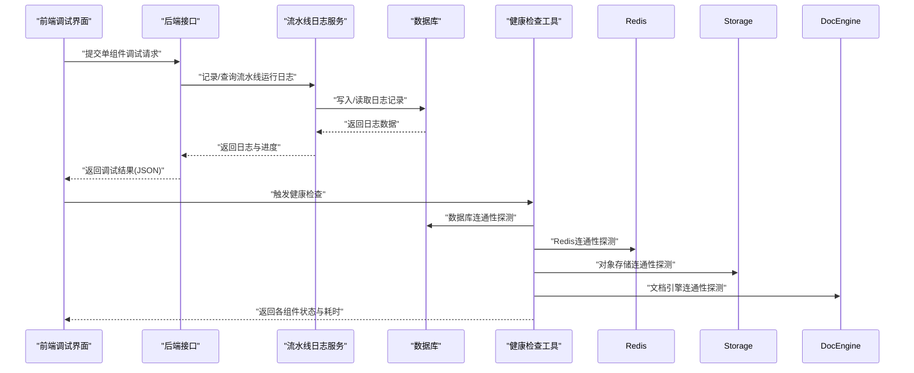
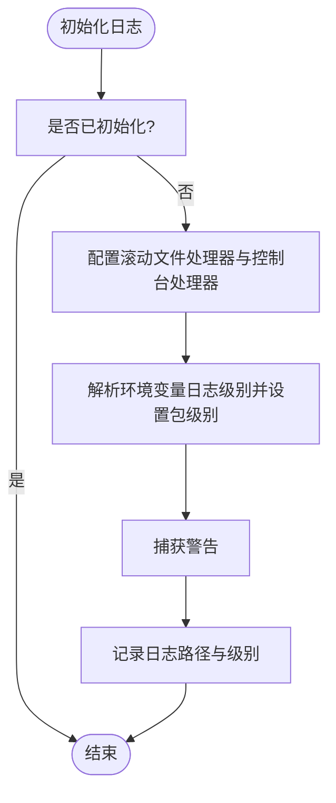
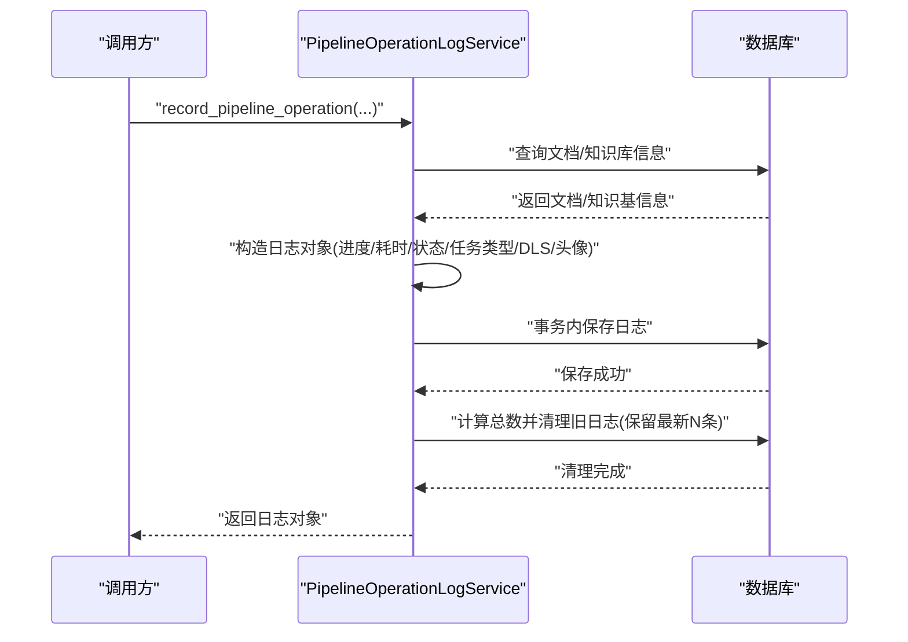
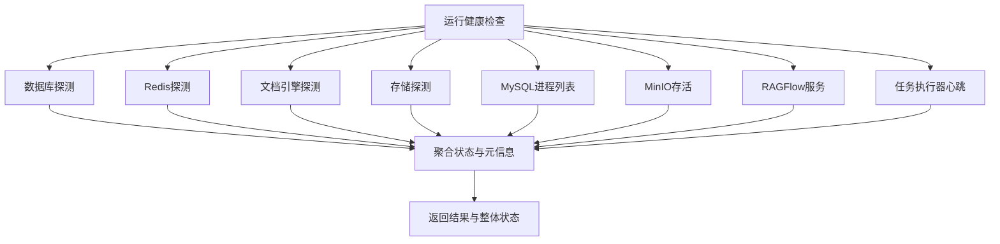
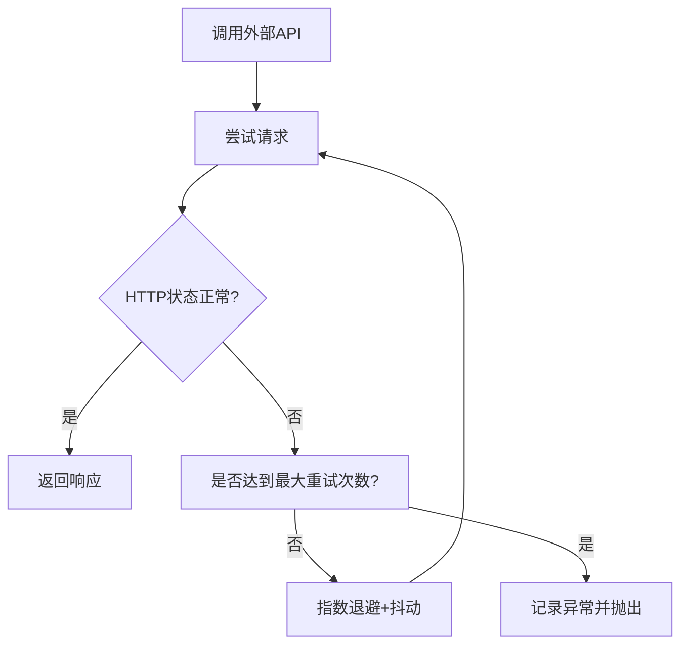
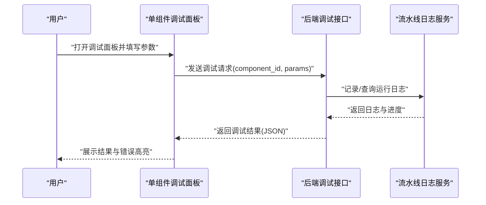
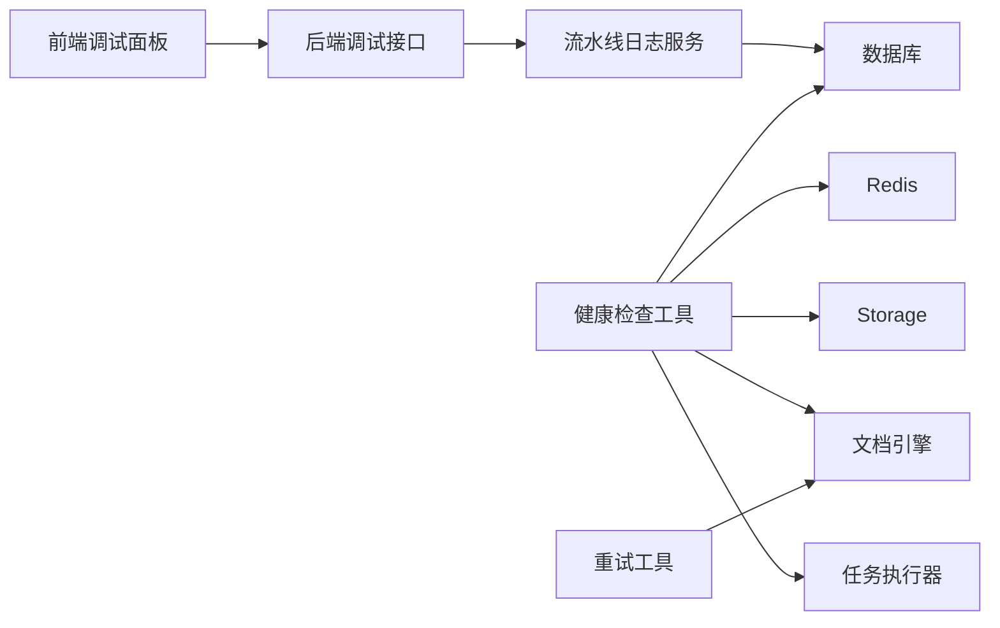
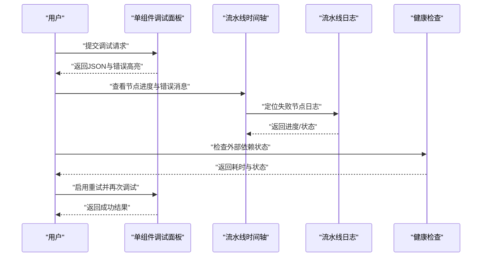

# 调试与监控

<cite>
**本文档引用的文件**
- [common/log_utils.py](file://common/log_utils.py)
- [api/db/services/pipeline_operation_log_service.py](file://api/db/services/pipeline_operation_log_service.py)
- [api/utils/health_utils.py](file://api/utils/health_utils.py)
- [common/data_source/cross_connector_utils/retry_wrapper.py](file://common/data_source/cross_connector_utils/retry_wrapper.py)
- [web/src/pages/agent/pipeline-log-sheet/dataflow-timeline.tsx](file://web/src/pages/agent/pipeline-log-sheet/dataflow-timeline.tsx)
- [web/src/pages/agent/form-sheet/single-debug-sheet/index.tsx](file://web/src/pages/agent/form-sheet/single-debug-sheet/index.tsx)
- [web/src/interfaces/request/agent.ts](file://web/src/interfaces/request/agent.ts)
- [web/src/components/fallback-component/index.tsx](file://web/src/components/fallback-component/index.tsx)
- [test/benchmark/report.py](file://test/benchmark/report.py)
- [mineru_debug/test_mineru_simple.py](file://mineru_debug/test_mineru_simple.py)
</cite>

## 目录
1. [简介](#简介)
2. [项目结构](#项目结构)
3. [核心组件](#核心组件)
4. [架构总览](#架构总览)
5. [详细组件分析](#详细组件分析)
6. [依赖关系分析](#依赖关系分析)
7. [性能考量](#性能考量)
8. [故障排查指南](#故障排查指南)
9. [结论](#结论)
10. [附录](#附录)

## 简介
本指南面向智能体系统的调试与监控，覆盖日志记录、断点调试、变量检查、执行跟踪、监控指标设计与实现、错误处理与异常恢复、性能分析与优化、分布式调试与一致性保障、故障排查流程以及生产环境监控与告警配置。文档以仓库现有实现为基础，结合前端可视化与后端服务日志、健康检查、重试与超时控制等能力，给出可操作的技术建议与最佳实践。

## 项目结构
围绕调试与监控的关键位置如下：
- 日志与异常：后端通用日志初始化与异常记录工具
- 运行日志与流水线追踪：流水线运行日志服务，支持进度、耗时、状态等字段
- 健康检查与资源状态：数据库、Redis、存储、文档引擎、任务执行器等健康探测
- 重试与退避：对外部接口调用的指数退避与抖动重试封装
- 前端调试与可视化：单组件调试面板、流水线时间轴与错误高亮
- 基准测试与指标：基准测试报告生成，包含延迟与吞吐统计
- 独立调试脚本：MinerU解析流程的独立调试脚本，便于隔离问题

```mermaid
graph TB
subgraph "前端"
FE_Debug["单组件调试面板<br/>single-debug-sheet"]
FE_Timeline["流水线时间轴<br/>dataflow-timeline"]
FE_ErrorBoundary["错误边界按钮"]
end
subgraph "后端"
LogInit["日志初始化<br/>common/log_utils.py"]
PipeLog["流水线运行日志服务<br/>pipeline_operation_log_service.py"]
Health["健康检查工具<br/>health_utils.py"]
Retry["重试与退避<br/>retry_wrapper.py"]
end
subgraph "外部系统"
DB["数据库"]
Redis["Redis"]
Storage["对象存储"]
DocEngine["文档引擎"]
TaskExec["任务执行器"]
end
FE_Debug --> PipeLog
FE_Timeline --> PipeLog
FE_ErrorBoundary --> FE_Debug
PipeLog --> DB
Health --> DB
Health --> Redis
Health --> Storage
Health --> DocEngine
Health --> TaskExec
Retry --> DocEngine
LogInit --> PipeLog
```

图表来源
- [common/log_utils.py:25-72](file://common/log_utils.py#L25-L72)
- [api/db/services/pipeline_operation_log_service.py:87-190](file://api/db/services/pipeline_operation_log_service.py#L87-L190)
- [api/utils/health_utils.py:187-222](file://api/utils/health_utils.py#L187-L222)
- [common/data_source/cross_connector_utils/retry_wrapper.py:16-43](file://common/data_source/cross_connector_utils/retry_wrapper.py#L16-L43)
- [web/src/pages/agent/form-sheet/single-debug-sheet/index.tsx:36-89](file://web/src/pages/agent/form-sheet/single-debug-sheet/index.tsx#L36-L89)
- [web/src/pages/agent/pipeline-log-sheet/dataflow-timeline.tsx:47-104](file://web/src/pages/agent/pipeline-log-sheet/dataflow-timeline.tsx#L47-L104)

章节来源
- [common/log_utils.py:25-72](file://common/log_utils.py#L25-L72)
- [api/db/services/pipeline_operation_log_service.py:87-190](file://api/db/services/pipeline_operation_log_service.py#L87-L190)
- [api/utils/health_utils.py:187-222](file://api/utils/health_utils.py#L187-L222)
- [common/data_source/cross_connector_utils/retry_wrapper.py:16-43](file://common/data_source/cross_connector_utils/retry_wrapper.py#L16-L43)
- [web/src/pages/agent/form-sheet/single-debug-sheet/index.tsx:36-89](file://web/src/pages/agent/form-sheet/single-debug-sheet/index.tsx#L36-L89)
- [web/src/pages/agent/pipeline-log-sheet/dataflow-timeline.tsx:47-104](file://web/src/pages/agent/pipeline-log-sheet/dataflow-timeline.tsx#L47-L104)

## 核心组件
- 日志初始化与异常记录
  - 初始化根日志器，设置滚动文件处理器与控制台处理器，支持按包名细粒度调整日志级别，并统一捕获警告
  - 异常记录工具用于输出异常堆栈与上下文文本，必要时抛出包装后的异常
- 流水线运行日志服务
  - 记录文件/数据集处理进度、耗时、状态、任务类型、DSL、头像等字段；提供分页查询、过滤与清理策略
- 健康检查工具
  - 对数据库、Redis、文档引擎、对象存储、MySQL进程列表、MinIO存活、RAGFlow服务、任务执行器心跳进行探测，返回状态与耗时
- 重试与退避
  - 提供通用重试装饰器与HTTP请求重试函数，支持最大尝试次数、初始延迟、最大延迟、退避因子与抖动
- 前端调试与可视化
  - 单组件调试弹窗支持参数输入与结果JSON查看；流水线时间轴展示节点进度与错误消息高亮
- 基准测试报告
  - 输出并发、迭代次数、成功/失败数、延迟分布（均值、最小、P50、P90、P95）、总时长与QPS等指标

章节来源
- [common/log_utils.py:25-86](file://common/log_utils.py#L25-L86)
- [api/db/services/pipeline_operation_log_service.py:87-190](file://api/db/services/pipeline_operation_log_service.py#L87-L190)
- [api/utils/health_utils.py:33-222](file://api/utils/health_utils.py#L33-L222)
- [common/data_source/cross_connector_utils/retry_wrapper.py:16-88](file://common/data_source/cross_connector_utils/retry_wrapper.py#L16-L88)
- [web/src/pages/agent/form-sheet/single-debug-sheet/index.tsx:36-89](file://web/src/pages/agent/form-sheet/single-debug-sheet/index.tsx#L36-L89)
- [web/src/pages/agent/pipeline-log-sheet/dataflow-timeline.tsx:47-104](file://web/src/pages/agent/pipeline-log-sheet/dataflow-timeline.tsx#L47-L104)
- [test/benchmark/report.py:83-105](file://test/benchmark/report.py#L83-L105)

## 架构总览
下图展示了从前端调试入口到后端日志与健康检查的整体链路，以及对外部系统的依赖与探测。

图表来源
- [web/src/pages/agent/form-sheet/single-debug-sheet/index.tsx:36-89](file://web/src/pages/agent/form-sheet/single-debug-sheet/index.tsx#L36-L89)
- [api/db/services/pipeline_operation_log_service.py:87-190](file://api/db/services/pipeline_operation_log_service.py#L87-L190)
- [api/utils/health_utils.py:187-222](file://api/utils/health_utils.py#L187-L222)

## 详细组件分析

### 日志初始化与异常记录
- 设计要点
  - 使用滚动文件处理器与控制台处理器，确保日志持久化与实时可见
  - 支持通过环境变量对不同包设置日志级别，便于在生产中降低噪声或提升可观测性
  - 捕获并记录Python警告，避免被忽略
- 关键行为
  - 初始化仅一次，避免重复注册处理器
  - 记录最终日志路径与生效级别，便于核验
  - 异常记录函数在捕获异常的同时输出上下文文本，必要时抛出包装异常

图表来源
- [common/log_utils.py:25-72](file://common/log_utils.py#L25-L72)

章节来源
- [common/log_utils.py:25-86](file://common/log_utils.py#L25-L86)

### 流水线运行日志服务
- 设计要点
  - 记录文件/数据集处理的进度、耗时、状态、任务类型、DSL、头像等字段
  - 提供分页查询、关键词/状态/类型/后缀/日期范围过滤
  - 超限清理策略，保留最新N条记录，定期清理历史
- 关键行为
  - 创建日志时根据文档与知识库信息推导租户、标题、头像等
  - 对特定任务类型更新知识库的完成时间字段
  - 在事务中保存日志并执行清理逻辑

图表来源
- [api/db/services/pipeline_operation_log_service.py:87-190](file://api/db/services/pipeline_operation_log_service.py#L87-L190)

章节来源
- [api/db/services/pipeline_operation_log_service.py:87-190](file://api/db/services/pipeline_operation_log_service.py#L87-L190)

### 健康检查工具
- 设计要点
  - 对数据库、Redis、文档引擎、对象存储、MySQL进程列表、MinIO存活、RAGFlow服务、任务执行器心跳进行探测
  - 返回每个组件的状态与耗时，聚合整体健康状态
- 关键行为
  - 数据库轻量探测（如“SELECT 1”）
  - 文档引擎与存储分别调用各自连接实例的health方法
  - 任务执行器心跳通过Redis集合与有序集合获取最近心跳

图表来源
- [api/utils/health_utils.py:187-222](file://api/utils/health_utils.py#L187-L222)

章节来源
- [api/utils/health_utils.py:33-222](file://api/utils/health_utils.py#L33-L222)

### 重试与退避
- 设计要点
  - 提供通用重试装饰器与HTTP请求重试函数，支持指数退避与抖动
  - 可配置最大尝试次数、初始/最大延迟、退避因子与异常类型
- 关键行为
  - 对外部API调用进行带退避的重试，失败时记录详细请求上下文
  - 请求成功后进行状态码校验，失败时记录异常并抛出

图表来源
- [common/data_source/cross_connector_utils/retry_wrapper.py:46-88](file://common/data_source/cross_connector_utils/retry_wrapper.py#L46-L88)

章节来源
- [common/data_source/cross_connector_utils/retry_wrapper.py:16-88](file://common/data_source/cross_connector_utils/retry_wrapper.py#L16-L88)

### 前端调试与可视化
- 单组件调试面板
  - 支持参数输入、提交、加载态与结果JSON查看
  - 错误高亮显示，便于快速定位问题
- 流水线时间轴
  - 展示节点名称、进度百分比与最新trace消息
  - 错误消息以高亮样式呈现，辅助快速识别失败节点

图表来源
- [web/src/pages/agent/form-sheet/single-debug-sheet/index.tsx:36-89](file://web/src/pages/agent/form-sheet/single-debug-sheet/index.tsx#L36-L89)
- [web/src/pages/agent/pipeline-log-sheet/dataflow-timeline.tsx:47-104](file://web/src/pages/agent/pipeline-log-sheet/dataflow-timeline.tsx#L47-L104)
- [web/src/interfaces/request/agent.ts:1-9](file://web/src/interfaces/request/agent.ts#L1-L9)

章节来源
- [web/src/pages/agent/form-sheet/single-debug-sheet/index.tsx:36-89](file://web/src/pages/agent/form-sheet/single-debug-sheet/index.tsx#L36-L89)
- [web/src/pages/agent/pipeline-log-sheet/dataflow-timeline.tsx:47-104](file://web/src/pages/agent/pipeline-log-sheet/dataflow-timeline.tsx#L47-L104)
- [web/src/interfaces/request/agent.ts:1-9](file://web/src/interfaces/request/agent.ts#L1-L9)

### 基准测试与指标
- 报告内容
  - 并发度、迭代次数、成功/失败数、延迟分布（均值、最小、P50、P90、P95）、总时长、QPS
  - 可选错误摘要
- 应用场景
  - 接口/功能回归测试、容量规划与性能对比

章节来源
- [test/benchmark/report.py:83-105](file://test/benchmark/report.py#L83-L105)

### 独立调试脚本
- 用途
  - 直接调用MinerU解析API，保存中间结果，便于隔离与复现问题
- 关键步骤
  - 发送文件与参数至解析接口
  - 提取Markdown、图片与内容列表
  - 处理Base64图片并替换引用
  - 将Markdown分割为sections并统计
  - 保存原始响应与中间产物，便于人工分析

章节来源
- [mineru_debug/test_mineru_simple.py:175-273](file://mineru_debug/test_mineru_simple.py#L175-L273)

## 依赖关系分析
- 组件耦合
  - 前端调试面板依赖后端调试接口与流水线日志服务
  - 健康检查工具依赖数据库、Redis、存储、文档引擎与任务执行器
  - 重试工具用于对外部接口调用进行容错
- 外部依赖
  - 数据库、Redis、对象存储、文档引擎（Elasticsearch/Infinity）、MinIO、任务执行器心跳
- 潜在循环依赖
  - 当前文件间无明显循环导入；健康检查工具与日志服务通过各自模块解耦

图表来源
- [api/utils/health_utils.py:187-222](file://api/utils/health_utils.py#L187-L222)
- [api/db/services/pipeline_operation_log_service.py:87-190](file://api/db/services/pipeline_operation_log_service.py#L87-L190)
- [common/data_source/cross_connector_utils/retry_wrapper.py:16-43](file://common/data_source/cross_connector_utils/retry_wrapper.py#L16-L43)

章节来源
- [api/utils/health_utils.py:187-222](file://api/utils/health_utils.py#L187-L222)
- [api/db/services/pipeline_operation_log_service.py:87-190](file://api/db/services/pipeline_operation_log_service.py#L87-L190)
- [common/data_source/cross_connector_utils/retry_wrapper.py:16-43](file://common/data_source/cross_connector_utils/retry_wrapper.py#L16-L43)

## 性能考量
- 执行时间与延迟
  - 健康检查工具记录各组件探测耗时，便于识别慢点
  - 基准测试报告提供延迟分布与QPS，支撑性能评估
- 资源消耗
  - 健康检查包含MySQL进程列表与Redis信息，可用于观察连接与负载
- 错误率与成功率
  - 健康检查聚合整体状态；流水线日志记录任务状态与进度，辅助统计成功率
- 优化建议
  - 合理设置日志级别与滚动策略，避免I/O成为瓶颈
  - 对外部调用使用指数退避与抖动，减少雪崩效应
  - 利用流水线日志的进度与耗时字段进行热点节点定位

章节来源
- [api/utils/health_utils.py:103-163](file://api/utils/health_utils.py#L103-L163)
- [test/benchmark/report.py:83-105](file://test/benchmark/report.py#L83-L105)
- [common/log_utils.py:25-72](file://common/log_utils.py#L25-L72)
- [common/data_source/cross_connector_utils/retry_wrapper.py:16-43](file://common/data_source/cross_connector_utils/retry_wrapper.py#L16-L43)

## 故障排查指南
- 常见问题与诊断
  - 数据库不可达：检查数据库连通性与权限；查看健康检查中的错误信息
  - Redis异常：确认连接配置与可用性；查看Redis信息与心跳
  - 文档引擎/存储异常：确认环境变量与连接实例；查看健康检查返回的元信息
  - 外部API不稳定：启用重试与退避；记录失败请求上下文
- 日志分析技巧
  - 使用日志初始化工具设置包级别，聚焦关键模块
  - 结合流水线日志的进度与状态字段定位失败节点
  - 错误消息高亮显示，优先处理标记为错误的消息
- 系统监控最佳实践
  - 定期运行健康检查，关注整体状态与耗时
  - 设置阈值告警（如延迟P95、错误率、QPS下降）
  - 保留最新N条流水线日志，定期清理历史

章节来源
- [api/utils/health_utils.py:187-222](file://api/utils/health_utils.py#L187-L222)
- [common/log_utils.py:25-86](file://common/log_utils.py#L25-L86)
- [web/src/pages/agent/pipeline-log-sheet/dataflow-timeline.tsx:47-104](file://web/src/pages/agent/pipeline-log-sheet/dataflow-timeline.tsx#L47-L104)
- [common/data_source/cross_connector_utils/retry_wrapper.py:46-88](file://common/data_source/cross_connector_utils/retry_wrapper.py#L46-L88)

## 结论
本指南基于仓库现有能力，构建了从日志、健康检查、重试退避到前端可视化与基准测试的完整调试与监控闭环。建议在生产环境中：
- 明确日志级别与滚动策略，确保关键信息可追溯
- 对外部依赖实施指数退避与抖动重试
- 使用健康检查与流水线日志进行持续监控与告警
- 通过单组件调试面板与独立脚本快速定位问题

## 附录
- 实际调试案例（流程示意）
  - 场景：某节点执行失败
  - 步骤：打开单组件调试面板，输入参数并提交；查看返回的JSON与错误高亮；在流水线时间轴定位失败节点；检查该节点对应日志的进度与状态；必要时启用重试并观察健康检查结果
  - 结果：定位到外部API超时，启用重试后恢复正常

图表来源
- [web/src/pages/agent/form-sheet/single-debug-sheet/index.tsx:36-89](file://web/src/pages/agent/form-sheet/single-debug-sheet/index.tsx#L36-L89)
- [web/src/pages/agent/pipeline-log-sheet/dataflow-timeline.tsx:47-104](file://web/src/pages/agent/pipeline-log-sheet/dataflow-timeline.tsx#L47-L104)
- [api/db/services/pipeline_operation_log_service.py:87-190](file://api/db/services/pipeline_operation_log_service.py#L87-L190)
- [api/utils/health_utils.py:187-222](file://api/utils/health_utils.py#L187-L222)