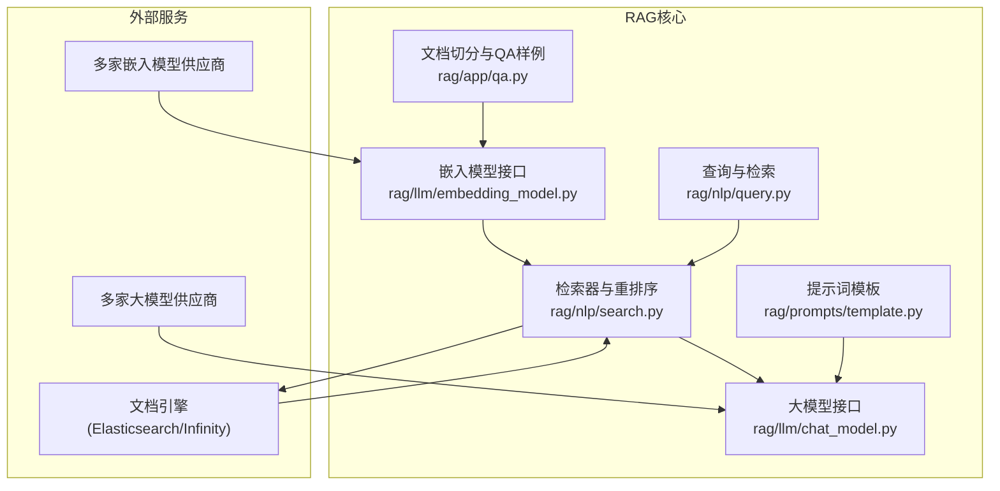
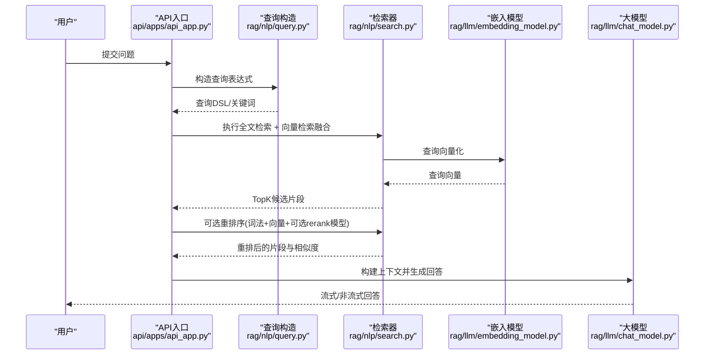
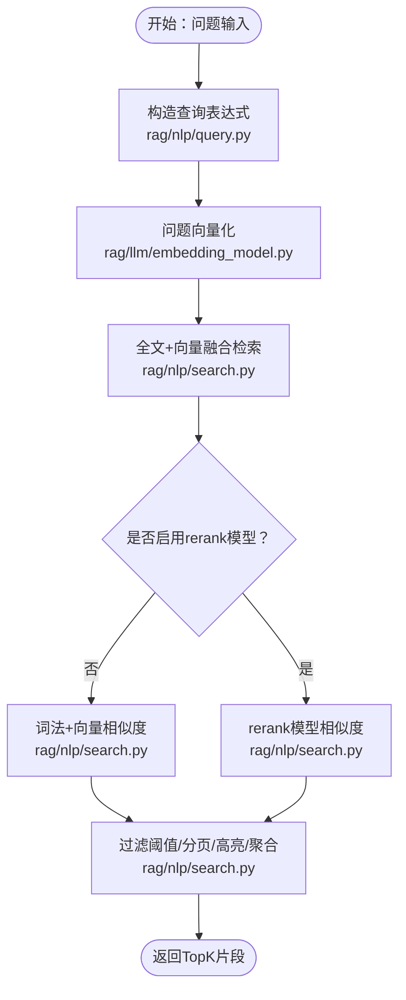
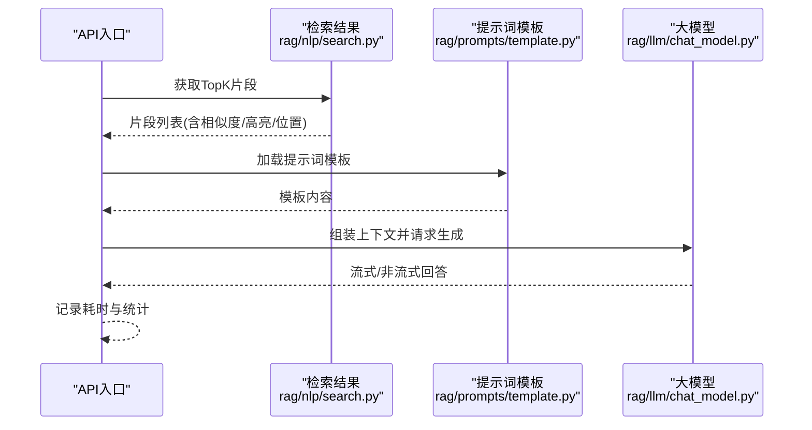
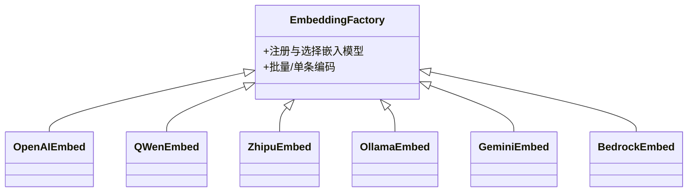
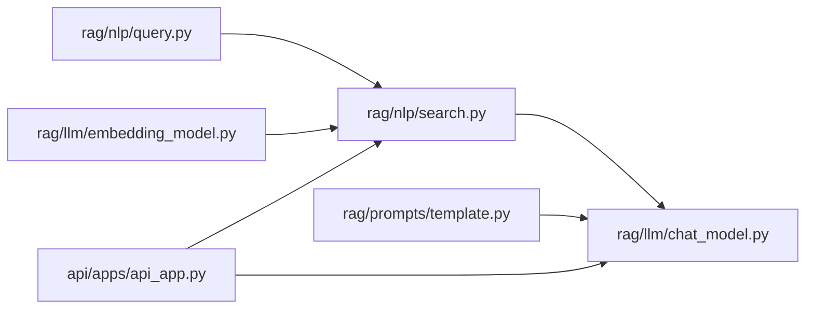

# RAG基础原理

<cite>
**本文引用的文件**   
- [README.md](file://README.md)
- [rag/llm/__init__.py](file://rag/llm/__init__.py)
- [rag/llm/chat_model.py](file://rag/llm/chat_model.py)
- [rag/llm/embedding_model.py](file://rag/llm/embedding_model.py)
- [rag/nlp/search.py](file://rag/nlp/search.py)
- [rag/nlp/query.py](file://rag/nlp/query.py)
- [rag/app/qa.py](file://rag/app/qa.py)
- [rag/prompts/template.py](file://rag/prompts/template.py)
- [api/apps/api_app.py](file://api/apps/api_app.py)
</cite>

## 目录
1. [引言](#引言)
2. [项目结构](#项目结构)
3. [核心组件](#核心组件)
4. [架构总览](#架构总览)
5. [详细组件分析](#详细组件分析)
6. [依赖关系分析](#依赖关系分析)
7. [性能考量](#性能考量)
8. [故障排查指南](#故障排查指南)
9. [结论](#结论)
10. [附录](#附录)

## 引言
本文件面向希望系统掌握RAG（检索增强生成）基础原理与实践的读者，结合RAGFlow代码库中的实现，从“检索阶段”和“生成阶段”的角度，逐层拆解向量化、语义搜索、上下文构建、重排序与生成等关键环节，并对比RAG相较传统LLM的优势（如缓解静态知识限制、降低“幻觉”风险、支持动态知识融合）。同时给出端到端流程的代码路径指引，帮助读者在实际工程中落地RAG。

## 项目结构
RAGFlow是一个以RAG为核心能力的企业级知识增强平台，后端由Python实现，前端基于Web技术栈。其RAG相关的关键模块集中在以下目录：
- rag/llm：大模型与嵌入模型抽象及多厂商适配工厂
- rag/nlp：全文检索、查询构造、相似度计算与重排序
- rag/app：文档解析与QA样例切分（用于演示RAG流程）
- rag/prompts：提示词模板加载
- api/apps：对外API入口（令牌管理等）

图示来源
- [rag/llm/chat_model.py](file://rag/llm/chat_model.py)
- [rag/llm/embedding_model.py](file://rag/llm/embedding_model.py)
- [rag/nlp/query.py](file://rag/nlp/query.py)
- [rag/nlp/search.py](file://rag/nlp/search.py)
- [rag/app/qa.py](file://rag/app/qa.py)
- [rag/prompts/template.py](file://rag/prompts/template.py)

章节来源
- [README.md](file://README.md)

## 核心组件
- 大模型接口与工具调用：统一抽象不同供应商的API/本地推理，支持流式输出、工具调用、错误分类与重试策略。
- 嵌入模型接口：统一多种嵌入模型供应商，负责文本向量化与查询向量化。
- 查询与检索：构造高质量查询表达式，执行全文检索与向量检索融合，支持高亮与聚合。
- 重排序与相似度：基于词法权重、向量余弦相似度与可选rerank模型进行混合打分。
- 文档解析与QA样例：解析PDF/DOCX/Markdown等，抽取问答对作为训练/演示样本。
- 提示词模板：集中管理提示词，便于统一风格与迭代。

章节来源
- [rag/llm/chat_model.py](file://rag/llm/chat_model.py)
- [rag/llm/embedding_model.py](file://rag/llm/embedding_model.py)
- [rag/nlp/query.py](file://rag/nlp/query.py)
- [rag/nlp/search.py](file://rag/nlp/search.py)
- [rag/app/qa.py](file://rag/app/qa.py)
- [rag/prompts/template.py](file://rag/prompts/template.py)

## 架构总览
下图展示了RAG的端到端流程：用户提问 → 构造查询 → 全文检索 + 向量检索融合 → 重排序 → 上下文构建 → 生成回答。

图示来源
- [api/apps/api_app.py](file://api/apps/api_app.py)
- [rag/nlp/query.py](file://rag/nlp/query.py)
- [rag/nlp/search.py](file://rag/nlp/search.py)
- [rag/llm/embedding_model.py](file://rag/llm/embedding_model.py)
- [rag/llm/chat_model.py](file://rag/llm/chat_model.py)

## 详细组件分析

### 组件A：检索阶段（全文 + 向量融合 + 重排序）
检索阶段的目标是：在海量文档中召回与问题语义最相关的片段，并通过重排序得到最终排序。

- 查询构造与高亮
  - 使用查询器对问题进行分词、同义扩展、短语匹配与权重分配，生成可注入到搜索引擎的查询表达式，并返回关键词列表，便于高亮。
  - 关键路径参考：[rag/nlp/query.py](file://rag/nlp/query.py)

- 向量检索与融合
  - 将问题向量化，构造稠密向量匹配表达式；与全文匹配表达式通过加权融合，提升召回质量。
  - 关键路径参考：[rag/nlp/search.py](file://rag/nlp/search.py)，[rag/llm/embedding_model.py](file://rag/llm/embedding_model.py)

- 重排序与相似度
  - 支持两种相似度计算：词法相似度（加权token集合）+ 向量余弦相似度；可选使用rerank模型进一步提升排序质量。
  - 支持秩特征（如PageRank）融合，形成最终得分。
  - 关键路径参考：[rag/nlp/search.py](file://rag/nlp/search.py)

- 高亮与聚合
  - 返回命中高亮片段与按文档聚合统计，便于前端展示与二次加工。
  - 关键路径参考：[rag/nlp/search.py](file://rag/nlp/search.py)

图示来源
- [rag/nlp/query.py](file://rag/nlp/query.py)
- [rag/llm/embedding_model.py](file://rag/llm/embedding_model.py)
- [rag/nlp/search.py](file://rag/nlp/search.py)

章节来源
- [rag/nlp/query.py](file://rag/nlp/query.py)
- [rag/nlp/search.py](file://rag/nlp/search.py)
- [rag/llm/embedding_model.py](file://rag/llm/embedding_model.py)

### 组件B：生成阶段（上下文构建与对话/流式生成）
生成阶段的目标是：将检索到的上下文与提示词模板组合，交给大模型生成回答，并支持工具调用与流式输出。

- 大模型抽象与工具调用
  - 统一多家供应商的API/本地推理，支持工具调用、流式输出、错误分类与指数退避重试。
  - 关键路径参考：[rag/llm/chat_model.py](file://rag/llm/chat_model.py)

- 提示词模板
  - 从模板目录加载提示词，保证回答风格一致与可维护性。
  - 关键路径参考：[rag/prompts/template.py](file://rag/prompts/template.py)

- 上下文构建与生成
  - 将TopK片段拼接为上下文，结合系统提示与用户问题，调用大模型生成回答。
  - 关键路径参考：[rag/llm/chat_model.py](file://rag/llm/chat_model.py)

图示来源
- [rag/nlp/search.py](file://rag/nlp/search.py)
- [rag/prompts/template.py](file://rag/prompts/template.py)
- [rag/llm/chat_model.py](file://rag/llm/chat_model.py)

章节来源
- [rag/llm/chat_model.py](file://rag/llm/chat_model.py)
- [rag/prompts/template.py](file://rag/prompts/template.py)

### 组件C：向量化与嵌入模型工厂
- 嵌入模型工厂
  - 通过统一工厂注册与选择不同供应商的嵌入模型，屏蔽差异。
  - 关键路径参考：[rag/llm/__init__.py](file://rag/llm/__init__.py)，[rag/llm/embedding_model.py](file://rag/llm/embedding_model.py)

- 多供应商适配
  - 支持OpenAI、DashScope、Zhipu、Ollama、Gemini、Bedrock等多种供应商，具备批量与单条编码能力。
  - 关键路径参考：[rag/llm/embedding_model.py](file://rag/llm/embedding_model.py)

图示来源
- [rag/llm/__init__.py](file://rag/llm/__init__.py)
- [rag/llm/embedding_model.py](file://rag/llm/embedding_model.py)

章节来源
- [rag/llm/__init__.py](file://rag/llm/__init__.py)
- [rag/llm/embedding_model.py](file://rag/llm/embedding_model.py)

### 组件D：文档解析与QA样例（用于演示与训练）
- 解析器
  - 支持Excel/CSV、PDF、Markdown、DOCX等格式，抽取问答对或表格/图片信息。
  - 关键路径参考：[rag/app/qa.py](file://rag/app/qa.py)

- 切分与标注
  - 将问答对转化为带权重的文本块，便于后续向量化与检索。
  - 关键路径参考：[rag/app/qa.py](file://rag/app/qa.py)

章节来源
- [rag/app/qa.py](file://rag/app/qa.py)

### 组件E：API入口与令牌管理
- 令牌管理
  - 提供新令牌生成、列表查询与删除等接口，支撑多租户与会话隔离。
  - 关键路径参考：[api/apps/api_app.py](file://api/apps/api_app.py)

章节来源
- [api/apps/api_app.py](file://api/apps/api_app.py)

## 依赖关系分析
- 模块耦合
  - 检索器依赖查询器与嵌入模型；生成器依赖检索器结果与提示词模板。
  - 嵌入模型工厂为检索与生成提供统一的向量化能力。
- 外部依赖
  - 文档引擎（Elasticsearch/Infinity）用于存储与检索；多家大模型/嵌入模型供应商用于推理与向量化。
- 循环依赖
  - 当前模块间无明显循环依赖，职责清晰。

图示来源
- [rag/nlp/query.py](file://rag/nlp/query.py)
- [rag/nlp/search.py](file://rag/nlp/search.py)
- [rag/llm/embedding_model.py](file://rag/llm/embedding_model.py)
- [rag/llm/chat_model.py](file://rag/llm/chat_model.py)
- [rag/prompts/template.py](file://rag/prompts/template.py)
- [api/apps/api_app.py](file://api/apps/api_app.py)

## 性能考量
- 向量化与检索
  - 向量维度与相似度阈值直接影响召回质量与性能；建议根据业务规模调整topk与相似度阈值。
  - 文档引擎的索引设计与分片策略对吞吐与延迟至关重要。
- 重排序
  - 词法+向量混合相似度可显著提升排序质量；若启用rerank模型，需评估额外推理开销。
- 生成
  - 流式输出可改善用户体验；工具调用与最大轮次限制有助于控制成本与稳定性。
- 并发与批处理
  - 嵌入模型编码采用批处理与线程池执行，可提升吞吐；注意内存与并发上限。

## 故障排查指南
- 常见错误分类
  - 速率限制、鉴权失败、无效请求、服务器错误、超时、连接错误、内容过滤、配额超限、最大重试次数等。
  - 关键路径参考：[rag/llm/chat_model.py](file://rag/llm/chat_model.py)

- 检索为空或质量差
  - 降低最小匹配阈值或调整相似度阈值；检查关键词提取与同义扩展是否合理。
  - 关键路径参考：[rag/nlp/query.py](file://rag/nlp/query.py)，[rag/nlp/search.py](file://rag/nlp/search.py)

- 向量维度不一致
  - 确保查询向量与索引向量维度一致；必要时对齐模型或维度。
  - 关键路径参考：[rag/nlp/search.py](file://rag/nlp/search.py)，[rag/llm/embedding_model.py](file://rag/llm/embedding_model.py)

章节来源
- [rag/llm/chat_model.py](file://rag/llm/chat_model.py)
- [rag/nlp/query.py](file://rag/nlp/query.py)
- [rag/nlp/search.py](file://rag/nlp/search.py)
- [rag/llm/embedding_model.py](file://rag/llm/embedding_model.py)

## 结论
RAG通过“检索+生成”的双阶段机制，有效缓解了传统LLM的知识静态化与“幻觉”问题。RAGFlow在工程上提供了完善的检索与生成抽象、多供应商适配、可扩展的重排序与提示词模板体系，能够支撑企业级的动态知识融合与智能问答场景。实践中，建议从查询质量、向量维度、相似度阈值与重排序策略入手，逐步优化召回与排序效果，并结合流式生成与工具调用提升交互体验与准确性。

## 附录
- 术语
  - 向量检索：基于嵌入模型将文本映射到稠密向量空间，使用相似度进行匹配。
  - 重排序：在召回基础上，综合词法、向量与可选模型进行二次排序。
  - 上下文构建：将TopK片段组织为提示词的一部分，引导生成器输出更贴合事实的回答。
- 场景建议
  - 企业知识问答：以结构化文档为主，强调高亮与溯源。
  - 动态知识融合：定期增量更新索引，保持知识时效性。
  - 多模态检索：结合图片/表格，提升复杂文档理解能力。