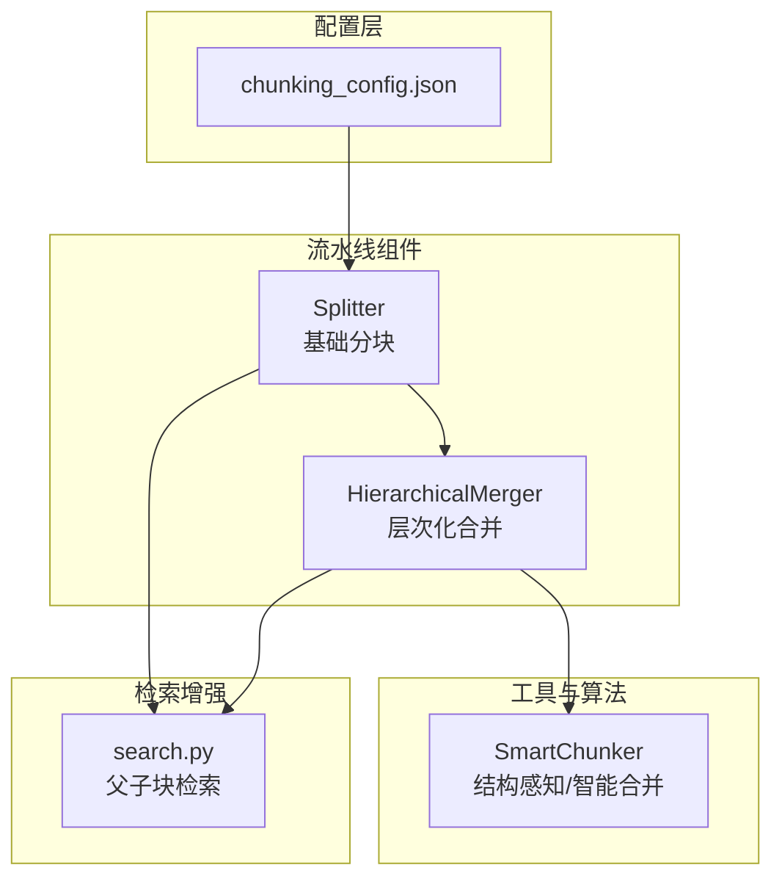
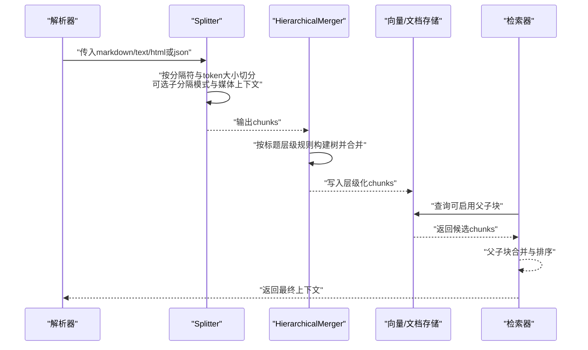
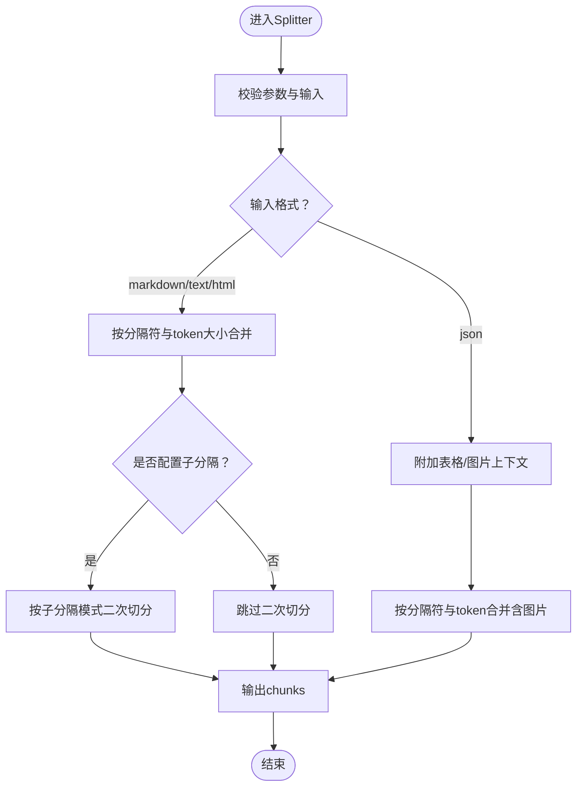
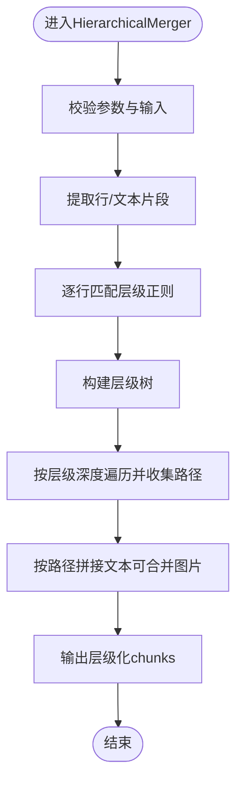
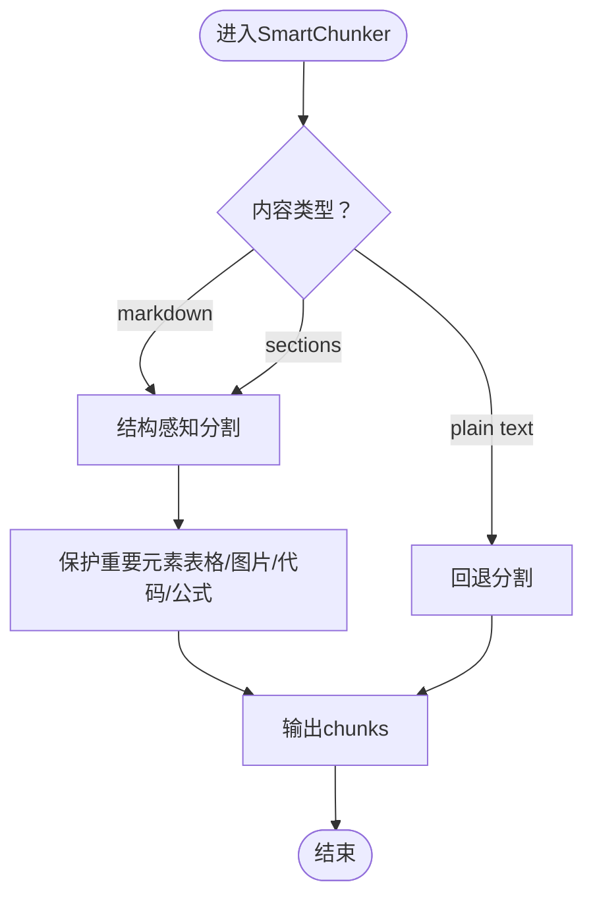
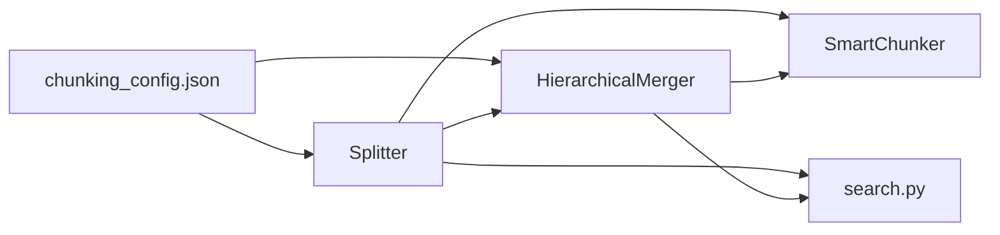

# 分块技术详解

<cite>
**本文引用的文件**
- [chunking_config.json](file://conf/chunking_config.json)
- [splitter.py](file://rag/flow/splitter/splitter.py)
- [schema.py（Splitter）](file://rag/flow/splitter/schema.py)
- [hierarchical_merger.py](file://rag/flow/hierarchical_merger/hierarchical_merger.py)
- [schema.py（HierarchicalMerger）](file://rag/flow/hierarchical_merger/schema.py)
- [base.py](file://rag/flow/base.py)
- [smart_chunker.py](file://rag/flow/utils/smart_chunker.py)
- [search.py](file://rag/nlp/search.py)
- [configure_child_chunking_strategy.md](file://docs/guides/dataset/configure_child_chunking_strategy.md)
- [hierarchical_merger.json](file://rag/flow/tests/dsl_examples/hierarchical_merger.json)
- [title_chunker.json](file://agent/templates/title_chunker.json)
- [index.tsx（Splitter表单）](file://web/src/pages/agent/form/splitter-form/index.tsx)
- [index.tsx（HierarchicalMerger表单）](file://web/src/pages/agent/form/hierarchical-merger-form/index.tsx)
</cite>

## 目录
1. [简介](#简介)
2. [项目结构](#项目结构)
3. [核心组件](#核心组件)
4. [架构总览](#架构总览)
5. [详细组件分析](#详细组件分析)
6. [依赖关系分析](#依赖关系分析)
7. [性能考量](#性能考量)
8. [故障排查指南](#故障排查指南)
9. [结论](#结论)
10. [附录](#附录)

## 简介
本文件围绕分块（chunking）在RAG系统中的关键作用展开，系统性阐述以下主题：
- 直接索引整篇文档的问题：检索精度下降、上下文长度限制、成本效率问题
- 分块策略类型：基于语义的分块、基于结构的分块、混合分块方法
- 层次化合并机制：如何通过标题层级与多级规则平衡信息完整性、检索粒度与计算效率
- 配置示例与参数调优：面向不同文档类型与业务场景的最佳实践
- 性能对比与实施建议

## 项目结构
本仓库中与分块相关的关键模块位于以下路径：
- 配置层：conf/chunking_config.json 提供全局分块策略与优化开关
- 流水线组件层：rag/flow/splitter 与 rag/flow/hierarchical_merger 实现基础分块与层次化合并
- 工具与算法层：rag/flow/utils/smart_chunker.py 提供结构感知与智能合并能力
- 检索与父子块策略：rag/nlp/search.py 支持父子块检索增强
- 前端表单与模板：web/src/pages/agent/form/* 与 agent/templates/* 提供可视化配置入口

图表来源
- [chunking_config.json:1-66](file://conf/chunking_config.json#L1-L66)
- [splitter.py:54-178](file://rag/flow/splitter/splitter.py#L54-L178)
- [hierarchical_merger.py:46-194](file://rag/flow/hierarchical_merger/hierarchical_merger.py#L46-L194)
- [smart_chunker.py:36-491](file://rag/flow/utils/smart_chunker.py#L36-L491)
- [search.py:932-947](file://rag/nlp/search.py#L932-L947)

章节来源
- [chunking_config.json:1-66](file://conf/chunking_config.json#L1-L66)
- [splitter.py:54-178](file://rag/flow/splitter/splitter.py#L54-L178)
- [hierarchical_merger.py:46-194](file://rag/flow/hierarchical_merger/hierarchical_merger.py#L46-L194)
- [smart_chunker.py:36-491](file://rag/flow/utils/smart_chunker.py#L36-L491)
- [search.py:932-947](file://rag/nlp/search.py#L932-L947)

## 核心组件
- Splitter（基础分块组件）
  - 输入：上游输出格式（json/markdown/text/html/chunks），以及分隔符、重叠比例等参数
  - 功能：按token与分隔符切分文本，支持自定义子分隔模式；对PDF JSON结果附加媒体上下文；可选图片位置与去标签处理
  - 输出：标准化chunks（含text、可选image、positions等）

- HierarchicalMerger（层次化合并组件）
  - 输入：同上，支持从markdown/text/html或chunks/json输入
  - 功能：根据正则规则识别标题层级，构建树形结构，按指定层级深度合并，形成多粒度chunk
  - 输出：按路径拼接的chunks，保持层级语义

- SmartChunker（智能分块工具）
  - 输入：文档内容（字符串或sections元组）、配置（chunk大小、重叠、分隔符、保护元素、策略）
  - 功能：结构感知分割、回退策略、带图片的智能分配、顺序分配备选
  - 输出：分块文本列表，可选图片对应列表

- 检索增强（父子块）
  - 在检索阶段对父子块进行合并与并行优化，提升召回与答案可靠性

章节来源
- [splitter.py:54-178](file://rag/flow/splitter/splitter.py#L54-L178)
- [schema.py（Splitter）:20-39](file://rag/flow/splitter/schema.py#L20-L39)
- [hierarchical_merger.py:46-194](file://rag/flow/hierarchical_merger/hierarchical_merger.py#L46-L194)
- [schema.py（HierarchicalMerger）:20-38](file://rag/flow/hierarchical_merger/schema.py#L20-L38)
- [smart_chunker.py:36-491](file://rag/flow/utils/smart_chunker.py#L36-L491)
- [search.py:932-947](file://rag/nlp/search.py#L932-L947)

## 架构总览
下图展示了从解析到分块再到层次化合并与检索的整体流程。

图表来源
- [splitter.py:57-178](file://rag/flow/splitter/splitter.py#L57-L178)
- [hierarchical_merger.py:49-194](file://rag/flow/hierarchical_merger/hierarchical_merger.py#L49-L194)
- [search.py:932-947](file://rag/nlp/search.py#L932-L947)

## 详细组件分析

### Splitter 组件
- 设计要点
  - 参数校验与默认值：分隔符、重叠比例、子分隔符、媒体上下文尺寸、最大chunk大小
  - 输入适配：markdown/text/html与json两种路径，分别走不同的合并与媒体处理逻辑
  - 自定义子分隔：支持在主分块后再次按自定义模式细分，保留父块引用
  - 媒体上下文：对JSON结果附加表格/图片上下文，便于后续检索定位
  - 异步图片处理：对生成的图片进行异步上传与ID转换

- 关键流程（基础分块）

图表来源
- [splitter.py:57-178](file://rag/flow/splitter/splitter.py#L57-L178)

章节来源
- [splitter.py:54-178](file://rag/flow/splitter/splitter.py#L54-L178)
- [schema.py（Splitter）:20-39](file://rag/flow/splitter/schema.py#L20-L39)
- [index.tsx（Splitter表单）:42-78](file://web/src/pages/agent/form/splitter-form/index.tsx#L42-L78)

### HierarchicalMerger 组件
- 设计要点
  - 层级规则：以正则表达式识别各级标题/结构标记，构建层级树
  - 合并策略：按指定层级深度进行路径合并，既可保留细粒度，也可向上聚合
  - 多格式支持：同时处理文本与JSON（含图片）两种上游格式
  - 媒体处理：在层级合并过程中合并图片，保证检索时的视觉上下文

- 关键流程（层次化合并）

图表来源
- [hierarchical_merger.py:49-194](file://rag/flow/hierarchical_merger/hierarchical_merger.py#L49-L194)

章节来源
- [hierarchical_merger.py:46-194](file://rag/flow/hierarchical_merger/hierarchical_merger.py#L46-L194)
- [schema.py（HierarchicalMerger）:20-38](file://rag/flow/hierarchical_merger/schema.py#L20-L38)
- [hierarchical_merger.json:58-84](file://rag/flow/tests/dsl_examples/hierarchical_merger.json#L58-L84)
- [title_chunker.json:260-292](file://agent/templates/title_chunker.json#L260-L292)
- [index.tsx（HierarchicalMerger表单）](file://web/src/pages/agent/form/hierarchical-merger-form/index.tsx)

### SmartChunker 工具
- 设计要点
  - 结构感知：优先使用文档结构（标题、列表、区块）进行智能分割
  - 回退策略：当结构解析失败时，回退到基于换行与标点的简单分割
  - 图片分配：提供语义重叠与顺序两种分配策略，自动将图片归属到最相关的chunk
  - 配置驱动：通过SmartChunkConfig统一管理分隔符、保护元素、策略等

- 关键流程（智能分割）

图表来源
- [smart_chunker.py:44-141](file://rag/flow/utils/smart_chunker.py#L44-L141)

章节来源
- [smart_chunker.py:36-491](file://rag/flow/utils/smart_chunker.py#L36-L491)

### 检索增强（父子块）
- 设计要点
  - 子父块关联：在检索阶段将子chunk与其父chunk合并，补充上下文
  - 并行优化：对多个租户/索引并行处理，减少延迟
  - 位置与向量：保留位置信息与向量字段，便于后续排序与高亮

章节来源
- [search.py:932-947](file://rag/nlp/search.py#L932-L947)
- [configure_child_chunking_strategy.md:20-36](file://docs/guides/dataset/configure_child_chunking_strategy.md#L20-L36)

## 依赖关系分析
- 组件耦合
  - Splitter 与 HierarchicalMerger 通过标准输出格式（chunks/json/markdown等）解耦
  - SmartChunker 可独立使用，亦可被Splitter/HierarchicalMerger复用
  - 检索器通过统一字段（如mom_id、positions、img_id）与父子块机制协作

- 外部依赖
  - 配置文件提供策略与性能参数，前端表单用于可视化配置
  - 存储与索引实现（如向量库）由检索器对接

图表来源
- [chunking_config.json:1-66](file://conf/chunking_config.json#L1-L66)
- [splitter.py:54-178](file://rag/flow/splitter/splitter.py#L54-L178)
- [hierarchical_merger.py:46-194](file://rag/flow/hierarchical_merger/hierarchical_merger.py#L46-L194)
- [smart_chunker.py:36-491](file://rag/flow/utils/smart_chunker.py#L36-L491)
- [search.py:932-947](file://rag/nlp/search.py#L932-L947)

章节来源
- [base.py:33-64](file://rag/flow/base.py#L33-L64)
- [splitter.py:54-178](file://rag/flow/splitter/splitter.py#L54-L178)
- [hierarchical_merger.py:46-194](file://rag/flow/hierarchical_merger/hierarchical_merger.py#L46-L194)

## 性能考量
- 计算复杂度
  - Splitter：主要受分隔符匹配与token统计影响，时间复杂度近似线性于文本长度
  - HierarchicalMerger：层级树构建与路径遍历，复杂度与行数与层级深度相关
  - SmartChunker：结构感知与图片分配涉及多次扫描与匹配，需控制分块数量与重叠

- 并发与资源
  - 组件执行带有超时控制与回调日志，避免长时间阻塞
  - 图片上传采用异步并发，提升吞吐

- 配置建议
  - 控制chunk_token_size与overlapped_percent，避免过度切分导致检索开销上升
  - 合理设置levels与hierarchy，使层级合并既能保留细节又能聚合上下文
  - 启用媒体上下文时，适当增大table/image_context_size，提升检索定位精度

章节来源
- [base.py:41-64](file://rag/flow/base.py#L41-L64)
- [splitter.py:148-158](file://rag/flow/splitter/splitter.py#L148-L158)
- [hierarchical_merger.py:179-190](file://rag/flow/hierarchical_merger/hierarchical_merger.py#L179-L190)

## 故障排查指南
- 常见问题
  - 输入格式错误：确认from_upstream的output_format与字段是否匹配
  - 参数越界：分隔符、重叠比例、token大小需满足组件校验要求
  - 图片处理异常：检查存储实现与异步任务状态，必要时重试或降级

- 排查步骤
  - 查看组件回调日志与_ERROR输出
  - 校验配置文件与前端表单参数
  - 在DSL示例与Agent模板中验证层级规则与分隔符设置

章节来源
- [splitter.py:57-62](file://rag/flow/splitter/splitter.py#L57-L62)
- [hierarchical_merger.py:49-54](file://rag/flow/hierarchical_merger/hierarchical_merger.py#L49-L54)
- [hierarchical_merger.json:58-84](file://rag/flow/tests/dsl_examples/hierarchical_merger.json#L58-L84)
- [title_chunker.json:260-292](file://agent/templates/title_chunker.json#L260-L292)

## 结论
分块是RAG系统的“地基”：它直接影响检索质量、上下文长度与成本效率。通过Splitter与HierarchicalMerger的组合，配合SmartChunker的结构感知与图片分配能力，可在不同文档类型与业务场景下取得更佳的检索与生成效果。建议在实践中以配置文件为依据，结合前端表单与DSL示例进行参数调优，并在检索阶段启用父子块策略以增强答案的完整性与可靠性。

## 附录

### 分块策略与配置示例
- 默认分割策略
  - 特征：基础文本长度分割，适合通用文档
  - 关键参数：chunk_size、chunk_overlap、separators、strategy为basic
  - 适用场景：快速入库、成本敏感

- 结构感知分割策略
  - 特征：保护表格、图片、代码块、数学公式等重要元素，支持最小/最大chunk约束
  - 关键参数：strategy为structure_aware，min_chunk_size、max_chunk_size
  - 适用场景：技术文档、报告类

- 语义分割策略
  - 特征：基于语义相似度的分割，适合长文档与需要语义连续性的内容
  - 关键参数：strategy为semantic，similarity_threshold
  - 适用场景：法律/合规/学术论文

- 智能优化与内容保护
  - 目标：控制chunk数量、保留图片/表格上下文、合并小chunk
  - 关键参数：target_chunk_count、use_smart_chunking、preserve_images、image_context_size、table_context_size、enable_parent_child、parent_chunk_size、child_chunk_size
  - 适用场景：大规模入库与检索优化

章节来源
- [chunking_config.json:1-66](file://conf/chunking_config.json#L1-L66)

### 参数调优指南（按场景）
- 技术文档（PDF/HTML）
  - 建议：开启结构感知策略，保护表格与代码块；适当增大table_context_size与image_context_size
  - Splitter：合理设置chunk_token_size与overlapped_percent；如有子结构，配置children_delimiters
  - HierarchicalMerger：设置levels为标题层级正则，hierarchy控制聚合粒度

- 法律/合规手册
  - 建议：启用父子块策略，确保条款在上下文中呈现；使用语义分割策略提升连续性
  - Splitter：降低overlapped_percent，避免冗余；SmartChunker：启用保护元素
  - 检索：开启retrieval_by_children，提升准确性

- 通用知识库
  - 建议：默认策略即可；关注chunk数量与存储成本，必要时启用智能优化

章节来源
- [configure_child_chunking_strategy.md:20-36](file://docs/guides/dataset/configure_child_chunking_strategy.md#L20-L36)
- [splitter.py:54-178](file://rag/flow/splitter/splitter.py#L54-L178)
- [hierarchical_merger.py:46-194](file://rag/flow/hierarchical_merger/hierarchical_merger.py#L46-L194)
- [smart_chunker.py:36-491](file://rag/flow/utils/smart_chunker.py#L36-L491)
- [chunking_config.json:1-66](file://conf/chunking_config.json#L1-L66)