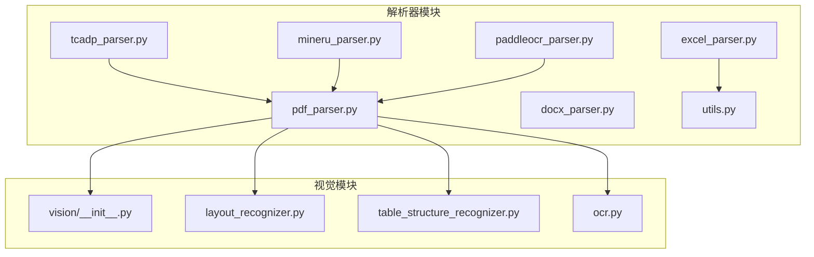
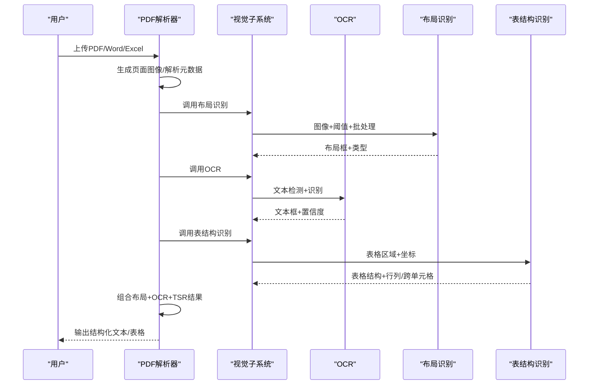
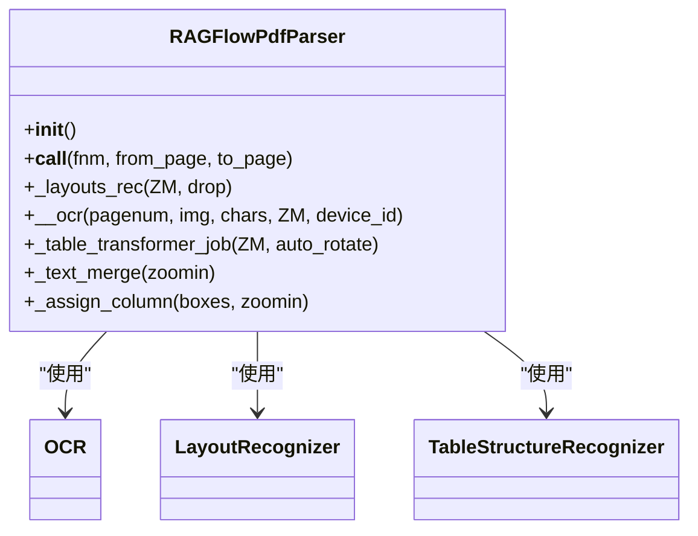
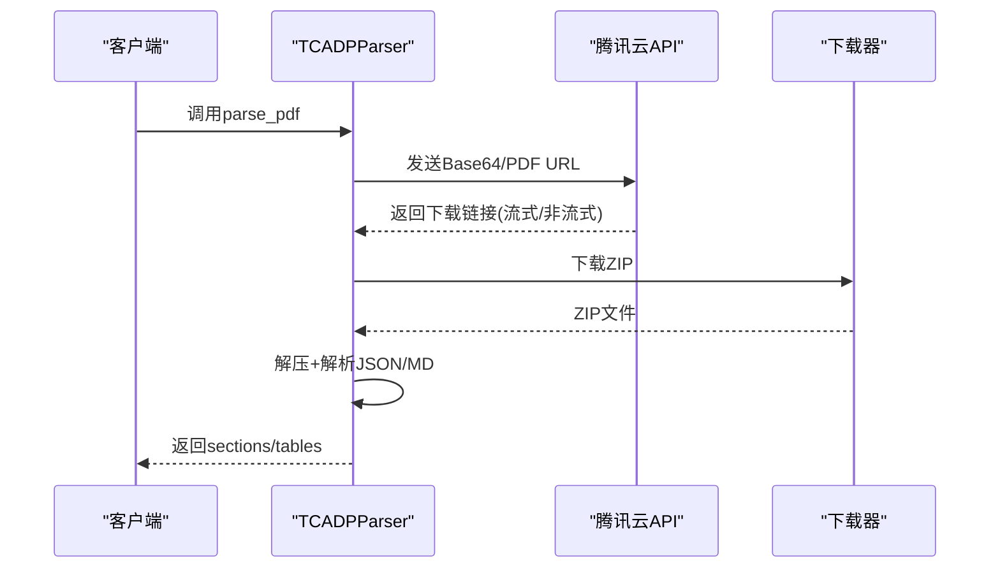
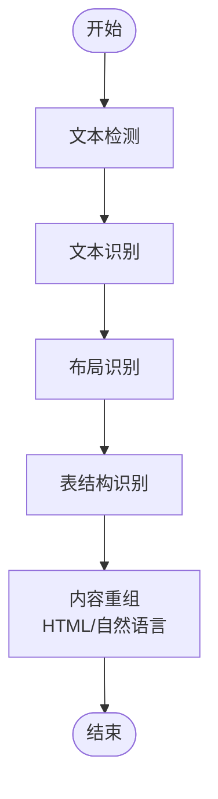
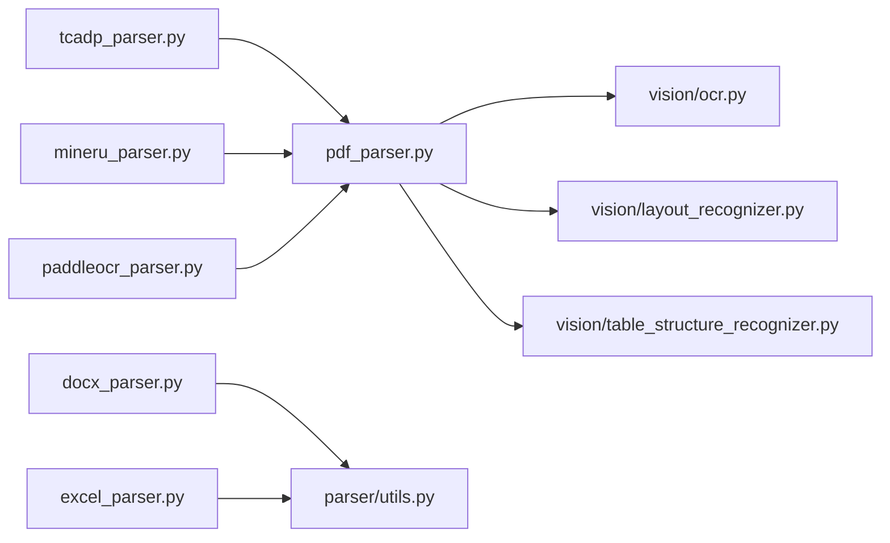

# 多模态数据处理

<cite>
**本文档引用的文件**
- [deepdoc/README.md](file://deepdoc/README.md)
- [deepdoc/README_zh.md](file://deepdoc/README_zh.md)
- [deepdoc/parser/__init__.py](file://deepdoc/parser/__init__.py)
- [deepdoc/parser/pdf_parser.py](file://deepdoc/parser/pdf_parser.py)
- [deepdoc/parser/docx_parser.py](file://deepdoc/parser/docx_parser.py)
- [deepdoc/parser/excel_parser.py](file://deepdoc/parser/excel_parser.py)
- [deepdoc/parser/utils.py](file://deepdoc/parser/utils.py)
- [deepdoc/parser/tcadp_parser.py](file://deepdoc/parser/tcadp_parser.py)
- [deepdoc/parser/mineru_parser.py](file://deepdoc/parser/mineru_parser.py)
- [deepdoc/parser/paddleocr_parser.py](file://deepdoc/parser/paddleocr_parser.py)
- [deepdoc/vision/__init__.py](file://deepdoc/vision/__init__.py)
- [deepdoc/vision/layout_recognizer.py](file://deepdoc/vision/layout_recognizer.py)
- [deepdoc/vision/table_structure_recognizer.py](file://deepdoc/vision/table_structure_recognizer.py)
- [deepdoc/vision/ocr.py](file://deepdoc/vision/ocr.py)
</cite>

## 目录
1. [引言](#引言)
2. [项目结构](#项目结构)
3. [核心组件](#核心组件)
4. [架构总览](#架构总览)
5. [详细组件分析](#详细组件分析)
6. [依赖关系分析](#依赖关系分析)
7. [性能考虑](#性能考虑)
8. [故障排查指南](#故障排查指南)
9. [结论](#结论)
10. [附录](#附录)

## 引言
本技术文档围绕多模态文档处理展开，聚焦文本、图像、表格、公式等异构信息的统一抽取与结构化表达。项目通过“视觉理解 + 专用解析模型”的双轮驱动，将多模态输入转化为高质量的单模态文本，支撑企业文档管理、合同分析、学术研究等场景。文档重点覆盖：
- 多模态挑战与信息损失控制
- 视觉语言模型与专用解析模型的应用
- 布局识别、OCR、表格结构识别等关键技术
- PDF、Word、Excel 等常见格式处理流程
- 性能优化、错误处理与质量评估

## 项目结构
本项目采用分层组织：顶层为 API 与服务入口，核心能力集中在 deepdoc 的 parser 与 vision 子模块。parser 负责各类文档格式的专用解析，vision 负责视觉层面的布局、OCR、表格结构识别。

**图示来源**
- [deepdoc/parser/pdf_parser.py:56-110](file://deepdoc/parser/pdf_parser.py#L56-L110)
- [deepdoc/vision/__init__.py:20-30](file://deepdoc/vision/__init__.py#L20-L30)

**章节来源**
- [deepdoc/README.md:1-147](file://deepdoc/README.md#L1-L147)
- [deepdoc/README_zh.md:1-141](file://deepdoc/README_zh.md#L1-L141)

## 核心组件
- 视觉理解子系统
  - OCR：文本检测与识别，支持批量与设备级并行
  - 布局识别：10类基础版面元素（文本、标题、图、图注、表、表注、页眉、页脚、参考文献、公式）
  - 表结构识别：列/行/列头/投影行头/跨单元格等标签，支持表格自动旋转优化
- 专用解析子系统
  - PDF 解析：布局融合 + OCR + 表结构识别 + 自动旋转优化
  - Word 解析：段落与表格抽取，含内容清洗与过滤
  - Excel 解析：多工作表、HTML/Markdown 导出、图片提取
  - 云厂商解析：TCADP（腾讯云）、MinerU（多后端）、PaddleOCR-VL（远程 API）

**章节来源**
- [deepdoc/vision/ocr.py:542-758](file://deepdoc/vision/ocr.py#L542-L758)
- [deepdoc/vision/layout_recognizer.py:33-158](file://deepdoc/vision/layout_recognizer.py#L33-L158)
- [deepdoc/vision/table_structure_recognizer.py:30-111](file://deepdoc/vision/table_structure_recognizer.py#L30-L111)
- [deepdoc/parser/pdf_parser.py:56-110](file://deepdoc/parser/pdf_parser.py#L56-L110)
- [deepdoc/parser/docx_parser.py:27-168](file://deepdoc/parser/docx_parser.py#L27-L168)
- [deepdoc/parser/excel_parser.py:30-436](file://deepdoc/parser/excel_parser.py#L30-L436)
- [deepdoc/parser/tcadp_parser.py:231-779](file://deepdoc/parser/tcadp_parser.py#L231-L779)
- [deepdoc/parser/mineru_parser.py:353-800](file://deepdoc/parser/mineru_parser.py#L353-L800)
- [deepdoc/parser/paddleocr_parser.py:150-561](file://deepdoc/parser/paddleocr_parser.py#L150-L561)

## 架构总览
整体处理链路：输入文档 → 页面级图像生成 → 布局识别 → OCR → 表结构识别 → 内容重组 → 输出结构化文本/表格。

**图示来源**
- [deepdoc/parser/pdf_parser.py:56-110](file://deepdoc/parser/pdf_parser.py#L56-L110)
- [deepdoc/vision/layout_recognizer.py:63-158](file://deepdoc/vision/layout_recognizer.py#L63-L158)
- [deepdoc/vision/ocr.py:714-758](file://deepdoc/vision/ocr.py#L714-L758)
- [deepdoc/vision/table_structure_recognizer.py:54-111](file://deepdoc/vision/table_structure_recognizer.py#L54-L111)

## 详细组件分析

### PDF 解析器（RAGFlowPdfParser）
- 关键能力
  - 布局识别：将 OCR 文本框标注为布局类型（文本/标题/图/表/公式等）
  - 表结构识别：TSR 输出结构化表格，支持 HTML/自然语言描述
  - 表格自动旋转：基于 OCR 置信度评估最佳旋转角，显著提升识别精度
  - 文本合并与列数判定：基于 KMeans 与轮廓聚类，提升长文本连贯性
- 性能特性
  - 多设备并行：PARALLEL_DEVICES 控制并发
  - 模型缓存：ONNX/CUDA/Ascend 多后端适配
- 输出形态
  - 文本块（含页号与矩形坐标）
  - 表格（裁剪图 + 自然语言描述）
  - 图与公式（含图注）

**图示来源**
- [deepdoc/parser/pdf_parser.py:56-110](file://deepdoc/parser/pdf_parser.py#L56-L110)
- [deepdoc/vision/ocr.py:542-758](file://deepdoc/vision/ocr.py#L542-L758)
- [deepdoc/vision/layout_recognizer.py:33-158](file://deepdoc/vision/layout_recognizer.py#L33-L158)
- [deepdoc/vision/table_structure_recognizer.py:30-111](file://deepdoc/vision/table_structure_recognizer.py#L30-L111)

**章节来源**
- [deepdoc/parser/pdf_parser.py:56-800](file://deepdoc/parser/pdf_parser.py#L56-L800)

### Word 解析器（RAGFlowDocxParser）
- 功能要点
  - 段落与表格抽取：逐段落读取，过滤空白与噪声
  - 表格内容合成：基于正则与词性标注，识别日期、数值、文本等类型，生成自然语言行
  - 噪音过滤：基于“垃圾内容”规则与文本质量评估
- 输出形态
  - 文本段落列表（含样式）
  - 表格行/块（自然语言化）

**章节来源**
- [deepdoc/parser/docx_parser.py:27-168](file://deepdoc/parser/docx_parser.py#L27-L168)

### Excel 解析器（RAGFlowExcelParser）
- 功能要点
  - 多引擎兼容：openpyxl/pandas/calamine，自动降级与回退
  - 流式解析：大文件采用只读流式读取，降低内存占用
  - HTML/Markdown 导出：按表头生成 HTML 表格，或转为 Markdown
  - 图片提取：从工作表锚点提取嵌入图片，限制尺寸与清理非法字符
- 输出形态
  - 文本行（字段名：值）
  - HTML 表格片段
  - Markdown 表格
  - 图片（可选）

**章节来源**
- [deepdoc/parser/excel_parser.py:30-436](file://deepdoc/parser/excel_parser.py#L30-L436)

### 云厂商解析器
- TCADP（腾讯云）
  - 通过官方 SDK 发起流式/非流式解析请求，下载 ZIP 结果并解析
  - 支持配置参数（如表格结果类型、图片响应类型）与本地缓存
- MinerU
  - 支持多种后端（传统流水线、VLM Transformers、vLLM、HTTP 客户端等）
  - 支持 OSS 上传与直链/预签名 URL
- PaddleOCR-VL
  - 远程 API 调用，返回布局解析结果，支持裁剪与可视化

**图示来源**
- [deepdoc/parser/tcadp_parser.py:68-164](file://deepdoc/parser/tcadp_parser.py#L68-L164)
- [deepdoc/parser/tcadp_parser.py:166-229](file://deepdoc/parser/tcadp_parser.py#L166-L229)
- [deepdoc/parser/tcadp_parser.py:313-438](file://deepdoc/parser/tcadp_parser.py#L313-L438)

**章节来源**
- [deepdoc/parser/tcadp_parser.py:231-779](file://deepdoc/parser/tcadp_parser.py#L231-L779)
- [deepdoc/parser/mineru_parser.py:353-800](file://deepdoc/parser/mineru_parser.py#L353-L800)
- [deepdoc/parser/paddleocr_parser.py:150-561](file://deepdoc/parser/paddleocr_parser.py#L150-L561)

### 视觉子系统
- OCR
  - 文本检测（DB）+ 文本识别（CTC/其它）
  - 批量推理、GPU/CPU 自适应、内存回收
- 布局识别
  - ONNX/Ascend 双后端，支持 NMS 后处理与布局清理
- 表结构识别
  - 行/列/列头/投影行头/跨单元格五标签，支持 HTML/自然语言重建

**图示来源**
- [deepdoc/vision/ocr.py:420-540](file://deepdoc/vision/ocr.py#L420-L540)
- [deepdoc/vision/layout_recognizer.py:63-158](file://deepdoc/vision/layout_recognizer.py#L63-L158)
- [deepdoc/vision/table_structure_recognizer.py:54-111](file://deepdoc/vision/table_structure_recognizer.py#L54-L111)

**章节来源**
- [deepdoc/vision/ocr.py:542-758](file://deepdoc/vision/ocr.py#L542-L758)
- [deepdoc/vision/layout_recognizer.py:33-458](file://deepdoc/vision/layout_recognizer.py#L33-L458)
- [deepdoc/vision/table_structure_recognizer.py:30-613](file://deepdoc/vision/table_structure_recognizer.py#L30-L613)

## 依赖关系分析
- 模块耦合
  - PDF 解析器强依赖视觉子系统（OCR、布局识别、TSR）
  - Word/Excel 解析器相对独立，仅依赖通用工具与文本质量评估
  - 云厂商解析器通过 HTTP/SDK 与外部服务交互
- 外部依赖
  - ONNXRuntime（OCR/布局/TSR）
  - pdfplumber（PDF页面图像生成）
  - openpyxl/pandas（Excel解析）
  - requests（云厂商 API）
  - HuggingFace Hub（模型下载）

**图示来源**
- [deepdoc/parser/pdf_parser.py:40-45](file://deepdoc/parser/pdf_parser.py#L40-L45)
- [deepdoc/parser/docx_parser.py:17-25](file://deepdoc/parser/docx_parser.py#L17-L25)
- [deepdoc/parser/excel_parser.py:14-25](file://deepdoc/parser/excel_parser.py#L14-L25)
- [deepdoc/parser/tcadp_parser.py:39-42](file://deepdoc/parser/tcadp_parser.py#L39-L42)
- [deepdoc/parser/mineru_parser.py:39-40](file://deepdoc/parser/mineru_parser.py#L39-L40)
- [deepdoc/parser/paddleocr_parser.py:32-38](file://deepdoc/parser/paddleocr_parser.py#L32-L38)

**章节来源**
- [deepdoc/parser/__init__.py:17-41](file://deepdoc/parser/__init__.py#L17-L41)

## 性能考虑
- 并行与资源
  - 多设备并行：PARALLEL_DEVICES 控制并发，避免 GPU/CPU 过载
  - OCR 线程控制：intra/inter-op 线程数与 GPU 内存上限可调
- 模型与算子
  - ONNX/CUDA/Ascend 多后端，按硬件能力自动选择
  - 布局识别与 TSR 使用 NMS 后处理，减少冗余框
- I/O 与内存
  - Excel 大文件采用只读流式读取
  - PDF 页面图像生成按需缩放，TSR 前裁剪表格区域
- 表格自动旋转
  - 评估 0/90/180/270 四角度 OCR 置信度，选择最优旋转，显著提升识别率

**章节来源**
- [deepdoc/parser/pdf_parser.py:70-110](file://deepdoc/parser/pdf_parser.py#L70-L110)
- [deepdoc/vision/ocr.py:71-136](file://deepdoc/vision/ocr.py#L71-L136)
- [deepdoc/parser/excel_parser.py:343-375](file://deepdoc/parser/excel_parser.py#L343-L375)
- [deepdoc/parser/pdf_parser.py:201-290](file://deepdoc/parser/pdf_parser.py#L201-L290)

## 故障排查指南
- 模型下载失败
  - 设置 HuggingFace 镜像源或使用本地缓存目录
- OCR 推理异常
  - 检查 GPU/CPU Provider 配置与内存上限
  - 开启内存回收选项，避免显存碎片
- 布局/TSR 误检
  - 调整置信度阈值与 NMS 参数
  - 清理垃圾布局（页眉/页脚/参考文献）以减少干扰
- Excel 解析异常
  - 优先尝试 openpyxl，失败后回退 pandas/calamine
  - 对 CSV/CSV-like 文件进行编码探测与清洗
- 云厂商解析
  - 校验 API URL、Token、Region 配置
  - 检查网络可达性与超时设置

**章节来源**
- [deepdoc/README.md:40-44](file://deepdoc/README.md#L40-L44)
- [deepdoc/README_zh.md:41-45](file://deepdoc/README_zh.md#L41-L45)
- [deepdoc/vision/ocr.py:100-136](file://deepdoc/vision/ocr.py#L100-L136)
- [deepdoc/parser/excel_parser.py:32-68](file://deepdoc/parser/excel_parser.py#L32-L68)
- [deepdoc/parser/tcadp_parser.py:285-300](file://deepdoc/parser/tcadp_parser.py#L285-L300)

## 结论
本项目通过“视觉理解 + 专用解析”的协同，实现了对多模态文档的高保真单模态文本转换。PDF 解析器在布局识别、OCR、TSR 与表格自动旋转方面形成闭环；Word/Excel 解析器针对各自格式特性提供稳健的抽取与导出；云厂商解析器扩展了远端能力与多后端选择。结合性能优化与错误处理策略，可在企业文档管理、合同分析与学术研究等场景中稳定落地。

## 附录
- 常见格式处理建议
  - PDF：优先使用内置解析器；若需更强视觉理解，启用表格自动旋转与布局融合
  - Word：关注表格头部识别与噪音过滤
  - Excel：大表优先流式解析，必要时导出 HTML/Markdown
- 应用场景
  - 企业文档管理：结构化索引与检索
  - 合同分析：条款抽取与对比
  - 学术研究：论文与图表的结构化复现