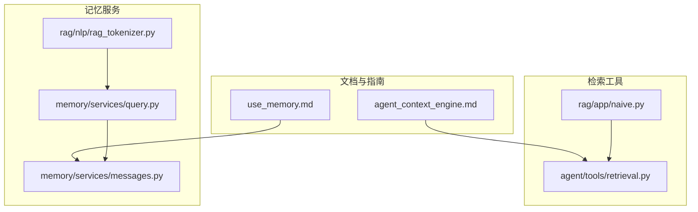
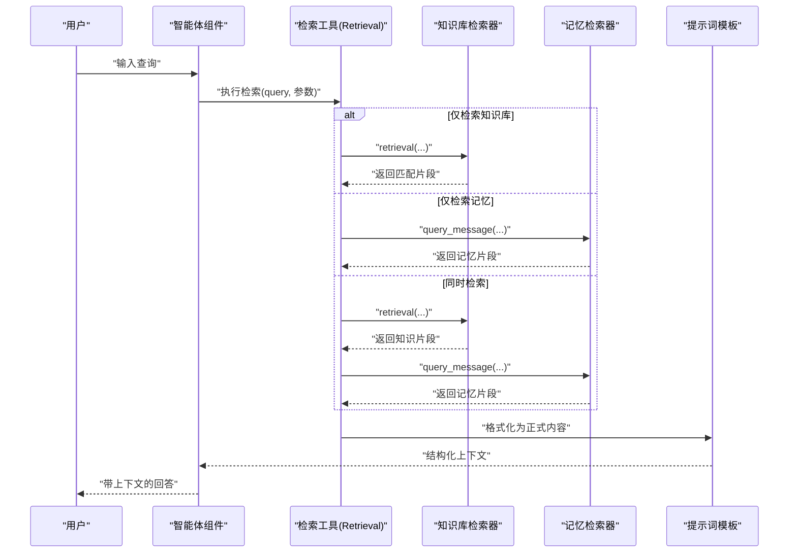
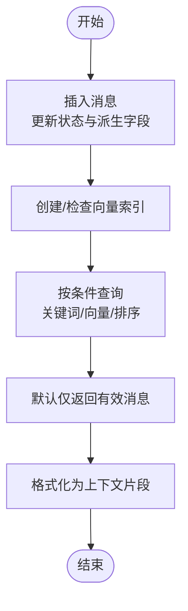
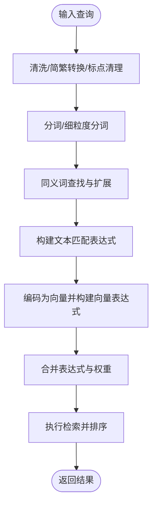
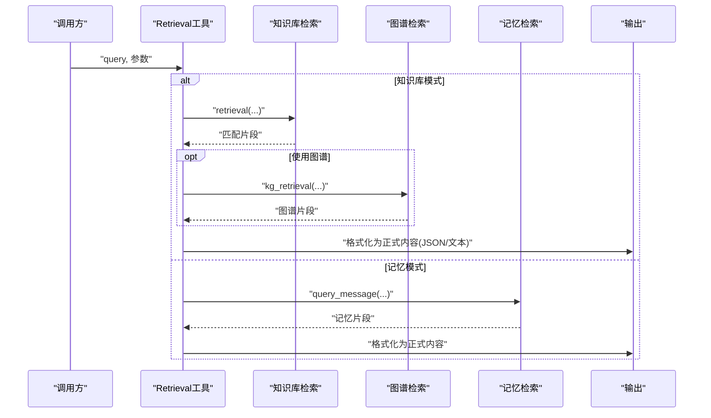
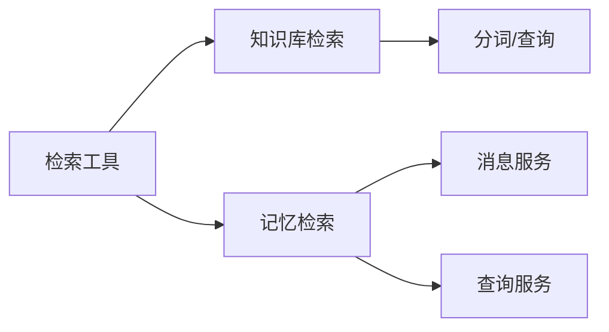

# 智能体上下文引擎

<cite>
**本文引用的文件**
- [agent_context_engine.md](file://docs/basics/agent_context_engine.md)
- [use_memory.md](file://docs/guides/memory/use_memory.md)
- [messages.py](file://memory/services/messages.py)
- [query.py](file://memory/services/query.py)
- [rag_tokenizer.py](file://rag/nlp/rag_tokenizer.py)
- [retrieval.py](file://agent/tools/retrieval.py)
- [naive.py](file://rag/app/naive.py)
- [README_zh.md](file://README_zh.md)
</cite>

## 目录
1. [引言](#引言)
2. [项目结构](#项目结构)
3. [核心组件](#核心组件)
4. [架构总览](#架构总览)
5. [详细组件分析](#详细组件分析)
6. [依赖关系分析](#依赖关系分析)
7. [性能考量](#性能考量)
8. [故障排查指南](#故障排查指南)
9. [结论](#结论)
10. [附录](#附录)

## 引言
本文件面向“智能体上下文引擎”的技术文档，系统阐述其设计理念、核心能力与工程实现，重点说明如何为大语言模型（LLM）与智能体（Agent）在推理时刻提供高质量、动态且可配置的上下文。文档围绕三大支柱能力展开：知识核心（高级RAG）、记忆层（动态交互记忆）、工具编排（基于MCP的工具检索）。同时，结合仓库中现有的记忆模块与检索工具，给出上下文组装流程、数据结构与处理逻辑，并提供性能优化与最佳实践建议。

## 项目结构
围绕“智能体上下文引擎”，本仓库的关键实现分布在以下区域：
- 文档与概念：docs/basics/agent_context_engine.md、docs/guides/memory/use_memory.md
- 记忆服务：memory/services/messages.py、memory/services/query.py
- 检索工具：agent/tools/retrieval.py
- 分词与查询：rag/nlp/rag_tokenizer.py
- 文档解析与分块：rag/app/naive.py
- 顶层介绍：README_zh.md

**图表来源**
- [agent_context_engine.md:26-34](file://docs/basics/agent_context_engine.md#L26-L34)
- [use_memory.md:11-15](file://docs/guides/memory/use_memory.md#L11-L15)
- [messages.py:27-295](file://memory/services/messages.py#L27-L295)
- [query.py:43-185](file://memory/services/query.py#L43-L185)
- [rag_tokenizer.py:21-59](file://rag/nlp/rag_tokenizer.py#L21-L59)
- [retrieval.py:84-306](file://agent/tools/retrieval.py#L84-L306)
- [naive.py:743-800](file://rag/app/naive.py#L743-L800)

**章节来源**
- [agent_context_engine.md:26-34](file://docs/basics/agent_context_engine.md#L26-L34)
- [use_memory.md:11-15](file://docs/guides/memory/use_memory.md#L11-L15)
- [messages.py:27-295](file://memory/services/messages.py#L27-L295)
- [query.py:43-185](file://memory/services/query.py#L43-L185)
- [rag_tokenizer.py:21-59](file://rag/nlp/rag_tokenizer.py#L21-L59)
- [retrieval.py:84-306](file://agent/tools/retrieval.py#L84-L306)
- [naive.py:743-800](file://rag/app/naive.py#L743-L800)

## 核心组件
- 知识核心（高级RAG）
  - 基于多格式文档解析与分块策略，结合嵌入与重排序，完成对静态私有知识的检索与组装。
  - 支持目录增强、子节点扩展、图谱检索等能力，用于缩小语义鸿沟并提升召回质量。
- 记忆层
  - 面向动态交互记忆的检索系统，支持原始对话、语义记忆、情节记忆与程序性记忆的分类存储与检索。
  - 提供消息插入、查询、最近消息获取、容量管理与遗忘策略等能力。
- 工具编排（工具检索）
  - 基于MCP连接内部服务作为工具，通过工具索引与“最佳实践”索引进行任务驱动的工具选择，避免将全部工具描述塞入提示词。

上述三者统一在一个服务层中协同工作，形成“端到端”的上下文组装平台，使上下文工程从“手工艺术”走向“工业级科学”。

**章节来源**
- [agent_context_engine.md:26-34](file://docs/basics/agent_context_engine.md#L26-L34)
- [use_memory.md:11-15](file://docs/guides/memory/use_memory.md#L11-L15)
- [retrieval.py:84-306](file://agent/tools/retrieval.py#L84-L306)

## 架构总览
下图展示了智能体上下文引擎在推理阶段的典型调用链路：检索工具根据用户输入与参数，分别从知识库与记忆中抽取相关内容，并通过提示词模板进行结构化输出，最终注入到智能体的上下文中。

**图表来源**
- [retrieval.py:84-306](file://agent/tools/retrieval.py#L84-L306)
- [messages.py:150-178](file://memory/services/messages.py#L150-L178)
- [query.py:43-185](file://memory/services/query.py#L43-L185)

**章节来源**
- [retrieval.py:84-306](file://agent/tools/retrieval.py#L84-L306)

## 详细组件分析

### 组件一：记忆服务（消息检索与管理）
- 功能职责
  - 索引管理：按租户与记忆ID创建/删除向量索引。
  - 消息写入：插入原始对话消息，自动标注状态与派生字段。
  - 查询检索：支持按条件过滤、关键词匹配表达式、时间排序与分页。
  - 最近消息：按会话与智能体ID获取最近N条消息。
  - 容量与遗忘：计算内存占用、按FIFO策略删除被标记遗忘的消息或最早消息。
  - 字段缺失检测：定位缺少特定字段的消息以便补全。
- 数据结构与复杂度
  - 消息记录包含消息ID、类型、来源ID、用户/智能体/会话标识、有效/失效/遗忘时间戳、状态与内容等字段。
  - 检索采用向量相似度与文本匹配表达式组合，复杂度取决于索引大小与TopK。
- 关键流程
  - 插入消息后，系统会将“提取”关联的消息进行聚合，便于后续上下文拼接。
  - 查询时默认仅返回有效消息，支持传入匹配表达式进行精确检索。
  - 内存达到阈值时，优先删除被手动标记遗忘的消息，再按最早消息删除。

**图表来源**
- [messages.py:45-118](file://memory/services/messages.py#L45-L118)
- [messages.py:150-178](file://memory/services/messages.py#L150-L178)

**章节来源**
- [messages.py:27-295](file://memory/services/messages.py#L27-L295)

### 组件二：记忆检索查询（文本与向量混合）
- 功能职责
  - 将自然语言查询转换为文本匹配表达式与稠密向量表达式，结合权重与相似度阈值进行混合检索。
  - 中英文混合分词、同义词扩展、短语匹配与细粒度分词，提升召回质量。
- 复杂度与优化
  - 文本匹配表达式构造与同义词扩展可能带来额外开销，建议在高频场景下缓存常用查询与同义词映射。
  - 向量维度与相似度阈值直接影响召回数量与延迟，需结合业务调优。

**图表来源**
- [query.py:52-185](file://memory/services/query.py#L52-L185)
- [rag_tokenizer.py:21-59](file://rag/nlp/rag_tokenizer.py#L21-L59)

**章节来源**
- [query.py:26-185](file://memory/services/query.py#L26-L185)
- [rag_tokenizer.py:21-59](file://rag/nlp/rag_tokenizer.py#L21-L59)

### 组件三：检索工具（知识库与记忆的统一入口）
- 功能职责
  - 支持从知识库检索与从记忆检索两种模式，或同时启用。
  - 在知识库检索中，支持元数据过滤、跨语言扩展、目录增强、子节点扩展与图谱检索。
  - 在记忆检索中，调用消息服务进行查询并格式化为正式内容。
- 控制流
  - 解析参数（相似度阈值、TopN、TopK、是否使用知识图谱等）。
  - 根据输入变量替换与格式化，执行检索并进行后处理（去除冗余字段、聚合引用）。
  - 输出结构化JSON与“正式化内容”，供智能体消费。

**图表来源**
- [retrieval.py:84-306](file://agent/tools/retrieval.py#L84-L306)

**章节来源**
- [retrieval.py:84-306](file://agent/tools/retrieval.py#L84-L306)

### 组件四：文档解析与分块（知识核心的前置能力）
- 功能职责
  - 支持多种文档格式解析（PDF、DOCX、Markdown等），并结合布局识别、表格与图片处理，生成结构化文本块。
  - 提供“朴素分块”策略，按分隔符与最大token数进行合并，保证上下文连贯性。
- 与上下文引擎的关系
  - 该模块是知识核心的“摄取管道”之一，负责将非结构化数据转化为可检索的文本块，为检索工具提供高质量输入。

**章节来源**
- [naive.py:743-800](file://rag/app/naive.py#L743-L800)

## 依赖关系分析
- 上下文引擎的三大支柱之间存在清晰的边界与协作关系：
  - 知识核心依赖检索器与提示词模板，输出结构化知识片段。
  - 记忆层独立于知识核心，但共享相似的检索接口与提示词格式化能力。
  - 工具编排通过检索工具统一接入知识与记忆，形成“检索即上下文”的闭环。
- 组件耦合与内聚
  - 检索工具对知识库与记忆的访问保持解耦，通过参数切换模式，提高复用性。
  - 记忆服务内部通过消息聚合与索引管理实现高内聚的数据组织。

**图表来源**
- [retrieval.py:84-306](file://agent/tools/retrieval.py#L84-L306)
- [messages.py:27-295](file://memory/services/messages.py#L27-L295)
- [query.py:43-185](file://memory/services/query.py#L43-L185)
- [rag_tokenizer.py:21-59](file://rag/nlp/rag_tokenizer.py#L21-L59)

**章节来源**
- [retrieval.py:84-306](file://agent/tools/retrieval.py#L84-L306)
- [messages.py:27-295](file://memory/services/messages.py#L27-L295)
- [query.py:43-185](file://memory/services/query.py#L43-L185)
- [rag_tokenizer.py:21-59](file://rag/nlp/rag_tokenizer.py#L21-L59)

## 性能考量
- 检索性能
  - 向量检索与文本匹配的组合会增加计算与I/O开销，建议：
    - 对高频查询进行缓存（如查询表达式与同义词映射）。
    - 合理设置TopK与相似度阈值，避免过度召回。
    - 使用索引分片与并行查询提升吞吐。
- 记忆层容量管理
  - 建议开启自动遗忘策略，并优先删除被手动标记遗忘的消息，减少无效数据对检索的影响。
  - 定期评估消息大小与嵌入维度，控制单条消息的内存占用。
- 文档解析与分块
  - 在大规模文档场景下，建议采用增量解析与分块策略，避免一次性加载导致内存压力。
  - 结合布局识别与表格/图片处理的成本，按需启用视觉识别能力。

[本节为通用性能建议，不直接分析具体文件]

## 故障排查指南
- 记忆检索无结果
  - 检查消息状态是否为有效，确认检索条件与相似度阈值设置。
  - 使用“字段缺失检测”定位未完成嵌入或缺少必要字段的消息。
- 记忆容量不足
  - 查看当前容量统计，触发自动遗忘策略，优先删除被标记遗忘的消息。
  - 调整记忆类型与容量上限，平衡存储成本与召回质量。
- 检索超时
  - 检查检索工具的超时配置，适当增大超时时间或降低TopK。
  - 优化查询表达式与同义词扩展范围，减少不必要的匹配开销。
- 知识库检索异常
  - 确认知识库与嵌入模型一致，检查元数据过滤与跨语言扩展配置。
  - 若启用图谱检索，确保图谱检索器可用并正确配置。

**章节来源**
- [messages.py:184-248](file://memory/services/messages.py#L184-L248)
- [query.py:26-41](file://memory/services/query.py#L26-L41)
- [retrieval.py:277-299](file://agent/tools/retrieval.py#L277-L299)

## 结论
智能体上下文引擎以“知识核心+记忆层+工具编排”三位一体的方式，将上下文工程从手工装配升级为自动化、可配置、可观测的平台能力。通过检索工具对知识库与记忆的统一接入，结合结构化的提示词模板与容量管理策略，能够稳定支撑复杂对话、多轮交互与决策支持场景。未来可在索引优化、缓存策略与增量摄取等方面持续演进，进一步提升实时性与可扩展性。

[本节为总结性内容，不直接分析具体文件]

## 附录
- 术语说明
  - 上下文：在推理时刻提供给LLM或Agent的信息集合，决定回答的质量与一致性。
  - 记忆层：面向动态交互的记忆检索系统，强调时序与个性化。
  - 工具检索：基于工具索引与最佳实践索引的任务驱动工具选择。
- 参考资料
  - 顶层介绍与愿景：[README_zh.md:74-74](file://README_zh.md#L74-L74)
  - 上下文引擎概念：[agent_context_engine.md:26-34](file://docs/basics/agent_context_engine.md#L26-L34)
  - 记忆模块使用指南：[use_memory.md:11-15](file://docs/guides/memory/use_memory.md#L11-L15)