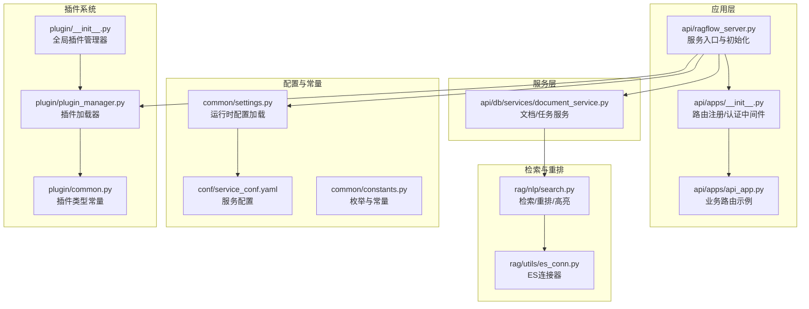
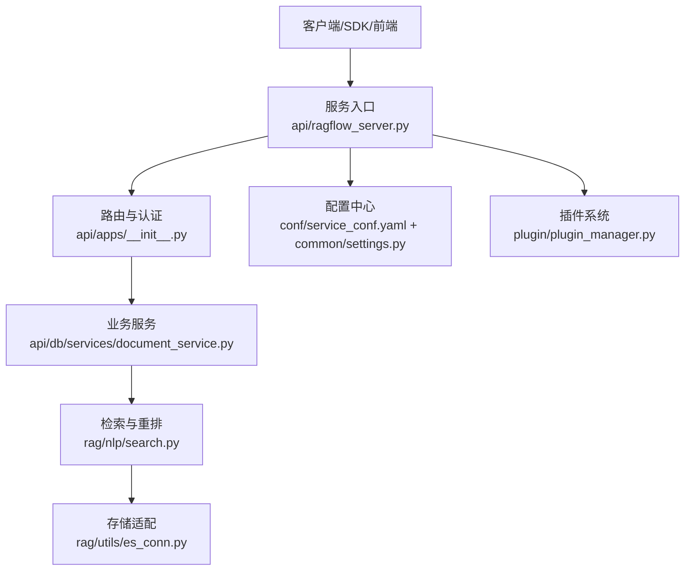
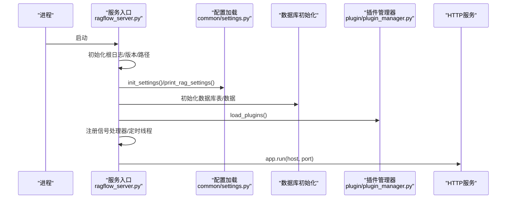
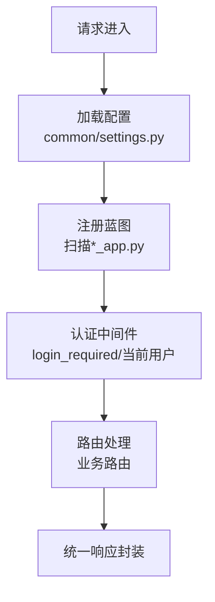
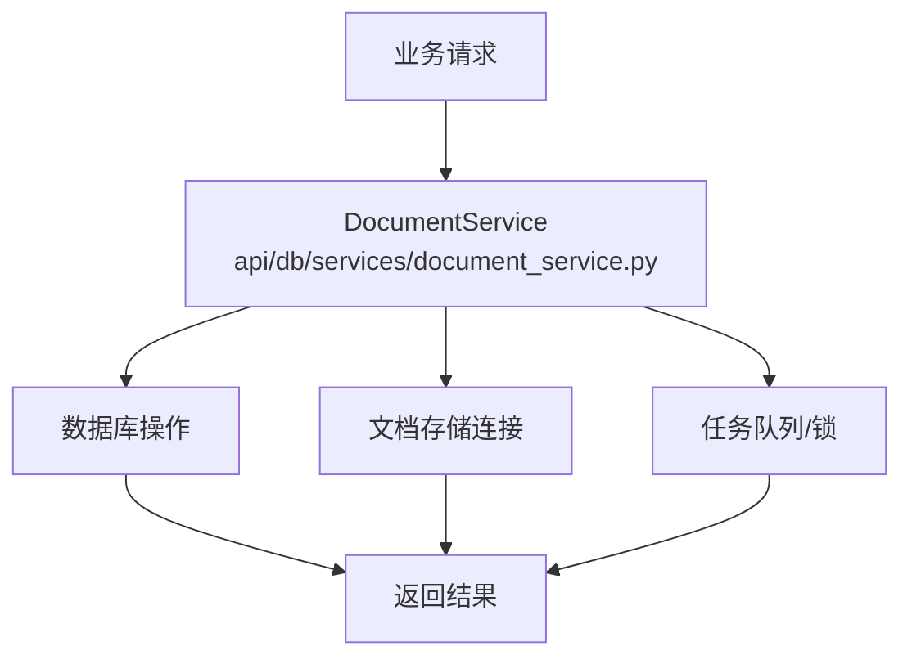
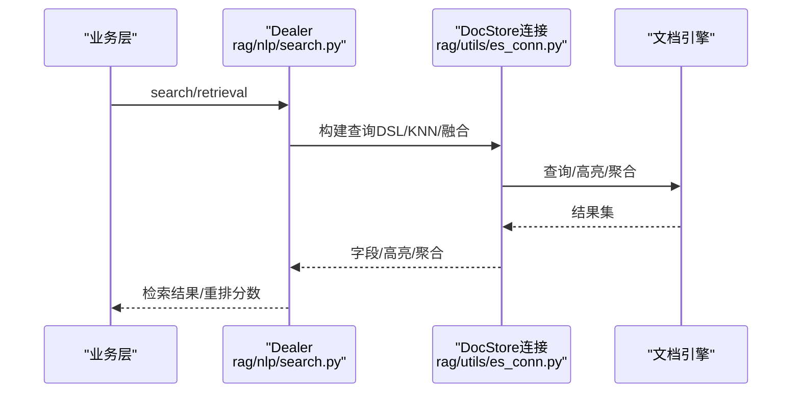
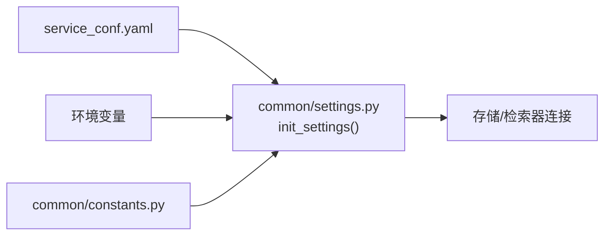
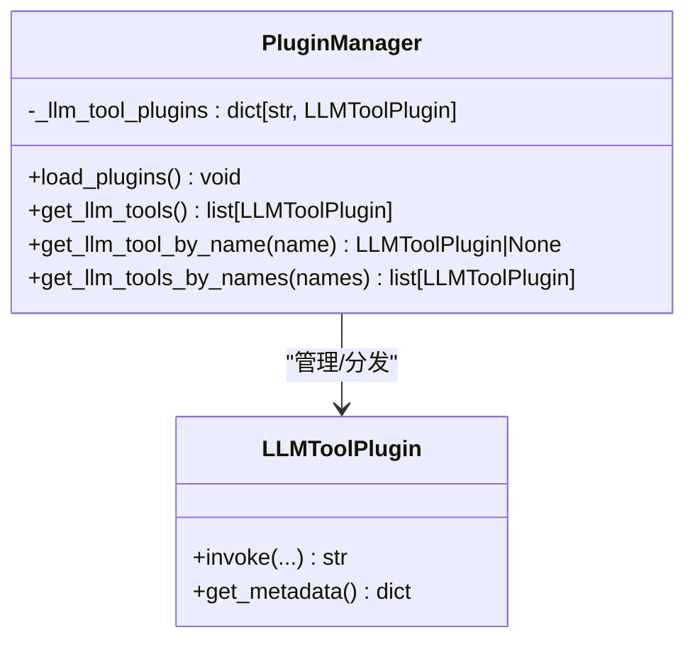
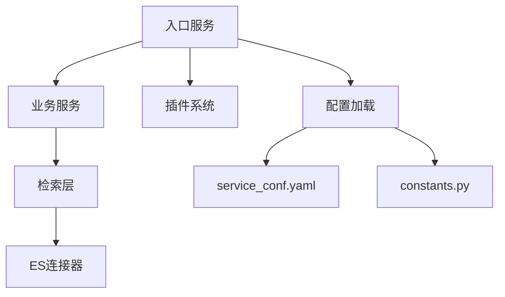

# 架构设计理念

<cite>
**本文引用的文件**
- [README.md](file://README.md)
- [ragflow_server.py](file://api/ragflow_server.py)
- [api_app.py](file://api/apps/api_app.py)
- [__init__.py](file://api/apps/__init__.py)
- [document_service.py](file://api/db/services/document_service.py)
- [settings.py](file://common/settings.py)
- [constants.py](file://common/constants.py)
- [service_conf.yaml](file://conf/service_conf.yaml)
- [search.py](file://rag/nlp/search.py)
- [es_conn.py](file://rag/utils/es_conn.py)
- [plugin_manager.py](file://plugin/plugin_manager.py)
- [common.py](file://plugin/common.py)
- [plugin/__init__.py](file://plugin/__init__.py)
</cite>

## 目录
1. [引言](#引言)
2. [项目结构](#项目结构)
3. [核心组件](#核心组件)
4. [架构总览](#架构总览)
5. [详细组件分析](#详细组件分析)
6. [依赖分析](#依赖分析)
7. [性能考量](#性能考量)
8. [故障排查指南](#故障排查指南)
9. [结论](#结论)
10. [附录](#附录)

## 引言
本文件面向RAGFlow的架构设计理念，围绕模块化设计、插件化扩展、微服务化与多引擎支持等核心思想，系统梳理后端服务、检索与重排、存储抽象、认证与路由、以及插件体系等关键模块，并结合实际代码路径给出架构图与流程图，帮助开发者在现有架构上进行功能扩展与定制开发。

## 项目结构
RAGFlow采用前后端分离与多子系统协同的组织方式：
- 后端服务入口与路由：api/ragflow_server.py负责启动与全局初始化，api/apps/__init__.py注册蓝图与认证中间件，api/apps/api_app.py承载具体业务路由。
- 数据访问层：api/db/services/document_service.py等服务封装数据库操作与任务状态管理。
- 检索与重排：rag/nlp/search.py提供统一检索接口，支持向量与文本融合、重排与高亮。
- 存储适配：rag/utils/es_conn.py等连接器实现对不同文档引擎（Elasticsearch、Infinity等）的统一访问。
- 配置中心：conf/service_conf.yaml集中管理服务配置，common/settings.py负责运行时配置加载与环境变量解析。
- 插件体系：plugin/plugin_manager.py与plugin/common.py定义插件加载与类型约定，支持LLM工具类插件扩展。

**图表来源**
- [ragflow_server.py:1-157](file://api/ragflow_server.py#L1-L157)
- [__init__.py:1-320](file://api/apps/__init__.py#L1-L320)
- [api_app.py:1-118](file://api/apps/api_app.py#L1-L118)
- [document_service.py:1-800](file://api/db/services/document_service.py#L1-L800)
- [search.py:1-800](file://rag/nlp/search.py#L1-L800)
- [es_conn.py:1-413](file://rag/utils/es_conn.py#L1-L413)
- [settings.py:1-396](file://common/settings.py#L1-L396)
- [service_conf.yaml:1-159](file://conf/service_conf.yaml#L1-L159)
- [plugin_manager.py:1-46](file://plugin/plugin_manager.py#L1-L46)
- [common.py:1-1](file://plugin/common.py#L1-L1)
- [plugin/__init__.py:1-3](file://plugin/__init__.py#L1-L3)

**章节来源**
- [README.md:137-141](file://README.md#L137-L141)
- [ragflow_server.py:1-157](file://api/ragflow_server.py#L1-L157)
- [__init__.py:1-320](file://api/apps/__init__.py#L1-L320)
- [api_app.py:1-118](file://api/apps/api_app.py#L1-L118)
- [document_service.py:1-800](file://api/db/services/document_service.py#L1-L800)
- [search.py:1-800](file://rag/nlp/search.py#L1-L800)
- [es_conn.py:1-413](file://rag/utils/es_conn.py#L1-L413)
- [settings.py:1-396](file://common/settings.py#L1-L396)
- [service_conf.yaml:1-159](file://conf/service_conf.yaml#L1-L159)
- [plugin_manager.py:1-46](file://plugin/plugin_manager.py#L1-L46)
- [common.py:1-1](file://plugin/common.py#L1-L1)
- [plugin/__init__.py:1-3](file://plugin/__init__.py#L1-L3)

## 核心组件
- 服务入口与生命周期
  - 入口脚本负责日志初始化、版本与配置打印、数据库初始化、插件加载、定时任务线程与信号处理，最后启动HTTP服务。
  - 关键路径：[ragflow_server.py:76-157](file://api/ragflow_server.py#L76-L157)

- 路由与认证
  - 使用Quart框架，注册蓝图自动扫描api/apps目录下的*_app.py文件，统一错误处理与超时配置，提供login_required装饰器与当前用户代理。
  - 关键路径：[__init__.py:59-320](file://api/apps/__init__.py#L59-L320)

- 业务路由示例
  - 示例路由演示了令牌签发、列表查询、删除与统计接口，体现统一的请求解析与响应封装。
  - 关键路径：[api_app.py:26-118](file://api/apps/api_app.py#L26-L118)

- 文档与任务服务
  - 封装文档增删改查、元数据聚合、进度更新、任务取消与清理等，贯穿知识库、租户、任务队列等实体。
  - 关键路径：[document_service.py:46-800](file://api/db/services/document_service.py#L46-L800)

- 检索与重排
  - Dealer类提供统一检索接口，支持文本/向量融合、重排（传统与模型驱动）、高亮、聚合与分页。
  - 关键路径：[search.py:37-800](file://rag/nlp/search.py#L37-L800)

- 存储适配
  - ESConnection等连接器屏蔽底层差异，支持查询DSL构建、KNN、高亮、聚合、批量写入与条件更新。
  - 关键路径：[es_conn.py:33-413](file://rag/utils/es_conn.py#L33-L413)

- 配置与常量
  - service_conf.yaml集中配置服务地址与默认模型；common/settings.py解析环境变量与配置文件，初始化存储、检索器与消息存储连接。
  - 关键路径：[service_conf.yaml:1-159](file://conf/service_conf.yaml#L1-L159)，[settings.py:169-396](file://common/settings.py#L169-L396)，[constants.py:24-252](file://common/constants.py#L24-L252)

- 插件系统
  - PluginManager基于pluginlib加载嵌入式插件，按类型分发，支持LLM工具类插件发现与调用。
  - 关键路径：[plugin_manager.py:11-46](file://plugin/plugin_manager.py#L11-L46)，[common.py:1-1](file://plugin/common.py#L1-L1)，[plugin/__init__.py:1-3](file://plugin/__init__.py#L1-L3)

**章节来源**
- [ragflow_server.py:76-157](file://api/ragflow_server.py#L76-L157)
- [__init__.py:59-320](file://api/apps/__init__.py#L59-L320)
- [api_app.py:26-118](file://api/apps/api_app.py#L26-L118)
- [document_service.py:46-800](file://api/db/services/document_service.py#L46-L800)
- [search.py:37-800](file://rag/nlp/search.py#L37-L800)
- [es_conn.py:33-413](file://rag/utils/es_conn.py#L33-L413)
- [service_conf.yaml:1-159](file://conf/service_conf.yaml#L1-L159)
- [settings.py:169-396](file://common/settings.py#L169-L396)
- [constants.py:24-252](file://common/constants.py#L24-L252)
- [plugin_manager.py:11-46](file://plugin/plugin_manager.py#L11-L46)
- [common.py:1-1](file://plugin/common.py#L1-L1)
- [plugin/__init__.py:1-3](file://plugin/__init__.py#L1-L3)

## 架构总览
RAGFlow采用“入口服务 + 路由与认证 + 业务服务 + 检索与存储适配 + 配置中心 + 插件系统”的分层架构，强调关注点分离与可替换性：
- 入口服务负责生命周期与全局初始化；
- 路由与认证统一处理请求与权限；
- 业务服务聚焦领域模型与事务；
- 检索与存储适配提供跨引擎能力；
- 配置中心统一管理部署参数；
- 插件系统提供扩展点。

**图表来源**
- [ragflow_server.py:76-157](file://api/ragflow_server.py#L76-L157)
- [__init__.py:59-320](file://api/apps/__init__.py#L59-L320)
- [document_service.py:46-800](file://api/db/services/document_service.py#L46-L800)
- [search.py:37-800](file://rag/nlp/search.py#L37-L800)
- [es_conn.py:33-413](file://rag/utils/es_conn.py#L33-L413)
- [service_conf.yaml:1-159](file://conf/service_conf.yaml#L1-L159)
- [settings.py:169-396](file://common/settings.py#L169-L396)
- [plugin_manager.py:11-46](file://plugin/plugin_manager.py#L11-L46)

## 详细组件分析

### 组件A：服务入口与生命周期（入口服务）
职责与行为
- 初始化根日志、版本与项目基路径、打印配置；
- 加载运行时配置与数据库初始化；
- 加载插件管理器；
- 注册信号处理器与定时任务线程；
- 启动HTTP服务。

**图表来源**
- [ragflow_server.py:76-157](file://api/ragflow_server.py#L76-L157)
- [settings.py:169-396](file://common/settings.py#L169-L396)
- [plugin_manager.py:17-29](file://plugin/plugin_manager.py#L17-L29)

**章节来源**
- [ragflow_server.py:76-157](file://api/ragflow_server.py#L76-L157)

### 组件B：路由与认证（Web层）
职责与行为
- 注册蓝图自动扫描api/apps目录下*_app.py；
- 统一错误处理与超时配置；
- 提供login_required装饰器与current_user代理；
- 支持API版本前缀与SDK路由。

**图表来源**
- [__init__.py:274-320](file://api/apps/__init__.py#L274-L320)
- [__init__.py:144-180](file://api/apps/__init__.py#L144-L180)

**章节来源**
- [__init__.py:274-320](file://api/apps/__init__.py#L274-L320)
- [__init__.py:144-180](file://api/apps/__init__.py#L144-L180)

### 组件C：业务服务（文档与任务）
职责与行为
- 文档查询、计数、元数据聚合、缩略图获取、解析配置更新；
- 任务取消、清理与进度更新；
- 知识库维度的统计与汇总。

**图表来源**
- [document_service.py:46-800](file://api/db/services/document_service.py#L46-L800)

**章节来源**
- [document_service.py:46-800](file://api/db/services/document_service.py#L46-L800)

### 组件D：检索与重排（检索层）
职责与行为
- 统一检索接口，支持文本/向量融合、高亮、聚合与分页；
- 重排支持传统向量/词法混合与模型驱动两种策略；
- 对Infinity与Elasticsearch分别优化。

**图表来源**
- [search.py:75-175](file://rag/nlp/search.py#L75-L175)
- [search.py:597-771](file://rag/nlp/search.py#L597-L771)
- [es_conn.py:39-196](file://rag/utils/es_conn.py#L39-L196)

**章节来源**
- [search.py:75-175](file://rag/nlp/search.py#L75-L175)
- [search.py:597-771](file://rag/nlp/search.py#L597-L771)
- [es_conn.py:39-196](file://rag/utils/es_conn.py#L39-L196)

### 组件E：配置与常量（配置层）
职责与行为
- service_conf.yaml集中配置服务地址、默认模型与认证；
- common/settings.py解析环境变量与配置文件，初始化存储、检索器与消息存储连接；
- constants.py提供枚举与常量，如任务状态、文件来源、管道任务类型等。

**图表来源**
- [service_conf.yaml:1-159](file://conf/service_conf.yaml#L1-L159)
- [settings.py:169-396](file://common/settings.py#L169-L396)
- [constants.py:24-252](file://common/constants.py#L24-L252)

**章节来源**
- [service_conf.yaml:1-159](file://conf/service_conf.yaml#L1-L159)
- [settings.py:169-396](file://common/settings.py#L169-L396)
- [constants.py:24-252](file://common/constants.py#L24-L252)

### 组件F：插件系统（扩展层）
职责与行为
- PluginManager使用pluginlib加载嵌入式插件，按类型分发；
- 支持LLM工具类插件发现与调用；
- 全局插件管理器在入口处加载。

**图表来源**
- [plugin_manager.py:11-46](file://plugin/plugin_manager.py#L11-L46)
- [common.py:1-1](file://plugin/common.py#L1-L1)
- [plugin/__init__.py:1-3](file://plugin/__init__.py#L1-L3)

**章节来源**
- [plugin_manager.py:11-46](file://plugin/plugin_manager.py#L11-L46)
- [common.py:1-1](file://plugin/common.py#L1-L1)
- [plugin/__init__.py:1-3](file://plugin/__init__.py#L1-L3)

## 依赖分析
- 组件耦合与内聚
  - 入口服务与配置层耦合度低，通过settings.py解耦配置加载；
  - 路由层与业务层通过蓝图解耦，便于按模块扩展；
  - 检索层与存储层通过DocStoreConnection接口解耦，支持多引擎切换；
  - 插件系统独立于核心业务，通过类型约定与发现机制扩展。

- 外部依赖与集成点
  - 文档引擎：Elasticsearch、Infinity、OpenSearch、OceanBase等；
  - 存储：MinIO、S3、OSS、GCS、Azure等；
  - 认证：OAuth/OIDC/GitHub等；
  - 消息队列：Redis（任务队列）。

**图表来源**
- [ragflow_server.py:76-157](file://api/ragflow_server.py#L76-L157)
- [settings.py:169-396](file://common/settings.py#L169-L396)
- [plugin_manager.py:17-29](file://plugin/plugin_manager.py#L17-L29)
- [search.py:37-800](file://rag/nlp/search.py#L37-L800)
- [es_conn.py:33-413](file://rag/utils/es_conn.py#L33-L413)
- [service_conf.yaml:1-159](file://conf/service_conf.yaml#L1-L159)
- [constants.py:24-252](file://common/constants.py#L24-L252)

**章节来源**
- [settings.py:169-396](file://common/settings.py#L169-L396)
- [plugin_manager.py:17-29](file://plugin/plugin_manager.py#L17-L29)
- [search.py:37-800](file://rag/nlp/search.py#L37-L800)
- [es_conn.py:33-413](file://rag/utils/es_conn.py#L33-L413)
- [service_conf.yaml:1-159](file://conf/service_conf.yaml#L1-L159)
- [constants.py:24-252](file://common/constants.py#L24-L252)

## 性能考量
- 检索性能
  - 文本与向量融合查询中，KNN候选数限制与最小匹配百分比控制可提升吞吐；
  - 重排阶段采用向量化计算与批量处理，减少Python层循环开销；
  - Infinity与Elasticsearch在归一化与融合策略上的差异需在配置与算法层面适配。

- 并发与资源
  - 配置项MAX_CONTENT_LENGTH、DOC_BULK_SIZE、EMBEDDING_BATCH_SIZE影响上传与批处理性能；
  - PARALLEL_DEVICES与GPU设备检测用于推理加速。

- 稳定性
  - 连接超时与重试机制（ATTEMPT_TIME）降低外部依赖抖动影响；
  - 定时任务线程与Redis分布式锁保障进度更新一致性。

**章节来源**
- [es_conn.py:30-31](file://rag/utils/es_conn.py#L30-L31)
- [search.py:420-437](file://rag/nlp/search.py#L420-L437)
- [settings.py:344-350](file://common/settings.py#L344-L350)
- [settings.py:344-347](file://common/settings.py#L344-L347)

## 故障排查指南
- 启动与初始化
  - 若启动后浏览器提示网络异常，检查容器日志确认初始化完成；
  - 如需调试，可通过RAGFLOW_DEBUGPY_LISTEN开启远程调试监听。

- 认证与路由
  - 401未授权通常源于无效或空的访问令牌，检查Authorization头与APIToken有效性；
  - 登录装饰器login_required会抛出未授权异常，确保会话与用户状态有效。

- 检索与存储
  - ES连接超时与查询超时有重试与连接重建逻辑，必要时调整超时参数；
  - KNN查询的num_candidates与similarity阈值影响召回质量与性能。

- 插件加载
  - 插件类型需符合PLUGIN_TYPE_LLM_TOOLS约定，加载失败时查看日志输出的插件版本信息。

**章节来源**
- [ragflow_server.py:97-101](file://api/ragflow_server.py#L97-L101)
- [__init__.py:298-314](file://api/apps/__init__.py#L298-L314)
- [es_conn.py:174-195](file://rag/utils/es_conn.py#L174-L195)
- [plugin/common.py:1-1](file://plugin/common.py#L1-L1)

## 结论
RAGFlow通过模块化与分层架构实现了清晰的关注点分离，配合插件化扩展与多引擎适配，既保证了核心检索与存储的稳定性，又为业务扩展提供了灵活的接入点。在性能方面，通过向量化重排、批量处理与连接池等手段优化吞吐；在可靠性方面，超时重试、分布式锁与信号处理增强了系统韧性。建议在二次开发中遵循现有分层与接口契约，优先通过插件与配置扩展能力，保持核心模块的高内聚与低耦合。

## 附录
- 设计模式与最佳实践
  - 单例模式：ESConnection等连接器使用单例避免重复连接；
  - 工厂模式：StorageFactory根据枚举选择具体存储实现；
  - 策略模式：检索与重排支持多种策略（传统/模型），通过配置切换；
  - 装饰器模式：login_required作为路由装饰器统一鉴权；
  - 观察者/事件：定时线程与Redis锁用于进度更新与任务协调。

- 扩展点建议
  - 新增文档引擎：实现DocStoreConnection接口并在settings.py中注册；
  - 新增存储后端：实现存储抽象并在StorageFactory中映射；
  - 新增LLM工具：编写插件类并遵循invoke签名，通过插件管理器加载。

**章节来源**
- [es_conn.py:33-34](file://rag/utils/es_conn.py#L33-L34)
- [settings.py:153-167](file://common/settings.py#L153-L167)
- [constants.py:160-168](file://common/constants.py#L160-L168)
- [plugin_manager.py:17-29](file://plugin/plugin_manager.py#L17-L29)