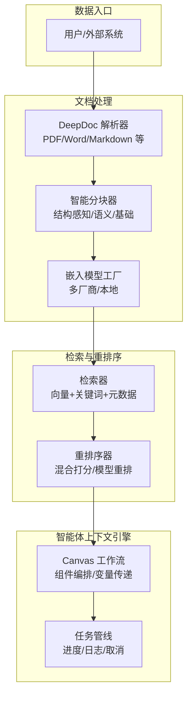
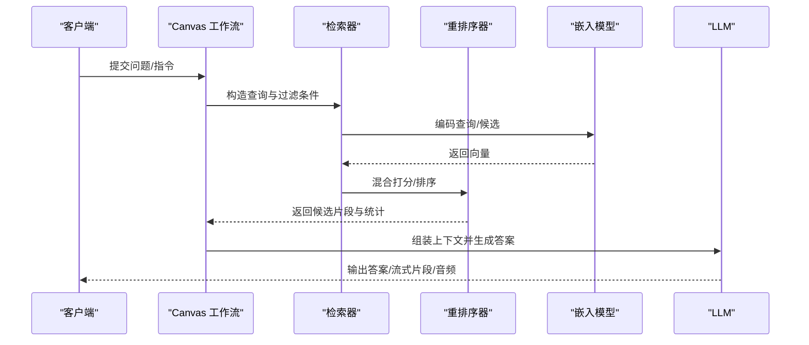
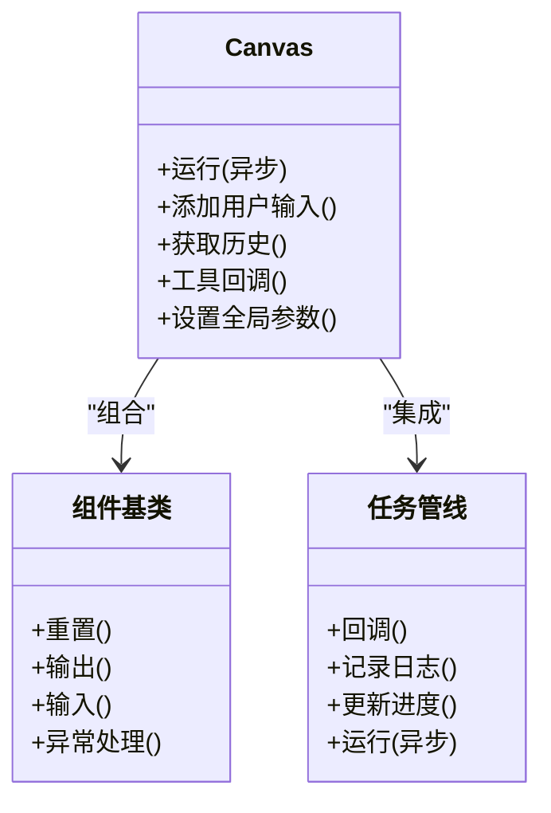
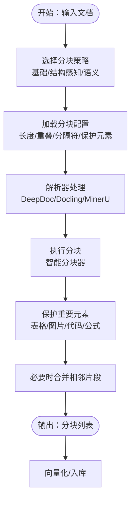
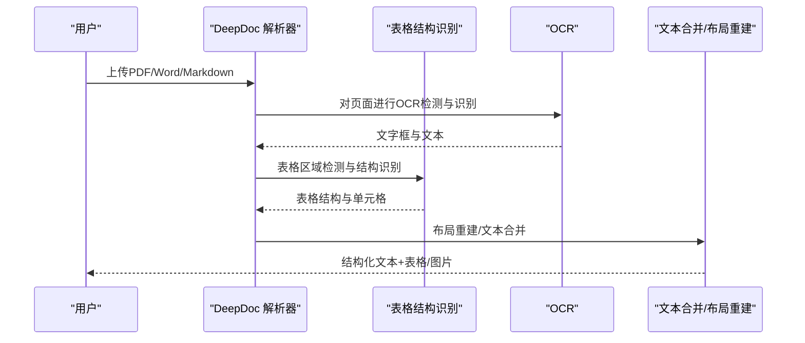
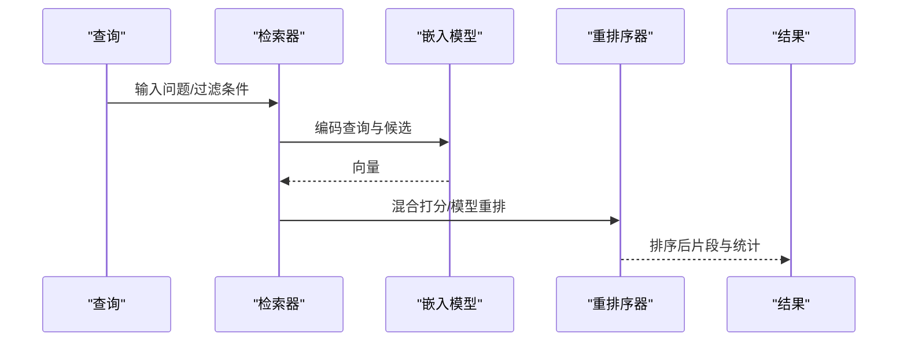
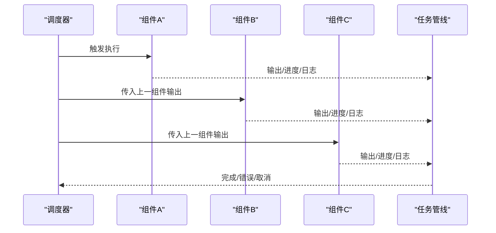
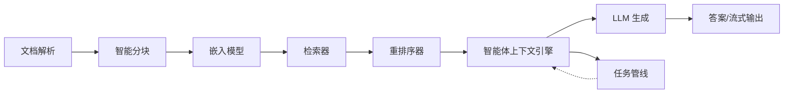

# 核心概念

<cite>
**本文引用的文件**
- [docs/基础/rag.md](file://docs/basics/rag.md)
- [docs/基础/agent_context_engine.md](file://docs/basics/agent_context_engine.md)
- [conf/分块配置.json](file://conf/chunking_config.json)
- [rag/流/pipeline.py](file://rag/flow/pipeline.py)
- [rag/app/naive.py](file://rag/app/naive.py)
- [rag/utils/智能分块.py](file://rag/utils/smart_chunker.py)
- [deepdoc/解析/pdf解析器.py](file://deepdoc/parser/pdf_parser.py)
- [rag/nlp/检索.py](file://rag/nlp/search.py)
- [rag/llm/嵌入模型.py](file://rag/llm/embedding_model.py)
- [agent/canvas.py](file://agent/canvas.py)
</cite>

## 目录
1. [简介](#简介)
2. [项目结构](#项目结构)
3. [核心组件](#核心组件)
4. [架构总览](#架构总览)
5. [详细组件分析](#详细组件分析)
6. [依赖关系分析](#依赖关系分析)
7. [性能考量](#性能考量)
8. [故障排查指南](#故障排查指南)
9. [结论](#结论)
10. [附录](#附录)

## 简介
本文件面向希望理解 RAGFlow 核心概念的读者，围绕以下主题展开：RAG 的基本原理（检索、融合、生成）、智能体上下文引擎的作用与价值、模板化分块（chunking）技术及其优势、多模态数据处理（文本、图像、表格等）策略、以及 RAGFlow 的架构理念（模块化、插件化、微服务）。文中通过代码路径定位与图示，帮助读者将抽象概念与实际实现联系起来，并给出可操作的应用场景与实践建议。

## 项目结构
RAGFlow 的核心能力由多个子系统协同实现：
- 文档解析与多模态理解：deepdoc 解析器负责 PDF/Word/Markdown 等格式的结构化抽取与布局识别，支持表格、公式、图片等复杂元素。
- 分块与向量化：提供多种分块策略（基础、结构感知、语义），并结合嵌入模型生成向量，支撑检索与重排序。
- 检索与重排序：统一的检索层支持向量、关键词、元数据过滤与混合打分，满足企业级召回与排序需求。
- 智能体上下文引擎：以工作流编排为核心，将知识、记忆与工具检索整合为统一的上下文装配平台。
- 插件化与微服务：通过组件化与任务管线，实现可插拔的检索、生成、工具调用与可视化输出。

**图表来源**
- [deepdoc/解析/pdf解析器.py:56-110](file://deepdoc/parser/pdf_parser.py#L56-L110)
- [rag/utils/智能分块.py:36-62](file://rag/utils/smart_chunker.py#L36-L62)
- [rag/llm/嵌入模型.py:37-51](file://rag/llm/embedding_model.py#L37-L51)
- [rag/nlp/检索.py:37-52](file://rag/nlp/search.py#L37-L52)
- [agent/canvas.py:40-90](file://agent/canvas.py#L40-L90)
- [rag/flow/pipeline.py:28-42](file://rag/flow/pipeline.py#L28-L42)

**章节来源**
- [docs/基础/rag.md:1-108](file://docs/basics/rag.md#L1-L108)
- [docs/基础/agent_context_engine.md:1-62](file://docs/basics/agent_context_engine.md#L1-L62)

## 核心组件
- 检索（Retrieval）
  - 通过嵌入模型将查询与候选文本编码为向量，结合关键词匹配与元数据过滤，执行混合检索与重排序。
  - 支持向量相似度、词法相似度与秩特征（如 PageRank、标签特征）的融合打分。
- 融合（Fusion）
  - 将检索到的多源信息（不同粒度、不同来源）进行结构化组织，形成可被 LLM 使用的上下文。
  - 在智能体上下文引擎中，融合知识、记忆与工具检索结果，形成动态上下文。
- 生成（Generation）
  - 将融合后的上下文与提示词交给 LLM，生成自然语言回答或结构化输出。
  - 支持引用标注、流式输出与 TTS 音频合成。

**章节来源**
- [rag/nlp/检索.py:597-770](file://rag/nlp/search.py#L597-L770)
- [rag/llm/嵌入模型.py:91-123](file://rag/llm/embedding_model.py#L91-L123)
- [agent/canvas.py:367-646](file://agent/canvas.py#L367-L646)

## 架构总览
RAGFlow 的架构以“检索-融合-生成”为主线，向上扩展为“智能体上下文引擎”，向下整合“文档解析-分块-向量化-检索-重排序”的完整链路。整体呈现模块化、插件化与微服务化的特征：
- 模块化：各子系统职责清晰，如 deepdoc 负责解析，smart_chunker 负责分块，embedding_model 负责向量化，search 负责检索与重排序。
- 插件化：通过组件化工作流（Canvas）与任务管线（Pipeline），实现可配置、可扩展的执行路径。
- 微服务化：检索层与生成层可独立部署与扩展，便于横向扩容与多租户隔离。

**图表来源**
- [agent/canvas.py:367-646](file://agent/canvas.py#L367-L646)
- [rag/nlp/检索.py:597-770](file://rag/nlp/search.py#L597-L770)
- [rag/llm/嵌入模型.py:91-123](file://rag/llm/embedding_model.py#L91-L123)

## 详细组件分析

### 组件A：智能体上下文引擎（Agent Context Engine）
- 作用：将“知识、记忆、工具”三类信息在推理时刻自动装配为高质量上下文，降低手工拼接成本，提升可维护性与一致性。
- 关键能力：
  - 知识核心（高级 RAG）：多格式文档解析、结构化摘要与元数据增强、树状/图状检索优化。
  - 记忆层：对话历史、偏好与内部状态的存储与检索，支持摘要与连续性。
  - 工具编排：工具检索与最佳实践索引，按需选择工具与流程。
- 与传统“上下文工程”的区别：从“手工作坊”走向“工业流水线”，强调自动化、可观测与可配置。

**图表来源**
- [agent/canvas.py:279-321](file://agent/canvas.py#L279-L321)
- [agent/canvas.py:40-90](file://agent/canvas.py#L40-L90)
- [rag/flow/pipeline.py:28-42](file://rag/flow/pipeline.py#L28-L42)

**章节来源**
- [docs/基础/agent_context_engine.md:26-62](file://docs/basics/agent_context_engine.md#L26-L62)
- [agent/canvas.py:279-321](file://agent/canvas.py#L279-L321)
- [rag/flow/pipeline.py:117-176](file://rag/flow/pipeline.py#L117-L176)

### 组件B：模板化分块（Chunking）技术
- 目标：在“召回精度”与“上下文完整性”之间取得平衡，避免整篇文档向量化导致的语义稀释与成本上升。
- 策略：
  - 基础分块：按固定长度与标点分隔切分，适合通用场景。
  - 结构感知分块：保护表格、图片、代码块、标题等重要元素，维持语义边界。
  - 语义分块：基于相似度阈值进行语义合并，兼顾细粒度与连贯性。
- 配置与优化：通过配置文件控制分块长度、重叠、保护元素与性能上限，支持 MinerU/Docling 等解析器的协同优化。

**图表来源**
- [conf/分块配置.json:1-66](file://conf/chunking_config.json#L1-L66)
- [rag/utils/智能分块.py:36-62](file://rag/utils/smart_chunker.py#L36-L62)
- [rag/app/naive.py:743-800](file://rag/app/naive.py#L743-L800)

**章节来源**
- [docs/基础/rag.md:29-48](file://docs/basics/rag.md#L29-L48)
- [conf/分块配置.json:1-66](file://conf/chunking_config.json#L1-L66)
- [rag/utils/智能分块.py:346-411](file://rag/utils/smart_chunker.py#L346-L411)

### 组件C：多模态数据处理
- 文档解析：PDF/Word/Markdown 等格式的结构化抽取，支持布局识别、表格结构识别与旋转校正、OCR 与文字合并。
- 图像与表格：在分块过程中保留与文本的关联，通过图片合并策略与表格结构识别，提升检索与生成质量。
- 视觉理解：结合 OCR 与布局识别，将视觉信息转化为可检索的文本表示。

**图表来源**
- [deepdoc/解析/pdf解析器.py:56-110](file://deepdoc/parser/pdf_parser.py#L56-L110)
- [deepdoc/解析/pdf解析器.py:292-395](file://deepdoc/parser/pdf_parser.py#L292-L395)
- [rag/app/naive.py:550-587](file://rag/app/naive.py#L550-L587)

**章节来源**
- [docs/基础/rag.md:53-77](file://docs/basics/rag.md#L53-L77)
- [deepdoc/解析/pdf解析器.py:586-650](file://deepdoc/parser/pdf_parser.py#L586-L650)

### 组件D：检索与重排序
- 检索：支持向量检索、关键词检索与元数据过滤的混合表达，提供加权融合策略。
- 重排序：提供基于词法相似度、向量相似度与秩特征（PageRank、标签特征）的混合打分；也支持模型驱动的重排。
- 分页与过滤：支持分页、阈值过滤与聚合统计，便于前端展示与二次加工。

**图表来源**
- [rag/nlp/检索.py:75-175](file://rag/nlp/search.py#L75-L175)
- [rag/nlp/检索.py:597-770](file://rag/nlp/search.py#L597-L770)
- [rag/llm/嵌入模型.py:91-123](file://rag/llm/embedding_model.py#L91-L123)

**章节来源**
- [rag/nlp/检索.py:75-175](file://rag/nlp/search.py#L75-L175)
- [rag/nlp/检索.py:334-438](file://rag/nlp/search.py#L334-L438)

### 组件E：任务管线与工作流编排
- 任务管线：提供统一的进度回调、日志记录与取消控制，支持异步组件的并发执行与错误传播。
- 工作流编排：Canvas 将组件串联为有向无环图（DAG），支持分支、循环、迭代与用户交互节点，实现复杂的业务流程。

**图表来源**
- [rag/flow/pipeline.py:117-176](file://rag/flow/pipeline.py#L117-L176)
- [agent/canvas.py:420-464](file://agent/canvas.py#L420-L464)

**章节来源**
- [rag/flow/pipeline.py:28-42](file://rag/flow/pipeline.py#L28-L42)
- [agent/canvas.py:40-90](file://agent/canvas.py#L40-L90)

## 依赖关系分析
- 模块耦合
  - 检索层与生成层解耦：检索器仅负责返回候选，重排序与生成可独立演进。
  - 上下文引擎与检索层弱耦合：通过统一的数据结构与接口对接，便于替换与扩展。
- 外部依赖
  - 嵌入模型：支持多家厂商与本地模型，具备统一工厂接口。
  - 检索后端：支持多种文档引擎（如 Infinity/ElasticSearch），通过统一接口适配。
- 可能的循环依赖
  - 组件间通过 DAG 串联，避免直接循环引用；Canvas 与 Pipeline 通过回调与事件解耦。

**图表来源**
- [rag/app/naive.py:743-800](file://rag/app/naive.py#L743-L800)
- [rag/utils/智能分块.py:346-411](file://rag/utils/smart_chunker.py#L346-L411)
- [rag/llm/嵌入模型.py:37-51](file://rag/llm/embedding_model.py#L37-L51)
- [rag/nlp/检索.py:597-770](file://rag/nlp/search.py#L597-L770)
- [agent/canvas.py:367-646](file://agent/canvas.py#L367-L646)
- [rag/flow/pipeline.py:117-176](file://rag/flow/pipeline.py#L117-L176)

**章节来源**
- [rag/llm/嵌入模型.py:37-51](file://rag/llm/embedding_model.py#L37-L51)
- [rag/nlp/检索.py:37-52](file://rag/nlp/search.py#L37-L52)

## 性能考量
- 分块策略
  - 控制分块长度与重叠，平衡召回精度与上下文窗口限制。
  - 对表格、图片等重要元素进行保护，避免信息丢失。
- 向量化与检索
  - 合理设置相似度阈值与 TopK，减少无效候选。
  - 混合打分时对词法与向量权重进行调优，提升排序稳定性。
- 并发与资源
  - 任务管线与组件执行采用线程池与异步协程，提升吞吐。
  - 配置最大并发进程数、内存上限与批大小，避免资源耗尽。

**章节来源**
- [conf/分块配置.json:60-66](file://conf/chunking_config.json#L60-L66)
- [rag/nlp/检索.py:613-770](file://rag/nlp/search.py#L613-L770)

## 故障排查指南
- 常见问题
  - 分块过多或过少：检查分块长度、重叠与保护元素配置，必要时切换为结构感知或语义分块。
  - 检索命中率低：确认嵌入模型质量、相似度阈值与混合权重；检查关键词与元数据过滤条件。
  - 生成内容与事实不符：检查检索候选质量与上下文组装，必要时启用模型重排。
  - 任务取消或卡死：通过任务管线的日志与取消标记排查阻塞点。
- 定位手段
  - 查看任务日志与进度消息，定位具体组件与时间点。
  - 使用最小化样例复现问题，逐步排除解析、分块、检索、重排序与生成环节。

**章节来源**
- [rag/flow/pipeline.py:43-105](file://rag/flow/pipeline.py#L43-L105)
- [rag/nlp/检索.py:613-770](file://rag/nlp/search.py#L613-L770)

## 结论
RAGFlow 将“检索-融合-生成”的 RAG 原理与“智能体上下文引擎”的工程化实践相结合，通过模块化、插件化与微服务化架构，实现了从文档解析、分块、向量化、检索与重排序，到上下文装配与生成的全链路能力。模板化分块与多模态处理提升了召回质量与上下文完整性，而统一的检索与重排序接口则保证了系统的可扩展性与可维护性。对于实际项目，建议从合适的分块策略与嵌入模型入手，逐步引入工具检索与记忆层，最终形成可配置、可观测、可扩展的智能体上下文平台。

## 附录
- 实际应用场景
  - 企业知识问答与内部搜索：结合私域文档与 LLM，提供权威、可溯源的答案。
  - 复杂文档理解与专业问答：针对合同、法规等结构复杂文档，保持上下文连贯与实体关系可见。
  - 动态知识融合与决策支持：跨系统、跨格式的知识融合，支持业务决策的可解释与可控。
- 代码路径参考
  - 检索与重排序：[rag/nlp/检索.py:597-770](file://rag/nlp/search.py#L597-L770)
  - 嵌入模型工厂：[rag/llm/嵌入模型.py:91-123](file://rag/llm/embedding_model.py#L91-L123)
  - 智能分块与配置：[rag/utils/智能分块.py:346-411](file://rag/utils/smart_chunker.py#L346-L411)，[conf/分块配置.json:1-66](file://conf/chunking_config.json#L1-L66)
  - 多模态解析：[deepdoc/解析/pdf解析器.py:586-650](file://deepdoc/parser/pdf_parser.py#L586-L650)
  - 工作流与任务管线：[agent/canvas.py:367-646](file://agent/canvas.py#L367-L646)，[rag/flow/pipeline.py:117-176](file://rag/flow/pipeline.py#L117-L176)