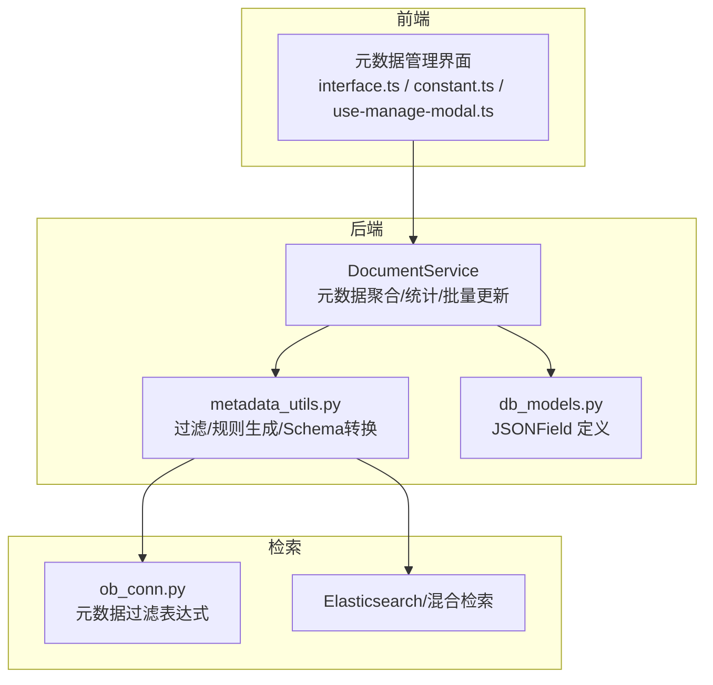
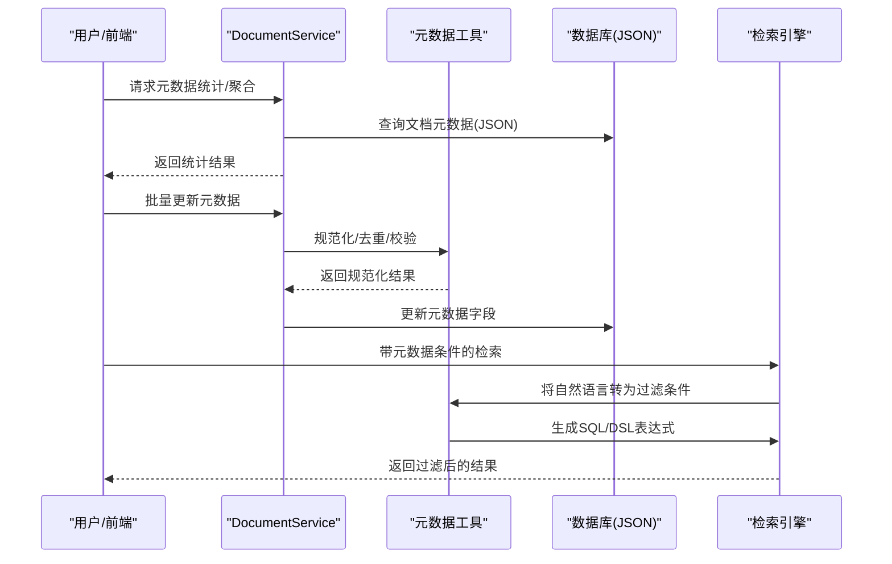
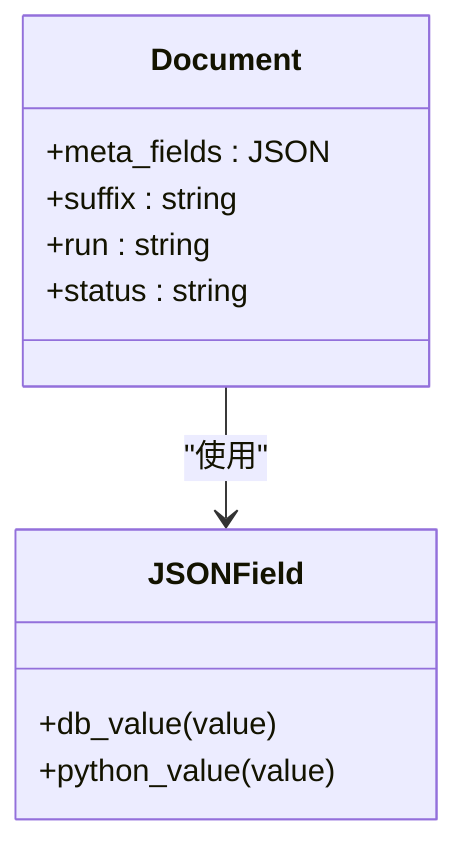
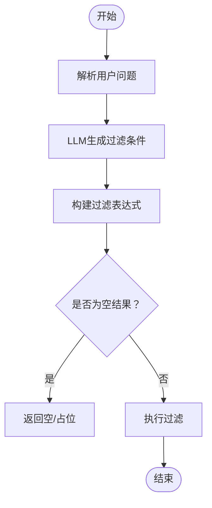
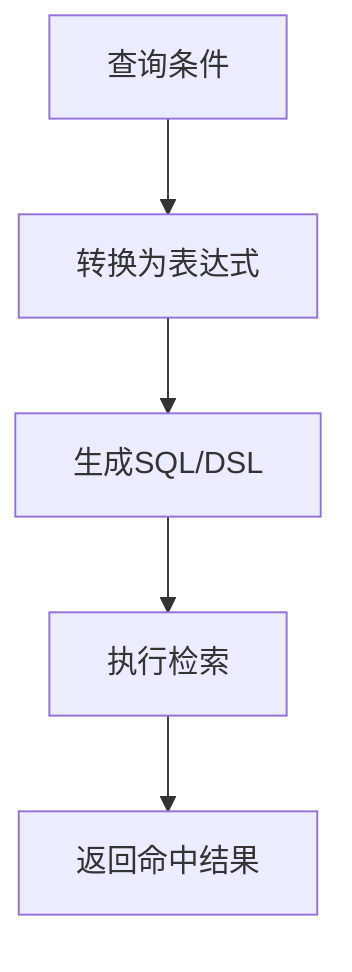
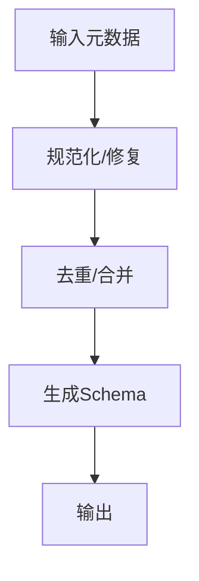
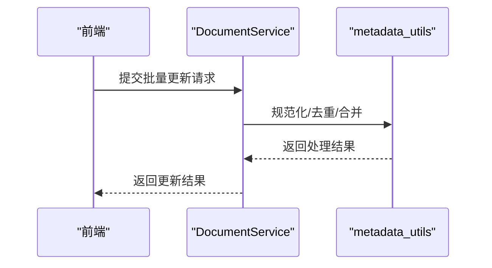
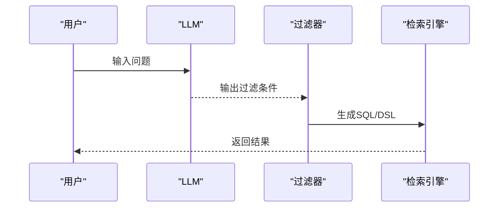
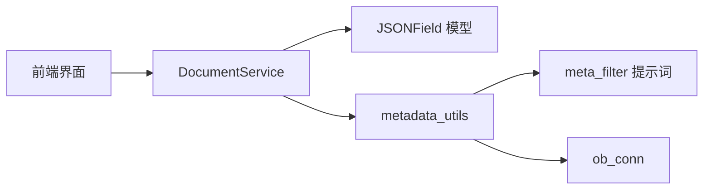

# 元数据管理

<cite>
**本文档引用的文件**
- [document_service.py](file://api/db/services/document_service.py)
- [metadata_utils.py](file://common/metadata_utils.py)
- [ob_conn.py](file://rag/utils/ob_conn.py)
- [db_models.py](file://api/db/db_models.py)
- [meta_filter.md](file://rag/prompts/meta_filter.md)
- [manage_metadata.md](file://docs/guides/dataset/manage_metadata.md)
- [auto_metadata.md](file://docs/guides/dataset/auto_metadata.md)
- [interface.ts](file://web/src/pages/dataset/components/metedata/interface.ts)
- [constant.ts](file://web/src/pages/dataset/components/metedata/constant.ts)
- [use-manage-modal.ts](file://web/src/pages/dataset/components/metedata/hooks/use-manage-modal.ts)
</cite>

## 目录
1. [简介](#简介)
2. [项目结构](#项目结构)
3. [核心组件](#核心组件)
4. [架构总览](#架构总览)
5. [详细组件分析](#详细组件分析)
6. [依赖分析](#依赖分析)
7. [性能考虑](#性能考虑)
8. [故障排除指南](#故障排除指南)
9. [结论](#结论)
10. [附录](#附录)

## 简介
本文件面向元数据管理系统，系统性梳理元数据的定义、分类、提取与识别、存储与索引、验证与标准化、批量管理与更新、版本控制与变更追踪、与搜索检索的集成以及导出导入能力。目标是帮助开发者与使用者全面理解元数据在知识库中的作用机制，并提供可操作的实现参考。

## 项目结构
元数据管理涉及后端服务层（数据库模型与服务）、通用工具模块（元数据处理与过滤）、检索引擎适配层（OceanBase/ES 等）以及前端管理界面。整体分层如下：
- 数据模型层：定义文档元数据字段与序列化方式
- 服务层：提供元数据聚合、统计、批量更新等能力
- 工具层：提供元数据过滤、LLM 规则生成、Schema 转换等
- 检索层：将元数据作为过滤条件参与检索
- 前端层：提供元数据配置、编辑、批量操作界面

**图表来源**
- [document_service.py](file://api/db/services/document_service.py)
- [metadata_utils.py](file://common/metadata_utils.py)
- [ob_conn.py](file://rag/utils/ob_conn.py)
- [db_models.py](file://api/db/db_models.py)
- [interface.ts](file://web/src/pages/dataset/components/metedata/interface.ts)
- [constant.ts](file://web/src/pages/dataset/components/metedata/constant.ts)
- [use-manage-modal.ts](file://web/src/pages/dataset/components/metedata/hooks/use-manage-modal.ts)

**章节来源**
- [db_models.py](file://api/db/db_models.py#L806)
- [document_service.py:712-781](file://api/db/services/document_service.py#L712-L781)
- [metadata_utils.py:116-165](file://common/metadata_utils.py#L116-L165)
- [ob_conn.py:205-319](file://rag/utils/ob_conn.py#L205-L319)

## 核心组件
- 文档元数据模型：使用 JSON 字段存储键值对或列表，支持空值与默认值处理
- 元数据服务：提供元数据聚合、统计、类型推断、批量更新等能力
- 元数据工具：提供过滤器、LLM 规则生成、Schema 转换、去重等
- 检索适配：将元数据转换为 SQL/DSL 过滤表达式参与检索
- 前端管理：提供元数据配置、编辑、批量操作与 Schema 设置

**章节来源**
- [db_models.py](file://api/db/db_models.py#L806)
- [document_service.py:783-836](file://api/db/services/document_service.py#L783-L836)
- [metadata_utils.py:42-114](file://common/metadata_utils.py#L42-L114)
- [ob_conn.py:285-319](file://rag/utils/ob_conn.py#L285-L319)
- [interface.ts:1-132](file://web/src/pages/dataset/components/metedata/interface.ts#L1-L132)
- [constant.ts:1-81](file://web/src/pages/dataset/components/metedata/constant.ts#L1-L81)

## 架构总览
元数据从“采集/生成”到“存储/索引”再到“检索/过滤”的完整链路如下：

**图表来源**
- [document_service.py:783-836](file://api/db/services/document_service.py#L783-L836)
- [metadata_utils.py:116-165](file://common/metadata_utils.py#L116-L165)
- [ob_conn.py:205-282](file://rag/utils/ob_conn.py#L205-L282)

## 详细组件分析

### 元数据定义与分类
- 系统内置元数据：由系统自动填充的文档级属性（如解析状态、运行状态、后缀等），通过文档模型字段体现
- 用户自定义元数据：存储于 meta_fields 的 JSON 字段中，键值对形式，支持字符串、数字、时间、列表等类型
- 类型推断：服务端根据值形态推断类型（字符串、数字、时间、列表），用于前端展示与过滤

**图表来源**
- [db_models.py](file://api/db/db_models.py#L806)
- [db_models.py:58-75](file://api/db/db_models.py#L58-L75)

**章节来源**
- [db_models.py](file://api/db/db_models.py#L806)
- [document_service.py:785-797](file://api/db/services/document_service.py#L785-L797)

### 元数据提取与识别机制
- 自动提取规则：通过提示词模板将用户问题转化为过滤条件，再基于可用元数据键生成筛选逻辑
- 正则表达式匹配：在过滤器中支持包含/不包含、起始/结束等模式匹配
- 机器学习识别：利用 LLM 将自然语言问题映射为结构化过滤条件，支持全量或半自动（限定键范围）

**图表来源**
- [metadata_utils.py:116-165](file://common/metadata_utils.py#L116-L165)
- [meta_filter.md:1-135](file://rag/prompts/meta_filter.md#L1-L135)

**章节来源**
- [metadata_utils.py:116-165](file://common/metadata_utils.py#L116-L165)
- [meta_filter.md:1-135](file://rag/prompts/meta_filter.md#L1-L135)

### 元数据存储与索引策略
- 存储：meta_fields 使用 JSON 字段持久化，支持默认空对象与序列化/反序列化
- 索引：检索层将元数据转换为 SQL JSON 表达式或 DSL 条件，结合数组/全文/向量索引进行高效过滤
- 过滤表达式：支持存在性、包含/不包含、前缀/后缀、数值比较、时间比较等

**图表来源**
- [ob_conn.py:205-282](file://rag/utils/ob_conn.py#L205-L282)
- [ob_conn.py:285-319](file://rag/utils/ob_conn.py#L285-L319)

**章节来源**
- [db_models.py](file://api/db/db_models.py#L806)
- [ob_conn.py:205-282](file://rag/utils/ob_conn.py#L205-L282)
- [ob_conn.py:285-319](file://rag/utils/ob_conn.py#L285-L319)

### 元数据验证与标准化流程
- 格式校验：支持字符串/列表/数字/布尔/时间等多种类型；对非法格式进行容错处理
- 去重与合并：对列表类型的元数据进行去重与合并，避免重复值
- Schema 转换：支持从列表或 JSON Schema 形态转换为统一的 JSON Schema 结构，便于前端渲染与校验

**图表来源**
- [metadata_utils.py:168-213](file://common/metadata_utils.py#L168-L213)
- [metadata_utils.py:215-284](file://common/metadata_utils.py#L215-L284)

**章节来源**
- [metadata_utils.py:168-213](file://common/metadata_utils.py#L168-L213)
- [metadata_utils.py:215-284](file://common/metadata_utils.py#L215-L284)

### 批量管理与批量更新
- 批量更新接口：支持对多个文档的元数据进行增删改，内部进行规范化与去重处理
- 前端操作：提供删除整字段、删除单值、批量删除、批量更新等操作，支持多选与确认流程

**图表来源**
- [document_service.py:840-865](file://api/db/services/document_service.py#L840-L865)
- [use-manage-modal.ts:131-170](file://web/src/pages/dataset/components/metedata/hooks/use-manage-modal.ts#L131-L170)

**章节来源**
- [document_service.py:840-865](file://api/db/services/document_service.py#L840-L865)
- [use-manage-modal.ts:131-170](file://web/src/pages/dataset/components/metedata/hooks/use-manage-modal.ts#L131-L170)

### 版本控制与变更追踪
- 变更记录：当前实现未直接暴露版本字段，但可通过文档更新时间、增量任务等方式间接追踪
- 建议扩展：可在元数据结构中引入版本号与变更历史字段，记录修改人、时间与差异

[本节为概念性建议，不直接分析具体文件]

### 元数据与搜索检索的集成
- 元数据过滤：将用户问题经 LLM 转换为过滤条件，再由检索层生成 SQL/DSL 表达式
- 多维过滤：支持存在性、包含/不包含、数值/时间比较、数组包含等复合条件
- 与全文/向量检索融合：在混合检索场景下，元数据条件与文本/向量权重共同影响排序

**图表来源**
- [metadata_utils.py:116-165](file://common/metadata_utils.py#L116-L165)
- [ob_conn.py:205-282](file://rag/utils/ob_conn.py#L205-L282)

**章节来源**
- [metadata_utils.py:116-165](file://common/metadata_utils.py#L116-L165)
- [ob_conn.py:205-282](file://rag/utils/ob_conn.py#L205-L282)

### 导出与导入
- 导出：可从元数据统计接口获取字段分布与取值频次，用于外部分析
- 导入：通过批量更新接口将外部系统生成的元数据写回系统，需确保格式与 Schema 一致

**章节来源**
- [document_service.py:783-836](file://api/db/services/document_service.py#L783-L836)
- [document_service.py:840-865](file://api/db/services/document_service.py#L840-L865)

## 依赖分析
- DocumentService 依赖 JSON 字段模型与元数据工具模块
- 元数据工具依赖 LLM 提示词模板生成过滤条件
- 检索适配层将元数据条件转换为 SQL/DSL 表达式
- 前端管理界面依赖元数据 Schema 与操作钩子

**图表来源**
- [document_service.py:712-781](file://api/db/services/document_service.py#L712-L781)
- [metadata_utils.py:116-165](file://common/metadata_utils.py#L116-L165)
- [meta_filter.md:1-135](file://rag/prompts/meta_filter.md#L1-L135)
- [ob_conn.py:205-282](file://rag/utils/ob_conn.py#L205-L282)

**章节来源**
- [document_service.py:712-781](file://api/db/services/document_service.py#L712-L781)
- [metadata_utils.py:116-165](file://common/metadata_utils.py#L116-L165)
- [ob_conn.py:205-282](file://rag/utils/ob_conn.py#L205-L282)

## 性能考虑
- 元数据聚合：对大体量文档进行聚合时，建议分页/分批处理，避免深分页导致的慢查询
- 过滤表达式：优先使用索引列与 JSON 路径表达式，减少全表扫描
- LLM 规则生成：对高频问题可缓存生成结果，降低重复调用成本
- 前端渲染：对大量取值进行分页/懒加载，避免一次性渲染过多节点

[本节提供通用指导，不直接分析具体文件]

## 故障排除指南
- 元数据格式错误：当 meta_fields 非法时，工具模块会进行修复与容错处理，必要时记录日志
- 过滤条件为空：当 LLM 无法生成有效条件时，返回空结果或占位符，前端应提示用户调整问题或选择手动过滤
- 操作冲突：批量更新时注意并发冲突，建议采用分布式锁或幂等设计

**章节来源**
- [metadata_utils.py:180-213](file://common/metadata_utils.py#L180-L213)
- [metadata_utils.py:116-165](file://common/metadata_utils.py#L116-L165)

## 结论
元数据管理在本系统中以 JSON 字段为核心，配合服务层聚合、工具层过滤与 Schema 转换、检索层表达式生成，形成完整的“采集—存储—过滤—检索”闭环。通过前端管理界面，用户可以灵活配置与批量维护元数据，满足大规模文档的精细化治理需求。建议后续增强版本控制与变更追踪能力，进一步提升元数据的可审计性与可追溯性。

## 附录
- 管理与配置指南：参见文档指南中的元数据管理与自动元数据配置章节
- 前端交互：元数据类型、Schema 设置与批量操作均由前端组件提供直观界面

**章节来源**
- [manage_metadata.md:1-32](file://docs/guides/dataset/manage_metadata.md#L1-L32)
- [auto_metadata.md:41-51](file://docs/guides/dataset/auto_metadata.md#L41-L51)
- [interface.ts:1-132](file://web/src/pages/dataset/components/metedata/interface.ts#L1-L132)
- [constant.ts:1-81](file://web/src/pages/dataset/components/metedata/constant.ts#L1-L81)