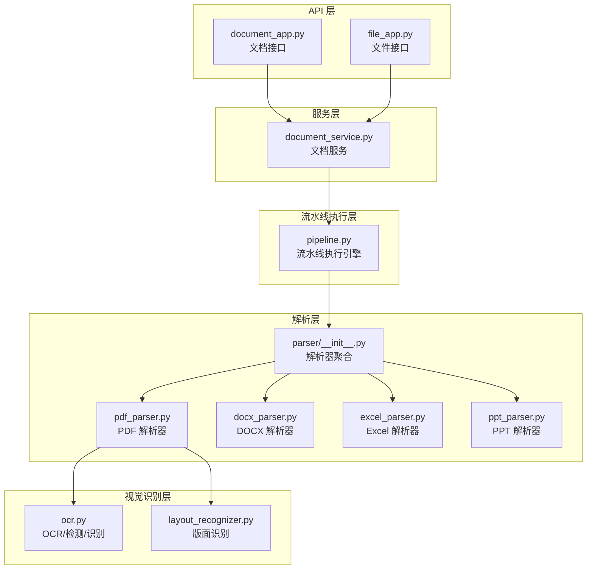
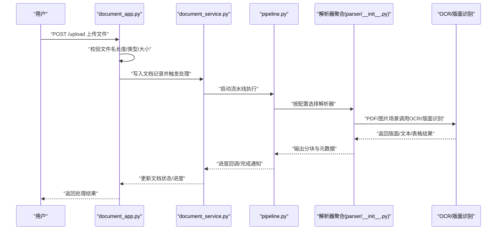
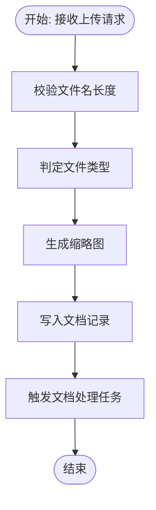
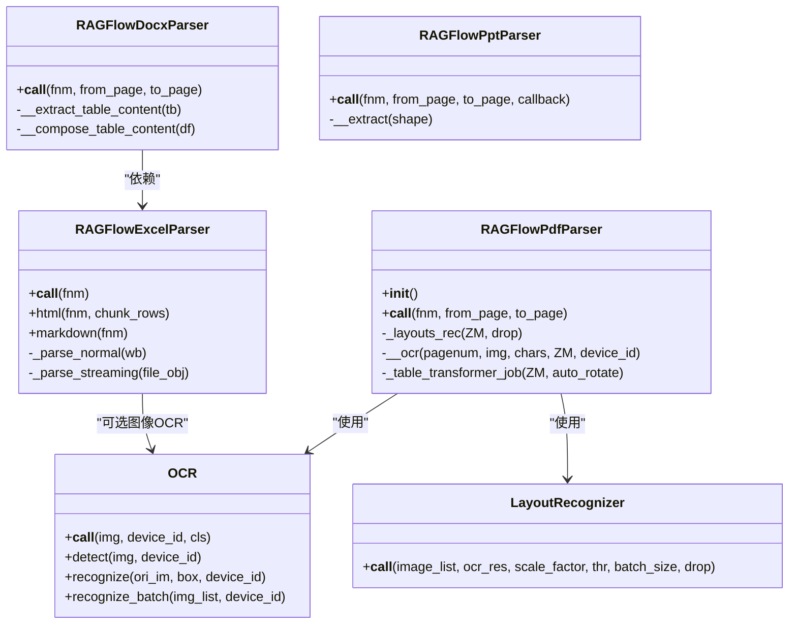
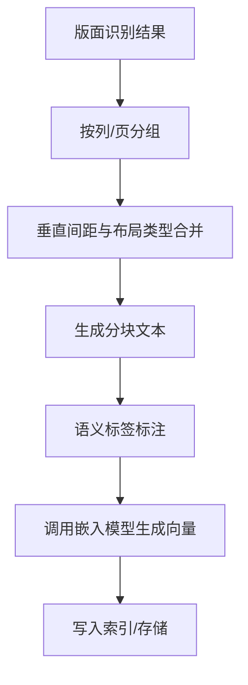
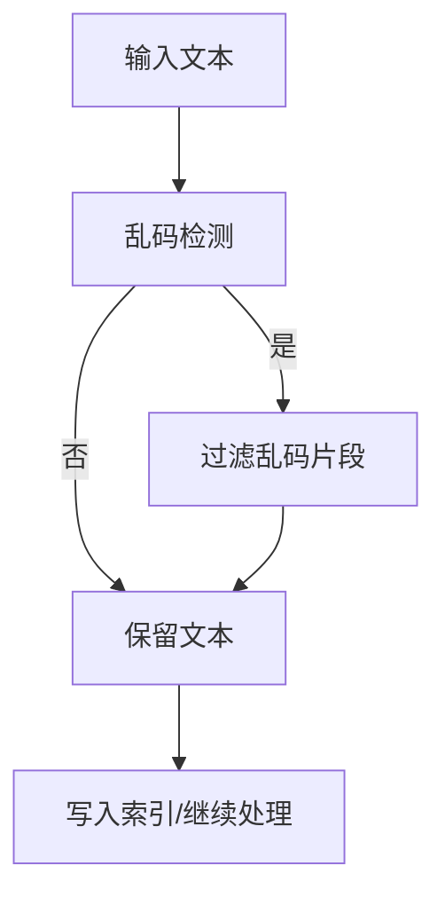
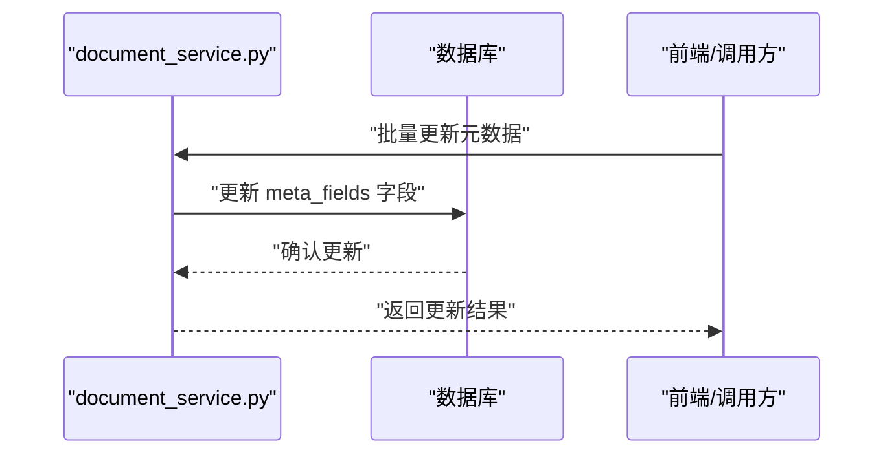
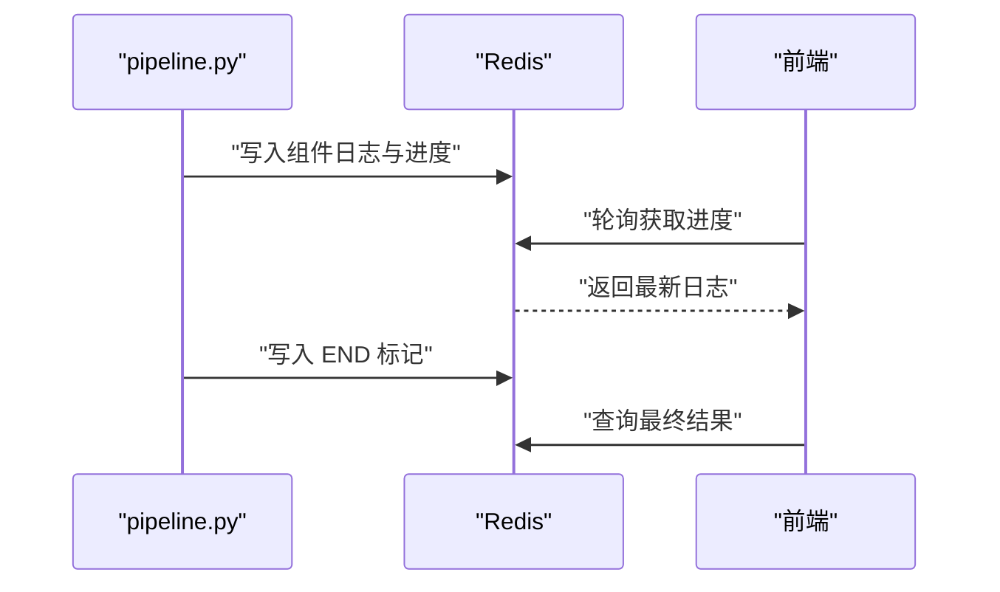
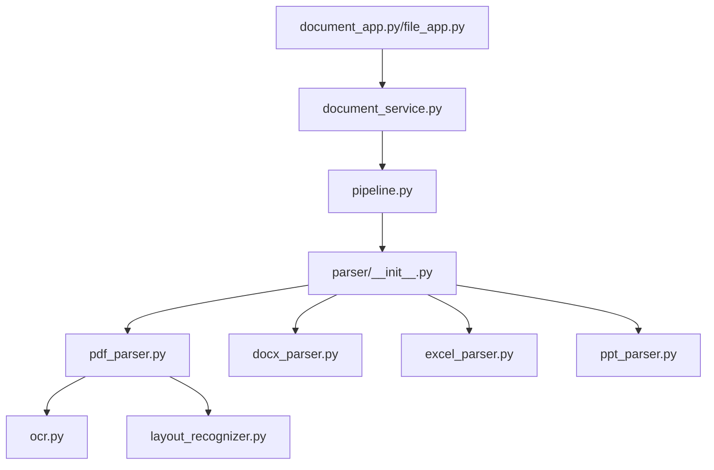

# 文档处理

<cite>
**本文引用的文件**
- [deepdoc/parser/__init__.py](file://deepdoc/parser/__init__.py)
- [deepdoc/parser/pdf_parser.py](file://deepdoc/parser/pdf_parser.py)
- [deepdoc/parser/docx_parser.py](file://deepdoc/parser/docx_parser.py)
- [deepdoc/parser/excel_parser.py](file://deepdoc/parser/excel_parser.py)
- [deepdoc/parser/ppt_parser.py](file://deepdoc/parser/ppt_parser.py)
- [deepdoc/vision/ocr.py](file://deepdoc/vision/ocr.py)
- [deepdoc/vision/layout_recognizer.py](file://deepdoc/vision/layout_recognizer.py)
- [api/apps/document_app.py](file://api/apps/document_app.py)
- [api/apps/file_app.py](file://api/apps/file_app.py)
- [api/db/services/document_service.py](file://api/db/services/document_service.py)
- [api/utils/file_utils.py](file://api/utils/file_utils.py)
- [common/text_quality.py](file://common/text_quality.py)
- [rag/flow/pipeline.py](file://rag/flow/pipeline.py)
</cite>

## 目录
1. [简介](#简介)
2. [项目结构](#项目结构)
3. [核心组件](#核心组件)
4. [架构总览](#架构总览)
5. [详细组件分析](#详细组件分析)
6. [依赖关系分析](#依赖关系分析)
7. [性能考量](#性能考量)
8. [故障排查指南](#故障排查指南)
9. [结论](#结论)
10. [附录](#附录)

## 简介
本技术文档面向“文档处理系统”，围绕文档上传与接收、格式验证、大小限制、重复检测、多格式解析、分块与向量化、质量检查与错误处理、元数据提取与管理、并发控制与性能优化、以及处理状态跟踪与进度监控等方面进行全面阐述。文档以代码级映射的方式，结合流程图与类图，帮助开发者与运维人员快速理解系统设计与实现细节。

## 项目结构
系统采用分层与模块化组织方式：
- API 层：提供 HTTP 接口，负责请求接入、参数校验、权限控制与任务调度。
- 服务层：封装业务逻辑，协调存储、任务与文档状态更新。
- 解析层：针对 PDF、Word、Excel、PowerPoint、图片等格式的专用解析器。
- 视觉识别层：OCR、布局识别、表格结构识别等视觉能力。
- 流水线执行层：基于图的流水线执行引擎，支持进度回调与取消控制。
- 工具与通用层：文件类型判定、缩略图生成、乱码检测、文件工具等。

图表来源
- [api/apps/document_app.py:52-97](file://api/apps/document_app.py#L52-L97)
- [api/apps/file_app.py:37-126](file://api/apps/file_app.py#L37-L126)
- [api/db/services/document_service.py:696-709](file://api/db/services/document_service.py#L696-L709)
- [deepdoc/parser/__init__.py:17-39](file://deepdoc/parser/__init__.py#L17-L39)
- [deepdoc/parser/pdf_parser.py:56-110](file://deepdoc/parser/pdf_parser.py#L56-L110)
- [deepdoc/parser/docx_parser.py:27-168](file://deepdoc/parser/docx_parser.py#L27-L168)
- [deepdoc/parser/excel_parser.py:30-436](file://deepdoc/parser/excel_parser.py#L30-L436)
- [deepdoc/parser/ppt_parser.py:22-97](file://deepdoc/parser/ppt_parser.py#L22-L97)
- [deepdoc/vision/ocr.py:542-758](file://deepdoc/vision/ocr.py#L542-L758)
- [deepdoc/vision/layout_recognizer.py:33-158](file://deepdoc/vision/layout_recognizer.py#L33-L158)
- [rag/flow/pipeline.py:28-176](file://rag/flow/pipeline.py#L28-L176)

章节来源
- [api/apps/document_app.py:52-97](file://api/apps/document_app.py#L52-L97)
- [api/apps/file_app.py:37-126](file://api/apps/file_app.py#L37-L126)
- [api/db/services/document_service.py:696-709](file://api/db/services/document_service.py#L696-L709)
- [deepdoc/parser/__init__.py:17-39](file://deepdoc/parser/__init__.py#L17-L39)

## 核心组件
- 文档上传与接收
  - 文件名长度限制、文件类型判定、缩略图生成、Web 网页抓取转 PDF。
- 预处理与质量检查
  - 文件类型验证、大小限制、重复命名检测、乱码内容过滤。
- 多格式解析器
  - PDF（版面识别、OCR、表格结构识别）、DOCX（段落与表格抽取）、Excel（行列转文本/HTML/Markdown、图像提取）、PPT（形状/表格/文本抽取）。
- 分块与向量化
  - 文本分段策略、语义分段、向量嵌入（由上层流程调用）。
- 错误处理与隔离
  - 解析失败重试、格式兼容性降级、异常文档隔离与日志记录。
- 元数据提取与管理
  - 自动识别标题、作者、创建时间、关键词等，支持批量更新与条件筛选。
- 并发控制与性能优化
  - 线程池执行、Redis 进度回调、GPU/CPU 模型选择、内存与显存控制。
- 状态跟踪与进度监控
  - 流水线组件级进度回调、取消信号、日志聚合与前端展示。

章节来源
- [api/utils/file_utils.py:40-54](file://api/utils/file_utils.py#L40-L54)
- [api/utils/file_utils.py:112-118](file://api/utils/file_utils.py#L112-L118)
- [api/apps/document_app.py:100-163](file://api/apps/document_app.py#L100-L163)
- [api/apps/document_app.py:583-641](file://api/apps/document_app.py#L583-L641)
- [api/db/services/document_service.py:696-709](file://api/db/services/document_service.py#L696-L709)
- [common/text_quality.py:113-225](file://common/text_quality.py#L113-L225)

## 架构总览
系统采用“API → 服务 → 流水线 → 解析器/视觉识别”的分层架构。API 层负责接入与鉴权，服务层负责文档生命周期与状态管理，流水线执行引擎驱动解析与后续处理，解析器与视觉识别模块提供多格式与多模态能力。

图表来源
- [api/apps/document_app.py:52-97](file://api/apps/document_app.py#L52-L97)
- [api/db/services/document_service.py:696-709](file://api/db/services/document_service.py#L696-L709)
- [rag/flow/pipeline.py:117-176](file://rag/flow/pipeline.py#L117-L176)
- [deepdoc/parser/__init__.py:17-39](file://deepdoc/parser/__init__.py#L17-L39)
- [deepdoc/vision/ocr.py:542-758](file://deepdoc/vision/ocr.py#L542-L758)
- [deepdoc/vision/layout_recognizer.py:33-158](file://deepdoc/vision/layout_recognizer.py#L33-L158)

## 详细组件分析

### 文档上传与接收流程
- 文件名长度限制与类型判定
  - 通过文件名长度限制与正则匹配判断类型，确保安全与兼容。
- 缩略图生成
  - PDF、图片、PPT 等格式生成缩略图，用于前端展示。
- Web 抓取转 PDF
  - 支持从 URL 下载并转换为 PDF 存储。
- 重复命名检测
  - 在同一知识库内检测同名文档，避免覆盖。

图表来源
- [api/utils/file_utils.py:40-54](file://api/utils/file_utils.py#L40-L54)
- [api/utils/file_utils.py:112-118](file://api/utils/file_utils.py#L112-L118)
- [api/apps/document_app.py:52-97](file://api/apps/document_app.py#L52-L97)
- [api/apps/document_app.py:100-163](file://api/apps/document_app.py#L100-L163)

章节来源
- [api/utils/file_utils.py:40-54](file://api/utils/file_utils.py#L40-L54)
- [api/utils/file_utils.py:112-118](file://api/utils/file_utils.py#L112-L118)
- [api/apps/document_app.py:52-97](file://api/apps/document_app.py#L52-L97)
- [api/apps/document_app.py:100-163](file://api/apps/document_app.py#L100-L163)

### 多格式文档解析机制
- PDF 解析
  - 版面识别、OCR 检测与识别、表格结构识别、旋转角度评估与矫正、列数聚类与合并。
- DOCX 解析
  - 段落与表格抽取，表格内容清洗与类型识别，乱码过滤。
- Excel 解析
  - 多引擎兼容（openpyxl/pandas/calamine），行列转文本/HTML/Markdown，图像提取与尺寸限制。
- PowerPoint 解析
  - 形状/表格/文本抽取，层级排序与拼接。

图表来源
- [deepdoc/parser/pdf_parser.py:56-110](file://deepdoc/parser/pdf_parser.py#L56-L110)
- [deepdoc/parser/pdf_parser.py:586-650](file://deepdoc/parser/pdf_parser.py#L586-L650)
- [deepdoc/parser/pdf_parser.py:292-395](file://deepdoc/parser/pdf_parser.py#L292-L395)
- [deepdoc/parser/docx_parser.py:27-168](file://deepdoc/parser/docx_parser.py#L27-L168)
- [deepdoc/parser/excel_parser.py:273-375](file://deepdoc/parser/excel_parser.py#L273-L375)
- [deepdoc/parser/excel_parser.py:192-256](file://deepdoc/parser/excel_parser.py#L192-L256)
- [deepdoc/parser/ppt_parser.py:77-97](file://deepdoc/parser/ppt_parser.py#L77-L97)
- [deepdoc/vision/ocr.py:542-758](file://deepdoc/vision/ocr.py#L542-L758)
- [deepdoc/vision/layout_recognizer.py:33-158](file://deepdoc/vision/layout_recognizer.py#L33-L158)

章节来源
- [deepdoc/parser/pdf_parser.py:56-110](file://deepdoc/parser/pdf_parser.py#L56-L110)
- [deepdoc/parser/pdf_parser.py:586-650](file://deepdoc/parser/pdf_parser.py#L586-L650)
- [deepdoc/parser/pdf_parser.py:292-395](file://deepdoc/parser/pdf_parser.py#L292-L395)
- [deepdoc/parser/docx_parser.py:27-168](file://deepdoc/parser/docx_parser.py#L27-L168)
- [deepdoc/parser/excel_parser.py:273-375](file://deepdoc/parser/excel_parser.py#L273-L375)
- [deepdoc/parser/excel_parser.py:192-256](file://deepdoc/parser/excel_parser.py#L192-L256)
- [deepdoc/parser/ppt_parser.py:77-97](file://deepdoc/parser/ppt_parser.py#L77-L97)
- [deepdoc/vision/ocr.py:542-758](file://deepdoc/vision/ocr.py#L542-L758)
- [deepdoc/vision/layout_recognizer.py:33-158](file://deepdoc/vision/layout_recognizer.py#L33-L158)

### 文档分块与向量化处理流程
- 文本分段策略
  - 基于版面识别结果与布局类型进行分段，结合列数与垂直间距合并相邻文本。
- 语义分段
  - 利用版面标签（标题、正文、表格、图注等）进行语义分段，提升检索效果。
- 向量嵌入
  - 由上层流程调用嵌入模型生成向量，存储至文档索引。

图表来源
- [deepdoc/parser/pdf_parser.py:651-752](file://deepdoc/parser/pdf_parser.py#L651-L752)
- [deepdoc/vision/layout_recognizer.py:63-158](file://deepdoc/vision/layout_recognizer.py#L63-L158)

章节来源
- [deepdoc/parser/pdf_parser.py:651-752](file://deepdoc/parser/pdf_parser.py#L651-L752)
- [deepdoc/vision/layout_recognizer.py:63-158](file://deepdoc/vision/layout_recognizer.py#L63-L158)

### 文档质量检查与错误处理
- 乱码检测与过滤
  - 提供 is_gibberish、filter_gibberish 等方法，支持句子级乱码检测与过滤。
- 解析失败重试与降级
  - Excel 多引擎回退、PDF 修复与重试、OCR 失败降级。
- 异常文档隔离
  - 通过日志与状态标记，隔离异常文档，避免影响整体处理。

图表来源
- [common/text_quality.py:113-225](file://common/text_quality.py#L113-L225)
- [common/text_quality.py:269-309](file://common/text_quality.py#L269-L309)

章节来源
- [common/text_quality.py:113-225](file://common/text_quality.py#L113-L225)
- [common/text_quality.py:269-309](file://common/text_quality.py#L269-L309)

### 文档元数据的提取与管理
- 元数据字段
  - 支持标题、作者、创建时间、关键词等字段的自动识别与存储。
- 批量更新与筛选
  - 支持按条件筛选、批量更新与删除元数据键值。

图表来源
- [api/db/services/document_service.py:785-800](file://api/db/services/document_service.py#L785-L800)
- [api/db/services/document_service.py:666-687](file://api/db/services/document_service.py#L666-L687)

章节来源
- [api/db/services/document_service.py:785-800](file://api/db/services/document_service.py#L785-L800)
- [api/db/services/document_service.py:666-687](file://api/db/services/document_service.py#L666-L687)

### 并发控制与性能优化
- 线程池与异步执行
  - API 层使用线程池执行耗时操作，流水线采用异步组件链路。
- GPU/CPU 模型选择与显存控制
  - OCR/版面识别根据设备可用性选择 CUDA 或 CPU，支持显存上限与 Arena 策略。
- 内存与缓存
  - 模型加载缓存、图像缩放与内存限制、OCR 批量推理。

图表来源
- [rag/flow/pipeline.py:117-176](file://rag/flow/pipeline.py#L117-L176)
- [deepdoc/vision/ocr.py:71-136](file://deepdoc/vision/ocr.py#L71-L136)
- [deepdoc/vision/ocr.py:139-414](file://deepdoc/vision/ocr.py#L139-L414)

章节来源
- [rag/flow/pipeline.py:117-176](file://rag/flow/pipeline.py#L117-L176)
- [deepdoc/vision/ocr.py:71-136](file://deepdoc/vision/ocr.py#L71-L136)
- [deepdoc/vision/ocr.py:139-414](file://deepdoc/vision/ocr.py#L139-L414)

### 处理状态跟踪与进度监控
- 进度回调
  - 流水线组件级回调，记录组件名称、进度、消息、时间戳与累计耗时。
- 取消控制
  - 通过 Redis 标记与异常抛出实现任务取消。
- 日志聚合
  - 将组件日志写入 Redis，前端轮询获取最新进度。

图表来源
- [rag/flow/pipeline.py:43-114](file://rag/flow/pipeline.py#L43-L114)
- [rag/flow/pipeline.py:117-176](file://rag/flow/pipeline.py#L117-L176)

章节来源
- [rag/flow/pipeline.py:43-114](file://rag/flow/pipeline.py#L43-L114)
- [rag/flow/pipeline.py:117-176](file://rag/flow/pipeline.py#L117-L176)

## 依赖关系分析
- 组件耦合
  - API 层仅依赖服务层；服务层依赖流水线与存储；解析器与视觉识别模块相互独立，通过统一入口聚合。
- 外部依赖
  - ONNXRuntime、Pillow、OpenCV、pdfplumber、openpyxl、pandas、xgboost 等第三方库。
- 并发与锁
  - PDF 解析全局锁保护 pdfplumber，避免并发冲突。

图表来源
- [api/apps/document_app.py:52-97](file://api/apps/document_app.py#L52-L97)
- [api/apps/file_app.py:37-126](file://api/apps/file_app.py#L37-L126)
- [api/db/services/document_service.py:696-709](file://api/db/services/document_service.py#L696-L709)
- [deepdoc/parser/__init__.py:17-39](file://deepdoc/parser/__init__.py#L17-L39)
- [deepdoc/parser/pdf_parser.py:56-110](file://deepdoc/parser/pdf_parser.py#L56-L110)
- [deepdoc/vision/ocr.py:542-758](file://deepdoc/vision/ocr.py#L542-L758)
- [deepdoc/vision/layout_recognizer.py:33-158](file://deepdoc/vision/layout_recognizer.py#L33-L158)

章节来源
- [api/apps/document_app.py:52-97](file://api/apps/document_app.py#L52-L97)
- [api/apps/file_app.py:37-126](file://api/apps/file_app.py#L37-L126)
- [api/db/services/document_service.py:696-709](file://api/db/services/document_service.py#L696-L709)
- [deepdoc/parser/__init__.py:17-39](file://deepdoc/parser/__init__.py#L17-L39)

## 性能考量
- I/O 与并发
  - 使用线程池处理文件上传与存储操作，避免阻塞主请求线程。
- 模型推理
  - OCR/版面识别支持多设备并行，GPU 显存上限与 Arena 策略降低 OOM 风险。
- 数据流优化
  - Excel 大文件采用流式读取，PDF/图片缩略图按需生成并压缩。
- 内存管理
  - 图像缩放、OCR 批量推理、模型缓存与释放，减少峰值内存占用。

## 故障排查指南
- 常见问题
  - 文件类型不支持：检查文件扩展名与类型判定规则。
  - PDF 解析失败：尝试修复后重试，或切换解析器配置。
  - Excel 解析异常：检查引擎回退逻辑，确认 openpyxl/pandas/calamine 安装。
  - OCR 识别率低：调整阈值、启用旋转矫正、检查 GPU/CPU 设备。
- 日志与状态
  - 查看流水线回调日志与 Redis 中的进度信息，定位卡顿或异常组件。
- 元数据更新失败
  - 确认文档存在与权限校验，检查 meta_fields 结构与键值合法性。

章节来源
- [api/utils/file_utils.py:120-166](file://api/utils/file_utils.py#L120-L166)
- [deepdoc/parser/excel_parser.py:30-68](file://deepdoc/parser/excel_parser.py#L30-L68)
- [deepdoc/vision/ocr.py:71-136](file://deepdoc/vision/ocr.py#L71-L136)
- [rag/flow/pipeline.py:43-114](file://rag/flow/pipeline.py#L43-L114)

## 结论
该文档处理系统在多格式解析、多模态识别、并发执行与状态监控方面具备完善的架构设计与工程实现。通过严格的预处理、质量检查与错误处理机制，保障了大规模文档入库的稳定性与一致性；通过流水线化的执行模型与进度回调，实现了可观测与可扩展的处理能力。

## 附录
- 关键流程路径参考
  - 上传与接收：[api/apps/document_app.py:52-97](file://api/apps/document_app.py#L52-L97)
  - 文档处理触发：[api/db/services/document_service.py:696-709](file://api/db/services/document_service.py#L696-L709)
  - PDF 解析与版面识别：[deepdoc/parser/pdf_parser.py:56-110](file://deepdoc/parser/pdf_parser.py#L56-L110), [deepdoc/vision/layout_recognizer.py:33-158](file://deepdoc/vision/layout_recognizer.py#L33-L158)
  - OCR 能力：[deepdoc/vision/ocr.py:542-758](file://deepdoc/vision/ocr.py#L542-L758)
  - DOCX/Excel/PPT 解析：[deepdoc/parser/docx_parser.py:27-168](file://deepdoc/parser/docx_parser.py#L27-L168), [deepdoc/parser/excel_parser.py:273-375](file://deepdoc/parser/excel_parser.py#L273-L375), [deepdoc/parser/ppt_parser.py:22-97](file://deepdoc/parser/ppt_parser.py#L22-L97)
  - 进度回调与取消：[rag/flow/pipeline.py:43-114](file://rag/flow/pipeline.py#L43-L114), [rag/flow/pipeline.py:117-176](file://rag/flow/pipeline.py#L117-L176)
  - 乱码检测与过滤：[common/text_quality.py:113-225](file://common/text_quality.py#L113-L225), [common/text_quality.py:269-309](file://common/text_quality.py#L269-L309)